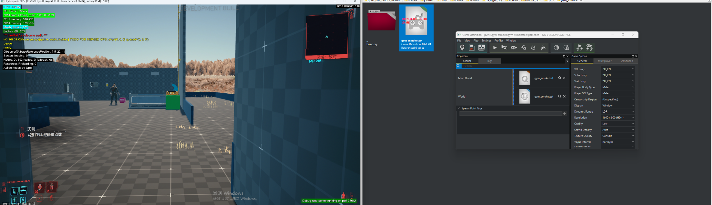
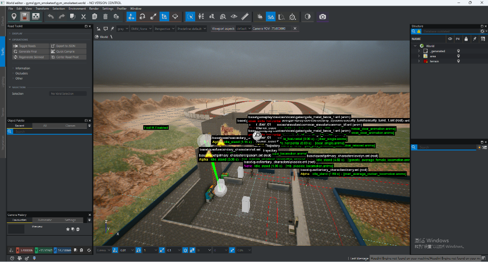
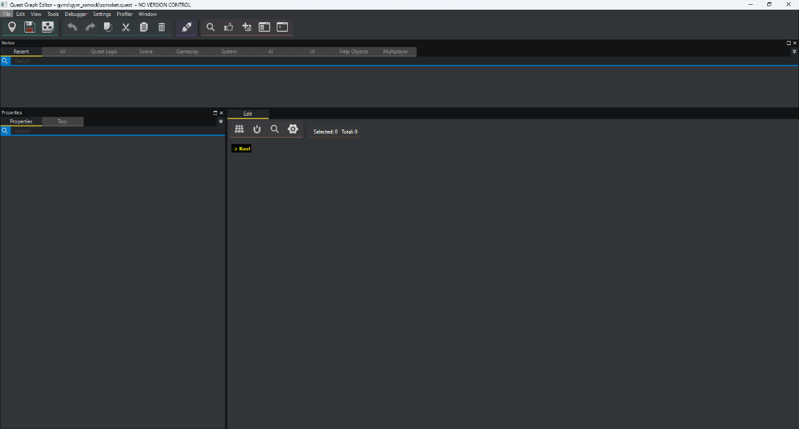

# 在RedEngine下完整创建一个Quest任务

## 创建gamedef并绑定World|Quest
创建一个 **gym_ssmoketest**.gamedef文件

---



将创建出的 gamedef文件绑定已有的 .world|.quest文件
* .World资产中包含整个当前任务的地图测试

* .quest资产包含给游戏叙事设计师使用的任务流程编辑器



```plantuml
@startuml Cyberpunk2077_Asset_System
title 赛博朋克2077 核心资产体系类图
hide empty members

' 核心系统（顶层模块）
package "核心系统" {
  class 任务系统 <<System>> {
    核心功能：定义任务流程、阶段、关联规则
  }
  class 场景与过场动画 <<System>> {
    核心功能：管理过场、对话、场景版本
  }
  class 实体系统 <<System>> {
    核心功能：定义角色/物品/交互对象
  }
  class 世界构建 <<System>> {
    核心功能：构建游戏世界、分块加载、复用对象
  }
  class AI与行为 <<System>> {
    核心功能：控制NPC生成、行为、寻路
  }
  class 配置系统 <<System>> {
    核心功能：存储游戏数值、配置数据、脚本逻辑
  }
  class UI系统 <<System>> {
    核心功能：定义UI控件、图集、日志提示
  }
  class 美术资产 <<System>> {
    核心功能：提供视觉/特效/音频资源
  }
}

' 任务系统资产（一级资产）
package "任务系统资产" {
  class QuestFile <<Asset>> {
    后缀：.quest
    数量：2,435个
    功能：任务主文件，定义流程和逻辑
  }
  class QuestPhaseFile <<Asset>> {
    后缀：.questphase
    数量：5,714个
    功能：细化任务各阶段
  }
  class GameDefFile <<Asset>> {
    后缀：.gamedef
    数量：2,769个
    功能：关联任务、世界、生成点
  }
}

' 场景与过场动画资产
package "场景与过场动画资产" {
  class SceneFile <<Asset>> {
    后缀：.scene
    数量：13,630个
    功能：过场动画场景（对话/镜头/表演）
  }
  class SceneSolutionFile <<Asset>> {
    后缀：.scenesolution
    数量：6,768个
    功能：管理场景多版本（金版/补丁版）
  }
  class ScnLocJsonFile <<Asset>> {
    后缀：.scnlocjson
    数量：4,000个
    功能：场景本地化数据（字幕/翻译）
  }
}

' 实体系统资产
package "实体系统资产" {
  class EntFile <<Asset>> {
    后缀：.ent
    数量：22,099个
    功能：实体定义（角色/物品/交互对象）
  }
  class AppFile <<Asset>> {
    后缀：.app
    数量：2,610个
    功能：外观定义（服装/装备配置）
  }
  class RigFile <<Asset>> {
    后缀：.rig
    数量：2,261个
    功能：骨骼绑定文件
  }
}

' 世界构建资产
package "世界构建资产" {
  class WorldFile <<Asset>> {
    后缀：.world
    数量：少量
    功能：世界主文件（如夜之城）
  }
  class StreamingSectorFile <<Asset>> {
    后缀：.streamingsector
    数量：34,769个
    功能：流送扇区，世界分块加载
  }
  class PrefabFile <<Asset>> {
    后缀：.prefab
    数量：163,207个
    功能：预制件，可复用对象组合
  }
}

' AI与行为资产
package "AI与行为资产" {
  class CommunityFile <<Asset>> {
    后缀：.community
    数量：7,368个
    功能：NPC群组/社区定义
  }
  class WorkspotFile <<Asset>> {
    后缀：.workspot
    数量：5,649个
    功能：NPC交互位置（坐/站/工作）
  }
  class NavmeshFile <<Asset>> {
    后缀：.navmesh
    数量：8,695个
    功能：导航网格，AI寻路
  }
}

' 配置系统资产
package "配置系统资产" {
  class TweakFile <<Asset>> {
    后缀：.tweak
    数量：2,196个
    功能：TweakDB配置（数值/属性）
  }
  class JsonConfigFile <<Asset>> {
    后缀：.json
    数量：39,267个
    功能：各类配置数据
  }
  class ScriptFile <<Asset>> {
    后缀：.script
    数量：1,729个
    功能：游戏脚本逻辑
  }
}

' UI系统资产
package "UI系统资产" {
  class InkWidgetFile <<Asset>> {
    后缀：.inkwidget
    数量：2,118个
    功能：UI控件定义
  }
  class InkAtlasFile <<Asset>> {
    后缀：.inkatlas
    数量：1,410个
    功能：UI图集资源
  }
  class JournalFile <<Asset>> {
    后缀：.journal
    数量：1,417个
    功能：日志/任务提示/数据库条目
  }
}

' 美术资产（三级资产）
package "美术资产" {
  ' 视觉资源
  class MeshFile <<Asset>> {
    后缀：.mesh
    数量：143,713个
    功能：3D模型
  }
  class XbmFile <<Asset>> {
    后缀：.xbm
    数量：165,704个
    功能：贴图文件
  }
  class MiFile <<Asset>> {
    后缀：.mi
    数量：11,659个
    功能：材质实例
  }
  class AnimsFile <<Asset>> {
    后缀：.anims
    数量：20,450个
    功能：动画文件
  }
  
  ' 特效系统
  class ParticleFile <<Asset>> {
    后缀：.particle
    数量：6,846个
    功能：粒子效果
  }
  class EffectFile <<Asset>> {
    后缀：.effect
    数量：5,366个
    功能：特效定义
  }
  class EnvProbeFile <<Asset>> {
    后缀：.envprobe
    数量：15,458个
    功能：环境探头（光照）
  }
  
  ' 音频资源
  class WemFile <<Asset>> {
    后缀：.wem
    数量：281,359个
    功能：Wwise音频文件
  }
  class CdprSubtitleFile <<Asset>> {
    后缀：.cdprsubtitle
    数量：58,006个
    功能：字幕文件
  }
  class OpusPakFile <<Asset>> {
    后缀：.opuspak
    数量：1,442个
    功能：音频打包文件
  }
}

' 系统与资产关联（聚合关系：系统包含资产）
任务系统 o-- { QuestFile, QuestPhaseFile, GameDefFile }
场景与过场动画 o-- { SceneFile, SceneSolutionFile, ScnLocJsonFile }
实体系统 o-- { EntFile, AppFile, RigFile }
世界构建 o-- { WorldFile, StreamingSectorFile, PrefabFile }
AI与行为 o-- { CommunityFile, WorkspotFile, NavmeshFile }
配置系统 o-- { TweakFile, JsonConfigFile, ScriptFile }
UI系统 o-- { InkWidgetFile, InkAtlasFile, JournalFile }
美术资产 o-- { MeshFile, XbmFile, MiFile, AnimsFile, ParticleFile, EffectFile, EnvProbeFile, WemFile, CdprSubtitleFile, OpusPakFile }

' 资产间依赖关系（关联关系）
QuestFile -- QuestPhaseFile : 1对多（任务包含多个阶段）
QuestFile -- GameDefFile : 1对1（任务关联对应游戏定义）
EntFile -- AppFile : 引用（实体引用外观）
EntFile -- RigFile : 引用（实体引用骨骼）
WorldFile -- StreamingSectorFile : 1对多（世界包含多个流送扇区）
WorldFile -- PrefabFile : 引用（世界使用预制件）
SceneFile -- SceneSolutionFile : 1对多（场景对应多个版本解决方案）
SceneFile -- ScnLocJsonFile : 1对1（场景关联本地化数据）

@enduml
```


 ```plantuml
@startuml 游戏资产重要性金字塔

' 第1层：核心玩法层（5星，最顶层，宽度最窄）
rectangle "⭐⭐⭐⭐⭐ 核心玩法层" #FFE4E1  {
    label ".quest .scene .ent .world"
    label "(必须有才能玩)" #666666
    
}

' 第2层：内容制作层（4星，宽度略宽）
rectangle "⭐⭐⭐⭐ 内容制作层" #FFEBCD {
    label ".questphase .prefab .community .wem"
    label "(决定游戏内容丰富度)" #666666
    
}

' 第3层：系统支撑层（3星，宽度更广）
rectangle "⭐⭐⭐ 系统支撑层" #F0FFF0 {
    label ".tweak .app .navmesh .streamingsector"
    label "(保证系统正常运行)" #666666
}

' 第4层：视觉呈现层（2星，宽度更宽）
rectangle "⭐⭐ 视觉呈现层" #E6F3FF {
    label ".mesh .xbm .particle .anims"
    label "(提升视觉质量)" #666666
}

' 第5层：辅助资源层（1星，最底层，宽度最宽）
rectangle "⭐ 辅助资源层" #F8F8FF {
    label ".json .csv .config .txt"
    label "(配置和文档)" #666666
}

' 用箭头连接，体现层级关系（从上到下重要性递减）
[⭐⭐⭐⭐⭐ 核心玩法层] -[hidden]-> [⭐⭐⭐⭐ 内容制作层]
[⭐⭐⭐⭐ 内容制作层] -[hidden]-> [⭐⭐⭐ 系统支撑层]
[⭐⭐⭐ 系统支撑层] -[hidden]-> [⭐⭐ 视觉呈现层]
[⭐⭐ 视觉呈现层] -[hidden]-> [⭐ 辅助资源层]

' 标题标注
title 游戏资产重要性金字塔（越顶层越核心）
@enduml
```


## 资源数量
  核心资产分类

  音视频资源：
  - 音频文件（.wem）: 281,359 个
  - 字幕文件（.cdprsubtitle）: 58,006 个

  图形资源：
  - 贴图文件（.xbm）: 165,704 个
  - 3D模型（.mesh）: 143,713 个
  - 材质实例（.mi）: 11,659 个
  - 粒子效果（.particle）: 6,846 个
  - 特效（.effect）: 5,366 个

  游戏逻辑：
  - 预制件（.prefab）: 163,207 个
  - 场景文件（.scene）: 13,630 个
  - 任务文件（.quest）: 2,435 个
  - 任务阶段（.questphase）: 5,714 个
  - 场景方案（.scenesolution）: 6,768 个
  - 实体定义（.ent）: 22,099 个
  - 社区定义（.community）: 7,368 个

  代码文件：
  - 脚本文件（.script）: 1,729 个（r6/scripts目录）
  - C++源文件（.cpp）: 13,585 个
  - C++头文件（.h）: 20,769 个
  - JSON配置: 39,267 个

  世界构建：
  - 流送扇区（.streamingsector）: 34,769 个
  - 地形遮罩（.mlmask）: 34,702 个
  - 地形设置（.mlsetup）: 25,136 个
  - 导航网格（.navmesh）: 8,695 个
  - 工作点（.workspot）: 5,649 个