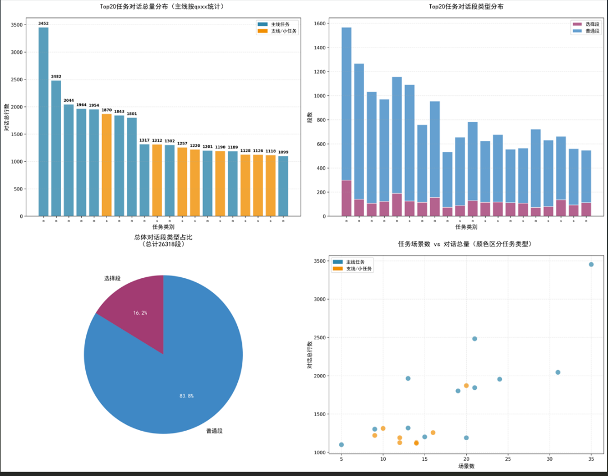

# 2077游戏工作量统计


## 资产分类
  🎮 一、核心资产 (最重要)

  1. 任务系统

  - .quest (174个) - 任务主文件,定义任务流程和逻辑
  - .questphase (616个) - 任务阶段定义,细化任务的各个阶段
  - .gamedef (177个) - 游戏定义文件,关联任务、世界、生成点等

  示例: sq004_riders_on_the_storm.quest + sq004_riders_on_the_storm.questphase + sq004_riders_on_the_storm.gamedef

  2. 场景与过场动画

  - .scene (361个) - 过场动画场景,包含对话、镜头、角色表演
  - .scenesolution (361个) - 场景解决方案,管理场景的多个版本(金版/补丁版)
  - .scnlocjson (361个) - 场景本地化数据(字幕、翻译)

  特点: 包含versions目录保存不同补丁版本(gold/patch0/patch1_2)

  3. 实体系统

  - .ent (2599个) - 实体定义文件,角色/物品/交互对象的核心
  - .app (18个) - 特殊外观定义,角色的服装/装备配置


  关系: .ent 引用 .app (外观) + .rig (骨骼) + 各种组件

  4. 世界构建

  - .world (少量但极重要) - 世界主文件,如 03_night_city.world
  - .streamingsector (34,769个) - 流送扇区,世界分块加载单元
  - .prefab (163,207个) - 预制件,场景中可复用的对象组合

   ```mermaid
graph 
    %% 原有关系保留
    A[.quest<br/>174] ---|组合| B[.questphase<br/> 861个 ]
    A ---|关联| C[.gamedef<br/>177
    ]
    C ---|关联| D[.world<br/>少量]
    E[.ent交互对象<br/>3206]

    E -->|关联| H[.prefab<br/>100195]
    D -->|包含| I[.streamingsector<br/>]
    D -->|引用| H
    J[.scene<br/>] -->|版本管理| K[.scenesolution<br/>622个]
    J -->|本地化| L[.scnlocjson<br/>]
    
    %% 新增核心引用：.questphase → .scenesolution
    B -->|触发场景（指定版本）| K
    %% 补充逻辑：.scenesolution 关联 .scene（明确版本映射）
    K -->|映射对应版本| J
  ```


  📊 资产重要性
  


  🎯 工作量评估关键指标

  要统计开发工作量，建议重点关注：


  这就是《赛博朋克2077》的完整数据资产蓝图！🎮

----
## Quest、Scene系统统计

  一、Quest文件、Scene基础统计


  | 目录                  | Quest文件 | QuestPhase文件 | Scene文件 | 备注          |
  | --------------------- | --------- | -------------- | --------- | ------------- |
  | Side Quests (支线)    | 27        | 263            | 189       | side_quests/  |
  | Main Quests (主线)    | 26        | 430            | 344       | main_quests/  |
  | Minor Quests (小任务) | 39        | 168            | 129       | minor_quests/ |
  | 总计                  | 87        | 861            | 622       | -             |
  
  主线分阶段统计
  
  | 分类 | 任务数 | Quest文件 | Scene场景 | QuestPhase | 平均Scene/任务 |
  | ---- | ------ | --------- | --------- | ---------- | -------------- |
  | 序章 | 5      | 9         | 103       | 129        | 20.6           |
  | 主线 | 10     | 13        | 207       | 277        | 18.8           |
  | 结局 | 5      | 4         | 34       | 24         | 6.8           |
  | 总计 | 20     | 26        | 344     | 430        | 46.2           |

  二、Quest复杂度对比


  任务文件夹数量：
  - 主线任务组：22个任务文件夹
  - 支线任务组：18个任务文件夹
  - 小任务组：44个任务文件夹
  
### 《赛博朋克2077》任务资产工作量统计



  🎮 一、序章任务 (Prologue - q00x)


  | quest_category         | task_type | scene_count | choice_sections | normal_sections | total_sections | total_lines | avg_sections_per_scene | avg_lines_per_scene | choice_ratio | 复杂度评级        |
  | ---------------------- | --------- | ----------- | --------------- | --------------- | -------------- | ----------- | ---------------------- | ------------------- | ------------ |---|
 |main_quests/prologue/q000	|主线任务|24	|189	|967	|1156	|1954	|48.17	|81.42	|16.35%|  ⭐⭐⭐⭐⭐ 超大型 |
 |main_quests/prologue/q001	|主线任务|29	|75	|447	|522	|855	|18|	29.48	|14.37%| ⭐⭐⭐⭐⭐ 超大型 |
 |main_quests/prologue/q003	|主线任务|20	|72|	650	|722	|1189	|36.1	|59.45	|9.97%|  ⭐⭐⭐⭐ 大型     |
 |main_quests/prologue/q004	|主线任务|9	|93|	382	|475	|1007|	52.78|	111.89	|19.58%|  ⭐⭐⭐ 中型       |
 |main_quests/prologue/q005	|主线任务|13|	122	|848	|970	|1964	|74.62	|151.08	|12.58%|  ⭐⭐⭐⭐⭐ 超大型 |
 

  序章分析：
  - 平均每个任务：53个Scene，26.2个QuestPhase
  - q000和q001是最复杂的序章任务（包含3条出身路线）
  - q005"劫案"是序章高潮，包含35个QuestPhase（多分支设计）

  ---
  ⚔️ 二、主线任务 (Part 1 - q1xx)


  | quest_category         | task_type | scene_count | choice_sections | normal_sections | total_sections总section | total_lines总对话行数 | avg_sections_per_scene 每个场景的平均段数 | avg_lines_per_scene每个场景的平均对话行数 | choice_ratio          | 复杂度评级        |
  | ---------------------- | --------- | ----------- | --------------- | --------------- | ----------------------- | --------------------- | ----------------------------------------- | ----------------------------------------- | --------------------- | ----------------- |
  | main_quests/part1/q105 | 主线任务  | 35          | 298             | 1269            | 1567                    | 3452                  | 44.77          （1567/35）                | 98.63    （3452/35）                      | 19.02%   （1567/298） | ⭐⭐⭐⭐ 大型     |
  | main_quests/part1/q115 | 主线任务  | 21          | 140             | 1126            | 1266                    | 2482                  | 60.29                                     | 118.19                                    | 11.06%                | ⭐⭐⭐ 中型       |
  | main_quests/part1/q110 | 主线任务  | 31          | 107             | 926             | 1033                    | 2044                  | 33.32                                     | 65.94                                     | 10.36%                | ⭐⭐⭐ 中型       |
  | main_quests/part1/q114 | 主线任务  | 21          | 115             | 644             | 759                     | 1843                  | 36.14                                     | 87.76                                     | 15.15%                | ⭐⭐⭐⭐⭐ 超大型 |
  | main_quests/part1/q112 | 主线任务  | 19          | 156             | 798             | 954                     | 1801                  | 50.21                                     | 94.79                                     | 16.35%                | ⭐⭐⭐⭐ 大型     |
  | main_quests/part1/q104 | 主线任务  | 13          | 73              | 460             | 533                     | 1317                  | 41                                        | 101.31                                    | 13.70%                | ⭐⭐⭐⭐⭐ 超大型 |
  | main_quests/part1/q113 | 主线任务  | 11          | 43              | 476             | 519                     | 917                   | 47.18                                     | 83.36                                     | 8.29%                 | ⭐⭐⭐⭐ 大型     |
  | main_quests/part1/q101 | 主线任务  | 15          | 76              | 454             | 530                     | 984                   | 35.33                                     | 65.6                                      | 14.34%                | ⭐⭐⭐ 中型       |
  | main_quests/part1/q116 | 主线任务  | 5           | 112             | 435             | 547                     | 1099                  | 109.4                                     | 219.8                                     | 20.48%                | ⭐⭐⭐⭐⭐ 超大型 |
  | main_quests/part1/q103 | 主线任务  | 15          | 112             | 443             | 555                     | 1201                  | 37                                        | 80.07                                     | 20.18%                | ⭐⭐⭐⭐⭐ 超大型 |
  | main_quests/part1/q108 | 主线任务  | 21          | 77              | 380             | 457                     | 801                   | 21.76                                     | 38.14                                     | 16.85%                | ⭐⭐⭐ 中型       |
  

  主线分析：
  - 平均每个任务：49.8个Scene，25.3个QuestPhase
  - q105和q110是最复杂的主线任务（分别92和90个Scene）
  - q114"鬼镇"虽然只有1个Quest但有42个QuestPhase（流浪者主线）
  - q115"夜曲"是分支点，q116是终局任务（相对简短）

  ---
 🏁 三、终章任务 (Epilogue - q2xx)


  
  | quest_category            | task_type | scene_count | choice_sections | normal_sections | total_sections | total_lines | avg_sections_per_scene | avg_lines_per_scene | choice_ratio | 复杂度评级  |
  | ------------------------- | --------- | ----------- | --------------- | --------------- | -------------- | ----------- | ---------------------- | ------------------- | ------------ | ----------- |
  | main_quests/epilogue/q201 | 主线任务  | 9           | 129             | 654             | 783            | 1302        | 87                     | 144.67              | 16.48%       | ⭐⭐⭐ 中型 |
  | main_quests/epilogue/q202 | 主线任务  | 4           | 43              | 346             | 389            | 745         | 97.25                  | 186.25              | 11.05%       | ⭐⭐ 小型   |
  | main_quests/epilogue/q203 | 主线任务  | 10          | 130             | 401             | 531            | 1058        | 53.1                   | 105.8               | 24.48%       | ⭐⭐⭐ 中型 |
  | main_quests/epilogue/q204 | 主线任务  | 10          | 73              | 278             | 351            | 748         | 35.1                   | 74.8                | 20.80%       | ⭐⭐⭐ 中型 |
  | 终章小计                  | 4         | 33          | 375             | 1679            | 2054           | 3853        |                        |                     |              |             |


  ---

  💝 四、支线任务 (Side Quests - sqxxx)


| 任务类别          | 任务类型 | 场景数 | 选择段 | 普通段 | 总段数 | 平均每场景段数（avg_sections_per_scene） | 平均每场景对话数（avg_lines_per_scene） | 选择段占比（choice_ratio） | 复杂度评级    |
| ----------------- | -------- | ------ | ------ | ------ | ------ | -------------------------- | ----------------- | -------------------------- | ------------- |
| side_quests/sq004 | 支线     | 9      | 59     | 431    | 490    | 54.44                                    | 101.33                                  | 12.04%                     | ⭐⭐ 小型     |
| side_quests/sq006 | 支线     | 10     | 67     | 251    | 318    | 31.80                                    | 78.20                                   | 21.07%                     | ⭐⭐ 小型     |
| side_quests/sq011 | 支线     | 10     | 88     | 567    | 655    | 65.50                                    | 131.20                                  | 13.44%                     | ⭐⭐ 小型     |
| side_quests/sq012 | 支线     | 12     | 108    | 456    | 564    | 47.00                                    | 99.17                                   | 19.15%                     | ⭐⭐⭐ 中型   |
| side_quests/sq017 | 支线     | 14     | 80     | 551    | 631    | 45.07                                    | 80.57                                   | 12.68%                     | ⭐⭐ 小型     |
| side_quests/sq018 | 支线     | 11     | 73     | 279    | 352    | 32.00                                    | 63.09                                   | 20.74%                     | ⭐⭐ 小型     |
| side_quests/sq021 | 支线     | 12     | 136    | 526    | 662    | 55.17                                    | 93.83                                   | 20.54%                     | ⭐⭐⭐ 中型   |
| side_quests/sq023 | 支线     | 9      | 117    | 559    | 676    | 75.11                                    | 135.56                                  | 17.31%                     | ⭐⭐ 小型     |
| side_quests/sq024 | 支线     | 12     | 60     | 315    | 375    | 31.25                                    | 71.50                                   | 16.00%                     | ⭐⭐ 小型     |
| side_quests/sq025 | 支线     | 10     | 41     | 230    | 271    | 27.10                                    | 58.10                                   | 15.13%                     | ⭐⭐ 小型     |
| side_quests/sq026 | 支线     | 16     | 115    | 509    | 624    | 39.00                                    | 78.56                                   | 18.43%                     | ⭐⭐⭐ 中型   |
| side_quests/sq027 | 支线     | 20     | 125    | 966    | 1091   | 54.55                                    | 93.50                                   | 11.46%                     | ⭐⭐⭐⭐ 大型 |
| side_quests/sq028 | 支线     | 10     | 31     | 158    | 189    | 18.90                                    | 36.10                                   | 16.40%                     | ⭐ 超小型     |
| side_quests/sq029 | 支线     | 7      | 72     | 414    | 486    | 69.43                                    | 132.14                                  | 14.81%                     | ⭐ 超小型     |
| side_quests/sq030 | 支线     | 9      | 98     | 390    | 488    | 54.22                                    | 103.67                                  | 20.08%                     | ⭐⭐ 小型     |
| side_quests/sq031 | 支线     | 14     | 93     | 467    | 560    | 40.00                                    | 79.86                                   | 16.61%                     | ⭐⭐⭐ 中型   |
| side_quests/sq032 | 支线     | 6      | 74     | 262    | 336    | 56.00                                    | 111.83                                  | 22.02%                     | ⭐ 超小型     |


  支线分析：
  - 平均每个任务：1.3个Quest，31.5个Scene，15.9个QuestPhase
  - sq027"公路女王"是最复杂的支线（68个Scene）
  - 大部分支线任务只有1个Quest文件但配备15-20个QuestPhase
~~~
  案例1: SQ004（支线任务"Riders on the Storm"）
  📁 sq004_riders_on_the_storm/
  ├── sq004_riders_quest.quest  # 主任务文件
  ├── sq004_riders_on_the_storm.questphase  # 主阶段文件
  ├── phases/ (15个子questphase)              # 任务细分阶段
  │   ├── sq004_01_community.questphase
  │   ├── sq004_02_drive.questphase
  │   ├── sq004_03_raffen_shiv_camp.questphase
  │   ├── sq004_04_chase.questphase
  │   ├── sq004_05_farm.questphase
  │   └── combat/ (7个战斗相关phase)
  └── scenes/ (31个scene文件)                # 31段过场动画/对话

  案例2: Q115（主线任务"Nocturne Op55N1"）
  📁 q115_afterlife/
  ├── 50个scene文件（大型主线任务）
  ├── 22个questphase文件
  └── 包含多个剧情分支和过场动画
~~~
  ---


  📈 五、总体统计汇总

  复杂度分级统计

  | 复杂度等级        | 任务数量 | 代表任务                                        |
  | ----------------- | -------- | ----------------------------------------------- |
  | ⭐⭐⭐⭐⭐ 超大型 | 8个      | q000, q001, q005, q105, q110, q114, q115, sq027 |
  | ⭐⭐⭐⭐ 大型     | 5个      | q003, q101, q108, q112, sq021                   |
  | ⭐⭐⭐ 中型       | 14个     | q004, q103, q104, q113, q116, sq004等           |
  | ⭐⭐ 小型         | 2个      | sq028, sq029                                    |
  |                   |          |                                                 |
----

### Section、Choice Scetion数据统计

#### Section、Choice Scetion 是对话数据资产中和核心内容负责传达剧情和获取玩家选则的重要部分

  📊 《赛博朋克2077》Section、Choice Scetion统计总览

  🎯 全游戏数据汇总(去除无Section scene)

  | 统计项        | 数值       |
  |------------|----------|
  | 总Scene数    | 518      |
  | 总对话数       | 45,548 行 |
  | 总选择数       | 3,622 个  |
  | 平均对话/Scene | 87.9 行   |

  📈 各章节对比(去除无Section scene)
  | 章节               | Scene数 | 对话数    | choice数   | 平均对话/Scene行数文本  |
  |------------------|--------|--------|-------|------------|
  | 序章 (Prologue)    | 91     | 6,949  | 551   | 76.4       |
  | 主线第一章 (Part 1)   | 206    | 17,896 | 1,293 | 86.9       |
  | 终章 (Epilogue)    | 33     | 3,853  | 375   | 116.8 ⭐    |
  | 支线 (Side Quests) | 188    | 16,850 | 1,403 | 89.6       |

  🏆 对话最多的任务 TOP 10

  | 排名 | 任务代码           | 对话数 | choice数 | 平均对话/Scene行数文本 |
  | ---- | ------------------ | --------- | -------- | -------------- |
  | 1    | q116 (永生/神舆)   | 1,099     | 112      | 219.8 🔥      |
  | 2    | q115 (夜曲 Op55N1) | 2,482     | 140      | 118.2          |
  | 3    | q005 (劫案)        | 1,964     | 122      | 151.1          |
  | 4    | q000 (三个出身)    | 1,954     | 189      | 81.4           |
  | 5    | q112 (搜索与摧毁)  | 1,801     | 156      | 94.8           |
  | 6    | q114 (鬼镇)        | 1,798     | 99       | 89.9           |
  | 7    | q027 (公路女王)    | 1,804     | 97       | 94.9           |
  | 8    | q104 (强尼黑梦)    | 1,317     | 73       | 101.3          |
  | 9    | q011 (无上尊崇)    | 1,312     | 88       | 131.2          |
  | 10   | q201 (终章结局1)   | 1,302     | 129      | 144.7          |

  

  🎭 选择最多的任务 TOP 5

  | 排名 | 任务代码     | 对话数 | 可获取choice数 |
  | ---- | ------------ | --------- | -------- |
  | 1    | q105         | 298       | 3,452    |
  | 2    | q000         | 189       | 1,954    |
  | 3    | q112         | 156       | 1,801    |
  | 4    | q115         | 140       | 2,482    |
  | 5    | sq021 (狩猎) | 136       | 1,126    |


  1. 对话密度最高：q116终局任务平均每scene 219.8行对话，是全游戏最密集的
  2. 最大单任务：q105主线任务包含3,452行对话和298个选择分支
  3. 终章特点：虽然scene数量少(33)，但平均对话密度最高(116.8)
  4. 支线丰富度：支线任务包含1,403个选择，占全游戏38.7%


2. Top10 Section量最高scene

| 排名 | 场景名称                   | 任务类型     | 对话行数 | 说话人数量 | 核心说话人                            |
| ---- | -------------------------- | ------------ | -------- | ---------- | ------------------------------------- |
| 1    | q116_05_mikoshi            | main_quests  | 814      | 3          | alt、johnny、v                        |
| 2    | q202_05_convoy             | main_quests  | 434      | 8          | carol、cassidy、judy、kerry、panam 等 |
| 3    | q105_03c_dollhouse_woodman | main_quests  | 422      | 3          | johnny、v、woodman                    |
| 4    | q115_02b_ripperdoc_roof    | main_quests  | 378      | 8          | V_POSESSED、johnny、judy、kerry 等    |
| 5    | mq037_01_brendan_scenes    | minor_quests | 321      | 6          | Brendan、Theo、v 等                   |
| 6    | sq029_04a_dinner           | side_quests  | 304      | 6          | dorian、johnny、joss、v 等            |
| 7    | sq021_01_hook              | side_quests  | 301      | 8          | johnny、sobchak、v 等                 |
| 8    | q115_00b_hanako            | main_quests  | 291      | 7          | hanako、johnny、v 等                  |
| 9    | q101_08_takemura_v_room    | main_quests  | 291      | 4          | johnny、takemura、v                   |
| 10   | sq023_07_restaurant        | side_quests  | 290      | 5          | johnny、joshua、rachel、v             |

3. scene中对话量统计


---

  🎯 关键发现

  1. 序章投入最大：q000和q001合计146个Scene（占序章55%）
  2. 主线峰值：q105和q110合计182个Scene（占主线33%）
  3. 支线精品：sq027"公路女王"有68个Scene，接近主线任务水平
  4. 分支设计：每个quest含有多个Questphase但是通常只有一个.quest高度的模块化设计（Q114有42个QuestPhase但只1个Quest）
  5. 终局简洁：q20*终局任务相对简短（94个Scene）

  ### 动画数据

  | 目录         | .anims数量 | 功能说明        |
  |------------|----------|-------------|
  | npc/       | 2,462    | NPC角色动画（最多） |
  | quest/     | 1,685    | 任务专属动画      |
  | items/     | 230      | 物品动画        |
  | weapon/    | 204      | 武器动画        |
  | vehicle/   | 177      | 载具动画        |
  | player/    | 113      | 玩家角色动画      |
  | synced/    | 77       | 同步动画（多角色）   |
  | facial/    | 55       | 面部表情动画      |
  | cyberware/ | 45       | 义体动画        |
  | ui/        | 19       | UI界面动画      |
  | 其他         | 97       | E3演示、营销等    |

  🎭 一、NPC 动画系统（2,462个）

  结构：按角色原型分类
  - corpo_female/male - 公司职员（男女）
  - dirtboy - 街头小混混
  - dirtboy_big - 体型较大的街头角色
  - dirtboy_child - 儿童角色

  每个原型包含：
  - interactive_scene/ - 交互场景动画
  - open_world/ - 开放世界动画
  - locomotion/ - 移动动画

  | 分类                        | 数量    | 占比    | 说明      |
  |---------------------------|-------|-------|---------|
  | generic_characters 通用角色   | 1,350 | 54.8% | 群众NPC   |
  | gameplay 玩法角色             | 710   | 28.8% | 特殊玩法NPC |
  | main_characters 主要角色      | 213   | 8.7%  | 剧情主角    |
  | archetype_characters 原型角色 | 189   | 7.7%  | 角色原型模板  |


  二、Quest 任务动画详细分类（1,685个）

  | 任务类型             | 数量    | 占比    | 说明     |
  |------------------|-------|-------|--------|
  | main_quests 主线任务 | 1,150 | 68.3% | 主线剧情动画 |
  | side_quests 支线任务 | 508   | 30.1% | 支线剧情动画 |
  | sts_quests STS任务 | 15    | 0.9%  | 特殊任务系统 |
  | minor_quests 小任务 | 12    | 0.7%  | 小型任务   |
  | lore 传说          | 0     | 0%    | 背景故事   |

 🤝 七、Synced 同步动画分类（77个）

  | 类型                  | 说明       |
  |---------------------|----------|
  | encounter_workspots | 遭遇战工作点   |
  | lore                | 背景故事同步动画 |
  | police_system       | 警察系统同步动画 |
  🎮 二、玩家动画系统（113个）

  分类：
  - female/ - 女性V动画  ||- male/ - 男性V动画（对应结构）
    - player_exploration.anims - 探索动画
    - player_locomotion.anims - 移动动画
    - player_locomotion_box.anims - 特殊移动（箱子）
    - player_locomotion_johnny_guitar.anims - Johnny弹吉他动画
    - player_locomotion_sandstorm.anims - 沙尘暴中移动
    - player_exploration.anims - 探索动画
    - player_locomotion.anims - 移动动画
    - player_locomotion_box.anims - 特殊移动（箱子）
    - player_locomotion_johnny_guitar.anims - Johnny弹吉他动画
    - player_locomotion_sandstorm.anims - 沙尘暴中移动
  - interactive_scene/ - 交互场景（男女共用）

  四、面部表情系统

| 分类     | 表情                                                                       |
| -------- | -------------------------------------------------------------------------- |
| 物理状态 | 用力(exertion)、疼痛(pain)、疲惫(tiredness)、昏迷(unconscious)、死亡(dead) |
| 情绪状态 | 愤怒(anger)、攻击性(aggression)、悲伤(sadness)、失望(disappointed)         |
| 正面情绪 | 快乐(joy/happy)、惊喜(surprise)、感兴趣(interested)                        |
| 负面情绪 | 恐惧(fear)、紧张(nervous)、厌恶(disgust)                                   |
| 中性状态 | 中立(neutral)、冷漠(disinterested)                                         |


| 分类名称               | 包含文件数量 | 核心文件示例                                                                                 | 分类说明                                                                   |
| ---------------------- | ------------ | -------------------------------------------------------------------------------------------- | -------------------------------------------------------------------------- |
| 基础面部动画（facial） | 1            | facial_01.anims                                                                              | 根目录下的基础面部动画文件，无细分场景/角色                                |
| 女性通用面部动画       | 8            | generic_average_female_facial_gestures.anims、generic_average_female_facial_idle.anims       | 面向普通女性角色，包含互动场景的手势、待机、过渡等通用面部动画             |
| 男性通用面部动画       | 8            | generic_average_male_facial_custom_animations.anims、e3_male_average_custom_animations.anims | 面向普通男性角色，涵盖定制、手势、待机等互动场景通用面部动画               |
| 游戏玩法面部动画       | 3            | face_gang_hammer_action.anims、face_reaction_base.anims、face_environmental_takedowns.anims  | 适配游戏核心玩法，包含帮派动作、基础反应、环境击倒等场景的面部动画         |
| 主角专属面部动画       | 16           | johnny__facial_idle.anims、panam_facial_custom_animations.anims、judy_facial_idle.anims      | 针对游戏主要角色（如强尼、帕南、朱迪等），定制的待机、专属动作面部动画     |
| 任务定制面部动画       | 19           | alt__facial_custom_animations.anims、dex_facial.anims、q003_intro_01_diner__v_facial.anims   | 绑定特定任务（如q003、q101）或任务专属角色（如德克斯特、罗伊斯）的面部动画 |


1. 分类优先级：先按“角色类型（通用/专属）”划分，再按“使用场景（游戏玩法/任务定制）”细分，确保逻辑连贯。
2. 无重复归类：每个文件仅归属一个分类，分类依据为路径中最具业务含义的二级/三级目录（如 `main_characters` 对应主角、`quest_custom` 对应任务定制）。

  五、自动生成动画

  程序生成/混合动画的命名模式：
  - *_poses.anims - 姿态混合系统
  - *_idle*.anims - 待机循环动画
  - *_generic*.anims - 通用动画模板
  - facial_idle_poses - 面部表情程序化系统

  手工制作动画的命名模式：
  - player_locomotion - 具体动作名称
  - combat_melee - 特定游戏场景
  - npc_*_scene_* - 剧情场景专用


  ---

  
  🔧 二、关键资产

  1、Prefab 预制体分布（100,195个）

  总计：100,195 个 Prefab 文件

  🏙️ 城市六大区域

  | 区域    | 英文名           | Prefab数量 | 占比    |
  |-------|---------------|----------|-------|
  | 沃森区   | Watson        | 8,008    | 8.0%  |
  | 西溪区   | Westbrook     | 4,954    | 4.9%  |
  | 海伍德区  | Heywood       | 4,843    | 4.8%  |
  | 圣多明戈区 | Santo Domingo | 3,997    | 4.0%  |
  | 市中心   | City Center   | 3,441    | 3.4%  |
  | 太平洲   | Pacifica      | 2,267    | 2.3%  |
  | 小计    | -             | 27,510   | 27.5% |

  | 区域         | Prefab数量 | 占比    | 说明     |
  |------------|----------|-------|--------|
  | _generated | 58,656   | 58.5% | 程序生成内容 |
  | _global    | 5,470    | 5.5%  | 全局共享资源 |
  | _external  | 4,117    | 4.1%  | 外部引用资源 |
  | 小计         | 68,243   | 68.1% | -      |


  | 目录          | 数量      | 占比     | 说明      |
  |-------------|---------|--------|---------|
  | Prefabs     | 27,117  | 20.0%  | 通用预制体库  |
  | Open_World  | 3,653   | 2.7%   | 开放世界预制体 |
  | Environment | 1,832   | 1.3%   | 环境预制体   |
  | Quest       | 1,666   | 1.2%   | 任务专属预制体 |
  | Gameplay    | 447     | 0.3%   | 游戏玩法预制体 |
  | Vehicles    | 34      | 0.02%  | 载具预制体   |
  | Items       | 2       | 0.001% | 物品预制体   |
  | Characters  | 1       | 0.001% | 角色预制体   |
  | 其他          | 101,114 | 74.4%  | 其他各类预制体 |


  2、 Entity实体资产（可交互对象、AI、线索、容器）

  总计：3,206 个 Entity 文件

  | 子目录                       | Entity数量 | 占比    | 说明     |
  |---------------------------|----------|-------|--------|
  | Devices (设备)              | 2,577    | 80.4% | 游戏交互设备 |
  | Items (物品)                | 223      | 7.0%  | 游戏物品实体 |
  | Cyberware (义体)            | 20       | 0.6%  | 义体装备   |
  | Combat_Gadgets (战斗装备)     | 17       | 0.5%  | 战斗小工具  |
  | Archetype_Entities (原型实体) | 14       | 0.4%  | 实体原型   |
  | Vehicles (载具)             | 12       | 0.4%  | 载具实体   |
  | Containers (容器)           | 4        | 0.1%  | 容器物体   |
  | AI (人工智能)                 | 2        | 0.06% | AI对象   |
  | Focus_Clues (焦点线索)        | 2        | 0.06% | 线索系统   |
  | 其他                        | 335      | 10.4% | 其他玩法实体 |

  | 项目                 | 数量      | 说明          |
  |--------------------|---------|-------------|
  | Night City Prefabs | 100,195 | 整个开放世界预制体   |
  | Gameplay Entities  | 3,206   | 游戏玩法系统实体    |
  | 比例                 | 31:1    | 场景资源远多于玩法实体 |


  💡 重点：超过10万个预制体分布在其他目录（如worlds、streaming等）

  📊 资产重要性评级

  | 等级    | 资产类型                                             | 重要性说明     |
  |-------|--------------------------------------------------|-----------|
  | ⭐⭐⭐⭐⭐ | .quest, .scene, .ent, .world                     | 核心玩法,缺一不可 |
  | ⭐⭐⭐⭐  | .questphase, .scenesolution, .community, .prefab | 内容制作主力    |
  | ⭐⭐⭐   | .streamingsector, .workspot, .tweak, .app        | 系统支撑资产    |
  | ⭐⭐    | .mesh, .xbm, .mi, .particle                      | 视觉呈现资产    |
  | ⭐     | .wem, .json, .navmesh                            | 辅助资源      |

  🔗 资产关联关系图

  .gamedef (游戏定义)
     ├─ .quest (任务文件)
     │   └─ .questphase (任务阶段)
     │       └─ .scene (过场动画)
     │           ├─ .scenesolution (场景方案)
     │           └─ .scnlocjson (本地化)
     │
     ├─ .world (世界文件)
     │   └─ .streamingsector (流送扇区)
     │       └─ .prefab (预制件)
     │           └─ .ent (实体)
     │               ├─ .app (外观)
     │               ├─ .mesh (模型)
     │               └─ .rig (骨骼)
     │
     └─ .community (NPC群组)
         └─ .workspot (工作点)


---