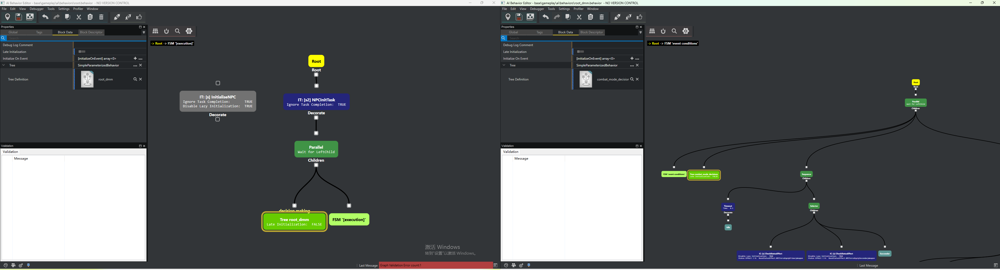
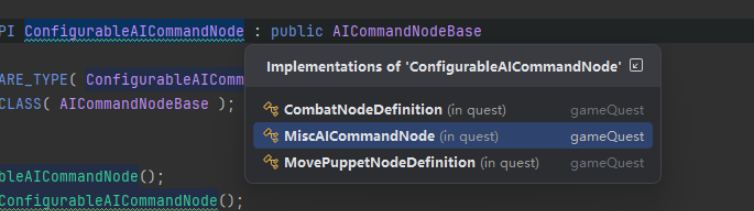
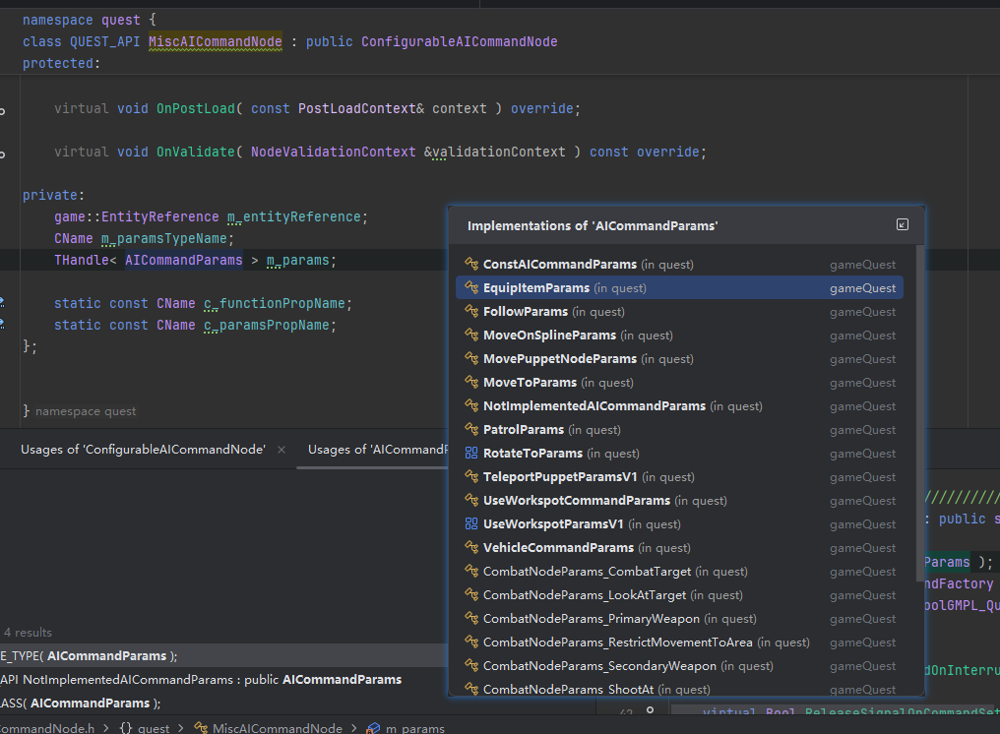
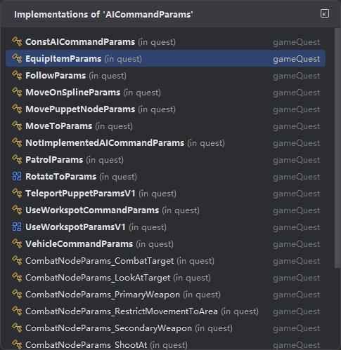
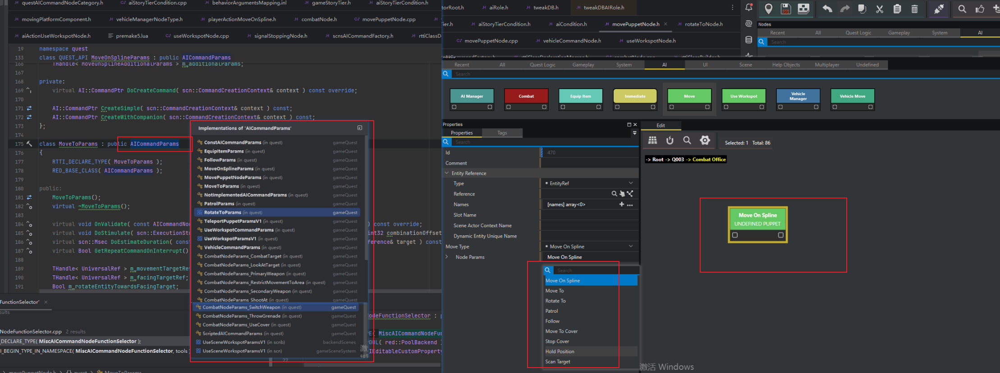
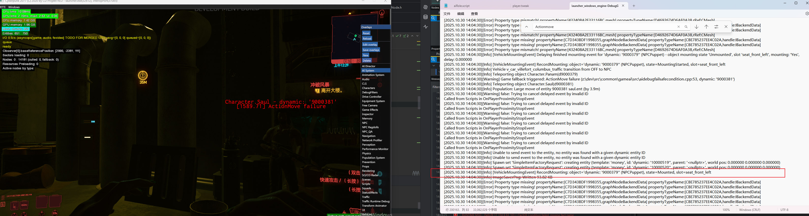

```plantuml
@startuml
digraph G {
    rankdir=TB;
    node [shape=box, style=filled, fillcolor=lightblue];
    
    root [label="根节点 (Brain/Selector)"];
    
    // Story分支
    story_cond [label="[Condition: IsInStoryTier(Cinematic)]", shape=diamond, fillcolor=lightgreen];
    story_branch [label="Story分支"];
    
    setup_cond [label="[Condition: IsStoryActionType(Setup)]", shape=diamond, fillcolor=lightgreen];
    setup_action [label="ExecuteSceneAnimationAction"];
    
    stop_cond [label="[Condition: IsStoryActionType(Stop)]", shape=diamond, fillcolor=lightgreen];
    stop_action [label="StopCurrentAction"];
    
    default_story [label="[Default]", shape=diamond, fillcolor=lightgreen];
    idle_cinematic [label="IdleInCinematicMode"];
    
    // Gameplay分支
    gameplay_cond [label="[Condition: IsInStoryTier(Gameplay)]", shape=diamond, fillcolor=lightgreen];
    gameplay_branch [label="Gameplay分支"];
    
    process_ai [label="ProcessAICommands → 处理AICommand队列"];
    combat_cmds [label="CombatCommands"];
    movement_cmds [label="MovementCommands"];
    workspot_cmds [label="WorkspotCommands"];
    other_cmds [label="..."];
    
    combat_ai [label="Combat AI AI::Role "];
    patrol_ai [label="Patrol AI AI::Role "];
    other_ai [label="..."];
    
    // 根节点到分支条件
    root -> story_cond;
    root -> gameplay_cond;
    
    // Story分支结构
    story_cond -> story_branch;
    story_branch -> setup_cond;
    story_branch -> stop_cond;
    story_branch -> default_story;
    
    setup_cond -> setup_action;
    stop_cond -> stop_action;
    default_story -> idle_cinematic;
    
    // Gameplay分支结构
    gameplay_cond -> gameplay_branch;
    gameplay_branch -> process_ai;
    gameplay_branch -> combat_ai;
    gameplay_branch -> patrol_ai;
    gameplay_branch -> other_ai;
    
    // ProcessAICommands子节点
    process_ai -> combat_cmds;
    process_ai -> movement_cmds;
    process_ai -> workspot_cmds;
    process_ai -> other_cmds;
}
@enduml
```

  Gameplay分支（IsInStoryTier==false）主要做的事情：

  1. ✅ 完整的AI自主决策系统（TweakAction）
  2. ✅ 状态管理和转换（Relaxed↔Alerted↔Combat等）
  3. ✅ 处理所有类型的AICommand
  4. ✅ 战斗系统完整运行（目标选择、掩体、射击、投掷等）
  5. ✅ 环境反应（恐惧、警觉、交通避让）
  6. ✅ 自主移动和导航
  7. ✅ 装备和动作管理
  8. ✅ 与玩家和世界的动态交互

  | 功能类别         | Gameplay | Cinematic | 代码依据                      |
  |--------------|----------|-----------|---------------------------|
  | 基础移动  (Move To)       | ✅        | ✅         | MoveOnSplineParams通用      |
  | Workspot动画   | ✅        | ✅         | GameplayAndCinematicAnims |
  | 传送           | ✅        | ✅         | TeleportPuppet通用          |
  | 外观更换         | ✅        | ✅         | AppearanceChange通用        |
  | Look At      | ✅        | ✅         | LookAt通用                  |
  | 装备物品         | ✅        | ✅         | EquipItem通用               |
  | 战斗命令         | ✅        | ❌         | Combat节点在Gameplay分支       |
  | 战斗动画         | ✅        | ❌         | GameplayOnlyAnims         |
  | 掩体系统         | ✅        | ❌         | UseCover在Combat节点         |
  | 射击命令         | ✅        | ❌         | ShootAt在Combat节点          |
  | 投掷手雷         | ✅        | ❌         | ThrowGrenade在Combat节点     |
  | 自主AI决策       | ✅        | ❌         | Brain节点切换分支               |
  | 巡逻逻辑         | ✅        | ❌         | Patrol在Gameplay分支         |
  | Locomotion动画 | ✅        | ❌         | GameplayOnlyAnims         |

  | 功能模块           | Gameplay分支      | Cinematic分支       |
  |----------------|-----------------|-------------------|
  | CommandHandler | ✅ 处理所有AICommand | ❌ 无CommandHandler |
  | TweakAction系统  | ✅ 完整AI决策        | ❌ 不运行             |
  | Combat系统       | ✅ 完整战斗逻辑        | ❌ 禁用              |
  | Reaction系统     | ✅ 响应环境刺激        | ❌ 禁用              |
  | 状态转换           | ✅ 自主状态机         | ❌ 固定状态            |
  | Workspot       | ✅ 通过AICommand   | ✅ Scene系统直接控制 (Scene Event )    |
  | 移动             | ✅ 自主导航+命令       | ⚠️ 仅Scene控制       |
  | 决策权            | ✅ AI自主决策        | ❌ 完全脚本控制          |

AICommandNodeBase

```plantuml
@startuml
' 节点类层次
abstract class SignalStoppingNodeDefinition {
  + 任务信号节点基类
}

abstract class AICommandNodeBase {
  + 纯虚方法: GetCommandParams() : AICommandParams*
  + 纯虚方法: GetEntityReference() : EntityReference
  + 具体方法: OnExecute()
  + 具体方法: CreateCommand()
  + 具体方法: OnCommandSuccess()
  + 具体方法: OnCommandFailure()
  + 具体方法: OnCommandCancelled()
  + 具体方法: OnCommandInterrupted()
  + AI命令节点抽象基类
}

abstract class ConfigurableAICommandNode {
  + 纯虚方法: GetFunctionPropName() : CName
  + 纯虚方法: GetParamsPropName() : CName
  + 纯虚方法: GetFunction() : CName
  + 纯虚方法: SetFunction(name)
  + 纯虚方法: SetParams(params)
  + 具体方法: UpdateParamsFromFunction(notify)
  + 具体方法: UpdateFunctionFromParams(notify)
  + 具体方法: OnPropertyPostChange()
  + 可配置AI命令节点 - 模板方法模式的核心
  + 依赖行为树   Only Gameplay

}


class SendAICommandNodeDefinition {
  核心功能： 发送预配置的 AI 命令对象
  +  需要 AI 系统响应Only Gameplay


}
AICommandNodeBase <|-- SendAICommandNodeDefinition

class UseWorkspotNodeDefinition {
  核心功能： 让 NPC 使用 Workspot（坐下、靠墙、操作物体等）
  + Enum UseWorkspotNodeFunctions{
      UseWorkspot,     // 使用工作点
      JumpWorkspot,    // 跳转到工作点（不移动）
      StopWorkspot,    // 停止使用工作点
      IdleOnlyMode     // 仅待机模式};
  Story+Gameplay
  + AICommandParams UseWorkspotParamsV1 

}
AICommandNodeBase <|-- UseWorkspotNodeDefinition

class VehicleNodeCommandDefinition {
  核心功能： 控制载具的 AI 驾驶行为
  Story+Gameplay
}
AICommandNodeBase <|-- VehicleNodeCommandDefinition

 class TeleportPuppetNodeDefinition {

  核心功能： 传送 NPC 或玩家到指定位置
  + 强制移动 Story+Gameplay
}
AICommandNodeBase <|-- TeleportPuppetNodeDefinition 

 class EquipItemNodeDefinition {
核心功能： 控制游戏内实体（如玩家、NPC）执行 “装备物品” 的动作
多重继承 ObservableUniversalRef::IListener
Story+Gameplay
}
AICommandNodeBase <|--EquipItemNodeDefinition

class MiscAICommandNode {
  + 实现: GetFunctionPropName() : CName { return "function" }
  + 实现: GetParamsPropName() : CName { return "params" }
  + 实现: GetFunction() : CName { return m_paramsTypeName }
  + 实现: SetFunction(name) { m_paramsTypeName = name }
  + 实现: SetParams(params) { m_params = params }
  - m_entityReference : EntityReference
  - m_paramsTypeName : CName
  - m_params : AICommandParams*
  + 杂项命令节点
}



class CombatNodeDef {
  + 实现: GetFunctionPropName() : CName { return "combatFunc" }
  + 实现: GetParamsPropName() : CName { return "combatParam" }
  + 实现: GetFunction() : CName { return m_combatType }
  + 实现: SetFunction(name) { m_combatType = name }
  + 实现: SetParams(params) { m_combatParams = params }
  - m_entityRef : EntityReference
  - m_combatType : CName
  - m_combatParams : CombatNodeParams*
  + 战斗命令节点
}

class MovePuppetNodeDef {
  + 实现: GetFunctionPropName() : CName { return "moveFunction" }
  + 实现: GetParamsPropName() : CName { return "moveParams" }
  + 实现: GetFunction() : CName { return m_moveType }
  + 实现: SetFunction(name) { m_moveType = name }
  + 实现: SetParams(params) { m_moveParams = params }
  - m_entityReference : EntityReference
  - m_moveType : CName
  - m_moveParams : MovePuppetNodeParams*
  + 移动命令节点
}

' 策略接口与实现类
interface AICommandParams {
  + DoGetFriendlyName() : String
  + DoCreateCommand(context) : AI::CommandPtr
  + GetRepeatCommandOnInterrupt() : Bool
  + virtual void DoStimulate() const  override;

  + DoStimulate()映射刺激 Combat 不需要实现刺激

  + 策略接口
}

abstract class MiscAICommandNodeParams {
  + 杂项命令策略基类（Immediate） Only Gameplay
  
}

class ScriptedAICommandParams {
  + 实现: DoCreateCommand()
  + 实现: DoGetFriendlyName()
  + CacheFunctions()
  - m_friendlyNameFunction
  - m_createCommandFunction
  - m_functionsAreCached : Bool
  - m_cacheLock
  + 脚本化策略 - 桥接到脚本
}

abstract class CombatNodeParams {
  + 战斗命令策略基类
}

class CombatTarget {
  + 战斗目标策略
}

class ShootAt {
  + 射击策略
}

class LookAtTarget {
  + 看向目标策略
}

class ThrowGrenade {
  + 投掷手榴弹策略
}

class UseCover {
  + 利用掩体策略
}

class SwitchWeapon {
  + 切换武器策略
}

abstract class MovePuppetNodeParams {
  + 通用移动策略
}

class MoveOnSplineParams {
  + 样条移动策略
}


class UseWorkspotCommandParams {
  + 使用工作点策略
}

class ConstAICommandParams {
  + 常量AI命令策略
}

class EquipItemParams {
  + 装备物品策略
}

class VehicleCommandParams {
  + 载具命令策略
}

class TeleportPuppetParams {
  + 传送木偶策略
}

class PrimaryWeapon {
  + 主武器策略
}

class SencondaryWeapon {
  + 次武器策略
}

class ResrictMovement {
  + 限制移动策略
}

' 继承关系
SignalStoppingNodeDefinition <|-- AICommandNodeBase
AICommandNodeBase <|-- ConfigurableAICommandNode
ConfigurableAICommandNode <|-- MiscAICommandNode
ConfigurableAICommandNode <|-- CombatNodeDef
ConfigurableAICommandNode <|-right- MovePuppetNodeDef

' 策略继承关系
AICommandParams <|-- MiscAICommandNodeParams
AICommandParams <|-- CombatNodeParams
AICommandParams <|-- MovePuppetNodeParams


AICommandParams <|-- UseWorkspotCommandParams
AICommandParams <|-- ConstAICommandParams
AICommandParams <|-- EquipItemParams
AICommandParams <|-- VehicleCommandParams
AICommandParams <|-- TeleportPuppetParams
AICommandParams <|-- NotImplementedAICommandParams
AICommandParams <|-right- MoveOnSplineParams 
MiscAICommandNodeParams <|-- ScriptedAICommandParams
enum MoveType {
    MoveOnSpline
    MoveTo
    RotateTo
    Patrol
    Follow
}
package "移动策略（AICommand）" {
 class MoveToParams {
  + 移动到点策略
}

class PatrolParams {
  + 巡逻策略（脚本定义）
}

class FollowParams {
  + 跟随策略（脚本定义）
}

class OtherMoveParams {
  + 其他策略(脚本可定义)
}
}



class MoveOnSplineParams {
    +GetAdditionalParams() : MoveOnSplineAdditionalParams
    -m_splineNodeRef : world::NodeRef
    -m_startFromClosestPoint : Bool
    -m_additionalParams : MoveOnSplineAdditionalParams
    +DoCreateCommand()
    +DoStimulate()
}

class MoveOnSplineAdditionalParams {
    +GetType() : MoveOnSplineType
    -m_type : MoveOnSplineType
    -m_simpleParams : SimpleMoveOnSplineParams
    -m_animParams : AnimMoveOnSplineParams
    -m_withCompanionParams : WithCompanionMoveOnSplineParams
}


struct MoveOnSplineType {
    Simple
    Anim
    WithCompanion
}

struct SimpleMoveOnSplineParams {
    -m_movementType : move::MovementType
    -m_facingTargetRef : UniversalRef
}

struct AnimMoveOnSplineParams {
    -m_controllersSetupName : CName
    -m_blendTime : Float
    -m_customAnimationNames : CName
}

struct WithCompanionMoveOnSplineParams {
    -m_companionRef : UniversalRef
    -m_companionDistancePreset : CompanionDistancePreset
    -m_companionPosition : CompanionPositions
}


MoveOnSplineParams *-- MoveOnSplineAdditionalParams : has
MoveOnSplineAdditionalParams -- MoveOnSplineType : determines
MoveOnSplineAdditionalParams *-- SimpleMoveOnSplineParams : contains
MoveOnSplineAdditionalParams *-- AnimMoveOnSplineParams : contains
MoveOnSplineAdditionalParams *-- WithCompanionMoveOnSplineParams : contains

MovePuppetNodeParams *-- MoveOnSplineParams 
MovePuppetNodeParams *-- MoveToParams 
MovePuppetNodeParams *-left- OtherMoveParams 
OtherMoveParams *-- FollowParams
OtherMoveParams *-- PatrolParams



CombatNodeParams <|-- CombatTarget
CombatNodeParams <|-- ShootAt
CombatNodeParams <|-- LookAtTarget
CombatNodeParams <|-- ThrowGrenade
CombatNodeParams <|-- UseCover
CombatNodeParams <|-- SwitchWeapon
CombatNodeParams <|-- PrimaryWeapon
CombatNodeParams <|-- SencondaryWeapon
CombatNodeParams <|-- ResrictMovement
MoveType -- MovePuppetNodeParams : determines

'AICommandParams <|-- MoveToParams
'AICommandParams <|-- PatrolParams
'AICommandParams <|-- FollowParams
' 持有关系
MiscAICommandNode *-- "持有策略" AICommandParams : has >
CombatNodeDef *-- "持有策略" CombatNodeParams : has >
MovePuppetNodeDef *-- "持有策略" MovePuppetNodeParams : has >

@enduml
```

  | 命令节点               | 功能               | Quest使用 | Scene使用                         |
  |--------------------|------------------|---------|---------------------------------|
  | MovePuppetNode     | 移动NPC（5种模式）      | ✅       | ✅（通过ActionDefinitionAICommand）  |
  | UseWorkspotNode    | 使用工作位            | ✅       | ✅（但用ExecutableItem_UseWorkspot） |
  | EquipItemNode      | 装备武器/物品          | ✅       | ❌                               |
  | TeleportPuppetNode | 瞬移NPC            | ✅       | ✅（通过ExecutableItem_Teleport）    |
  | VehicleCommandNode | 载具控制             | ✅       | ❌              |
  | CombatNode         | 战斗行为             | ✅       | ❌                               |
  | MiscAICommandNode  | 杂项（ClearAIRole等） | ✅       | ✅                                |
  | SendAICommandNode  | 自定义脚本命令          | ✅       | ❌                               |

  
AICommandNodeBase的子类分析

  | 特性       | SendAICommand | ConfigurableAI       | UseWorkspot     | VehicleCommand | TeleportPuppet |
  |----------|---------------|----------------------|-----------------|----------------|----------------|
  | 类型       | 具体类           | 抽象类⭐                 | 具体类（final🔒）    | 具体类（final🔒）   | 具体类            |
  | Socket数量 | 5个            | 2个                   | 6个              | 5个             | 2个             |
  | 命令切换     | ❌             | ✅                    | ❌               | ❌              | ❌              |
  | 命令类型     | 任意            | 动态                   | Workspot专用      | 载具专用           | 传送专用           |
  | 玩家支持     | ✅             | ✅                    | ✅（专用参数）         | ✅              | ✅（Fast Travel） |
  | 编辑器集成    | 基础            | 高级（AINodeFunctions）  | 高级（Workspot选择器） | 高级（样条线编辑）      | 基础
   |
  | 参数复杂度    | 中             | 高                    | 极高              | 极高             | 中              |
  | 脚本扩展     | ❌             | ✅（MiscAICommandNode） | ❌               | ❌              | ❌              |

Move Node信息

## scene高优先级证据

~~~C++

  Scene系统中直接将StoryTier设置为Cinematic
  // scnsExecutableItem_CinematicMode.cpp:17-31
  IExecutableItem::Resolution ExecutableItem_SetCinematicMode::DoExecute()
  {
      if (auto target = FindTarget<game::Puppet>())
      {
          if (AI::CAgent *agent = target->GetAI())
          {
              // ⚠️ Scene 直接设置 StoryTier，不询问当前状态
              if(agent->GetStoryTier() != m_params.m_aiTier)
              {
                  agent->SetStoryTier(m_params.m_aiTier);  // 强制设置为 Cinematic
              }
          }
      }

      return Resolution::Finished;
  }

~~~
~~~C++
  AI 行为树条件节点的 StoryTier 检查

  文件: E:\SoftApp\Sy2077\2077\2077\CDPR2077\dev\src\common\gameAI\src\aiStoryTierCondition.cpp行号: 26-35

  ConditionOutcome StoryTierCondition::OnCheck( ExecutionContext &context ) const
  {
      game::StoryTier tier = game::StoryTier::Gameplay;  // 默认值
      if (m_definition.m_storyTier->GetValue(context, tier))
      {
          // 第 31 行：C++ 层比较 StoryTier
          return m_definition.m_tier == tier;
      }
      RED_DBGCTX_FAIL( "Failed to get story tier. Argument invalid." );
      return ConditionOutcomes::Failure;
  }

  证明: 行为树的条件节点在 C++ 层执行 StoryTier 比较，控制行为树分支。
~~~

 关键：Scene 系统直接覆盖 StoryTier，无需检查权限或优先级。

  1. Scene 开始
     ↓
  2. ExecutableItem_SetCinematicMode::DoExecute()
     ↓
  3. agent->SetStoryTier(StoryTier::Cinematic)  // 强制设置
     ↓
  4. StoryTierChangedEvent 发送到行为树
     ↓
  5. 行为树重新评估条件
     ↓
  6. StoryTierCondition 检查失败（Gameplay 节点）
     ↓
  7. Gameplay 分支节点被跳过/中断
     ↓
  8. Story/Cinematic 分支节点激活

~~~C++
  ConditionOutcome StoryTierCondition::OnCheck( ExecutionContext &context ) const
		{
			game::StoryTier tier = game::StoryTier::Gameplay;
			if (m_definition.m_storyTier->GetValue(context, tier))
			{
				return m_definition.m_tier == tier;
			}
			RED_DBGCTX_FAIL( "Failed to get story tier. Argument invalid." );
			return ConditionOutcomes::Failure;
		}
  AI 的 behavior tree 使用 StoryTierCondition（aiStoryTierCondition.cpp:26-35）来检查当前 tier：

 
~~~

DoStimulate 是 场景系统（Scene System）和 Quest 系统的桥接方法，用于在 过场动画（Cinematics）预演和刺激（Stimulation）阶段 生成动作执行计划。

  1. 作用概述
  - 在 编辑器预览 或 场景编排 时，生成动作的时间线和执行计划
  - 创建 ActionRecord（动作记录）并存储到 ExecutionStream（执行流）
  - 注册 ActionDefinition（动作定义）到 ActiondefStore（动作定义仓库）
~~~C++

  2. 关键参数（aiCommandNodeBase.h:50）
  void DoStimulate(
      scn::ExecutionStream& exeStream,        // 执行流：存储动作时间线
      scn::ActiondefStore& actiondefStore,    // 动作定义仓库
      Uint32 combinationOffsetMsec,           // 时间偏移（毫秒）
      const scn::IStimulationOracle& oracle,  // 刺激预言器：计算持续时间
      const scn::ActionSignature& signature,  // 动作签名
      const game::EntityReference& target     // 目标实体
  ) const;

~~~

  需要实现 DoStimulate 的场景：
  - ✅ 移动类命令（MoveOnSpline, MoveTo, Patrol, Follow）
    - 有明确的持续时间
    - 影响角色位置和姿态
    - 需要在过场动画中预览时间线
  - ✅ 旋转命令（RotateTo）
    - 需要时间完成旋转动作
    - 可计算持续时间
  - ✅ 车辆命令（VehicleCommand）
    - 车辆移动有明确路径和时间
    - 但注意：它创建的是 ActionDefinitionDoNothing！

  不需要实现的场景：
  - ❌ 战斗命令（Combat系列）
    - 高度动态，依赖实时战斗状态
    - 无法预测持续时间
    - 在运行时动态执行
  - ❌ 装备命令（EquipItem）
    - 瞬时操作（或极短时间）
    - 不影响时间线规划
  - ❌ 传送命令（Teleport）
    - 瞬时传送
    - 在 NodeDefinition 层实现（用于日志记录）
  - ❌ 脚本化命令（Scripted）
    - 完全由脚本控制
    - 行为不可预测

  | 特性         | DoCreateCommand            | DoStimulate                 |
  | ------------ | -------------------------- | --------------------------- |
  | 调用时机     | 运行时 - Quest 执行时      | 过场动画；交互剧情期间      |
  | 目的         | 创建实际执行的 AI 命令对象 | 根据过程的时间线返回        |
  | 返回值       | AI::CommandPtr (实际命令)  | void (填充 ExecutionStream) |
  | 执行者       | AI 系统                    | 场景系统                    |
  | 是否必须实现 | ✅ 必须                    | ❌ 可选（仅需预览时）       |
  | 影响范围     | 游戏运行时行为             | 编辑器预览                  |

  | 特性                         | GamePlay | Cinematic | 
  | ---------------------------- | -------- | --------- | 
  | Combat  (依赖行为树交互)     | ✅       | ❌        | 
  | EquipItem                    | ✅       | ✅        | 
  | Immediate ( Assign AI Role ) | ✅       | ✅        | 
  | Move                         | ✅       | ✅        | 
  | UseWorkspot                  | ✅       | ✅        | 
  | Vehicle                      | ✅       | ✅        | 

  | 特性                         | Gameplay和Cinematic不同                          |DoStimulate  |
  | ---------------------------- | ------------------------------------------------ |------------ |
  | Combat  (依赖行为树)         | 需要在Gameplay模式中执行                         |❌           |
  | EquipItem                    | Cinematic和Gameplay执行                          |✅           |
  | Immediate ( Assign AI Role ) | 需要依存于Gamplay模式，在Cinematic模式行为被覆盖 |✅|
  | Move                         | Cinematic和Gameplay执行                          |✅           |
  | UseWorkspot                  | Cinematic和Gameplay执行                          |✅           |
  | Vehicle                      | 在Cinematic下有另一套Vehicle特定的工具           |✅           |

Combat未实现Dostimulate

  | 类别                                            | DoCreateCommand | DoStimulate                                             | 命令类型           | 特征                                            | 使用场景                       |
  | ----------------------------------------------- | --------------- | ------------------------------------------------------- | ------------------ | ----------------------------------------------- | ------------------------------ |
  | 🎬 时序可预测命令(可以不依赖行为树)All Command | ✅ 必须实现     | ✅ 必须实现                                             | 移动、巡逻、旋转   | • 有明确持续时间• 影响位置/姿态• 可在时间线预览 | 过场动画、剧情编排             |
  | ⚔️ 动态依赖行为树交互 Combat Command          | ✅ 必须实现     | ❌ 不实现                                               | 战斗、射击、投掷   | • 依赖实时状态• 持续时间不确定• 高度动态        | 战斗系统、动态玩法             |
  | ⚡ 瞬时操作命令  TP                             | ✅ 必须实现     | ⚠️ 可实现也可以不实现 （Scene中可以自己实现装备武器） | 装备、传送         | • 瞬时完成• 无明显持续时间• 状态切换            | 物品管理、快速传送             |
  | 🎭 工作点命令  Workspot                        | ✅ 必须实现     | ✅ NodeDef 层实现默认实现                               | 使用工作点、停止   | • 复杂动画序列• 多阶段执行• 支持玩家交互        | 交互场景、坐下/使用            |
  | 🚗 车辆命令  Vehicle                           | ✅ 必须实现     | ⚠️ 空实现                                             | 车辆移动           | • 独立管理系统• 创建空动作定义• 满足接口要求    | 车辆 AI                        |
  | 📜 脚本化命令  Msic(Immediate)                 | ✅ 必须实现     | ❌ 可实现可不实现由脚本自定义  （Assign Role            | Clear Role未实现） | • 自定义脚本命令                                | • 完全由脚本控制• 行为不可预测 | 自定义逻辑

#### 分类
1. 时序可预测 
            
  - 有明确的起点和终点
  - 持续时间可计算（基于距离、速度）
  - 影响角色的物理位置和姿态
  - 需要在过场动画编辑器中可视化
2. 动态交互根据行为树

  - 高度依赖运行时状态（敌人位置、战斗态势）
  - 持续时间不可预测（直到命中/未命中、敌人死亡等）
  - 不适合在过场动画中使用
  - 主要用于开放世界战斗
3. 瞬时操作

  - 操作瞬间完成（或极短时间）
  - 不影响时间线规划
  - 通常是状态切换而非过程
4. 工作点命令

  - 涉及复杂的动画序列
  - 支持多种功能（使用、停止、跳转、空闲）
  - 需要玩家交互支持
  - 持续时间可估算但复杂
5. 车辆命令

  - 有独立的车辆 AI 管理系统
  - DoStimulate 仅用于满足接口要求
  - 实际行为由车辆系统处理
6. 脚本化命令

  - 完全由脚本控制
  - 行为完全自定义
  - 无法预测时序

  AI Command
      │
      ├─ 需要时间线预览？
      │   │
      │   ├─ YES → 实现 DoStimulate
      │   │        │
      │   │        ├─ 位置/姿态变化？
      │   │        │   └─ YES → 🎬 时序可预测命令
      │   │        │
      │   │        └─ 复杂交互？
      │   │            └─ YES → 🎭 工作点命令
      │   │
      │   └─ NO → 不实现 DoStimulate
      │            │
      │            ├─ 依赖实时状态？
      │            │   └─ YES → ⚔️ 动态交互命令
      │            │
      │            ├─ 瞬时完成？
      │            │   └─ YES → ⚡ 瞬时操作命令
      │            │
      │            ├─ 独立系统管理？
      │            │   └─ YES → 🚗 车辆命令
      │            │
      │            └─ 脚本控制？
      │                └─ YES → 📜 脚本化命令

      
  通过这两个函数的实现情况分类，可以：

  1. 理解命令的本质
    - DoStimulate 实现 = 可预测、可规划
    - DoStimulate 不实现 = 动态、运行时决定
  2. 指导使用场景
    - 过场动画 → 使用时序可预测命令
    - 开放世界 → 使用动态交互命令
  3. 性能优化方向
    - 时序可预测命令：优化路径计算
    - 动态交互命令：优化决策树
  4. 调试和问题定位
    - 时间线问题 → 检查 DoStimulate
    - 运行时问题 → 检查 DoCreateCommand

## AI Move 失效

## 存有的问题
- AI Move Node中也有策略和脚本桥接行为
- 脚本中是怎么配置AI行为脚本的(AI Role脚本中存在配置方式)脚本如何和程序桥接起来的，哪些内容选择了在脚本哪些选择了在程序
- Scene 是如何控制AI Cinematic的
- AI 行为树是如何和Scene联动起来的 行为树怎么和AICommand关联起来的

他们当中具体由Melee AttackSet、set Combat Preset、Background Combat
miscAICommandNodeFunctionSelector