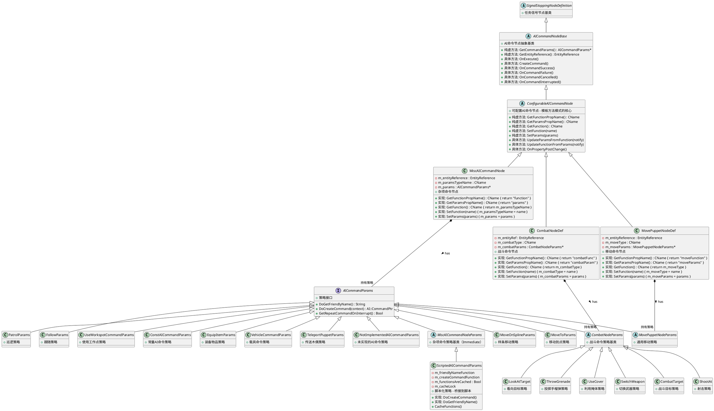
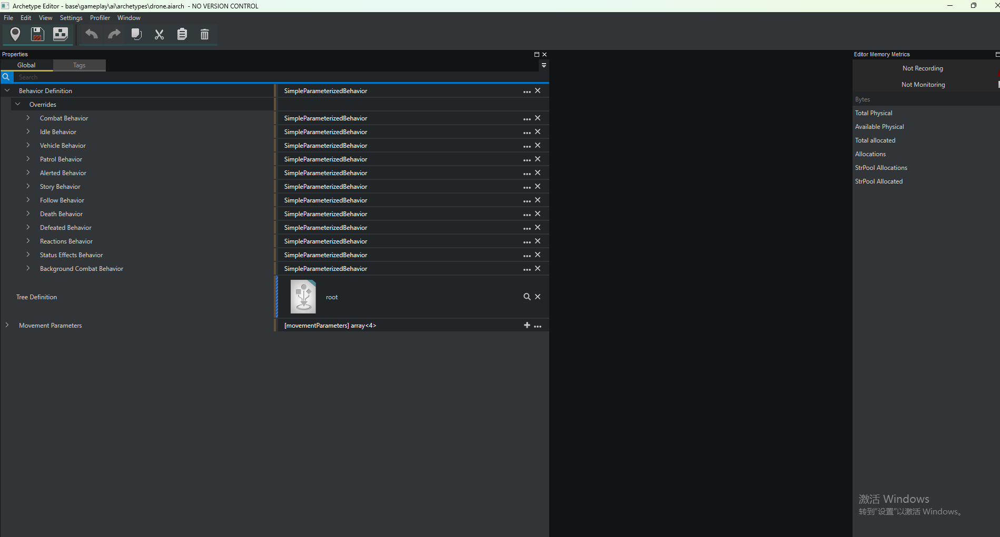

```plantuml
@startuml
digraph G {
    rankdir=TB;
    node [shape=box, style=filled, fillcolor=lightblue];
    
    root [label="根节点 (Brain/Selector)"];
    
    // Story分支
    story_cond [label="[Condition: IsInStoryTier(Cinematic)]", shape=diamond, fillcolor=lightgreen];
    story_branch [label="Story分支"];
    
    setup_cond [label="[Condition: IsStoryActionType(Setup)]", shape=diamond, fillcolor=lightgreen];
    setup_action [label="ExecuteSceneAnimationAction"];
    
    stop_cond [label="[Condition: IsStoryActionType(Stop)]", shape=diamond, fillcolor=lightgreen];
    stop_action [label="StopCurrentAction"];
    
    default_story [label="[Default]", shape=diamond, fillcolor=lightgreen];
    idle_cinematic [label="IdleInCinematicMode"];
    
    // Gameplay分支
    gameplay_cond [label="[Condition: IsInStoryTier(Gameplay)]", shape=diamond, fillcolor=lightgreen];
    gameplay_branch [label="Gameplay分支"];
    
    process_ai [label="ProcessAICommands → 处理AICommand队列"];
    combat_cmds [label="CombatCommands"];
    movement_cmds [label="MovementCommands"];
    workspot_cmds [label="WorkspotCommands"];
    other_cmds [label="..."];
    
    combat_ai [label="Combat AI AI::Role "];
    patrol_ai [label="Patrol AI AI::Role "];
    other_ai [label="..."];
    
    // 根节点到分支条件
    root -> story_cond;
    root -> gameplay_cond;
    
    // Story分支结构
    story_cond -> story_branch;
    story_branch -> setup_cond;
    story_branch -> stop_cond;
    story_branch -> default_story;
    
    setup_cond -> setup_action;
    stop_cond -> stop_action;
    default_story -> idle_cinematic;
    
    // Gameplay分支结构
    gameplay_cond -> gameplay_branch;
    gameplay_branch -> process_ai;
    gameplay_branch -> combat_ai;
    gameplay_branch -> patrol_ai;
    gameplay_branch -> other_ai;
    
    // ProcessAICommands子节点
    process_ai -> combat_cmds;
    process_ai -> movement_cmds;
    process_ai -> workspot_cmds;
    process_ai -> other_cmds;
}
@enduml
```

  Gameplay分支（IsInStoryTier==false）主要做的事情：

  1. ✅ 完整的AI自主决策系统（TweakAction）
  2. ✅ 状态管理和转换（Relaxed↔Alerted↔Combat等）
  3. ✅ 处理所有类型的AICommand
  4. ✅ 战斗系统完整运行（目标选择、掩体、射击、投掷等）
  5. ✅ 环境反应（恐惧、警觉、交通避让）
  6. ✅ 自主移动和导航
  7. ✅ 装备和动作管理
  8. ✅ 与玩家和世界的动态交互

  | 功能类别         | Gameplay | Cinematic | 代码依据                      |
  |--------------|----------|-----------|---------------------------|
  | 基础移动  (Move To)       | ✅        | ✅         | MoveOnSplineParams通用      |
  | Workspot动画   | ✅        | ✅         | GameplayAndCinematicAnims |
  | 传送           | ✅        | ✅         | TeleportPuppet通用          |
  | 外观更换         | ✅        | ✅         | AppearanceChange通用        |
  | Look At      | ✅        | ✅         | LookAt通用                  |
  | 装备物品         | ✅        | ✅         | EquipItem通用               |
  | 战斗命令         | ✅        | ❌         | Combat节点在Gameplay分支       |
  | 战斗动画         | ✅        | ❌         | GameplayOnlyAnims         |
  | 掩体系统         | ✅        | ❌         | UseCover在Combat节点         |
  | 射击命令         | ✅        | ❌         | ShootAt在Combat节点          |
  | 投掷手雷         | ✅        | ❌         | ThrowGrenade在Combat节点     |
  | 自主AI决策       | ✅        | ❌         | Brain节点切换分支               |
  | 巡逻逻辑         | ✅        | ❌         | Patrol在Gameplay分支         |
  | Locomotion动画 | ✅        | ❌         | GameplayOnlyAnims         |

  | 功能模块           | Gameplay分支      | Cinematic分支       |
  |----------------|-----------------|-------------------|
  | CommandHandler | ✅ 处理所有AICommand | ❌ 无CommandHandler |
  | TweakAction系统  | ✅ 完整AI决策        | ❌ 不运行             |
  | Combat系统       | ✅ 完整战斗逻辑        | ❌ 禁用              |
  | Reaction系统     | ✅ 响应环境刺激        | ❌ 禁用              |
  | 状态转换           | ✅ 自主状态机         | ❌ 固定状态            |
  | Workspot       | ✅ 通过AICommand   | ✅ Scene系统直接控制 (Scene Event )    |
  | 移动             | ✅ 自主导航+命令       | ⚠️ 仅Scene控制       |
  | 决策权            | ✅ AI自主决策        | ❌ 完全脚本控制          |

AICommandNodeBase

