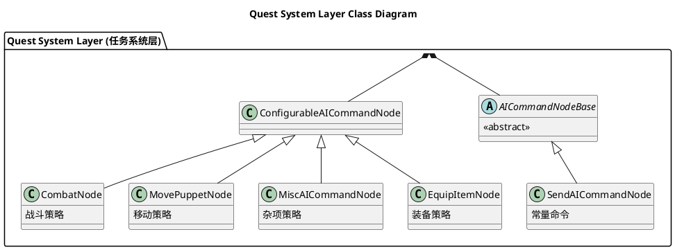
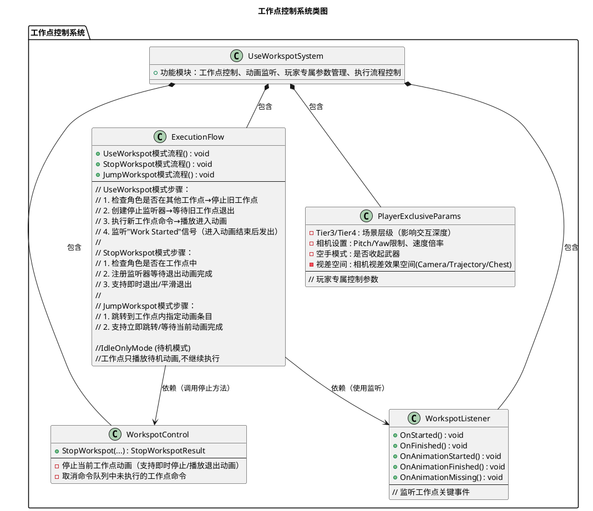
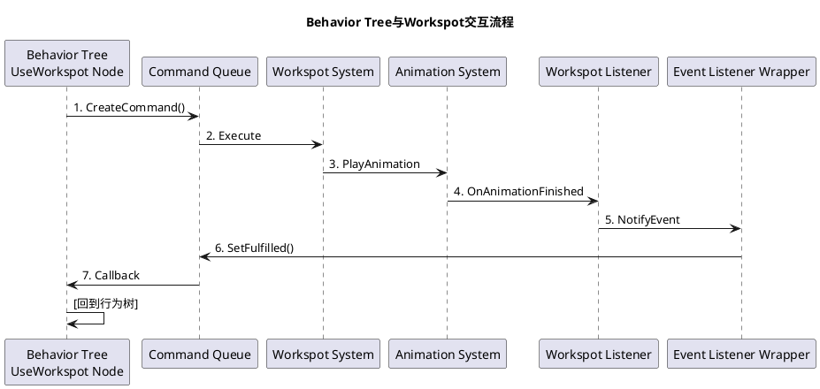
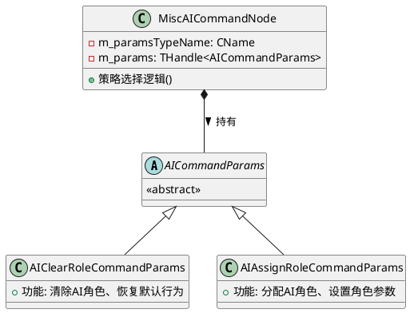
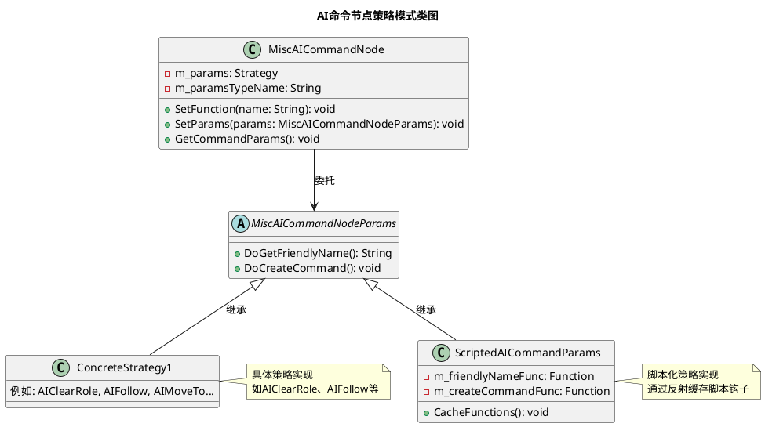
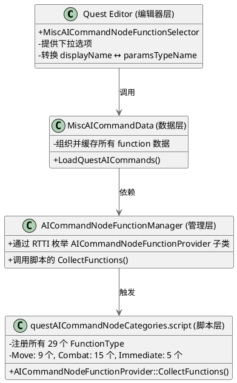
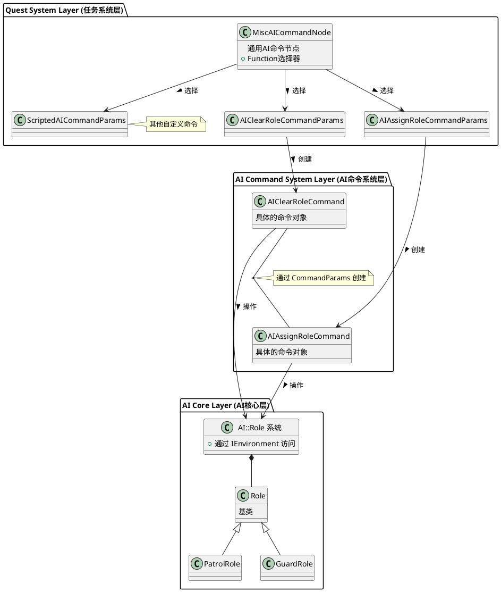
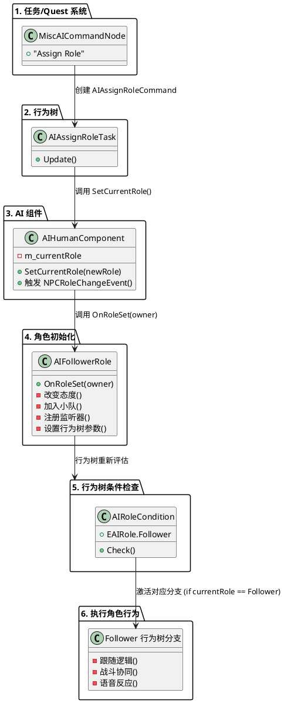
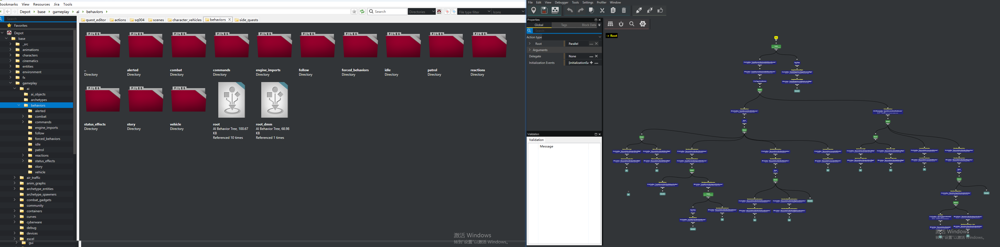

# 2077节点分析
~~~
~~~
## AI 系统整体框架
1.1 系统分层
| 层级名称                  | 包含内容                                                                 |
|---------------------------|--------------------------------------------------------------------------|
| TweakDB 配置层 (Data-Driven) | - AIAction Records<br>- AICondition Records<br>- AITarget Records        |
| 行为树层 (Behavior Tree Layer) | - Tree Nodes (决策、条件、动作)<br>- Behavior Instance (实例管理)<br>- Execution Context (执行上下文) |
| 命令队列层 (Command Queue Layer) | - Command System (命令系统)<br>- Context Management (上下文管理)<br>- Priority Handling (优先级处理) |
| 动作执行层 (Action Execution Layer) | - Movement Actions (移动)<br>- Drive Actions (驾驶)<br>- Combat Actions (战斗)<br>- Animation Actions (动画) |


~~~
------------------------------------------------------------------------------------
~~~

## 核心 AI 节点类型
2.1 节点类型概览（任务系统层类图）


2.2 节点类型对比
| 节点类型 | 命令示例                     | 架构层次                     |
|----------|------------------------------|------------------------------|
| 专用节点 | UseWorkspotNode (AI 工作点)  | ConfigurableAICommandNode 的平级 |
| 专用节点 | MovePuppetNode （AI Move To） | ConfigurableAICommandNode 的平级 |
| 通用节点 | MiscAICommandNode（AI Immediate） | ConfigurableAICommandNode 的子类 |
| 命令参数 | → AIClearRoleCommandParams   | MiscAICommandNode 的策略     |
| 命令参数 | → AIAssignRoleCommandParams  | MiscAICommandNode 的策略     |
| 命令参数 | → ScriptedAICommandParams    | MiscAICommandNode 的策略     |


| 对比维度   | UseWorkspotNode（工作点节点） | MiscAICommandNode（即时节点） | CombatNode（战斗节点）       |
|------------|------------------------------|-------------------------------|------------------------------|
| 功能专注度 | 单一功能（工作点交互）       | 多功能容器（杂项命令）        | 战斗相关命令                 |
| 性能表现   | 高（专用优化）               | 中等（反射开销）              | -                            |
| 扩展性     | 低（需 C++ 开发）            | 高（脚本扩展）                | 宏自动生成，扩展性强         |
| 类型安全   | 编译时                       | 运行时                        | -                            |
| 适用场景   | 核心频繁功能                 | 杂项 / 实验功能               | 持续性战斗行为               |
| 开发成本   | 高（C++ 开发）               | 低（脚本开发）                | -                            |

## 重点节点详解
### AI Combat Node
3.1.1 FunctionType 和 Param 类分离设计
| 方面     | m_function                  | m_params                    |
|----------|-----------------------------|-----------------------------|
| 用途     | 关卡设计师交互清晰明了              | 运行时数据存储              |
| 类型     | CName（轻量级标识符）       | THandle（智能指针）         |
| 序列化   | 不序列化（临时）            | 完整序列化                  |
| 更新时机 | 编辑时改变                  | 编辑 / 运行时改变           |
| 数据源   | 从 Params 同步              | 主数据源                    |

3.1.2 分离设计的意义
| 问题         | 分离设计的解决方案                  | 合并设计的问题                  |
|--------------|-------------------------------------|---------------------------------|
| 编辑器交互   | m_function（FunctionType）提供人类可读的下拉框 | 需要手动维护显示名称映射表      |
| 类型创建     | RTTI 动态创建，无需 switch-case     | 需要大量条件分支                |
| 数据一致性   | 自动同步机制保证一致                | 手动维护容易出错                |
| 序列化       | 只序列化 Params，无冗余             | 类型信息重复存储                |
| 扩展性       | 宏自动生成，只需一行代码            | 多处修改，容易遗漏              |
| 内存占用     | m_function 只在编辑时存在           | 每个实例都存储类型              |

3.1.3 FunctionType 和 Params 
1.FunctionType 和 Params 的对应关系：
   - 通过 RTTI 反射系统自动维护
   - 使用 params->GetClass ()->GetName () 获取类型名
   - 使用 GetRttiSystem ().FindType () 反向查找类型

2.分开运行的价值：
   - RTTI 已经存储了类型信息，在 Params 中再存一份是冗余的
   - m_function 的职责是 "编辑器交互"，不是 "数据存储"
   - 分离设计支持动态类型创建，无需硬编码映射关系
   - 序列化优化：m_function 不保存，加载时自动重建
   - 扩展性：新增功能只需修改宏定义，无需改动 Params 基类

3.阶段的问题：
- <span style="color:red">显示出的AIFunctionType和实际上的AI Combat Node有所差异</span>
 

### AI WorkSpot（UseWorkspotNode）
3.2.1 核心概念
Workspot（工作点）：游戏中角色执行特定动作的位置（如坐下、操作机器等），通常关联动画和交互逻辑。
使用 Scene 中的 WorkspotAISpot 点其中指定一个 WorkSpot 资产引用
3.2.2 操作模式
UseWorkspotNode 提供了 4 种工作点操作模式:
UseWorkspot (使用工作点) - 让角色进入并使用工作点
JumpWorkspot (跳转工作点) - 在工作点内跳转到指定动画条目
StopWorkspot (停止工作点) - 让角色退出工作点
IdleOnlyMode (待机模式) - 工作点只播放待机动画，不继续执行

3.2.3 系统架构


3.2.4 交互流程



3.2.5 技术优势
- 统一的动画交互抽象层
    1. 将复杂的角色动画交互封装成简单的任务节点
    2. 设计师只需配置参数（工作点指向、传送方式、动画选择等）
- 灵活的状态控制
    1. 四种独立操作模式支持精确控制动画播放
    2. 支持动态打断和恢复，可组合复杂交互序列
- 异步事件驱动
~~~C++
red::CreateSharedPtr<StopWorkspotListenerWrapper>(
    executionContext, entId, m_params->m_teleport, m_params->m_finishAnimation, m_params->m_exitEntryId,
    TBaseClass::CreateEventListener( executionContext ), workspotParams.m_locId, workspotParams );

class StopWorkspotListenerWrapper :public EventListenerWrapper
{
    void OnAnimationFinished(...)  // 动画结束时回调
    void OnWorkspotFinished(...)   // 工作点完成时回调
    bool IsFulfilled()             // 检查是否完成
}
~~~
- 容错机制
~~~C++
// useWorkspotNode.cpp:655-666
void WorkspotListener::OnAnimationMissing(...)
{
    // 动画资源丢失时,模拟动画开始和结束事件
    OnAnimationStarted(...);
    OnAnimationFinished(...);

    wrapper->OnMissingAnimation(puppetID, animationName);
}
~~~
### Immediate Node（MiscAICommandNode）
#### 核心设计：策略模式 + 脚本工具
- 策略设计
Misc AI Command Node


3.3.2 初始化代码
~~~C++
miscAICommandNode.cpp:135：
const CName c_clearAIRoleParamsTypeName = RED_NAME_CONSTEXPR("AIClearRoleCommandParams");

MiscAICommandNode::MiscAICommandNode()
    : m_paramsTypeName(c_clearAIRoleParamsTypeName)  // 默认就是 ClearAIRole
{
    UpdateParamsFromFunction(false);
}

questResave.cpp:245, 311：
static const CName s_assignRoleCommand = RED_NAME_CONSTEXPR("AIAssignRoleCommand");
static const CName s_assignRoleCommandParams = RED_NAME_CONSTEXPR("AIAssignRoleCommandParams");

~~~


- 双层扩展性
    - C++层：继承 MiscAICommandNodeParams 添加新策略
    - 脚本层：继承 ScriptedAICommandParams 无需重编译


3.阶段的问题：
 -<span style="color:red"> 显示出的Immediate出现的和实际上的Function Type和ImmediateNode定义的Function Type有所差异</span>


来自于TweakDB配置方式
- AI::Role（角色基类）

  位置：common/ai/include/aiRole.h:15-39
~~~C++
  class AI_API Role : public IScriptable
  {
      RTTI_DECLARE_TYPE( Role );

  public:
      Role();
      virtual ~Role();

      // 获取TweakDB记录ID
      virtual TweakDBID GetTweakRecordId() const;

      // 获取角色的TweakDB记录
      WeakHandle<game::data::AIRole_Record> GetRoleTweakRecord() const;

  private:
      void funcGetRoleTweakRecord(CScriptStackFrame& stack, void* result, const rtti::IType* resultType);
  };
~~~
  核心特点：
  - 轻量级基类，实际配置在TweakDB中
  - 通过GetTweakRecordId()连接到TweakDB配置
  - 可被脚本扩展（IScriptable）

### AI Move To
待完成
## MiscAICommandNodeFunctionSelector


  一、核心职责

  MiscAICommandNodeFunctionSelector 是一个编辑器属性选择器，负责为 Quest 编辑器中的 AI Command Node 提供动态下拉选项。它支持三种 Node 类型：

  1. AINodeFunctions:Combat - Combat Node
  2. AINodeFunctions:Move - Move Node
  3. AINodeFunctions:Immediate - Immediate/Misc Node

MiscAICommandNodeFunctionSelector (关于编辑器所显示的CombatFunctionType)
  1. C++ 宏定义 (combatNode.h:25-34) - 定义核心、必需的 Combat 功能
    - 这些是引擎层面保证存在的基础功能
    - 编译期就确定
  2. 脚本动态注册 (questAICommandNodeCategories.script) - 定义扩展、可选的 Combat 功能
    - 游戏设计师可以灵活添加/修改
    - 运行时通过 RTTI 动态发现
    - 更容易迭代和调整

  E:\SoftApp\Sy2077\2077\2077\CDPR2077\r6\scripts\cyberpunk\quest\questAICommandNodeCategories.script
~~~C++
class MiscAICommandNodeFunctionSelector// 
{

  virtual void Initialize(...) {
      TBaseClass::Initialize(...);
      m_data.Load();  }// 加载数据}
private:
	MiscAICommandData m_data;

}
backend::backendQuest::miscAICommandNodeFunctionSelector.cpp
void MiscAICommandData::Load()
{ // 2.1 加载 CSV 文件中的基本 commands
	auto commands = g_miscAICommands.Get();
  // 路径: "engine\\quest_editor\\misc_ai_commands.csv"

      // 2.2 读取 CSV 中的每一行
	static CName dividerName = RED_NAME_CONSTEXPR( "-" );

	const auto count = commands->GetNumberOfRows();
	for ( Uint32 i = 0; i < count; ++i )
	{
		Entry entry;

		auto commandParamsTypeName = commands->GetValue( "commandParamsTypeName", i );
		if ( commandParamsTypeName.Empty() )
		{
			continue;
		}
		
		if ( commandParamsTypeName[0] == '-' )
		{
			m_options.PushBack( "----------------------------" );
			entry.m_paramsTypeName = dividerName;
		}
		else
		{
			auto displayName = commands->GetValue( "displayName", i );
			m_options.PushBack( displayName );
			entry.m_paramsTypeName = RED_NAME( commandParamsTypeName );
		}

		auto backgroundColorStr = commands->GetValue( "backgroundColor", i );
		const char* strPtr = backgroundColorStr.AsChar();
		auto ret = GParseColor( strPtr, entry.m_backgroundColor ) || GParseColorName( strPtr, entry.m_backgroundColor );
		RED_FATAL_ASSERT( ret, "Cannot parse 'backgroundColor' in %hs, row %d", g_miscAICommands.GetPath().ToString().AsChar(), i + 1 );

		m_entries.PushBack( entry );
	}
  // 2.3 加载动态注册的 Quest AI Commands
	LoadQuestAICommands();
}

//动态收集函数 (questMiscAICommandData.cpp:188-206)
  void MiscAICommandData::LoadQuestAICommands() {
      // 从 AICommandNodeFunctionManager 获取所有注册的函数
      auto& functions = quest::AICommandNodeFunctionManager::I().GetFunctions();

      for (auto& fn : functions) {
          FunctionEntry entry = {
              false,
              fn.m_nodeType,           // 例如: "Combat"
              fn.m_commandCategory,
              fn.m_friendlyName,       // 例如: "Melee AttackSet"
              fn.m_paramsType,         // 例如: "AIMeleeAttackSetCommandParams"
              fn.m_nodeColor
          };
          m_functions[entry.m_nodeName].PushBack(entry);
          m_functionOptions[entry.m_nodeName].PushBack(entry.m_friendlyName);
      }
  }
  void AICommandNodeFunctionManager::Initialize() {
      m_functions.Clear();

      // 核心：通过 RTTI 收集所有 AICommandNodeFunctionProvider 子类
      AICommandNodeFunctionProvider::CollectAllFunctions(m_functions);

      // 组织数据
      for (const auto& fn : m_functions) {
          m_options[fn.m_nodeType].PushBack(fn.m_friendlyName);
          m_colors[fn.m_paramsType] = fn.m_nodeColor;
          // ...
      }
  }

//收集所有Function
  void AICommandNodeFunctionProvider::CollectAllFunctions( TFunctionList& functions )
{
	auto* baseCls = static_cast<const rtti::ClassType*>( GetTypeObject< AICommandNodeFunctionProvider >() );
	red::DynArray< const rtti::ClassType* > classes{ game::PoolGMPL_Quest() };
	GetRttiSystem().EnumClasses( baseCls, classes );

	for ( const auto* cls : classes )
	{
		//RED_ASSERT( !cls->IsAbstract() );
		//auto instance = cls->CreateHandle< AICommandNodeFunctionProvider >();
		//instance->CollectFunctions( functions );
		CollectFunctions( cls, functions );
	}
}
~~~

  二、工作机制

  识别机制 (miscAICommandNodeFunctionSelector.cpp:75-94)
  ~~~C++
  virtual const Bool HandlesCustomType(const CName customTypeName, ...) const override
  {
      // 方式1: 直接名称匹配
      if (customTypeName == "toolsMiscAICommandNodeFunctionSelector")
          return true;

      // 方式2: 前缀匹配
      red::String name(customTypeName.AsChar());
      return name.BeginsWith("AINodeFunctions:");  // 支持所有 AINodeFunctions:xxx
  }

  CName GetNodeName() const
  {
      red::String name(GetCustomTypeName().AsChar());
      // "AINodeFunctions:Combat" → 返回 "Combat"
      // "AINodeFunctions:Move" → 返回 "Move"
      // "AINodeFunctions:Immediate" → 返回 "Immediate"
      return RED_NAME(name.StringAfter("AINodeFunctions:"));
  }
  ~~~
  数据加载流程

  Initialize()
      ↓
  m_data.Load()  (questMiscAICommandData.cpp:35-73)
      ↓
      ├─→ 加载 CSV: engine\quest_editor\misc_ai_commands.csv
      └─→ LoadQuestAICommands()  (188-206行)
          └─→ AICommandNodeFunctionManager::I().GetFunctions()
              └─→ 从脚本收集: questAICommandNodeCategories.script
 三、定义的所有 FunctionType

  根据 questAICommandNodeCategories.script，共注册了 29 个 FunctionType，分为三大类：

  1. Move Functions (AINodeFunctions:Move) - 9 个

  | 序号  | Display Name   | Params Type                 | 颜色    | 说明        |
  |-----|----------------|-----------------------------|-------|-----------|
  | 1   | Move On Spline | questMoveOnSplineParams     | 🟢 绿色 | 沿样条线移动    |
  | 2   | Move To        | questMoveToParams           | 🟢 绿色 | 移动到目标点    |
  | 3   | Rotate To      | questRotateToParams         | 🟢 绿色 | 旋转到目标     |
  | 4   | Patrol         | questPatrolParams           | 🟢 绿色 | 巡逻        |
  | 5   | Follow         | questFollowParams           | 🟢 绿色 | 跟随目标      |
  | 6   | Move To Cover  | AIMoveToCoverCommandParams  | 🟢 绿色 | 移动到掩体     |
  | 7   | Stop Cover     | AIStopCoverCommandParams    | 🟢 绿色 | 停止使用掩体    |
  | 8   | Hold Position  | AIHoldPositionCommandParams | 🟢 绿色 | 保持位置      |
  | 9   | Scan Target    | AIScanTargetCommandParams   | ⚫ 灰色  | 扫描目标（未实现） |

  2. Combat Functions (AINodeFunctions:Combat) - 15 个

  | 序号  | Display Name      | Params Type                                  | 来源  | 说明       |
  |-----|-------------------|----------------------------------------------|-----|----------|
  | 1   | Combat Target     | questCombatNodeParams_CombatTarget           | 宏   | 设置战斗目标   |
  | 2   | Combat Threat     | AIInjectCombatThreatCommandParams            | 脚本  | 注入威胁     |
  | 3   | Shoot             | questCombatNodeParams_ShootAt                | 宏   | 射击       |
  | 4   | Force Shoot       | AIForceShootCommandParams                    | 脚本  | 强制射击     |
  | 5   | Use Cover         | questCombatNodeParams_UseCover               | 宏   | 使用掩体     |
  | 6   | Throw Grenade     | questCombatNodeParams_ThrowGrenade           | 宏   | 投掷手榴弹    |
  | 7   | Primary Weapon    | questCombatNodeParams_PrimaryWeapon          | 宏   | 主武器      |
  | 8   | Secondary Weapon  | questCombatNodeParams_SecondaryWeapon        | 宏   | 副武器      |
  | 9   | Takedown          | AIFollowerTakedownCommandParams              | 脚本  | 处决       |
  | 10  | Look At Target    | questCombatNodeParams_LookAtTarget           | 宏   | 看向目标     |
  | 11  | Aim At Target     | AIAimAtTargetCommandParams                   | 脚本  | 瞄准目标     |
  | 12  | Melee Attack      | AIMeleeAttackCommandParams                   | 脚本  | 近战攻击    |
  | 13  | Set Combat Preset | AISetCombatPresetCommandParams               | 脚本  | 设置战斗预设  |
  | 14  | Background Combat | AIBackgroundCombatCommandParams              | 脚本  | 背景战斗    |
  | 15  | Restrict Movement | questCombatNodeParams_RestrictMovementToArea | 宏   | 限制移动区域   |


  3. Immediate Functions (AINodeFunctions:Immediate) - 5 个

  | 序号  | Display Name           | Params Type                                  | 颜色    | 说明            |
  |-----|------------------------|----------------------------------------------|-------|---------------|
  | 1   | Assign Role            | AIAssignRoleCommandParams                    | 🟡 黄色 | 分配 AI 角色      |
  | 2   | Clear Role             | AIClearRoleCommandParams                     | 🟡 黄色 | 清除 AI 角色      |
  | 3   | Restrict Movement      | questCombatNodeParams_RestrictMovementToArea | 🟡 黄色 | 限制移动          |
  | 4   | Join Target's Squad    | AIJoinTargetsSquadCommandParams              | 🟡 黄色 | 加入目标小队        |
  | 5   | Flathead Set Solo Mode | AIFlatheadSetSoloModeCommandParams           | 🟡 黄色 | Flathead 独立模式 |

  六、关键特性

  1. 动态扩展：只需修改脚本即可添加新的 FunctionType，无需重新编译引擎
  2. 类型安全：通过 RTTI 系统确保 paramsType 对应的类存在
  3. 分类管理：通过 nodeType 将 functions 分为 Move、Combat、Immediate 三大类
  4. 颜色编码：
    - 🟢 绿色 = 移动相关，已实现
    - 🔴 红色 = 战斗相关，已实现
    - 🟡 黄色 = 立即执行，已实现
    - ⚫ 灰色 = 未实现功能
  5. 双向映射：
    - friendlyName (用户可读) ↔ paramsTypeName (系统内部)
    - 例："Melee Attack" ↔ "AIMeleeAttackCommandParams"

## AI Role 概念


Sy2077\2077\2077\CDPR2077\r6\scripts\cyberpunk\ai\roles\aiRole.script


AI Role的脚本桥接
~~~C++
enum EAIRole//三类AIRole
{
	None,
	Patrol,
	Follower,
}

class GAME_TWEAK_DB_API AIRole_Record : public TweakDBRecord
{
	RTTI_DECLARE_TYPE( AIRole_Record );
	RECORD( "AIRole", AIRole_Record )

public:
	AIRole_Record();
	explicit AIRole_Record( const game::data::RecordID& path );
	virtual ~AIRole_Record() override;
	virtual const Uint32 GetSchemaHash() override;
public:
	TweakDB::VString enumComment;
	TweakDB::ForeignKey rolePackage;
	TweakDB::VCName enumName;
	AIRole type;

public:
	const WeakHandle< GameplayLogicPackage_Record > rolePackageGet() const;

private:
	void funcEnumComment( CScriptStackFrame& stack, void* result, const rtti::IType* resultType );
	void funcRolePackage( CScriptStackFrame& stack, void* result, const rtti::IType* resultType );
	void funcRolePackageHandle( CScriptStackFrame& stack, void* result, const rtti::IType* resultType );
	void funcEnumName( CScriptStackFrame& stack, void* result, const rtti::IType* resultType );
	void funcType( CScriptStackFrame& stack, void* result, const rtti::IType* resultType );
};
~~~
AI Role 架构层次

 ```plantuml

 @startuml

' 定义包结构
package "TweakDB (数据层)" as TweakDB {
    enum AIRole {
        Patrol
        Follower
    }
    class GameplayLogicPackage {
        <<class>>
    }
    AIRole -- GameplayLogicPackage : rolePackage
}

package "C++ 层 (引擎核心)" as CppLayer {
    abstract class "AI::Role" {
        <<abstract>>
    }
    class "AI::PatrolRole" {
        <<class>>
    }
    "AI::Role" <|-- "AI::PatrolRole"
}

package "脚本层 (游戏逻辑)" as ScriptLayer {
    class "AIRole" {
        <<import class>>
    }
    class "AIPatrolRole"
    class "AIFollowerRole"
    class "AINoRole"
    
    "AIRole" <|-- "AIPatrolRole"
    "AIRole" <|-- "AIFollowerRole"
    "AIRole" <|-- "AINoRole"
}

' 层间关系
TweakDB --> CppLayer : 映射
CppLayer --> ScriptLayer : RTTI 桥接

@enduml
 ```
脚本化的AI命令 及AICommandParam
E:\SoftApp\Sy2077\2077\2077\CDPR2077\r6\scripts\core\ai\aiCommand.script

 ~~~C++
 class AIAssignRoleCommand extends AICommand
{
	public editable inlined var role : AIRole;
};

class AIAssignRoleCommandParams extends ScriptedAICommandParams
{
	editable inlined var role : AIRole;

	public function GetCommandName() : string
	{
		return "Assign AI Role";
	}

	public override function CreateCommand() : AICommand
	{
		var command : AIAssignRoleCommand;
		command = new AIAssignRoleCommand;
		command.role = role;
		return command;
	}
};

class AIClearRoleCommandParams extends ScriptedAICommandParams
{
	public function GetCommandName() : string
	{
		return "Clear AI Role";
	}

	public override function CreateCommand() : AICommand
	{
		var command : AIAssignRoleCommand;
		command = new AIAssignRoleCommand;
		command.role = new AINoRole;
		return command;
	}
};

class AIJoinTargetsSquadCommandParams extends ScriptedAICommandParams
{
	editable inlined var targetPuppetRef : EntityReference;

	public function GetCommandName() : string
	{
		return "Join Target's Squad";
	}

	public override function CreateCommand() : AICommand
	{
		var command : AIJoinTargetsSquad;
		command = new AIJoinTargetsSquad;
		command.targetPuppetRef = targetPuppetRef;
		return command;
	}
};

 ~~~


AI  Role 数据流向

AI role 定义了 NPC"该做什么"以及"如何与玩家互动"。
1. Patrol（巡逻角色）

  - 功能：定义 NPC 的巡逻行为
  - 实现内容：
    ✅ 巡逻路径管理（普通/警觉）
    ✅ 警觉半径和搜索范围
    ✅ 强制警觉模式
    ✅ 持武器/不持武器巡逻
    ✅ 警觉时的工作点切换

  - 应用场景：敌方哨兵、警卫
2. Follower（跟随者角色）
  - 功能：让 NPC 成为玩家的智能伙伴
  - 实现内容：
    ✅ 跟随目标查找和追踪
    ✅ 态度同步（自动成为玩家阵营）
    ✅ 小队系统集成
    ✅ 战斗协同（空间管理）
    ✅ 武器感知战术调整
    ✅ 语音交互系统
    ✅ 状态感知和反应
    ✅ 敌对摄像头过滤


脚本层定义了更复杂的AI Role的行为
- Patrol Role 巡逻路径、警戒路径、警戒半径、是否警觉.....
- Follow Role 跟随对象、是否近战、玩家是否狙击、语音提醒

Sy2077\2077\2077\CDPR2077\r6\scripts\cyberpunk\ai\roles\aiRole.script

| 层级/类别       | 类名                  | 父类/关联类                | 核心功能                                                                 | 关键属性/方法                                                                 | 应用场景                          |
|-----------------|-----------------------|----------------------------|--------------------------------------------------------------------------|-------------------------------------------------------------------------------|-----------------------------------|
| **枚举定义**    | `EAIRole`             | -                          | 定义AI角色类型，作为行为逻辑分类标识                                     | 枚举值：`None`（无角色）、`Patrol`（巡逻）、`Follower`（跟随）                | 角色类型判断、行为树条件筛选      |
| **基础事件**    | `NPCRoleChangeEvent`  | `Event`                    | 角色切换通知事件，仅用于告知角色已变更，不直接修改角色                   | 属性：`m_newRole`（变更后的`AIRole`实例）                                     | AI角色切换时的外部通知（如UI更新）|
| **基类**        | `AIRole`              | `IScriptable`              | 所有AI角色的父类，定义统一接口和生命周期方法，提供抽象层                 | 接口：`GetRoleEnum()`、`GetTweakRecordId()`；<br>生命周期：`OnRoleSet()`、`OnRoleCleared()`；<br>状态回调：`OnHighLevelStateEnter()`/`OnHighLevelStateExit()` | 子类继承，统一AI角色行为框架      |
| **空角色实现**  | `AINoRole`            | `AIRole`                   | 无特定行为的空角色，对应`EAIRole.None`，作为默认角色占位                 | 无额外属性/方法，继承`AIRole`默认实现                                         | AI初始状态、角色清空后的临时状态  |
| **巡逻角色**    | `AIPatrolRole`        | `AIRole`                   | 实现AI巡逻行为，支持正常/警戒状态下的差异化巡逻规则                       | 属性：`pathParams`（正常巡逻路径）、`alertedPathParams`（警戒巡逻路径）、`alertedRadius`（警戒半径）、`forceAlerted`（强制警戒）；<br>方法：`GetPathParams()`、`IsForceAlerted()`、重写`GetRoleEnum()`（返回`Patrol`） | 守卫、巡逻兵等需按路径移动的NPC  |
| **跟随角色**    | `AIFollowerRole`      | `AIRole`                   | 实现AI跟随目标（如玩家）的完整逻辑，含态度、小队、武器联动               | 属性：`followerRef`（跟随目标引用）、`m_followTarget`（跟随目标实例）、`attitudeGroupName`（态度组）；<br>方法：`OnFriendlyTargetWeaponChange()`（武器变更响应）、`JoinFollowTargetSquads()`（加入目标小队）、重写`GetRoleEnum()`（返回`Follower`） | 玩家队友、随从等需跟随的NPC      |
| **辅助回调类**  | `FriendlyTargetWeaponChangeCallback` | `AttachmentSlotsScriptCallback` | 监听跟随目标的武器装备变更，触发跟随角色的战斗参数调整                   | 属性：`m_followerRole`（关联的`AIFollowerRole`实例）；<br>方法：`OnItemEquipped()`（装备变更回调） | 跟随目标切换武器时，调整AI战斗空间 |
| **辅助回调类**  | `OwnerWeaponChangeCallback` | `AttachmentSlotsScriptCallback` | 监听自身（跟随角色）的武器装备变更，触发战斗参数调整                     | 属性：`m_followerRole`（关联的`AIFollowerRole`实例）；<br>方法：`OnItemEquipped()`（装备变更回调） | 跟随角色切换武器时，调整战斗空间  |
| **巡逻代理类**  | `PatrolRoleCommandDelegate` | `ScriptBehaviorDelegate`   | 巡逻角色的命令代理，提供武器携带状态、强制警戒状态的判断接口             | 属性：`patrolWithWeapon`（是否携带武器巡逻）、`forceAlerted`（是否强制警戒）；<br>方法：`IsPatrolWithWeapon()`、`IsForceAlerted()` | 巡逻AI行为树参数判断              |
| **行为树条件类**| `AIRoleCondition`     | `AIbehaviorconditionScript` | AI行为树条件节点，判断当前AI是否为指定`EAIRole`类型                     | 属性：`m_role`（目标角色类型）；<br>方法：`Check()`（返回是否匹配目标角色）   | 行为树分支筛选（如仅巡逻AI执行某逻辑） |
| **行为树任务类**| `AIAssignRoleTask`    | `AIbehaviortaskScript`     | AI行为树任务节点，为AI组件分配指定角色（调用`AIHumanComponent.SetCurrentRole()`） | 属性：`m_inCommand`（角色分配指令参数）；<br>方法：`Update()`（执行角色分配） | 行为树中触发AI角色切换（如任务激活时设为跟随） |

## 节点特性对比分析

| 特性       | UseWorkspotNode          | MiscAICommandNode        |
|------------|--------------------------|--------------------------|
| 专注度     | 单一功能（工作点）       | 多功能容器               |
| 性能       | 高（专用优化）           | 中等（反射开销）         |
| 扩展性     | 低（需改 C++）           | 高（脚本扩展）           |
| 类型安全   | 编译时                   | 运行时                   |
| 适用场景   | 核心频繁功能             | 杂项 / 实验功能          |
| 开发成本   | 高（C++ 开发）           | 低（脚本开发）           |


| 方面       | CombatNode               | MiscAICommandNode        |
|------------|--------------------------|--------------------------|
| 用途       | 战斗相关命令             | 杂项 / 立即执行命令      |
| 编辑器分类 | AINodeFunctions:Combat   | AINodeFunctions:Immediate|
| 默认功能   | ShootAt                  | ClearAIRole              |
| 命令类型   | 持续性（战斗行为）       | 瞬时性（状态改变）       |
| 参数宏     | RED_QUEST_COMBAT_NODE_FUNCTIONS_DEF | 无宏（扩展性更强） |
| 脚本支持   | 否                       | 是（ScriptedAICommandParams） |


## 行为树


## 特殊问题解析
5.1 存在未找到的 CombatNodeType


- Triggle引用
  


