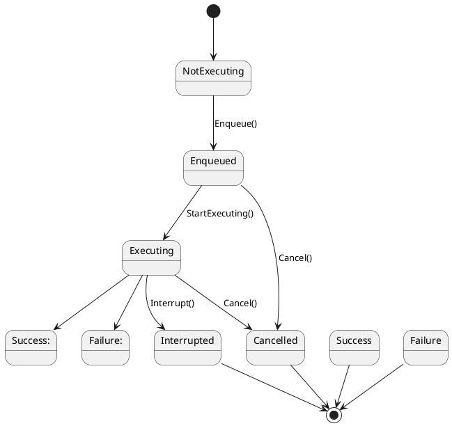
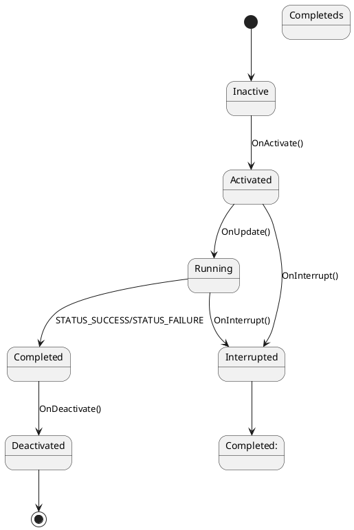
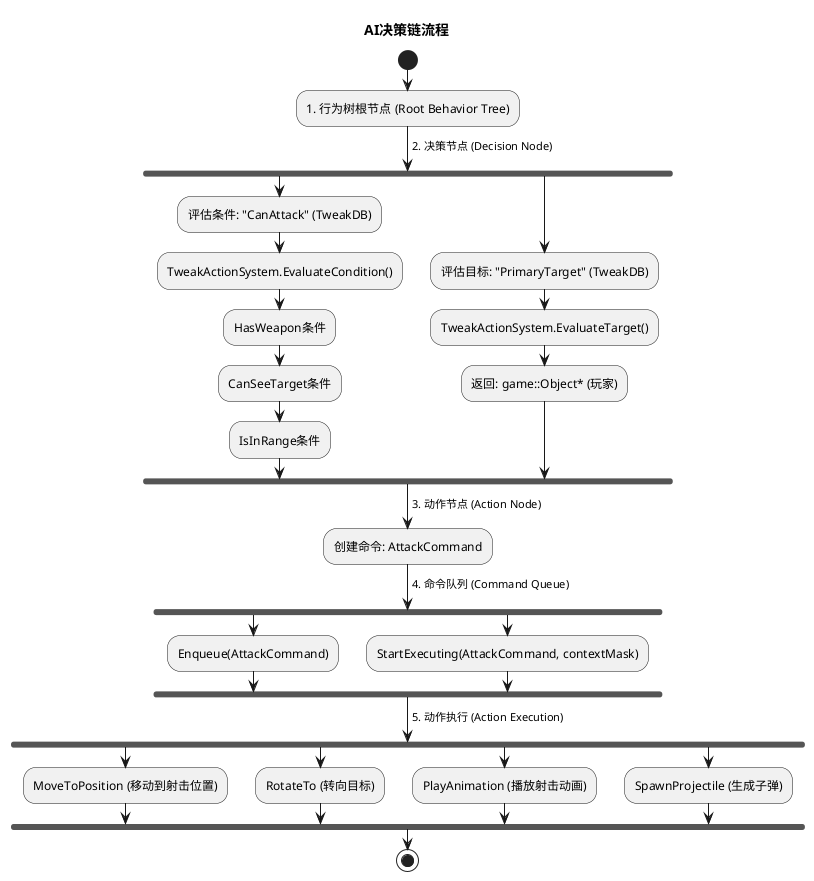

1.2 命令系统状态流转

```plantuml
@startuml
[*] --> NotExecuting

NotExecuting --> Enqueued: Enqueue()

Enqueued --> Executing: StartExecuting()
Enqueued --> Cancelled: Cancel()

Executing --> Success: 
Executing --> Failure: 
Executing --> Cancelled: Cancel()
Executing --> Interrupted: Interrupt()

Cancelled --> [*]
Interrupted --> [*]
Success --> [*]
Failure --> [*]

state NotExecuting
state Enqueued
state Executing
state Cancelled
state Interrupted
state Success
state Failure
@enduml

```
1.3 行为树系统状态流转

```plantuml
@startuml
[*] --> Inactive

Inactive --> Activated: OnActivate()

Activated --> Running: OnUpdate()
Activated --> Interrupted: OnInterrupt()

Running --> Completed: STATUS_SUCCESS/STATUS_FAILURE
Running --> Interrupted: OnInterrupt()

Interrupted --> Completed: 

Completed --> Deactivated: OnDeactivate()

Deactivated --> [*]

state Inactive
state Activated
state Running
state Interrupted
state Completeds
state Deactivated
@enduml

```
1.4 AI 决策流程

```plantuml

@startuml
title AI决策链流程

start
:1. 行为树根节点 (Root Behavior Tree);
-> 2. 决策节点 (Decision Node);

fork
    :评估条件: "CanAttack" (TweakDB);
    :TweakActionSystem.EvaluateCondition();
    :HasWeapon条件;
    :CanSeeTarget条件;
    :IsInRange条件;
fork again
    :评估目标: "PrimaryTarget" (TweakDB);
    :TweakActionSystem.EvaluateTarget();
    :返回: game::Object* (玩家);
end fork

-> 3. 动作节点 (Action Node);
:创建命令: AttackCommand;

-> 4. 命令队列 (Command Queue);
fork
    :Enqueue(AttackCommand);
fork again
    :StartExecuting(AttackCommand, contextMask);
end fork

-> 5. 动作执行 (Action Execution);
fork
    :MoveToPosition (移动到射击位置);
fork again
    :RotateTo (转向目标);
fork again
    :PlayAnimation (播放射击动画);
fork again
    :SpawnProjectile (生成子弹);
end fork

stop
@enduml
```