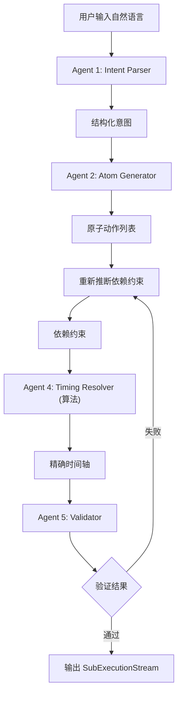

# AI 叙事工具完整架构设计
## 一、核心 AI Agent 架构
基于三层结构（语义层 → 约束层 → 时序层），设计以下 6 个核心 AI Agent：

### Agent 1: Intent Parser（意图解析器）
**职责**：将自然语言转换为结构化的叙事意图

**输入**：
```
"Hanako 先坐下，V 跟着坐，等两人稳定后开始正式对话，整体节奏克制"
```

**输出**：
```json
{
  "narrative_goal": "formal_introduction",
  "participants": ["Hanako", "V"],
  "mood": "restrained_professional",
  "tempo_hint": "slow_deliberate"
}
```

**大模型约束方式**：
```python
INTENT_PARSER_SCHEMA = {
    "type": "object",
    "required": ["narrative_goal", "participants"],
    "properties": {
        "narrative_goal": {
            "type": "string",
            "description": "这段场景的叙事目标，用简短的英文短语描述"
        },
        "participants": {
            "type": "array",
            "items": {"type": "string"},
            "description": "参与这段场景的所有角色和物体"
        },
        "mood": {
            "enum": ["tense", "relaxed", "formal", "casual", "urgent", "contemplative"],
            "description": "场景的情绪基调"
        },
        "tempo_hint": {
            "enum": ["fast", "medium", "slow", "slow_deliberate"],
            "description": "节奏提示"
        }
    }
}

# 使用 Structured Output
response = client.messages.create(
    model="claude-opus-4-6",
    response_format={
        "type": "json_schema",
        "json_schema": {
            "name": "intent_output",
            "schema": INTENT_PARSER_SCHEMA
        }
    },
    messages=[{
        "role": "user",
        "content": f"""
你是叙事意图解析器。将导演描述转换为结构化意图。

导演描述：{user_input}

要求：
1. 提取叙事目标（这段戏想达成什么）
2. 识别所有参与者（角色、物体、相机等）
3. 判断情绪基调
4. 判断节奏风格
"""
    }]
)
```

### Agent 2: Atom Generator（原子生成器）
**职责**：将意图拆解为原子动作序列

**输入**：
```json
{
  "narrative_goal": "formal_introduction",
  "participants": ["Hanako", "V"],
  "user_description": "Hanako 先坐下，V 跟着坐，等两人稳定后开始正式对话"
}
```

**输出**：
```json
{
  "atoms": [
    {
      "id": "hanako_sit",
      "type": "MoveTo",
      "actor": "Hanako",
      "target": "chair_hanako",
      "animation_hint": "sit_formal"
    },
    {
      "id": "v_sit",
      "type": "MoveTo",
      "actor": "V",
      "target": "chair_v",
      "animation_hint": "sit_casual"
    },
    {
      "id": "wait_stable",
      "type": "Wait",
      "duration_hint": 1.0,
      "reason": "等待两人坐稳"
    },
    {
      "id": "hanako_speak",
      "type": "Speak",
      "actor": "Hanako",
      "content": "我们开始吧",
      "tone": "formal"
    }
  ]
}
```

**大模型约束方式**：
```python
ATOM_SCHEMA = {
    "type": "object",
    "required": ["id", "type", "actor"],
    "properties": {
        "id": {
            "type": "string",
            "pattern": "^[a-z_]+$",
            "description": "原子动作的唯一标识符，使用小写字母和下划线"
        },
        "type": {
            "enum": ["Speak", "MoveTo", "Gesture", "LookAt", "Wait", "Signal"],
            "description": "原子动作类型"
        },
        "actor": {
            "type": "string",
            "description": "执行这个动作的角色"
        },
        "target": {"type": "string"},
        "content": {"type": "string"},
        "tone": {"type": "string"},
        "animation_hint": {"type": "string"},
        "duration_hint": {"type": "number"}
    }
}

ATOM_GENERATOR_SCHEMA = {
    "type": "object",
    "required": ["atoms"],
    "properties": {
        "atoms": {
            "type": "array",
            "items": ATOM_SCHEMA,
            "minItems": 1,
            "maxItems": 20
        }
    }
}

# Few-Shot Prompting
ATOM_EXAMPLES = [
    {
        "input": "Hanako 站起来后退",
        "output": {
            "atoms": [
                {"id": "hanako_stand", "type": "MoveTo", "actor": "Hanako", "target": "standing"},
                {"id": "hanako_back", "type": "MoveTo", "actor": "Hanako", "target": "safe_distance"}
            ]
        }
    }
]

prompt = f"""
你是原子动作生成器。将叙事意图拆解为最小可执行的原子动作。

可用的原子类型：
- Speak: 说话（需要 content 和 tone）
- MoveTo: 移动/坐下/站起（需要 target）
- Gesture: 手势/动作（需要 animation_hint）
- LookAt: 看向（需要 target）
- Wait: 等待（需要 duration_hint）
- Signal: 发送信号（需要 signal_name）

示例：
{json.dumps(ATOM_EXAMPLES, indent=2, ensure_ascii=False)}

现在处理：
意图：{intent}
描述：{description}

要求：
1. 每个原子动作必须有唯一的 id
2. 只生成必要的动作，不要过度设计
3. 保持动作的原子性（不可再拆分）
"""
```

### Agent 3: Dependency Inferrer（依赖推断器）
**职责**：推断原子动作之间的依赖关系

**输入**：
```json
{
  "atoms": [...],
  "user_description": "Hanako 先坐下，V 跟着坐，等两人稳定后开始对话"
}
```

**输出**：
```json
{
  "constraints": [
    {
      "type": "finish_to_start",
      "from": "hanako_sit",
      "to": "v_sit",
      "reason": "V 在 Hanako 坐下后才坐"
    },
    {
      "type": "join_after_stable",
      "from": ["hanako_sit", "v_sit"],
      "to": "wait_stable",
      "reason": "等待两人都坐稳"
    },
    {
      "type": "finish_to_start",
      "from": "wait_stable",
      "to": "hanako_speak",
      "reason": "等待结束后开始对话"
    }
  ]
}
```

**大模型约束方式**：
```python
CONSTRAINT_SCHEMA = {
    "type": "object",
    "required": ["type", "from", "to"],
    "properties": {
        "type": {
            "enum": [
                "finish_to_start",    # A 完成后 B 开始
                "start_to_start",     # A 开始后 B 可以开始
                "join",               # A 和 B 都完成后 C 开始
                "join_after_stable",  # A 和 B 都稳定后 C 开始
                "signal_wait",        # 等待信号
                "parallel"            # 并行执行
            ]
        },
        "from": {
            "oneOf": [
                {"type": "string"},
                {"type": "array", "items": {"type": "string"}}
            ]
        },
        "to": {"type": "string"},
        "reason": {"type": "string"}
    }
}

# Chain-of-Thought Prompting
prompt = f"""
你是依赖关系推断器。分析原子动作序列，推断它们之间的时序依赖关系。

原子动作列表：
{json.dumps(atoms, indent=2, ensure_ascii=False)}

用户描述：
{user_description}

约束类型说明：
- finish_to_start: A 必须完成后 B 才能开始（串行）
- start_to_start: A 开始后 B 就可以开始（可重叠）
- join: A 和 B 都完成后 C 才能开始（汇合点）
- join_after_stable: A 和 B 都进入稳定状态后 C 才能开始
- signal_wait: 等待特定信号触发
- parallel: A 和 B 完行执行（同时开始）

分析步骤：
1. 识别用户描述中的时序关键词（"先"、"然后"、"同时"、"等"）
2. 分析动作之间的逻辑依赖（哪些必须按顺序，哪些可以并行）
3. 识别等待点和汇合点
4. 为每个约束提供推理原因

输出格式：JSON 数组，每个元素是一个约束对象
"""
```

### Agent 4: Timing Resolver（时序求解器）
**职责**：根据约束和资源时长，计算精确的时间轴

**输入**：
```json
{
  "atoms": [...],
  "constraints": [...],
  "tempo_modifier": {
    "style": "slow_deliberate",
    "pause_scale": 1.2
  }
}
```

**输出**：
```json
{
  "schedule": [
    {
      "id": "hanako_sit",
      "start_time": 0,
      "duration": 2800,
      "end_time": 2800
    },
    {
      "id": "v_sit",
      "start_time": 3000,
      "duration": 2400,
      "end_time": 5400
    },
    {
      "id": "wait_stable",
      "start_time": 5400,
      "duration": 1200,
      "end_time": 6600
    },
    {
      "id": "hanako_speak",
      "start_time": 6600,
      "duration": 3000,
      "end_time": 9600
    }
  ]
}
```

**实现方式（算法求解）**：
```python
from typing import List, Dict

class Atom:
    def __init__(self, id: str, type: str, actor: str, **kwargs):
        self.id = id
        self.type = type
        self.actor = actor
        self.__dict__.update(kwargs)

class Constraint:
    def __init__(self, type: str, from_: str | List[str], to: str, reason: str = None):
        self.type = type
        self.from_ = from_
        self.to = to
        self.reason = reason

class TempoModifier:
    def __init__(self, style: str, pause_scale: float = 1.0):
        self.style = style
        self.pause_scale = pause_scale

class Schedule:
    def __init__(self, id: str, start_time: int, duration: int, end_time: int):
        self.id = id
        self.start_time = start_time
        self.duration = duration
        self.end_time = end_time

class TimingResolver:
    def resolve(
        self,
        atoms: List[Atom],
        constraints: List[Constraint],
        tempo_modifier: TempoModifier
    ) -> List[Schedule]:
        """
        使用拓扑排序 + 约束求解
        """
        # 1. 构建依赖图
        graph = self.build_dependency_graph(atoms, constraints)

        # 2. 拓扑排序
        sorted_atoms = self.topological_sort(graph)

        # 3. 估算时长
        durations = self.estimate_durations(atoms, tempo_modifier)

        # 4. 计算开始时间
        schedule_list = []
        schedule_map = {}
        
        for atom in sorted_atoms:
            # 根据约束计算最早开始时间
            earliest_start = self.compute_earliest_start(
                atom,
                constraints,
                schedule_map,
                tempo_modifier
            )

            schedule = Schedule(
                id=atom.id,
                start_time=earliest_start,
                duration=durations[atom.id],
                end_time=earliest_start + durations[atom.id]
            )
            schedule_list.append(schedule)
            schedule_map[atom.id] = schedule

        return schedule_list

    def build_dependency_graph(self, atoms: List[Atom], constraints: List[Constraint]) -> Dict:
        """构建依赖图"""
        graph = {atom.id: [] for atom in atoms}
        for constraint in constraints:
            if isinstance(constraint.from_, list):
                for from_id in constraint.from_:
                    graph[from_id].append(constraint.to)
            else:
                graph[constraint.from_].append(constraint.to)
        return graph

    def topological_sort(self, graph: Dict) -> List[str]:
        """拓扑排序"""
        visited = set()
        result = []
        
        def dfs(node):
            if node in visited:
                return
            visited.add(node)
            for neighbor in graph[node]:
                dfs(neighbor)
            result.append(node)
        
        for node in graph:
            if node not in visited:
                dfs(node)
        
        return result[::-1]

    def estimate_durations(self, atoms: List[Atom], tempo_modifier: TempoModifier) -> Dict[str, int]:
        """估算时长（可以用 LLM 辅助）"""
        base_durations = {
            "Speak": 3000,  # 根据台词长度调整
            "MoveTo": 2500,
            "Gesture": 1500,
            "LookAt": 800,
            "Wait": 1000
        }

        durations = {}
        for atom in atoms:
            base = base_durations.get(atom.type, 2000)

            # 应用节奏修饰器
            if tempo_modifier.style == "slow_deliberate":
                base *= 1.3
            elif tempo_modifier.style == "fast":
                base *= 0.8

            durations[atom.id] = int(base)

        return durations

    def compute_earliest_start(
        self,
        atom: Atom,
        constraints: List[Constraint],
        schedule_map: Dict[str, Schedule],
        tempo_modifier: TempoModifier
    ) -> int:
        """计算最早开始时间"""
        earliest_start = 0
        
        # 找到所有指向当前原子的约束
        for constraint in constraints:
            if constraint.to == atom.id:
                if constraint.type == "finish_to_start":
                    # 等待前置动作完成
                    if isinstance(constraint.from_, list):
                        # 多个前置动作，取最晚结束时间
                        max_end = 0
                        for from_id in constraint.from_:
                            if from_id in schedule_map:
                                max_end = max(max_end, schedule_map[from_id].end_time)
                        earliest_start = max(earliest_start, max_end)
                    else:
                        # 单个前置动作
                        if constraint.from_ in schedule_map:
                            earliest_start = max(earliest_start, schedule_map[constraint.from_].end_time)
                
                elif constraint.type == "start_to_start":
                    # 前置动作开始后即可开始
                    if constraint.from_ in schedule_map:
                        earliest_start = max(earliest_start, schedule_map[constraint.from_].start_time)
        
        # 应用暂停缩放
        if earliest_start > 0:
            earliest_start = int(earliest_start * tempo_modifier.pause_scale)
            
        return earliest_start
```

### Agent 5: Validator（验证器）
**职责**：验证生成的时序是否合法

**检查项**：
1. 循环依赖检测
2. 资源冲突检测（同一角色不能同时做两个动作）
3. 时间合理性检查（时长不能为负）
4. 死锁检测（信号永不触发）

**大模型约束方式（语义验证）**：
```python
prompt = f"""
你是叙事时序验证器。检查以下时序是否合理。

时序安排：
{json.dumps([s.__dict__ for s in schedule], indent=2, ensure_ascii=False)}

检查以下问题：
1. 是否有角色在同一时间执行多个动作？
2. 是否有不合理的等待时间（过长或过短）？
3. 是否有违反物理规律的安排（如瞬间移动）？
4. 节奏是否符合 {tempo_hint} 的要求？

输出格式：
{{
  "valid": true/false,
  "issues": [
    {{"type": "resource_conflict", "description": "...", "severity": "error"}},
    {{"type": "timing_issue", "description": "...", "severity": "warning"}}
  ],
  "suggestions": ["..."]
}}
"""
```

### Agent 6: Variant Generator（变体生成器）
**职责**：根据不同条件生成同一 Section 的多个变体

**输入**：
```json
{
  "base_section": {...},
  "variation_params": {
    "relationship_level": 80,
    "mood": "friendly"
  }
}
```

**输出**：
```json
{
  "variant_id": "hanako_greet_friendly",
  "atoms": [...],  // 修改后的原子动作
  "constraints": [...]
}
```

## 二、完整的 AI Agent 工作流


## 三、大模型输出约束的最佳实践
### 1. 使用 JSON Schema + Structured Output
```python
# 强制 LLM 输出符合 Schema 的 JSON
response = client.messages.create(
    model="claude-opus-4-6",
    response_format={
        "type": "json_schema",
        "json_schema": {
            "name": "output",
            "schema": YOUR_SCHEMA
        }
    },
    messages=[...]
)
```

### 2. 使用 Few-Shot Examples
```python
EXAMPLES = [
    {"input": "...", "output": {...}},
    {"input": "...", "output": {...}},
    {"input": "...", "output": {...}}
]

prompt = f"""
参考以下示例：
{json.dumps(EXAMPLES, indent=2, ensure_ascii=False)}

现在处理：
{user_input}
"""
```

### 3. 使用 Chain-of-Thought
```python
prompt = f"""
分析步骤：
1. 识别关键词
2. 提取参与者
3. 推断依赖关系
4. 生成约束

现在开始分析：
{user_input}

步骤 1 - 识别关键词：
[让 LLM 先输出思考过程]

步骤 2 - 提取参与者：
...

最终输出：
[JSON]
"""
```

### 4. 使用枚举约束
```python
# 不要让 LLM 自由发挥，用枚举限制
"type": {
    "enum": ["Speak", "MoveTo", "Gesture", "LookAt", "Wait", "Signal"]
}
```

### 5. 使用正则表达式约束
```python
"id": {
    "type": "string",
    "pattern": "^[a-z_]+$"  # 只允许小写字母和下划线
}
```

## 四、推荐的技术栈
```python
from anthropic import Anthropic
from pydantic import BaseModel, Field
from typing import List, Literal

# 定义数据模型
class Atom(BaseModel):
    id: str = Field(pattern="^[a-z_]+$")
    type: Literal["Speak", "MoveTo", "Gesture", "LookAt", "Wait", "Signal"]
    actor: str
    target: str | None = None
    content: str | None = None

class Constraint(BaseModel):
    type: Literal["finish_to_start", "start_to_start", "join", "parallel"]
    from_: str | List[str] = Field(alias="from")
    to: str
    reason: str | None = None

# Agent 基类
class NarrativeAgent:
    def __init__(self, client: Anthropic):
        self.client = client

    def generate(self, prompt: str, schema: dict) -> dict:
        response = self.client.messages.create(
            model="claude-opus-4-6",
            max_tokens=4096,
            response_format={
                "type": "json_schema",
                "json_schema": {
                    "name": "output",
                    "schema": schema
                }
            },
            messages=[{"role": "user", "content": prompt}]
        )
        return json.loads(response.content[0].text)
```

## 五、架构核心优势
1. **分层清晰** - 语义 → 约束 → 时序，每层职责明确
2. **可验证** - 每一步都有明确的输入输出格式
3. **可调试** - 可以单独测试每个 Agent
4. **可扩展** - 可以轻松添加新的 Agent（如 Camera Agent、Audio Agent）
5. **人机协作** - 人类可以在任何一层介入修改

### 总结
1. 该 AI 叙事工具架构采用**分层解耦**设计，通过6个核心Agent实现从自然语言输入到精确时序输出的全流程，其中前5个Agent为核心执行链路，第6个为扩展能力；
2. 大模型约束采用**结构化输出+示例引导+思维链**组合策略，同时通过枚举、正则等方式限制输出范围，保证结果的规范性；
3. 技术栈上结合了**Anthropic API**（大模型交互）、**Pydantic**（数据校验）和自定义算法（时序求解），兼顾灵活性和严谨性。