# InteractiveScene系统架构图与流程图
> 可视化技术架构 - Mermaid图表集合

---

## 📊 图表索引

1. [系统层次架构](#系统层次架构)
2. [场景实例生命周期](#场景实例生命周期)
3. [ExecutionStream执行流](#executionstream执行流)
4. [Tier切换状态机](#tier切换状态机)
5. [中断处理流程](#中断处理流程)
6. [信号传播机制](#信号传播机制)
7. [系统集成关系](#系统集成关系)
8. [类继承关系](#类继承关系)

---

## 系统层次架构

### 整体架构层次图

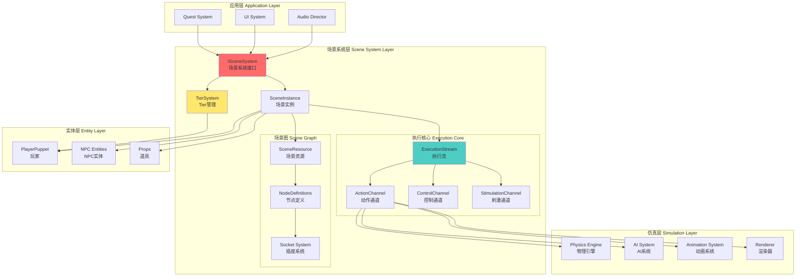

### 数据流架构

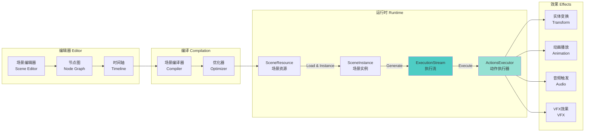

---

## 场景实例生命周期

### 完整生命周期状态图

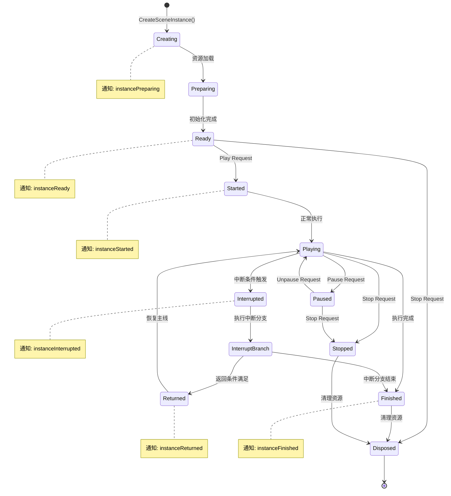

### 场景创建序列图

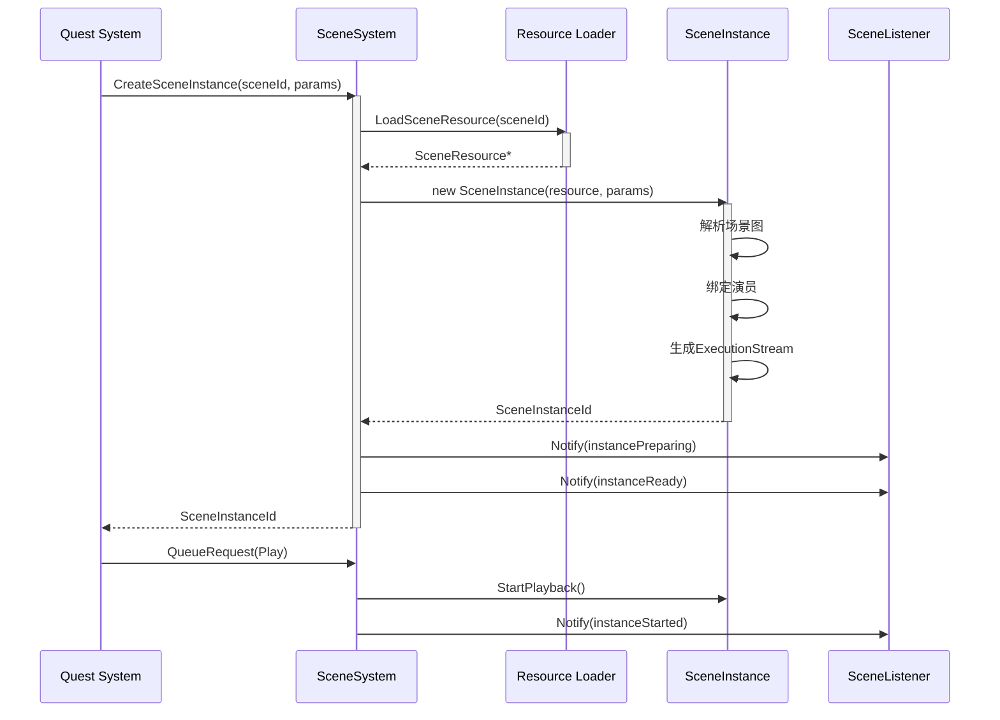

---

## ExecutionStream执行流

### 三通道架构详解

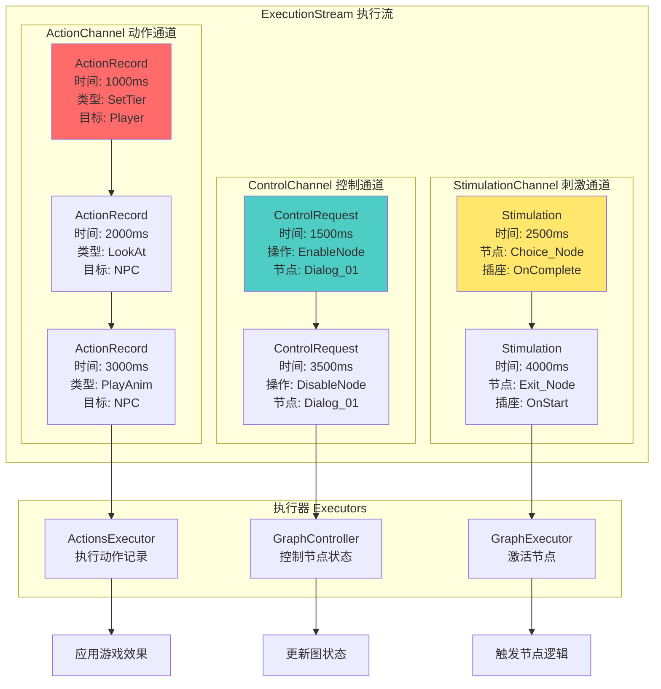

### 时间推进机制

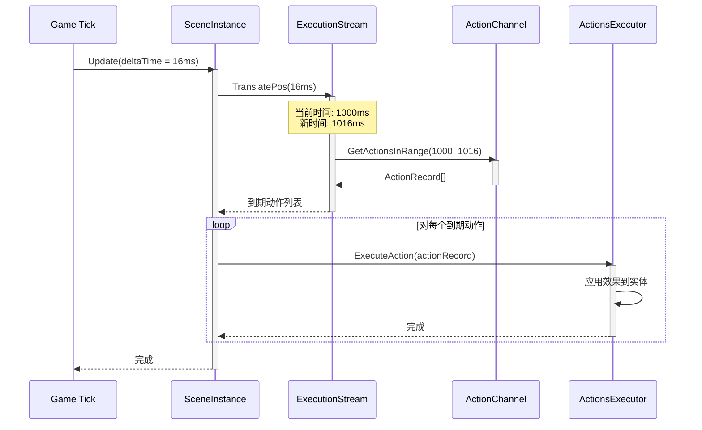

---

## Tier切换状态机

### Tier层级关系

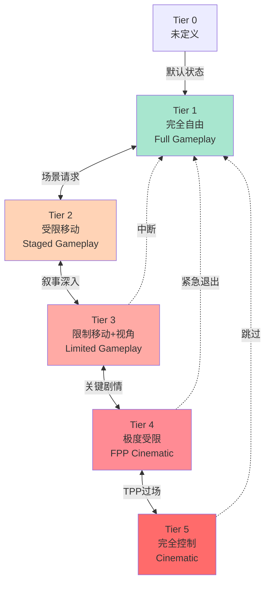

### Tier切换序列

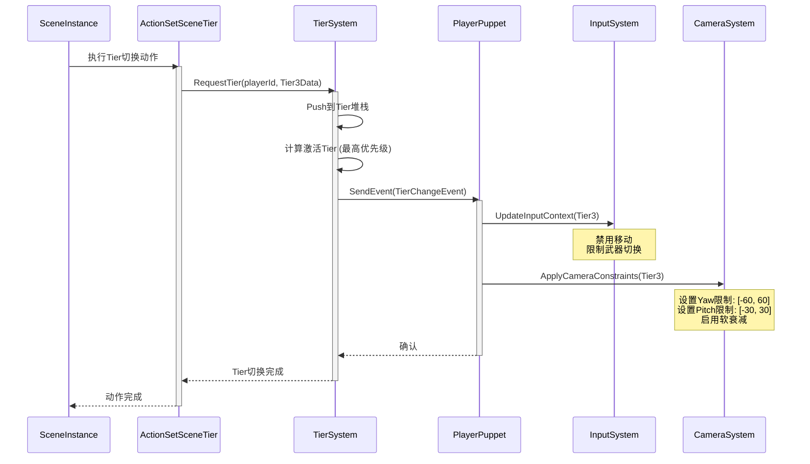

### Tier堆栈管理

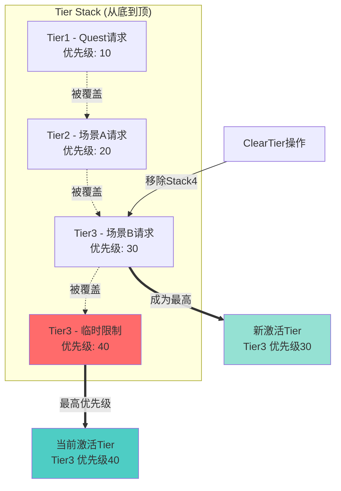

---

## 中断处理流程

### 中断检测与处理

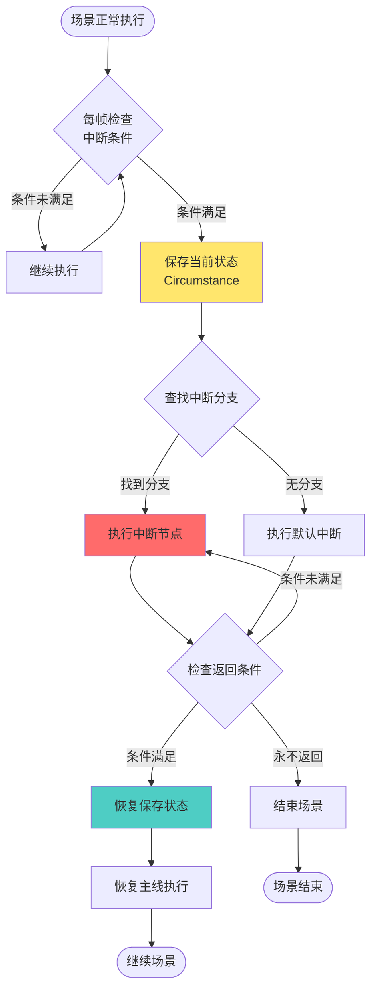

### 中断条件类型决策树

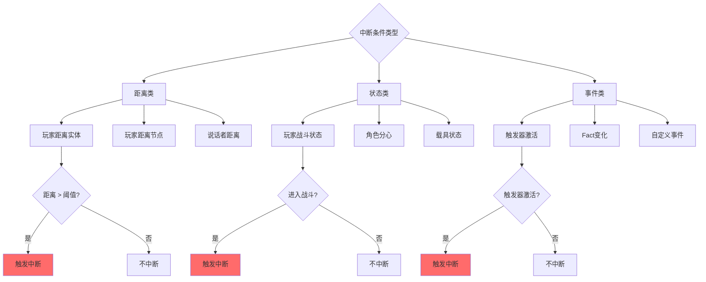

---

## 信号传播机制

### 节点激活与信号流

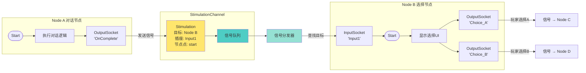

### 系统插座触发机制

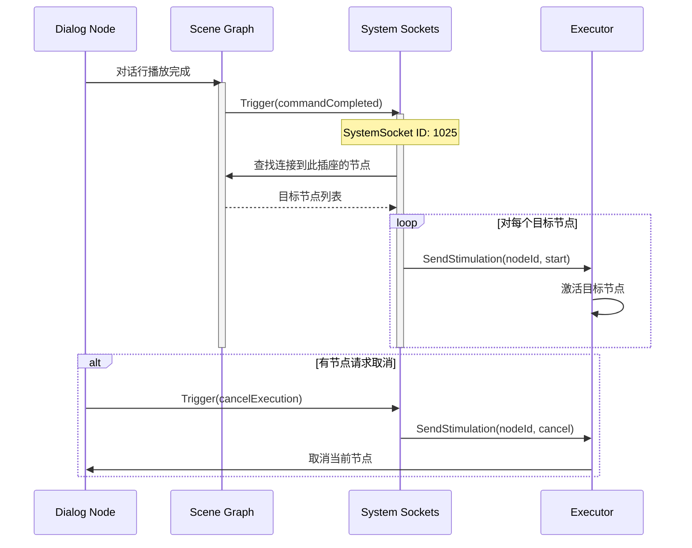

---

## 系统集成关系

### 跨系统协作图

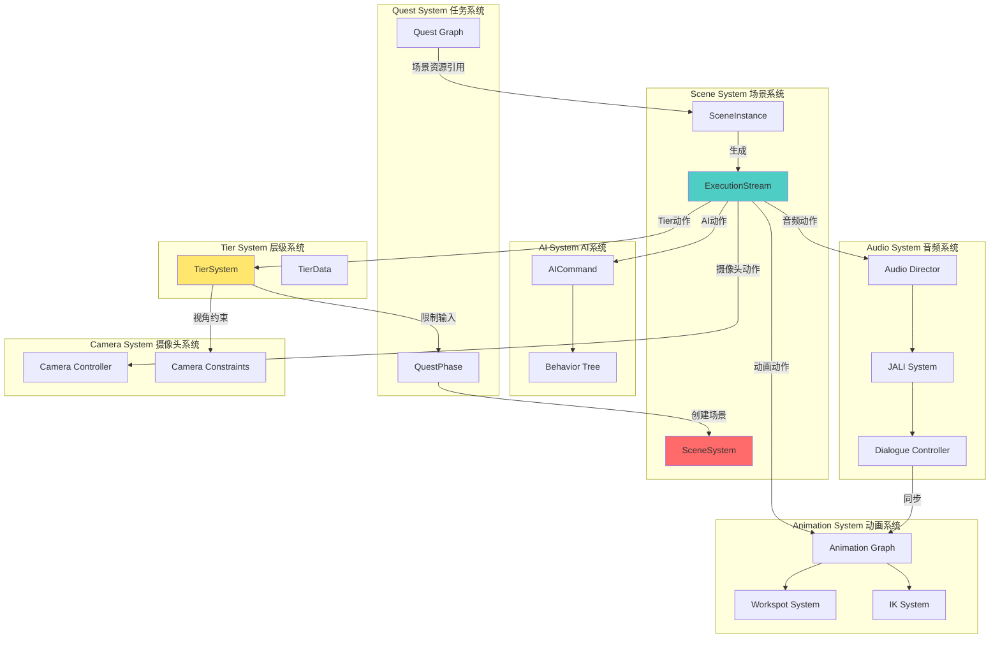

### 资源依赖关系

```mermaid
graph TD
    subgraph "Quest Phase Resource"
        QPR[questPhaseResource]
        QG[questGraphDefinition]
        PP[phasePrefabs[]]
    end

    subgraph "Scene Resources"
        SR1[SceneResource A<br/>q110_02_placide.scene]
        SR2[SceneResource B<br/>q110_03_market.scene]
    end

    subgraph "Scene Dependencies"
        Prefab1[场景预制件<br/>Environment]
        Prefab2[工作点<br/>Workspots]
        Com1[社区<br/>Communities]
        Anim1[动画<br/>Animations]
    end

    subgraph "Asset Resources"
        Mesh1[网格<br/>Meshes]
        Tex1[纹理<br/>Textures]
        Audio1[音频<br/>Voice Lines]
        VFX1[特效<br/>VFX]
    end

    QPR --> QG
    QPR --> PP

    PP --> SR1
    PP --> SR2

    SR1 --> Prefab1
    SR1 --> Prefab2
    SR1 --> Com1
    SR1 --> Anim1

    Prefab1 --> Mesh1
    Prefab1 --> Tex1
    Anim1 --> Audio1
    SR1 --> VFX1

    style QPR fill:#a8e6cf
    style SR1 fill:#ffd3b6
    style Prefab1 fill:#ffaaa5
```

---

## 类继承关系

### Action类层次结构

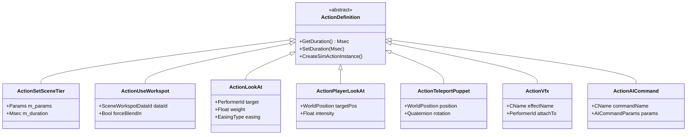

### Interrupt类层次结构

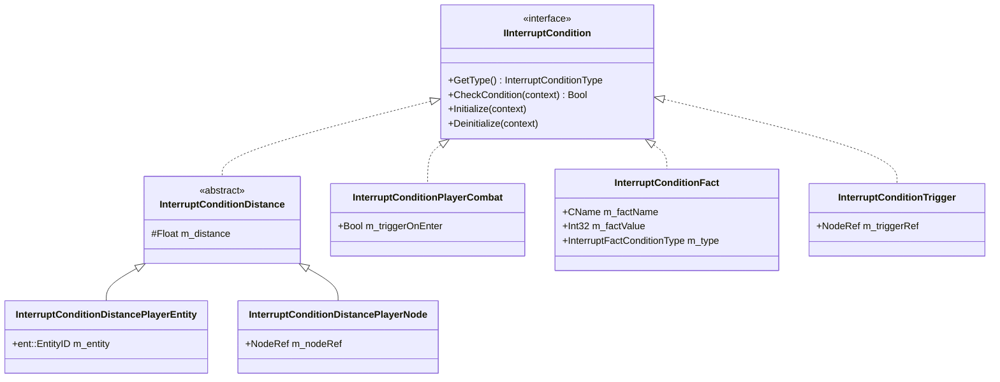

### TierData类层次结构

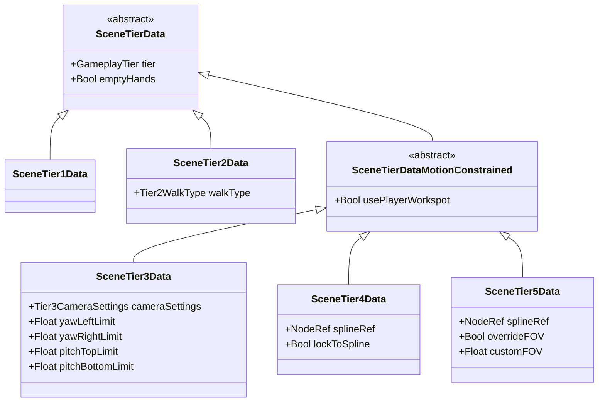

---

## 数据结构详解

### ExecutionStream内部结构

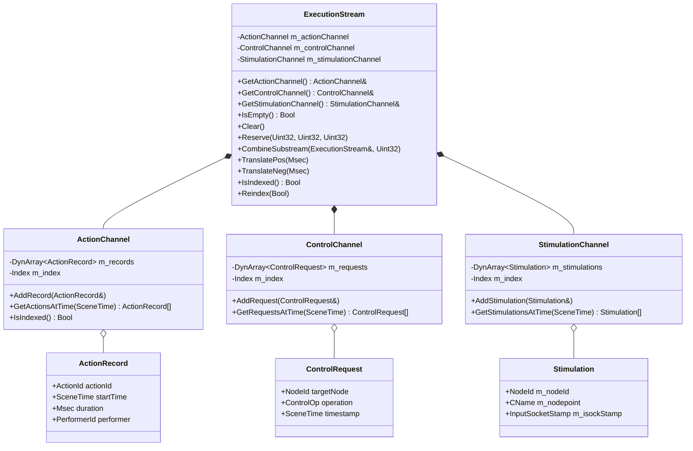

### SceneGraph节点结构

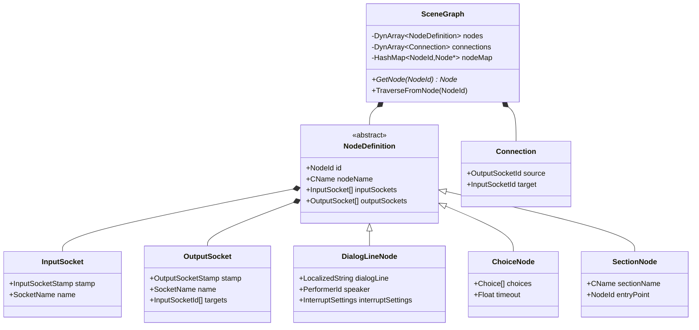

---

## 性能分析流程图

### 帧预算分配

```mermaid
pie title CPU帧预算分配 (16.67ms @ 60FPS)
    "场景逻辑更新" : 2.0
    "ExecutionStream处理" : 1.5
    "动作执行" : 3.0
    "物理模拟" : 4.0
    "AI更新" : 2.5
    "渲染准备" : 3.67
```

### 场景系统性能优化决策树

```mermaid
flowchart TD
    Start{帧率下降?}

    Start -->|是| CheckProf[启用Profiler]
    Start -->|否| End1([保持监控])

    CheckProf --> Hotspot{定位热点}

    Hotspot -->|ExecutionStream| OptStream[优化Stream]
    Hotspot -->|中断检查| OptInterrupt[优化中断]
    Hotspot -->|动作执行| OptActions[优化动作]
    Hotspot -->|其他| OptOther[其他优化]

    OptStream --> IndexCheck{已索引?}
    IndexCheck -->|否| DoIndex[强制索引]
    IndexCheck -->|是| PreAlloc[预分配容量]

    OptInterrupt --> ReduceFreq[降低检查频率]
    ReduceFreq --> Cache[缓存结果]

    OptActions --> Batch[批处理动作]
    Batch --> Prioritize[优先级排序]

    DoIndex --> Measure1{测量改善}
    PreAlloc --> Measure1
    Cache --> Measure1
    Prioritize --> Measure1
    OptOther --> Measure1

    Measure1 -->|显著改善| End2([完成优化])
    Measure1 -->|改善不足| Deeper[更深层分析]

    Deeper --> End3([联系引擎团队])

    style CheckProf fill:#ffe66d
    style DoIndex fill:#4ecdc4
    style End2 fill:#a8e6cf
```

---

## 总结

这些架构图和流程图展示了InteractiveScene系统的：

1. **层次化设计** - 清晰的职责分离
2. **数据流** - 从编辑器到运行时的完整路径
3. **状态管理** - 场景生命周期与Tier切换
4. **信号机制** - 节点间的通信协议
5. **系统集成** - 与其他游戏系统的协作关系
6. **类层次** - 扩展点与继承结构

使用这些图表可以：
- 快速理解系统架构
- 定位特定功能的实现位置
- 设计新功能的集成方案
- 调试问题时追踪数据流

---

*本文档使用Mermaid语法绘制*
*可在支持Mermaid的Markdown查看器中渲染*
*推荐工具: Typora, VS Code (Markdown Preview Enhanced), GitHub*
