# InteractiveScene系统核心元素关系图
> 7大核心元素及其交织关系的可视化解析

---

## 🎯 核心元素总览

InteractiveScene系统由**7个核心元素**构成，它们相互依赖、协同工作，形成一个完整的交互式叙事引擎。

```
核心元素清单：

1. 场景图 (Scene Graph)          - 叙事的逻辑结构
2. 执行流 (Execution Stream)     - 时间驱动的事件序列
3. Tier系统 (Tier System)        - 控制权分级管理
4. 信号系统 (Signal System)      - 节点间通信机制
5. 演员系统 (Actor System)       - 参与叙事的实体
6. 中断系统 (Interrupt System)   - 容错与分支处理
7. 资源管理 (Resource Manager)   - 预加载与流式管理
```

---

## 📊 第一层：宏观架构关系

### 系统全景图

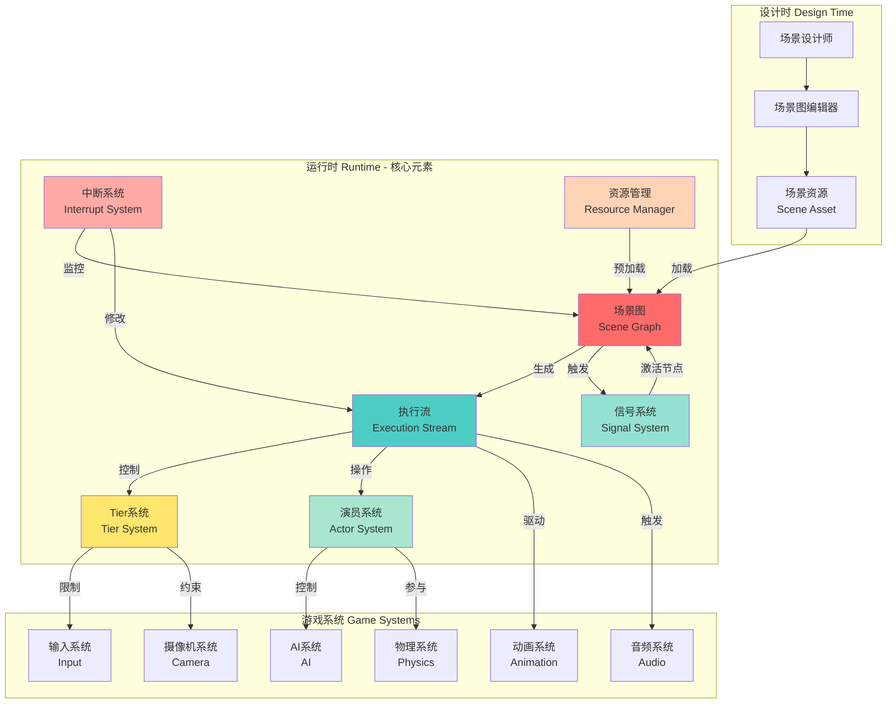

---

## 🔍 第二层：核心元素详解

### 元素1：场景图 (Scene Graph)

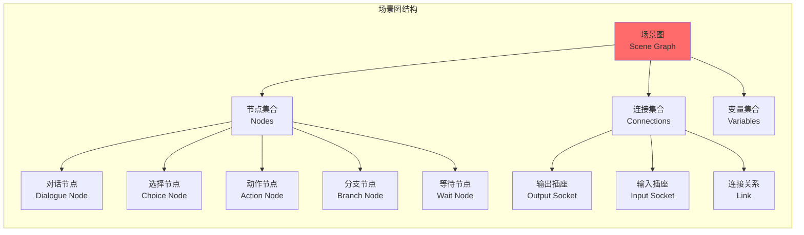

**核心职责**：
- 定义叙事的逻辑流程
- 组织节点的执行顺序
- 管理分支和条件判断

**与其他元素的关系**：
- → 执行流：场景图被解析生成执行流
- → 信号系统：节点间通过信号通信
- → 中断系统：中断时保存图状态
- → 资源管理：图中引用的资源需要预加载

---

### 元素2：执行流 (Execution Stream)

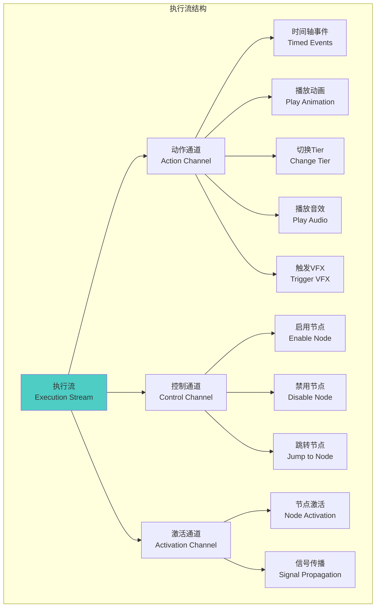

**核心职责**：
- 将场景图转化为时间序列
- 精确控制事件触发时机
- 支持回放和快进

**与其他元素的关系**：
- ← 场景图：从图中生成
- → Tier系统：通过动作通道切换Tier
- → 演员系统：向演员发送动作指令
- ← 中断系统：中断时修改执行流

---

### 元素3：Tier系统 (Tier System)

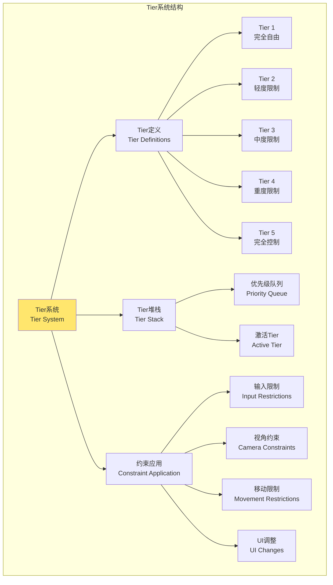

**核心职责**：
- 管理玩家控制权
- 动态调整输入映射
- 约束摄像机和移动

**与其他元素的关系**：
- ← 执行流：接收Tier切换指令
- → 游戏系统：应用约束到输入/摄像机
- ← 中断系统：中断可能改变Tier

---

### 元素4：信号系统 (Signal System)

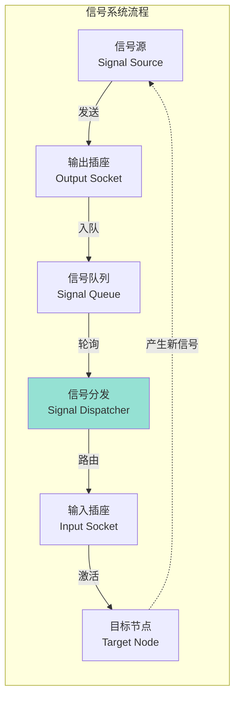

**核心职责**：
- 节点间通信
- 激活下游节点
- 传播执行流

**与其他元素的关系**：
- ← 场景图：插座定义在节点上
- ← 执行流：信号触发通过激活通道
- → 场景图：信号激活下一个节点

---

### 元素5：演员系统 (Actor System)

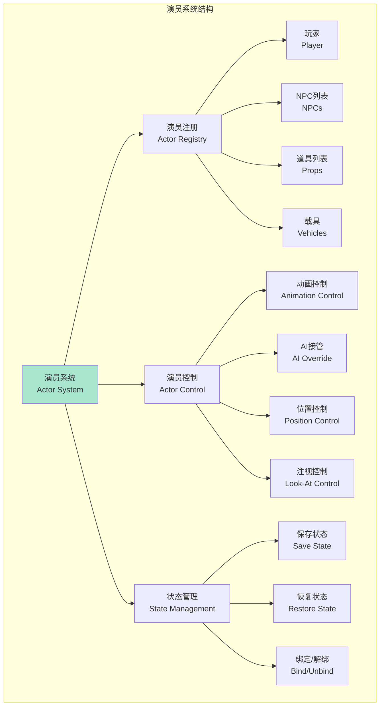

**核心职责**：
- 管理场景参与者
- 接管实体控制权
- 保存和恢复状态

**与其他元素的关系**：
- ← 场景图：定义需要哪些演员
- ← 执行流：接收动作指令
- ← 中断系统：中断时保存演员状态
- → 游戏系统：控制AI、动画、物理

---

### 元素6：中断系统 (Interrupt System)

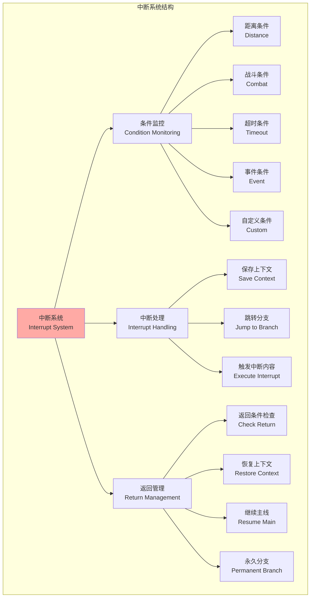

**核心职责**：
- 监控中断条件
- 保存和恢复场景状态
- 管理分支跳转

**与其他元素的关系**：
- ← 场景图：监控节点执行
- ← 执行流：可以修改执行流
- → 演员系统：保存演员状态
- → Tier系统：可能需要临时改变Tier

---

### 元素7：资源管理 (Resource Manager)

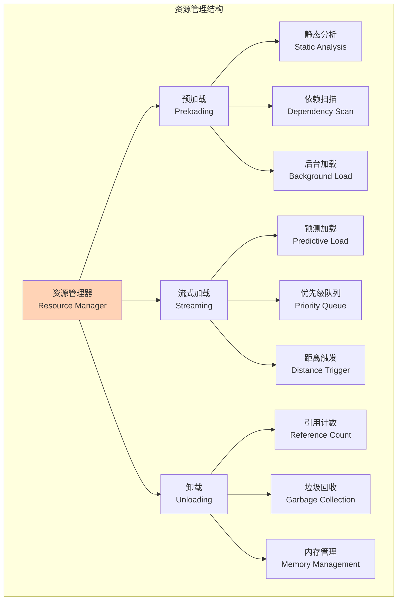

**核心职责**：
- 预测资源需求
- 异步加载资源
- 管理内存占用

**与其他元素的关系**：
- ← 场景图：分析图中引用的资源
- ← 执行流：预测未来需要的资源
- ← 演员系统：加载演员相关资源

---

## 🔗 第三层：核心交互流程

### 流程1：场景启动流程

```mermaid
sequenceDiagram
    participant User as 玩家触发
    participant SG as 场景图
    participant RM as 资源管理器
    participant ES as 执行流
    participant AS as 演员系统
    participant TS as Tier系统
    participant SS as 信号系统

    User->>SG: 进入触发区域
    activate SG

    SG->>RM: 请求加载资源
    activate RM
    RM-->>SG: 资源就绪
    deactivate RM

    SG->>AS: 绑定演员实体
    activate AS
    AS-->>SG: 演员准备完成
    deactivate AS

    SG->>ES: 生成执行流
    activate ES

    ES->>TS: 切换到Tier 2
    activate TS
    TS-->>ES: Tier应用完成
    deactivate TS

    ES->>AS: 发送动作指令
    AS-->>ES: 动作执行中
    deactivate AS

    ES->>SS: 完成信号
    activate SS
    SS->>SG: 激活下一节点
    SS-->>ES: 信号已传播
    deactivate SS

    deactivate ES
    deactivate SG
```

---

### 流程2：中断处理流程

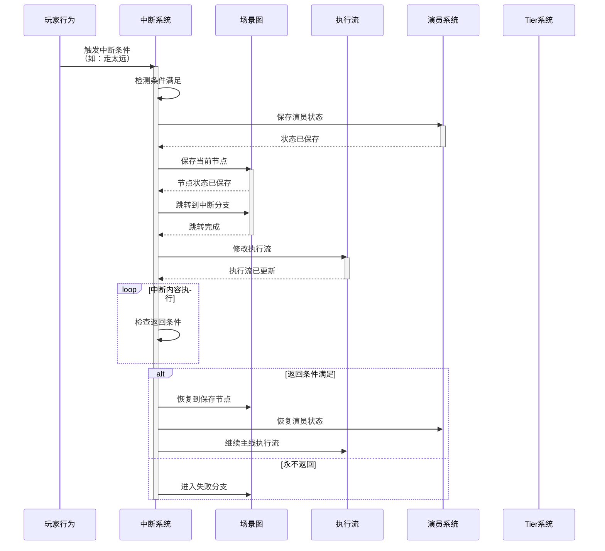

---

### 流程3：Tier切换流程

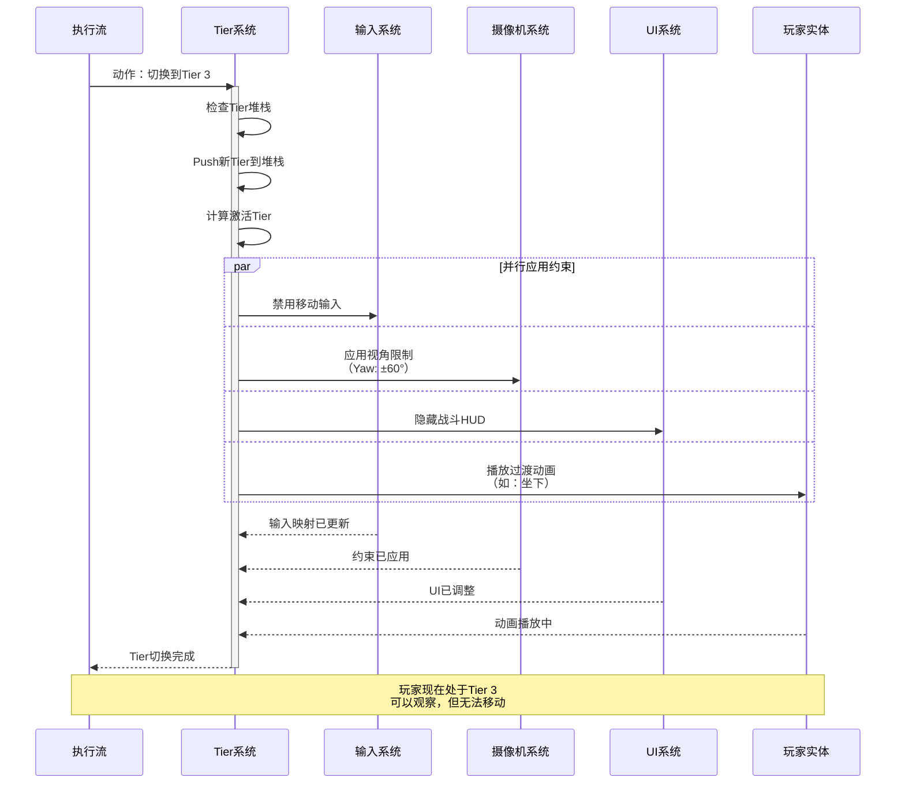

---

## 🧩 第四层：数据流关系

### 核心数据流向图

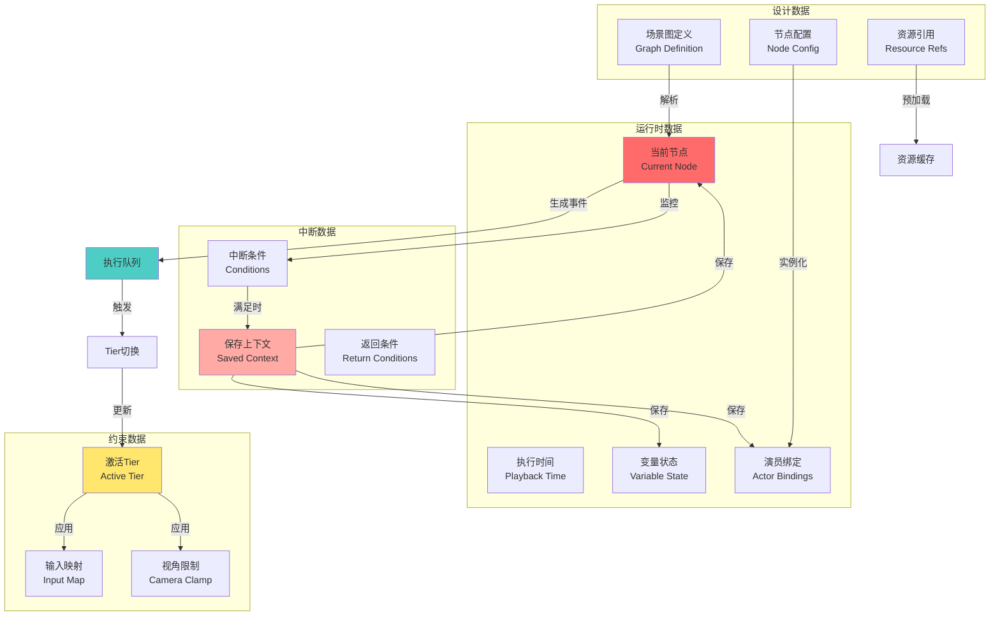

---

## 🎯 第五层：关键依赖关系

### 依赖强度矩阵

| 元素 ↓ 依赖 → | 场景图 | 执行流 | Tier | 信号 | 演员 | 中断 | 资源 |
|--------------|-------|-------|------|------|------|------|------|
| **场景图** | - | 生成 | - | 定义 | 引用 | 被监控 | 引用 |
| **执行流** | 来自 | - | 控制 | 触发 | 指令 | 被修改 | - |
| **Tier** | - | 被控制 | - | - | - | - | - |
| **信号** | 激活 | 记录 | - | - | - | - | - |
| **演员** | 被引用 | 被指令 | - | - | - | 被保存 | 需要 |
| **中断** | 监控 | 修改 | 改变 | - | 保存 | - | - |
| **资源** | 分析 | 预测 | - | - | 关联 | - | - |

**依赖强度说明**：
- 🔴 **强依赖** (生成、控制)：A必须有B才能工作
- 🟡 **中依赖** (使用、调用)：A经常使用B
- 🟢 **弱依赖** (可选、优化)：A可以不用B

---

## 🔄 第六层：生命周期关系

### 场景完整生命周期

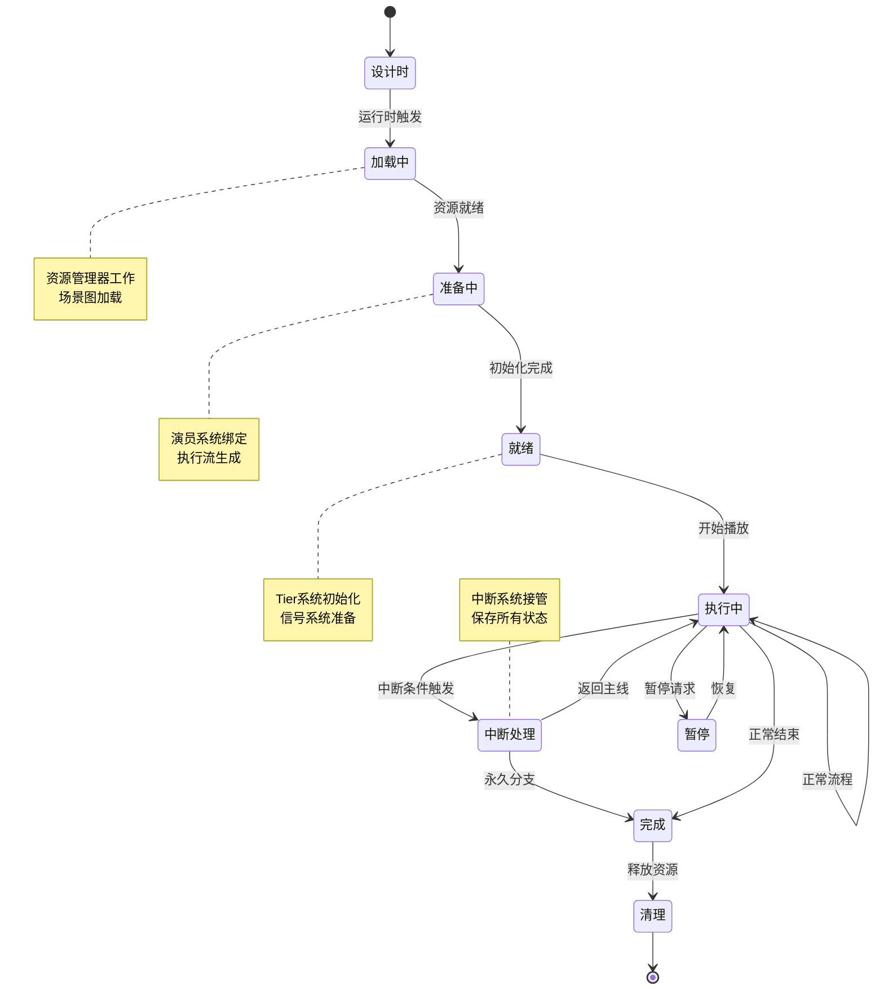

---

## 💡 第七层：设计关键点

### 7大核心元素的设计要点

#### 1. 场景图 - 逻辑清晰
```
✅ 必须：
  - 支持分支和循环
  - 节点可重用
  - 可视化编辑

⚠️ 注意：
  - 避免过度复杂（建议<100节点）
  - 提供调试视图
  - 支持热重载
```

#### 2. 执行流 - 确定性
```
✅ 必须：
  - 精确到毫秒的时间控制
  - 支持回放
  - 可合并子流

⚠️ 注意：
  - 避免浮点数累积误差
  - 提供时间缩放功能
  - 优化查询性能
```

#### 3. Tier系统 - 渐进性
```
✅ 必须：
  - 至少3个层级
  - 平滑过渡
  - 有叙事理由

⚠️ 注意：
  - 避免过度限制（Tier4不超过2分钟）
  - 提供软约束而非硬墙
  - 给玩家"补偿自由"
```

#### 4. 信号系统 - 可靠性
```
✅ 必须：
  - 保证送达
  - 有序传播
  - 可追踪调试

⚠️ 注意：
  - 避免信号风暴
  - 防止循环依赖
  - 限制传播深度
```

#### 5. 演员系统 - 状态完整
```
✅ 必须：
  - 保存完整状态
  - 无缝接管/释放
  - 支持多实体同步

⚠️ 注意：
  - 处理实体已销毁情况
  - 避免状态爆炸
  - 提供状态快照
```

#### 6. 中断系统 - 鲁棒性
```
✅ 必须：
  - 覆盖主要中断场景
  - 提供返回机制
  - 保护关键状态

⚠️ 注意：
  - 避免过于敏感（误触发）
  - 给玩家反馈
  - 设计兜底方案
```

#### 7. 资源管理 - 预测性
```
✅ 必须：
  - 提前预加载
  - 异步加载
  - 内存监控

⚠️ 注意：
  - 避免加载峰值
  - 提供遮罩方案
  - 优雅降级
```

---

## 🎨 第八层：集成模式

### 模式A：最小集成

```
只实现核心三元素：

┌─────────┐
│ 场景图  │ ← 定义逻辑
└────┬────┘
     ↓
┌─────────┐
│ 执行流  │ ← 驱动时间轴
└────┬────┘
     ↓
┌─────────┐
│ Tier系统│ ← 控制自由度
└─────────┘

适用：小团队、短周期、轻叙事
```

### 模式B：标准集成

```
实现5个核心元素：

    场景图 ──→ 执行流 ──→ Tier系统
       │         │            │
       ↓         ↓            ↓
    信号系统   演员系统   游戏系统
       ↑         ↑
       └─────┬───┘
         中断系统

适用：中型团队、标准周期、中度叙事
```

### 模式C：完整集成

```
实现全部7个元素：

         ┌─ 资源管理 ─┐
         ↓             ↓
    场景图 ──→ 执行流 ──→ Tier系统
       │         │            │
       ↓         ↓            ↓
    信号系统   演员系统   游戏系统
       ↑         ↑            ↑
       └─────┬───┘            │
         中断系统 ←─────────────┘

适用：大型团队、长周期、重度叙事
```

---

## 📋 总结：关键要点

### 7大核心元素的本质

1. **场景图** = 大脑（决策中心）
2. **执行流** = 神经（传递指令）
3. **Tier系统** = 肌肉（执行动作）
4. **信号系统** = 神经递质（细胞通信）
5. **演员系统** = 器官（具体功能）
6. **中断系统** = 免疫系统（应对异常）
7. **资源管理** = 循环系统（供给营养）

### 彼此关系的本质

```
场景图定义"做什么"
  ↓
执行流决定"何时做"
  ↓
Tier系统控制"怎么做"
  ↓
信号系统传递"谁来做"
  ↓
演员系统执行"正在做"
  ↓
中断系统处理"做不了"
  ↓
资源管理保证"能做完"
```

### 设计黄金法则

```
1. 解耦原则：每个元素可独立测试
2. 单一职责：每个元素只做一件事
3. 最小依赖：减少元素间强耦合
4. 可扩展性：预留扩展点
5. 可调试性：提供完整日志
```

---

*本文档展示InteractiveScene的核心元素关系*
*建议打印并贴在工作区作为参考*
*设计时常回顾，确保理解正确*

**版本**: 1.0
**日期**: 2026-02-09
