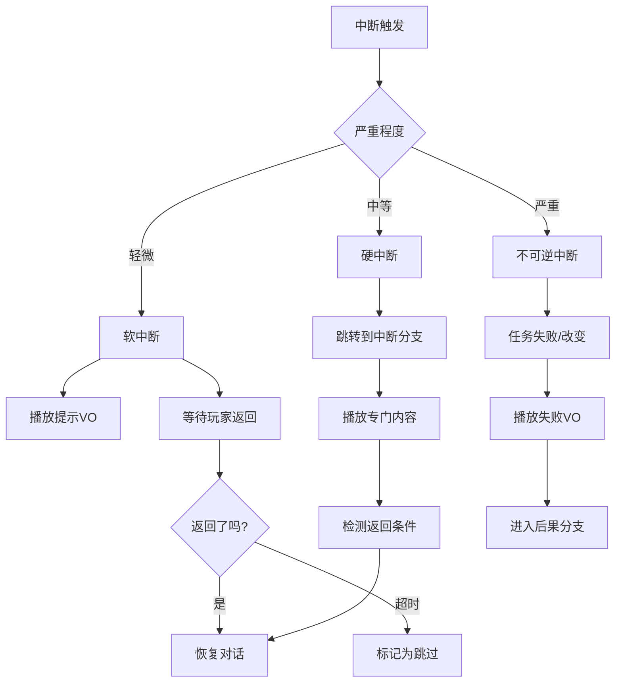

# 交互式场景系统：实践决策树与设计工作坊
> 从概念到落地的行动指南

---

## 🎯 文档定位

**这不是教程，而是决策辅助工具。**

当你面临具体设计问题时，本文档帮你：
1. 快速定位问题类型
2. 权衡不同方案
3. 选择适合你项目的路径

---

## 📊 第一部分：项目评估决策树

### 决策树：我需要完整的交互式场景系统吗？

```
开始
  ↓
是FPP游戏吗？
  ├─ YES → 需要叙事吗？
  │         ├─ YES → [强烈推荐] 完整实现
  │         └─ NO  → [不需要] 跳过
  │
  └─ NO  → 是TPP/等角游戏吗？
            ├─ YES → 叙事是核心玩法吗？
            │         ├─ YES → [推荐] 部分实现（重点：Tier + 图）
            │         └─ NO  → [可选] 传统过场足够
            │
            └─ NO  → [不适用] 非角色游戏（策略、解谜等）
```

### 决策树：应该实现哪些功能？

```
我有...

多人团队 + 6个月以上开发时间？
  ├─ YES → 完整实现
  │        ├ 场景图编辑器
  │        ├ 执行流系统
  │        ├ Tier管理（5层）
  │        ├ 中断系统
  │        ├ 预加载系统
  │        └ 回放支持
  │
  └─ NO  → 小团队 / 短周期？
            ├─ 使用中间件基础
            │  ├ Unity: Timeline + Cinemachine
            │  └ Unreal: Sequencer + Gameplay Abilities
            │
            └─ 自建核心模块
               ├ [必须] 基础Tier系统（3层）
               ├ [必须] 简单场景图（序列+分支）
               ├ [可选] 距离中断
               └ [跳过] 高级功能
```

---

## 🔧 第二部分：功能设计决策表

### 场景1：对话系统

| 需求 | 方案A: 简化版 | 方案B: 完整版 | 推荐场景 |
|------|-------------|-------------|---------|
| **控制权** | Tier3: 完全锁定 | Tier2-3: 渐进限制 | B适合沉浸式游戏 |
| **视角** | 固定朝向NPC | 360度自由观察 | B适合FPP |
| **移动** | 完全禁止 | 小范围移动 | A适合小空间 |
| **中断** | 不支持 | 距离+战斗中断 | B适合开放世界 |
| **UI** | 2D覆盖 | 3D空间UI | B更沉浸但复杂 |

**决策问题**：

```
Q1: 对话是否需要在移动中进行？
  - YES → 选择方案B + Tier2（允许慢走）
  - NO  → 方案A足够

Q2: 玩家可能在对话中战斗吗？
  - YES → 必须实现战斗中断
  - NO  → 可以简化

Q3: 对话地点是否多样？
  - YES → 需要动态Tier调整
  - NO  → 固定Tier配置
```

---

### 场景2：载具剧情

| 需求 | 方案A: 预渲染视频 | 方案B: 实时场景 | 方案C: 混合 |
|------|----------------|---------------|----------|
| **玩家控制** | 无（播片） | Tier4 视角限制 | 关键时刻可交互 |
| **世界连续性** | 断裂 | 保持 | 部分保持 |
| **性能要求** | 低 | 高 | 中 |
| **灵活性** | 无法适应玩家状态 | 完全动态 | 关键点动态 |
| **开发成本** | 高（外包） | 中（系统复用） | 高（双重工作） |

**决策树**：

```
载具是玩家控制的吗？
  ├─ YES → [方案B] 玩家驾驶 + 乘客对话
  │         ├ 实现Tier2（降低操控精度）
  │         └ 增加对话触发检测点
  │
  └─ NO  → 载具是脚本控制的？
            ├─ YES → [方案B] 轨道载具 + Tier4
            │         ├ 沿Spline行驶
            │         ├ 限制视角范围
            │         └ 关键点触发事件
            │
            └─ NO  → [方案A] 直接播片最简单
```

---

### 场景3：战斗中叙事

| 需求 | 方案A: 战前/战后 | 方案B: 战中触发 | 方案C: 动态叙事 |
|------|----------------|---------------|---------------|
| **时机** | 战斗间隙 | Boss血量节点 | 实时响应 |
| **Tier** | 0 → 3 → 0 | 保持Tier1 | Tier1 + UI提示 |
| **实现** | 简单 | 中等 | 复杂 |
| **沉浸感** | 中断感明显 | 较流畅 | 最佳 |
| **风险** | 低 | 中（血量判定） | 高（同步问题） |

**选择指南**：

```
游戏节奏是？
  ├─ 快节奏（动作游戏）
  │   → [方案C] 或 [方案B]
  │     - 不能中断战斗
  │     - 用VO + 字幕
  │     - 不锁定玩家
  │
  └─ 慢节奏（战术游戏）
      → [方案A]
        - 明确分隔战斗/叙事
        - 完整演出质量
```

---

## 🎨 第三部分：Tier配置工作坊

### 模板：设计你的Tier系统

#### Step 1: 定义你的游戏的"自由度轴"

列出玩家可以做的所有事：

```
示例（FPS游戏）：
  [ ] 移动（WASD）
  [ ] 冲刺（Shift）
  [ ] 跳跃（Space）
  [ ] 蹲下（Ctrl）
  [ ] 射击（鼠标左键）
  [ ] 换武器（数字键）
  [ ] 互动（E）
  [ ] 打开菜单（ESC）
  [ ] 视角旋转（鼠标）
  [ ] 视角Zoom（滚轮）
```

#### Step 2: 设计至少3个Tier

```
Tier 1: 完全自由
  ✅ 所有上述动作

Tier 2: 轻度限制（用于____场景）
  ✅ 移动（但禁用冲刺）
  ✅ 视角
  ✅ 互动
  ❌ 跳跃
  ❌ 武器相关
  ❌ 菜单

Tier 3: 重度限制（用于____场景）
  ❌ 移动
  ✅ 视角（±60度）
  ✅ 互动（情境化）
  ❌ 其他所有

（可选）Tier 4: 极度限制（用于____场景）
  ❌ 移动
  ⚠️ 视角（±30度，速度减半）
  ❌ 其他所有
```

#### Step 3: 映射叙事场景到Tier

```
对话系统        → Tier 2 或 3
跟随NPC         → Tier 2
坐下/躺下       → Tier 3
载具（乘客）    → Tier 4
载具（司机）    → Tier 2 + 自定义输入映射
电梯/加载点     → Tier 2
关键演出        → Tier 3 或 4
```

---

### 练习：评估你的Tier设计

对每个Tier问：

```
✅ 检查项：
  [ ] 这个限制有叙事理由吗？
      （如：坐下 → 无法移动，合理）

  [ ] 玩家能理解为什么受限吗？
      （如：Tier2禁用冲刺，可能困惑）

  [ ] 过渡是否平滑？
      （如：Tier1 → Tier3 太跳跃）

  [ ] 是否保留了"心理自由"？
      （如：Tier3至少能转头看）

  [ ] 时长是否合理？
      （如：Tier4超过2分钟会烦躁）
```

---

## 🔀 第四部分：中断设计工作坊

### 决策表：哪些场景需要中断系统？

| 场景类型 | 需要中断？ | 优先级 | 原因 |
|---------|----------|--------|------|
| 开放世界对话 | ✅ 强烈需要 | 高 | 玩家可能随时离开 |
| 室内线性对话 | ⚠️ 可选 | 中 | 空间受限，离开概率低 |
| 过场演出 | ❌ 不需要 | - | 设计意图是观看 |
| 教程引导 | ✅ 需要 | 高 | 玩家可能不听从 |
| Boss战阶段转换 | ⚠️ 可选 | 低 | 玩家在战斗中，行为可预测 |

### 模板：设计中断条件

```
场景：____________

中断条件（按优先级）：
  1. [必须] ____________
     触发时：____________
     返回条件：____________

  2. [重要] ____________
     触发时：____________
     返回条件：____________

  3. [可选] ____________
     触发时：____________
     返回条件：____________
```

#### 示例：开放世界对话

```
场景：与NPC对话

中断条件：
  1. [必须] 玩家距离 > 10米
     触发时：播放"等等，你去哪？"
     返回条件：玩家返回5米内，30秒内

  2. [重要] 玩家攻击NPC
     触发时：立即中断，NPC进入战斗
     返回条件：永不返回（任务失败）

  3. [可选] 玩家接电话（其他任务）
     触发时：对话淡出，保存状态
     返回条件：电话结束后自动恢复
```

---

### 决策：中断后如何处理？



---

## 🛠️ 第五部分：技术选型指南

### Unity开发者路线图

```
阶段1: 基础搭建（Week 1-2）
  [ ] 安装Cinemachine + Timeline
  [ ] 创建Tier枚举和管理器
  [ ] 实现基础输入映射切换
  [ ] 测试：Tier1 ↔ Tier3 切换

阶段2: 场景图（Week 3-4）
  [ ] 选择节点编辑器
      - 推荐：xNode（开源）或 Unity Visual Scripting
  [ ] 定义节点类型
      ├ StartNode
      ├ DialogueNode
      ├ BranchNode
      └ ActionNode
  [ ] 实现节点执行器
  [ ] 测试：简单线性场景

阶段3: 集成（Week 5-6）
  [ ] Timeline触发Tier切换
  [ ] 节点图触发Timeline
  [ ] 实现基础中断（距离）
  [ ] 测试：完整对话场景
```

**推荐资产**：
- **Cinemachine**: 摄像机管理
- **Timeline**: 时间轴
- **Input System**: 现代化输入管理
- **xNode**: 可视化节点编辑器（免费）
- **Dialogue System for Unity**: 对话系统（付费，可选）

---

### Unreal开发者路线图

```
阶段1: 蓝图原型（Week 1-2）
  [ ] 创建Tier枚举（C++或BP）
  [ ] 实现GameplayAbility基础
  [ ] 使用Enhanced Input切换映射
  [ ] 测试：Tier切换

阶段2: Sequencer集成（Week 3-4）
  [ ] 创建Master Sequence
  [ ] 添加Camera Cuts
  [ ] 绑定角色到Sequence
  [ ] 实现Tier触发节点（Blueprint）
  [ ] 测试：简单剧情

阶段3: 行为树扩展（Week 5-6）
  [ ] 创建SceneTask节点
  [ ] 实现中断装饰器
  [ ] 集成对话系统（可用第三方）
  [ ] 测试：复杂场景
```

**推荐工具**：
- **Sequencer**: 内置时间轴
- **Enhanced Input**: 新输入系统
- **Gameplay Ability System**: 能力和状态管理
- **Control Rig**: 程序化角色控制
- **Dialogue Plugin**: 对话图（免费插件）

---

### 自研引擎建议

```
核心模块优先级：

P0（必须）：
  1. 状态机框架
  2. 实体组件系统
  3. 输入管理系统
  4. 基础脚本支持

P1（重要）：
  5. 时间轴系统
  6. 摄像机栈
  7. 图执行器

P2（增强）：
  8. 可视化编辑器
  9. 热重载
  10. 调试工具

推荐开源参考：
  - Godot的AnimationTree（状态机）
  - Unity Timeline源码（时间轴设计）
  - Unreal GAS（能力系统）
```

---

## 📈 第六部分：迭代优化指南

### 第一次迭代：让它能跑

```
目标：实现最简单的端到端流程

必做：
  ✅ 一个线性场景（3-5个节点）
  ✅ 两个Tier（Tier1和Tier3）
  ✅ 无中断

验收标准：
  - 玩家能从头到尾体验场景
  - Tier切换平滑
  - 无crash
```

---

### 第二次迭代：加入分支

```
目标：支持玩家选择

新增：
  ✅ 选择节点
  ✅ 条件分支
  ✅ 多结局

测试重点：
  - 所有分支都能到达
  - 变量正确传递
  - UI显示正确
```

---

### 第三次迭代：容错性

```
目标：处理玩家"捣乱"

新增：
  ✅ 距离中断
  ✅ 战斗中断
  ✅ 超时处理

测试方法：
  - 故意离开场景
  - 故意攻击NPC
  - 故意不做任何操作
```

---

### 第四次迭代：体验优化

```
目标：打磨细节

优化：
  ✅ Tier过渡动画
  ✅ 摄像机缓动
  ✅ 音频淡入淡出
  ✅ UI反馈

测试：
  - 玩家能否"感受"到限制的理由
  - 过渡是否自然
  - 是否有突兀感
```

---

## 🎮 第七部分：常见陷阱与解决方案

### 陷阱1：过度限制玩家

```
症状：
  - Tier3占比超过50%游戏时间
  - 玩家频繁抱怨"无法移动"

诊断：
  问自己：这个限制真的必要吗？

解决方案：
  1. 审查所有Tier3场景
  2. 能否改为Tier2？
  3. 能否缩短时长？
  4. 能否增加"观察"内容？

示例：
  原：对话10分钟，全程Tier3
  改：对话5分钟Tier3 + 5分钟边走边聊Tier2
```

---

### 陷阱2：中断逻辑过于宽松

```
症状：
  - 玩家轻微移动就触发中断
  - 中断提示过于频繁

诊断：
  中断阈值设置不当

解决方案：
  1. 增加距离阈值（5米 → 10米）
  2. 增加时间容忍（立即 → 3秒后）
  3. 添加视觉提示（警告区）

设计模式：
  安全区 → 警告区 → 中断区
  5米内    5-10米    10米外
  正常     UI提示    触发
```

---

### 陷阱3：忘记保存玩家状态

```
症状：
  - 中断后武器消失
  - 血量/状态重置
  - 任务进度丢失

原因：
  场景系统接管后未保存上下文

解决方案：
  在Tier切换时保存：
    [ ] 武器装备
    [ ] 生命值
    [ ] Buff/Debuff
    [ ] 任务变量
    [ ] 玩家位置

  在恢复时检查冲突：
    如果玩家已死亡 → 不恢复场景
    如果武器被卸下 → 重新装备
```

---

### 陷阱4：性能忽略

```
症状：
  - 场景播放时帧率下降
  - 内存占用飙升

常见原因：
  1. 未卸载非必要资源
  2. 场景图过于复杂
  3. 同时运行多个场景实例

解决方案：
  [ ] 场景开始时卸载无关资源
  [ ] 限制同时激活的场景数（通常1个）
  [ ] 使用LOD降低远处实体精度
  [ ] 预算帧时间（不超过3ms给场景系统）
```

---

## 🎯 第八部分：验收清单

在发布前，确认：

### 功能完整性
- [ ] 所有计划场景可正常播放
- [ ] 所有分支都可到达
- [ ] 中断逻辑正常工作
- [ ] Tier切换无bug

### 用户体验
- [ ] 玩家能理解为何受限
- [ ] 过渡足够平滑
- [ ] 无明显卡顿
- [ ] 音视频同步

### 性能指标
- [ ] 帧率维持在目标值（如60FPS）
- [ ] 内存无泄漏
- [ ] 加载时间可接受（<3秒）

### 容错性
- [ ] 玩家离开场景有提示
- [ ] 攻击NPC有后果
- [ ] 超时有兜底方案
- [ ] 保存/加载不破坏场景

### 可维护性
- [ ] 代码注释充分
- [ ] 场景资源命名规范
- [ ] 调试工具可用
- [ ] 文档更新

---

## 🚀 结语

**设计是迭代的艺术，不是一次性工程。**

从最简单的版本开始：
1. 两个Tier + 线性场景
2. 测试、收集反馈
3. 逐步添加功能
4. 持续优化

不要试图一次性实现所有功能——即使是CDPR也经历了多年迭代。

**关键是：理解原则，适应你的项目。**

没有"完美"的设计，只有"适合"的设计。

---

*本文档提供决策辅助，不提供代码*
*具体实现取决于你的引擎和需求*
*祝你的项目成功！*

**版本**: 1.0
**日期**: 2026-02-09
