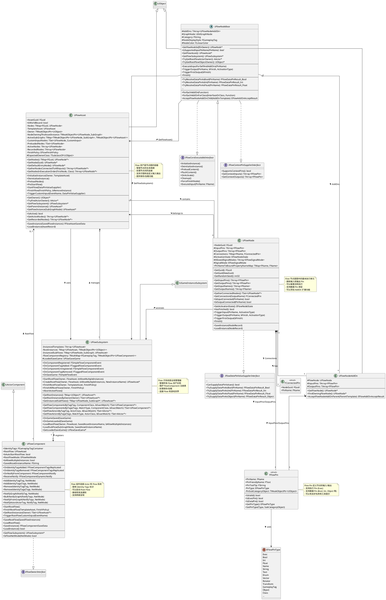

```plantuml

@startuml FlowGraph Class Diagram

  ' ==================== 样式定义 ====================
  skinparam classAttributeIconSize 0
  skinparam linetype ortho
  skinparam groupInheritance 2

  ' ==================== 接口定义 ====================
  interface IFlowCoreExecutableInterface {
      +InitializeInstance()
      +DeinitializeInstance()
      +PreloadContent()
      +FlushContent()
      +OnActivate()
      +Cleanup()
      +ForceFinishNode()
      +ExecuteInput(PinName: FName)
  }

  interface IFlowContextPinSupplierInterface {
      +SupportsContextPins(): bool
      +GetContextInputs(): TArray<FFlowPin>
      +GetContextOutputs(): TArray<FFlowPin>
  }

  interface IFlowDataPinValueSupplierInterface {
      +CanSupplyDataPinValues(): bool
      +TrySupplyDataPinAsBool(PinName): FFlowDataPinResult_Bool
      +TrySupplyDataPinAsInt(PinName): FFlowDataPinResult_Int
      +TrySupplyDataPinAsFloat(PinName): FFlowDataPinResult_Float
      +TrySupplyDataPinAsObject(PinName): FFlowDataPinResult_Object
      ...
  }

  interface IFlowOwnerInterface {
  }

  ' ==================== 核心结构体 ====================
  class FFlowPin <<struct>> {
      +PinName: FName
      +PinFriendlyName: FText
      +PinToolTip: FString
      -PinType: EFlowPinType
      -PinSubCategoryObject: TWeakObjectPtr<UObject>
      --
      +IsValid(): bool
      +IsExecPin(): bool
      +IsDataPin(): bool
      +GetPinType(): EFlowPinType
      +SetPinType(Type, SubCategoryObject)
  }

  class FConnectedPin <<struct>> {
      +NodeGuid: FGuid
      +PinName: FName
  }

  enum EFlowPinType {
      Exec
      Bool
      Int
      Float
      Name
      String
      Text
      Enum
      Vector
      Rotator
      Transform
      GameplayTag
      Object
      Class
      ...
  }

  ' ==================== UObject 基类 ====================
  class UObject {
  }

  ' ==================== 核心抽象类 ====================
  abstract class UFlowNodeBase {
      #AddOns: TArray<UFlowNodeAddOn>
      #GraphNode: UEdGraphNode
      #Category: FString
      #NodeDisplayStyle: FGameplayTag
      #NodeColor: FLinearColor
      --
      +{abstract} GetFlowNodeSelfOrOwner(): UFlowNode*
      +{abstract} IsSupportedInputPinName(PinName): bool
      +GetFlowAsset(): UFlowAsset*
      +GetFlowSubsystem(): UFlowSubsystem*
      +TryGetRootFlowActorOwner(): AActor*
      +TryGetRootFlowObjectOwner(): UObject*
      --
      +ExecuteInputForSelfAndAddOns(PinName)
      +TriggerOutput(PinName, bFinish, ActivationType)
      +TriggerFirstOutput(bFinish)
      +Finish()
      --
      +TryResolveDataPinAsBool(PinName): FFlowDataPinResult_Bool
      +TryResolveDataPinAsInt(PinName): FFlowDataPinResult_Int
      +TryResolveDataPinAsFloat(PinName): FFlowDataPinResult_Float
      ...
      --
      +ForEachAddOn(Function)
      +ForEachAddOnForClass(InterfaceOrClass, Function)
      +AcceptFlowNodeAddOnChild(AddOnTemplate): EFlowAddOnAcceptResult
  }

  ' ==================== Flow 节点类 ====================
  class UFlowNode {
      +NodeGuid: FGuid
      #InputPins: TArray<FFlowPin>
      #OutputPins: TArray<FFlowPin>
      #Connections: TMap<FName, FConnectedPin>
      #ActivationState: EFlowNodeState
      #AllowedSignalModes: TArray<EFlowSignalMode>
      #SignalMode: EFlowSignalMode
      +PinNameToBoundPropertyNameMap: TMap<FName, FName>
      --
      +GetGuid(): FGuid
      +SetGuid(NewGuid)
      +GetRandomSeed(): int32
      --
      +GetInputPins(): TArray<FFlowPin>
      +GetOutputPins(): TArray<FFlowPin>
      +GetInputNames(): TArray<FName>
      +GetOutputNames(): TArray<FName>
      --
      +GatherConnectedNodes(): TSet<UFlowNode*>
      +GetConnection(OutputName): FConnectedPin
      +IsInputConnected(PinName): bool
      +IsOutputConnected(PinName): bool
      --
      +GetActivationState(): EFlowNodeState
      +HasFinished(): bool
      +TriggerInput(PinName, ActivationType)
      +TriggerOutput(PinName, bFinish, ActivationType)
      +TriggerFirstOutput(bFinish)
      +Finish()
      --
      +SaveInstance(NodeRecord)
      +LoadInstance(NodeRecord)
  }

  ' ==================== Flow 节点扩展类 ====================
  class UFlowNodeAddOn {
      #FlowNode: UFlowNode
      #InputPins: TArray<FFlowPin>
      #OutputPins: TArray<FFlowPin>
      --
      +GetFlowNode(): UFlowNode*
      +FindOwningFlowNode(): UFlowNode*
      +AcceptFlowNodeAddOnParent(ParentTemplate): EFlowAddOnAcceptResult
  }

  ' ==================== Flow 资产类 ====================
  class UFlowAsset {
      +AssetGuid: FGuid
      +bWorldBound: bool
      -Nodes: TMap<FGuid, UFlowNode>
      -TemplateAsset: UFlowAsset
      -Owner: TWeakObjectPtr<UObject>
      -NodeOwningThisAssetInstance: TWeakObjectPtr<UFlowNode_SubGraph>
      -ActiveSubGraphs: TMap<TWeakObjectPtr<UFlowNode_SubGraph>, TWeakObjectPtr<UFlowAsset>>
      -CustomInputNodes: TSet<UFlowNode_CustomInput>
      -PreloadedNodes: TSet<UFlowNode>
      -ActiveNodes: TArray<UFlowNode>
      -RecordedNodes: TArray<UFlowNode>
      -FinishPolicy: EFlowFinishPolicy
      #ExpectedOwnerClass: TSubclassOf<UObject>
      --
      +GetNodes(): TMap<FGuid, UFlowNode*>
      +GetNode(Guid): UFlowNode*
      +GetDefaultEntryNode(): UFlowNode*
      +GatherNodesConnectedToAllInputs(): TArray<UFlowNode*>
      +GetNodesInExecutionOrder(FirstNode, Class): TArray<UFlowNode*>
      --
      +InitializeInstance(Owner, TemplateAsset)
      +DeinitializeInstance()
      +PreloadNodes()
      +PreStartFlow()
      +StartFlow(DataPinValueSupplier)
      +FinishFlow(FinishPolicy, bRemoveInstance)
      +TriggerCustomInput(EventName, DataPinValueSupplier)
      --
      +GetOwner(): UObject*
      +TryFindActorOwner(): AActor*
      +GetFlowSubsystem(): UFlowSubsystem*
      +GetParentInstance(): UFlowAsset*
      +GetFlowInstance(SubGraphNode): UFlowAsset*
      --
      +IsActive(): bool
      +GetActiveNodes(): TArray<UFlowNode*>
      +GetRecordedNodes(): TArray<UFlowNode*>
      --
      +SaveInstance(SavedFlowInstances): FFlowAssetSaveData
      +LoadInstance(AssetRecord)
  }

  ' ==================== Flow 组件类 ====================
  class UActorComponent {
  }

  class UFlowComponent {
      +IdentityTags: FGameplayTagContainer
      +RootFlow: UFlowAsset
      +bAutoStartRootFlow: bool
      +RootFlowMode: EFlowNetMode
      +bAllowMultipleInstances: bool
      +SavedAssetInstanceName: FString
      --
      +OnIdentityTagsAdded: FFlowComponentTagsReplicated
      +OnIdentityTagsRemoved: FFlowComponentTagsReplicated
      +OnNotifyFromComponent: FFlowComponentNotify
      +ReceiveNotify: FFlowComponentDynamicNotify
      --
      +AddIdentityTag(Tag, NetMode)
      +AddIdentityTags(Tags, NetMode)
      +RemoveIdentityTag(Tag, NetMode)
      +RemoveIdentityTags(Tags, NetMode)
      --
      +NotifyGraph(NotifyTag, NetMode)
      +BulkNotifyGraph(NotifyTags, NetMode)
      +NotifyFromGraph(NotifyTags, NetMode)
      +NotifyActor(ActorTag, NotifyTag, NetMode)
      --
      +StartRootFlow()
      +FinishRootFlow(TemplateAsset, FinishPolicy)
      +GetRootInstances(Owner): TSet<UFlowAsset*>
      +TriggerRootFlowCustomInput(EventName)
      --
      +SaveRootFlow(SavedFlowInstances)
      +LoadRootFlow()
      +SaveInstance(): FFlowComponentSaveData
      +LoadInstance(): bool
      --
      +GetFlowSubsystem(): UFlowSubsystem*
      +IsFlowNetMode(NetMode): bool
  }

  ' ==================== Flow 子系统类 ====================
  class UGameInstanceSubsystem {
  }

  class UFlowSubsystem {
      -InstancedTemplates: TArray<UFlowAsset>
      -RootInstances: TMap<UFlowAsset, TWeakObjectPtr<UObject>>
      -InstancedSubFlows: TMap<UFlowNode_SubGraph, UFlowAsset>
      -FlowComponentRegistry: TMultiMap<FGameplayTag, TWeakObjectPtr<UFlowComponent>>
      #LoadedSaveGame: UFlowSaveGame
      --
      +OnComponentRegistered: FSimpleFlowComponentEvent
      +OnComponentTagAdded: FTaggedFlowComponentEvent
      +OnComponentUnregistered: FSimpleFlowComponentEvent
      +OnComponentTagRemoved: FTaggedFlowComponentEvent
      +OnSaveGame: FSimpleFlowEvent
      --
      +StartRootFlow(Owner, FlowAsset, bAllowMultipleInstances)
      +CreateRootFlow(Owner, FlowAsset, bAllowMultipleInstances, NewInstanceName): UFlowAsset*
      +FinishRootFlow(Owner, TemplateAsset, FinishPolicy)
      +FinishAllRootFlows(Owner, FinishPolicy)
      +AbortActiveFlows()
      --
      +GetRootInstances(): TMap<UObject*, UFlowAsset*>
      +GetRootInstancesByOwner(Owner): TSet<UFlowAsset*>
      +GetInstancedSubFlows(): TMap<UFlowNode_SubGraph*, UFlowAsset*>
      --
      +GetFlowComponentsByTag(Tag, ComponentClass, bExactMatch): TSet<UFlowComponent*>
      +GetFlowComponentsByTags(Tags, MatchType, ComponentClass, bExactMatch): TSet<UFlowComponent*>
      +GetFlowActorsByTag(Tag, ActorClass, bExactMatch): TSet<AActor*>
      +GetFlowActorsByTags(Tags, MatchType, ActorClass, bExactMatch): TSet<AActor*>
      --
      +OnGameSaved(SaveGame)
      +OnGameLoaded(SaveGame)
      +LoadRootFlow(Owner, FlowAsset, SavedAssetInstanceName, bAllowMultipleInstances)
      +LoadSubFlow(SubGraphNode, SavedAssetInstanceName)
      +GetLoadedSaveGame(): UFlowSaveGame*
  }

  ' ==================== 继承关系 ====================
  UObject <|-- UFlowNodeBase
  UObject <|-- UFlowAsset
  UActorComponent <|-- UFlowComponent
  UGameInstanceSubsystem <|-- UFlowSubsystem

  UFlowNodeBase <|-- UFlowNode
  UFlowNodeBase <|-- UFlowNodeAddOn

  ' ==================== 接口实现 ====================
  UFlowNodeBase ..|> IFlowCoreExecutableInterface
  UFlowNodeBase ..|> IFlowContextPinSupplierInterface

  UFlowNode ..|> IFlowDataPinValueSupplierInterface

  UFlowComponent ..|> IFlowOwnerInterface

  ' ==================== 组合/聚合关系 ====================
  UFlowAsset "1" o-- "*" UFlowNode : contains >
  UFlowNode "1" o-- "*" UFlowNodeAddOn : has >
  UFlowNodeBase "1" o-- "*" UFlowNodeAddOn : AddOns >

  UFlowNode "1" *-- "*" FFlowPin : InputPins/OutputPins >
  UFlowNode "1" *-- "*" FConnectedPin : Connections >
  UFlowNodeAddOn "1" *-- "*" FFlowPin : InputPins/OutputPins >

  FFlowPin --> EFlowPinType : uses >

  ' ==================== 关联关系 ====================
  UFlowSubsystem "1" --> "*" UFlowAsset : manages >
  UFlowSubsystem "1" --> "*" UFlowComponent : registers >

  UFlowComponent "1" --> "0..1" UFlowAsset : RootFlow >

  UFlowAsset --> UFlowSubsystem : uses >
  UFlowNode --> UFlowAsset : belongs to >
  UFlowNode --> UFlowSubsystem : accesses >

  UFlowNodeBase --> UFlowAsset : GetFlowAsset() >
  UFlowNodeBase --> UFlowSubsystem : GetFlowSubsystem() >

  ' ==================== 注释 ====================
  note right of UFlowAsset
    Flow 资产是节点图的容器
    - 管理节点的生命周期
    - 处理节点间的连接
    - 支持子图和自定义输入输出
    - 提供保存/加载功能
  end note

  note right of UFlowNode
    Flow 节点是图中的基本执行单元
    - 拥有输入和输出 Pin
    - 可以被激活和执行
    - 支持数据 Pin 绑定
    - 可以添加 AddOn 扩展功能
  end note

  note right of UFlowSubsystem
    Flow 子系统是全局管理器
    - 管理所有 Flow 资产实例
    - 维护 FlowComponent 注册表
    - 处理保存/加载
    - 连接 Flow 和游戏世界
  end note

  note right of UFlowComponent
    Flow 组件连接 Actor 和 Flow 系统
    - 使用 Identity Tags 标识
    - 可以启动 Root Flow
    - 接收和发送通知
    - 支持网络复制
  end note

  note right of FFlowPin
    Flow Pin 定义节点的输入/输出
    - 支持执行 Pin (Exec)
    - 支持数据 Pin (Bool, Int, Object 等)
    - 可以有友好名称和工具提示
  end note

@enduml

```
