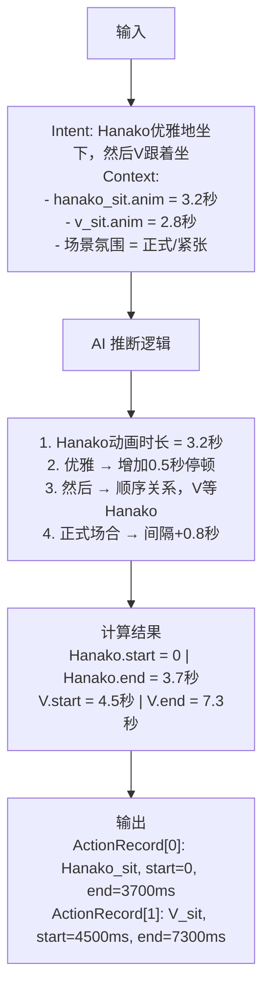
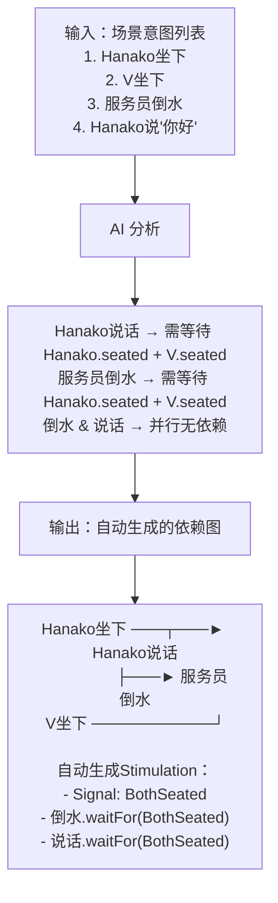
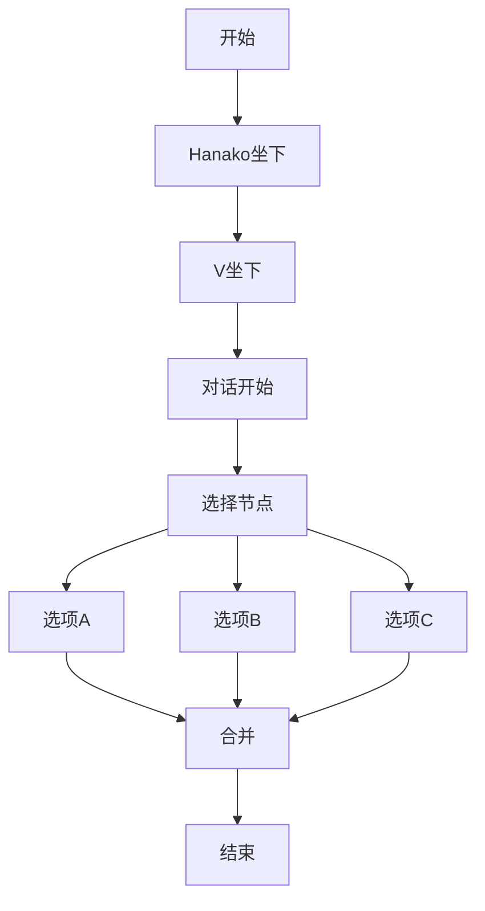
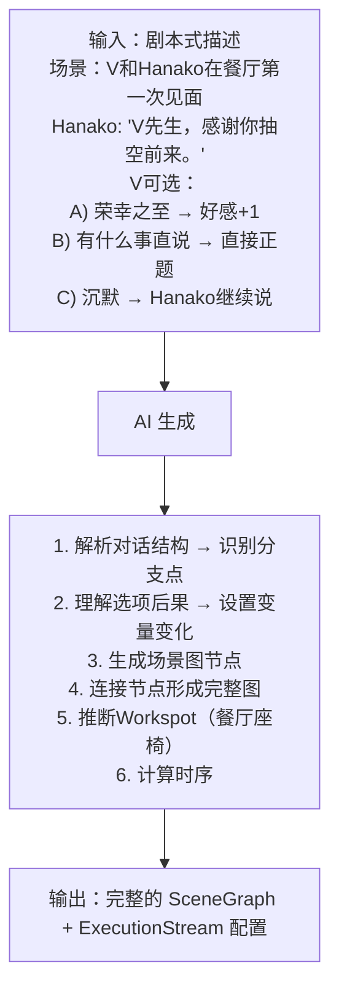
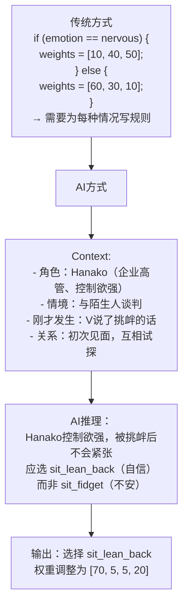
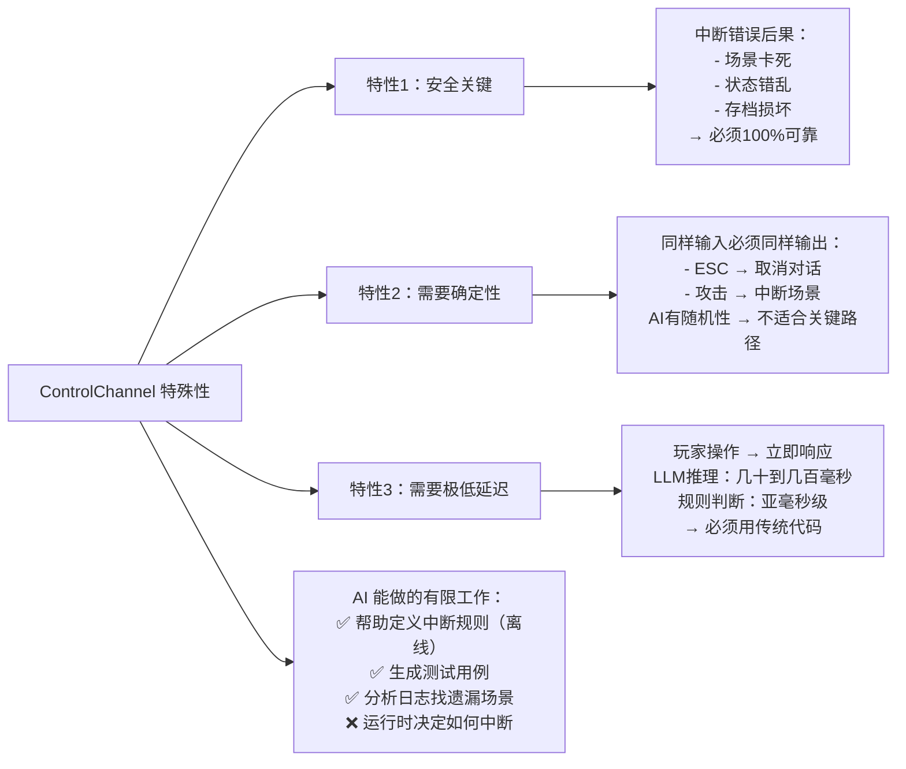
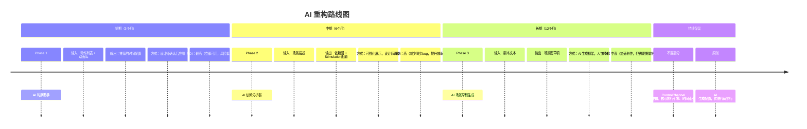

# ExecutionStream 的 AI 可重构性分析
## 总览：难易程度矩阵
```mermaid
gauge
    title AI 可重构难易程度
    "时序计算（Timing）"  : 90, 100
    "信号推断（Stimulation）"  : 80, 100
    "场景生成（Scene Graph）"  : 70, 100
    "行为选择（Behavior Selection）"  : 50, 100
    "中断处理（Control）"  : 30, 100
    "核心执行（Core Execution）"  : 10, 100
```

## 一、最容易被 AI 重构：时序计算
### 当前痛点
```cpp
// 设计师现在必须手动指定毫秒
ActionRecord record;
record.m_executionPlan.m_startTime = Msec(5000);   // 为什么是5000？
record.m_executionPlan.m_conclusionTime = Msec(10000);  // 怎么算的？
```
**问题**：
1. 设计师怎么知道动画要播多久？
2. 两个动作之间间隔多少才"自然"？
3. 动画改了，所有时间都要重新算

### AI 可以做什么


### 为什么最容易？
1. **规则可学习**
   - 动画时长是确定的数据
   - "自然间隔"有大量人类标注的样本
   - 风格（优雅/急促）可以量化为时间系数
2. **错误可容忍**
   - AI算错了时间？看起来稍微不自然，但不会崩溃
   - 设计师可以微调
   - 不是安全关键
3. **有明确的优化目标**
   - 目标：让场景"感觉自然"
   - 可以用玩家反馈训练
   - 可以A/B测试不同时序

### 实现路径
- **Phase 1: AI辅助计算（3个月）**
  - 建立动画时长数据库
  - 训练"自然间隔"预测模型
  - 工具：设计师输入意图，AI建议时间，设计师确认/微调
- **Phase 2: AI自动计算（6个月）**
  - 从场景描述直接生成完整时序
  - 设计师只需审核，不需要手动输入时间
  - 支持"感觉太快/太慢"的自然语言反馈调整

## 二、较容易被 AI 重构：信号推断（Stimulation）
### 当前痛点
```cpp
// 设计师必须显式定义所有信号和等待关系
StimulationRecord signal;
signal.m_stimulation = Stimulation::WorkspotSeated;
signal.m_executionPlan.m_occurrenceTime = Msec(3700);

// 另一边要显式等待
WaitForSignal(Stimulation::WorkspotSeated);
```
**问题**：
1. 要手动识别哪些地方需要同步
2. 信号命名和匹配要人工保证
3. 漏掉一个信号就是bug

### AI 可以做什么


### 为什么较容易？
1. **依赖关系可以从语义推断**
   - LLM 理解"说话前要坐好"这种常识
   - 可以从动词时态推断顺序（"然后"、"之后"）
   - 可以从物理约束推断（不能同时在两个地方）
2. **有明确的验证方法**
   - 生成的依赖图可以可视化给设计师确认
   - 可以通过模拟执行检测死锁
   - 错误容易发现（动作顺序明显不对）
3. **挑战：边界情况**
   - 有些依赖是隐含的（需要领域知识）
   - 有些依赖是可选的（取决于设计意图）
   - → 需要人工确认兜底

## 三、中等难度：场景图生成
### 当前痛点

**问题**：
- 分支越多，图越复杂
- 每个节点的配置都要手动填
- 修改一个分支可能影响全局

### AI 可以做什么


### 为什么中等难度？
#### 可行的部分：
- ✅ 从文本解析对话结构（NLP成熟技术）
- ✅ 识别分支点（关键词：如果/或者/选择）
- ✅ 生成基本的图结构
- ✅ 填充标准化的节点属性

#### 困难的部分：
- ⚠️ 理解隐含的游戏逻辑（好感度系统等）
- ⚠️ 处理复杂的分支合并
- ⚠️ 与已有内容保持一致性
- ⚠️ 生成有创意的选项（不只是模板）

**结论**：可以生成"骨架"，细节仍需人工打磨

## 四、较困难：行为选择（Workspot Selector）
### 当前做法
```cpp
// Workspot中的行为选择器
Selector {
    m_weights = [20, 30, 50],  // 人工调的权重
    m_list = [
        AnimClip { "sit_idle" },
        AnimClip { "sit_fidget" },
        AnimClip { "sit_wipe_forehead" }
    ]
}
```
**问题**：
1. 权重是"感觉"出来的
2. 不同情境应该用不同权重
3. 难以表达复杂的选择逻辑

### AI 可以做什么


### 为什么较困难？
1. **需要深度理解角色**
   - 每个角色有独特的性格
   - 同样的情境，不同角色反应不同
   - AI需要"读懂"角色设定
2. **需要实时推理**
   - 时序计算可以预先算好
   - 行为选择可能需要运行时决定
   - LLM推理延迟可能影响体验
3. **结果难以验证**
   - "自然"是主观的
   - 没有明确的对错标准
   - 需要大量人工评估

#### 可能的解决方案：
- 预计算：提前为常见情境生成行为建议
- 小模型：用蒸馏后的小模型做实时推理
- 混合：AI建议 + 规则兜底

## 五、最困难：中断处理（ControlChannel）
### 为什么最难被 AI 替代？


## 六、核心执行引擎：不应该被 AI 重构
### 保留传统实现的部分
1. **时间索引和查询**
   ```cpp
   std::lower_bound 二分查找
   → 已经是最优算法，AI无法改进
   ```
2. **内存管理**
   ```cpp
   Reserve(), Shrink(), 移动语义
   → 这是底层优化，需要确定性行为
   ```
3. **执行循环**
   - 每帧检查时间窗口，触发到期的动作
   - → 必须精确、可预测、高性能

**原则**：AI 生成数据，传统代码执行数据

## 七、总结：AI 重构优先级


| 领域 | AI可行性 | 业务价值 | 推荐优先级 |
|---|---|---|---|
| 时序计算 (Timing) | ⭐⭐⭐⭐⭐ | ⭐⭐⭐⭐ | 🥇 第一优先 |
| 依赖推断 (Stimulation) | ⭐⭐⭐⭐ | ⭐⭐⭐⭐ | 🥈 第二优先 |
| 场景图生成 (Scene Graph) | ⭐⭐⭐ | ⭐⭐⭐⭐⭐ | 🥉 第三优先（高价值但需谨慎） |
| 行为选择 (Behavior) | ⭐⭐ | ⭐⭐⭐ | 后期探索 |
| 中断处理 (Control) | ⭐ | ⭐⭐ | 不建议AI介入 |
| 核心执行 (Execution) | ❌ | ⭐ | 保持传统实现 |


## 八、推荐的 AI 重构路线图


### 一句话总结
时序计算最容易被 AI 重构（规则明确、错误可容忍、价值明显），应该作为第一个切入点。