# ExecutionStream 在 AI Agent 时代的架构演进

---

## 核心发现：时间 + 触发器的混合架构

ExecutionStream 的本质并非纯粹的时间驱动，而是**时间 + 触发器的混合架构**。

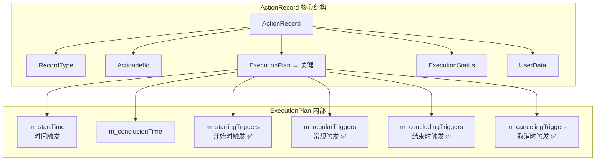

**重要发现**：
- ✅ ExecutionStream 已经包含触发器（Trigger）机制
- ✅ 时间只是触发条件之一，不是唯一条件
- ✅ 架构已经具备事件驱动的基础设施

---

## 一、核心价值：流程编排，而非时间编排

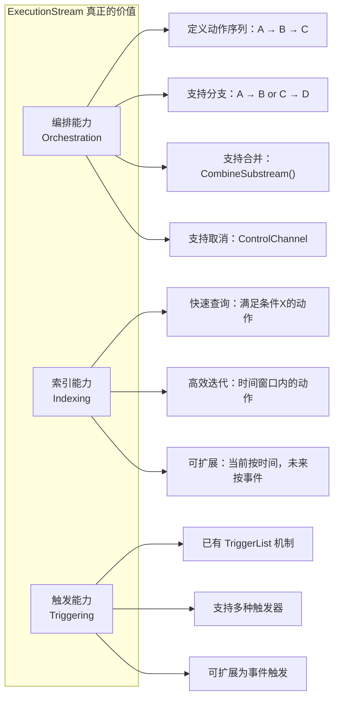

---

## 二、从时间驱动到事件驱动的转换

### 2.1 当前架构的局限

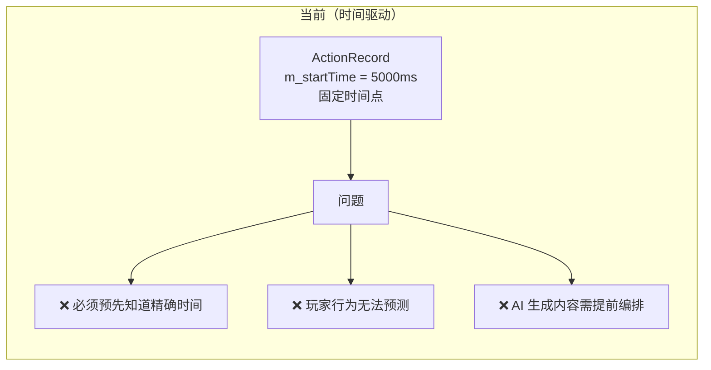

### 2.2 未来架构设计

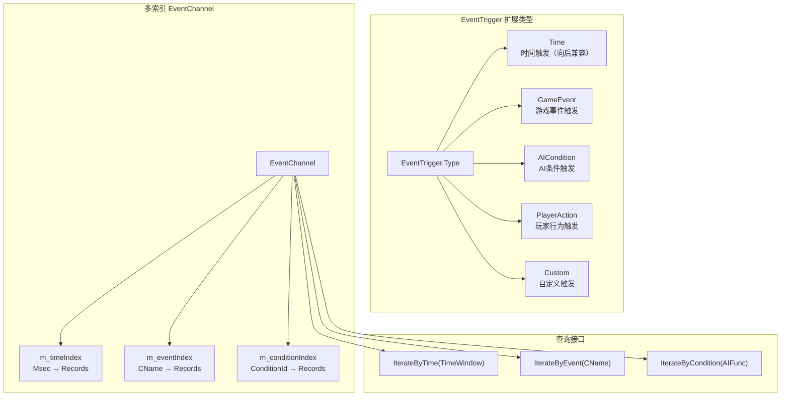

### 2.3 示例对比

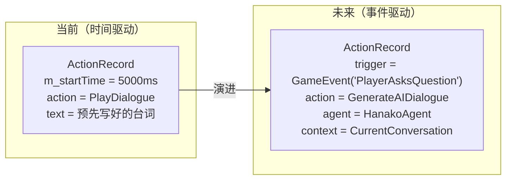

---

## 三、AI Agent 时代的三大价值场景

### 3.1 动态叙事生成

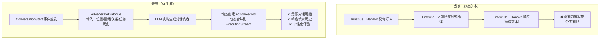

### 3.2 响应式 NPC 行为

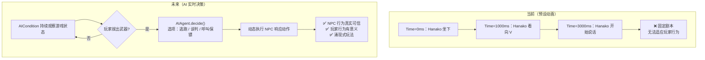

### 3.3 动态剧情分支

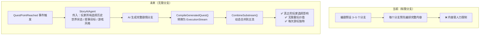

---

## 四、向后兼容的三阶段扩展方案

### 阶段 1：扩展触发条件（向后兼容）

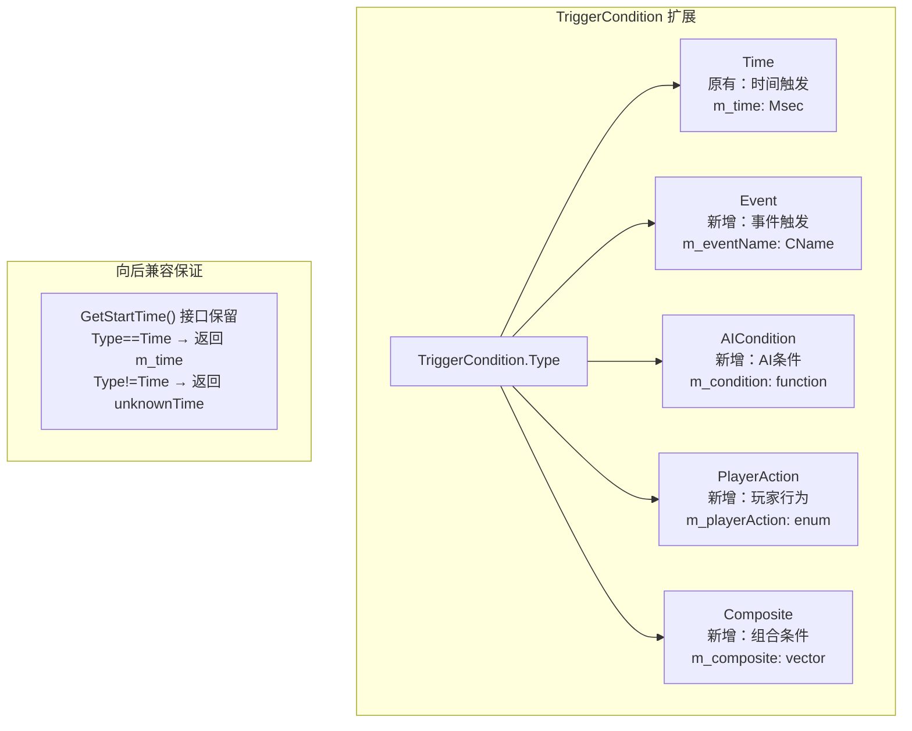

### 阶段 2：多索引支持

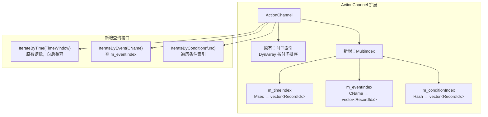

### 阶段 3：运行时动态生成

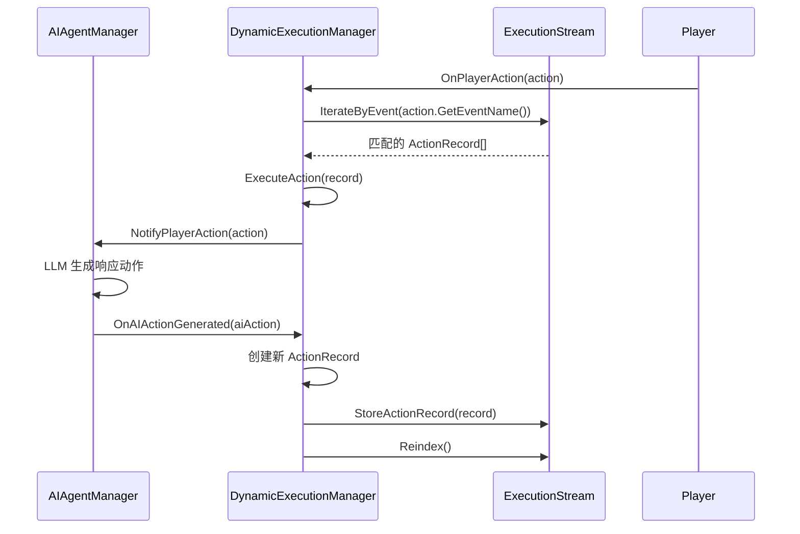

---

## 五、完整工作流：AI 驱动的餐厅对话

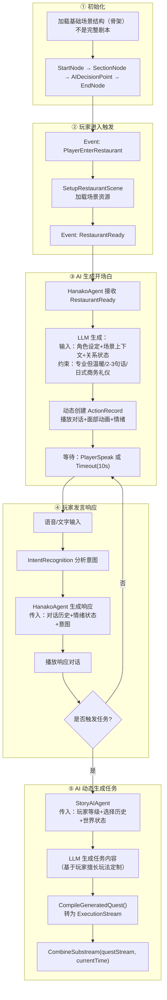

---

## 六、ExecutionStream 为何天然适配 AI 时代

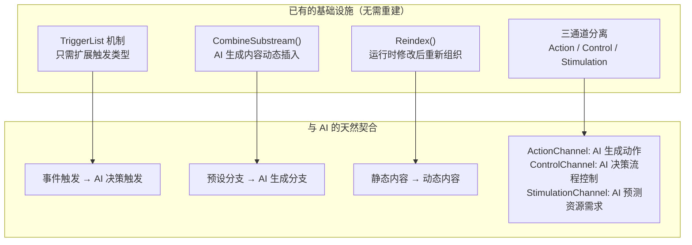

---

## 七、当前 vs 未来：全面对比

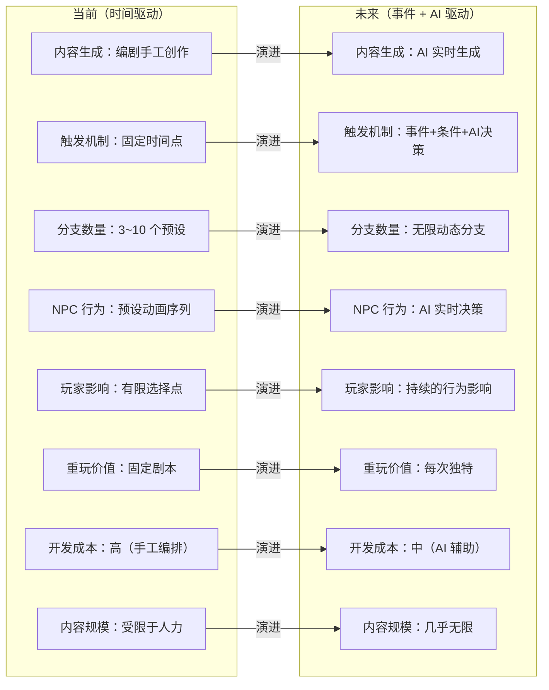

---

## 八、实施路线图

```mermaid
flowchart LR
    subgraph "Phase 1（1~2 个月）\n向后兼容扩展"
        P1A["扩展 TriggerCondition\n支持事件触发"]
        P1B["添加 EventChannel 多索引"]
        P1C["保持现有时间驱动完全兼容"]
        P1A --> P1B --> P1C
    end

    subgraph "Phase 2（2~3 个月）\nAI 集成"
        P2A["集成 LLM API"]
        P2B["实现 AIAgent 基础框架"]
        P2C["动态生成简单对话"]
        P2A --> P2B --> P2C
    end

    subgraph "Phase 3（3~6 个月）\n高级 AI 特性"
        P3A["AI 生成完整剧情分支"]
        P3B["NPC AI 实时决策"]
        P3C["玩家行为意图识别"]
        P3A --> P3B --> P3C
    end

    subgraph "Phase 4（持续）\n生产化"
        P4A["性能优化"]
        P4B["内容质量控制"]
        P4C["A/B 测试系统"]
        P4A --> P4B --> P4C
    end

    P1C --> P2A
    P2C --> P3A
    P3C --> P4A
```

---

## 结论

> **CDPR 设计 ExecutionStream 时可能没有预见 AI 时代，但这个架构意外地完美适配了未来的需求。**

三个关键洞察：

1. **核心价值不是时间编排**，而是**动作序列的灵活编排和执行**——时间只是触发维度之一
2. **架构已经具备基础**：TriggerList、CombineSubstream、Reindex 三个机制天然支持 AI 驱动
3. **转换成本可控**：向后兼容扩展，无需推倒重来，三阶段渐进演进
