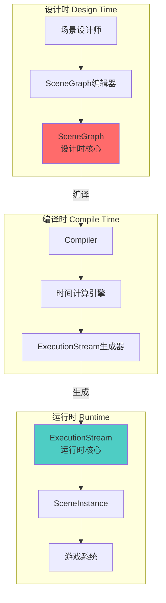
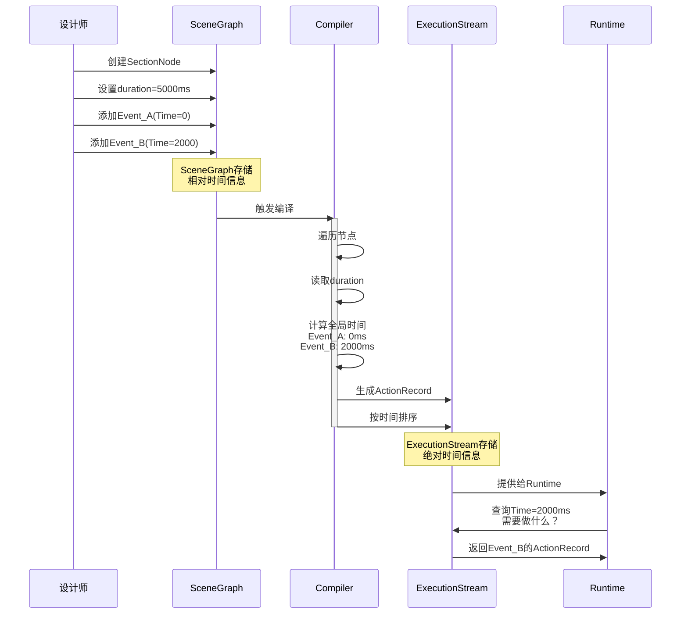

# ExecutionStream是InteractiveScene的核心吗？节点的时间信息解析
> 澄清InteractiveScene的双核心架构和节点时间信息的真实作用

---

## 🎯 直接回答三个问题

### 问题1：ExecutionStream是InteractiveScene的核心吗？

**答案**：**不是唯一核心，而是"运行时核心"之一。InteractiveScene有双核心架构**

```
InteractiveScene的双核心：

设计时核心（Design-time Core）：
  ✅ SceneGraph（场景图）
  - 编辑器中设计
  - 节点和连接
  - 逻辑清晰
  - 人类友好

运行时核心（Runtime Core）：
  ✅ ExecutionStream（执行流）
  - 从SceneGraph编译
  - 时间排序
  - 机器友好
  - 高效执行

关系：
  SceneGraph --编译--> ExecutionStream

  就像：
    源代码 --编译--> 可执行文件
    两者都是核心，服务于不同阶段
```

---

### 问题2：SceneGraph每一个节点都包含时间信息吗？

**答案**：**不是！只有"有持续时间"的节点才有时间信息**

```cpp
// 代码证据：

// StartNode：没有持续时间
SceneTime StartNode::DoGetRefrncDuration() const {
    return SceneTime(0);  // Duration = 0
}

// EndNode：没有持续时间
SceneTime EndNode::DoGetRefrncDuration() const {
    return SceneTime(0);  // Duration = 0
}

// SectionNode：有持续时间！
class SectionNode : public SceneGraphNode {
    SceneTime m_refrncDuration;  // 存储时长
};

SceneTime SectionNode::DoGetRefrncDuration() const {
    return m_refrncDuration;  // 返回存储的时长
}
```

**节点时间信息分布**：
```
有时间的节点：
  ✅ SectionNode（m_refrncDuration）
  ✅ ChoiceNode（可能有timed condition duration）
  ✅ RewindableSectionNode（有duration）

没有时间的节点：
  ❌ StartNode（duration = 0）
  ❌ EndNode（duration = 0）
  ❌ HubNode（作为连接点，无duration）
  ❌ AndNode/XorNode（逻辑节点，无duration）
```

---

### 问题3：这个时间信息是用来干什么的？

**答案**：**3个核心作用：编译ExecutionStream、计算全局时间、支持Scaling**

```
作用1：编译ExecutionStream时计算绝对时间

  SceneGraph（相对时间）:
    StartNode [duration=0]
      ↓
    SectionNode_001 [duration=5000ms]  ← 相对自己的开始时间
      Event_A: Time=0ms
      Event_B: Time=2000ms
      ↓
    SectionNode_002 [duration=3000ms]  ← 相对自己的开始时间
      Event_C: Time=0ms
      Event_D: Time=1000ms

  编译过程：
    StartNode: 全局Time=0ms
    SectionNode_001: 全局Time=0-5000ms
      Event_A: 全局Time=0ms
      Event_B: 全局Time=2000ms
    SectionNode_002: 全局Time=5000-8000ms  ← 使用Section_001的duration计算
      Event_C: 全局Time=5000ms
      Event_D: 全局Time=6000ms

  ExecutionStream（绝对时间）:
    Time=0ms:    Event_A
    Time=2000ms: Event_B
    Time=5000ms: Event_C
    Time=6000ms: Event_D

作用2：支持快进/回退

  知道节点duration后，可以计算跳转：
    "跳过这个Section" → 跳转 duration 毫秒
    "回退到Section开始" → 当前时间 - elapsed 毫秒

作用3：支持Scaling（时间缩放）

  如果对话太长，可以整体加速：
    原始duration = 10000ms
    scaling factor = 0.8
    实际duration = 8000ms
```

---

## 🏗️ InteractiveScene的完整架构

### 双核心架构图



---

## 📊 节点类型和时间信息

### 完整节点分类

```
InteractiveScene的节点类型：

1. 流程控制节点（无时间）
   ├─ StartNode
   │    duration = 0
   │    作用：标记Scene开始
   │
   ├─ EndNode
   │    duration = 0
   │    作用：标记Scene结束
   │
   ├─ HubNode
   │    duration = 0
   │    作用：汇聚多个输入信号
   │
   ├─ AndNode
   │    duration = 0
   │    作用：等待所有输入都就绪
   │
   └─ XorNode
        duration = 0
        作用：选择第一个到达的输入

2. 内容执行节点（有时间）
   ├─ SectionNode ⭐
   │    duration = m_refrncDuration（存储）
   │    作用：执行一段剧情内容
   │    示例：5000ms（5秒的对话和动作）
   │
   ├─ RewindableSectionNode
   │    duration = 可变（支持快进/倒退）
   │    作用：可回退的Section
   │
   └─ ChoiceSectionNode
        duration = timed condition duration（如果有）
        作用：限时选择

3. 特殊节点
   └─ QuestNode
        duration = 取决于嵌入的Quest逻辑
        作用：嵌入Quest检查点
```

---

### SectionNode的时间结构

```cpp
// 文件：scnsSectionNode.h
class SectionNode : public SceneGraphNode {
    // 核心：时间信息
    SceneTime m_refrncDuration;  // Section的参考时长

    // 核心：事件列表
    red::DynArray< THandle< SceneEvent > > m_events;

    // 每个Event也有自己的时间
    // Event的时间是相对于Section开始的
};

// 实际数据示例：
SectionNode section_001 {
    m_refrncDuration = SceneTime(5000),  // Section总共5秒

    m_events = [
        Event_A {
            m_refrncNdspaceStarttime = SceneTime(0),     // 相对Section开始
            m_refrncEvspaceDuration = SceneTime(1000),   // Event持续1秒
        },
        Event_B {
            m_refrncNdspaceStarttime = SceneTime(2000),  // 相对Section开始
            m_refrncEvspaceDuration = SceneTime(500),    // Event持续0.5秒
        },
        Event_C {
            m_refrncNdspaceStarttime = SceneTime(4000),  // 相对Section开始
            m_refrncEvspaceDuration = SceneTime(0),      // Point event
        }
    ]
}
```

---

## 🔄 时间计算的完整流程

### 阶段1：设计时（SceneGraph）

```
设计师在编辑器中：

SectionNode_001:
  设置duration = 5000ms
  添加Events:
    Event_A: Time=0ms, Duration=1000ms
    Event_B: Time=2000ms, Duration=500ms

SectionNode_002:
  设置duration = 3000ms
  添加Events:
    Event_C: Time=0ms, Duration=2000ms

连接：
  SectionNode_001.out → SectionNode_002.in

保存：
  所有时间都是相对的
  SectionNode_002不知道全局时间
```

---

### 阶段2：编译时（Compiler）

```cpp
// 伪代码：编译过程

void Compiler::CompileScene(SceneGraph* graph) {
    ExecutionStream stream;
    SceneTime currentTime(0);

    // 从StartNode开始遍历
    SceneGraphNode* node = graph->GetStartNode();

    while (node != nullptr) {
        // 获取节点的duration
        SceneTime nodeDuration = node->GetRefrncDuration();

        // 如果节点有事件（SectionNode）
        if (SectionNode* section = dynamic_cast<SectionNode*>(node)) {
            // 遍历Section的Events
            for (SceneEvent* event : section->GetEvents()) {
                // 计算Event的全局时间
                SceneTime eventStartTime = currentTime + event->GetRefrncNdspaceStarttime();
                SceneTime eventDuration = event->GetRefrncEvspaceDuration();

                // 添加到ExecutionStream
                ActionRecord record;
                record.m_startTime = eventStartTime;
                record.m_duration = eventDuration;
                record.m_actiondef = event->GenerateActionDef();

                stream.GetActionChannel().StoreActionRecord(record);
            }
        }

        // 前进时间
        currentTime += nodeDuration;

        // 下一个节点
        node = GetNextNode(node);
    }

    // 排序和索引
    stream.Reindex();

    return stream;
}
```

---

### 阶段3：运行时（SceneInstance）

```cpp
// 伪代码：运行时执行

void SceneInstance::Update(float deltaTime) {
    m_currentTime += deltaTime;

    // 查询ExecutionStream
    TimeWindow window(m_prevTime, m_currentTime);

    // 获取时间窗口内需要启动的动作
    m_executionStream.GetActionChannel().IterateStartingRecords(
        window,
        [this](const ActionRecord& record) {
            // 启动这个动作
            // 注意：这里使用的是预先计算好的绝对时间
            this->ExecuteAction(record);
        }
    );

    m_prevTime = m_currentTime;
}
```

---

## 💡 为什么不是每个节点都有时间？

### 原因1：职责分离

```
流程控制节点（StartNode, EndNode, HubNode）：
  职责：控制流程，连接节点
  特点：瞬时完成，无持续时间
  类比：程序中的if/else语句（没有执行时间）

内容执行节点（SectionNode）：
  职责：执行具体内容
  特点：有持续过程，需要时间
  类比：程序中的函数调用（有执行时间）

设计哲学：
  ✅ 只有需要时间的节点才有时间
  ✅ 避免不必要的复杂性
  ✅ 清晰的职责划分
```

---

### 原因2：信号驱动 vs 时间驱动

```
StartNode/EndNode是信号驱动：
  激活 → 立即完成 → 发送信号 → 下一个节点

  流程：
    StartNode激活
      ↓ 0ms
    发送信号到SectionNode_001.in
      ↓ 0ms
    SectionNode_001开始执行
      ↓ 5000ms（这里才有时间）
    SectionNode_001完成
      ↓ 0ms
    发送信号到SectionNode_002.in
      ↓ 0ms
    SectionNode_002开始执行

  时间消耗来自SectionNode，不是StartNode
```

---

### 原因3：灵活的连接

```
如果StartNode/EndNode有duration：

问题场景：
  StartNode [duration=1000ms]
    ↓
  SectionNode_001 [duration=5000ms]

  问题：
    - StartNode在做什么？等待1秒？
    - 为什么需要等待？
    - 这1秒算不算Scene的开始时间？

  结果：
    ❌ 语义不清
    ❌ 增加复杂性
    ❌ 无实际价值

实际设计：
  StartNode [duration=0]  ← 瞬时
    ↓
  SectionNode_001 [duration=5000ms]

  优势：
    ✅ 语义清晰：StartNode只是起点标记
    ✅ 时间消耗明确来自SectionNode
    ✅ 简单易懂
```

---

## 🔍 ExecutionStream vs SceneGraph的角色

### SceneGraph的核心价值

```
SceneGraph = 设计时核心

优势：
  ✅ 可视化编辑
     - 节点拖拽
     - 连线建立
     - 属性编辑

  ✅ 逻辑清晰
     - 分支一目了然
     - 节点组织清楚
     - 连接关系明确

  ✅ 易于调试
     - 可以单独测试节点
     - 可以查看节点状态
     - 可以修改参数

  ✅ 团队协作
     - 多人编辑不同Section
     - 版本控制友好
     - 模块化设计

劣势：
  ❌ 运行时性能差
     - 需要遍历节点
     - 需要检查连接
     - 需要计算相对时间

  ❌ 不适合查询
     - "Time=5000ms时应该做什么？"需要遍历
     - 时间窗口查询慢
     - 随机访问困难
```

---

### ExecutionStream的核心价值

```
ExecutionStream = 运行时核心

优势：
  ✅ 高性能
     - 按时间排序
     - 二分查找
     - 时间窗口查询高效

  ✅ 确定性
     - 预先计算所有时间
     - 无运行时计算
     - 结果可预测

  ✅ 易于回放
     - 可以快进
     - 可以倒退
     - 可以跳转

  ✅ 支持Scaling
     - 整体加速/减速
     - 保持相对关系
     - 动态调整

劣势：
  ❌ 不适合编辑
     - 扁平化结构
     - 逻辑关系丢失
     - 难以可视化

  ❌ 动态生成成本
     - 编译需要时间
     - 分支需要重新合并
     - 内存占用增加
```

---

## 🎯 双核心的协作

### 完整的生命周期

```
1. 设计阶段（SceneGraph主导）
   ├─ 设计师在编辑器中创建节点
   ├─ 设置SectionNode的duration
   ├─ 添加Events
   ├─ 建立连接
   └─ 保存为.scenesolution

2. 加载阶段（SceneGraph加载）
   ├─ 游戏启动/Scene触发
   ├─ 从文件加载SceneGraph
   ├─ 验证节点和连接
   └─ 准备编译

3. 编译阶段（SceneGraph → ExecutionStream）
   ├─ 遍历SceneGraph
   ├─ 读取节点duration
   ├─ 计算全局时间
   ├─ 生成ActionRecord
   ├─ 按时间排序
   └─ 创建ExecutionStream

4. 执行阶段（ExecutionStream主导）
   ├─ 每帧Update
   ├─ 查询时间窗口
   ├─ 执行ActionRecord
   ├─ 更新状态
   └─ 发送信号

5. 分支阶段（两者协作）
   ├─ 玩家做出选择
   ├─ 查询SceneGraph获取分支路径
   ├─ 编译分支路径为新的ExecutionStream
   ├─ 合并到主ExecutionStream
   └─ 继续执行

6. 结束阶段（ExecutionStream结束）
   ├─ 到达EndNode
   ├─ ExecutionStream清理
   ├─ SceneGraph可以重用
   └─ 资源释放
```

---

## 📊 数据流可视化

### SceneGraph → ExecutionStream的转换



---

## 💎 关键洞察

### 洞察1：双核心不是冗余

```
常见误解：
  "为什么需要两个核心？只保留一个不行吗？"

真相：
  两个核心服务于不同阶段，各有优势

  只保留SceneGraph：
    ✅ 可以编辑
    ❌ 运行时性能差
    ❌ 查询效率低
    ❌ 难以优化

  只保留ExecutionStream：
    ✅ 运行时性能好
    ❌ 无法编辑
    ❌ 逻辑难以理解
    ❌ 团队协作困难

  双核心设计：
    ✅ 各取所长
    ✅ 设计时用SceneGraph
    ✅ 运行时用ExecutionStream
    ✅ 编译成本可接受（2-5ms）
```

---

### 洞察2：时间信息的分层

```
时间信息的3个层次：

Layer 1: 节点层（Node Duration）
  SectionNode.m_refrncDuration = 5000ms
  作用：定义节点的总时长

Layer 2: 事件层（Event Duration）
  Event_A.m_refrncEvspaceDuration = 1000ms
  Event_A.m_refrncNdspaceStarttime = 0ms（相对Section）
  作用：定义事件的时长和相对位置

Layer 3: 动作层（Action Duration）
  ActionRecord.m_duration = 1000ms
  ActionRecord.m_startTime = 0ms（绝对时间）
  作用：运行时执行的精确时间

层次关系：
  Node Duration ⊃ Event Durations ⊃ Action Durations

  SectionNode [0-5000ms]
    ├─ Event_A [0-1000ms] → ActionRecord [0-1000ms]
    ├─ Event_B [2000-2500ms] → ActionRecord [2000-2500ms]
    └─ Event_C [4000ms] → ActionRecord [4000ms]
```

---

### 洞察3：不是所有节点都需要时间

```
设计原则：
  "只有执行内容的节点才需要时间"

节点分类：
  控制节点（Control Nodes）：
    - StartNode, EndNode, HubNode
    - 作用：控制流程
    - 特点：瞬时完成
    - Duration = 0

  执行节点（Execution Nodes）：
    - SectionNode, RewindableSectionNode
    - 作用：执行内容
    - 特点：有持续过程
    - Duration > 0

类比：
  控制节点 = 程序的控制流（if/else/return）
  执行节点 = 程序的函数体（实际逻辑）

  if语句没有执行时间，函数体有执行时间
```

---

## 🎯 最终答案总结

### 问题1：ExecutionStream是InteractiveScene的核心吗？

```
答案：是运行时核心之一，但不是唯一核心

完整答案：
  InteractiveScene有双核心架构：
    1. SceneGraph（设计时核心）
       - 编辑器使用
       - 逻辑清晰
       - 人类友好

    2. ExecutionStream（运行时核心）
       - 游戏运行时使用
       - 性能优化
       - 机器友好

  关系：
    SceneGraph --编译--> ExecutionStream

  类比：
    C++源代码 --编译--> .exe可执行文件
    两者都是核心，缺一不可
```

---

### 问题2：SceneGraph每一个节点都包含时间信息吗？

```
答案：不是，只有执行内容的节点有时间

具体分布：
  有时间：
    ✅ SectionNode（m_refrncDuration）
    ✅ RewindableSectionNode
    ✅ ChoiceSectionNode（可选）

  没有时间：
    ❌ StartNode（duration = 0）
    ❌ EndNode（duration = 0）
    ❌ HubNode（duration = 0）
    ❌ AndNode/XorNode（duration = 0）

原因：
  只有"执行内容"的节点才需要时间
  "控制流程"的节点瞬时完成
```

---

### 问题3：这个时间信息是用来干什么的？

```
答案：3个核心作用

作用1：编译ExecutionStream
  - 计算Event的全局绝对时间
  - 将相对时间转换为绝对时间
  - 生成时间排序的ActionRecord

作用2：支持快进/回退
  - 知道节点duration可以跳转
  - "跳过这个Section" → 跳转duration毫秒
  - "回退到开始" → 当前时间 - elapsed

作用3：支持时间缩放（Scaling）
  - 整体加速/减速
  - 对话太长可以压缩
  - 保持相对时序关系

示例：
  SectionNode duration=5000ms
    Event_A: Time=0ms（相对）
    Event_B: Time=2000ms（相对）

  编译后：
    Event_A: Time=全局0ms（绝对）
    Event_B: Time=全局2000ms（绝对）

  如果前面有duration=3000ms的Section：
    Event_A: Time=全局3000ms
    Event_B: Time=全局5000ms
```

---

## 📚 代码位置总结

```
SceneGraphNode基类：
  D:\AppSoft\Sy2077\2077\2077\CDPR2077\dev\src\common\gameSceneSystem\src\scnSceneGraphNodes.h
  - 定义GetRefrncDuration()虚函数

StartNode实现：
  D:\AppSoft\Sy2077\2077\2077\CDPR2077\dev\src\common\gameSceneSystem\src\scnNodesConcrete.cpp
  - DoGetRefrncDuration() 返回 SceneTime(0)

SectionNode实现：
  D:\AppSoft\Sy2077\2077\2077\CDPR2077\dev\src\common\gameSceneSystem\src\scnsSectionNode.h
  - 存储 m_refrncDuration
  - DoGetRefrncDuration() 返回 m_refrncDuration

ExecutionStream：
  D:\AppSoft\Sy2077\2077\2077\CDPR2077\dev\src\common\gameSceneCore\include\scnsExecutionStream.h
  - 三通道架构
  - 时间窗口查询
```

---

**版本**: 1.0
**日期**: 2026-02-25
**关键词**: ExecutionStream, SceneGraph, 双核心, 节点时间, 编译

---

*本文档澄清了ExecutionStream和SceneGraph的双核心关系，详细解析了节点时间信息的分布和作用。ExecutionStream不是唯一核心，而是与SceneGraph协作的运行时核心。不是所有节点都有时间，只有执行内容的节点才需要时间信息。*
