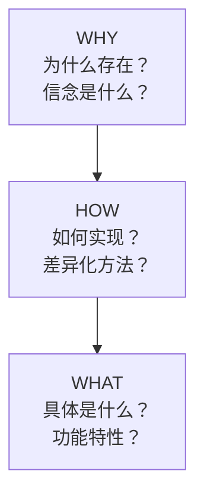
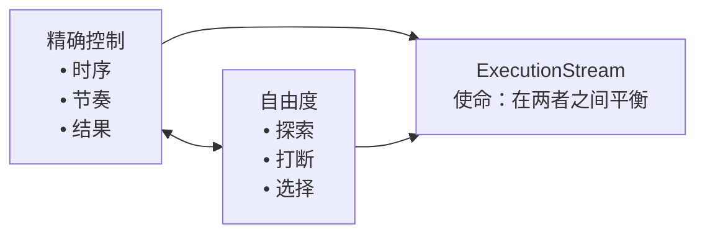
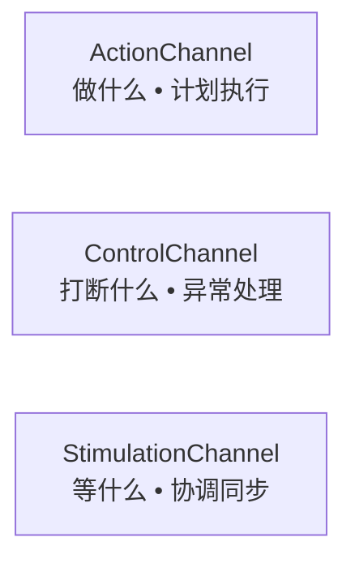
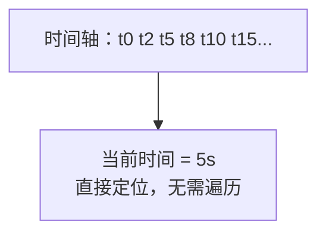
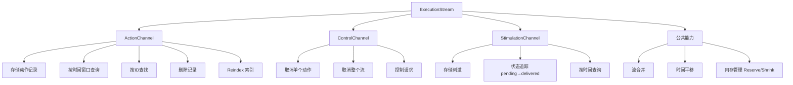
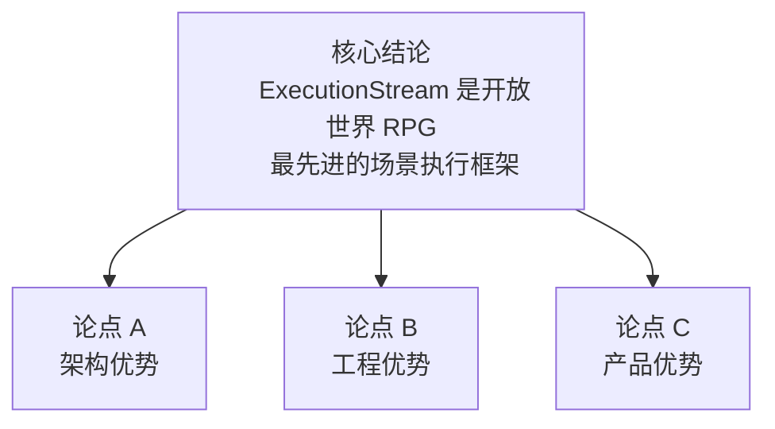

# ExecutionStream 深度分析报告
**核心框架：黄金圈法则 + 金字塔原理**

---

## 一、黄金圈法则 (The Golden Circle)
> 探寻 ExecutionStream 的本质：从信念到实现。

### 1. WHY：核心信念与初衷
- **信念声明**：“游戏叙事不应该是‘播放电影’，而应该是‘活的演出’。”
- **解决痛点**：
  - 传统 RPG 的割裂感：触发对话 → 播片 → 回到游戏，玩家中途失去控制权。
  - NPC 机械化：NPC 只是预设好轨道的木偶，无法对复杂的环境变化做出即时反应。
- **根本矛盾**：**导演的精确控制**（时序、节奏）与 **玩家的自由度**（移动、打断、选择）之间的冲突。

### 2. HOW：差异化实现策略
ExecutionStream 通过以下三大工程逻辑解决上述矛盾：
- **通道分离 (Separation of Concerns)**
  - Action 通道：负责“计划执行”（做什么）。
  - Control 通道：负责“异常处理”（打断什么）。
  - Stimulation 通道：负责“协调同步”（等什么）。
- **计划与状态分离 (Plan vs. Status)**
  - 同时记录“预期时间”与“实际发生时间”，实现叙事进度的**可追溯、可预测、可回放**。
- **高效时间索引 (Time-Indexed Access)**
  - 采用有序存储 + 二分查找（$O(\log n)$），确保在拥有数百个事件的大型场景中依然保持高性能。

### 3. WHAT：具体产品功能
- **ActionChannel**：存储/移除动作记录、按时间窗口查询、索引重构（Reindex）。
- **ControlChannel**：取消单个动作或整个流、按需触发控制请求。
- **StimulationChannel**：状态追踪（Pending → Delivered）、统一信号通信机制。
- **公共能力**：流合并、时间平移（Time Translation）、内存容量管理（Reserve/Shrink）。

---

## 二、金字塔原理分析 (The Pyramid Principle)
> 结论先行：为什么 ExecutionStream 是优秀的叙事引擎？

### 【核心结论】
**ExecutionStream 是目前开放世界 RPG 中最先进的场景执行框架。它完美平衡了“精确控制”与“动态响应”这两个叙事矛盾。**

### 论点 A：架构优势——关注点分离
1. **职责单一**：每个 Channel 独立运作，降低代码耦合度。
2. **扩展性强**：增加新的打断类型（如玩家在 NPC 面前跳舞）仅需扩展 Control 通道。
3. **团队协作效率**：叙事设计师、系统程序员与集成工程师可基于不同通道并行工作。

### 论点 B：工程优势——高性能与可维护性
1. **算法优化**：使用 `std::lower_bound` 替代全遍历，大幅度降低 CPU 开销。
2. **延迟索引策略**：批量插入后统一 Reindex，平衡了写入灵活性与查询性能。
3. **内存友好**：通过 `Reserve` 和智能 `Shrink`（超过 1.5 倍容量才收缩）减少内存碎片和频繁分配。

### 论点 C：产品优势——支撑复杂叙事
1. **沉浸式体验**：支撑了《赛博朋克 2077》中“一边走路一边聊天”且能被随时“拔枪打断”的流畅感。
2. **多系统协同**：通过刺激信号协调 Workspot（动作）、AI、音效与摄像机系统。
3. **渐进式自由度 (Tier 系统)**：原生支持从“完全自由”到“强制过场”的 5 级动态切换。

---

## 三、竞品对比矩阵

| 维度 | 2077 ExecutionStream | Unreal Sequencer | Unity Timeline | 传统脚本 (Lua/C#) |
| :--- | :--- | :--- | :--- | :--- |
| **定位** | **交互叙事专用** | 电影级过场为主 | 通用动画编排 | 基础任务逻辑 |
| **打断支持** | ✅ **原生支持 (Control)** | ⚠️ 需重度扩展 | ⚠️ 需重度扩展 | ❌ 实现困难 |
| **系统协调** | ✅ **原生支持 (Stimulation)** | ⚠️ 依赖事件系统 | ⚠️ 依赖信号系统 | ❌ 硬编码耦合 |
| **自由度控制** | ✅ **Tier 系统原生集成** | ❌ 倾向全锁定 | ❌ 倾向全锁定 | ⚠️ 需手动开发 |
| **性能** | ✅ $O(\log n)$ | ✅ 预计算优化 | ✅ 预计算优化 | ❌ 往往是 $O(n)$ |
| **学习曲线** | ❌ 极其陡峭 | ⚠️ 中等 | ⚠️ 中等 | ✅ 简单易上手 |

---

## 四、产品演进规划建议 (MVP Roadmap)
1. **Phase 1: 核心通道 (MVP)**
   - 实现 `ActionChannel`，具备基础的事件记录与时间戳查询能力。
   - *验收标准*：NPC 能按时序完成“坐下 -> 对话 -> 站起”。

2. **Phase 2: 中断能力**
   - 引入 `ControlChannel`。
   - *验收标准*：玩家在对话中拔枪，NPC 能即时停止说话并切换战斗 AI。

3. **Phase 3: 系统协调**
   - 引入 `StimulationChannel` 信号机制。
   - *验收标准*：NPC 必须真正走到椅子并坐好后，才触发下一句台词。

4. **Phase 4: 工具链完善**
   - 开发可视化编辑器与实时预览工具。
   - *验收标准*：叙事设计师无需程序员协助即可完成复杂多分支场景。

---

## 五、总结
- **WHY**: 让叙事变活。
- **HOW**: 通道分离 + 时间索引 + 状态对比。
- **WHAT**: 一个支持高度交互、可中断、多系统协同的执行流管理器。

  ---
  一、黄金圈法则（Why → How → What）

                      ┌─────────┐
                      │   WHY   │  ← 为什么存在？信念是什么？
                      │  信念   │
                      └────┬────┘
                           │
                      ┌────▼────┐
                      │   HOW   │  ← 如何实现？差异化方法？
                      │  方法   │
                      └────┬────┘
                           │
                      ┌────▼────┐
                      │  WHAT   │  ← 具体是什么？功能特性？
                      │  产品   │
                      └─────────┘

  ---
  WHY：为什么需要 ExecutionStream？

  核心信念

  ┌─────────────────────────────────────────────────────────────┐
  │                                                              │
  │   "游戏叙事不应该是'播放电影'，而应该是'活的演出'"          │
  │                                                              │
  │   传统RPG的问题：                                            │
  │   ┌──────────────────────────────────────────────────────┐  │
  │   │  玩家 → 触发对话 → 看过场动画 → 回到游戏                │  │
  │   │                                                       │  │
  │   │  问题：                                               │  │
  │   │  - 叙事和游戏是割裂的                                 │  │
  │   │  - 玩家失去控制权                                     │  │
  │   │  - NPC像木偶，不像活人                                │  │
  │   └──────────────────────────────────────────────────────┘  │
  │                                                              │
  │   CDPR的信念：                                               │
  │   ┌──────────────────────────────────────────────────────┐  │
  │   │  玩家 → 进入场景 → 保持一定自由度 → 体验沉浸叙事     │  │
  │   │                                                       │  │
  │   │  目标：                                               │  │
  │   │  - 叙事融入游戏                                       │  │
  │   │  - 玩家保持代入感                                     │  │
  │   │  - NPC有真实的行为和反应                              │  │
  │   └──────────────────────────────────────────────────────┘  │
  │                                                              │
  └─────────────────────────────────────────────────────────────┘

  要解决的根本矛盾

                  精确控制 ◄─────────────────► 自由度
                     │                           │
                     │     游戏叙事的核心矛盾     │
                     │                           │
              ┌──────┴──────┐             ┌──────┴──────┐
              │  导演需要    │             │  玩家需要    │
              │  - 精确时序  │             │  - 自由探索  │
              │  - 可控节奏  │             │  - 随时打断  │
              │  - 确定结果  │             │  - 有意义选择│
              └─────────────┘             └─────────────┘
                     │                           │
                     └───────────┬───────────────┘
                                 │
                                 ▼
                      ExecutionStream 的使命：
                      在精确控制和自由度之间找到平衡

  ---
  HOW：ExecutionStream 如何实现？

  差异化策略

  ┌─────────────────────────────────────────────────────────────┐
  │                    HOW: 三大差异化方法                       │
  ├─────────────────────────────────────────────────────────────┤
  │                                                              │
  │  1️⃣ 通道分离（Separation of Concerns）                      │
  │  ┌────────────────────────────────────────────────────────┐ │
  │  │                                                         │ │
  │  │   传统方案：一个大脚本处理所有事情                      │ │
  │  │   ┌─────────────────────────────────────────────────┐  │ │
  │  │   │  if (time == 5s) playDialog();                  │  │ │
  │  │   │  if (playerAttack) cancelDialog();              │  │ │
  │  │   │  if (npcReady) continueScene();                 │  │ │
  │  │   │  // 混乱、难维护、容易出bug                      │  │ │
  │  │   └─────────────────────────────────────────────────┘  │ │
  │  │                                                         │ │
  │  │   ExecutionStream：三通道各司其职                       │ │
  │  │   ┌─────────────┬─────────────┬─────────────────────┐  │ │
  │  │   │ Action      │ Control     │ Stimulation         │  │ │
  │  │   │ 做什么      │ 打断什么    │ 等什么               │  │ │
  │  │   │ (计划执行)  │ (异常处理)  │ (协调同步)          │  │ │
  │  │   └─────────────┴─────────────┴─────────────────────┘  │ │
  │  │                                                         │ │
  │  └────────────────────────────────────────────────────────┘ │
  │                                                              │
  │  2️⃣ 计划与状态分离（Plan vs Status）                        │
  │  ┌────────────────────────────────────────────────────────┐ │
  │  │                                                         │ │
  │  │   传统方案：只记录当前状态                              │ │
  │  │   - 不知道原计划是什么                                  │ │
  │  │   - 无法对比差异                                        │ │
  │  │   - 调试困难                                            │ │
  │  │                                                         │ │
  │  │   ExecutionStream：分开记录                             │ │
  │  │   ┌──────────────────┬───────────────────────────────┐ │ │
  │  │   │   ExecutionPlan  │   ExecutionStatus             │ │ │
  │  │   │   计划5秒开始    │   实际5.2秒开始（延迟0.2秒）  │ │ │
  │  │   │   计划10秒结束   │   实际8秒结束（被跳过）       │ │ │
  │  │   └──────────────────┴───────────────────────────────┘ │ │
  │  │                                                         │ │
  │  │   价值：可追溯、可调试、可回放、可预测                  │ │
  │  │                                                         │ │
  │  └────────────────────────────────────────────────────────┘ │
  │                                                              │
  │  3️⃣ 时间索引（Time-Indexed Access）                         │
  │  ┌────────────────────────────────────────────────────────┐ │
  │  │                                                         │ │
  │  │   传统方案：遍历所有事件找当前要执行的                  │ │
  │  │   for (event in events) {                               │ │
  │  │       if (event.time <= now) execute(event);            │ │
  │  │   }                                                     │ │
  │  │   // O(n) 复杂度，事件多了就卡                          │ │
  │  │                                                         │ │
  │  │   ExecutionStream：按时间排序 + 二分查找                │ │
  │  │   ┌──────────────────────────────────────────────────┐ │ │
  │  │   │  [t=0] [t=2] [t=5] [t=8] [t=10] [t=15] ...      │ │ │
  │  │   │              ↑                                   │ │ │
  │  │   │          当前时间=5，直接定位                    │ │ │
  │  │   └──────────────────────────────────────────────────┘ │ │
  │  │   // O(log n) 复杂度，高效                              │ │
  │  │                                                         │ │
  │  └────────────────────────────────────────────────────────┘ │
  │                                                              │
  └─────────────────────────────────────────────────────────────┘

  ---
  WHAT：ExecutionStream 具体是什么？

  ┌─────────────────────────────────────────────────────────────┐
  │                    WHAT: 产品功能清单                        │
  ├─────────────────────────────────────────────────────────────┤
  │                                                              │
  │  ExecutionStream                                             │
  │  ├── ActionChannel（动作通道）                               │
  │  │   ├── 存储动作记录（StoreActionRecord）                  │
  │  │   ├── 按时间窗口查询（IterateStartingRecords）           │
  │  │   ├── 按ID/UserData查找（FindActionRecord）              │
  │  │   ├── 删除记录（RemoveActionRecord）                     │
  │  │   └── 索引管理（Reindex）                                │
  │  │                                                           │
  │  ├── ControlChannel（控制通道）                              │
  │  │   ├── 取消单个动作（cancelActionInstance）               │
  │  │   ├── 取消整个流（cancelExecutionStream）                │
  │  │   └── 按时间触发控制请求                                  │
  │  │                                                           │
  │  ├── StimulationChannel（刺激通道）                          │
  │  │   ├── 存储刺激记录                                        │
  │  │   ├── 状态追踪（pending → delivered）                    │
  │  │   └── 按时间窗口查询                                      │
  │  │                                                           │
  │  └── 公共能力                                                │
  │      ├── 流合并（CombineSubstream）                          │
  │      ├── 时间平移（TranslatePos/Neg）                        │
  │      └── 容量管理（Reserve/Shrink）                          │
  │                                                              │
  └─────────────────────────────────────────────────────────────┘

  ---
  二、金字塔法则（结论先行 + MECE分解）

                           ┌─────────────────┐
                           │   核心结论       │
                           │   (Main Point)  │
                           └────────┬────────┘
                                    │
                ┌───────────────────┼───────────────────┐
                │                   │                   │
          ┌─────▼─────┐       ┌─────▼─────┐       ┌─────▼─────┐
          │  论点 A    │       │  论点 B    │       │  论点 C    │
          └─────┬─────┘       └─────┬─────┘       └─────┬─────┘
                │                   │                   │
          ┌─────┴─────┐       ┌─────┴─────┐       ┌─────┴─────┐
          │ 证据/数据  │       │ 证据/数据  │       │ 证据/数据  │
          └───────────┘       └───────────┘       └───────────┘

  ---
  金字塔分析：为什么 ExecutionStream 是优秀的叙事引擎？

  ┌─────────────────────────────────────────────────────────────┐
  │                                                              │
  │  【核心结论】                                                │
  │  ExecutionStream 是目前开放世界RPG中最先进的场景执行框架，  │
  │  因为它同时解决了"精确控制"和"动态响应"两个看似矛盾的需求   │
  │                                                              │
  └─────────────────────────────────────────────────────────────┘
                                │
          ┌─────────────────────┼─────────────────────┐
          │                     │                     │
          ▼                     ▼                     ▼
  ┌───────────────┐     ┌───────────────┐     ┌───────────────┐
  │   论点A        │     │   论点B        │     │   论点C        │
  │   架构优势     │     │   工程优势     │     │   产品优势     │
  └───────┬───────┘     └───────┬───────┘     └───────┬───────┘
          │                     │                     │
          ▼                     ▼                     ▼

  ---
  论点A：架构优势——关注点分离

  ┌─────────────────────────────────────────────────────────────┐
  │  论点A：三通道架构实现了完美的关注点分离                     │
  ├─────────────────────────────────────────────────────────────┤
  │                                                              │
  │  子论点A1：每个通道职责单一                                  │
  │  ┌────────────────────────────────────────────────────────┐ │
  │  │  Action   → 只关心"做什么、什么时候"                    │ │
  │  │  Control  → 只关心"如何中断"                            │ │
  │  │  Stimula  → 只关心"如何协调"                            │ │
  │  │                                                         │ │
  │  │  证据：代码中三个Channel完全独立，无交叉依赖            │ │
  │  └────────────────────────────────────────────────────────┘ │
  │                                                              │
  │  子论点A2：修改一个不影响另一个                              │
  │  ┌────────────────────────────────────────────────────────┐ │
  │  │  场景：需要增加新的中断类型                             │ │
  │  │                                                         │ │
  │  │  传统方案：修改整个事件处理逻辑                         │ │
  │  │  ExecutionStream：只修改ControlChannel                  │ │
  │  │                                                         │ │
  │  │  证据：ControlChannel::Request::Type 可独立扩展         │ │
  │  └────────────────────────────────────────────────────────┘ │
  │                                                              │
  │  子论点A3：便于团队分工                                      │
  │  ┌────────────────────────────────────────────────────────┐ │
  │  │  叙事设计师 → 关注 ActionChannel（设计流程）            │ │
  │  │  系统程序员 → 关注 ControlChannel（处理异常）           │ │
  │  │  集成工程师 → 关注 StimulationChannel（对接系统）       │ │
  │  └────────────────────────────────────────────────────────┘ │
  │                                                              │
  └─────────────────────────────────────────────────────────────┘

  ---
  论点B：工程优势——高性能 + 可维护

  ┌─────────────────────────────────────────────────────────────┐
  │  论点B：工程实现达到了性能和可维护性的平衡                   │
  ├─────────────────────────────────────────────────────────────┤
  │                                                              │
  │  子论点B1：O(log n) 时间复杂度                               │
  │  ┌────────────────────────────────────────────────────────┐ │
  │  │  问题：场景可能有数百个事件                             │ │
  │  │                                                         │ │
  │  │  传统方案：每帧遍历所有事件 → O(n)                      │ │
  │  │  ExecutionStream：二分查找 → O(log n)                   │ │
  │  │                                                         │ │
  │  │  证据：IterateStartingRecords 使用 std::lower_bound     │ │
  │  │       m_indexed 标志确保有序性                          │ │
  │  └────────────────────────────────────────────────────────┘ │
  │                                                              │
  │  子论点B2：延迟索引策略                                      │
  │  ┌────────────────────────────────────────────────────────┐ │
  │  │  问题：频繁插入会导致频繁排序                           │ │
  │  │                                                         │ │
  │  │  解决：插入时只标记 m_indexed = false                   │ │
  │  │        查询前才 Reindex()                               │ │
  │  │                                                         │ │
  │  │  证据：StoreActionRecord 中的 m_indexed &= 逻辑         │ │
  │  │        批量插入后一次性 Reindex                         │ │
  │  └────────────────────────────────────────────────────────┘ │
  │                                                              │
  │  子论点B3：内存友好                                          │
  │  ┌────────────────────────────────────────────────────────┐ │
  │  │  - Reserve() 预分配避免频繁扩容                         │ │
  │  │  - Shrink() 释放多余内存                                │ │
  │  │  - 移动语义减少拷贝                                     │ │
  │  │                                                         │ │
  │  │  证据：Shrink() 只在容量超过 1.5x 时才收缩              │ │
  │  └────────────────────────────────────────────────────────┘ │
  │                                                              │
  └─────────────────────────────────────────────────────────────┘

  ---
  论点C：产品优势——支撑复杂叙事需求

  ┌─────────────────────────────────────────────────────────────┐
  │  论点C：直接支撑了2077的差异化叙事体验                       │
  ├─────────────────────────────────────────────────────────────┤
  │                                                              │
  │  子论点C1：支持"可打断的沉浸式对话"                          │
  │  ┌────────────────────────────────────────────────────────┐ │
  │  │  玩家体验：                                             │ │
  │  │  - 对话中可以四处走动                                   │ │
  │  │  - 可以随时查看手机                                     │ │
  │  │  - 可以攻击NPC打断对话                                  │ │
  │  │                                                         │ │
  │  │  技术支撑：                                             │ │
  │  │  - ActionChannel 管理对话流程                           │ │
  │  │  - ControlChannel 处理各种中断                          │ │
  │  │  - 两者协作实现"可打断但不混乱"                         │ │
  │  └────────────────────────────────────────────────────────┘ │
  │                                                              │
  │  子论点C2：支持"多系统协同"                                  │
  │  ┌────────────────────────────────────────────────────────┐ │
  │  │  场景需要协调：                                         │ │
  │  │  - Workspot系统（NPC动作）                              │ │
  │  │  - 对话系统（语音播放）                                 │ │
  │  │  - 摄像机系统（镜头切换）                               │ │
  │  │  - AI系统（NPC反应）                                    │ │
  │  │                                                         │ │
  │  │  技术支撑：                                             │ │
  │  │  - StimulationChannel 统一信号机制                      │ │
  │  │  - 各系统通过"刺激"通信                                 │ │
  │  │  - 解耦但协调                                           │ │
  │  └────────────────────────────────────────────────────────┘ │
  │                                                              │
  │  子论点C3：支持"渐进式自由度"（Tier系统）                    │
  │  ┌────────────────────────────────────────────────────────┐ │
  │  │  2077的Tier系统：                                       │ │
  │  │  - Tier1: 完全自由                                      │ │
  │  │  - Tier2: 限制移动范围                                  │ │
  │  │  - Tier3: 限制移动但可环顾                              │ │
  │  │  - Tier4: 只能看不能动                                  │ │
  │  │  - Tier5: 完全过场                                      │ │
  │  │                                                         │ │
  │  │  技术支撑：                                             │ │
  │  │  - ActionChannel 中的 ChangeTierEvent                   │ │
  │  │  - 场景可以动态调整玩家自由度                           │ │
  │  └────────────────────────────────────────────────────────┘ │
  │                                                              │
  └─────────────────────────────────────────────────────────────┘

  ---
  三、竞品对比分析

  ┌─────────────────────────────────────────────────────────────┐
  │                      竞品对比矩阵                            │
  ├──────────────┬──────────┬──────────┬──────────┬────────────┤
  │   维度        │ 2077     │ Unreal   │ Unity    │ 传统脚本   │
  │              │ Execution│ Sequencer│ Timeline │            │
  │              │ Stream   │          │          │            │
  ├──────────────┼──────────┼──────────┼──────────┼────────────┤
  │ 定位         │ 游戏叙事 │ 过场动画 │ 通用动画 │ 任务逻辑   │
  │              │ 专用     │ 为主     │ 为主     │            │
  ├──────────────┼──────────┼──────────┼──────────┼────────────┤
  │ 打断支持     │ ✅ 原生   │ ⚠️ 需扩展│ ⚠️ 需扩展│ ❌ 困难    │
  │              │ Control  │          │          │            │
  │              │ Channel  │          │          │            │
  ├──────────────┼──────────┼──────────┼──────────┼────────────┤
  │ 系统协调     │ ✅ 原生   │ ⚠️ 事件  │ ⚠️ 信号  │ ❌ 硬编码  │
  │              │ Stimula  │ 系统     │ 系统     │            │
  │              │ tion     │          │          │            │
  ├──────────────┼──────────┼──────────┼──────────┼────────────┤
  │ 玩家自由度   │ ✅ Tier   │ ❌ 全锁定│ ❌ 全锁定│ ⚠️ 自己实现│
  │              │ 系统     │          │          │            │
  ├──────────────┼──────────┼──────────┼──────────┼────────────┤
  │ 分支叙事     │ ✅ 场景图 │ ⚠️ 需组合│ ⚠️ 需组合│ ✅ 灵活    │
  │              │ 原生支持 │          │          │            │
  ├──────────────┼──────────┼──────────┼──────────┼────────────┤
  │ 性能         │ ✅ O(logn)│ ✅ 优化  │ ✅ 优化  │ ❌ O(n)    │
  ├──────────────┼──────────┼──────────┼──────────┼────────────┤
  │ 学习曲线     │ ❌ 陡峭   │ ⚠️ 中等  │ ⚠️ 中等  │ ✅ 简单    │
  ├──────────────┼──────────┼──────────┼──────────┼────────────┤
  │ 适用场景     │ 开放世界 │ 线性过场 │ 通用动画 │ 简单任务   │
  │              │ RPG叙事  │ 动画     │ 编排     │            │
  └──────────────┴──────────┴──────────┴──────────┴────────────┘

  ---
  竞品深度对比

  ┌─────────────────────────────────────────────────────────────┐
  │                                                              │
  │  【Unreal Sequencer 对比】                                   │
  │                                                              │
  │  Sequencer 的设计目标：                                      │
  │  - 制作电影级过场动画                                        │
  │  - 非交互式播放                                              │
  │  - 精确到帧的控制                                            │
  │                                                              │
  │  与 ExecutionStream 的差异：                                 │
  │  ┌────────────────────────┬────────────────────────────┐    │
  │  │      Sequencer         │     ExecutionStream        │    │
  │  ├────────────────────────┼────────────────────────────┤    │
  │  │ 播放就是播放           │ 可随时打断                  │    │
  │  │ 时间轴是绝对的         │ 时间可以是相对的            │    │
  │  │ 不关心玩家输入         │ 响应玩家行为                │    │
  │  │ Track-based            │ Channel-based              │    │
  │  │ 适合：过场、预渲染     │ 适合：交互式叙事           │    │
  │  └────────────────────────┴────────────────────────────┘    │
  │                                                              │
  │  结论：Sequencer 是"电影工具"，ExecutionStream 是"戏剧工具" │
  │                                                              │
  └─────────────────────────────────────────────────────────────┘

  ┌─────────────────────────────────────────────────────────────┐
  │                                                              │
  │  【传统脚本方案对比】                                        │
  │                                                              │
  │  传统方案（如 Lua/C# 脚本）：                                │
  │  ┌────────────────────────────────────────────────────────┐ │
  │  │  function OnSceneStart()                                │ │
  │  │      wait(2)                                            │ │
  │  │      npc:PlayAnim("sit")                                │ │
  │  │      wait(3)                                            │ │
  │  │      npc:Say("Hello")                                   │ │
  │  │      -- 如果玩家攻击怎么办？                            │ │
  │  │      -- 如果NPC还没坐好怎么办？                         │ │
  │  │      -- 如果需要等待加载怎么办？                        │ │
  │  │  end                                                    │ │
  │  └────────────────────────────────────────────────────────┘ │
  │                                                              │
  │  问题：                                                      │
  │  - wait() 是阻塞的，无法响应                                │
  │  - 异常处理散落在各处                                        │
  │  - 状态难以追踪                                              │
  │  - 调试困难                                                  │
  │                                                              │
  │  ExecutionStream 的优势：                                    │
  │  - 声明式而非命令式                                          │
  │  - 中断是一等公民                                            │
  │  - 状态可查询                                                │
  │  - 可视化调试                                                │
  │                                                              │
  └─────────────────────────────────────────────────────────────┘

  ---
  四、产品规划建议（如果你们要做类似系统）

  ┌─────────────────────────────────────────────────────────────┐
  │                      产品规划路线图                          │
  ├─────────────────────────────────────────────────────────────┤
  │                                                              │
  │  Phase 0: 评估是否需要                                       │
  │  ┌────────────────────────────────────────────────────────┐ │
  │  │  需要 ExecutionStream 的信号：                          │ │
  │  │  ✅ 场景中玩家保持一定自由度                            │ │
  │  │  ✅ 需要支持打断/跳过                                   │ │
  │  │  ✅ 多个系统需要协调（动画、AI、对话）                  │ │
  │  │  ✅ 场景有分支                                          │ │
  │  │                                                         │ │
  │  │  不需要的信号：                                         │ │
  │  │  ❌ 纯过场动画，玩家无交互                              │ │
  │  │  ❌ 简单的任务触发                                      │ │
  │  │  ❌ 团队规模小，场景数量少                              │ │
  │  └────────────────────────────────────────────────────────┘ │
  │                                                              │
  │  Phase 1: MVP（最小可行产品）                                │
  │  ┌────────────────────────────────────────────────────────┐ │
  │  │  只做 ActionChannel：                                   │ │
  │  │  - 能记录事件                                           │ │
  │  │  - 能按时间执行                                         │ │
  │  │  - 能查询状态                                           │ │
  │  │                                                         │ │
  │  │  验收标准：能实现简单的"NPC坐下→说话→站起"            │ │
  │  └────────────────────────────────────────────────────────┘ │
  │                                                              │
  │  Phase 2: 中断能力                                           │
  │  ┌────────────────────────────────────────────────────────┐ │
  │  │  加入 ControlChannel：                                  │ │
  │  │  - 能取消正在进行的动作                                 │ │
  │  │  - 能取消整个场景                                       │ │
  │  │                                                         │ │
  │  │  验收标准：对话中拔枪，场景能正确中断                   │ │
  │  └────────────────────────────────────────────────────────┘ │
  │                                                              │
  │  Phase 3: 系统协调                                           │
  │  ┌────────────────────────────────────────────────────────┐ │
  │  │  加入 StimulationChannel：                              │ │
  │  │  - 能等待外部信号                                       │ │
  │  │  - 能发送信号给其他系统                                 │ │
  │  │                                                         │ │
  │  │  验收标准：等NPC坐好后再开始对话（信号驱动）            │ │
  │  └────────────────────────────────────────────────────────┘ │
  │                                                              │
  │  Phase 4: 工具链                                             │
  │  ┌────────────────────────────────────────────────────────┐ │
  │  │  - 可视化编辑器                                         │ │
  │  │  - 实时预览                                             │ │
  │  │  - 调试工具                                             │ │
  │  │                                                         │ │
  │  │  验收标准：设计师能独立创建场景，无需程序员             │ │
  │  └────────────────────────────────────────────────────────┘ │
  │                                                              │
  └─────────────────────────────────────────────────────────────┘

  ---
  五、一句话总结

  ┌─────────────────────────────────────────────────────────────┐
  │                                                              │
  │  黄金圈：                                                    │
  │  ┌────────────────────────────────────────────────────────┐ │
  │  │  WHY:  让游戏叙事像真实演出，而不是播放电影             │ │
  │  │  HOW:  三通道分离 + 计划状态分离 + 时间索引             │ │
  │  │  WHAT: ActionChannel + ControlChannel + Stimulation     │ │
  │  └────────────────────────────────────────────────────────┘ │
  │                                                              │
  │  金字塔：                                                    │
  │  ┌────────────────────────────────────────────────────────┐ │
  │  │  结论：ExecutionStream 是开放世界RPG叙事的最佳实践      │ │
  │  │  支撑：架构优势 + 工程优势 + 产品优势                   │ │
  │  │  证据：2077 的沉浸式体验验证了这套方案                  │ │
  │  └────────────────────────────────────────────────────────┘ │
  │                                                              │
  └─────────────────────────────────────────────────────────────┘

  下面是**纯标准 Markdown + Mermaid 图表**版本，结构干净、可直接渲染、可用于文档/汇报/PPT。

---

# ExecutionStream 架构分析文档（黄金圈 + 金字塔）

## 一、黄金圈法则（Why → How → What）

---

## WHY：为什么需要 ExecutionStream？

### 核心信念
> **“游戏叙事不应该是‘播放电影’，而应该是‘活的演出’。”**

### 传统 RPG 的问题
- 流程：玩家 → 触发对话 → 看过场 → 回到游戏
- 痛点：
  - 叙事与游戏割裂
  - 玩家中途失去控制权
  - NPC 像木偶，无真实反应

### CDPR 目标
- 叙事真正融入游戏
- 玩家保持自由度与代入感
- NPC 拥有真实行为与动态响应

### 核心矛盾

---

## HOW：ExecutionStream 如何实现？

三大差异化设计：

### 1. 通道分离（Separation of Concerns）

- 传统：单脚本包揽所有逻辑，混乱难维护
- ES：三通道独立职责，低耦合、易扩展

### 2. 计划与状态分离（Plan vs Status）
- 传统：只记录当前状态，无法追溯
- ES：
  - `ExecutionPlan`：预期时间线
  - `ExecutionStatus`：实际发生记录
- 价值：可追溯、可回放、可预测、可调试

### 3. 时间索引（Time-Indexed Access）
- 传统：遍历查询 O(n)，事件多则卡顿
- ES：有序存储 + 二分查找 O(log n)

---

## WHAT：ExecutionStream 具体是什么？

---

## 二、金字塔原理（结论先行 + MECE）

### 核心结论
**ExecutionStream 完美平衡“导演精确控制”与“玩家动态响应”。**

---

## 论点 A：架构优势 —— 关注点分离
1. **职责单一**
   - Action：做什么
   - Control：如何中断
   - Stimulation：如何同步
2. **扩展性强**
   - 新增中断只需扩展 ControlChannel
3. **团队协作友好**
   - 策划/程序/TA 可并行工作

---

## 论点 B：工程优势 —— 高性能 + 可维护
1. **O(log n) 查询效率**
   - 使用 `std::lower_bound`
2. **延迟索引策略**
   - 批量插入 → 统一 Reindex
3. **内存友好**
   - Reserve / Shrink（超过1.5倍才收缩）
   - 减少分配与碎片

---

## 论点 C：产品优势 —— 支撑高质量叙事
1. **可打断的沉浸式对话**
   - 边走边聊、随时拔枪打断
2. **多系统协同**
   - Workspot、动画、相机、AI、音效统一调度
3. **渐进式自由度 Tier 系统**
   - Tier1～Tier5 动态控制玩家权限

---

## 三、竞品对比矩阵

| 维度         | 2077 ExecutionStream       | Unreal Sequencer   | Unity Timeline     | 传统脚本(Lua/C#)       |
|------------|---------------------------|--------------------|--------------------|-----------------------|
| 定位         | 交互叙事专用               | 电影级过场         | 通用动画编排       | 基础任务逻辑          |
| 打断支持     | ✅ 原生 ControlChannel     | ⚠️ 需重度扩展      | ⚠️ 需重度扩展      | ❌ 极难实现           |
| 系统协调     | ✅ 原生 Stimulation        | ⚠️ 依赖事件        | ⚠️ 依赖信号        | ❌ 硬编码耦合         |
| 自由度控制   | ✅ Tier 系统原生           | ❌ 倾向全锁定      | ❌ 倾向全锁定      | ⚠️ 手动实现           |
| 性能         | ✅ O(log n)                | ✅ 预计算优化      | ✅ 预计算优化      | ❌ O(n)               |
| 学习曲线     | ❌ 陡峭                    | ⚠️ 中等            | ⚠️ 中等            | ✅ 简单               |
| 适用场景     | 开放世界 RPG 动态叙事      | 线性过场动画       | 通用动画时间线     | 简单触发任务          |

---

## 四、产品演进路线（MVP Roadmap）

```mermaid
gantt
    title ExecutionStream 落地路线
    dateFormat X
    axisFormat %s

    section 阶段
    Phase1_MVP        :0, 1
    Phase2_Control    :1, 2
    Phase3_Stimulation:2, 3
    Phase4_Toolchain  :3, 4
```

1. **Phase 1: MVP**
   - 实现 `ActionChannel`
   - 目标：NPC 坐下→对话→站起
2. **Phase 2: 中断能力**
   - 实现 `ControlChannel`
   - 目标：对话可被打断
3. **Phase 3: 系统协调**
   - 实现 `StimulationChannel`
   - 目标：信号驱动、等待同步
4. **Phase 4: 工具链**
   - 可视化编辑器 + 预览 + 调试
   - 目标：策划独立制作场景

---

## 五、一句话总结

### 黄金圈
- **WHY**：让叙事变成“活演出”，不是“播电影”
- **HOW**：三通道分离 + 计划状态分离 + 时间索引
- **WHAT**：Action + Control + Stimulation 三通道执行流

### 金字塔
- **结论**：开放世界 RPG 叙事引擎最优实践
- **支撑**：架构清晰 + 工程高效 + 体验顶级
- **验证**：《赛博朋克 2077》实际落地

---

如果你需要，我可以再帮你：
- 输出 **一页版 PPT 文案**
- 或输出 **可直接放进 Confluence/语雀** 的正式结构版