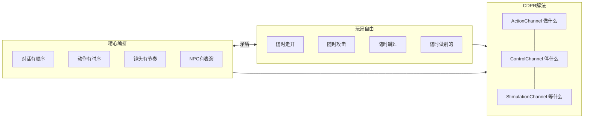
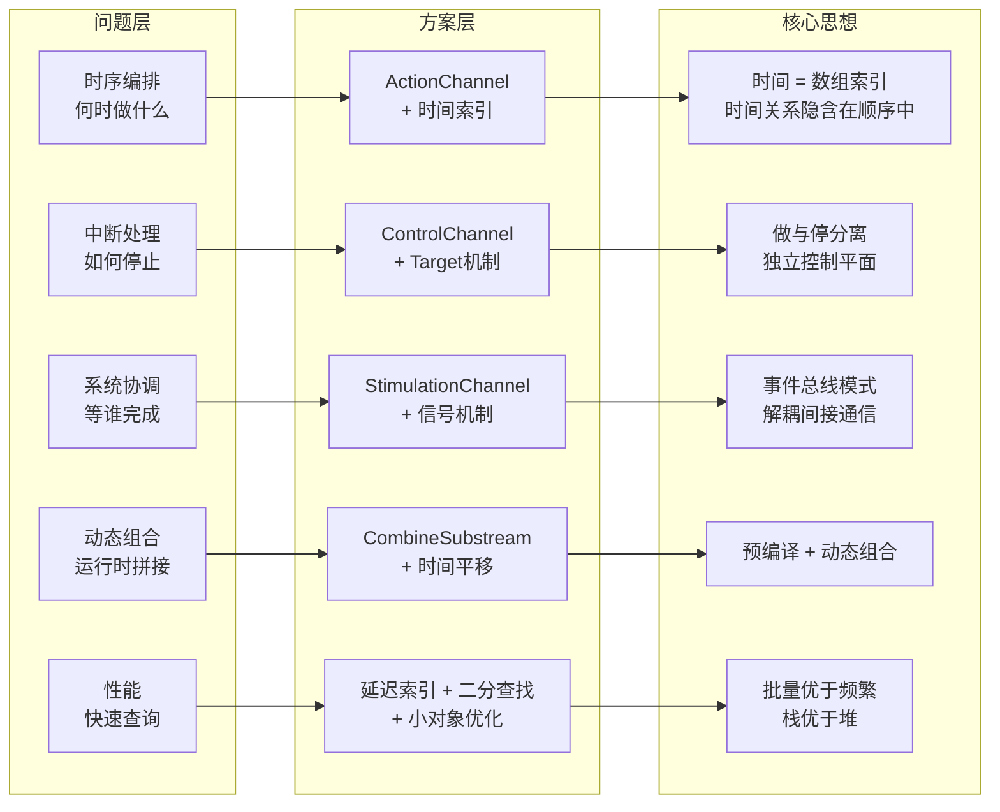
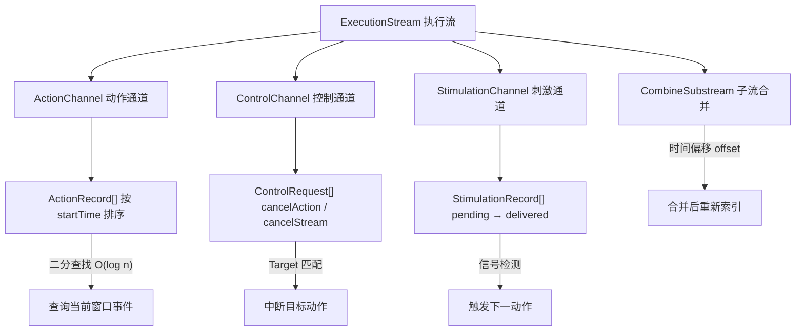
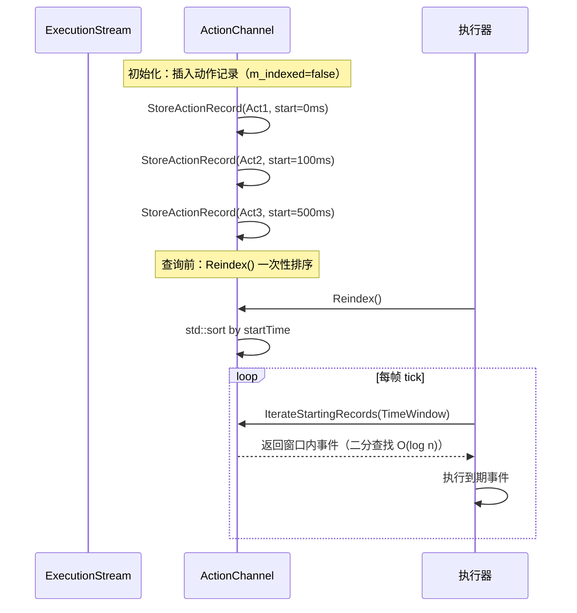
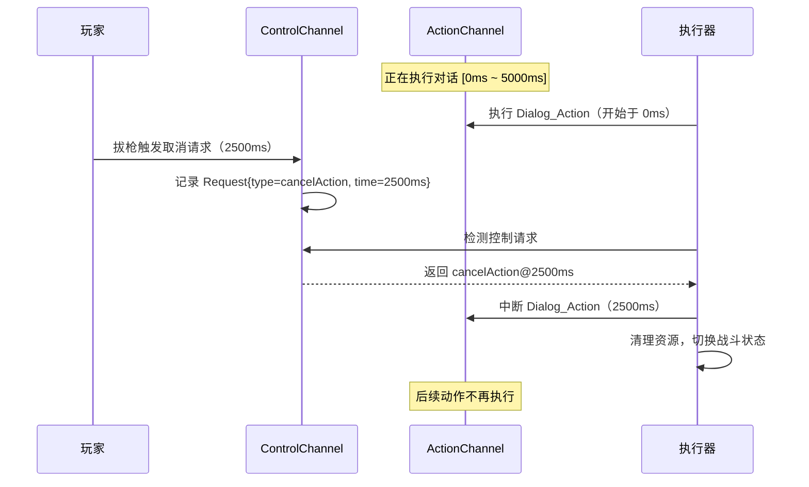
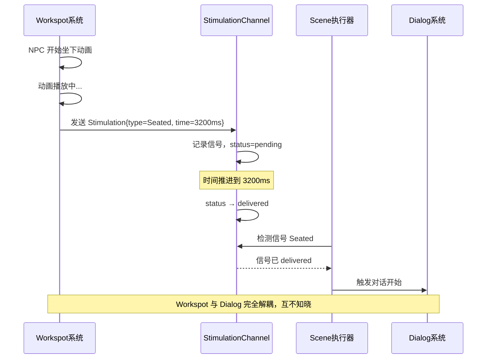
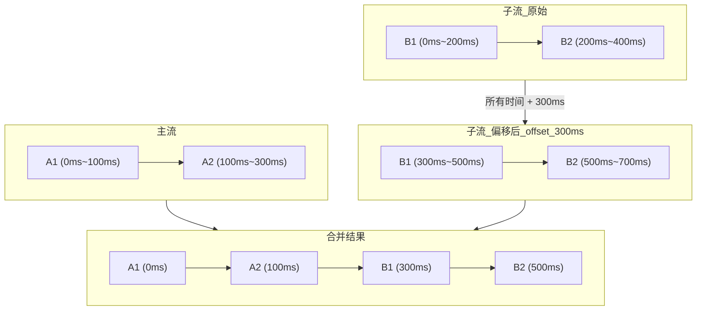
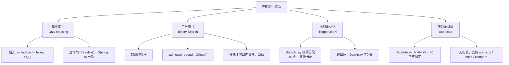
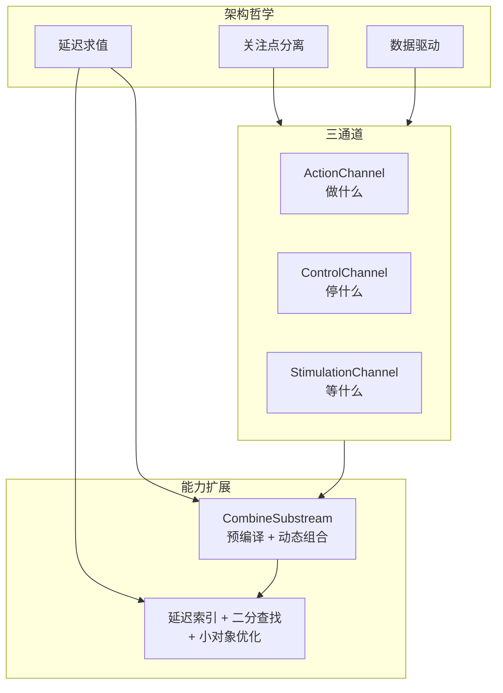

# ExecutionStream 问题定义与 CDPR 解决方案

---

## 一、核心问题定义

> **一句话定义问题：如何在开放世界游戏中，让"精心编排的叙事"与"玩家自由行为"共存？**



**传统解法（二选一）：**

- **过场动画**：完全剥夺玩家控制 → 打断沉浸
- **纯脚本**：完全交给玩家 → 叙事混乱

**CDPR 的挑战（两者都要）：**

- 保持精确的叙事编排
- 同时允许玩家有限度的自由
- 自由行为能被优雅处理

---

## 二、问题分解：五个子问题



### 问题 1：时序编排问题

**需求**："Hanako 说完话后，V 坐下，镜头切换，然后对话继续"

**困难**：Hanako 说话要多久取决于语音文件，V 坐下要多久取决于动画长度，镜头何时切取决于前面两个的完成时间，如果某个动画变了，后面全部要重算。

**本质**：如何表达和计算"事件之间的时间关系"？

### 问题 2：中断处理问题

**需求**："对话进行中，玩家突然拔枪攻击 NPC"

**困难**：当前对话要立即停止，NPC 动画要中断并切换到战斗状态，已播放的内容不能回滚，后续内容不能继续执行，资源要正确清理。

**本质**：如何优雅地"停止正在做的事"？

### 问题 3：系统协调问题

**需求**："等 NPC 坐好后再开始对话"

**困难**："坐好"是 Workspot 系统的事，"对话"是 Dialog 系统的事，两个系统互不知道对方，需要某种协调机制。

**本质**：如何让"不同系统"知道"彼此的状态"？

### 问题 4：动态组合问题

**需求**："根据玩家选择，播放不同的后续内容"

**困难**：选项 A/B/C 的内容不同，每个分支的时长不同，后续内容的时间要动态调整，可能有嵌套分支。

**本质**：如何"运行时拼接"多段内容？

### 问题 5：性能问题

**需求**："复杂场景有数百个事件，仍需 60fps"

**困难**：每帧要检查哪些事件该执行，遍历数百个事件太慢，频繁插入/删除影响性能，内存分配要最小化。

**本质**：如何高效地"查询和管理大量时间事件"？

---

## 三、CDPR 的解决方案

### ExecutionStream 整体架构



---

### 解决问题 1：时序编排 → ActionChannel + 时间索引

**方案**：ActionChannel = 按时间排序的事件数组



**数据结构**：

```cpp
ActionRecord {
    m_executionPlan.m_startTime      // 开始时间
    m_executionPlan.m_conclusionTime // 结束时间
}

ActionChannel {
    DynArray<ActionRecord> m_stream; // 按 startTime 排序
}
```

**为什么有效**：时间关系隐含在数组顺序中；二分查找快速定位当前事件；Plan/Status 分离支持"计划 vs 实际"的对比。

---

### 解决问题 2：中断处理 → ControlChannel

**方案**：ControlChannel = 独立的控制请求队列，"做什么"和"停止什么"是两件独立的事。



**数据结构**：

```cpp
ControlChannel::Request {
    Type m_type;           // cancelActionInstance / cancelExecutionStream
    Target m_target;       // 取消哪个动作/哪个流
    Msec m_occurrenceTime; // 何时执行这个取消
}
```

**为什么有效**：取消逻辑和执行逻辑分离，互不干扰；可以预设取消条件（定时取消）；可以运行时动态添加取消请求（玩家行为触发）；Target 机制灵活，可取消单个动作或整个流。

---

### 解决问题 3：系统协调 → StimulationChannel

**方案**：StimulationChannel = 统一的信号/事件总线，不让系统直接依赖彼此，通过"刺激/信号"间接通信。



**数据结构**：

```cpp
StimulationRecord {
    Stimulation m_stimulation;         // 信号类型
    ExecutionPlan m_executionPlan;     // 何时发生
    ExecutionStatus m_executionStatus; // pending → delivered
}
```

**为什么有效**：系统解耦，Workspot 不知道 Dialog，Dialog 不知道 Workspot；统一接口，所有系统用同样方式发送/接收信号；可追溯，信号有时间戳；状态明确，`pending` vs `delivered` 清晰表达信号生命周期。

---

### 解决问题 4：动态组合 → CombineSubstream

**方案**：CombineSubstream = 子流合并 + 时间偏移



**核心接口**：

```cpp
void ExecutionStream::CombineSubstream(
    const ExecutionStream& other,  // 要合并的子流
    Uint32 combinationOffsetMsec   // 时间偏移量
);
```

**实现细节**：

```cpp
for (ActionRecord record : other.m_stream) {
    record.m_executionPlan.m_startTime += offsetMsec;
    record.m_executionPlan.m_conclusionTime += offsetMsec;
    StoreActionRecord(std::move(record));
}
m_indexed = false;  // 标记需要重新排序
```

**为什么有效**：子流可以预编译，每个分支独立编译运行时组合；时间偏移只需加法 O(n)；三通道统一处理，Action/Control/Stimulation 一起偏移；合并时不排序，查询前一次性排序。

---

### 解决问题 5：性能 → 延迟索引 + 小对象优化



| 技术 | 问题 | 解决 | 效果 |
|---|---|---|---|
| 延迟索引 | 频繁插入导致频繁排序 | 插入标记 `false`，查询前统一 `Reindex()` | 插入 O(1)，排序 O(n log n) 一次 |
| 二分查找 | 每帧遍历所有事件太慢 | `std::lower_bound` 定位时间窗口 | 查询 O(log n + k) |
| 小对象优化 | 触发器频繁堆分配 | `StaticArray<N>` 栈预分配 | 常见情况零堆分配 |
| 值对象编码 | 额外信息需要指针 | `FixedArray<Uint64, 5>` 固定 40 字节 | 无指针，可直接 memcpy |

---

## 四、解决方案总结



| 问题 | CDPR 方案 | 核心思想 |
|---|---|---|
| 时序编排 "何时做什么" | ActionChannel + 时间排序 | 时间 = 数组索引，时间关系隐含在顺序中 |
| 中断处理 "如何停止" | ControlChannel + Target 机制 | "做"和"停"分离，独立的控制平面 |
| 系统协调 "等谁完成" | StimulationChannel + 信号机制 | 事件总线模式，解耦的间接通信 |
| 动态组合 "运行时拼接" | CombineSubstream + 时间平移 | 预编译 + 动态组合 |
| 性能 "快速查询" | 延迟索引 + 二分查找 + 小对象优化 | 批量优于频繁，空间换时间，栈优于堆 |

---

## 五、一句话总结

> **问题**：开放世界游戏中，如何让"精确编排的叙事"与"玩家自由行为"共存？
>
> **CDPR 的答案**：
>
> ```
> ExecutionStream = ActionChannel（做什么）
>                + ControlChannel（停什么）
>                + StimulationChannel（等什么）
> ```
>
> 三个独立的通道，各自解决一类问题，通过统一的时间索引协调工作，用 `CombineSubstream` 支持动态组合。
>
> **这是一个"把复杂问题分解为正交子问题"的经典案例。**
