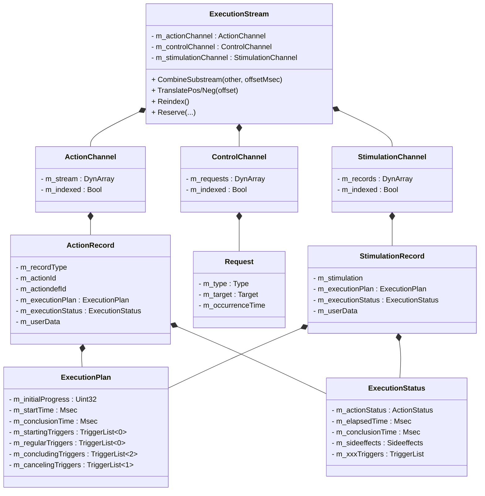
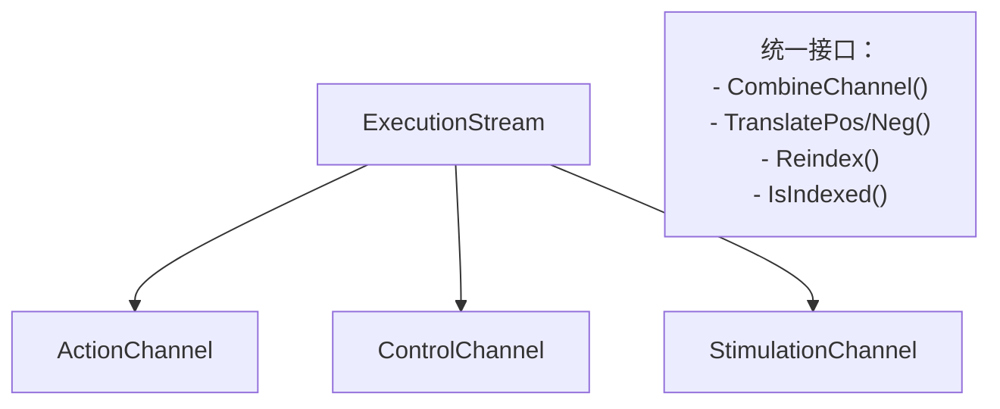
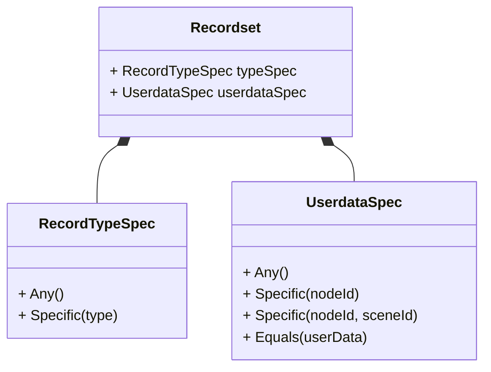
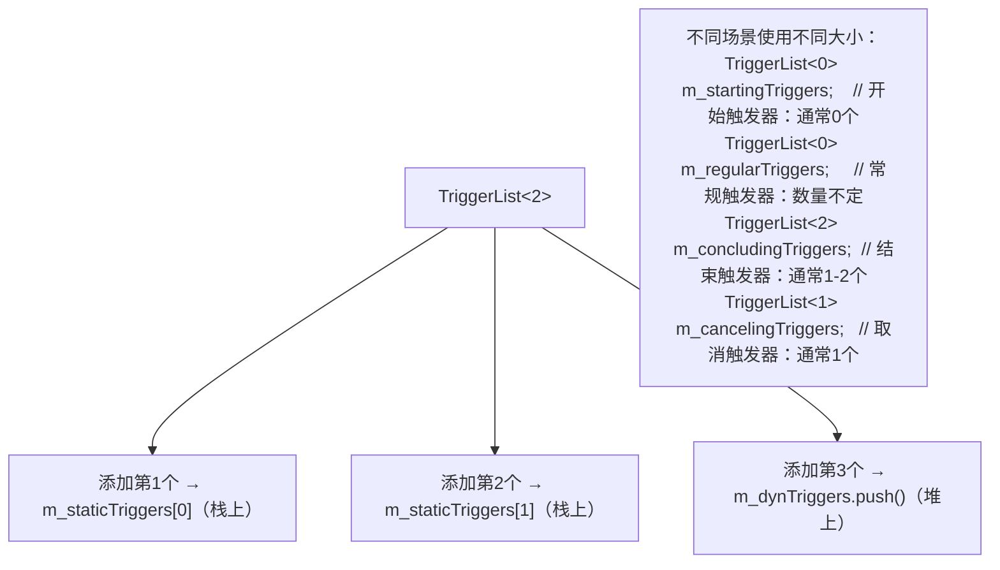
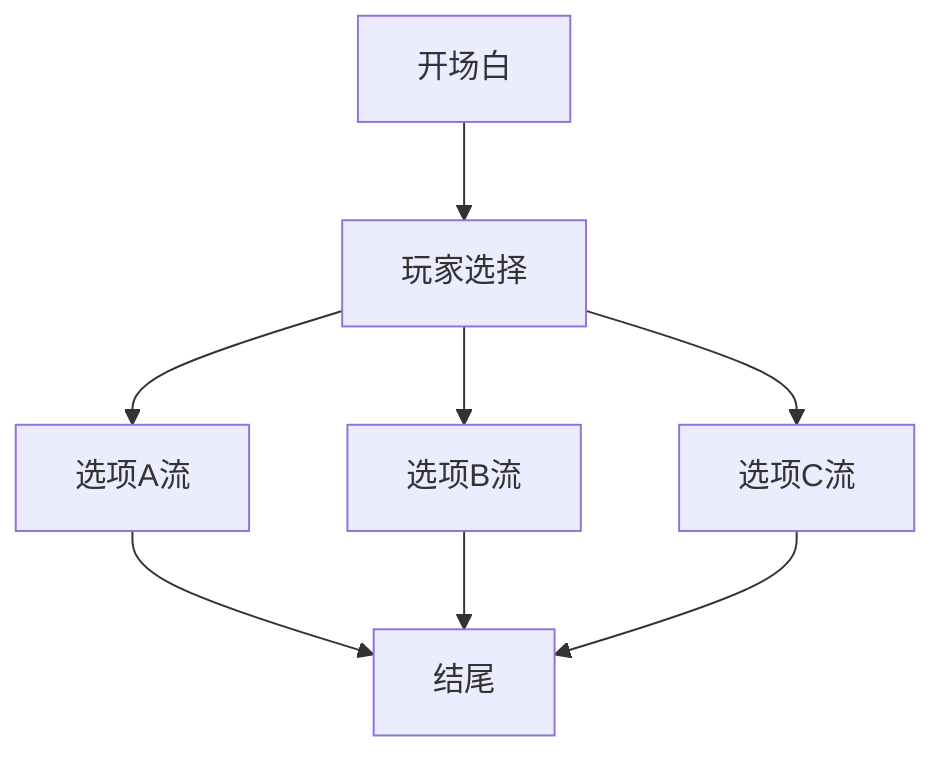

# ExecutionStream 完整数据结构与设计模式分析
## 一、整体数据结构 UML


## 二、核心设计模式
### 模式1：组合模式（Composite Pattern）


**代码体现**：
```cpp
void ExecutionStream::CombineSubstream(const ExecutionStream& other,
                                       Uint32 offsetMsec) {
    // 统一操作三个通道
    m_actionChannel.CombineChannel(other.m_actionChannel, offsetMsec);
    m_controlChannel.CombineChannel(other.m_controlChannel, offsetMsec);
    m_stimulationChannel.CombineChannel(other.m_stimulationChannel, offsetMsec);
}
```

**价值**：
- ✅ 对外暴露统一接口
- ✅ 内部可以独立演化
- ✅ 便于批量操作

### 模式2：规格模式（Specification Pattern）


**使用示例**：
```cpp
// 查询所有主要记录
Recordset allPrimary(
    RecordTypeSpec::Specific(RecordType::primary),
    UserdataSpec::Any()
);

// 查询特定节点的记录
Recordset byNode(
    RecordTypeSpec::Any(),
    UserdataSpec::Specific(nodeId)
);

// 应用规格进行查询
channel.IterateRecords(allPrimary, [](const ActionRecord& r) {
    // 只会遍历符合条件的记录
});
```

**价值**：
- ✅ 查询条件可组合
- ✅ 解耦查询逻辑和业务逻辑
- ✅ 可扩展新的匹配条件

### 模式3：小对象优化（Small Object Optimization）
```cpp
template <Uint32 StaticElements>
class TriggerList {
    red::StaticArray<Trigger, StaticElements> m_staticTriggers; // 栈上
    red::DynArray<Trigger> m_dynTriggers;                       // 堆上
};
```



**价值**：
- ✅ 常见情况零堆分配
- ✅ 缓存友好（数据在栈上连续）
- ✅ 仍支持超出预期的情况

### 模式4：延迟索引（Lazy Indexing）
```cpp
class ActionChannel {
    DynArray<ActionRecord> m_stream;
    Bool m_indexed;  // 脏位标记

    Uint32 StoreActionRecord(ActionRecord record) {
        // 插入时检查是否保持有序
        m_indexed &= (m_stream.Empty() || m_stream.Back() < record);
        m_stream.PushBack(std::move(record));
        // 不立即排序
    }

    void IterateStartingRecords(TimeWindow tw, Func func) const {
        RED_ASSERT(m_indexed);  // 查询时要求有序
        // 使用二分查找
        auto it = std::lower_bound(...);
    }
};
```


**价值**：
- ✅ 批量插入 O(n) 而非 O(n log n) × n
- ✅ 如果不查询，永远不排序
- ✅ 排序只在必要时发生

### 模式5：值对象编码（Value Object Encoding）
```cpp
struct UserData {
    static constexpr Uint32 c_nodeIdIndex = 0;
    static constexpr Uint32 c_sceneIdIndex = 1;
    static constexpr Uint32 c_internalIdIndex = 2;
    static constexpr Uint32 c_ownerIdIndex = 3;
    static constexpr Uint32 c_secondaryIdIndex = 4;

    FixedArray<Uint64, 5> m_data;  // 40字节固定大小
};
```

```mermaid
note["内存布局：
┌────────────────────────────────────────────────────────────────────┐
│  m_data[0]: NodeId         (8 bytes)                                │
│  m_data[1]: SceneId Hash   (8 bytes)                                │
│  m_data[2]: Internal Id    (8 bytes)                                │
│  m_data[3]: Owner Id Hash  (8 bytes)                                │
│  m_data[4]: Secondary Id   (8 bytes)                                │
│  ─────────────────────────────────────                              │
│  Total: 40 bytes, 无指针，可直接拷贝                                │
└────────────────────────────────────────────────────────────────────┘"]
```

**编码/解码示例**：
```cpp
// 编码
NodeActionUserData::EncodeNodeId(userData, nodeId);
NodeActionUserData::EncodeSceneInstanceId(userData, sceneId);

// 解码
NodeId nodeId = NodeActionUserData::DecodeNodeId(userData);
```

**价值**：
- ✅ 固定大小，无堆分配
- ✅ 可直接 memcpy / 比较
- ✅ 可计算 hash（用于快速查找）
- ✅ 扩展性好（5个槽位足够）

## 三、SubStream 编排机制
### 合并流程示意
```mermaid
flowchart TD
    subgraph 子场景A
        A1["[0ms] Action1"]
        A2["[100ms] Action2"]
        A3["[300ms] Action3"]
    end
    
    subgraph 子场景B
        B1["[0ms] Action4"]
        B2["[200ms] Action5"]
        B3["[500ms] Action6"]
    end
    
    subgraph 合并后 (offset=1000ms)
        C1["[0ms] Action1"]
        C2["[100ms] Action2"]
        C3["[300ms] Action3"]
        C4["[1000ms] Action4"]
        C5["[1200ms] Action5"]
        C6["[1500ms] Action6"]
    end
    
    A1 --> C1
    A2 --> C2
    A3 --> C3
    B1 --> C4
    B2 --> C5
    B3 --> C6
    
    note["CombineSubstream(B, offset=1000ms) 后需要 Reindex() 重新排序"]
```

### CombineSubstream 源码分析
```cpp
// ExecutionStream 层：统一处理三个通道
void ExecutionStream::CombineSubstream(const ExecutionStream& other,
                                       Uint32 combinationOffsetMsec) {
    m_actionChannel.CombineChannel(other.m_actionChannel, combinationOffsetMsec);
    m_controlChannel.CombineChannel(other.m_controlChannel, combinationOffsetMsec);
    m_stimulationChannel.CombineChannel(other.m_stimulationChannel, combinationOffsetMsec);
}

// ActionChannel 层：具体实现
void ActionChannel::CombineChannel(const ActionChannel& other,
                                   Uint32 combinationOffsetMsec) {
    // 1. 预分配容量，避免多次扩容
    m_stream.Reserve(GetNumActionRecords() + other.GetNumActionRecords());

    // 2. 遍历 other 的所有记录
    for (ActionRecord actionRecord : other.m_stream) {
        // 3. 时间偏移
        actionRecord.m_executionPlan.m_startTime += combinationOffsetMsec;

        if (actionRecord.m_executionPlan.m_conclusionTime != constants::unknownTime) {
            actionRecord.m_executionPlan.m_conclusionTime += combinationOffsetMsec;
        }

        // 4. 存入当前通道
        StoreActionRecord(std::move(actionRecord));
    }

    // 5. 标记需要重新索引
    m_indexed = false;
}
```

### 时间平移操作
```mermaid
flowchart TD
    subgraph TranslatePos（正向平移）
        A["[0ms]  [100ms]  [300ms]"] --> B["TranslatePos(500ms)"]
        B --> C["[500ms]  [600ms]  [800ms]"]
        note1["用途：在前面插入内容后，后续内容整体后移"]
    end
    
    subgraph TranslateNeg（负向平移）
        D["[500ms]  [600ms]  [800ms]"] --> E["TranslateNeg(500ms)"]
        E --> F["[0ms]  [100ms]  [300ms]"]
        note2["用途：跳过已执行的部分，重新对齐时间轴"]
    end
    
    note3["关键细节：平移不破坏索引（相对顺序不变）"]
```

## 四、典型编排场景
### 场景：分支对话编排


### 编排过程代码示例
```cpp
// 1. 分别编译每个分支
ExecutionStream openingStream = Compile(开场白节点);
ExecutionStream optionAStream = Compile(选项A流);
ExecutionStream optionBStream = Compile(选项B流);
ExecutionStream optionCStream = Compile(选项C流);
ExecutionStream endingStream = Compile(结尾节点);

// 2. 运行时根据玩家选择动态组合
ExecutionStream finalStream;
finalStream.CombineSubstream(openingStream, 0);

Msec choiceEndTime = openingStream.GetDuration();

if (playerChoice == A) {
    finalStream.CombineSubstream(optionAStream, choiceEndTime);
    choiceEndTime += optionAStream.GetDuration();
} else if (playerChoice == B) {
    finalStream.CombineSubstream(optionBStream, choiceEndTime);
    choiceEndTime += optionBStream.GetDuration();
} else {
    finalStream.CombineSubstream(optionCStream, choiceEndTime);
    choiceEndTime += optionCStream.GetDuration();
}

finalStream.CombineSubstream(endingStream, choiceEndTime);
finalStream.Reindex();  // 最后统一排序
```

## 五、设计模式总结

| 设计模式 | 应用位置 | 核心价值 |
|---|---|---|
| 组合模式 (Composite) | ExecutionStream 组合三个 Channel | 统一接口，批量操作 |
| 规格模式 (Specification) | Recordset = RecordTypeSpec + UserdataSpec | 灵活组合查询条件 |
| 小对象优化 (SOO) | TriggerList<N> 静态数组 + 动态数组 | 常见情况零堆分配 |
| 延迟求值 (Lazy Evaluation) | m_indexed 标志位 | 插入不排序，查询前排序 |
| 值对象编码 (Value Object) | UserData 固定数组编码多字段 | 无堆分配，可哈希，可比较 |
| 计划/状态分离 (Plan/Status) | ExecutionPlan vs ExecutionStatus | 区分"打算做"和"实际做了" |
| 触发器模式 (Trigger) | TriggerList 管理生命周期触发器 | 开始/执行中/结束/取消 各有触发器 |


### 核心总结
1. ExecutionStream 采用**组合模式**封装三个核心通道，对外提供统一的编排接口，内部各通道可独立优化；
2. 性能优化是核心设计目标：通过**小对象优化**减少堆分配、**延迟索引**降低排序开销、**值对象编码**保证内存高效；
3. 灵活性通过**规格模式**（灵活查询）、**SubStream 编排**（动态组合）实现，兼顾了高性能和可扩展性；
4. 整体设计遵循"数据结构为性能服务，设计模式为灵活性服务"的核心思想。

---


  ExecutionStream 完整数据结构与设计模式分析

  一、整体数据结构 UML

  ┌─────────────────────────────────────────────────────────────────────────────┐
  │                           ExecutionStream                                    │
  ├─────────────────────────────────────────────────────────────────────────────┤
  │                                                                              │
  │  ┌─────────────────────────────────────────────────────────────────────┐    │
  │  │                        ExecutionStream                               │    │
  │  │  ┌─────────────────────────────────────────────────────────────────┐│    │
  │  │  │ - m_actionChannel      : ActionChannel                          ││    │
  │  │  │ - m_controlChannel     : ControlChannel                         ││    │
  │  │  │ - m_stimulationChannel : StimulationChannel                     ││    │
  │  │  ├─────────────────────────────────────────────────────────────────┤│    │
  │  │  │ + CombineSubstream(other, offsetMsec)     // 合并子流           ││    │
  │  │  │ + TranslatePos/Neg(offset)                // 时间平移           ││    │
  │  │  │ + Reindex()                               // 重建索引           ││    │
  │  │  │ + Reserve(...)                            // 预分配容量         ││    │
  │  │  └─────────────────────────────────────────────────────────────────┘│    │
  │  └─────────────────────────────────────────────────────────────────────┘    │
  │                                      │                                       │
  │                    ┌─────────────────┼─────────────────┐                    │
  │                    │                 │                 │                    │
  │                    ▼                 ▼                 ▼                    │
  │  ┌─────────────────────┐ ┌─────────────────────┐ ┌─────────────────────┐   │
  │  │    ActionChannel    │ │   ControlChannel    │ │ StimulationChannel  │   │
  │  ├─────────────────────┤ ├─────────────────────┤ ├─────────────────────┤   │
  │  │ m_stream:           │ │ m_requests:         │ │ m_records:          │   │
  │  │   DynArray<Action   │ │   DynArray<Request> │ │   DynArray<Stimu    │   │
  │  │           Record>   │ │                     │ │   lationRecord>     │   │
  │  │ m_indexed: Bool     │ │ m_indexed: Bool     │ │ m_indexed: Bool     │   │
  │  └──────────┬──────────┘ └──────────┬──────────┘ └──────────┬──────────┘   │
  │             │                       │                       │               │
  │             ▼                       ▼                       ▼               │
  │  ┌─────────────────────┐ ┌─────────────────────┐ ┌─────────────────────┐   │
  │  │    ActionRecord     │ │      Request        │ │ StimulationRecord   │   │
  │  ├─────────────────────┤ ├─────────────────────┤ ├─────────────────────┤   │
  │  │ m_recordType        │ │ m_type: Type        │ │ m_stimulation       │   │
  │  │ m_actionId          │ │ m_target: Target    │ │ m_executionPlan     │   │
  │  │ m_actiondefId       │ │ m_occurrenceTime    │ │ m_executionStatus   │   │
  │  │ m_executionPlan ────┼─┤                     │ │ m_userData          │   │
  │  │ m_executionStatus ──┼─┤                     │ └─────────────────────┘   │
  │  │ m_userData          │ │                     │                           │
  │  └──────────┬──────────┘ └─────────────────────┘                           │
  │             │                                                               │
  │             ▼                                                               │
  │  ┌─────────────────────────────────────────────────────────────────────┐   │
  │  │                         ExecutionPlan                                │   │
  │  ├─────────────────────────────────────────────────────────────────────┤   │
  │  │ m_initialProgress    : Uint32        // 初始进度（可从67%开始）     │   │
  │  │ m_startTime          : Msec          // 计划开始时间                │   │
  │  │ m_conclusionTime     : Msec          // 计划结束时间                │   │
  │  │ m_startingTriggers   : TriggerList<0>   // 开始时的触发器           │   │
  │  │ m_regularTriggers    : TriggerList<0>   // 执行中的触发器           │   │
  │  │ m_concludingTriggers : TriggerList<2>   // 结束时的触发器           │   │
  │  │ m_cancelingTriggers  : TriggerList<1>   // 取消时的触发器           │   │
  │  └─────────────────────────────────────────────────────────────────────┘   │
  │             │                                                               │
  │             ▼                                                               │
  │  ┌─────────────────────────────────────────────────────────────────────┐   │
  │  │                        ExecutionStatus                               │   │
  │  ├─────────────────────────────────────────────────────────────────────┤   │
  │  │ m_actionStatus   : ActionStatus     // 当前状态                     │   │
  │  │ m_elapsedTime    : Msec             // 已用时间                     │   │
  │  │ m_conclusionTime : Msec             // 实际结束时间                 │   │
  │  │ m_sideeffects    : Sideeffects      // 副作用列表                   │   │
  │  │ m_xxxTriggers    : TriggerList<N>   // 实际触发的触发器             │   │
  │  └─────────────────────────────────────────────────────────────────────┘   │
  │                                                                              │
  └─────────────────────────────────────────────────────────────────────────────┘

  ---
  二、核心设计模式

  模式1：组合模式（Composite Pattern）

  ┌─────────────────────────────────────────────────────────────────────────────┐
  │                           组合模式应用                                       │
  ├─────────────────────────────────────────────────────────────────────────────┤
  │                                                                              │
  │  ExecutionStream 是三个 Channel 的组合：                                     │
  │                                                                              │
  │  ┌────────────────────────────────────────────────────────────────────┐     │
  │  │                                                                     │     │
  │  │   ExecutionStream                                                   │     │
  │  │   ├── ActionChannel      ───► 统一接口：                           │     │
  │  │   ├── ControlChannel          - CombineChannel()                   │     │
  │  │   └── StimulationChannel      - TranslatePos/Neg()                 │     │
  │  │                               - Reindex()                           │     │
  │  │                               - IsIndexed()                         │     │
  │  │                                                                     │     │
  │  └────────────────────────────────────────────────────────────────────┘     │
  │                                                                              │
  │  代码体现：                                                                  │
  │  ```cpp                                                                      │
  │  void ExecutionStream::CombineSubstream(const ExecutionStream& other,        │
  │                                         Uint32 offsetMsec) {                 │
  │      // 统一操作三个通道                                                     │
  │      m_actionChannel.CombineChannel(other.m_actionChannel, offsetMsec);      │
  │      m_controlChannel.CombineChannel(other.m_controlChannel, offsetMsec);    │
  │      m_stimulationChannel.CombineChannel(other.m_stimulationChannel, ...);   │
  │  }                                                                           │
  │  ```                                                                         │
  │                                                                              │
  │  价值：                                                                      │
  │  ✅ 对外暴露统一接口                                                         │
  │  ✅ 内部可以独立演化                                                         │
  │  ✅ 便于批量操作                                                             │
  │                                                                              │
  └─────────────────────────────────────────────────────────────────────────────┘

  ---
  模式2：规格模式（Specification Pattern）

  ┌─────────────────────────────────────────────────────────────────────────────┐
  │                           规格模式应用                                       │
  ├─────────────────────────────────────────────────────────────────────────────┤
  │                                                                              │
  │  Recordset 类实现了规格模式，用于灵活查询记录：                              │
  │                                                                              │
  │  ┌────────────────────────────────────────────────────────────────────┐     │
  │  │  Recordset                                                          │     │
  │  │  ├── RecordTypeSpec    // 记录类型规格                              │     │
  │  │  │   ├── Any()         // 匹配任意类型                              │     │
  │  │  │   └── Specific(type)// 匹配特定类型                              │     │
  │  │  │                                                                  │     │
  │  │  └── UserdataSpec      // 用户数据规格                              │     │
  │  │      ├── Any()         // 匹配任意数据                              │     │
  │  │      ├── Specific(nodeId)           // 按NodeId匹配                │     │
  │  │      ├── Specific(nodeId, sceneId)  // 按多字段匹配                │     │
  │  │      └── Equals(userData)           // 精确匹配                     │     │
  │  └────────────────────────────────────────────────────────────────────┘     │
  │                                                                              │
  │  使用示例：                                                                  │
  │  ```cpp                                                                      │
  │  // 查询所有主要记录                                                         │
  │  Recordset allPrimary(                                                       │
  │      RecordTypeSpec::Specific(RecordType::primary),                          │
  │      UserdataSpec::Any()                                                     │
  │  );                                                                          │
  │                                                                              │
  │  // 查询特定节点的记录                                                       │
  │  Recordset byNode(                                                           │
  │      RecordTypeSpec::Any(),                                                  │
  │      UserdataSpec::Specific(nodeId)                                          │
  │  );                                                                          │
  │                                                                              │
  │  // 应用规格进行查询                                                         │
  │  channel.IterateRecords(allPrimary, [](const ActionRecord& r) {              │
  │      // 只会遍历符合条件的记录                                               │
  │  });                                                                         │
  │  ```                                                                         │
  │                                                                              │
  │  价值：                                                                      │
  │  ✅ 查询条件可组合                                                           │
  │  ✅ 解耦查询逻辑和业务逻辑                                                   │
  │  ✅ 可扩展新的匹配条件                                                       │
  │                                                                              │
  └─────────────────────────────────────────────────────────────────────────────┘

  ---
  模式3：小对象优化（Small Object Optimization）

  ┌─────────────────────────────────────────────────────────────────────────────┐
  │                         小对象优化应用                                       │
  ├─────────────────────────────────────────────────────────────────────────────┤
  │                                                                              │
  │  TriggerList<N> 使用静态数组 + 动态数组的混合策略：                          │
  │                                                                              │
  │  ```cpp                                                                      │
  │  template <Uint32 StaticElements>                                            │
  │  class TriggerList {                                                         │
  │      red::StaticArray<Trigger, StaticElements> m_staticTriggers; // 栈上     │
  │      red::DynArray<Trigger> m_dynTriggers;                       // 堆上     │
  │  };                                                                          │
  │  ```                                                                         │
  │                                                                              │
  │  工作原理：                                                                  │
  │  ┌────────────────────────────────────────────────────────────────────┐     │
  │  │                                                                     │     │
  │  │  TriggerList<2>:                                                    │     │
  │  │                                                                     │     │
  │  │  添加第1个: m_staticTriggers[0] = trigger  ← 栈上，零分配           │     │
  │  │  添加第2个: m_staticTriggers[1] = trigger  ← 栈上，零分配           │     │
  │  │  添加第3个: m_dynTriggers.push(trigger)    ← 触发堆分配             │     │
  │  │                                                                     │     │
  │  │  大多数情况下触发器数量 ≤ 2，完全避免堆分配                         │     │
  │  │                                                                     │     │
  │  └────────────────────────────────────────────────────────────────────┘     │
  │                                                                              │
  │  不同场景使用不同大小：                                                      │
  │  ```cpp                                                                      │
  │  TriggerList<0> m_startingTriggers;    // 开始触发器：通常0个                │
  │  TriggerList<0> m_regularTriggers;     // 常规触发器：数量不定               │
  │  TriggerList<2> m_concludingTriggers;  // 结束触发器：通常1-2个              │
  │  TriggerList<1> m_cancelingTriggers;   // 取消触发器：通常1个                │
  │  ```                                                                         │
  │                                                                              │
  │  价值：                                                                      │
  │  ✅ 常见情况零堆分配                                                         │
  │  ✅ 缓存友好（数据在栈上连续）                                               │
  │  ✅ 仍支持超出预期的情况                                                     │
  │                                                                              │
  └─────────────────────────────────────────────────────────────────────────────┘

  ---
  模式4：延迟索引（Lazy Indexing）

  ┌─────────────────────────────────────────────────────────────────────────────┐
  │                          延迟索引模式                                        │
  ├─────────────────────────────────────────────────────────────────────────────┤
  │                                                                              │
  │  问题：每次插入都排序太慢                                                    │
  │  解决：标记脏位，查询前才排序                                                │
  │                                                                              │
  │  ```cpp                                                                      │
  │  class ActionChannel {                                                       │
  │      DynArray<ActionRecord> m_stream;                                        │
  │      Bool m_indexed;  // 脏位标记                                            │
  │                                                                              │
  │      Uint32 StoreActionRecord(ActionRecord record) {                         │
  │          // 插入时检查是否保持有序                                           │
  │          m_indexed &= (m_stream.Empty() || m_stream.Back() < record);        │
  │          m_stream.PushBack(std::move(record));                               │
  │          // 不立即排序                                                       │
  │      }                                                                       │
  │                                                                              │
  │      void IterateStartingRecords(TimeWindow tw, Func func) const {           │
  │          RED_ASSERT(m_indexed);  // 查询时要求有序                           │
  │          // 使用二分查找                                                     │
  │          auto it = std::lower_bound(...);                                    │
  │      }                                                                       │
  │  };                                                                          │
  │  ```                                                                         │
  │                                                                              │
  │  工作流程：                                                                  │
  │  ┌────────────────────────────────────────────────────────────────────┐     │
  │  │                                                                     │     │
  │  │  [插入1] ──► m_indexed = true（按序插入）                          │     │
  │  │  [插入2] ──► m_indexed = true（按序插入）                          │     │
  │  │  [插入3] ──► m_indexed = false（乱序插入！）                       │     │
  │  │  [插入4] ──► m_indexed = false（仍然脏）                           │     │
  │  │  [插入5] ──► m_indexed = false（仍然脏）                           │     │
  │  │                                                                     │     │
  │  │  [查询前] ──► if (!m_indexed) Reindex();  // 一次性排序             │     │
  │  │                                                                     │     │
  │  └────────────────────────────────────────────────────────────────────┘     │
  │                                                                              │
  │  价值：                                                                      │
  │  ✅ 批量插入 O(n) 而非 O(n log n) × n                                        │
  │  ✅ 如果不查询，永远不排序                                                   │
  │  ✅ 排序只在必要时发生                                                       │
  │                                                                              │
  └─────────────────────────────────────────────────────────────────────────────┘

  ---
  模式5：值对象编码（Value Object Encoding）

  ┌─────────────────────────────────────────────────────────────────────────────┐
  │                        值对象编码模式                                        │
  ├─────────────────────────────────────────────────────────────────────────────┤
  │                                                                              │
  │  UserData 使用固定数组编码多个字段：                                         │
  │                                                                              │
  │  ```cpp                                                                      │
  │  struct UserData {                                                           │
  │      static constexpr Uint32 c_nodeIdIndex = 0;                              │
  │      static constexpr Uint32 c_sceneIdIndex = 1;                             │
  │      static constexpr Uint32 c_internalIdIndex = 2;                          │
  │      static constexpr Uint32 c_ownerIdIndex = 3;                             │
  │      static constexpr Uint32 c_secondaryIdIndex = 4;                         │
  │                                                                              │
  │      FixedArray<Uint64, 5> m_data;  // 40字节固定大小                        │
  │  };                                                                          │
  │  ```                                                                         │
  │                                                                              │
  │  编码/解码：                                                                 │
  │  ```cpp                                                                      │
  │  // 编码                                                                     │
  │  NodeActionUserData::EncodeNodeId(userData, nodeId);                         │
  │  NodeActionUserData::EncodeSceneInstanceId(userData, sceneId);               │
  │                                                                              │
  │  // 解码                                                                     │
  │  NodeId nodeId = NodeActionUserData::DecodeNodeId(userData);                 │
  │  ```                                                                         │
  │                                                                              │
  │  内存布局：                                                                  │
  │  ┌────────────────────────────────────────────────────────────────────┐     │
  │  │  m_data[0]: NodeId         (8 bytes)                                │     │
  │  │  m_data[1]: SceneId Hash   (8 bytes)                                │     │
  │  │  m_data[2]: Internal Id    (8 bytes)                                │     │
  │  │  m_data[3]: Owner Id Hash  (8 bytes)                                │     │
  │  │  m_data[4]: Secondary Id   (8 bytes)                                │     │
  │  │  ─────────────────────────────────────                              │     │
  │  │  Total: 40 bytes, 无指针，可直接拷贝                                │     │
  │  └────────────────────────────────────────────────────────────────────┘     │
  │                                                                              │
  │  价值：                                                                      │
  │  ✅ 固定大小，无堆分配                                                       │
  │  ✅ 可直接 memcpy / 比较                                                     │
  │  ✅ 可计算 hash（用于快速查找）                                              │
  │  ✅ 扩展性好（5个槽位足够）                                                  │
  │                                                                              │
  └─────────────────────────────────────────────────────────────────────────────┘

  ---
  三、SubStream 编排机制

  ┌─────────────────────────────────────────────────────────────────────────────┐
  │                       SubStream 编排详解                                     │
  ├─────────────────────────────────────────────────────────────────────────────┤
  │                                                                              │
  │  场景：将多个子场景的 ExecutionStream 合并成一个                             │
  │                                                                              │
  │  ┌────────────────────────────────────────────────────────────────────┐     │
  │  │                                                                     │     │
  │  │  子场景A的Stream:          子场景B的Stream:                         │     │
  │  │  [0ms]  Action1            [0ms]  Action4                           │     │
  │  │  [100ms] Action2           [200ms] Action5                          │     │
  │  │  [300ms] Action3           [500ms] Action6                          │     │
  │  │                                                                     │     │
  │  │                    ↓ CombineSubstream(B, offset=1000ms)             │     │
  │  │                                                                     │     │
  │  │  合并后的Stream:                                                    │     │
  │  │  [0ms]    Action1     ← 来自A                                       │     │
  │  │  [100ms]  Action2     ← 来自A                                       │     │
  │  │  [300ms]  Action3     ← 来自A                                       │     │
  │  │  [1000ms] Action4     ← 来自B，偏移了1000ms                         │     │
  │  │  [1200ms] Action5     ← 来自B，偏移了1000ms                         │     │
  │  │  [1500ms] Action6     ← 来自B，偏移了1000ms                         │     │
  │  │                                                                     │     │
  │  │  （需要 Reindex() 重新排序）                                        │     │
  │  │                                                                     │     │
  │  └────────────────────────────────────────────────────────────────────┘     │
  │                                                                              │
  └─────────────────────────────────────────────────────────────────────────────┘

  CombineSubstream 源码分析

  // ExecutionStream 层：统一处理三个通道
  void ExecutionStream::CombineSubstream(const ExecutionStream& other,
                                         Uint32 combinationOffsetMsec) {
      m_actionChannel.CombineChannel(other.m_actionChannel, combinationOffsetMsec);
      m_controlChannel.CombineChannel(other.m_controlChannel, combinationOffsetMsec);
      m_stimulationChannel.CombineChannel(other.m_stimulationChannel, combinationOffsetMsec);
  }

  // ActionChannel 层：具体实现
  void ActionChannel::CombineChannel(const ActionChannel& other,
                                     Uint32 combinationOffsetMsec) {
      // 1. 预分配容量，避免多次扩容
      m_stream.Reserve(GetNumActionRecords() + other.GetNumActionRecords());

      // 2. 遍历 other 的所有记录
      for (ActionRecord actionRecord : other.m_stream) {
          // 3. 时间偏移
          actionRecord.m_executionPlan.m_startTime += combinationOffsetMsec;

          if (actionRecord.m_executionPlan.m_conclusionTime != constants::unknownTime) {
              actionRecord.m_executionPlan.m_conclusionTime += combinationOffsetMsec;
          }

          // 4. 存入当前通道
          StoreActionRecord(std::move(actionRecord));
      }

      // 5. 标记需要重新索引
      m_indexed = false;
  }

  ---
  时间平移操作

  ┌─────────────────────────────────────────────────────────────────────────────┐
  │                         时间平移操作                                         │
  ├─────────────────────────────────────────────────────────────────────────────┤
  │                                                                              │
  │  TranslatePos（正向平移）：所有时间 += offset                                │
  │  ┌────────────────────────────────────────────────────────────────────┐     │
  │  │                                                                     │     │
  │  │  原始:     [0ms]  [100ms]  [300ms]                                  │     │
  │  │                     ↓ TranslatePos(500ms)                           │     │
  │  │  结果:     [500ms]  [600ms]  [800ms]                                │     │
  │  │                                                                     │     │
  │  │  用途：在前面插入内容后，后续内容整体后移                           │     │
  │  │                                                                     │     │
  │  └────────────────────────────────────────────────────────────────────┘     │
  │                                                                              │
  │  TranslateNeg（负向平移）：所有时间 -= offset                                │
  │  ┌────────────────────────────────────────────────────────────────────┐     │
  │  │                                                                     │     │
  │  │  原始:     [500ms]  [600ms]  [800ms]                                │     │
  │  │                     ↓ TranslateNeg(500ms)                           │     │
  │  │  结果:     [0ms]  [100ms]  [300ms]                                  │     │
  │  │                                                                     │     │
  │  │  用途：跳过已执行的部分，重新对齐时间轴                             │     │
  │  │                                                                     │     │
  │  └────────────────────────────────────────────────────────────────────┘     │
  │                                                                              │
  │  关键细节：平移不破坏索引（相对顺序不变）                                    │
  │  ```cpp                                                                      │
  │  // This operation doesn't break channel index.                              │
  │  void ActionChannel::TranslatePos(Msec offset) { ... }                       │
  │  ```                                                                         │
  │                                                                              │
  └─────────────────────────────────────────────────────────────────────────────┘

  ---
  四、典型编排场景

  ┌─────────────────────────────────────────────────────────────────────────────┐
  │                         场景：分支对话编排                                   │
  ├─────────────────────────────────────────────────────────────────────────────┤
  │                                                                              │
  │  SceneGraph:                                                                 │
  │  ┌────────────────────────────────────────────────────────────────────┐     │
  │  │                                                                     │     │
  │  │            [开场白] ───► [玩家选择]                                 │     │
  │  │                              │                                      │     │
  │  │                    ┌─────────┼─────────┐                           │     │
  │  │                    ▼         ▼         ▼                           │     │
  │  │              [选项A流]  [选项B流]  [选项C流]                        │     │
  │  │                    │         │         │                           │     │
  │  │                    └─────────┼─────────┘                           │     │
  │  │                              ▼                                      │     │
  │  │                          [结尾]                                     │     │
  │  │                                                                     │     │
  │  └────────────────────────────────────────────────────────────────────┘     │
  │                                                                              │
  │  编排过程：                                                                  │
  │  ┌────────────────────────────────────────────────────────────────────┐     │
  │  │                                                                     │     │
  │  │  // 1. 分别编译每个分支                                             │     │
  │  │  ExecutionStream openingStream = Compile(开场白节点);               │     │
  │  │  ExecutionStream optionAStream = Compile(选项A流);                  │     │
  │  │  ExecutionStream optionBStream = Compile(选项B流);                  │     │
  │  │  ExecutionStream optionCStream = Compile(选项C流);                  │     │
  │  │  ExecutionStream endingStream = Compile(结尾节点);                  │     │
  │  │                                                                     │     │
  │  │  // 2. 运行时根据玩家选择动态组合                                   │     │
  │  │  ExecutionStream finalStream;                                       │     │
  │  │  finalStream.CombineSubstream(openingStream, 0);                    │     │
  │  │                                                                     │     │
  │  │  Msec choiceEndTime = openingStream.GetDuration();                  │     │
  │  │                                                                     │     │
  │  │  if (playerChoice == A) {                                           │     │
  │  │      finalStream.CombineSubstream(optionAStream, choiceEndTime);    │     │
  │  │      choiceEndTime += optionAStream.GetDuration();                  │     │
  │  │  } else if (playerChoice == B) {                                    │     │
  │  │      finalStream.CombineSubstream(optionBStream, choiceEndTime);    │     │
  │  │      choiceEndTime += optionBStream.GetDuration();                  │     │
  │  │  } else {                                                           │     │
  │  │      finalStream.CombineSubstream(optionCStream, choiceEndTime);    │     │
  │  │      choiceEndTime += optionCStream.GetDuration();                  │     │
  │  │  }                                                                  │     │
  │  │                                                                     │     │
  │  │  finalStream.CombineSubstream(endingStream, choiceEndTime);         │     │
  │  │  finalStream.Reindex();  // 最后统一排序                            │     │
  │  │                                                                     │     │
  │  └────────────────────────────────────────────────────────────────────┘     │
  │                                                                              │
  └─────────────────────────────────────────────────────────────────────────────┘

  ---
  五、设计模式总结

  ┌─────────────────────────────────────────────────────────────────────────────┐
  │                       ExecutionStream 设计模式汇总                           │
  ├─────────────────────────────────────────────────────────────────────────────┤
  │                                                                              │
  │  ┌──────────────────┬─────────────────────────────────────────────────────┐ │
  │  │     设计模式      │                    应用位置                         │ │
  │  ├──────────────────┼─────────────────────────────────────────────────────┤ │
  │  │  组合模式         │ ExecutionStream 组合三个 Channel                   │ │
  │  │  (Composite)      │ 统一接口，批量操作                                  │ │
  │  ├──────────────────┼─────────────────────────────────────────────────────┤ │
  │  │  规格模式         │ Recordset = RecordTypeSpec + UserdataSpec          │ │
  │  │  (Specification)  │ 灵活组合查询条件                                    │ │
  │  ├──────────────────┼─────────────────────────────────────────────────────┤ │
  │  │  小对象优化       │ TriggerList<N> 静态数组 + 动态数组                 │ │
  │  │  (SOO)            │ 常见情况零堆分配                                    │ │
  │  ├──────────────────┼─────────────────────────────────────────────────────┤ │
  │  │  延迟求值         │ m_indexed 标志位                                   │ │
  │  │  (Lazy Evaluation)│ 插入不排序，查询前排序                              │ │
  │  ├──────────────────┼─────────────────────────────────────────────────────┤ │
  │  │  值对象编码       │ UserData 固定数组编码多字段                        │ │
  │  │  (Value Object)   │ 无堆分配，可哈希，可比较                            │ │
  │  ├──────────────────┼─────────────────────────────────────────────────────┤ │
  │  │  计划/状态分离    │ ExecutionPlan vs ExecutionStatus                   │ │
  │  │  (Plan/Status)    │ 区分"打算做"和"实际做了"                            │ │
  │  ├──────────────────┼─────────────────────────────────────────────────────┤ │
  │  │  触发器模式       │ TriggerList 管理生命周期触发器                     │ │
  │  │  (Trigger)        │ 开始/执行中/结束/取消 各有触发器                    │ │
  │  └──────────────────┴─────────────────────────────────────────────────────┘ │
  │                                                                              │
  └─────────────────────────────────────────────────────────────────────────────┘

  这些设计模式共同实现了一个高性能、可组合、可查询的场景执行流系统。核心思想是：数据结构为性能服务，设计模式为灵活性服务。