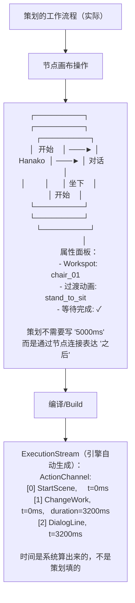
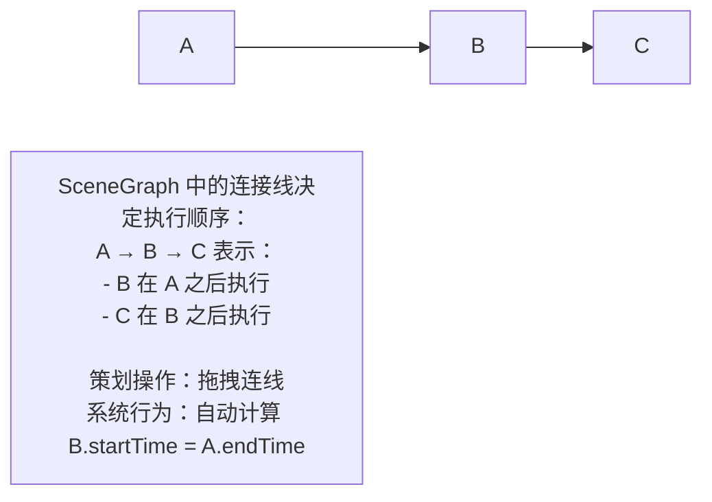
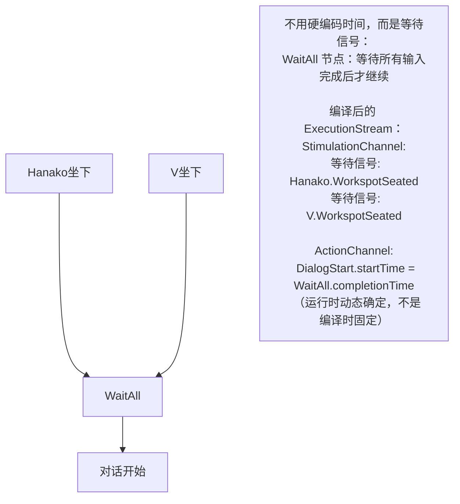
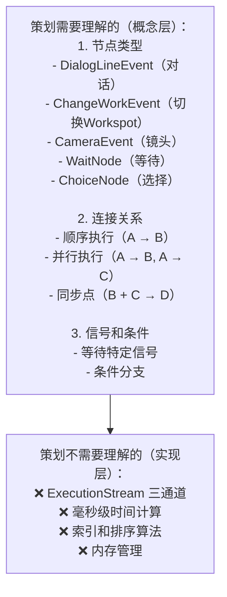
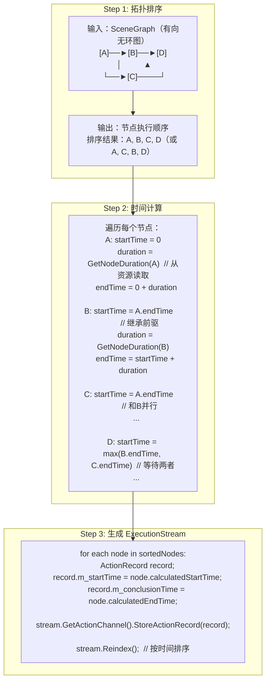
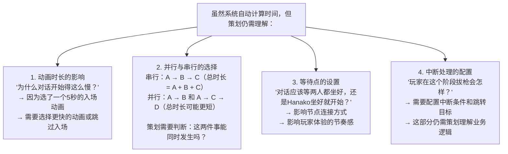
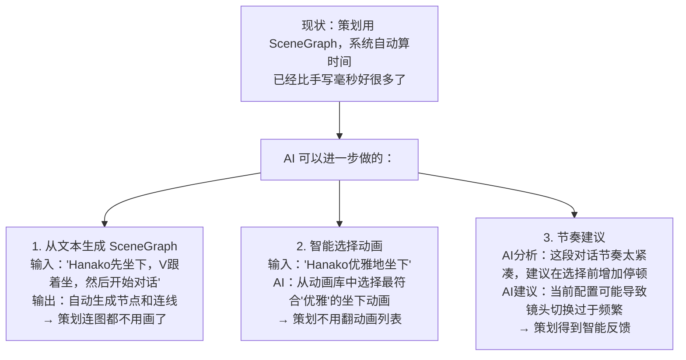

# 2077 时序计算的真实机制
## 一、不是手写毫秒，而是 SceneGraph "编译"出来的


## 二、时序来源的几种机制
根据代码分析，2077 的时序计算有以下几种来源：

### 1. 节点连接 = 顺序关系


### 2. 动画/资源元数据 = 时长来源
```cpp
// 系统从动画资源中读取时长
AnimationClip clip = LoadAnim("stand_to_sit");
Msec duration = clip.GetDuration();  // 3200ms

// ChangeWorkEvent 的时长不是策划填的
// 而是从引用的 Workspot 和动画中读取的
```

```mermaid
note["策划看到的：
┌─────────────────────────────────────┐
│  ChangeWorkEvent                    │
│  ├── Workspot: restaurant_chair     │
│  ├── 入场动画: walk_to_chair        │  ← 时长自动读取
│  ├── 过渡动画: stand_to_sit         │  ← 时长自动读取
│  └── [系统计算] 总时长: 5.2秒       │
└─────────────────────────────────────┘"]
```

### 3. 信号等待 = 同步点


### 4. 手动时间偏移 = 微调
```mermaid
note["策划确实可以手动调整，但是作为'偏移'而不是'绝对时间'：
┌─────────────────────────────────────┐
│  DialogLineEvent                    │
│  ├── 说话人: Hanako                 │
│  ├── 台词: "你好，V"                │
│  ├── 延迟开始: +0.5秒               │  ← 这是手动微调
│  └── 提前结束: -0.2秒               │  ← 这也是微调
└─────────────────────────────────────┘

系统计算：
  baseTime = 前一个节点的结束时间
  actualStart = baseTime + 500ms（延迟）
  duration = 语音文件时长 - 200ms（提前结束）"]
```

## 三、策划真正需要理解的是什么？


## 四、SceneGraph 到 ExecutionStream 的编译过程


## 五、策划实际的工作界面

```mermaid
flowchart TD
    A["Scene Editor（场景编辑器）"] --> B["┌─────────────────────────────────────────────────────────┐
│                    节点画布                              │
│                                                          │
│   ┌──────┐     ┌──────────┐     ┌──────────┐            │
│   │ 开始 │────►│ Hanako   │────►│ 对话     │            │
│   └──────┘     │ ChangeWork│     │ Section1 │            │
│                └──────────┘     └────┬─────┘            │
│                      │               │                   │
│                      │          ┌────▼─────┐            │
│                      │          │ 选择节点 │            │
│                      │          └────┬─────┘            │
│                      │         ┌─────┼─────┐            │
│                      │         ▼     ▼     ▼            │
│                      │      [选项A][选项B][选项C]       │
│                                                          │
└─────────────────────────────────────────────────────────┘"]
    A --> C["┌─────────────────────────────────────────────────────────┐
│                    属性面板                              │
│  选中节点: Hanako ChangeWork                             │
│  ┌────────────────────────────────────────────────────┐  │
│  │  Performer:     [Hanako        ▼]                   │  │
│  │  Workspot:      [restaurant_chair_01 ▼]             │  │
│  │  Transition:    [stand_to_sit  ▼]                   │  │
│  │                                                     │  │
│  │  ☑ 等待完成后继续                                   │  │
│  │  延迟开始:  [0.0] 秒                                 │  │
│  │                                                     │  │
│  │  [预计时长: 3.2秒]  ← 系统自动计算并显示             │  │
│  └────────────────────────────────────────────────────┘  │
└─────────────────────────────────────────────────────────┘"]
    A --> D["┌─────────────────────────────────────────────────────────┐
│                    时间轴预览                            │
│  0s    1s    2s    3s    4s    5s    6s    7s    8s      │
│  ├─────┼─────┼─────┼─────┼─────┼─────┼─────┼─────┤      │
│  │████████████████│                                      │
│  │  Hanako坐下    │                                      │
│  │                │████████████████████████│             │
│  │                │     对话 Section1      │             │
│                                                          │
│  ← 这个时间轴是自动生成的预览，策划不需要手动排          │
└─────────────────────────────────────────────────────────┘"]
```


## 六、但策划仍然需要理解的"隐性知识"


## 七、总结：2077 时序计算的分层
```mermaid
flowchart TD
    subgraph 策划层（SceneGraph）
        A["- 拖拽节点
- 连接关系
- 选择动画/Workspot
- 配置等待条件
- 微调延迟（可选）"]
    end
    subgraph 编译层（SceneGraph → ExecutionStream）
        B["- 拓扑排序
- 时间计算（从资源元数据）
- 依赖分析
- 生成 ActionRecord"]
    end
    subgraph 执行层（ExecutionStream）
        C["- 按时间触发动作
- 处理信号
- 处理中断"]
    end
    A -->|不需要理解| B
    B -->|自动完成| C
    D["答案：策划不需要手写毫秒，但需要理解逻辑关系
时序是从 SceneGraph 结构 + 资源元数据 编译出来的"]
```

## 八、AI 可以进一步简化什么？


### 核心结论
2077 的时序主要靠 SceneGraph 拓扑结构 + 资源元数据自动计算，策划需要理解的是"逻辑关系"而不是"具体毫秒"。这已经是一个相当成熟的抽象层，AI 能进一步简化的是"连图都不用画，用自然语言描述即可"。

### 总结
1. 2077 中策划无需手写毫秒级时间，而是通过 SceneGraph 节点连接表达逻辑关系，系统自动编译生成时序数据；
2. 时序的核心来源包括节点连接关系、动画/资源元数据、信号同步点，手动调整仅作为微调手段；
3. AI 优化的核心方向不是替代现有编译逻辑，而是进一步降低策划的操作成本（文本生成节点、智能选动画、节奏建议）。