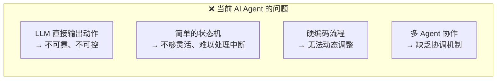
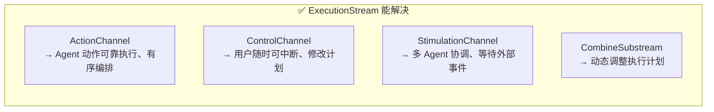
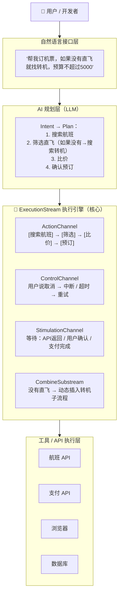
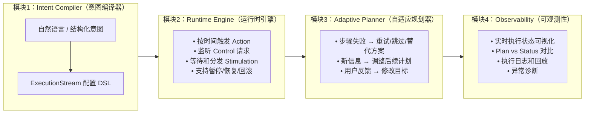
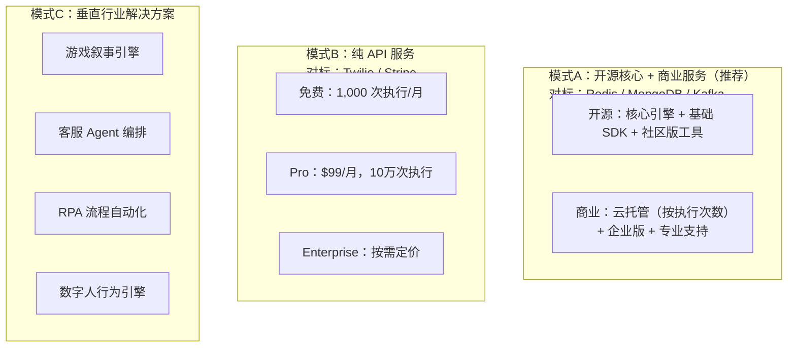
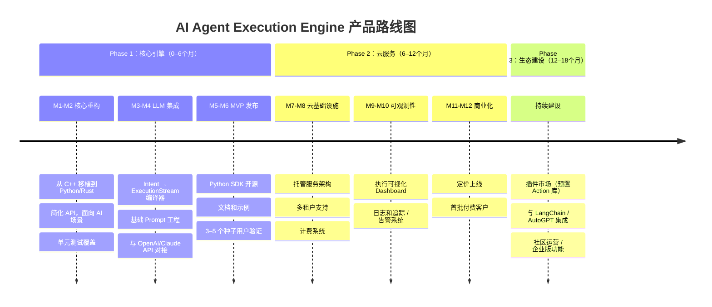
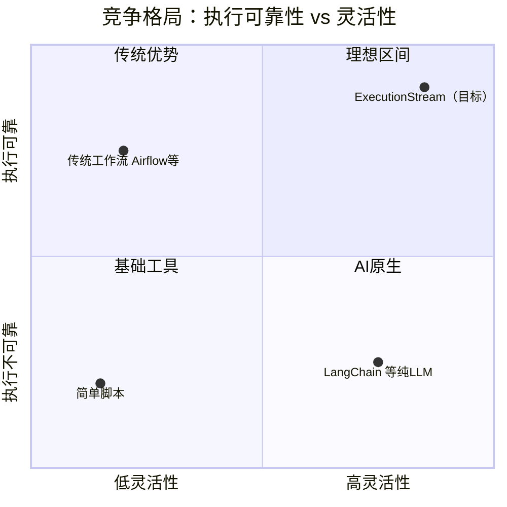
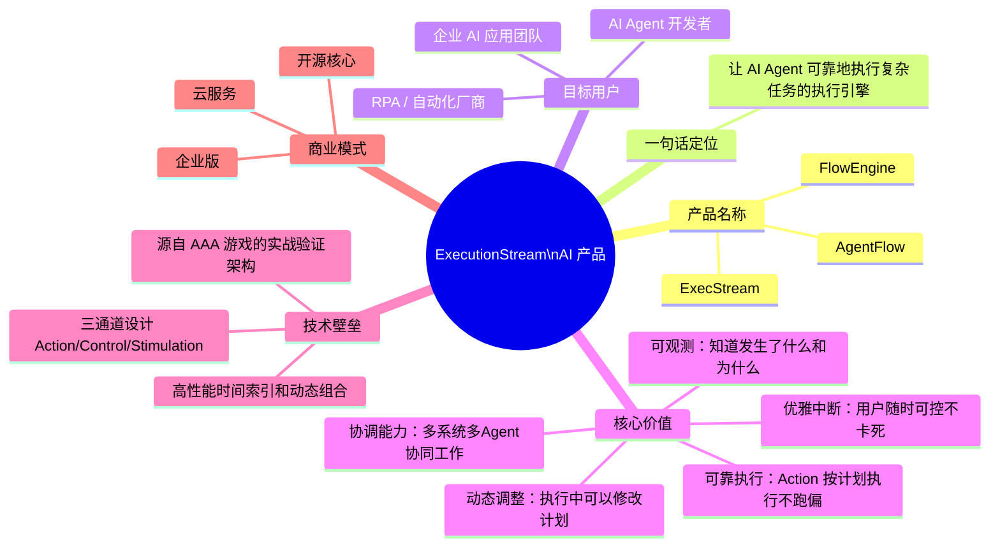

# ExecutionStream AI 产品化路线分析

---

## 一、核心能力提炼

> **一句话定位：让 AI 能够编排复杂的、可中断的、多系统协作的时序流程**

| 技术特性 | 产品化表达 |
|---|---|
| ActionChannel（时间排序的事件流） | "让复杂的事情按正确顺序发生" |
| ControlChannel（中断处理机制） | "随时可以优雅地改变计划" |
| StimulationChannel（信号协调机制） | "让不同的人/系统协同工作" |
| CombineSubstream（动态组合） | "像乐高一样拼装内容" |
| Plan/Status 分离（可追溯性） | "计划可以调整，执行有记录" |

---

## 二、AI 产品定位选择

```mermaid
quadrantChart
    title 四种可能的 AI 产品定位
    x-axis 通用 --> 垂直
    y-axis 工具 --> 平台
    quadrant-1 垂直平台
    quadrant-2 通用平台
    quadrant-3 通用工具
    quadrant-4 垂直工具
    AI叙事引擎 (Narrative AI): [0.8, 0.3]
    AI编排中间件 (Orchestration): [0.2, 0.7]
    AI Agent 框架 (Agent Runtime): [0.25, 0.35]
    数字人行为引擎: [0.85, 0.65]
```

| 定位 | 目标市场 | 核心卖点 |
|---|---|---|
| **A. AI 叙事引擎** | 游戏 / 影视 | 讲故事 |
| **B. AI 编排中间件** | 通用工作流 | 自动化 |
| **C. AI Agent 框架** | AI 开发者 | 可靠执行 |
| **D. 数字人行为引擎** | 虚拟人厂商 | 自然表演 |

---

## 三、推荐定位：AI Agent 执行引擎

### 当前 AI Agent 的痛点



### ExecutionStream 的解法



### 市场时机

2024–2026 是 AI Agent 爆发期（OpenAI GPTs、Claude Computer Use、Microsoft Copilot、AutoGPT 等），但所有方案都缺乏**可靠的执行层**——这正是 ExecutionStream 的空白地带。

---

## 四、产品架构设计



---

## 五、产品功能模块



### 模块说明

**Intent Compiler** 将自然语言转译为结构化执行计划，例如：

```
"预订明天北京到上海的机票"
        ↓
ExecutionStream {
    actions: [SearchFlight, FilterResult, Book],
    controls: [UserCancel, Timeout(30s)],
    stimulations: [WaitForAPI, WaitForConfirm]
}
```

**Runtime Engine** 是改造后的 ExecutionStream 核心，负责可靠执行。**Adaptive Planner** 通过 LLM + CombineSubstream 实现运行时动态调整。**Observability** 基于 ExecutionStream 的 Plan/Status 分离天然支持全程可追踪。

---

## 六、商业模式设计



**推荐采用模式A**，通过开源建立生态和信任，商业云服务变现。

---

## 七、产品路线图（18个月）



### 阶段交付物

| 阶段 | 时间 | 关键交付物 |
|---|---|---|
| Phase 1 | 0–6 月 | 开源 SDK、基础文档、Demo 应用 |
| Phase 2 | 6–12 月 | 云服务上线、付费订阅、10+ 付费客户 |
| Phase 3 | 12–18 月 | 100+ GitHub Stars、50+ 付费客户、主流框架集成 |

---

## 八、竞争定位



### 差异化优势

| 竞争对象 | 他们的局限 | 我们的优势 |
|---|---|---|
| LangChain / AutoGPT | LLM 直接决定下一步，不可预测 | LLM 生成计划，ExecutionStream 可靠执行 |
| Airflow / Temporal | 静态工作流，难以动态调整 | CombineSubstream 支持运行时动态组合 |
| 简单脚本 | 无法处理中断、协调、重试 | ControlChannel + StimulationChannel 原生支持 |

---

## 九、产品定位一页纸



> **市场机会**：AI Agent 执行层的空白地带。LLM 提供智慧，ExecutionStream 提供可靠性——两者缺一不可。