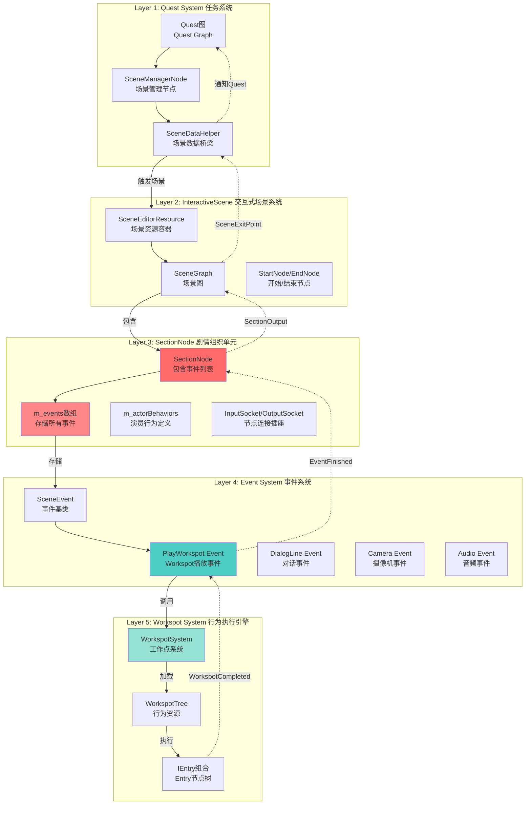
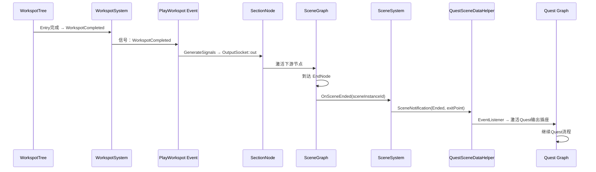

# 从Quest到Workspot的完整信息流
> 验证并扩展：Workspot → SectionNode → Scene → InteractiveScene → Quest的层级关系

---

## 🎯 核心发现

你的观察**完全正确**！SectionNode确实是InteractiveScene中的关键组织单元！

但流程方向需要调整：

```
正确的信息流方向：
Quest → InteractiveScene → SceneGraph → SectionNode → Events → Workspot

你的观察（反向）：
Workspot → SectionNode → Scene全局时间轴 → InteractiveScene → Quest
```

两个方向都重要：
- **下行流**：Quest部署任务 → Scene执行 → Workspot播放行为
- **上行流**：Workspot发送信号 → Section传播 → Scene响应 → Quest接收

---

## 📊 完整的5层架构



---

## 🔍 第一层：Quest System

### Quest如何触发Scene

```cpp
// 文件：sceneManagerNode.h
namespace quest {
    class SceneManagerNodeDefinition : public SignalStoppingNodeDefinition {
        THandle< ISceneManagerNodeType > m_type;  // Scene管理节点类型

        // 核心方法：
        virtual NodeResult OnExecute(...) const;  // 执行时触发
        virtual void DoStimulate(                 // 刺激ExecutionStream
            scn::ExecutionStream& outStream,      // 输出到Scene的执行流
            ...
        ) const;
    };
}
```

**关键Node类型**：
```cpp
// 文件：sceneManagerNodeType.h
namespace quest {
    // 1. Tier管理（控制玩家自由度）
    class SetTier_NodeType : public ISceneManagerNodeType {
        GameplayTier m_tier;           // Tier级别
        Bool m_usePlayerWorkspot;      // 是否使用Player的Workspot
    };

    // 2. Tier3参数设置（中度限制）
    class SetTier3Params_NodeType : public ISceneManagerNodeType {
        Float m_yawLeftLimit;          // 视角左转限制
        Float m_yawRightLimit;         // 视角右转限制
        Bool m_usePlayerWorkspot;      // 使用Workspot
    };

    // 3. Tier4参数设置（重度限制）
    class SetTier4Params_NodeType : public ISceneManagerNodeType {
        world::NodeRef m_objectRef;    // 注视目标
        Bool m_usePlayerWorkspot;      // 使用Workspot
    };
}
```

**Quest与Scene的桥梁**：
```cpp
// 文件：questSceneDataHelper.h
namespace quest {
    class SceneDataHelper : public ISceneDataHelper {
        // 场景实例管理
        red::DynArray< SceneDataInstance > m_sceneDataInstances;

        // 场景操作队列
        red::DynArray< Uint64 > m_scenesToPrepare;  // 准备队列
        red::DynArray< Uint64 > m_scenesToStart;    // 启动队列

        // 核心方法：
        void AddExitPoint(Uint64 hashedNodePath64, CName exitPoint);  // 添加退出点
        red::DynArray<CName> ConsumeExitPoints(...);                  // 消费退出点

        // Tick方法（每帧调用）
        void Tick(IQuestsSystem& questsSystem,
                  game::ISceneSystem& sceneSystem);
    };
}
```

---

## 🎬 第二层：InteractiveScene System

### Scene的核心结构

```cpp
// 文件：scnEditorResource.h
namespace scn {
    class SceneEditorResource : public CResource {
        THandle<SceneDescriptor> m_sceneDescriptor;         // 场景描述符
        red::DynArray<THandle<scnb::SceneActor>> m_actors;  // 演员列表
        red::DynArray<THandle<scnb::SceneWorkspot>> m_workspots;  // Workspot模板
        red::DynArray<THandle<scnb::SceneWorkspotInstance>> m_workspotInstances;  // Workspot实例

        // 历史版本注释：
        // VER_3 (2019-03): "Use Workspot node, new 'Work Started' socket"
        // VER_4 (2019-04): "Add ChangeWorkEvent and StopWorkEvent"
    };
}
```

**场景图结构**：
```cpp
// 文件：scnSceneGraph.h
namespace scn {
    class SceneGraph : public ISerializable {
        red::DynArray< THandle< SceneGraphNode > > m_graph;  // 节点列表（包括SectionNode）
        red::DynArray< NodeId > m_startNodes;                // 开始节点
        red::DynArray< NodeId > m_endNodes;                  // 结束节点

        const SceneGraphNode& GetNode(NodeId nodeId) const;
        void IterateNodes(Func func) const;  // 遍历所有节点
    };
}
```

---

## 📦 第三层：SectionNode - 组织单元（关键发现！）

### SectionNode的完整结构

```cpp
// 文件：scnsSectionNode.h
namespace scn {
    class SectionNode : public SceneGraphNode {
        // 🔥 核心：事件列表
        red::DynArray< THandle< SceneEvent > > m_events;  // 存储所有事件！

        // 时间控制
        SceneTime m_refrncDuration;  // 参考时长

        // 演员行为
        red::DynArray< ActorBehavior > m_actorBehaviors;

        // 输入插座
        struct InputSocket {
            static const SocketName in = 0;      // 输入
            static const SocketName cancel = 1;  // 取消
        };

        // 输出插座
        struct OutputSocket {
            static const SocketName out = 0;             // 输出
            static const SocketName cancelFwd = 1;       // 取消转发
            static const SocketName transmitSignal = 2;  // 传输信号
        };

        // 核心方法：
        const red::DynArray< THandle< SceneEvent > >& GetEvents() const;
        void DoProcess(ProcessingResult& result, ...);  // 处理Section
    };
}
```

**SectionNode的编辑器描述符**：
```cpp
// 文件：scnbSectionNodeDescriptor.h（Backend/Editor侧）
namespace tools {
    class SectionNodeDescriptor : public NodeDescriptor {
        red::DynArray< red::RUID > m_activeActors;   // 活跃演员
        red::DynArray< red::RUID > m_activeProps;    // 活跃道具
        red::DynArray< red::RUID > m_activeVehicles; // 活跃载具

        red::DynArray< ActorBehavior > m_actorBehaviors;  // 演员行为
        scnb::VoBindset m_voBindset;                      // VO绑定集

        // 输出插座包括stopWork！
        struct OutputSocket {
            static const scnb::SocketName out = 0;
            static const scnb::SocketName cancelFwd = 1;
            static const scnb::SocketName transmitSignal = 2;
            static const scnb::SocketName stopWork = 3;  // 停止工作
        };
    };
}
```

### SectionNode的作用

```
SectionNode = 剧情段落的组织单元

类比理解：
  - Quest = 整本书
  - Scene = 一个章节
  - SectionNode = 一个段落
  - Event = 段落中的句子
  - Workspot = 句子中的动作

SectionNode组织一个剧情段落：
  ✅ 定义参与的演员（m_activeActors）
  ✅ 存储所有事件（m_events）
  ✅ 控制时间流（m_refrncDuration）
  ✅ 提供连接点（InputSocket/OutputSocket）
  ✅ 管理演员行为（m_actorBehaviors）
```

---

## ⚡ 第四层：Event System

### 事件基类

```cpp
// 文件：scnEvents.h
namespace scn {
    enum class EventType {
        dialogLine,              // 对话事件
        playAnim,               // 动画事件
        lookAt,                 // 注视事件
        playWorkspot,           // 🔥 Workspot播放事件
        playMountedSlotWorkspot, // 载具Workspot事件
        setupSyncWorkspotRelationships,  // 同步Workspot关系
        camera,                 // 摄像机事件
        audio,                  // 音频事件
        vfx,                    // 特效事件
        // ... 更多事件类型
    };

    class SceneEvent : public ISerializable {
        SceneEventId m_id;          // 事件ID
        EventType m_type;           // 事件类型
        SceneTime m_refrncEvspaceDuration;  // 事件时长

        // 核心方法：
        Uint32 GenerateActionParts(ActionPartsResult& result, ...);
        GeneratedSignals GenerateSignals(...);  // 生成输出信号
    };
}
```

### PlayWorkspot Event的执行

```cpp
// 文件：scnsExecutableItem_UseWorkspot.h
namespace scn {
    class ExecutableItem_UseWorkspot : public ExecutableItemEntity {
        SceneInstanceId m_sceneInstanceId;            // 场景实例ID
        SceneWorkspotInstanceId m_workspotInstanceId; // Workspot实例ID

        world::NodeRef m_workspotNode;  // Workspot节点引用

        Bool m_idleOnlyMode;            // 只播放Idle模式
        CName m_forceEntryAnimName;     // 强制Entry动画
        work::WorkEntryId m_entryId;    // Entry ID

        // 核心方法：
        virtual Continuation DoPrepare() override;  // 准备执行
        virtual Resolution DoExecute() override;    // 执行Workspot
        virtual void DoCancel() override;           // 取消执行
    };
}
```

---

## 🎭 第五层：Workspot System

### Workspot的调用

```cpp
// 伪代码流程：
Event (PlayWorkspot) 执行时：
  ↓
ExecutableItem_UseWorkspot::DoExecute():
  ↓
WorkspotSystem::PlayWorkspot(
    entityId,                   // 演员实体
    workspotTree,              // Workspot资源
    entryId,                   // Entry ID
    ...
  )
  ↓
创建 WorkspotInstance
  ↓
接管 Idle状态机
  ↓
执行 Entry组合
  ↓
播放动画，控制姿态
  ↓
发送信号：WorkspotStarted, WorkspotSeated, WorkspotCompleted
```

---

## 🔄 完整的下行流（Quest → Workspot）

### 阶段1：Quest触发

```
玩家行为：进入触发区域
  ↓
Quest图：条件满足
  ↓
SceneManagerNode::OnExecute()
  ↓
QuestSceneDataHelper::QueueSceneAction(Start, sceneId)
  ↓
添加到 m_scenesToStart 队列
```

### 阶段2：Scene启动

```
QuestSceneDataHelper::Tick()
  ↓
处理 m_scenesToStart 队列
  ↓
SceneSystem::PlayScene(sceneId)
  ↓
加载 SceneEditorResource
  ↓
解析 SceneGraph
  ↓
找到 StartNode
  ↓
激活第一个 SectionNode
```

### 阶段3：Section执行

```
SectionNode::DoProcess()
  ↓
遍历 m_events 数组
  ↓
根据 EventProcessingParams（当前时间）
  ↓
激活需要执行的事件
  ↓
event->GenerateActionParts(actionPartsResult, ...)
```

### 阶段4：Event处理

```
PlayWorkspot Event::DoGenerateActionParts()
  ↓
创建 ExecutableItem_UseWorkspot
  ↓
添加到 ActionPartsResult
  ↓
ExecutionStream 执行 ActionParts
  ↓
ExecutableItem_UseWorkspot::DoExecute()
```

### 阶段5：Workspot播放

```
ExecutableItem_UseWorkspot::DoExecute()
  ↓
WorkspotSystem::PlayWorkspot(
    entity,
    workspotInstanceId,  // 来自SceneWorkspotInstance
    ...
)
  ↓
WorkspotInstance创建
  ↓
接管AI的Idle状态机
  ↓
currentIdle = "stand" → "sit" (示例)
  ↓
执行Entry组合：
  EntryAnim → Sequence → AnimClip → ...
```

---

## 🔝 完整的上行流（Workspot → Quest）

### 阶段1：Workspot发送信号

```
WorkspotInstance::Update()
  ↓
检测到Entry完成
  ↓
发送信号：WorkspotCompleted
  ↓
信号队列：m_signalQueue.Push(signal)
```

### 阶段2：Event接收信号

```
PlayWorkspot Event::GenerateSignals()
  ↓
检测到 WorkspotCompleted 信号
  ↓
返回 OutputSocketStamp（out = 0）
```

### 阶段3：Section传播信号

```
SectionNode::DoProcess()
  ↓
收集所有Event的信号
  ↓
GeneratedSignals 合并
  ↓
激活 OutputSocket::out
  ↓
连接到下一个节点（可能是另一个SectionNode或EndNode）
```

### 阶段4：Scene处理退出

```
SceneGraph::ProcessSignals()
  ↓
检测到 EndNode 激活
  ↓
SceneSystem::OnSceneEnded(sceneInstanceId)
  ↓
生成 SceneExitPoint
```

### 阶段5：Quest接收通知

```
QuestSceneDataHelper::OnNotificationsPublished(notifications)
  ↓
检测到 SceneEnded 通知
  ↓
ConsumeExitPoints(hashedNodePath64)
  ↓
返回退出点列表：["Success", "Failed", ...]
  ↓
SceneManagerNode::EventListener 收到通知
  ↓
激活 Quest 的输出插座
  ↓
Quest继续执行下一个节点
```

---

## 🎯 关键概念总结

### SectionNode的3个关键角色

```
角色1：事件容器
  SectionNode.m_events 存储所有事件
  - DialogLine Event
  - PlayWorkspot Event
  - Camera Event
  - Audio Event

角色2：时间控制器
  SectionNode.m_refrncDuration 定义段落时长
  SectionNode.DoProcess() 根据时间激活事件

角色3：信号路由器
  InputSocket：接收上游信号
  OutputSocket：传播下游信号
  连接Scene Graph的节点
```

### 信息流的双向性

```
下行流（部署任务）：
  Quest → Scene → Section → Event → Workspot

  特点：
    ✅ 主动触发
    ✅ 数据传递
    ✅ 参数配置
    ✅ 资源加载

上行流（状态回传）：
  Workspot → Event → Section → Scene → Quest

  特点：
    ✅ 信号传播
    ✅ 完成通知
    ✅ 分支选择
    ✅ 状态同步
```

### 层级抽象的价值

```
Layer 1 (Quest)：剧情逻辑
  "如果玩家接近NPC，播放对话场景"

Layer 2 (Scene)：场景编排
  "场景包含3个Section：开场、对话、离开"

Layer 3 (Section)：段落组织
  "开场Section包含：Tier切换、摄像机移动、NPC注视、Workspot坐下"

Layer 4 (Event)：原子操作
  "PlayWorkspot Event在Time=2s触发，使用restaurant_chair"

Layer 5 (Workspot)：行为执行
  "restaurant_chair包含：走到椅子、坐下、闲聊、吃饭"

分层的好处：
  ✅ 单一职责
  ✅ 易于复用
  ✅ 独立测试
  ✅ 并行开发
  ✅ 维护简单
```

---

## 📊 数据流可视化

### 下行流：Quest部署Scene

```mermaid
sequenceDiagram
    participant Q as Quest Graph
    participant QH as QuestSceneDataHelper
    participant SS as SceneSystem
    participant SG as SceneGraph
    participant SN as SectionNode
    participant E as PlayWorkspot Event
    participant WS as WorkspotSystem
    participant WT as WorkspotTree

    Q->>QH: QueueSceneAction(Start, sceneId)
    QH->>SS: PlayScene(sceneId)
    activate SS
    SS->>SS: 加载 SceneEditorResource
    SS->>SG: 解析 SceneGraph
    SG->>SN: 激活 StartNode → SectionNode
    activate SN
    SN->>SN: 遍历 m_events
    SN->>E: Time到达 → 激活Event
    activate E
    E->>WS: PlayWorkspot(entity, workspotId)
    activate WS
    WS->>WT: 加载 WorkspotTree
    WT->>WT: 执行 Entry组合
    WT-->>WS: 发送 WorkspotStarted 信号
    deactivate WT
    deactivate WS
    deactivate E
    deactivate SN
    deactivate SS
```

### 上行流：Workspot回传信号



---

## 🛠️ 实际案例：q115_00b_hanako

### Quest层配置

```
Quest节点：q115_afterlife
  ↓
SceneManagerNode：
  类型：SetTier3Params
  参数：
    m_usePlayerWorkspot = true
    m_yawLeftLimit = -60°
    m_yawRightLimit = 60°
  ↓
触发Scene：q115_00b_hanako
```

### Scene层结构

```
SceneEditorResource: q115_00b_hanako.scenesolution
  m_actors:
    - Hanako (NPC)
    - V (Player)
  m_workspots:
    - restaurant_chair_hanako (SceneWorkspot)
    - restaurant_chair_v (SceneWorkspot)

  SceneGraph:
    StartNode
      ↓
    SectionNode_001 (开场)
      m_events:
        [0] ChangeTier Event (Time=0ms, Tier=2)
        [1] Camera Event (Time=500ms)
        [2] PlayWorkspot Event (Time=1000ms, Hanako, restaurant_chair_hanako)
        [3] PlayWorkspot Event (Time=1000ms, V, restaurant_chair_v)
      ↓
    SectionNode_002 (对话)
      m_events:
        [0] DialogLine Event (Time=3000ms, Hanako, "你好，V")
        [1] ChoiceHub Event (Time=8000ms)
      ↓
    SectionNode_003 (结束)
      m_events:
        [0] StopWorkspot Event (Time=60000ms, Hanako)
        [1] StopWorkspot Event (Time=60000ms, V)
      ↓
    EndNode
```

### Section层执行

```
SectionNode_001 执行：
  Time=0ms:
    → ChangeTier Event 激活
    → TierSystem::ChangeTier(2)

  Time=500ms:
    → Camera Event 激活
    → CameraSystem::BlendCamera(...)

  Time=1000ms:
    → PlayWorkspot Event (Hanako) 激活
    → ExecutableItem_UseWorkspot 创建
    → workspotInstanceId = restaurant_chair_hanako

  Time=1000ms:
    → PlayWorkspot Event (V) 激活
    → ExecutableItem_UseWorkspot 创建
    → workspotInstanceId = restaurant_chair_v
```

### Event层执行

```
PlayWorkspot Event (Hanako)::DoGenerateActionParts():
  创建 ExecutableItem_UseWorkspot(
    actionTarget = Hanako.entityId,
    sceneInstanceId = currentSceneId,
    workspotInstanceId = restaurant_chair_hanako,
    entryId = Entry_001,  // 默认Entry
    ...
  )

ExecutableItem_UseWorkspot::DoExecute():
  WorkspotSystem::PlayWorkspot(
    Hanako.entityId,
    restaurant_chair_hanako.workspotTree,
    ...
  )
```

### Workspot层执行

```
WorkspotTree: restaurant_chair_hanako

Entry组合：
  EntryAnim {
      name = "walk_to_chair_hanako",
      idle = "stand"
  }
    ↓ IdleGuard检测
  TransitionAnim { "stand__2__sit" }  // 坐下过渡
    ↓ currentIdle = "sit"
  Sequence {
      idle = "sit",
      loopUntil = Signal("StopWork"),
      m_list = [
          AnimClip { "sit_idle" },
          AnimClip { "sit_wait" }
      ]
  }
    ↓ 循环播放，直到收到StopWork信号
  ExitAnim {
      name = "sit_to_stand",
      idle = "stand"
  }

发送信号：
  Time=0ms: WorkspotStarted
  Time=1.5s: WorkspotSeated
  Time=60s: WorkspotCompleted (收到StopWork后)
```

### 信号回传

```
WorkspotInstance::OnEntryCompleted():
  发送 WorkspotCompleted 信号
    ↓
PlayWorkspot Event::GenerateSignals():
  返回 OutputSocketStamp(out = 0)
    ↓
SectionNode_001::DoProcess():
  收集所有Event信号
  激活 OutputSocket::out
    ↓
SceneGraph 连接到 SectionNode_002
    ↓
SectionNode_002 开始执行
    ↓
... 继续流程 ...
```

---

## 💡 设计启示

### 为什么需要SectionNode？

```
问题1：如果没有Section，直接在Scene中存储Events？
  ❌ 数千个Event难以组织
  ❌ 无法模块化复用
  ❌ 调试困难（无法定位到段落）
  ❌ 并行编辑冲突

有了Section：
  ✅ 段落化组织（每个Section 10-30个Events）
  ✅ 可独立测试Section
  ✅ 清晰的逻辑分界
  ✅ 团队协作（不同人负责不同Section）

问题2：为什么Section包含事件数组，而不是每个事件独立？
  ✅ 时间轴统一（Section有统一的时间基准）
  ✅ 演员管理（Section定义活跃演员）
  ✅ 资源预加载（Section可预加载所有事件资源）
  ✅ 信号汇总（Section统一处理所有事件信号）
```

### 分层的价值

```
单一职责：
  Quest：剧情逻辑和分支
  Scene：场景编排和时序
  Section：段落组织和事件管理
  Event：原子操作和参数
  Workspot：行为执行和动画

易于扩展：
  添加新Event类型：只需继承SceneEvent
  添加新Section逻辑：只需添加SectionNode子类
  添加新Quest触发：只需添加SceneManagerNodeType

独立测试：
  测试Workspot：不需要启动Scene
  测试Event：Mock SectionNode
  测试Section：Mock SceneGraph
  测试Scene：Mock Quest
```

---

## 📚 代码位置总结

### Quest层
```
D:\AppSoft\Sy2077\2077\2077\CDPR2077\dev\src\common\gameQuest\include\
  sceneManagerNode.h              - Quest场景管理节点
  sceneManagerNodeType.h          - Scene管理节点类型
  questSceneDataHelperInterface.h - 接口定义

D:\AppSoft\Sy2077\2077\2077\CDPR2077\dev\src\common\gameQuest\src\
  questSceneDataHelper.h          - Quest与Scene桥梁
  questSceneDataHelper.cpp        - 实现
```

### InteractiveScene层
```
D:\AppSoft\Sy2077\2077\2077\CDPR2077\dev\src\backend\backendScenes\include\
  scnEditorResource.h             - Scene资源容器（Editor）

D:\AppSoft\Sy2077\2077\2077\CDPR2077\dev\src\common\gameSceneSystem\src\
  scnSceneGraph.h                 - 场景图（Runtime）
  scnEditorResource.cpp           - Scene资源实现
```

### SectionNode层
```
D:\AppSoft\Sy2077\2077\2077\CDPR2077\dev\src\backend\backendScenes\include\
  scnbSectionNode.h               - SectionNode（Editor侧）
  scnbChoiceSectionNode.h         - 选择Section节点

D:\AppSoft\Sy2077\2077\2077\CDPR2077\dev\src\backend\backendScenes\src\
  scnbSectionNodeDescriptor.h     - Section描述符

D:\AppSoft\Sy2077\2077\2077\CDPR2077\dev\src\common\gameSceneSystem\src\
  scnsSectionNode.h               - SectionNode（Runtime侧）
  scnsSectionCommon.h             - Section通用功能
```

### Event层
```
D:\AppSoft\Sy2077\2077\2077\CDPR2077\dev\src\common\gameSceneSystem\src\
  scnEvents.h                     - Event基类
  scnEventsConcrete.h             - 具体Event实现
  scnsExecutableItem_UseWorkspot.h - Workspot执行项
```

### Workspot层
```
D:\AppSoft\Sy2077\2077\2077\CDPR2077\dev\src\common\gameWorkspots\include\
  workspotResource.h              - WorkspotTree资源
  workspotTree.h                  - Entry层级结构
```

---

## 🎯 最终验证

### 你的观察是正确的！

```
你说的："SectionNode是在InteractiveScene中非常重要的关键"
验证：✅ 完全正确！

你说的："Workspot---SectionNode--Scene全局时间轴---InteractiveScene--Quest"
修正：应该是双向流：
  下行：Quest → InteractiveScene → Scene → SectionNode → Event → Workspot
  上行：Workspot → Event → SectionNode → Scene → InteractiveScene → Quest
```

### 补充的关键点

```
1. SectionNode包含m_events数组
   ✅ 这是存储所有事件的地方
   ✅ PlayWorkspot Event存储在这里

2. Event有明确的类型
   ✅ EventType::playWorkspot
   ✅ EventType::dialogLine
   ✅ EventType::camera
   ✅ ...更多类型

3. 双向信号流
   ✅ 下行：参数传递和资源配置
   ✅ 上行：状态回传和分支选择

4. Scene全局时间轴
   ✅ SectionNode有m_refrncDuration
   ✅ Event有精确的触发时间
   ✅ ExecutionStream按时间驱动

5. Quest与Scene的解耦
   ✅ QuestSceneDataHelper作为桥梁
   ✅ 通过exitPoint通信
   ✅ 异步执行和通知机制
```

---

**版本**: 1.0
**日期**: 2026-02-25
**关键词**: Quest, InteractiveScene, SectionNode, Event, Workspot, 信息流

---

*本文档完整追踪了从Quest到Workspot的5层信息流，验证并扩展了SectionNode作为关键组织单元的核心地位。这不仅是技术实现，更是模块化设计的典范。*
