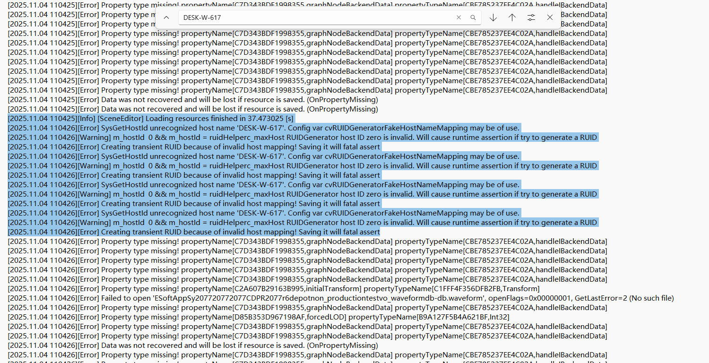
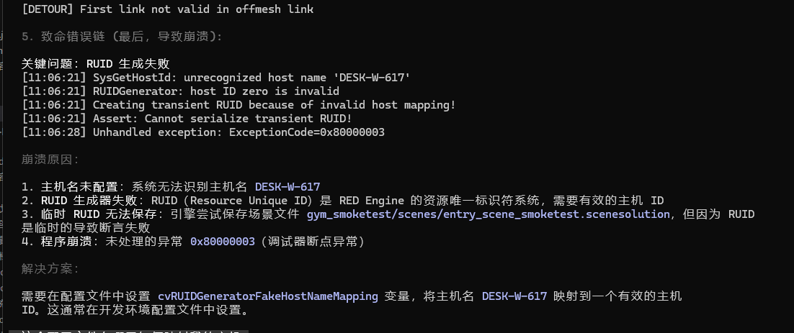
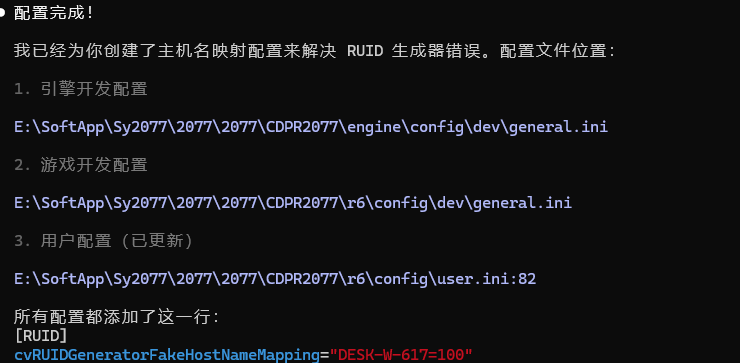

[2025.11.04 110425][Info] [SceneEditor] Loading resources finished in 37.473025 [s]
[2025.11.04 110426][Error] SysGetHostId unrecognized host name 'DESK-W-617'. Config var cvRUIDGeneratorFakeHostNameMapping may be of use.
[2025.11.04 110426][Warning] m_hostId  0 && m_hostId = ruidHelperc_maxHost RUIDGenerator host ID zero is invalid. Will cause runtime assertion if try to generate a RUID
[2025.11.04 110426][Error] Creating transient RUID because of invalid host mapping! Saving it will fatal assert
[2025.11.04 110426][Error] SysGetHostId unrecognized host name 'DESK-W-617'. Config var cvRUIDGeneratorFakeHostNameMapping may be of use.
[2025.11.04 110426][Warning] m_hostId  0 && m_hostId = ruidHelperc_maxHost RUIDGenerator host ID zero is invalid. Will cause runtime assertion if try to generate a RUID
[2025.11.04 110426][Error] Creating transient RUID because of invalid host mapping! Saving it will fatal assert
[2025.11.04 110426][Error] SysGetHostId unrecognized host name 'DESK-W-617'. Config var cvRUIDGeneratorFakeHostNameMapping may be of use.
[2025.11.04 110426][Warning] m_hostId  0 && m_hostId = ruidHelperc_maxHost RUIDGenerator host ID zero is invalid. Will cause runtime assertion if try to generate a RUID
[2025.11.04 110426][Error] Creating transient RUID because of invalid host mapping! Saving it will fatal assert
[2025.11.04 110426][Error] SysGetHostId unrecognized host name 'DESK-W-617'. Config var cvRUIDGeneratorFakeHostNameMapping may be of use.
[2025.11.04 110426][Warning] m_hostId  0 && m_hostId = ruidHelperc_maxHost RUIDGenerator host ID zero is invalid. Will cause runtime assertion if try to generate a RUID
[2025.11.04 110426][Error] Creating transient RUID because of invalid host mapping! Saving it will fatal assert

E:\SoftApp\Sy2077\2077\2077\CDPR2077\dev\src\common\engine\src\ruidGenerator.cpp

  | 项目    | 之前的错误配置                            | 正确配置                        | 来源
      |
  |-------|------------------------------------|-----------------------------|---------------------------|
  | 配置节名  | [General]                          | [Backend/RUIDGenerator]     | ruidGenerator.cpp:18      |
  | 变量名   | cvRUIDGeneratorFakeHostNameMapping | FakeHostNameMapping         | ruidGenerator.cpp:18      |
  | 格式    | "DESK-W-617=100"                   | "DESK-W-617:CDPRS-BUILD100" | ruidGenerator.cpp:221-226 |
  | 分隔符   | = (等号)                             | : (冒号)                      | ruidGenerator.cpp:221     |
  | 映射名前缀 | 无前缀                                | CDPRS-ID 或 CDPRS-BUILD      | ruidGenerator.cpp:240-262 |