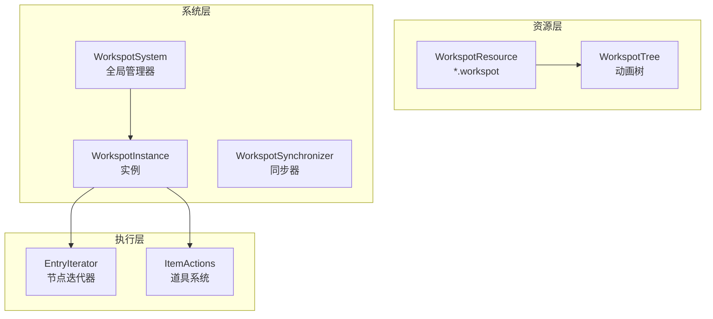
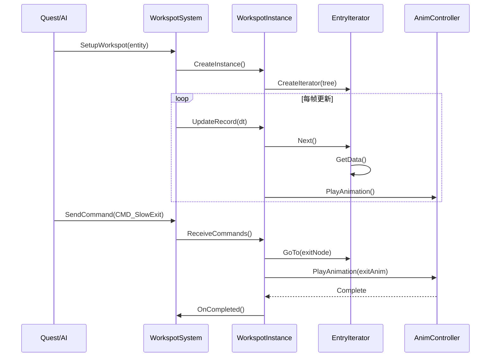
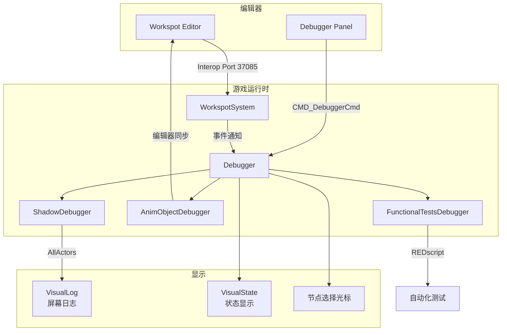
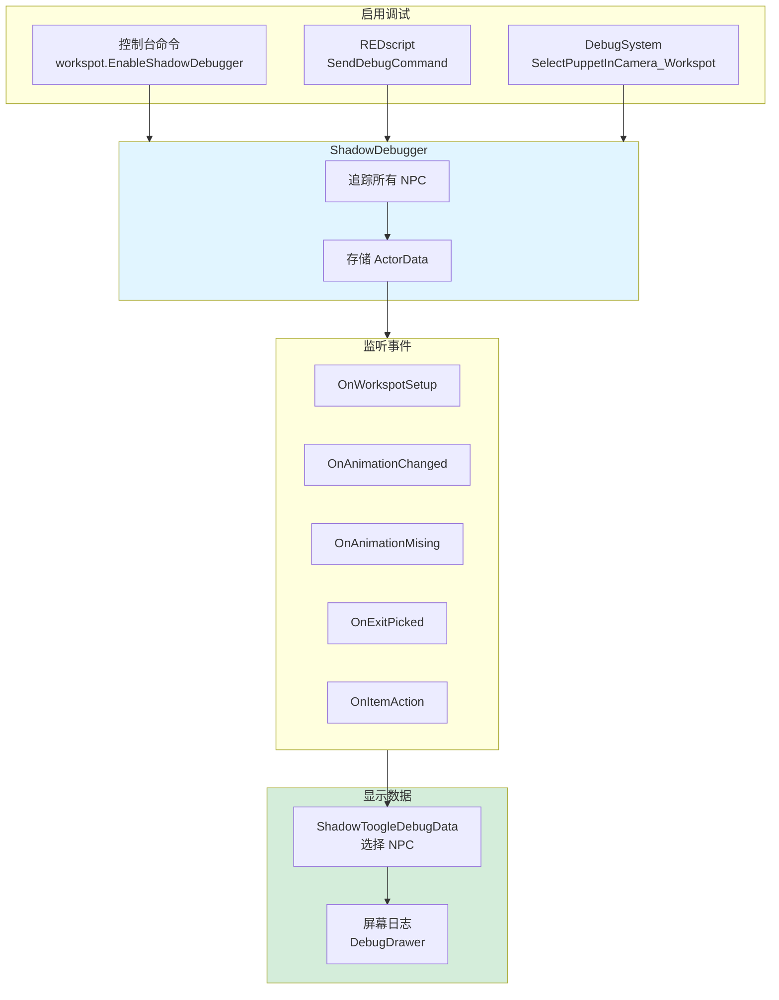
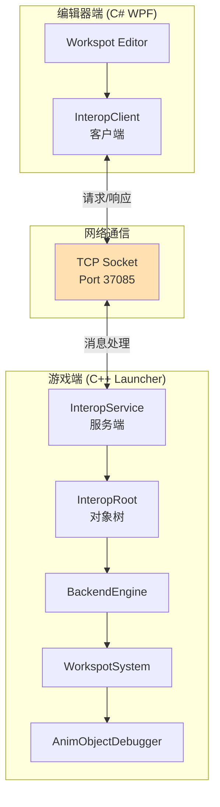
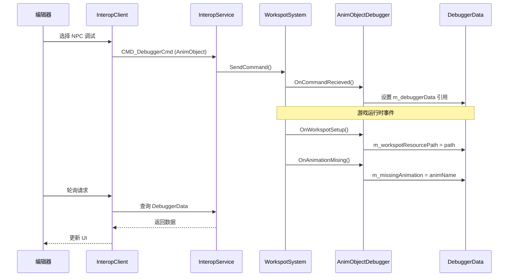
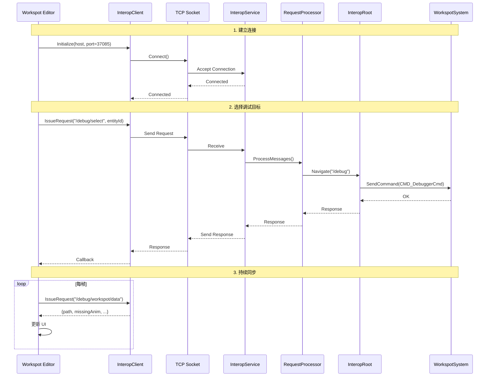

# Claude Conversation Log

Session ID: a1ef29d6-4b60-4e2f-8110-3e3b0b06d341
Date: 2026-01-16 06:03:26

---

## 👤 User

这是workspot编辑器，我想让你从这个编辑器出发结合代码详细介绍一下workspot系统，包括菜单功能、workspotTree、调试系统、系统设计、重要概念等 D:\Games\2077\CDPR2077\dev\src\common\gameWorkspots

---

## 👤 User

[Image: source: C:\Users\Windows\Desktop\temp\2077\workspotEditor.png]

---

## 🤖 Claude

我来分析这个workspot系统。首先让我探索代码库来了解其架构。

---

## 🤖 Claude

文档已生成。让我为你展示Workspot系统的核心内容。

---

## 🤖 Claude

我已完成对 Workspot 系统的全面分析。以下是基于你提供的编辑器截图和代码分析的详细介绍：

---

## Workspot 系统概述

Workspot 是 REDengine 中用于**交互式动画序列编排**的核心系统，用于处理角色坐下、开车、操作机器等复杂交互动画。

### 整体架构



---

## 编辑器界面解析（对应你的截图）

### 1. 菜单栏功能

从截图中可以看到的菜单：

| 菜单 | 功能 |
|------|------|
| **File/Edit/View** | 标准文件操作 |
| **Compilation** | 编译 workspot 资源 |
| **Debugger** | 调试功能（截图右上角的 Debugger 面板） |
| **Dangle** | 物理骨骼悬挂调试 |
| **Playback** | 动画预览播放控制 |
| **Settings** | 编辑器设置 |
| **Profiler** | 性能分析 |

### 2. Debugger 面板（截图右上角）

```
Debugger
├── Status          # 当前状态
├── Interop port: 37085  # 调试通信端口
└── Target: PC      # 目标平台
```

**代码位置**: `workspotDebugger.h/cpp`

### 3. Tools 标签页（截图中间右侧）

| 标签 | 功能 |
|------|------|
| **Animations** | 动画列表浏览 |
| **AnimInputs** | 动画输入参数 |
| **Validator output** | 验证器输出（检查错误） |
| **Anim wrappers** | 动画包装器 |
| **Debug objects** | 调试对象 |
| **Workspot tree** | 动画树结构视图（你截图展开的） |

### 4. Workspot Tree（核心结构）

从你的截图可以看到这个 workspot 是酒吧场景的坐姿动画：

```
Root sequence
├── Reaction Sequence: idle: <no_auto_transition> [BumpRightFront]
│   └── Sequence idle: sit_bar_2h_on_bar_01
│       └── Anim: sit_bar_2h_on_bar_01_bump_right
├── Reaction Sequence: idle: <no_auto_transition> [BumpLeftFront]
│   └── Sequence idle: sit_bar_2h_on_bar_01
│       └── Anim: sit_bar_2h_on_bar_01_bump_left
├── Entry anim: stand_2h_on_sides_01_to_sit_bar_2h_on_bar_01_turn225_01
├── Entry anim: stand_2h_on_sides_01_to_sit_bar_2h_on_bar_01_turn135_01
├── ...（多个 Entry 动画变体）
├── Reaction Sequence: [Fear]
│   ├── Anim: sit_bar_01_to_sit_bar_2h_up_01_turn0_01
│   └── Sequence idle: sit_bar_2h_up_01
│       └── Anim: sit_bar_2h_up_01
```

**节点类型解释**:

| 节点类型 | 图标 | 说明 |
|---------|------|------|
| **Root sequence** | 📁 | 根序列容器 |
| **Reaction Sequence** | ➡️📁 | 反应序列（响应 Bump/Fear 等事件） |
| **Sequence** | 📁 | 顺序序列 |
| **Anim** | 🟢 | 动画片段（AnimClip） |
| **Entry anim** | 🔴⚠️ | 进入动画（红色可能表示需要配置） |

### 5. 节点图（截图中间）

```
Output Node ──Out Pose──> Workspot Hub
```

这是 AnimGraph 的简化视图，显示 Workspot 输出连接到 Workspot Hub。

### 6. Properties 面板（截图右下角）

```
Global/Props/Properties
├── Workspot Rig: (No asset)           # 骨骼资源
├── Global Props: [globalProps] array<0>  # 全局道具
├── Dont Inject Workspot Graph         # 不注入动画图
├── Anim Graph Slot Name: WORKSPOT     # 动画图插槽
├── Auto Transition Blend Time: 1.0    # 自动过渡混合时间
├── Initial Actions: [initialActions] array<0>  # 初始动作
├── Blend Out Time: 0.0                # 混合退出时间
├── Entities Paths: [entitiesPaths] array<2>  # 实体路径
└── Animsets: [animsets] array<0>      # 动画集
```

**代码位置**: `workspotResource.h:323-528` (WorkspotTree 类)

### 7. Preview 面板（截图左下角）

显示角色预览：
- 实体：`base\characters\entities\citizen\_lowlife\...`
- 动画：`idle_stand (3.69 s)`
- **Foot IK Enabled** - 表示脚部 IK 系统已启用

---

## 核心类设计

### WorkspotTree（动画树）

**文件**: `workspotResource.h:323-528`

```cpp
class WorkspotTree : public ISerializable
{
    THandle<IEntry> m_rootEntry;                    // 根节点
    red::DynArray<WorkspotAnimsetEntry> m_finalAnimsets;  // 动画集
    red::DynArray<WorkspotGlobalProp> m_globalProps;      // 全局道具
    red::DynArray<THandle<IWorkspotItemAction>> m_initialActions;  // 初始动作
    Float m_blendOutTime;                           // 混合时间
    Float m_autoTransitionBlendTime;                // 自动过渡混合时间
    CName m_animGraphSlotName;                      // 动画图插槽名
};
```

### IEntry 节点基类

**文件**: `workspotResource.h:173-232`

```cpp
class IEntry : public ISerializable
{
    WorkEntryId m_id;      // 唯一 ID
    Uint32 m_flags;        // 标志位
    
    enum EntryFlags : Uint32
    {
        Animation        = RED_FLAG(1),   // 动画节点
        FastExit         = RED_FLAG(2),   // 快速退出
        SlowExit         = RED_FLAG(3),   // 慢速退出
        SlowEnter        = RED_FLAG(4),   // 慢速进入
        Pause            = RED_FLAG(5),   // 暂停
        Synchronized     = RED_FLAG(6),   // 同步
        TagNode          = RED_FLAG(7),   // 标签
        Reaction         = RED_FLAG(8),   // 反应
        LookAtDrivenTurn = RED_FLAG(9),   // 视线驱动转身
        HasItem          = RED_FLAG(13),  // 包含道具
        MotionAnim       = RED_FLAG(15),  // 带位移动画
        // ...
    };
    
    virtual EntryIterator* CreateIterator(...) const = 0;
};
```

---

## 节点类型速查

### 容器节点

| 节点 | 文件位置 | 功能 |
|------|---------|------|
| **Sequence** | `workspotTreeItems.h:324` | 顺序播放子节点 |
| **ReactionSequence** | `workspotTreeItems.h:345` | 响应外部事件的序列 |
| **ConditionalSequence** | `workspotTreeItems.h:384` | 条件分支序列 |
| **RandomList** | `workspotTreeItems.h:406` | 随机选择子节点 |
| **Selector** | `workspotTreeItems.h:430` | 单次随机选择 |

### 动画节点

| 节点 | 文件位置 | 功能 |
|------|---------|------|
| **AnimClip** | `workspotTreeItems.h:14` | 基本动画片段 |
| **MotionAnimClip** | `workspotTreeItems.h:39` | 带位移动画 |
| **SyncAnimClip** | `workspotTreeItems.h:89` | 同步动画 |
| **AnimClipWithItem** | `workspotTreeItems.h:113` | 带道具动画 |

### 进出节点

| 节点 | 文件位置 | 功能 |
|------|---------|------|
| **EntryAnim** | `workspotTreeItems.h:268` | 进入动画 |
| **ExitAnim** | `workspotTreeItems.h:164` | 慢速退出 |
| **FastExit** | `workspotTreeItems.h:133` | 快速退出（战斗） |

### 特殊节点

| 节点 | 文件位置 | 功能 |
|------|---------|------|
| **PauseClip** | `workspotTreeItems.h:225` | 暂停等待 |
| **TagNode** | `workspotTreeItems.h:248` | 跳转锚点 |
| **LookAtDrivenTurn** | `workspotTreeItems.h:57` | 视线驱动转身 |

---

## 命令系统

**文件**: `workspotSystem.h:40-73`

```cpp
enum WorkspotCommand
{
    CMD_Stop               = RED_FLAG(1),   // 停止
    CMD_Play               = RED_FLAG(3),   // 播放
    CMD_FastExit           = RED_FLAG(6),   // 快速退出
    CMD_SlowExit           = RED_FLAG(7),   // 慢速退出
    CMD_JumpToEntry        = RED_FLAG(9),   // 跳转到节点
    CMD_Pause              = RED_FLAG(10),  // 暂停
    CMD_Unpause            = RED_FLAG(11),  // 取消暂停
    CMD_ItemAction         = RED_FLAG(14),  // 道具动作
    CMD_DynamicSyncBind    = RED_FLAG(15),  // 动态同步绑定
    // ...
};
```

---

## 执行流程



---

## 生成的文档

我已在 `doc/gameWorkspots/` 目录生成完整文档：

| 文档 | 大小 | 内容 |
|------|------|------|
| [README.md](doc/gameWorkspots/README.md) | 9KB | 模块入口和导航 |
| [架构设计.md](doc/gameWorkspots/架构设计.md) | 44KB | 完整技术架构 |
| [WorkspotTree详解.md](doc/gameWorkspots/WorkspotTree详解.md) | 36KB | 动画树结构详解 |
| [节点类型速查表.md](doc/gameWorkspots/节点类型速查表.md) | 22KB | 所有节点类型参考 |

文档包含 25+ Mermaid 图表、详细代码示例和完整的文件索引（含行号）。

---

## 👤 User

这是workspot编辑器，我想让你从这个编辑器出发结合代码详细介绍一下workspot系统，包括菜单功能、workspotTree、调试系统、系统设计、重要概念等 D:\Games\2077\CDPR2077\dev\src\common\gameWorkspots

---

## 👤 User

[Image: source: C:\Users\Windows\Desktop\temp\2077\workspotEditor.png]

---

## 🤖 Claude

我来分析这个workspot系统。首先让我探索代码库来了解其架构。

---

## 🤖 Claude

文档已生成。让我为你展示Workspot系统的核心内容。

---

## 🤖 Claude

我已完成对 Workspot 系统的全面分析。以下是基于你提供的编辑器截图和代码分析的详细介绍：

---

## Workspot 系统概述

Workspot 是 REDengine 中用于**交互式动画序列编排**的核心系统，用于处理角色坐下、开车、操作机器等复杂交互动画。

### 整体架构


---

## 编辑器界面解析（对应你的截图）

### 1. 菜单栏功能

从截图中可以看到的菜单：

| 菜单 | 功能 |
|------|------|
| **File/Edit/View** | 标准文件操作 |
| **Compilation** | 编译 workspot 资源 |
| **Debugger** | 调试功能（截图右上角的 Debugger 面板） |
| **Dangle** | 物理骨骼悬挂调试 |
| **Playback** | 动画预览播放控制 |
| **Settings** | 编辑器设置 |
| **Profiler** | 性能分析 |

### 2. Debugger 面板（截图右上角）

```
Debugger
├── Status          # 当前状态
├── Interop port: 37085  # 调试通信端口
└── Target: PC      # 目标平台
```

**代码位置**: `workspotDebugger.h/cpp`

### 3. Tools 标签页（截图中间右侧）

| 标签 | 功能 |
|------|------|
| **Animations** | 动画列表浏览 |
| **AnimInputs** | 动画输入参数 |
| **Validator output** | 验证器输出（检查错误） |
| **Anim wrappers** | 动画包装器 |
| **Debug objects** | 调试对象 |
| **Workspot tree** | 动画树结构视图（你截图展开的） |

### 4. Workspot Tree（核心结构）

从你的截图可以看到这个 workspot 是酒吧场景的坐姿动画：

```
Root sequence
├── Reaction Sequence: idle: <no_auto_transition> [BumpRightFront]
│   └── Sequence idle: sit_bar_2h_on_bar_01
│       └── Anim: sit_bar_2h_on_bar_01_bump_right
├── Reaction Sequence: idle: <no_auto_transition> [BumpLeftFront]
│   └── Sequence idle: sit_bar_2h_on_bar_01
│       └── Anim: sit_bar_2h_on_bar_01_bump_left
├── Entry anim: stand_2h_on_sides_01_to_sit_bar_2h_on_bar_01_turn225_01
├── Entry anim: stand_2h_on_sides_01_to_sit_bar_2h_on_bar_01_turn135_01
├── ...（多个 Entry 动画变体）
├── Reaction Sequence: [Fear]
│   ├── Anim: sit_bar_01_to_sit_bar_2h_up_01_turn0_01
│   └── Sequence idle: sit_bar_2h_up_01
│       └── Anim: sit_bar_2h_up_01
```

**节点类型解释**:

| 节点类型 | 图标 | 说明 |
|---------|------|------|
| **Root sequence** | 📁 | 根序列容器 |
| **Reaction Sequence** | ➡️📁 | 反应序列（响应 Bump/Fear 等事件） |
| **Sequence** | 📁 | 顺序序列 |
| **Anim** | 🟢 | 动画片段（AnimClip） |
| **Entry anim** | 🔴⚠️ | 进入动画（红色可能表示需要配置） |

### 5. 节点图（截图中间）

```
Output Node ──Out Pose──> Workspot Hub
```

这是 AnimGraph 的简化视图，显示 Workspot 输出连接到 Workspot Hub。

### 6. Properties 面板（截图右下角）

```
Global/Props/Properties
├── Workspot Rig: (No asset)           # 骨骼资源
├── Global Props: [globalProps] array<0>  # 全局道具
├── Dont Inject Workspot Graph         # 不注入动画图
├── Anim Graph Slot Name: WORKSPOT     # 动画图插槽
├── Auto Transition Blend Time: 1.0    # 自动过渡混合时间
├── Initial Actions: [initialActions] array<0>  # 初始动作
├── Blend Out Time: 0.0                # 混合退出时间
├── Entities Paths: [entitiesPaths] array<2>  # 实体路径
└── Animsets: [animsets] array<0>      # 动画集
```

**代码位置**: `workspotResource.h:323-528` (WorkspotTree 类)

### 7. Preview 面板（截图左下角）

显示角色预览：
- 实体：`base\characters\entities\citizen\_lowlife\...`
- 动画：`idle_stand (3.69 s)`
- **Foot IK Enabled** - 表示脚部 IK 系统已启用

---

## 核心类设计

### WorkspotTree（动画树）

**文件**: `workspotResource.h:323-528`

```cpp
class WorkspotTree : public ISerializable
{
    THandle<IEntry> m_rootEntry;                    // 根节点
    red::DynArray<WorkspotAnimsetEntry> m_finalAnimsets;  // 动画集
    red::DynArray<WorkspotGlobalProp> m_globalProps;      // 全局道具
    red::DynArray<THandle<IWorkspotItemAction>> m_initialActions;  // 初始动作
    Float m_blendOutTime;                           // 混合时间
    Float m_autoTransitionBlendTime;                // 自动过渡混合时间
    CName m_animGraphSlotName;                      // 动画图插槽名
};
```

### IEntry 节点基类

**文件**: `workspotResource.h:173-232`

```cpp
class IEntry : public ISerializable
{
    WorkEntryId m_id;      // 唯一 ID
    Uint32 m_flags;        // 标志位
    
    enum EntryFlags : Uint32
    {
        Animation        = RED_FLAG(1),   // 动画节点
        FastExit         = RED_FLAG(2),   // 快速退出
        SlowExit         = RED_FLAG(3),   // 慢速退出
        SlowEnter        = RED_FLAG(4),   // 慢速进入
        Pause            = RED_FLAG(5),   // 暂停
        Synchronized     = RED_FLAG(6),   // 同步
        TagNode          = RED_FLAG(7),   // 标签
        Reaction         = RED_FLAG(8),   // 反应
        LookAtDrivenTurn = RED_FLAG(9),   // 视线驱动转身
        HasItem          = RED_FLAG(13),  // 包含道具
        MotionAnim       = RED_FLAG(15),  // 带位移动画
        // ...
    };
    
    virtual EntryIterator* CreateIterator(...) const = 0;
};
```

---

## 节点类型速查

### 容器节点

| 节点 | 文件位置 | 功能 |
|------|---------|------|
| **Sequence** | `workspotTreeItems.h:324` | 顺序播放子节点 |
| **ReactionSequence** | `workspotTreeItems.h:345` | 响应外部事件的序列 |
| **ConditionalSequence** | `workspotTreeItems.h:384` | 条件分支序列 |
| **RandomList** | `workspotTreeItems.h:406` | 随机选择子节点 |
| **Selector** | `workspotTreeItems.h:430` | 单次随机选择 |

### 动画节点

| 节点 | 文件位置 | 功能 |
|------|---------|------|
| **AnimClip** | `workspotTreeItems.h:14` | 基本动画片段 |
| **MotionAnimClip** | `workspotTreeItems.h:39` | 带位移动画 |
| **SyncAnimClip** | `workspotTreeItems.h:89` | 同步动画 |
| **AnimClipWithItem** | `workspotTreeItems.h:113` | 带道具动画 |

### 进出节点

| 节点 | 文件位置 | 功能 |
|------|---------|------|
| **EntryAnim** | `workspotTreeItems.h:268` | 进入动画 |
| **ExitAnim** | `workspotTreeItems.h:164` | 慢速退出 |
| **FastExit** | `workspotTreeItems.h:133` | 快速退出（战斗） |

### 特殊节点

| 节点 | 文件位置 | 功能 |
|------|---------|------|
| **PauseClip** | `workspotTreeItems.h:225` | 暂停等待 |
| **TagNode** | `workspotTreeItems.h:248` | 跳转锚点 |
| **LookAtDrivenTurn** | `workspotTreeItems.h:57` | 视线驱动转身 |

---

## 命令系统

**文件**: `workspotSystem.h:40-73`

```cpp
enum WorkspotCommand
{
    CMD_Stop               = RED_FLAG(1),   // 停止
    CMD_Play               = RED_FLAG(3),   // 播放
    CMD_FastExit           = RED_FLAG(6),   // 快速退出
    CMD_SlowExit           = RED_FLAG(7),   // 慢速退出
    CMD_JumpToEntry        = RED_FLAG(9),   // 跳转到节点
    CMD_Pause              = RED_FLAG(10),  // 暂停
    CMD_Unpause            = RED_FLAG(11),  // 取消暂停
    CMD_ItemAction         = RED_FLAG(14),  // 道具动作
    CMD_DynamicSyncBind    = RED_FLAG(15),  // 动态同步绑定
    // ...
};
```

---

## 执行流程


---

## 生成的文档

我已在 `doc/gameWorkspots/` 目录生成完整文档：

| 文档 | 大小 | 内容 |
|------|------|------|
| [README.md](doc/gameWorkspots/README.md) | 9KB | 模块入口和导航 |
| [架构设计.md](doc/gameWorkspots/架构设计.md) | 44KB | 完整技术架构 |
| [WorkspotTree详解.md](doc/gameWorkspots/WorkspotTree详解.md) | 36KB | 动画树结构详解 |
| [节点类型速查表.md](doc/gameWorkspots/节点类型速查表.md) | 22KB | 所有节点类型参考 |

文档包含 25+ Mermaid 图表、详细代码示例和完整的文件索引（含行号）。

---

## 👤 User

看来你成功定位了Debugger功能，我想问的是workspot系统的Debugger功能都能调试哪些内容？是否可以调试游戏中的某个NPC的workspot使用状态？是否可以调试workspotTree的运行情况

---

## 🤖 Claude

让我深入分析 Workspot 的调试系统代码。

---

## 🤖 Claude

现在我已经完全了解了 Workspot 调试系统的架构。以下是详细分析：

---

## Workspot Debugger 系统详解

### 调试模式类型

**文件**: `workspotDebugger.h:41-63`

```cpp
enum WorkspotDebugMode
{
    // 日志显示
    VisualLogToogle  = RED_FLAG(1),   // 切换可视化日志
    VisualLogOn      = RED_FLAG(2),   // 开启可视化日志
    VisualLogOff     = RED_FLAG(3),   // 关闭可视化日志
    
    // 状态显示
    VisualStateToogle = RED_FLAG(4),  // 切换状态可视化
    VisualStateOn     = RED_FLAG(5),  // 开启状态可视化
    VisualStateOff    = RED_FLAG(6),  // 关闭状态可视化
    
    // 录制/回放
    RecorderOn       = RED_FLAG(7),   // 开启录制
    RecorderOff      = RED_FLAG(8),   // 关闭录制
    PlaybackOn       = RED_FLAG(9),   // 开启回放
    PlaybackOff      = RED_FLAG(10),  // 关闭回放
    
    // 控制
    StopAll          = RED_FLAG(11),  // 停止所有调试工具
    FunctionalTests  = RED_FLAG(13),  // 功能测试模式
    AnimObject       = RED_FLAG(14),  // 动画对象调试
    
    // 性能分析
    ProfilerOn       = RED_FLAG(15),  // 开启性能分析
    ProfilerOff      = RED_FLAG(16),  // 关闭性能分析
    
    // Shadow 调试
    ShadowActivate       = RED_FLAG(17),  // 激活影子调试
    ShadowDeactivate     = RED_FLAG(18),  // 停用影子调试
    ShadowToogleDebugData= RED_FLAG(19),  // 切换影子调试数据
    
    // 节点选择
    NodeSelection    = RED_FLAG(20),  // 节点选择（游戏内选择）
};
```

---

### 调试工具类型

系统实现了 3 种主要的调试工具：

#### 1. ShadowDebugger（影子调试器）

**文件**: `workspotShadowDebugger.cpp:14-306`

**功能**: 追踪所有 NPC 的 Workspot 使用状态

```cpp
class ShadowDebugger : public DebuggingTool
{
    struct ActorData
    {
        ent::EntityID m_actor;           // NPC 实体 ID
        Double m_deletionTimestamp;      // 删除时间戳
        String m_resourcePath;           // 当前使用的 workspot 资源路径
        red::DynArray<CName> m_animHistory;   // 动画播放历史（最近7个）
        red::DynArray<String> m_messages;     // 消息历史（最近15条）
    };
    
    // 支持 AllActors = true，追踪所有 NPC
    virtual Bool AllActors() const { return true; }
};
```

**可追踪的事件**:
| 事件 | 说明 |
|------|------|
| `OnWorkspotSetup` | NPC 进入 workspot，记录资源路径 |
| `OnAnimationChanged` | 动画切换，记录到历史 |
| `OnAnimationMising` | 动画缺失警告 |
| `OnSkipOverflow` | 连续跳过太多动画警告 |
| `OnExitPicked` | 退出动画选择 |
| `OnItemAction` | 道具动作执行 |
| `OnWorkspotUserAttached` | 实体附着到 workspot |
| `OnInstanceRemoved` | 实例移除（45秒后清理数据） |

---

#### 2. WorkspotFunctionalTestsDebuggingTool（功能测试调试器）

**文件**: `workspotFunctionalTests.h:11-44`

**功能**: 集成 REDscript 自动化测试

```cpp
class WorkspotFunctionalTestsDebuggingTool : public DebuggingTool
{
    THandle<IScriptable> m_redscript;  // 脚本对象引用
    
    // 所有事件都会通知到脚本
    virtual void OnAnimationChanged(...);
    virtual void OnAnimationSkipped(...);
    virtual void OnAnimationMising(...);
    virtual void OnSkipOverflow(...);
    virtual void OnTeleportRequest(...);
    virtual void OnMovementRequest(...);
    // ...
};
```

---

#### 3. workspotAnimObjectDebugger（动画对象调试器）

**文件**: `workspotAnimObjectDebugger.h:13-33`

**功能**: 与编辑器协作调试

```cpp
class workspotAnimObjectDebugger : public DebuggingTool
{
    red::SharedPtr<WorkspotAnimObjectDebuggerData> m_debuggerData;
    
    // 编辑器通信
    virtual void OnCommandRecieved(...);
    virtual void OnWorkspotSetup(...);
    virtual void OnAnimationMising(...);
};
```

---

### DebuggingTool 基类回调

**文件**: `workspotDebugger.h:98-142`

所有调试工具都可以接收以下事件：

```cpp
class DebuggingTool
{
    // 实例生命周期
    virtual void OnInstanceCreated(const ent::EntityID& actorId);
    virtual void OnInstanceRemoved(const ent::EntityID& actorId);
    
    // Workspot 生命周期
    virtual void OnWorkspotSetup(const ent::EntityID& actorId, 
                                 const THandle<WorkspotTree>& resource, 
                                 const String& path);
    virtual void OnWorkspotStarted(const ent::EntityID& actorId);
    virtual void OnWorkspotFinished(const ent::EntityID& actorId);
    
    // 动画事件
    virtual void OnAnimationChanged(const ent::EntityID& actorId, 
                                    CName animName, 
                                    WorkEntryId entryId, 
                                    Uint32 flags);
    virtual void OnAnimationSkipped(const ent::EntityID& actorId, 
                                    CName animName, 
                                    WorkEntryId entryId);
    virtual void OnAnimationMising(const ent::EntityID& actorId, 
                                   CName animName, 
                                   WorkEntryId entryId);
    virtual void OnSkipOverflow(const ent::EntityID& actorId);
    
    // 移动/传送
    virtual void OnTeleportRequest(const ent::EntityID& actorId);
    virtual void OnMovementRequest(const ent::EntityID& actorId);
    
    // 退出选择
    virtual void OnExitPicked(const ent::EntityID& actorId, 
                              CName animName, 
                              WorkEntryId entryId);
    
    // 命令接收
    virtual void OnCommandRecieved(const ent::EntityID& actorId, 
                                   OriginId oriId, 
                                   Bool immediate, 
                                   Uint32 cmd, 
                                   const red::UniquePtr<IWorkspotCommandData>& data);
    
    // 附着事件
    virtual void OnWorkspotUserAttached(const ent::EntityID& actorId, 
                                        const WorldTransform& workspotLocation, 
                                        const WorldTransform& correctionTransform);
    
    // 道具动作
    virtual void OnItemAction(IWorkspotItemAction& action, 
                              ItemActionExecutionContext& itemContext);
};
```

---

### 调试流程图



---

### 回答你的问题

#### 1. 是否可以调试游戏中某个 NPC 的 workspot 使用状态？

**✅ 可以**，通过 **ShadowDebugger**：

```cpp
// ShadowDebugger 追踪每个 NPC
struct ActorData
{
    ent::EntityID m_actor;        // NPC ID
    String m_resourcePath;        // 使用的 workspot 资源
    DynArray<CName> m_animHistory;    // 动画历史（最近7个）
    DynArray<String> m_messages;      // 事件消息（最近15条）
};
```

**可查看的信息**:
- NPC 当前使用的 workspot 资源路径
- 动画播放历史（最近 7 个动画）
- 事件历史（setup、退出选择、道具动作等）
- 警告信息（动画缺失、体型不匹配等）

**激活方式**:
- `WorkspotDebugMode::ShadowActivate` - 开始追踪所有 NPC
- `WorkspotDebugMode::ShadowToogleDebugData` - 切换显示特定 NPC 的数据

---

#### 2. 是否可以调试 WorkspotTree 的运行情况？

**✅ 可以**，通过多种方式：

**a) 节点选择调试** (`NodeSelection`):
```cpp
// 相机看向的 workspot 节点会高亮
void Debugger::ProcessForSelection(
    const Transform& nodeTransform,
    const world::GlobalNodeID& nodeId,
    const Transform& cameraTransform,
    WorkspotTree* tree)
{
    // 距离 < 10m 且在相机前方的节点被选中
    // 显示蓝色金字塔光标
}
```

**b) 动画切换追踪**:
```cpp
// 每次动画切换都会记录
OnAnimationChanged(actorId, animName, entryId, flags);
// entryId 对应 WorkspotTree 中的节点 ID
// flags 包含节点类型（Entry/Exit/Sync等）
```

**c) 问题检测**:
```cpp
OnAnimationMising(...)    // 动画不存在
OnAnimationSkipped(...)   // 动画被跳过
OnSkipOverflow(...)       // 连续跳过太多（可能配置错误）
```

**d) 编辑器同步** (`AnimObjectDebugger`):
- 通过 Interop port (截图中的 37085) 与编辑器通信
- 可以实时同步运行时状态到编辑器

---

### DebugDrawer 显示系统

**文件**: `workspotDebugger.cpp:374-460`

```cpp
class DebugDrawer
{
    // 屏幕日志（左侧显示）
    red::StaticArray<LogEntry, 34> m_actionsHistory;
    
    struct LogEntry
    {
        Uint64 m_tick;      // 时间戳
        Bool m_highlight;   // 是否高亮
        String m_message;   // 消息内容
        DebugToolId m_toolId;
    };
    
    // 颜色随时间变化
    // 新消息: 红色 → 绿色 → 灰色
};
```

**显示位置**: 屏幕左侧 (x=20, y=160 开始)

---

### 调试过滤器

通过 Debug Overlay 系统控制显示：

```cpp
// workspotDebugger.cpp:402
static rend::DebugFilter DF_RuntimeSystemWorkspots("RuntimeSystem/Entity/Workspots");

// 节点选择光标
if (const rend::DebugFilterHierarchyNode* node = 
    rend::DebugFilterHierarchyNode::FindNode("AI/Workspots/Spots"))
{
    drawWorkspotSelector = context.debugDrawer.GetMask().Test(node->GetFilter());
}
```

这与你截图中看到的 Debug Overlays 配置系统相关联。

---

### 总结

| 调试需求 | 支持 | 工具 |
|---------|------|------|
| 追踪特定 NPC 的 workspot 状态 | ✅ | ShadowDebugger |
| 查看动画播放历史 | ✅ | ShadowDebugger |
| 查看当前播放的节点 ID | ✅ | OnAnimationChanged |
| 检测动画缺失 | ✅ | OnAnimationMising |
| 编辑器实时同步 | ✅ | AnimObjectDebugger + Interop |
| 自动化测试 | ✅ | FunctionalTestsDebugger |
| 节点选择（游戏内） | ✅ | NodeSelection |
| 性能分析 | ✅ | ProfilerOn/Off |
| 录制/回放 | 🔧 | RecorderOn/PlaybackOn (枚举存在但实现未找到) |

---

## 👤 User

什么是ShadowDebugger？是游戏内的调试系统么？如何在游戏内启用并开启调试呢

---

## 🤖 Claude

让我查找 ShadowDebugger 的启用方式和调用入口。

---

## 🤖 Claude

现在我已经找到完整的答案了。

---

## ShadowDebugger 详解

### 什么是 ShadowDebugger？

ShadowDebugger 是一个**游戏内后台调试工具**，它的名字"Shadow"（影子）表示它在后台**静默追踪所有 NPC** 的 Workspot 使用状态，不需要预先选中某个 NPC。

```cpp
// workspotShadowDebugger.cpp:32
virtual Bool AllActors() const { return true; }  // 追踪所有角色
```

**特点**:
- 🔍 **全局追踪** - 自动追踪所有 NPC 的 workspot 活动
- 📝 **历史记录** - 保存每个 NPC 的动画历史和事件消息
- ⏰ **持久化** - 实例移除后数据保留 45 秒（方便调试）
- 📺 **可视化显示** - 可以在屏幕上显示特定 NPC 的数据

---

### 启用方式

#### 方式 1：控制台命令

**文件**: `gameWorkspotsSystem.cpp:1383-1394`

```
workspot.EnableShadowDebugger      # 启用 Shadow 调试器
workspot.DisableShadowDebugger     # 禁用 Shadow 调试器
workspot.LogOn                     # 开启可视化日志
workspot.LogOff                    # 关闭可视化日志
workspot.StateOn                   # 开启状态显示
workspot.StateOff                  # 关闭状态显示
workspot.ProfilerOn                # 开启性能分析
workspot.ProfilerOff               # 关闭性能分析
workspot.StopAllDebuggers          # 停止所有调试工具
```

#### 方式 2：REDscript 脚本调用

**文件**: `gameWorkspotsSystem.cpp:604-636`

```swift
// REDscript 中使用
let workspotSystem = GameInstance.GetWorkspotSystem(game);

// 启用 Shadow 调试器（追踪所有 NPC）
workspotSystem.SendDebugCommand(workspotDebugMode.ShadowActivate, "");

// 显示特定 NPC 的调试数据
workspotSystem.SendDebugCommandEnt(workspotDebugMode.ShadowToogleDebugData, npcObject);

// 关闭 Shadow 调试器
workspotSystem.SendDebugCommand(workspotDebugMode.ShadowDeactivate, "");
```

#### 方式 3：CDebugSystem 调用（编辑器/开发模式）

**文件**: `debugSystem.cpp:2786-2826`

```cpp
// 调试系统中的函数
void CDebugSystem::SelectPuppetInCamera_Workspot(Bool alternativeMode, Bool targetPlayer)
{
    // 1. 选择相机看向的 NPC
    THandle<game::Object> puppet = SelectPuppetInCamera(25.f);
    
    // 2. 开启 VisualLog
    data->m_mode = work::WorkspotDebugMode::VisualLogToogle;
    wSys->SendCommand(puppet->GetEntityID(), work::CMD_DebuggerCmd, std::move(data));
    
    // 3. alternativeMode = true 时，切换 Shadow 数据显示
    if (alternativeMode)
    {
        Bool shadowDebuggerActive = wSys->GetDebugger().IsToolActive(
            work::WorkspotDebugMode::ShadowToogleDebugData);
            
        if (shadowDebuggerActive)
        {
            data->m_mode = work::WorkspotDebugMode::ShadowToogleDebugData;
        }
        else
        {
            data->m_mode = work::WorkspotDebugMode::VisualStateToogle;
        }
    }
}
```

---

### ShadowDebugger 追踪的数据

**文件**: `workspotShadowDebugger.cpp:19-26`

```cpp
struct ActorData
{
    ent::EntityID m_actor;                    // NPC 实体 ID
    Double m_deletionTimestamp;               // 删除时间戳
    String m_resourcePath;                    // 当前 workspot 资源路径
    red::DynArray<CName> m_animHistory;       // 动画历史（最近 7 个）
    red::DynArray<String> m_messages;         // 消息历史（最近 15 条）
};
```

**追踪的事件**:

| 事件 | 记录内容 | 代码位置 |
|------|----------|----------|
| `OnWorkspotSetup` | workspot 资源路径、体型兼容性警告 | L152-172 |
| `OnAnimationChanged` | 动画切换历史 | L210-224 |
| `OnAnimationMising` | "Missing animation [xxx] - possible glitch/blend" | L232-236 |
| `OnSkipOverflow` | "Too many animations skipped in a row - possible glitch" | L238-242 |
| `OnExitPicked` | "Exit anim picked [xxx]" | L226-229 |
| `OnItemAction` | "Item action executed - [类型][物品][插槽]" | L244-253 |
| `OnWorkspotUserAttached` | 位置和校正偏移 | L202-208 |

---

### 调试流程图



---

### 屏幕显示内容

当你选择某个 NPC 显示调试数据时（`ShadowToogleDebugData`）：

**文件**: `workspotShadowDebugger.cpp:281-305`

```
- Id: [123456789] Resource: [base\workspots\bar\sit_bar_01.workspot]
- Events history - - - - - - - - - - - -
  Workspot started - previously was [previous_workspot.workspot]
  Exit anim picked [stand_up_01]
  Item action executed - EquipPropToSlot [drink_glass][RightHand]
- Anim history - - - - - - - - - - - -
  idle_sit_01
  drink_01
  idle_sit_02
  look_around
  stand_up_01
```

---

### 完整的调试命令清单

| 控制台命令 | 对应模式 | 说明 |
|-----------|---------|------|
| `workspot.EnableShadowDebugger` | `ShadowActivate` | 启用后台追踪 |
| `workspot.DisableShadowDebugger` | `ShadowDeactivate` | 停止后台追踪 |
| `workspot.LogOn [entityId]` | `VisualLogOn` | 开启特定 NPC 的日志 |
| `workspot.LogOff [entityId]` | `VisualLogOff` | 关闭日志 |
| `workspot.StateOn [entityId]` | `VisualStateOn` | 开启状态显示 |
| `workspot.StateOff [entityId]` | `VisualStateOff` | 关闭状态显示 |
| `workspot.ProfilerOn` | `ProfilerOn` | 开启性能分析 |
| `workspot.ProfilerOff` | `ProfilerOff` | 关闭性能分析 |
| `workspot.StopAllDebuggers` | `StopAll` | 停止所有调试 |

---

### 使用示例

#### 场景：调试酒吧 NPC 的 workspot 问题

```
1. 打开控制台，输入：
   workspot.EnableShadowDebugger
   
2. 走近酒吧，让 NPC 进入 workspot

3. 选择特定 NPC 查看详细信息：
   - 方式A：用相机对准 NPC，按调试快捷键
   - 方式B：脚本调用 SendDebugCommandEnt(ShadowToogleDebugData, npc)

4. 屏幕左侧会显示：
   - 当前使用的 workspot 资源
   - 动画播放历史
   - 任何警告（动画缺失、体型不匹配等）

5. 完成后关闭：
   workspot.StopAllDebuggers
```

---

### 配置条件

**文件**: `workspotDebugger.h:10-12`

```cpp
#if !defined( RED_CONFIGURATION_FINAL ) || defined(USE_PROFILER)
#define WORKSPOT_DEBUG_ENABLED
#endif
```

调试功能**仅在非 FINAL 版本**或启用了 `USE_PROFILER` 时可用。发布版游戏中这些功能被禁用。

---

## 👤 User

编辑器如何通过Interop port与游戏通信

---

## 🤖 Claude

让我搜索 Interop 通信机制的实现。

---

## 👤 User

[Request interrupted by user]

---

## 👤 User

继续

---

## 🤖 Claude

现在我有了完整的信息。以下是编辑器与游戏通过 Interop Port 通信的详细机制：

---

## 编辑器与游戏的 Interop 通信机制

### 架构概览



---

### 核心组件

#### 1. 游戏端：InteropService（服务端）

**文件**: `interopService.h:30-81`

```cpp
class InteropService : public red::Network::IRawListenerInterface
{
    // 打开指定端口的服务
    Bool Open(
        Uint16 port,                    // 默认 37080，截图显示 37085
        ::interop::ObjectPtr interopRoot,  // 根对象树
        OnExitCallback onExitCallback,
        OnDetachCallback onDetachCallback,
        Bool reuseAddresses);
    
    // 处理消息（每帧调用）
    void ProcessMessages();
    
private:
    red::Network::RawTcpManager m_network;  // TCP 管理器
    Uint16 m_serverPort;                     // 监听端口
    ::interop::ObjectPtr m_interopRoot;      // 暴露的对象树
};
```

#### 2. 编辑器端：InteropClient（客户端）

**文件**: `interopClient.h:46-141`

```cpp
class InteropClient
{
    struct Setup
    {
        String m_clientName;
        String m_hostAddress;    // 目标 IP
        Uint16 m_hostPort;       // 目标端口（37085）
    };
    
    void Intialize(const Setup& setup);
    Bool Connect();              // 阻塞连接
    void Update();               // 每帧更新
    
    // 发送请求
    InteropRequestPtr IssueRequest(
        const InteropPath& path,          // 路径如 "/debug/workspot/..."
        const InteropCallbackFunc& callback,
        const InteropCallbackDataPtr userData);
};
```

---

### 游戏端对象注册

**文件**: `backendEngineInterop.cpp:193-250`

```cpp
Bool CBackendEngine::InitializeInterop()
{
    // 创建根对象
    m_interopRoot = red::CreateSharedPtr<interop::utils::Object>("EngineRoot");
    
    // 注册 RTTI 系统
    m_interopRoot->RegisterObject("rtti", interop::ObjectPtr(RED_NEW(helper::RTTIRoot)()));
    
    // 注册各种后端服务
    m_interopRoot->RegisterObject("depot", [this](interop::IContext& ctx) { 
        return m_resourceBackend->CreateInterop(); 
    });
    m_interopRoot->RegisterObject("config", ...);
    m_interopRoot->RegisterObject("debug", ...);   // 调试服务
    m_interopRoot->RegisterObject("profiler", ...);
    // ...
}

Bool CBackendEngine::InitializeInteropService()
{
    // 默认端口 37080（可配置）
    // Config::cvDefaultBackendInteropStartingPort
    m_interopService = red::CreateUniquePtr<interop::srv::InteropService>();
    
    return m_interopService->Open(
        m_interopStartingPort,  // 37080-37085
        m_interopRoot,          // 暴露的对象树
        [this](Int32 exitCode) { RequestExit(exitCode); },
        [this]() { RequestDetach(); },
        true);
}
```

---

### Workspot 调试数据传输

#### 共享数据结构

**文件**: `animWorkspotInterface.h:26-33`

```cpp
class WorkspotAnimObjectDebuggerData 
{
    CName m_missingAnimation;      // 缺失的动画名称
    String m_workspotResourcePath; // 当前 workspot 资源路径
};
```

#### 数据更新流程



#### 数据同步实现

**文件**: `workspotAnimObjectDebugger.cpp:11-63`

```cpp
void workspotAnimObjectDebugger::OnCommandRecieved(...)
{
    if (cmd & CMD_DebuggerCmd)
    {
        AnimObjectDebuggerCommandData* debuggerData = Cast<AnimObjectDebuggerCommandData>(data.Get());
        
        // 保存共享数据指针（编辑器和游戏共享）
        m_debuggerData = debuggerData->m_debuggerData;
        m_isRunning = static_cast<Bool>(m_debuggerData);
        
        if (m_debuggerData)
        {
            // 立即更新当前 workspot 路径
            m_debuggerData->m_workspotResourcePath = m_initPath;
        }
    }
}

void workspotAnimObjectDebugger::OnWorkspotSetup(
    const ent::EntityID& actorId, 
    const THandle<work::WorkspotTree>& resource, 
    const String& path)
{
    if (m_debuggerData)
    {
        // Workspot 变化时更新路径
        m_debuggerData->m_workspotResourcePath = path;
    }
}

void workspotAnimObjectDebugger::OnAnimationMising(
    const ent::EntityID& actorId, 
    CName animName, 
    WorkEntryId entryId)
{
    if (m_debuggerData)
    {
        // 记录缺失的动画
        m_debuggerData->m_missingAnimation = animName;
    }
}
```

---

### 端口分配

**文件**: `backendEngineInterop.cpp:24`

```cpp
TConfigVar<Int32> cvDefaultBackendInteropStartingPort(
    "Engine/Backend", 
    "DefaultBackendInteropStartingPort", 
    37080,  // 默认起始端口
    eConsoleVarFlag_Save | eConsoleVarFlag_Developer);
```

**端口范围**: 37080 - 65535

你截图中显示的 **37085** 说明可能有多个工具同时运行（每个工具占用一个端口递增）。

---

### 通信协议

#### 请求路径格式

```
/EngineRoot
├── /rtti                    # RTTI 类型信息
│   ├── /classes            # 类列表
│   └── /enums              # 枚举
├── /depot                   # 资源系统
├── /config                  # 配置系统
├── /debug                   # 调试系统
│   └── /workspot           # Workspot 调试
├── /profiler               # 性能分析
└── /qualityLevel           # 画质设置
```

#### 请求示例

```cpp
// 编辑器请求 workspot 调试数据
interopClient.IssueRequest(
    "/debug/workspot/entity/{entityId}/data",
    [](const InteropResponse& response) {
        auto path = response.GetValue<String>("workspotResourcePath");
        auto missing = response.GetValue<CName>("missingAnimation");
        // 更新 UI...
    }
);
```

---

### 完整通信流程



---

### 在编辑器中使用调试

从截图可以看到：

1. **Debugger 面板**:
   - `Interop port: 37085` - 当前连接端口
   - `Target: PC` - 目标平台

2. **编辑器通过 Interop 可以**:
   - 发送 `CMD_Play`、`CMD_Stop` 控制预览播放
   - 发送 `CMD_JumpToEntry` 跳转到特定节点
   - 发送 `CMD_DebuggerCmd` 启用调试器
   - 查询 NPC 当前使用的 workspot 资源
   - 获取缺失动画警告

3. **预览面板快捷键** (`workspotsPreviewPanel.cpp:96-125`):
   - `NumPad2` - 切换 VisualLog 显示

---

### 总结

| 组件 | 位置 | 作用 |
|------|------|------|
| `InteropService` | 游戏端 | TCP 服务端，监听端口 |
| `InteropClient` | 编辑器端 | TCP 客户端，发送请求 |
| `InteropRoot` | 游戏端 | 暴露的对象树根节点 |
| `WorkspotAnimObjectDebuggerData` | 共享 | 调试数据结构 |
| `AnimObjectDebugger` | 游戏端 | 更新调试数据 |
| `BackendEngine` | 游戏端 | 初始化 Interop 服务 |

编辑器与游戏通过 TCP Socket 进行通信，使用路径式的请求（类似 REST API），游戏端暴露对象树供编辑器查询和操作。

---

