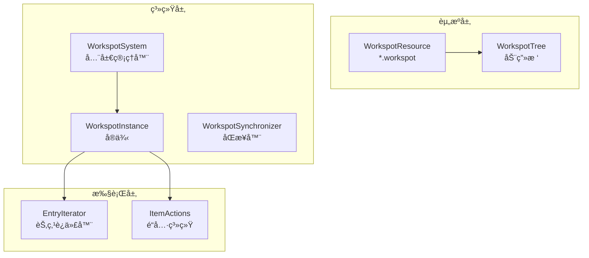
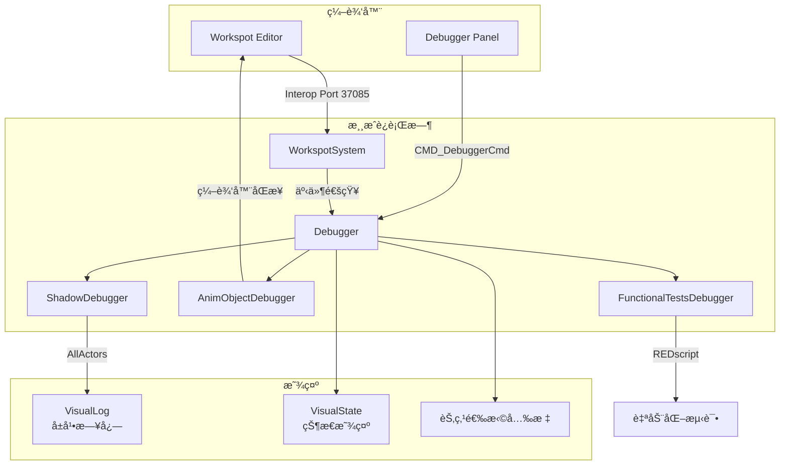
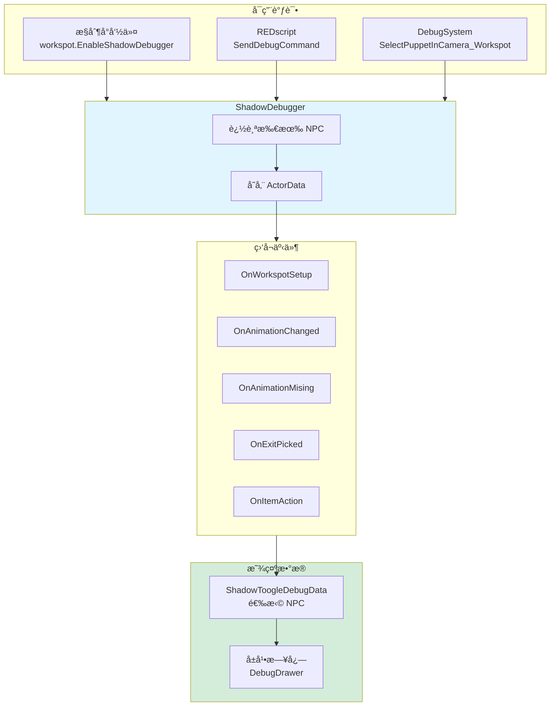
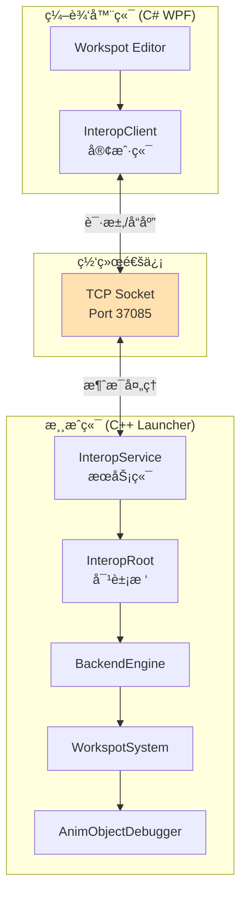
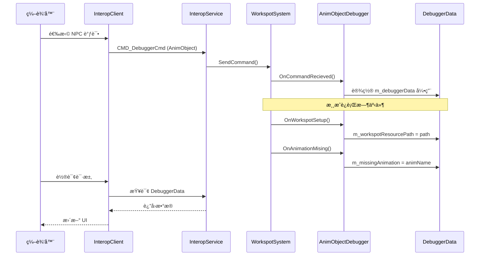
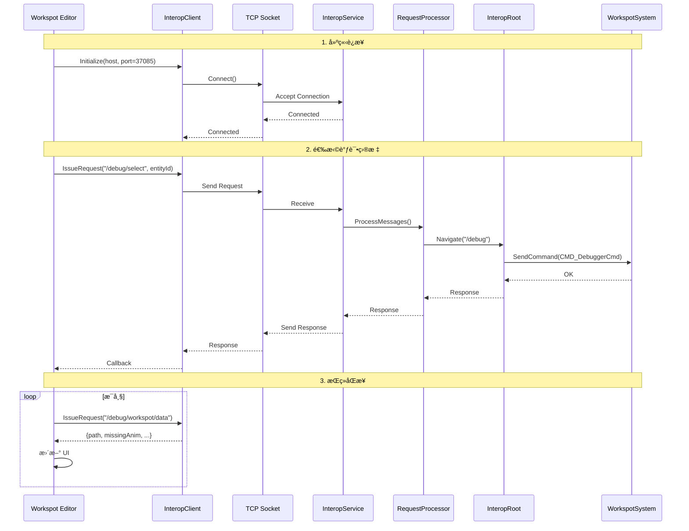

# Claude Conversation Log

Session ID: a1ef29d6-4b60-4e2f-8110-3e3b0b06d341
Date: 2026-01-16 06:03:26

---

## 👤 User

这是workspot编辑器，我想让你ä»è¿™ä¸ªç¼–辑器出å‘结åˆä»£ç è¯¦ç»†ä»‹ç»ä¸€ä¸‹workspot系统，包括èœå•åŠŸèƒ½ã€workspotTreeã€è°ƒè¯•ç³»ç»Ÿã€ç³»ç»Ÿè®¾è®¡ã€é‡è¦æ¦‚念等 D:\Games\2077\CDPR2077\dev\src\common\gameWorkspots

---

## 👤 User

[Image: source: C:\Users\Windows\Desktop\temp\2077\workspotEditor.png]

---

## 🤖 Claude

我æ¥åˆ†æ这个workspot系统。首先让我æ¢ç´¢ä»£ç åº“æ¥äº†è§£å…¶æ¶æ„。

---

## 🤖 Claude

文档已生æˆã€‚让我为你展示Workspot系统的核心内容。

---

## 🤖 Claude

我已完æˆå¯¹ Workspot 系统的全é¢åˆ†æ。以下是基äºä½ æ供的编辑器截图和代ç åˆ†æ的详细介ç»ï¼š

---

## Workspot 系统概述

Workspot 是 REDengine 中用äº**交互å¼åŠ¨ç”»åºåˆ—ç¼–æ’**的核心系统，用äºå¤„ç†è§’色å下ã€å¼€è½¦ã€æ“作机器等å¤æ‚交互动画。

### 整体æ¶æ„



---

## 编辑器界é¢è§£æ（对应你的截图）

### 1. èœå•æ åŠŸèƒ½

ä»æˆªå›¾ä¸­å¯ä»¥çœ‹åˆ°çš„èœå•ï¼š

| èœå• | 功能 |
|------|------|
| **File/Edit/View** | 标准文件æ“作 |
| **Compilation** | 编译 workspot èµ„æº |
| **Debugger** | 调试功能（截图å³ä¸Šè§’çš„ Debugger é¢æ¿ï¼‰ |
| **Dangle** | 物ç†éª¨éª¼æ‚¬æŒ‚调试 |
| **Playback** | 动画预览播放æ§åˆ¶ |
| **Settings** | 编辑器设置 |
| **Profiler** | 性能分æ |

### 2. Debugger é¢æ¿ï¼ˆæˆªå›¾å³ä¸Šè§’）

```
Debugger
├── Status          # 当å‰çŠ¶æ€
├── Interop port: 37085  # 调试通信端å£
└── Target: PC      # 目标平å°
```

**代ç ä½ç½®**: `workspotDebugger.h/cpp`

### 3. Tools 标签页（截图中间å³ä¾§ï¼‰

| 标签 | 功能 |
|------|------|
| **Animations** | 动画列表æµè§ˆ |
| **AnimInputs** | 动画输入å‚æ•° |
| **Validator output** | 验è¯å™¨è¾“出（检查错误） |
| **Anim wrappers** | 动画包装器 |
| **Debug objects** | 调试对象 |
| **Workspot tree** | 动画树结æ„视图（你截图展开的） |

### 4. Workspot Tree（核心结æ„）

ä»ä½ çš„截图å¯ä»¥çœ‹åˆ°è¿™ä¸ª workspot 是酒å§åœºæ™¯çš„å姿动画：

```
Root sequence
├── Reaction Sequence: idle: <no_auto_transition> [BumpRightFront]
│   └── Sequence idle: sit_bar_2h_on_bar_01
│       └── Anim: sit_bar_2h_on_bar_01_bump_right
├── Reaction Sequence: idle: <no_auto_transition> [BumpLeftFront]
│   └── Sequence idle: sit_bar_2h_on_bar_01
│       └── Anim: sit_bar_2h_on_bar_01_bump_left
├── Entry anim: stand_2h_on_sides_01_to_sit_bar_2h_on_bar_01_turn225_01
├── Entry anim: stand_2h_on_sides_01_to_sit_bar_2h_on_bar_01_turn135_01
├── ...（多个 Entry 动画å˜ä½“）
├── Reaction Sequence: [Fear]
│   ├── Anim: sit_bar_01_to_sit_bar_2h_up_01_turn0_01
│   └── Sequence idle: sit_bar_2h_up_01
│       └── Anim: sit_bar_2h_up_01
```

**节点类å‹è§£é‡Š**:

| èŠ‚ç‚¹ç±»å‹ | 图标 | è¯´æ˜ |
|---------|------|------|
| **Root sequence** | 📠| æ ¹åºåˆ—容器 |
| **Reaction Sequence** | â¡ï¸ğŸ“ | å应åºåˆ—（å“应 Bump/Fear 等事件） |
| **Sequence** | 📠| 顺åºåºåˆ— |
| **Anim** | 🟢 | 动画片段（AnimClip） |
| **Entry anim** | ğŸ”´âš ï¸ | 进入动画（红色å¯èƒ½è¡¨ç¤ºéœ€è¦é…置） |

### 5. 节点图（截图中间）

```
Output Node ──Out Pose──> Workspot Hub
```

这是 AnimGraph 的简化视图，显示 Workspot 输出è¿æ¥åˆ° Workspot Hub。

### 6. Properties é¢æ¿ï¼ˆæˆªå›¾å³ä¸‹è§’）

```
Global/Props/Properties
├── Workspot Rig: (No asset)           # 骨骼资æº
├── Global Props: [globalProps] array<0>  # 全局é“å…·
├── Dont Inject Workspot Graph         # ä¸æ³¨å…¥åŠ¨ç”»å›¾
├── Anim Graph Slot Name: WORKSPOT     # 动画图æ’槽
├── Auto Transition Blend Time: 1.0    # 自动过渡混åˆæ—¶é—´
├── Initial Actions: [initialActions] array<0>  # åˆå§‹åŠ¨ä½œ
├── Blend Out Time: 0.0                # æ··åˆé€€å‡ºæ—¶é—´
├── Entities Paths: [entitiesPaths] array<2>  # å®ä½“路径
└── Animsets: [animsets] array<0>      # 动画集
```

**代ç ä½ç½®**: `workspotResource.h:323-528` (WorkspotTree ç±»)

### 7. Preview é¢æ¿ï¼ˆæˆªå›¾å·¦ä¸‹è§’）

显示角色预览：
- å®ä½“：`base\characters\entities\citizen\_lowlife\...`
- 动画：`idle_stand (3.69 s)`
- **Foot IK Enabled** - 表示脚部 IK 系统已å¯ç”¨

---

## 核心类设计

### WorkspotTree（动画树）

**文件**: `workspotResource.h:323-528`

```cpp
class WorkspotTree : public ISerializable
{
    THandle<IEntry> m_rootEntry;                    // 根节点
    red::DynArray<WorkspotAnimsetEntry> m_finalAnimsets;  // 动画集
    red::DynArray<WorkspotGlobalProp> m_globalProps;      // 全局é“å…·
    red::DynArray<THandle<IWorkspotItemAction>> m_initialActions;  // åˆå§‹åŠ¨ä½œ
    Float m_blendOutTime;                           // æ··åˆæ—¶é—´
    Float m_autoTransitionBlendTime;                // 自动过渡混åˆæ—¶é—´
    CName m_animGraphSlotName;                      // 动画图æ’槽å
};
```

### IEntry 节点基类

**文件**: `workspotResource.h:173-232`

```cpp
class IEntry : public ISerializable
{
    WorkEntryId m_id;      // 唯一 ID
    Uint32 m_flags;        // 标志ä½
    
    enum EntryFlags : Uint32
    {
        Animation        = RED_FLAG(1),   // 动画节点
        FastExit         = RED_FLAG(2),   // 快速退出
        SlowExit         = RED_FLAG(3),   // 慢速退出
        SlowEnter        = RED_FLAG(4),   // 慢速进入
        Pause            = RED_FLAG(5),   // æš‚åœ
        Synchronized     = RED_FLAG(6),   // åŒæ­¥
        TagNode          = RED_FLAG(7),   // 标签
        Reaction         = RED_FLAG(8),   // å应
        LookAtDrivenTurn = RED_FLAG(9),   // 视线驱动转身
        HasItem          = RED_FLAG(13),  // 包å«é“å…·
        MotionAnim       = RED_FLAG(15),  // 带ä½ç§»åŠ¨ç”»
        // ...
    };
    
    virtual EntryIterator* CreateIterator(...) const = 0;
};
```

---

## 节点类å‹é€ŸæŸ¥

### 容器节点

| 节点 | 文件ä½ç½® | 功能 |
|------|---------|------|
| **Sequence** | `workspotTreeItems.h:324` | 顺åºæ’­æ”¾å­èŠ‚点 |
| **ReactionSequence** | `workspotTreeItems.h:345` | å“应外部事件的åºåˆ— |
| **ConditionalSequence** | `workspotTreeItems.h:384` | æ¡ä»¶åˆ†æ”¯åºåˆ— |
| **RandomList** | `workspotTreeItems.h:406` | éšæœºé€‰æ‹©å­èŠ‚点 |
| **Selector** | `workspotTreeItems.h:430` | å•æ¬¡éšæœºé€‰æ‹© |

### 动画节点

| 节点 | 文件ä½ç½® | 功能 |
|------|---------|------|
| **AnimClip** | `workspotTreeItems.h:14` | 基本动画片段 |
| **MotionAnimClip** | `workspotTreeItems.h:39` | 带ä½ç§»åŠ¨ç”» |
| **SyncAnimClip** | `workspotTreeItems.h:89` | åŒæ­¥åŠ¨ç”» |
| **AnimClipWithItem** | `workspotTreeItems.h:113` | 带é“具动画 |

### 进出节点

| 节点 | 文件ä½ç½® | 功能 |
|------|---------|------|
| **EntryAnim** | `workspotTreeItems.h:268` | 进入动画 |
| **ExitAnim** | `workspotTreeItems.h:164` | 慢速退出 |
| **FastExit** | `workspotTreeItems.h:133` | 快速退出（战斗） |

### 特殊节点

| 节点 | 文件ä½ç½® | 功能 |
|------|---------|------|
| **PauseClip** | `workspotTreeItems.h:225` | æš‚åœç­‰å¾… |
| **TagNode** | `workspotTreeItems.h:248` | 跳转锚点 |
| **LookAtDrivenTurn** | `workspotTreeItems.h:57` | 视线驱动转身 |

---

## 命令系统

**文件**: `workspotSystem.h:40-73`

```cpp
enum WorkspotCommand
{
    CMD_Stop               = RED_FLAG(1),   // åœæ­¢
    CMD_Play               = RED_FLAG(3),   // 播放
    CMD_FastExit           = RED_FLAG(6),   // 快速退出
    CMD_SlowExit           = RED_FLAG(7),   // 慢速退出
    CMD_JumpToEntry        = RED_FLAG(9),   // 跳转到节点
    CMD_Pause              = RED_FLAG(10),  // æš‚åœ
    CMD_Unpause            = RED_FLAG(11),  // å–消暂åœ
    CMD_ItemAction         = RED_FLAG(14),  // é“具动作
    CMD_DynamicSyncBind    = RED_FLAG(15),  // 动æ€åŒæ­¥ç»‘定
    // ...
};
```

---

## 执行æµç¨‹


---

## 生æˆçš„文档

我已在 `doc/gameWorkspots/` 目录生æˆå®Œæ•´æ–‡æ¡£ï¼š

| 文档 | å¤§å° | 内容 |
|------|------|------|
| [README.md](doc/gameWorkspots/README.md) | 9KB | 模å—å…¥å£å’Œå¯¼èˆª |
| [æ¶æ„设计.md](doc/gameWorkspots/æ¶æ„设计.md) | 44KB | 完整技术æ¶æ„ |
| [WorkspotTree详解.md](doc/gameWorkspots/WorkspotTree详解.md) | 36KB | 动画树结æ„详解 |
| [节点类å‹é€ŸæŸ¥è¡¨.md](doc/gameWorkspots/节点类å‹é€ŸæŸ¥è¡¨.md) | 22KB | 所有节点类å‹å‚考 |

æ–‡æ¡£åŒ…å« 25+ Mermaid 图表ã€è¯¦ç»†ä»£ç ç¤ºä¾‹å’Œå®Œæ•´çš„文件索引（å«è¡Œå·ï¼‰ã€‚

---

## 👤 User

这是workspot编辑器，我想让你ä»è¿™ä¸ªç¼–辑器出å‘结åˆä»£ç è¯¦ç»†ä»‹ç»ä¸€ä¸‹workspot系统，包括èœå•åŠŸèƒ½ã€workspotTreeã€è°ƒè¯•ç³»ç»Ÿã€ç³»ç»Ÿè®¾è®¡ã€é‡è¦æ¦‚念等 D:\Games\2077\CDPR2077\dev\src\common\gameWorkspots

---

## 👤 User

[Image: source: C:\Users\Windows\Desktop\temp\2077\workspotEditor.png]

---

## 🤖 Claude

我æ¥åˆ†æ这个workspot系统。首先让我æ¢ç´¢ä»£ç åº“æ¥äº†è§£å…¶æ¶æ„。

---

## 🤖 Claude

文档已生æˆã€‚让我为你展示Workspot系统的核心内容。

---

## 🤖 Claude

我已完æˆå¯¹ Workspot 系统的全é¢åˆ†æ。以下是基äºä½ æ供的编辑器截图和代ç åˆ†æ的详细介ç»ï¼š

---

## Workspot 系统概述

Workspot 是 REDengine 中用äº**交互å¼åŠ¨ç”»åºåˆ—ç¼–æ’**的核心系统，用äºå¤„ç†è§’色å下ã€å¼€è½¦ã€æ“作机器等å¤æ‚交互动画。

### 整体æ¶æ„


---

## 编辑器界é¢è§£æ（对应你的截图）

### 1. èœå•æ åŠŸèƒ½

ä»æˆªå›¾ä¸­å¯ä»¥çœ‹åˆ°çš„èœå•ï¼š

| èœå• | 功能 |
|------|------|
| **File/Edit/View** | 标准文件æ“作 |
| **Compilation** | 编译 workspot èµ„æº |
| **Debugger** | 调试功能（截图å³ä¸Šè§’çš„ Debugger é¢æ¿ï¼‰ |
| **Dangle** | 物ç†éª¨éª¼æ‚¬æŒ‚调试 |
| **Playback** | 动画预览播放æ§åˆ¶ |
| **Settings** | 编辑器设置 |
| **Profiler** | 性能分æ |

### 2. Debugger é¢æ¿ï¼ˆæˆªå›¾å³ä¸Šè§’）

```
Debugger
├── Status          # 当å‰çŠ¶æ€
├── Interop port: 37085  # 调试通信端å£
└── Target: PC      # 目标平å°
```

**代ç ä½ç½®**: `workspotDebugger.h/cpp`

### 3. Tools 标签页（截图中间å³ä¾§ï¼‰

| 标签 | 功能 |
|------|------|
| **Animations** | 动画列表æµè§ˆ |
| **AnimInputs** | 动画输入å‚æ•° |
| **Validator output** | 验è¯å™¨è¾“出（检查错误） |
| **Anim wrappers** | 动画包装器 |
| **Debug objects** | 调试对象 |
| **Workspot tree** | 动画树结æ„视图（你截图展开的） |

### 4. Workspot Tree（核心结æ„）

ä»ä½ çš„截图å¯ä»¥çœ‹åˆ°è¿™ä¸ª workspot 是酒å§åœºæ™¯çš„å姿动画：

```
Root sequence
├── Reaction Sequence: idle: <no_auto_transition> [BumpRightFront]
│   └── Sequence idle: sit_bar_2h_on_bar_01
│       └── Anim: sit_bar_2h_on_bar_01_bump_right
├── Reaction Sequence: idle: <no_auto_transition> [BumpLeftFront]
│   └── Sequence idle: sit_bar_2h_on_bar_01
│       └── Anim: sit_bar_2h_on_bar_01_bump_left
├── Entry anim: stand_2h_on_sides_01_to_sit_bar_2h_on_bar_01_turn225_01
├── Entry anim: stand_2h_on_sides_01_to_sit_bar_2h_on_bar_01_turn135_01
├── ...（多个 Entry 动画å˜ä½“）
├── Reaction Sequence: [Fear]
│   ├── Anim: sit_bar_01_to_sit_bar_2h_up_01_turn0_01
│   └── Sequence idle: sit_bar_2h_up_01
│       └── Anim: sit_bar_2h_up_01
```

**节点类å‹è§£é‡Š**:

| èŠ‚ç‚¹ç±»å‹ | 图标 | è¯´æ˜ |
|---------|------|------|
| **Root sequence** | 📠| æ ¹åºåˆ—容器 |
| **Reaction Sequence** | â¡ï¸ğŸ“ | å应åºåˆ—（å“应 Bump/Fear 等事件） |
| **Sequence** | 📠| 顺åºåºåˆ— |
| **Anim** | 🟢 | 动画片段（AnimClip） |
| **Entry anim** | ğŸ”´âš ï¸ | 进入动画（红色å¯èƒ½è¡¨ç¤ºéœ€è¦é…置） |

### 5. 节点图（截图中间）

```
Output Node ──Out Pose──> Workspot Hub
```

这是 AnimGraph 的简化视图，显示 Workspot 输出è¿æ¥åˆ° Workspot Hub。

### 6. Properties é¢æ¿ï¼ˆæˆªå›¾å³ä¸‹è§’）

```
Global/Props/Properties
├── Workspot Rig: (No asset)           # 骨骼资æº
├── Global Props: [globalProps] array<0>  # 全局é“å…·
├── Dont Inject Workspot Graph         # ä¸æ³¨å…¥åŠ¨ç”»å›¾
├── Anim Graph Slot Name: WORKSPOT     # 动画图æ’槽
├── Auto Transition Blend Time: 1.0    # 自动过渡混åˆæ—¶é—´
├── Initial Actions: [initialActions] array<0>  # åˆå§‹åŠ¨ä½œ
├── Blend Out Time: 0.0                # æ··åˆé€€å‡ºæ—¶é—´
├── Entities Paths: [entitiesPaths] array<2>  # å®ä½“路径
└── Animsets: [animsets] array<0>      # 动画集
```

**代ç ä½ç½®**: `workspotResource.h:323-528` (WorkspotTree ç±»)

### 7. Preview é¢æ¿ï¼ˆæˆªå›¾å·¦ä¸‹è§’）

显示角色预览：
- å®ä½“：`base\characters\entities\citizen\_lowlife\...`
- 动画：`idle_stand (3.69 s)`
- **Foot IK Enabled** - 表示脚部 IK 系统已å¯ç”¨

---

## 核心类设计

### WorkspotTree（动画树）

**文件**: `workspotResource.h:323-528`

```cpp
class WorkspotTree : public ISerializable
{
    THandle<IEntry> m_rootEntry;                    // 根节点
    red::DynArray<WorkspotAnimsetEntry> m_finalAnimsets;  // 动画集
    red::DynArray<WorkspotGlobalProp> m_globalProps;      // 全局é“å…·
    red::DynArray<THandle<IWorkspotItemAction>> m_initialActions;  // åˆå§‹åŠ¨ä½œ
    Float m_blendOutTime;                           // æ··åˆæ—¶é—´
    Float m_autoTransitionBlendTime;                // 自动过渡混åˆæ—¶é—´
    CName m_animGraphSlotName;                      // 动画图æ’槽å
};
```

### IEntry 节点基类

**文件**: `workspotResource.h:173-232`

```cpp
class IEntry : public ISerializable
{
    WorkEntryId m_id;      // 唯一 ID
    Uint32 m_flags;        // 标志ä½
    
    enum EntryFlags : Uint32
    {
        Animation        = RED_FLAG(1),   // 动画节点
        FastExit         = RED_FLAG(2),   // 快速退出
        SlowExit         = RED_FLAG(3),   // 慢速退出
        SlowEnter        = RED_FLAG(4),   // 慢速进入
        Pause            = RED_FLAG(5),   // æš‚åœ
        Synchronized     = RED_FLAG(6),   // åŒæ­¥
        TagNode          = RED_FLAG(7),   // 标签
        Reaction         = RED_FLAG(8),   // å应
        LookAtDrivenTurn = RED_FLAG(9),   // 视线驱动转身
        HasItem          = RED_FLAG(13),  // 包å«é“å…·
        MotionAnim       = RED_FLAG(15),  // 带ä½ç§»åŠ¨ç”»
        // ...
    };
    
    virtual EntryIterator* CreateIterator(...) const = 0;
};
```

---

## 节点类å‹é€ŸæŸ¥

### 容器节点

| 节点 | 文件ä½ç½® | 功能 |
|------|---------|------|
| **Sequence** | `workspotTreeItems.h:324` | 顺åºæ’­æ”¾å­èŠ‚点 |
| **ReactionSequence** | `workspotTreeItems.h:345` | å“应外部事件的åºåˆ— |
| **ConditionalSequence** | `workspotTreeItems.h:384` | æ¡ä»¶åˆ†æ”¯åºåˆ— |
| **RandomList** | `workspotTreeItems.h:406` | éšæœºé€‰æ‹©å­èŠ‚点 |
| **Selector** | `workspotTreeItems.h:430` | å•æ¬¡éšæœºé€‰æ‹© |

### 动画节点

| 节点 | 文件ä½ç½® | 功能 |
|------|---------|------|
| **AnimClip** | `workspotTreeItems.h:14` | 基本动画片段 |
| **MotionAnimClip** | `workspotTreeItems.h:39` | 带ä½ç§»åŠ¨ç”» |
| **SyncAnimClip** | `workspotTreeItems.h:89` | åŒæ­¥åŠ¨ç”» |
| **AnimClipWithItem** | `workspotTreeItems.h:113` | 带é“具动画 |

### 进出节点

| 节点 | 文件ä½ç½® | 功能 |
|------|---------|------|
| **EntryAnim** | `workspotTreeItems.h:268` | 进入动画 |
| **ExitAnim** | `workspotTreeItems.h:164` | 慢速退出 |
| **FastExit** | `workspotTreeItems.h:133` | 快速退出（战斗） |

### 特殊节点

| 节点 | 文件ä½ç½® | 功能 |
|------|---------|------|
| **PauseClip** | `workspotTreeItems.h:225` | æš‚åœç­‰å¾… |
| **TagNode** | `workspotTreeItems.h:248` | 跳转锚点 |
| **LookAtDrivenTurn** | `workspotTreeItems.h:57` | 视线驱动转身 |

---

## 命令系统

**文件**: `workspotSystem.h:40-73`

```cpp
enum WorkspotCommand
{
    CMD_Stop               = RED_FLAG(1),   // åœæ­¢
    CMD_Play               = RED_FLAG(3),   // 播放
    CMD_FastExit           = RED_FLAG(6),   // 快速退出
    CMD_SlowExit           = RED_FLAG(7),   // 慢速退出
    CMD_JumpToEntry        = RED_FLAG(9),   // 跳转到节点
    CMD_Pause              = RED_FLAG(10),  // æš‚åœ
    CMD_Unpause            = RED_FLAG(11),  // å–消暂åœ
    CMD_ItemAction         = RED_FLAG(14),  // é“具动作
    CMD_DynamicSyncBind    = RED_FLAG(15),  // 动æ€åŒæ­¥ç»‘定
    // ...
};
```

---

## 执行æµç¨‹


---

## 生æˆçš„文档

我已在 `doc/gameWorkspots/` 目录生æˆå®Œæ•´æ–‡æ¡£ï¼š

| 文档 | å¤§å° | 内容 |
|------|------|------|
| [README.md](doc/gameWorkspots/README.md) | 9KB | 模å—å…¥å£å’Œå¯¼èˆª |
| [æ¶æ„设计.md](doc/gameWorkspots/æ¶æ„设计.md) | 44KB | 完整技术æ¶æ„ |
| [WorkspotTree详解.md](doc/gameWorkspots/WorkspotTree详解.md) | 36KB | 动画树结æ„详解 |
| [节点类å‹é€ŸæŸ¥è¡¨.md](doc/gameWorkspots/节点类å‹é€ŸæŸ¥è¡¨.md) | 22KB | 所有节点类å‹å‚考 |

æ–‡æ¡£åŒ…å« 25+ Mermaid 图表ã€è¯¦ç»†ä»£ç ç¤ºä¾‹å’Œå®Œæ•´çš„文件索引（å«è¡Œå·ï¼‰ã€‚

---

## 👤 User

看æ¥ä½ æˆåŠŸå®šä½äº†Debugger功能，我想问的是workspot系统的Debugger功能都能调试哪些内容？是å¦å¯ä»¥è°ƒè¯•æ¸¸æˆä¸­çš„æŸä¸ªNPCçš„workspot使用状æ€ï¼Ÿæ˜¯å¦å¯ä»¥è°ƒè¯•workspotTreeçš„è¿è¡Œæƒ…况

---

## 🤖 Claude

让我深入分æ Workspot 的调试系统代ç ã€‚

---

## 🤖 Claude

ç°åœ¨æˆ‘å·²ç»å®Œå…¨äº†è§£äº† Workspot 调试系统的æ¶æ„。以下是详细分æ：

---

## Workspot Debugger 系统详解

### 调试模å¼ç±»å‹

**文件**: `workspotDebugger.h:41-63`

```cpp
enum WorkspotDebugMode
{
    // 日志显示
    VisualLogToogle  = RED_FLAG(1),   // 切æ¢å¯è§†åŒ–日志
    VisualLogOn      = RED_FLAG(2),   // å¼€å¯å¯è§†åŒ–日志
    VisualLogOff     = RED_FLAG(3),   // 关闭å¯è§†åŒ–日志
    
    // 状æ€æ˜¾ç¤º
    VisualStateToogle = RED_FLAG(4),  // 切æ¢çŠ¶æ€å¯è§†åŒ–
    VisualStateOn     = RED_FLAG(5),  // å¼€å¯çŠ¶æ€å¯è§†åŒ–
    VisualStateOff    = RED_FLAG(6),  // 关闭状æ€å¯è§†åŒ–
    
    // 录制/å›æ”¾
    RecorderOn       = RED_FLAG(7),   // å¼€å¯å½•åˆ¶
    RecorderOff      = RED_FLAG(8),   // 关闭录制
    PlaybackOn       = RED_FLAG(9),   // å¼€å¯å›æ”¾
    PlaybackOff      = RED_FLAG(10),  // 关闭å›æ”¾
    
    // æ§åˆ¶
    StopAll          = RED_FLAG(11),  // åœæ­¢æ‰€æœ‰è°ƒè¯•å·¥å…·
    FunctionalTests  = RED_FLAG(13),  // 功能测试模å¼
    AnimObject       = RED_FLAG(14),  // 动画对象调试
    
    // 性能分æ
    ProfilerOn       = RED_FLAG(15),  // å¼€å¯æ€§èƒ½åˆ†æ
    ProfilerOff      = RED_FLAG(16),  // 关闭性能分æ
    
    // Shadow 调试
    ShadowActivate       = RED_FLAG(17),  // 激活影å­è°ƒè¯•
    ShadowDeactivate     = RED_FLAG(18),  // åœç”¨å½±å­è°ƒè¯•
    ShadowToogleDebugData= RED_FLAG(19),  // 切æ¢å½±å­è°ƒè¯•æ•°æ®
    
    // 节点选择
    NodeSelection    = RED_FLAG(20),  // 节点选择（游æˆå†…选择）
};
```

---

### 调试工具类å‹

系统å®ç°äº† 3 ç§ä¸»è¦çš„调试工具：

#### 1. ShadowDebugger（影å­è°ƒè¯•å™¨ï¼‰

**文件**: `workspotShadowDebugger.cpp:14-306`

**功能**: 追踪所有 NPC çš„ Workspot 使用状æ€

```cpp
class ShadowDebugger : public DebuggingTool
{
    struct ActorData
    {
        ent::EntityID m_actor;           // NPC å®ä½“ ID
        Double m_deletionTimestamp;      // 删除时间戳
        String m_resourcePath;           // 当å‰ä½¿ç”¨çš„ workspot 资æºè·¯å¾„
        red::DynArray<CName> m_animHistory;   // 动画播放å†å²ï¼ˆæœ€è¿‘7个）
        red::DynArray<String> m_messages;     // 消æ¯å†å²ï¼ˆæœ€è¿‘15æ¡ï¼‰
    };
    
    // æ”¯æŒ AllActors = true，追踪所有 NPC
    virtual Bool AllActors() const { return true; }
};
```

**å¯è¿½è¸ªçš„事件**:
| 事件 | è¯´æ˜ |
|------|------|
| `OnWorkspotSetup` | NPC 进入 workspot，记录资æºè·¯å¾„ |
| `OnAnimationChanged` | 动画切æ¢ï¼Œè®°å½•åˆ°å†å² |
| `OnAnimationMising` | 动画缺失警告 |
| `OnSkipOverflow` | è¿ç»­è·³è¿‡å¤ªå¤šåŠ¨ç”»è­¦å‘Š |
| `OnExitPicked` | 退出动画选择 |
| `OnItemAction` | é“具动作执行 |
| `OnWorkspotUserAttached` | å®ä½“附ç€åˆ° workspot |
| `OnInstanceRemoved` | å®ä¾‹ç§»é™¤ï¼ˆ45秒å清ç†æ•°æ®ï¼‰ |

---

#### 2. WorkspotFunctionalTestsDebuggingTool（功能测试调试器）

**文件**: `workspotFunctionalTests.h:11-44`

**功能**: é›†æˆ REDscript 自动化测试

```cpp
class WorkspotFunctionalTestsDebuggingTool : public DebuggingTool
{
    THandle<IScriptable> m_redscript;  // 脚本对象引用
    
    // 所有事件都会通知到脚本
    virtual void OnAnimationChanged(...);
    virtual void OnAnimationSkipped(...);
    virtual void OnAnimationMising(...);
    virtual void OnSkipOverflow(...);
    virtual void OnTeleportRequest(...);
    virtual void OnMovementRequest(...);
    // ...
};
```

---

#### 3. workspotAnimObjectDebugger（动画对象调试器）

**文件**: `workspotAnimObjectDebugger.h:13-33`

**功能**: ä¸ç¼–辑器å作调试

```cpp
class workspotAnimObjectDebugger : public DebuggingTool
{
    red::SharedPtr<WorkspotAnimObjectDebuggerData> m_debuggerData;
    
    // 编辑器通信
    virtual void OnCommandRecieved(...);
    virtual void OnWorkspotSetup(...);
    virtual void OnAnimationMising(...);
};
```

---

### DebuggingTool 基类å›è°ƒ

**文件**: `workspotDebugger.h:98-142`

所有调试工具都å¯ä»¥æ¥æ”¶ä»¥ä¸‹äº‹ä»¶ï¼š

```cpp
class DebuggingTool
{
    // å®ä¾‹ç”Ÿå‘½å‘¨æœŸ
    virtual void OnInstanceCreated(const ent::EntityID& actorId);
    virtual void OnInstanceRemoved(const ent::EntityID& actorId);
    
    // Workspot 生命周期
    virtual void OnWorkspotSetup(const ent::EntityID& actorId, 
                                 const THandle<WorkspotTree>& resource, 
                                 const String& path);
    virtual void OnWorkspotStarted(const ent::EntityID& actorId);
    virtual void OnWorkspotFinished(const ent::EntityID& actorId);
    
    // 动画事件
    virtual void OnAnimationChanged(const ent::EntityID& actorId, 
                                    CName animName, 
                                    WorkEntryId entryId, 
                                    Uint32 flags);
    virtual void OnAnimationSkipped(const ent::EntityID& actorId, 
                                    CName animName, 
                                    WorkEntryId entryId);
    virtual void OnAnimationMising(const ent::EntityID& actorId, 
                                   CName animName, 
                                   WorkEntryId entryId);
    virtual void OnSkipOverflow(const ent::EntityID& actorId);
    
    // 移动/ä¼ é€
    virtual void OnTeleportRequest(const ent::EntityID& actorId);
    virtual void OnMovementRequest(const ent::EntityID& actorId);
    
    // 退出选择
    virtual void OnExitPicked(const ent::EntityID& actorId, 
                              CName animName, 
                              WorkEntryId entryId);
    
    // 命令æ¥æ”¶
    virtual void OnCommandRecieved(const ent::EntityID& actorId, 
                                   OriginId oriId, 
                                   Bool immediate, 
                                   Uint32 cmd, 
                                   const red::UniquePtr<IWorkspotCommandData>& data);
    
    // 附ç€äº‹ä»¶
    virtual void OnWorkspotUserAttached(const ent::EntityID& actorId, 
                                        const WorldTransform& workspotLocation, 
                                        const WorldTransform& correctionTransform);
    
    // é“具动作
    virtual void OnItemAction(IWorkspotItemAction& action, 
                              ItemActionExecutionContext& itemContext);
};
```

---

### 调试æµç¨‹å›¾



---

### å›ç­”你的问题

#### 1. 是å¦å¯ä»¥è°ƒè¯•æ¸¸æˆä¸­æŸä¸ª NPC çš„ workspot 使用状æ€ï¼Ÿ

**✅ å¯ä»¥**，通过 **ShadowDebugger**：

```cpp
// ShadowDebugger 追踪æ¯ä¸ª NPC
struct ActorData
{
    ent::EntityID m_actor;        // NPC ID
    String m_resourcePath;        // 使用的 workspot 资æº
    DynArray<CName> m_animHistory;    // 动画å†å²ï¼ˆæœ€è¿‘7个）
    DynArray<String> m_messages;      // 事件消æ¯ï¼ˆæœ€è¿‘15æ¡ï¼‰
};
```

**å¯æŸ¥çœ‹çš„ä¿¡æ¯**:
- NPC 当å‰ä½¿ç”¨çš„ workspot 资æºè·¯å¾„
- 动画播放å†å²ï¼ˆæœ€è¿‘ 7 个动画）
- 事件å†å²ï¼ˆsetupã€é€€å‡ºé€‰æ‹©ã€é“具动作等）
- 警告信æ¯ï¼ˆåŠ¨ç”»ç¼ºå¤±ã€ä½“å‹ä¸åŒ¹é…等）

**激活方å¼**:
- `WorkspotDebugMode::ShadowActivate` - 开始追踪所有 NPC
- `WorkspotDebugMode::ShadowToogleDebugData` - 切æ¢æ˜¾ç¤ºç‰¹å®š NPC çš„æ•°æ®

---

#### 2. 是å¦å¯ä»¥è°ƒè¯• WorkspotTree çš„è¿è¡Œæƒ…况？

**✅ å¯ä»¥**，通过多ç§æ–¹å¼ï¼š

**a) 节点选择调试** (`NodeSelection`):
```cpp
// 相机看å‘çš„ workspot 节点会高亮
void Debugger::ProcessForSelection(
    const Transform& nodeTransform,
    const world::GlobalNodeID& nodeId,
    const Transform& cameraTransform,
    WorkspotTree* tree)
{
    // è·ç¦» < 10m 且在相机å‰æ–¹çš„节点被选中
    // 显示è“色金字塔光标
}
```

**b) 动画切æ¢è¿½è¸ª**:
```cpp
// æ¯æ¬¡åŠ¨ç”»åˆ‡æ¢éƒ½ä¼šè®°å½•
OnAnimationChanged(actorId, animName, entryId, flags);
// entryId 对应 WorkspotTree 中的节点 ID
// flags 包å«èŠ‚点类å‹ï¼ˆEntry/Exit/Sync等）
```

**c) 问题检测**:
```cpp
OnAnimationMising(...)    // 动画ä¸å­˜åœ¨
OnAnimationSkipped(...)   // 动画被跳过
OnSkipOverflow(...)       // è¿ç»­è·³è¿‡å¤ªå¤šï¼ˆå¯èƒ½é…置错误）
```

**d) 编辑器åŒæ­¥** (`AnimObjectDebugger`):
- 通过 Interop port (截图中的 37085) ä¸ç¼–辑器通信
- å¯ä»¥å®æ—¶åŒæ­¥è¿è¡Œæ—¶çŠ¶æ€åˆ°ç¼–辑器

---

### DebugDrawer 显示系统

**文件**: `workspotDebugger.cpp:374-460`

```cpp
class DebugDrawer
{
    // å±å¹•æ—¥å¿—（左侧显示）
    red::StaticArray<LogEntry, 34> m_actionsHistory;
    
    struct LogEntry
    {
        Uint64 m_tick;      // 时间戳
        Bool m_highlight;   // 是å¦é«˜äº®
        String m_message;   // 消æ¯å†…容
        DebugToolId m_toolId;
    };
    
    // 颜色éšæ—¶é—´å˜åŒ–
    // 新消æ¯: 红色 → 绿色 → ç°è‰²
};
```

**显示ä½ç½®**: å±å¹•å·¦ä¾§ (x=20, y=160 开始)

---

### 调试过滤器

通过 Debug Overlay 系统æ§åˆ¶æ˜¾ç¤ºï¼š

```cpp
// workspotDebugger.cpp:402
static rend::DebugFilter DF_RuntimeSystemWorkspots("RuntimeSystem/Entity/Workspots");

// 节点选择光标
if (const rend::DebugFilterHierarchyNode* node = 
    rend::DebugFilterHierarchyNode::FindNode("AI/Workspots/Spots"))
{
    drawWorkspotSelector = context.debugDrawer.GetMask().Test(node->GetFilter());
}
```

è¿™ä¸ä½ æˆªå›¾ä¸­çœ‹åˆ°çš„ Debug Overlays é…置系统相关è”。

---

### 总结

| 调试需求 | æ”¯æŒ | 工具 |
|---------|------|------|
| 追踪特定 NPC çš„ workspot çŠ¶æ€ | ✅ | ShadowDebugger |
| 查看动画播放å†å² | ✅ | ShadowDebugger |
| 查看当å‰æ’­æ”¾çš„节点 ID | ✅ | OnAnimationChanged |
| 检测动画缺失 | ✅ | OnAnimationMising |
| 编辑器å®æ—¶åŒæ­¥ | ✅ | AnimObjectDebugger + Interop |
| 自动化测试 | ✅ | FunctionalTestsDebugger |
| 节点选择（游æˆå†…） | ✅ | NodeSelection |
| 性能分æ | ✅ | ProfilerOn/Off |
| 录制/å›æ”¾ | 🔧 | RecorderOn/PlaybackOn (æšä¸¾å­˜åœ¨ä½†å®ç°æœªæ‰¾åˆ°) |

---

## 👤 User

什么是ShadowDebugger？是游æˆå†…的调试系统么？如何在游æˆå†…å¯ç”¨å¹¶å¼€å¯è°ƒè¯•å‘¢

---

## 🤖 Claude

让我查找 ShadowDebugger çš„å¯ç”¨æ–¹å¼å’Œè°ƒç”¨å…¥å£ã€‚

---

## 🤖 Claude

ç°åœ¨æˆ‘å·²ç»æ‰¾åˆ°å®Œæ•´çš„答案了。

---

## ShadowDebugger 详解

### 什么是 ShadowDebugger？

ShadowDebugger 是一个**游æˆå†…åå°è°ƒè¯•å·¥å…·**，它的åå­—"Shadow"（影å­ï¼‰è¡¨ç¤ºå®ƒåœ¨åå°**é™é»˜è¿½è¸ªæ‰€æœ‰ NPC** çš„ Workspot 使用状æ€ï¼Œä¸éœ€è¦é¢„先选中æŸä¸ª NPC。

```cpp
// workspotShadowDebugger.cpp:32
virtual Bool AllActors() const { return true; }  // 追踪所有角色
```

**特点**:
- 🔠**全局追踪** - 自动追踪所有 NPC 的 workspot 活动
- 📠**å†å²è®°å½•** - ä¿å­˜æ¯ä¸ª NPC 的动画å†å²å’Œäº‹ä»¶æ¶ˆæ¯
- â° **æŒä¹…化** - å®ä¾‹ç§»é™¤åæ•°æ®ä¿ç•™ 45 秒（方便调试）
- 📺 **å¯è§†åŒ–显示** - å¯ä»¥åœ¨å±å¹•ä¸Šæ˜¾ç¤ºç‰¹å®š NPC çš„æ•°æ®

---

### å¯ç”¨æ–¹å¼

#### æ–¹å¼ 1：æ§åˆ¶å°å‘½ä»¤

**文件**: `gameWorkspotsSystem.cpp:1383-1394`

```
workspot.EnableShadowDebugger      # å¯ç”¨ Shadow 调试器
workspot.DisableShadowDebugger     # ç¦ç”¨ Shadow 调试器
workspot.LogOn                     # å¼€å¯å¯è§†åŒ–日志
workspot.LogOff                    # 关闭å¯è§†åŒ–日志
workspot.StateOn                   # å¼€å¯çŠ¶æ€æ˜¾ç¤º
workspot.StateOff                  # 关闭状æ€æ˜¾ç¤º
workspot.ProfilerOn                # å¼€å¯æ€§èƒ½åˆ†æ
workspot.ProfilerOff               # 关闭性能分æ
workspot.StopAllDebuggers          # åœæ­¢æ‰€æœ‰è°ƒè¯•å·¥å…·
```

#### æ–¹å¼ 2：REDscript 脚本调用

**文件**: `gameWorkspotsSystem.cpp:604-636`

```swift
// REDscript 中使用
let workspotSystem = GameInstance.GetWorkspotSystem(game);

// å¯ç”¨ Shadow 调试器（追踪所有 NPC）
workspotSystem.SendDebugCommand(workspotDebugMode.ShadowActivate, "");

// 显示特定 NPC 的调试数æ®
workspotSystem.SendDebugCommandEnt(workspotDebugMode.ShadowToogleDebugData, npcObject);

// 关闭 Shadow 调试器
workspotSystem.SendDebugCommand(workspotDebugMode.ShadowDeactivate, "");
```

#### æ–¹å¼ 3：CDebugSystem 调用（编辑器/å¼€å‘模å¼ï¼‰

**文件**: `debugSystem.cpp:2786-2826`

```cpp
// 调试系统中的函数
void CDebugSystem::SelectPuppetInCamera_Workspot(Bool alternativeMode, Bool targetPlayer)
{
    // 1. 选择相机看å‘çš„ NPC
    THandle<game::Object> puppet = SelectPuppetInCamera(25.f);
    
    // 2. å¼€å¯ VisualLog
    data->m_mode = work::WorkspotDebugMode::VisualLogToogle;
    wSys->SendCommand(puppet->GetEntityID(), work::CMD_DebuggerCmd, std::move(data));
    
    // 3. alternativeMode = true æ—¶ï¼Œåˆ‡æ¢ Shadow æ•°æ®æ˜¾ç¤º
    if (alternativeMode)
    {
        Bool shadowDebuggerActive = wSys->GetDebugger().IsToolActive(
            work::WorkspotDebugMode::ShadowToogleDebugData);
            
        if (shadowDebuggerActive)
        {
            data->m_mode = work::WorkspotDebugMode::ShadowToogleDebugData;
        }
        else
        {
            data->m_mode = work::WorkspotDebugMode::VisualStateToogle;
        }
    }
}
```

---

### ShadowDebugger 追踪的数æ®

**文件**: `workspotShadowDebugger.cpp:19-26`

```cpp
struct ActorData
{
    ent::EntityID m_actor;                    // NPC å®ä½“ ID
    Double m_deletionTimestamp;               // 删除时间戳
    String m_resourcePath;                    // å½“å‰ workspot 资æºè·¯å¾„
    red::DynArray<CName> m_animHistory;       // 动画å†å²ï¼ˆæœ€è¿‘ 7 个）
    red::DynArray<String> m_messages;         // 消æ¯å†å²ï¼ˆæœ€è¿‘ 15 æ¡ï¼‰
};
```

**追踪的事件**:

| 事件 | 记录内容 | 代ç ä½ç½® |
|------|----------|----------|
| `OnWorkspotSetup` | workspot 资æºè·¯å¾„ã€ä½“å‹å…¼å®¹æ€§è­¦å‘Š | L152-172 |
| `OnAnimationChanged` | 动画切æ¢å†å² | L210-224 |
| `OnAnimationMising` | "Missing animation [xxx] - possible glitch/blend" | L232-236 |
| `OnSkipOverflow` | "Too many animations skipped in a row - possible glitch" | L238-242 |
| `OnExitPicked` | "Exit anim picked [xxx]" | L226-229 |
| `OnItemAction` | "Item action executed - [ç±»å‹][物å“][æ’槽]" | L244-253 |
| `OnWorkspotUserAttached` | ä½ç½®å’Œæ ¡æ­£å移 | L202-208 |

---

### 调试æµç¨‹å›¾



---

### å±å¹•æ˜¾ç¤ºå†…容

当你选择æŸä¸ª NPC 显示调试数æ®æ—¶ï¼ˆ`ShadowToogleDebugData`）：

**文件**: `workspotShadowDebugger.cpp:281-305`

```
- Id: [123456789] Resource: [base\workspots\bar\sit_bar_01.workspot]
- Events history - - - - - - - - - - - -
  Workspot started - previously was [previous_workspot.workspot]
  Exit anim picked [stand_up_01]
  Item action executed - EquipPropToSlot [drink_glass][RightHand]
- Anim history - - - - - - - - - - - -
  idle_sit_01
  drink_01
  idle_sit_02
  look_around
  stand_up_01
```

---

### 完整的调试命令清å•

| æ§åˆ¶å°å‘½ä»¤ | å¯¹åº”æ¨¡å¼ | è¯´æ˜ |
|-----------|---------|------|
| `workspot.EnableShadowDebugger` | `ShadowActivate` | å¯ç”¨åå°è¿½è¸ª |
| `workspot.DisableShadowDebugger` | `ShadowDeactivate` | åœæ­¢åå°è¿½è¸ª |
| `workspot.LogOn [entityId]` | `VisualLogOn` | å¼€å¯ç‰¹å®š NPC 的日志 |
| `workspot.LogOff [entityId]` | `VisualLogOff` | 关闭日志 |
| `workspot.StateOn [entityId]` | `VisualStateOn` | å¼€å¯çŠ¶æ€æ˜¾ç¤º |
| `workspot.StateOff [entityId]` | `VisualStateOff` | 关闭状æ€æ˜¾ç¤º |
| `workspot.ProfilerOn` | `ProfilerOn` | å¼€å¯æ€§èƒ½åˆ†æ |
| `workspot.ProfilerOff` | `ProfilerOff` | 关闭性能分æ |
| `workspot.StopAllDebuggers` | `StopAll` | åœæ­¢æ‰€æœ‰è°ƒè¯• |

---

### 使用示例

#### åœºæ™¯ï¼šè°ƒè¯•é…’å§ NPC çš„ workspot 问题

```
1. 打开æ§åˆ¶å°ï¼Œè¾“入：
   workspot.EnableShadowDebugger
   
2. èµ°è¿‘é…’å§ï¼Œè®© NPC 进入 workspot

3. 选择特定 NPC 查看详细信æ¯ï¼š
   - æ–¹å¼A：用相机对准 NPC，按调试快æ·é”®
   - æ–¹å¼B：脚本调用 SendDebugCommandEnt(ShadowToogleDebugData, npc)

4. å±å¹•å·¦ä¾§ä¼šæ˜¾ç¤ºï¼š
   - 当å‰ä½¿ç”¨çš„ workspot 资æº
   - 动画播放å†å²
   - 任何警告（动画缺失ã€ä½“å‹ä¸åŒ¹é…等）

5. 完æˆå关闭：
   workspot.StopAllDebuggers
```

---

### é…ç½®æ¡ä»¶

**文件**: `workspotDebugger.h:10-12`

```cpp
#if !defined( RED_CONFIGURATION_FINAL ) || defined(USE_PROFILER)
#define WORKSPOT_DEBUG_ENABLED
#endif
```

调试功能**仅在é FINAL 版本**或å¯ç”¨äº† `USE_PROFILER` æ—¶å¯ç”¨ã€‚å‘布版游æˆä¸­è¿™äº›åŠŸèƒ½è¢«ç¦ç”¨ã€‚

---

## 👤 User

编辑器如何通过Interop portä¸æ¸¸æˆé€šä¿¡

---

## 🤖 Claude

让我æœç´¢ Interop 通信机制的å®ç°ã€‚

---

## 👤 User

[Request interrupted by user]

---

## 👤 User

继续

---

## 🤖 Claude

ç°åœ¨æˆ‘有了完整的信æ¯ã€‚以下是编辑器ä¸æ¸¸æˆé€šè¿‡ Interop Port 通信的详细机制：

---

## 编辑器ä¸æ¸¸æˆçš„ Interop 通信机制

### æ¶æ„概览



---

### 核心组件

#### 1. 游æˆç«¯ï¼šInteropService（æœåŠ¡ç«¯ï¼‰

**文件**: `interopService.h:30-81`

```cpp
class InteropService : public red::Network::IRawListenerInterface
{
    // 打开指定端å£çš„æœåŠ¡
    Bool Open(
        Uint16 port,                    // 默认 37080，截图显示 37085
        ::interop::ObjectPtr interopRoot,  // 根对象树
        OnExitCallback onExitCallback,
        OnDetachCallback onDetachCallback,
        Bool reuseAddresses);
    
    // 处ç†æ¶ˆæ¯ï¼ˆæ¯å¸§è°ƒç”¨ï¼‰
    void ProcessMessages();
    
private:
    red::Network::RawTcpManager m_network;  // TCP 管ç†å™¨
    Uint16 m_serverPort;                     // 监å¬ç«¯å£
    ::interop::ObjectPtr m_interopRoot;      // 暴露的对象树
};
```

#### 2. 编辑器端：InteropClient（客户端）

**文件**: `interopClient.h:46-141`

```cpp
class InteropClient
{
    struct Setup
    {
        String m_clientName;
        String m_hostAddress;    // 目标 IP
        Uint16 m_hostPort;       // 目标端å£ï¼ˆ37085）
    };
    
    void Intialize(const Setup& setup);
    Bool Connect();              // 阻å¡è¿æ¥
    void Update();               // æ¯å¸§æ›´æ–°
    
    // å‘é€è¯·æ±‚
    InteropRequestPtr IssueRequest(
        const InteropPath& path,          // 路径如 "/debug/workspot/..."
        const InteropCallbackFunc& callback,
        const InteropCallbackDataPtr userData);
};
```

---

### 游æˆç«¯å¯¹è±¡æ³¨å†Œ

**文件**: `backendEngineInterop.cpp:193-250`

```cpp
Bool CBackendEngine::InitializeInterop()
{
    // 创建根对象
    m_interopRoot = red::CreateSharedPtr<interop::utils::Object>("EngineRoot");
    
    // 注册 RTTI 系统
    m_interopRoot->RegisterObject("rtti", interop::ObjectPtr(RED_NEW(helper::RTTIRoot)()));
    
    // 注册å„ç§å端æœåŠ¡
    m_interopRoot->RegisterObject("depot", [this](interop::IContext& ctx) { 
        return m_resourceBackend->CreateInterop(); 
    });
    m_interopRoot->RegisterObject("config", ...);
    m_interopRoot->RegisterObject("debug", ...);   // 调试æœåŠ¡
    m_interopRoot->RegisterObject("profiler", ...);
    // ...
}

Bool CBackendEngine::InitializeInteropService()
{
    // é»˜è®¤ç«¯å£ 37080（å¯é…置）
    // Config::cvDefaultBackendInteropStartingPort
    m_interopService = red::CreateUniquePtr<interop::srv::InteropService>();
    
    return m_interopService->Open(
        m_interopStartingPort,  // 37080-37085
        m_interopRoot,          // 暴露的对象树
        [this](Int32 exitCode) { RequestExit(exitCode); },
        [this]() { RequestDetach(); },
        true);
}
```

---

### Workspot 调试数æ®ä¼ è¾“

#### 共享数æ®ç»“æ„

**文件**: `animWorkspotInterface.h:26-33`

```cpp
class WorkspotAnimObjectDebuggerData 
{
    CName m_missingAnimation;      // 缺失的动画å称
    String m_workspotResourcePath; // å½“å‰ workspot 资æºè·¯å¾„
};
```

#### æ•°æ®æ›´æ–°æµç¨‹



#### æ•°æ®åŒæ­¥å®ç°

**文件**: `workspotAnimObjectDebugger.cpp:11-63`

```cpp
void workspotAnimObjectDebugger::OnCommandRecieved(...)
{
    if (cmd & CMD_DebuggerCmd)
    {
        AnimObjectDebuggerCommandData* debuggerData = Cast<AnimObjectDebuggerCommandData>(data.Get());
        
        // ä¿å­˜å…±äº«æ•°æ®æŒ‡é’ˆï¼ˆç¼–辑器和游æˆå…±äº«ï¼‰
        m_debuggerData = debuggerData->m_debuggerData;
        m_isRunning = static_cast<Bool>(m_debuggerData);
        
        if (m_debuggerData)
        {
            // ç«‹å³æ›´æ–°å½“å‰ workspot 路径
            m_debuggerData->m_workspotResourcePath = m_initPath;
        }
    }
}

void workspotAnimObjectDebugger::OnWorkspotSetup(
    const ent::EntityID& actorId, 
    const THandle<work::WorkspotTree>& resource, 
    const String& path)
{
    if (m_debuggerData)
    {
        // Workspot å˜åŒ–时更新路径
        m_debuggerData->m_workspotResourcePath = path;
    }
}

void workspotAnimObjectDebugger::OnAnimationMising(
    const ent::EntityID& actorId, 
    CName animName, 
    WorkEntryId entryId)
{
    if (m_debuggerData)
    {
        // 记录缺失的动画
        m_debuggerData->m_missingAnimation = animName;
    }
}
```

---

### 端å£åˆ†é…

**文件**: `backendEngineInterop.cpp:24`

```cpp
TConfigVar<Int32> cvDefaultBackendInteropStartingPort(
    "Engine/Backend", 
    "DefaultBackendInteropStartingPort", 
    37080,  // 默认起始端å£
    eConsoleVarFlag_Save | eConsoleVarFlag_Developer);
```

**端å£èŒƒå›´**: 37080 - 65535

你截图中显示的 **37085** 说æ˜å¯èƒ½æœ‰å¤šä¸ªå·¥å…·åŒæ—¶è¿è¡Œï¼ˆæ¯ä¸ªå·¥å…·å ç”¨ä¸€ä¸ªç«¯å£é€’å¢ï¼‰ã€‚

---

### 通信åè®®

#### 请求路径格å¼

```
/EngineRoot
├── /rtti                    # RTTI ç±»å‹ä¿¡æ¯
│   ├── /classes            # 类列表
│   └── /enums              # æšä¸¾
├── /depot                   # 资æºç³»ç»Ÿ
├── /config                  # é…置系统
├── /debug                   # 调试系统
│   └── /workspot           # Workspot 调试
├── /profiler               # 性能分æ
└── /qualityLevel           # 画质设置
```

#### 请求示例

```cpp
// 编辑器请求 workspot 调试数æ®
interopClient.IssueRequest(
    "/debug/workspot/entity/{entityId}/data",
    [](const InteropResponse& response) {
        auto path = response.GetValue<String>("workspotResourcePath");
        auto missing = response.GetValue<CName>("missingAnimation");
        // æ›´æ–° UI...
    }
);
```

---

### 完整通信æµç¨‹



---

### 在编辑器中使用调试

ä»æˆªå›¾å¯ä»¥çœ‹åˆ°ï¼š

1. **Debugger é¢æ¿**:
   - `Interop port: 37085` - 当å‰è¿æ¥ç«¯å£
   - `Target: PC` - 目标平å°

2. **编辑器通过 Interop å¯ä»¥**:
   - å‘é€ `CMD_Play`ã€`CMD_Stop` æ§åˆ¶é¢„览播放
   - å‘é€ `CMD_JumpToEntry` 跳转到特定节点
   - å‘é€ `CMD_DebuggerCmd` å¯ç”¨è°ƒè¯•å™¨
   - 查询 NPC 当å‰ä½¿ç”¨çš„ workspot 资æº
   - è·å–缺失动画警告

3. **预览é¢æ¿å¿«æ·é”®** (`workspotsPreviewPanel.cpp:96-125`):
   - `NumPad2` - åˆ‡æ¢ VisualLog 显示

---

### 总结

| 组件 | ä½ç½® | 作用 |
|------|------|------|
| `InteropService` | 游æˆç«¯ | TCP æœåŠ¡ç«¯ï¼Œç›‘å¬ç«¯å£ |
| `InteropClient` | 编辑器端 | TCP 客户端，å‘é€è¯·æ±‚ |
| `InteropRoot` | 游æˆç«¯ | 暴露的对象树根节点 |
| `WorkspotAnimObjectDebuggerData` | 共享 | 调试数æ®ç»“æ„ |
| `AnimObjectDebugger` | 游æˆç«¯ | æ›´æ–°è°ƒè¯•æ•°æ® |
| `BackendEngine` | 游æˆç«¯ | åˆå§‹åŒ– Interop æœåŠ¡ |

编辑器ä¸æ¸¸æˆé€šè¿‡ TCP Socket 进行通信，使用路径å¼çš„请求（类似 REST API），游æˆç«¯æš´éœ²å¯¹è±¡æ ‘供编辑器查询和æ“作。

---

