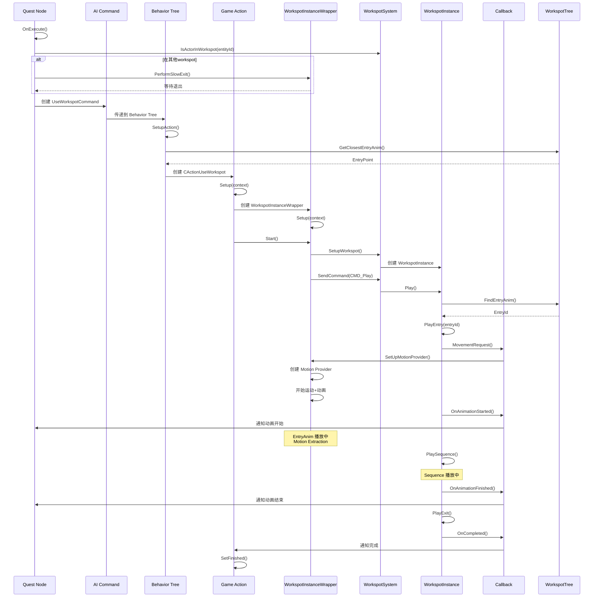

# Workspot 函数调用完整文档

这个文档详细记录了 Workspot 系统从 Quest Node 到 WorkspotSystem 的完整函数调用链路。

---

## 类图

### 完整类继承和组合关系

```mermaid
classDiagram
    %% Quest 层
    class QuestNodeBase {
        +OnExecute()
        +OnActivate()
        +OnDestroy()
    }

    class AICommandNodeBase {
        +CreateAICommand()
    }

    class UseWorkspotNodeDefinition {
        -UseWorkspotParamsV1* m_params
        -EntityReference m_entityReference
        +OnExecute()
        +OnActivate()
        +OnDestroy()
    }

    class UseWorkspotParamsV1 {
        +UseWorkspotNodeFunctions m_function
        +world::NodeRef m_workspotNode
        +Bool m_teleport
        +CName m_animName
        +work::WorkEntryId m_entryId
        +Bool m_jumpToEntry
    }

    %% Listener 层
    class IWorkspotListener {
        <<interface>>
        +OnStarted()*
        +OnFinished()*
        +OnAnimationStarted()*
        +OnAnimationFinished()*
        +OnAnimationMissing()*
    }

    class WorkspotListener {
        -red::WeakPtr~StopWorkspotListenerWrapper~ m_wrapper
        +OnFinished()
        +OnAnimationStarted()
        +OnAnimationFinished()
    }

    class StopWorkspotListenerWrapper {
        -red::SharedPtr~WorkspotListener~ m_workspotListener
        -AI::IWorkspotManager* m_workspotManager
        +OnWorkspotFinished()
        +OnAnimationStarted()
        +OnAnimationFinished()
    }

    %% AI Command 层
    class Command {
        <<base>>
    }

    class BaseUseWorkspotCommand {
        -Bool moveToWorkspot
        -move::MovementType movementType
        -CName forceEntryAnimName
        -Bool jumpToEntry
        -work::WorkEntryId entryId
        +GetWorkspotWorldTransform()*
        +GetWorkspotSetupParameters()
        +CreateSetupWorkspotActionEvent()
    }

    class UseWorkspotCommand {
        -world::NodeRef workspotNode
        +GetWorkspotWorldTransform()
        +CreateSetupWorkspotActionEvent()
    }

    %% Behavior Tree 层
    class ActionTreeNode {
        <<base>>
        +SetupAction()*
    }

    class ActionUseWorkspotNode {
        -ActionUseWorkspotNodeDefinition& m_definition
        +SetupAction()
    }

    class ActionUseCommunityWorkspotNode {
        -ActionUseCommunityWorkspotNodeDefinition& m_definition
        +SetupAction()
    }

    %% Game Action 层
    class CAction {
        <<base>>
        +Setup()
        +OnStart()
        +OnUpdate()
        +OnStop()
    }

    class ActionBaseUseWorkspot {
        -Object* m_owner
        -WorkspotInstanceWrapperPtr m_workspotInstance
        -CompletionCallbackId m_completionCallbackId
        +Setup()
        +OnStart()
        +OnUpdate()
        +OnStop()
        +SetFinished()
    }

    class CActionUseWorkspot {
    }

    %% Workspot Instance 层
    class WorkspotInstanceWrapper {
        -AI::ObjectId m_id
        -WorkspotSetupParameters m_initialParameters
        -ent::Entity* m_owner
        -move::Component* m_movingAgent
        -AnimationControllerComponent* m_animationController
        -WorkspotMovementController m_animMoveController
        -SharedPtr~CallbacksReceiver~ m_callbackInterface
        -Bool m_isActive
        -Bool m_useMotion
        +Setup()
        +Start()
        +Complete()
        +SetUpMotionProvider()
        +TeleportRequest()
        +IsValid()
        +IsActive()
    }

    class IWorkspotInstanceCommFunc {
        <<interface>>
        +OnCompleted()*
        +OnActiveRecordChanged()*
        +OnMovementStateChanged()*
        +TeleportRequest()*
        +MovementRequest()*
        +CalcSlideToSafety()*
        +RequestEnd()*
    }

    class WorkspotInstanceCallbacksReceiver {
        -WeakPtr~WorkspotInstanceWrapper~ m_instance
        +OnCompleted()
        +OnMovementStateChanged()
        +TeleportRequest()
        +MovementRequest()
        +RequestEnd()
    }

    %% WorkspotSystem 层
    class IWorkspotSystem {
        <<interface>>
    }

    class WorkspotSystem {
        -HashMap~EntityID, UniquePtr~WorkspotInstance~~ m_instances
        -HashMap~EntityID, CommandQueue~ m_commandQueues
        -WorkspotCallbackManager m_callbackManager
        -WorkspotSynchronizer m_synchronizer
        +SetupWorkspot()
        +SendCommand()
        +IsActorInWorkspot()
        +ClearExitFlags()
    }

    class WorkspotInstance {
        -WorkspotParams m_workResource
        -SharedPtr~IWorkspotInstanceCommFunc~ m_commFun
        -WorkEntryId m_entryAnimToUse
        +Execute()
        +FindEntryAnim()
        +PlayEntry()
        +PlaySequence()
        +PlayExit()
    }

    %% WorkspotManager 层
    class IWorkspotManager {
        <<interface>>
        +StartWorkspot()*
        +GetCurrentWorkspot()*
    }

    class WorkspotManager {
        -HashMap~EntityID, WorkspotInstanceWrapperPtr~ m_workspots
        +StartWorkspot()
        +GetCurrentWorkspot()
    }

    %% Resource 层
    class WorkspotParams {
        -WorkspotTree* m_tree
        +GetClosestEntryAnim()
        +FindEntryAnim()
        +IsValid()
    }

    class WorkspotTree {
        -THandle~IEntry~ m_rootEntry
        -Uint32 m_idCounter
        -red::TagList m_tags
        +GetClosestEntryAnim()
        +GetClosestExitAnim()
        +FindEntryAnim()
        +FindExitAnim()
    }

    class IEntry {
        <<interface>>
        +Uint32 m_flags
        +WorkEntryId m_id
    }

    class EntryAnim {
        -CName m_animName
        -CName m_idleAnim
        -Transform m_syncOffset
        -CName m_slotName
    }

    class Sequence {
        -red::DynArray~THandle~IEntry~~ m_list
    }

    class ExitAnim {
        -CName m_animName
        -Transform m_movement
    }

    %% 继承关系
    QuestNodeBase <|-- AICommandNodeBase
    AICommandNodeBase <|-- UseWorkspotNodeDefinition
    UseWorkspotNodeDefinition --> UseWorkspotParamsV1 : contains

    IWorkspotListener <|.. WorkspotListener
    IWorkspotListener <|.. StopWorkspotListenerWrapper
    WorkspotListener --> StopWorkspotListenerWrapper : weak ref

    Command <|-- BaseUseWorkspotCommand
    BaseUseWorkspotCommand <|-- UseWorkspotCommand

    ActionTreeNode <|-- ActionUseWorkspotNode
    ActionTreeNode <|-- ActionUseCommunityWorkspotNode

    CAction <|-- ActionBaseUseWorkspot
    ActionBaseUseWorkspot <|-- CActionUseWorkspot
    ActionBaseUseWorkspot --> WorkspotInstanceWrapper : manages

    IWorkspotInstanceCommFunc <|.. WorkspotInstanceCallbacksReceiver
    WorkspotInstanceCallbacksReceiver --> WorkspotInstanceWrapper : weak ref
    WorkspotInstanceWrapper --> WorkspotInstanceCallbacksReceiver : owns

    IWorkspotSystem <|.. WorkspotSystem
    WorkspotSystem --> WorkspotInstance : creates
    WorkspotSystem --> WorkspotCallbackManager : uses

    IWorkspotManager <|.. WorkspotManager
    WorkspotManager --> WorkspotInstanceWrapper : manages

    WorkspotParams --> WorkspotTree : references
    WorkspotInstance --> WorkspotParams : uses
    WorkspotTree --> IEntry : contains
    IEntry <|-- EntryAnim
    IEntry <|-- Sequence
    IEntry <|-- ExitAnim
```



---

## 完整函数调用链路

### 阶段 1：Quest Node 执行

#### 1.1 UseWorkspotNodeDefinition::OnExecute

**文件**: `useWorkspotNode.cpp`
**行号**: 999-1079
**签名**:
```cpp
NodeResult UseWorkspotNodeDefinition::OnExecute(
    NodeExecutionContext& executionContext,
    NodeSocket* inputSocket,
    red::DynArray<THandle<NodeSocket>>& outputSockets
) const
```

**职责**:
- 检查 NPC 是否已在其他 workspot
- 创建 AI Command
- 注册事件监听器

**调用流程**:
```cpp
// 1. 获取 NPC Entity
const ent::EntityID entId = GetPuppetEntityID(executionContext);

// 2. 非传送模式下检查是否在其他 workspot
if (!m_params->m_teleport && !IsPlayerEntityReference())
{
    auto puppet = GetPuppet(executionContext, m_entityReference);
    if (puppet && executionContext.GetWorkspotSystem()->IsActorInWorkspot(puppet->GetEntityID()))
    {
        // 在其他 workspot，先退出
        // → 调用 StopWorkspot (line 128-180)
        auto eventListener = red::CreateSharedPtr<StopWorkspotListenerWrapper>(...);
        executionContext.RegisterEvent(...);
        return NodeResult::StayInNode;
    }
}

// 3. 调用父类创建 AI Command
const NodeResult parentResult = TBaseClass::OnExecute(executionContext, inputSocket, outputSockets);
// → 调用 AICommandNodeBase::OnExecute

// 4. 注册 WorkspotListener
auto eventListener = red::CreateSharedPtr<WorkspotListenerWrapper>(...);
executionContext.RegisterEvent(...);

return result;
```

**调用的函数**:
- `GetPuppetEntityID(executionContext)` - 获取 NPC Entity ID
- `GetPuppet(executionContext, m_entityReference)` - 获取 NPC Puppet 对象
- `IsActorInWorkspot(entityId)` - 检查是否在 workspot（→ WorkspotSystem）
- `StopWorkspot(...)` - 停止 workspot（lines 128-180）
- `AICommandNodeBase::OnExecute(...)` - 创建 AI Command（父类）

---

#### 1.2 StopWorkspot 函数

**文件**: `useWorkspotNode.cpp`
**行号**: 128-180
**签名**:
```cpp
StopWorkspotResult StopWorkspot(
    AI::IWorkspotManager* workspotManager,
    game::IPersistencySystem* persistencySystem,
    const ent::EntityID& entityId,
    Bool immediate = false,
    Bool notifyImmediately = true,
    Bool finishAnimation = true,
    work::WorkEntryId entryId = work::WorkEntryId::invalid,
    CName animName = CName::NONE(),
    Transform exitDir = Transform::IDENTITY()
)
```

**职责**:
- 检查 NPC 当前 workspot 状态
- 取消队列中的 workspot 命令
- 执行 SlowExit 或立即完成

**调用流程**:
```cpp
// 1. 获取持久化状态
const game::PersistentID pid{entityId, AI::CommandQueuePS::GetHardcodedName()};
const THandle<AI::CommandQueuePS> persistentState =
    persistencySystem->AccessPersistentState<AI::CommandQueuePS>(pid);

// 2. 检查命令队列中是否有 UseWorkspot 命令
if (persistentState->GetCommandQueue().IsEnqueued(
    AI::BaseUseWorkspotCommand::GetStaticClass()->GetName(), true))
{
    // 取消命令
    persistentState->GetCommandQueue().Cancel(nullptr, wsCommandInQueue,
                                              AI::CommandStateChangeFlags::DoNotRepeat);
}

// 3. 获取当前 workspot 实例
if (AI::IWorkspotManager::WorkspotInstanceWrapperPtr workspotInstance =
    workspotManager->GetCurrentWorkspot(entityId))
{
    if (workspotInstance->IsValid())
    {
        if (!immediate)
        {
            // 执行 SlowExit
            workspotInstance->PerformSlowExit(finishAnimation, entryId, animName, exitDir);
            return StopWorkspotResult::WaitForStop;
        }
        else
        {
            // 立即完成
            workspotInstance->Complete(notifyImmediately);
            return StopWorkspotResult::Completed;
        }
    }
}

return StopWorkspotResult::AlreadyStopped;
```

**调用的函数**:
- `GetCurrentWorkspot(entityId)` - 获取当前 workspot 实例（→ WorkspotManager）
- `workspotInstance->PerformSlowExit(...)` - 执行慢速退出（→ WorkspotInstanceWrapper）
- `workspotInstance->Complete(...)` - 立即完成 workspot（→ WorkspotInstanceWrapper）

---

### 阶段 2：AI Command 创建

#### 2.1 AICommandNodeBase::OnExecute

**文件**: `aiCommandNodeBase.cpp`（未提供完整代码，根据调用推断）
**职责**:
- 从 Quest Node 参数创建 AI Command
- 将 Command 加入 AI Command Queue

**调用流程**:
```cpp
// 1. 创建 UseWorkspotCommand
UseWorkspotCommand* command = new UseWorkspotCommand();

// 2. 设置参数
command->SetWorkspotNode(m_params->m_workspotNode);
command->SetForceEntryAnimName(m_params->m_animName);
command->SetJumpToEntry(m_params->m_jumpToEntry);
command->SetEntryId(m_params->m_entryId);
// ... 其他参数

// 3. 加入 Command Queue
puppet->GetCommandQueue()->AddCommand(command);
```

**创建的对象**:
- `UseWorkspotCommand` - AI Command 对象

---

### 阶段 3：Behavior Tree 执行

#### 3.1 ActionUseWorkspotNode::SetupAction

**文件**: `aiActionUseWorkspotNode.cpp`
**行号**: 64-127
**签名**:
```cpp
ActionTreeNode::SetupResult ActionUseWorkspotNode::SetupAction(
    ExecutionContext& context
) const
```

**职责**:
- 从 AI Command 提取参数
- 创建 CActionUseWorkspot
- 调用 CActionUseWorkspot::Setup

**调用流程**:
```cpp
// 1. 获取 Puppet
auto* puppet = Cast<game::Puppet>(&context.GetAgent()->GetOwner());
game::CActionAIProxy& proxy = context[i_action];

// 2. 获取或创建 CActionUseWorkspot
game::CActionUseWorkspot::Ptr action = proxy.AcquireAction<game::CActionUseWorkspot>(*puppet);

// 3. 从 AI Command 获取 setup 参数
THandle<game::SetupWorkspotActionEvent> setupData = nullptr;
// ... 从 event data 中提取 ...

if (setupData)
{
    // 4. 配置 action 参数
    setupData->m_parameters.m_autoCompletion = playExitAutomatically;
    setupData->m_parameters.m_markUninterruptable = markWorkspotUninterruptable;

    // 5. 创建初始化上下文
    const game::WorkspotInitializationContext initContext(
        setupData->m_parameters,
        *puppet,
        puppet->GetMovingAgent(),
        setupData->m_mountDescriptor
    );

    // 6. Setup action
    if (action->Setup(initContext))  // ← 调用 CActionUseWorkspot::Setup
    {
        return true;
    }
}

return false;
```

**调用的函数**:
- `proxy.AcquireAction<CActionUseWorkspot>(*puppet)` - 获取或创建 Action
- `action->Setup(initContext)` - 初始化 Action（→ CActionUseWorkspot::Setup）

---

#### 3.2 ActionUseCommunityWorkspotNode::SetupAction

**文件**: `aiActionUseWorkspotNode.cpp`
**行号**: 230-248
**签名**:
```cpp
ActionTreeNode::SetupResult ActionUseCommunityWorkspotNode::SetupAction(
    ExecutionContext& context
) const
```

**职责**:
- 自动选择 EntryAnim（基于距离和阈值）
- 调用父类 SetupAction

**调用流程**:
```cpp
// 1. 自动选择 Entry 动画（如果没有强制指定）
CName entryAnimName = setupData->m_parameters.m_entryAnimation;
if (!entryAnimName && setupData->m_useEntryAnimation)
{
    work::AnimSearchContext cont;
    SetupAnimSearchContext(cont, puppet, puppet->GetSceneSystem<world::AnimationSystem>());

    // 2. 计算 NPC 在 workspot 空间中的位置
    Transform actorInWorkspotSpace =
        setupData->m_parameters.m_workspotTransform.TransformInv(puppet->GetWorldTransform());

    // 3. 查找最近的 Entry Point
    work::EntryPoint point = setupData->m_parameters.m_workspot.GetClosestEntryAnim(
        actorInWorkspotSpace, cont);
    // → 调用 WorkspotParams::GetClosestEntryAnim
    // → 调用 WorkspotTree::GetClosestEntryAnim

    // 4. 检查 NPC 是否足够接近这个 Entry Point
    Quaternion rotationDiff = point.m_transform.GetOrientation().Conjugated() *
                              actorInWorkspotSpace.GetOrientation();
    Vector3 positionDiff = point.m_transform.GetPosition() -
                           actorInWorkspotSpace.GetPosition();

    // 进入阈值判定
    if (rotationDiff.GetAngle() < DEG2RAD(20.f) &&   // 旋转差异 < 20度
        positionDiff.Z < 0.1f &&                      // Z轴差异 < 0.1米
        positionDiff.AsVector2().Mag() < 0.03f)       // XY平面差异 < 0.03米
    {
        // NPC 已经在 Entry Point 附近，直接使用这个 EntryAnim
        setupData->m_parameters.m_entryAnimation = point.m_animName;
    }
}

// 5. 初始化 action
const game::WorkspotInitializationContext initContext(...);
if (action->Setup(initContext))
{
    return true;
}

return false;
```

**调用的函数**:
- `SetupAnimSearchContext(cont, puppet, animSystem)` - 设置动画搜索上下文
- `GetClosestEntryAnim(actorInWorkspotSpace, cont)` - 查找最近的 EntryAnim（→ WorkspotTree）
- `action->Setup(initContext)` - 初始化 Action（→ CActionUseWorkspot::Setup）

---

### 阶段 4：Game Action 初始化

#### 4.1 ActionBaseUseWorkspot::Setup

**文件**: `actionUseWorkspot.cpp`
**行号**: 25-58
**签名**:
```cpp
Bool ActionBaseUseWorkspot::Setup(
    const WorkspotInitializationContext& context
)
```

**职责**:
- 创建 WorkspotInstanceWrapper
- 设置 workspot 实例
- 注册完成回调

**调用流程**:
```cpp
const WorkspotSetupParameters& params = context.m_initialParameters;

if (!params.m_workspot.IsValid())
{
    RED_DBGCTX_FAIL("Invalid workspot passed to the action");
    return false;
}

m_owner = &context.m_owner;
m_spotNodeId = context.m_initialParameters.m_nodeId;

// 1. 获取 WorkspotManager
AI::IWorkspotManager* workspotManager = m_owner->GetGameSystem<AI::IWorkspotManager>();
RED_ASSERT(workspotManager);

// 2. 创建 WorkspotInstanceWrapper
m_workspotInstance = workspotManager->StartWorkspot(m_owner->GetEntityID());
// → 调用 WorkspotManager::StartWorkspot

if (!m_workspotInstance)
{
    RED_DBGCTX_FAIL("Couldn't obtain a workspot instance from game system");
    return false;
}

// 3. 设置 workspot 实例
m_workspotInstance->SetDependentWorkspot(nullptr);
m_workspotInstance->Setup(context);  // ← 初始化 workspot 实例
// → 调用 WorkspotInstanceWrapper::Setup

// 4. 注册完成回调
m_completionCallbackId = m_workspotInstance->RegisterCompletionCallback([this] {
    RED_AI_LOGF(m_owner, "action",
                "%hs received completion callback from workspot instance.",
                GetDescription().AsChar());
    SetFinished();
});

SetReady();
return true;
```

**调用的函数**:
- `GetGameSystem<AI::IWorkspotManager>()` - 获取 WorkspotManager
- `workspotManager->StartWorkspot(entityId)` - 创建 WorkspotInstanceWrapper（→ WorkspotManager）
- `m_workspotInstance->Setup(context)` - 初始化实例（→ WorkspotInstanceWrapper）
- `m_workspotInstance->RegisterCompletionCallback(callback)` - 注册回调

---

#### 4.2 ActionBaseUseWorkspot::OnStart

**文件**: `actionUseWorkspot.cpp`
**行号**: 84-103
**签名**:
```cpp
void ActionBaseUseWorkspot::OnStart()
```

**职责**:
- 启动 workspot 实例
- 处理快进（从存档恢复）
- 设置 LOD

**调用流程**:
```cpp
if (HasFlag(EActionFlags::COMMAND_ACTION))
{
    m_owner->GetGameSystem<AI::IWorkspotManager>()->RestoreWorkspotSavedata(m_owner->GetEntityID());
}

RED_ASSERT(m_workspotInstance);

// 启动 workspot 实例（关键！）
m_workspotInstance->Start();
// → 调用 WorkspotInstanceWrapper::Start

// 快进支持（用于加载游戏时恢复 workspot 状态）
if (GetInitialTimeProgress() > .0f)
{
    red::UniquePtr<work::FastForwardData> data = red::CreateUniquePtr<work::FastForwardData>();
    data->m_forceTime = GetInitialTimeProgress();
    m_owner->GetSceneSystem<work::WorkspotSystem>()->SendCommand(
        m_owner->GetEntityID(), work::CMD_FastForward, std::move(data));
    // → 调用 WorkspotSystem::SendCommand
    ProgressSet();
}

m_owner->GetSceneSystem<world::RuntimeSystemEntity>()->ScheduleEntitySetLOD(
    HandleFromPtr(m_owner), ent::EntityLOD::UsingWorkspotThroughUseWorkspotAction);
```

**调用的函数**:
- `m_workspotInstance->Start()` - 启动实例（→ WorkspotInstanceWrapper::Start）
- `SendCommand(entityId, CMD_FastForward, data)` - 发送快进命令（→ WorkspotSystem）
- `ScheduleEntitySetLOD(...)` - 设置 LOD

---

### 阶段 5：WorkspotInstanceWrapper 执行

#### 5.1 WorkspotInstanceWrapper::Setup

**文件**: `workspot.cpp`（Setup 方法未在提供的代码中，根据调用推断）
**职责**:
- 保存初始化参数
- 获取组件引用（AnimationController、MovingAgent）
- 初始化运动控制器

**调用流程**:
```cpp
// 1. 保存参数
m_initialParameters = context.m_initialParameters;
m_owner = &context.m_owner;
m_movingAgent = context.m_movingAgent;

// 2. 获取 AnimationController
m_animationController = m_owner->GetComponent<ent::AnimationControllerComponent>();

// 3. 初始化运动控制器
m_animMoveController.Initialize(m_owner, m_movingAgent);

// 4. 确定是否使用运动系统
m_useMotion = !m_initialParameters.m_teleport && m_movingAgent != nullptr;
```

---

#### 5.2 WorkspotInstanceWrapper::Start

**文件**: `workspot.cpp`
**行号**: 240-380
**签名**:
```cpp
void WorkspotInstanceWrapper::Start()
```

**职责**:
- 设置运动控制器（非传送模式）
- 创建 AdjustCommand（如果需要滑动）
- 注册到 WorkspotSystem
- 发送播放命令

**调用流程**:
```cpp
RED_ASSERT(IsValid());

m_isActive = true;

work::WorkspotSystem* workspotSystem = m_owner->GetSceneSystem<work::WorkspotSystem>();
RED_ASSERT(workspotSystem);
const ent::EntityID& ownerId = m_owner->GetEntityID();

// 1. 检查 NPC 是否已经在这个 workspot 中
const Bool alreadyInWorkspot = workspotSystem->IsActorInWorkspot(ownerId, m_initialParameters.m_workspot);
// → 调用 WorkspotSystem::IsActorInWorkspot

const Bool canReuseWorkspot = m_callbackInterface != nullptr;

// 2. 如果使用运动系统（非传送模式）
if (m_useMotion)
{
    // 2.1 计算地面贴合（如果需要）
    const Bool snapToGround = m_initialParameters.m_workspot.m_tree->ShouldSnapToTerrain() ||
                              m_initialParameters.m_snapToGround;
    if(snapToGround)
    {
        Transform adjustedTransform;
        CalcSlideToSafety(m_initialParameters.m_workspotTransform, adjustedTransform);
        m_initialParameters.m_workspotTransform =
            m_initialParameters.m_workspotTransform.TransformXForm(adjustedTransform);
    }

    // 2.2 如果 NPC 不在 workspot 中且配置了 slideTime
    if (!IsOwnerInWorkspot(m_initialParameters.m_workspot))
    {
        if (m_initialParameters.m_slideTime > 0.f)
        {
            // 创建 Adjust 命令 - 在播放 EntryAnim 前滑动到正确位置
            m_adjustCommand = red::CreateUniquePtr<work::AdjustAndPlayCommandData>();

            const WorldTransform currentTransform = m_owner->HasDependentTransform() ?
                m_owner->GetLocalTransformAsWorld() : m_owner->GetWorldTransform();
            const WorldTransform entrySlotSpace =
                m_initialParameters.m_workspotTransform.TransformXForm(m_initialParameters.m_entryPositionLS);

            // 计算当前位置到 Entry Point 的差值
            const Transform deltaSlotSpace = currentTransform.TransformInv(entrySlotSpace);

            m_adjustCommand->m_adjustDelta = deltaSlotSpace;
            m_adjustCommand->m_adjustTime = m_initialParameters.m_slideTime;
            m_adjustCommand->m_globalBlendDuration = m_initialParameters.m_globalBlendDuration;
            m_adjustCommand->m_playbackDelay = m_initialParameters.m_playbackDelay;
        }
    }

    // 2.3 设置运动控制器
    m_movingAgent->ForceRawRepresentation(true);
    m_movingAgent->AttachLocomotionController(m_animMoveController);  // ← 附加动画驱动的运动控制器
    if (m_parentId.IsDefined())
    {
        m_movingAgent->MountToVirtualParent(m_parentId, m_parentSlotName);
    }
}

// 3. 如果无法复用或不在 workspot 中
if (!canReuseWorkspot || !alreadyInWorkspot)
{
    PlayDependentWorkspot();

    // 3.1 创建回调接口
    m_callbackInterface = red::CreateSharedPtr<WorkspotInstanceCallbacksReceiver>(SharedFromThis());

    // 3.2 设置同步信息
    work::SyncedWorkspotInfo syncInfo = { m_initialParameters.m_masterWsOwner };

    // 3.3 向 WorkspotSystem 注册 workspot
    workspotSystem->SetupWorkspot(
        HandleFromPtr(m_owner),
        {
            m_initialParameters.m_workspot,           // workspot 参数
            m_initialParameters.m_nodeId,             // 节点 ID
            m_callbackInterface,                      // 回调接口
            m_initialParameters.m_entryAnimation,     // EntryAnim 名称
            m_initialParameters.m_exitAnimation,      // ExitAnim 名称
            m_initialParameters.m_isWorkspotStatic,
            m_initialParameters.m_globalItemManager,
            m_initialParameters.m_itemOverride,
            m_initialParameters.m_clippingSpace,
            m_initialParameters.m_disableInertiaBlend
        },
        m_initialParameters.m_masterWsOwner ? &syncInfo : nullptr
    );
    // → 调用 WorkspotSystem::SetupWorkspot

    // 3.4 发送播放命令
    if (m_adjustCommand)
    {
        // 如果有 Adjust 命令，先调整位置再播放
        workspotSystem->SendCommand(ownerId, work::CMD_Adjust_And_Play, std::move(m_adjustCommand));
    }
    else
    {
        // 否则直接播放
        workspotSystem->SendCommand(ownerId, work::CMD_Play);  // ← 开始播放 workspot
    }
    // → 调用 WorkspotSystem::SendCommand

    // ... 其他命令（startup functor, cleanup 等）...
}
else if (m_initialParameters.m_resumePlayback)
{
    // 4. 复用现有 workspot 并恢复播放
    m_callbackInterface->OnInstanceReused(SharedFromThis());
    workspotSystem->SendCommand(ownerId, work::CMD_Stop);
    workspotSystem->SendCommand(ownerId, work::CMD_Play);
}
else
{
    // 5. 复用现有 workspot 但不恢复播放
    m_callbackInterface->OnInstanceReused(SharedFromThis());
    workspotSystem->ClearExitFlags(ownerId);
    workspotSystem->ClearPlayStopFlag(ownerId);
    // ...
}

// 6. 如果需要跳转到特定 Entry
if (m_initialParameters.m_jumpToEntry)
{
    JumpToEntry(m_initialParameters.m_entryId, m_initialParameters.m_entryTag);
}
```

**调用的函数**:
- `IsActorInWorkspot(ownerId, workspotParams)` - 检查是否在 workspot（→ WorkspotSystem）
- `CalcSlideToSafety(...)` - 计算地面贴合
- `IsOwnerInWorkspot(workspotParams)` - 检查是否在 workspot 内
- `AttachLocomotionController(m_animMoveController)` - 附加运动控制器
- `SetupWorkspot(...)` - 注册到 WorkspotSystem（→ WorkspotSystem）
- `SendCommand(ownerId, cmd, data)` - 发送命令（→ WorkspotSystem）
- `JumpToEntry(entryId, entryTag)` - 跳转到指定 Entry

---

#### 5.3 WorkspotInstanceWrapper::SetUpMotionProvider

**文件**: `workspot.cpp`
**行号**: 556-606
**签名**:
```cpp
void WorkspotInstanceWrapper::SetUpMotionProvider(
    Transform transform,        // 目标 Transform（Entry Point 位置）
    Transform* startLocation,   // 起始位置
    Float logicDuration,        // 逻辑持续时间
    CName animName,             // EntryAnim 名称
    Float forceTime,            // 强制时间
    const Uint32 recordFlags,   // Entry 标志（SlowEnter/SlowExit 等）
    Bool forceSnapToTerrain
)
```

**职责**:
- 创建 Motion Provider（运动提供者）
- 从动画中提取运动数据
- 启动动画驱动的运动

**调用流程**:
```cpp
if (!m_animationController)
    return;

anim::MotionProvider provider;
const WorldTransform startLocPS = m_owner->GetLocalTransformAsWorld();

// 设置 NavMesh 贴合选项
m_animMoveController.StickToNavmesh(recordFlags & work::IEntry::StayOnNavmesh);
const Bool zSnap = (recordFlags & work::IEntry::SnapZToNavmesh) ||
                   m_initialParameters.m_workspot.m_tree->ShouldSnapToTerrain() ||
                   forceSnapToTerrain;
m_animMoveController.EnableSnapZToNavmesh(zSnap);

auto trajectoryTargetObject = m_initialParameters.m_trajectoryTargetObject.ToHandle();

// 处理 SlowEnter（EntryAnim）
if ((recordFlags & work::IEntry::SlowEnter) != 0)
{
    if (trajectoryTargetObject && trajectoryTargetObject->GetState() == ent::EntityState::Attached)
    {
        // 动态 workspot entry（目标会移动）
        red::SharedPtr<MotionProviderTarget_DynamicWorkspotEnter> target =
            red::CreateSharedPtr<MotionProviderTarget_DynamicWorkspotEnter>(
                HandleFromPtr(m_owner), trajectoryTargetObject, m_initialParameters.m_trajectoryTargetOffset);

        // 创建带动画的运动提供者
        m_animationController->CreateMotionProviderWithTarget(
            animName,           // ← EntryAnim 名称
            CName::NONE(),      // 无 slot 名称
            logicDuration,      // 逻辑持续时间
            target,             // 目标位置
            logicDuration,
            std::numeric_limits<Float>::max(),
            std::numeric_limits<Float>::max(),
            std::numeric_limits<Float>::max(),
            std::numeric_limits<Float>::max(),
            0.f,
            true,  // useMotionExtraction = true ← 从动画中提取运动数据
            true,  // applyMotion = true
            false,
            provider
        );
        // → 调用 AnimationController::CreateMotionProviderWithTarget

        // 开始运动
        m_animMoveController.MoveWithMotionProvider(provider, 0, &startLocPS);
        // → 调用 WorkspotMovementController::MoveWithMotionProvider
    }
    else
    {
        // 静态 workspot entry
        const Transform targetLS = startLocPS.TransformInv(m_animMoveController.GetLocationPS());
        red::SharedPtr<anim::SimpleMotionProviderTarget> target =
            red::CreateSharedPtr<anim::SimpleMotionProviderTarget>(targetLS);

        m_animationController->CreateMotionProviderWithTarget(
            animName,  // ← EntryAnim 名称
            CName::NONE(),
            logicDuration,
            target,
            logicDuration,
            std::numeric_limits<Float>::max(),
            std::numeric_limits<Float>::max(),
            std::numeric_limits<Float>::max(),
            std::numeric_limits<Float>::max(),
            0.f,
            true,   // useMotionExtraction = true ← 从动画中提取运动数据
            true,   // applyMotion = true
            true,   // useWorldSpace = true
            provider
        );

        // 开始运动
        m_animMoveController.MoveWithMotionProvider(provider, 0, &startLocPS);
    }
}
// ... SlowExit 和 FastExit 的处理 ...
```

**调用的函数**:
- `StickToNavmesh(flag)` - 设置 NavMesh 贴合
- `EnableSnapZToNavmesh(flag)` - 启用 Z 轴贴合
- `CreateMotionProviderWithTarget(...)` - 创建运动提供者（→ AnimationController）
- `MoveWithMotionProvider(provider, ...)` - 开始运动（→ MovementController）

---

### 阶段 6：WorkspotSystem 执行

#### 6.1 WorkspotSystem::SetupWorkspot

**文件**: `workspotSystem.cpp`（具体实现未在提供的代码中）
**签名**:
```cpp
void WorkspotSystem::SetupWorkspot(
    THandle<ent::Entity> entity,
    const WorkspotSetupContext& context,
    const SyncedWorkspotInfo* syncInfo = nullptr
)
```

**职责**:
- 创建 WorkspotInstance
- 注册到实例映射表
- 保存回调接口
- 解析 WorkspotTree

**调用流程**:
```cpp
const ent::EntityID entityId = entity->GetEntityID();

// 1. 创建 WorkspotInstance
red::UniquePtr<work::WorkspotInstance> instance = red::CreateUniquePtr<work::WorkspotInstance>();
instance->Setup(context);
// → 调用 WorkspotInstance::Setup

// 2. 注册到映射表
m_instances.Insert(entityId, std::move(instance));

// 3. 保存回调接口
work::WorkspotInstance* inst = m_instances[entityId].Get();
inst->SetCommFunc(context.m_commFun);

// 4. 如果有同步信息，注册到同步器
if (syncInfo)
{
    m_synchronizer.RegisterSyncedWorkspot(entityId, *syncInfo);
}
```

**调用的函数**:
- `WorkspotInstance::Setup(context)` - 初始化 WorkspotInstance
- `m_synchronizer.RegisterSyncedWorkspot(...)` - 注册同步 workspot

---

#### 6.2 WorkspotSystem::SendCommand

**文件**: `workspotSystem.cpp`
**签名**:
```cpp
void WorkspotSystem::SendCommand(
    const ent::EntityID& entityId,
    Uint32 cmd,
    red::UniquePtr<IWorkspotCommandData> data = nullptr
)
```

**职责**:
- 将命令加入命令队列
- 下一帧执行命令

**调用流程**:
```cpp
// 1. 验证命令数据
helper::ValidateCommandData(cmd, data);

// 2. 找到 WorkspotInstance
auto it = m_instances.Find(entityId);
if (it == m_instances.End())
{
    RED_LOG_WARNING("Trying to send command to non-existent workspot instance");
    return;
}

// 3. 将命令加入队列
CommandQueue& queue = m_commandQueues[entityId];
queue.Push({ cmd, std::move(data) });
```

---

#### 6.3 WorkspotSystem::Update (每帧执行)

**文件**: `workspotSystem.cpp`（具体实现未在提供的代码中）
**签名**:
```cpp
void WorkspotSystem::Update(Float deltaTime)
```

**职责**:
- 处理命令队列
- 更新所有 WorkspotInstance
- 触发回调

**调用流程**:
```cpp
// 1. 遍历所有实例
for (auto& [entityId, instance] : m_instances)
{
    // 2. 处理命令队列
    CommandQueue& queue = m_commandQueues[entityId];
    while (!queue.IsEmpty())
    {
        Command cmd = queue.Pop();
        ProcessCommand(entityId, instance.Get(), cmd);
        // → 调用 WorkspotSystem::ProcessCommand
    }

    // 3. 更新实例
    instance->Execute(deltaTime);
    // → 调用 WorkspotInstance::Execute
}
```

**调用的函数**:
- `ProcessCommand(entityId, instance, cmd)` - 处理命令
- `instance->Execute(deltaTime)` - 更新实例

---

#### 6.4 WorkspotSystem::ProcessCommand

**文件**: `workspotSystem.cpp`（根据调用推断）
**签名**:
```cpp
void WorkspotSystem::ProcessCommand(
    const ent::EntityID& entityId,
    work::WorkspotInstance* instance,
    const Command& cmd
)
```

**职责**:
- 根据命令类型执行不同操作

**调用流程**:
```cpp
switch (cmd.type)
{
case work::CMD_Play:
{
    instance->Play();
    // → 调用 WorkspotInstance::Play
    break;
}

case work::CMD_Stop:
{
    instance->Stop();
    // → 调用 WorkspotInstance::Stop
    break;
}

case work::CMD_Adjust_And_Play:
{
    const work::AdjustAndPlayCommandData* data = Cast<work::AdjustAndPlayCommandData>(cmd.data.Get());
    instance->AdjustAndPlay(data->m_adjustDelta, data->m_adjustTime);
    // → 调用 WorkspotInstance::AdjustAndPlay
    break;
}

case work::CMD_JumpToEntry:
{
    const work::JumpToCommandData* data = Cast<work::JumpToCommandData>(cmd.data.Get());
    instance->JumpToEntry(data->m_entryId, data->m_entryTag);
    // → 调用 WorkspotInstance::JumpToEntry
    break;
}

case work::CMD_FastExit:
{
    instance->FastExit();
    // → 调用 WorkspotInstance::FastExit
    break;
}

case work::CMD_SlowExit:
{
    const work::SlowExitCommandData* data = Cast<work::SlowExitCommandData>(cmd.data.Get());
    instance->SlowExit(data->m_entryId, data->m_animName, data->m_exitDir);
    // → 调用 WorkspotInstance::SlowExit
    break;
}

case work::CMD_EventListener:
{
    const work::EventListenerCommandData* data = Cast<work::EventListenerCommandData>(cmd.data.Get());
    if (data->m_mode == work::EventListenerCommandData::Mode::Register)
    {
        m_callbackManager.RegisterListener(entityId, data->m_listener);
    }
    else
    {
        m_callbackManager.UnregisterListener(entityId, data->m_listener);
    }
    break;
}

// ... 其他命令
}
```

**调用的函数**:
- `instance->Play()` - 开始播放
- `instance->Stop()` - 停止
- `instance->AdjustAndPlay(...)` - 调整并播放
- `instance->JumpToEntry(...)` - 跳转到 Entry
- `instance->FastExit()` - 快速退出
- `instance->SlowExit(...)` - 慢速退出
- `m_callbackManager.RegisterListener(...)` - 注册监听器

---

### 阶段 7：WorkspotInstance 执行

#### 7.1 WorkspotInstance::Play

**文件**: `gameWorkspotsInstance.cpp`（根据调用推断）
**签名**:
```cpp
void WorkspotInstance::Play()
```

**职责**:
- 开始播放 WorkspotTree
- 如果有 EntryAnim，先播放 EntryAnim
- 然后进入 Sequence

**调用流程**:
```cpp
// 1. 查找 EntryAnim
work::WorkEntryId entryId = FindEntryAnim(m_entryAnimToUse);
// → 调用 WorkspotInstance::FindEntryAnim

if (entryId != work::WorkEntryId::invalid)
{
    // 2. 播放 EntryAnim
    PlayEntry(entryId);
    // → 调用 WorkspotInstance::PlayEntry
}
else
{
    // 3. 没有 EntryAnim，直接播放 Sequence
    PlaySequence();
    // → 调用 WorkspotInstance::PlaySequence
}
```

**调用的函数**:
- `FindEntryAnim(animName)` - 查找 EntryAnim
- `PlayEntry(entryId)` - 播放 EntryAnim
- `PlaySequence()` - 播放 Sequence

---

#### 7.2 WorkspotInstance::FindEntryAnim

**文件**: `gameWorkspotsInstance.cpp`
**行号**: 188-195
**签名**:
```cpp
work::WorkEntryId WorkspotInstance::FindEntryAnim(CName animName) const
```

**职责**:
- 在 WorkspotTree 中查找指定名称的 EntryAnim

**调用流程**:
```cpp
if (!m_workResource)
{
    return work::WorkEntryId::invalid;
}

return m_workResource->FindEntryAnim(animName);
// → 调用 WorkspotParams::FindEntryAnim
// → 调用 WorkspotTree::FindEntryAnim
```

**调用的函数**:
- `WorkspotParams::FindEntryAnim(animName)` - 查找 EntryAnim（→ WorkspotTree）

---

#### 7.3 WorkspotInstance::PlayEntry

**文件**: `gameWorkspotsInstance.cpp`（根据调用推断）
**签名**:
```cpp
void WorkspotInstance::PlayEntry(work::WorkEntryId entryId)
```

**职责**:
- 播放 EntryAnim
- 通过回调接口请求运动或传送

**调用流程**:
```cpp
// 1. 获取 EntryAnim 数据
const work::IEntry* entry = m_workResource->GetEntry(entryId);
const work::EntryAnim* entryAnim = Cast<work::EntryAnim>(entry);

// 2. 检查是否需要运动（SlowEnter）
if (entryAnim->m_flags & work::IEntry::SlowEnter)
{
    // 需要运动，调用 MovementRequest 回调
    if (m_commFun)
    {
        m_commFun->MovementRequest(
            entryAnim->m_transform,        // 目标位置
            nullptr,                       // 起始位置（nullptr 使用当前位置）
            entryAnim->m_logicDuration,    // 逻辑持续时间
            entryAnim->m_animName,         // EntryAnim 名称
            0.f,                           // forceTime
            entryAnim->m_flags,            // 标志
            false                          // forceSnapToTerrain
        );
        // → 调用 WorkspotInstanceCallbacksReceiver::MovementRequest
    }
}
else
{
    // 不需要运动，直接传送
    if (m_commFun)
    {
        m_commFun->TeleportRequest(
            entryAnim->m_transform,        // 目标位置
            true                           // snapToZ
        );
        // → 调用 WorkspotInstanceCallbacksReceiver::TeleportRequest
    }
}

// 3. 触发 OnAnimationStarted 回调
m_callbackManager->OnAnimationStarted(
    m_entityId, m_originId, entryId, entryAnim->m_flags, entryAnim->m_animName, false);
```

**调用的函数**:
- `m_workResource->GetEntry(entryId)` - 获取 Entry 数据
- `m_commFun->MovementRequest(...)` - 请求运动（→ WorkspotInstanceCallbacksReceiver）
- `m_commFun->TeleportRequest(...)` - 请求传送（→ WorkspotInstanceCallbacksReceiver）
- `m_callbackManager->OnAnimationStarted(...)` - 触发回调（→ 所有 IWorkspotListener）

---

### 阶段 8：回调处理

#### 8.1 WorkspotInstanceCallbacksReceiver::MovementRequest

**文件**: `workspot.cpp`
**行号**: 50-59
**签名**:
```cpp
void WorkspotInstanceCallbacksReceiver::MovementRequest(
    Transform transform,        // 目标 Transform（Entry Point 位置）
    Transform* startLocation,   // 起始位置
    Float logicDuration,        // 逻辑持续时间
    CName animName,             // EntryAnim 名称
    Float forceTime,            // 强制时间
    const Uint32 recordFlags,   // Entry 标志（SlowEnter/SlowExit 等）
    Bool forceSnapToTerrain
)
```

**职责**:
- 转发到 WorkspotInstanceWrapper

**调用流程**:
```cpp
if (auto instance = m_instance.Lock())
{
    if (instance->UsesMotion())
    {
        // 设置运动提供者，开始运动+动画
        instance->SetUpMotionProvider(transform, startLocation, logicDuration,
                                      animName, forceTime, recordFlags, forceSnapToTerrain);
        // → 调用 WorkspotInstanceWrapper::SetUpMotionProvider
    }
}
```

**调用的函数**:
- `instance->SetUpMotionProvider(...)` - 设置运动提供者（→ WorkspotInstanceWrapper）

---

#### 8.2 WorkspotCallbackManager::OnAnimationStarted

**文件**: `workspotCallbackManager.cpp`（根据调用推断）
**签名**:
```cpp
void WorkspotCallbackManager::OnAnimationStarted(
    const ent::EntityID& puppetID,
    const work::OriginId& originId,
    const work::WorkEntryId& entryId,
    Uint32 flags,
    CName animationName,
    Bool fastForward
)
```

**职责**:
- 触发所有注册的 IWorkspotListener

**调用流程**:
```cpp
// 1. 查找注册的监听器
auto it = m_listeners.Find(puppetID);
if (it == m_listeners.End())
    return;

// 2. 遍历所有监听器
for (auto& listener : it->Second)
{
    listener->OnAnimationStarted(puppetID, originId, entryId, flags, animationName, fastForward);
    // → 调用 IWorkspotListener::OnAnimationStarted
    // → 例如 WorkspotListener::OnAnimationStarted
}
```

**调用的函数**:
- `listener->OnAnimationStarted(...)` - 触发监听器（→ IWorkspotListener 实现）

---

#### 8.3 WorkspotListener::OnAnimationStarted

**文件**: `useWorkspotNode.cpp`
**行号**: 626-636
**签名**:
```cpp
void WorkspotListener::OnAnimationStarted(
    const ent::EntityID& puppetID,
    const work::OriginId& originId,
    const work::WorkEntryId& entryId,
    Uint32 flags,
    CName animationName,
    Bool fastForward
)
```

**职责**:
- 通知 StopWorkspotListenerWrapper

**调用流程**:
```cpp
// TODO: We should take originId into account here
if (auto wrapper = m_wrapper.Lock())
{
    if (wrapper->GetFunction() == UseWorkspotNodeFunctions::UseWorkspot)
    {
        wrapper->OnAnimationStarted(puppetID, entryId, flags, animationName, fastForward);
        // → 调用 StopWorkspotListenerWrapper::OnAnimationStarted
    }
}
```

**调用的函数**:
- `wrapper->OnAnimationStarted(...)` - 通知包装器（→ StopWorkspotListenerWrapper）

---

#### 8.4 StopWorkspotListenerWrapper::OnAnimationStarted

**文件**: `useWorkspotNode.cpp`
**行号**: 476-490
**签名**:
```cpp
void OnAnimationStarted(
    const ent::EntityID& puppetID,
    const work::WorkEntryId& entryId,
    Uint32 flags,
    CName animName,
    Bool fastForward
)
```

**职责**:
- 检测工作是否开始
- 激活 Quest Node 的 "Work Started" socket

**调用流程**:
```cpp
if (!IsWorkStarted())  // 是否首次动画
{
    if (puppetID == m_entityId)
    {
        // 如果不是 EnterNode，说明已经开始工作
        if ((flags & work::IEntry::EnterNode) == 0)
        {
            NotifyWorkStarted(fastForward);  // ← 激活 "Work Started" socket
            // → 调用 StopWorkspotListenerWrapper::NotifyWorkStarted
        }
    }
}
```

**调用的函数**:
- `NotifyWorkStarted(fastForward)` - 通知工作开始

---

### 阶段 9：资源层查找

#### 9.1 WorkspotTree::GetClosestEntryAnim

**文件**: `workspotResource.cpp`
**行号**: 954-972
**签名**:
```cpp
work::EntryPoint WorkspotTree::GetClosestEntryAnim(
    const Transform& posLS,
    const AnimSearchContext& context
) const
```

**职责**:
- 遍历所有 EntryAnim
- 计算距离
- 返回最近的 EntryPoint

**调用流程**:
```cpp
work::EntryPoint res;
Float currMaxDistance = std::numeric_limits<Float>::max();

// Lambda 函数：评估每个 EntryAnim 的距离
std::function<void(EntryAnim*)> nodeFun = [this, &posLS, &context, &res, &currMaxDistance](EntryAnim* entryAnim)
{
    return helper::EvaluateDistance<EntryAnim, true>(
        entryAnim, context, posLS, res, currMaxDistance, this);
};

if (m_rootEntry)
{
    CheckConditionContext cont;
    helper::SetupCheckConditionContext(cont, context);

    // 遍历所有 EntryAnim，找到距离最近的
    helper::ForEachNodeConditional<EntryAnim>(m_rootEntry, cont, nodeFun);
}

return res;
```

**调用的函数**:
- `helper::EvaluateDistance<EntryAnim, true>(...)` - 评估距离
- `helper::ForEachNodeConditional<EntryAnim>(...)` - 遍历 EntryAnim

---

#### 9.2 WorkspotTree::FindEntryAnim

**文件**: `workspotResource.cpp`
**行号**: 1492（行号根据 Grep 结果推断）
**签名**:
```cpp
work::WorkEntryId WorkspotTree::FindEntryAnim(CName animName) const
```

**职责**:
- 根据动画名称查找 EntryAnim 的 ID

**调用流程**:
```cpp
if (!m_rootEntry)
    return work::WorkEntryId::invalid;

// 遍历所有 Entry
std::function<work::WorkEntryId(const work::IEntry*)> findFn =
    [&](const work::IEntry* entry) -> work::WorkEntryId
{
    if (const work::EntryAnim* entryAnim = Cast<work::EntryAnim>(entry))
    {
        if (entryAnim->m_animName == animName)
        {
            return entryAnim->m_id;
        }
    }
    return work::WorkEntryId::invalid;
};

return helper::ForEachNodeUntil<work::IEntry>(m_rootEntry, findFn);
```

---

## 完整调用序列图



---

## 关键函数速查表

| 函数名 | 文件 | 行号 | 职责 |
|--------|------|------|------|
| **UseWorkspotNodeDefinition::OnExecute** | useWorkspotNode.cpp | 999-1079 | Quest Node 入口，检查状态，创建 AI Command |
| **StopWorkspot** | useWorkspotNode.cpp | 128-180 | 停止 workspot，执行退出 |
| **ActionUseWorkspotNode::SetupAction** | aiActionUseWorkspotNode.cpp | 64-127 | Behavior Tree 节点，创建 CActionUseWorkspot |
| **ActionUseCommunityWorkspotNode::SetupAction** | aiActionUseWorkspotNode.cpp | 230-248 | 自动选择 EntryAnim |
| **ActionBaseUseWorkspot::Setup** | actionUseWorkspot.cpp | 25-58 | 创建 WorkspotInstanceWrapper |
| **ActionBaseUseWorkspot::OnStart** | actionUseWorkspot.cpp | 84-103 | 启动 WorkspotInstanceWrapper |
| **WorkspotInstanceWrapper::Start** | workspot.cpp | 240-380 | 注册到 WorkspotSystem，发送播放命令 |
| **WorkspotInstanceWrapper::SetUpMotionProvider** | workspot.cpp | 556-606 | 创建 Motion Provider，启动运动 |
| **WorkspotSystem::SetupWorkspot** | workspotSystem.cpp | - | 注册 workspot 实例 |
| **WorkspotSystem::SendCommand** | workspotSystem.cpp | - | 发送命令到队列 |
| **WorkspotInstance::FindEntryAnim** | gameWorkspotsInstance.cpp | 188-195 | 查找 EntryAnim |
| **WorkspotTree::GetClosestEntryAnim** | workspotResource.cpp | 954-972 | 查找最近的 EntryAnim |
| **WorkspotTree::FindEntryAnim** | workspotResource.cpp | ~1492 | 根据名称查找 EntryAnim |
| **WorkspotListener::OnAnimationStarted** | useWorkspotNode.cpp | 626-636 | 监听动画开始事件 |
| **WorkspotListener::OnAnimationFinished** | useWorkspotNode.cpp | 638-650 | 监听动画结束事件 |
| **WorkspotListener::OnFinished** | useWorkspotNode.cpp | 617-624 | 监听 workspot 完成事件 |

---

## 总结

这个文档详细记录了 Workspot 系统从 Quest Node 到最终执行的完整调用链路，包括：

1. **Quest 层**：UseWorkspotNodeDefinition::OnExecute → 创建 AI Command
2. **AI Command 层**：UseWorkspotCommand → 传递参数
3. **Behavior Tree 层**：ActionUseWorkspotNode::SetupAction → 自动选择 EntryAnim
4. **Game Action 层**：CActionUseWorkspot::Setup/OnStart → 管理生命周期
5. **实例层**：WorkspotInstanceWrapper::Start → 注册和启动
6. **系统层**：WorkspotSystem::SetupWorkspot/SendCommand → 管理和命令
7. **执行层**：WorkspotInstance::Play/PlayEntry/PlaySequence → 实际执行
8. **回调层**：IWorkspotListener → 事件通知
9. **资源层**：WorkspotTree → 查找动画

每个函数的文件位置、行号、签名、职责和调用关系都已详细记录，方便快速定位和理解代码。
