# Workspot 系统架构设计原理

这个文档详细解释 Workspot 系统的架构是如何建立的，以及为什么要这样设计。

---

## 一、设计目标和需求

### 1.1 核心需求

在设计 Workspot 系统之前，CDPR 面临的核心需求：

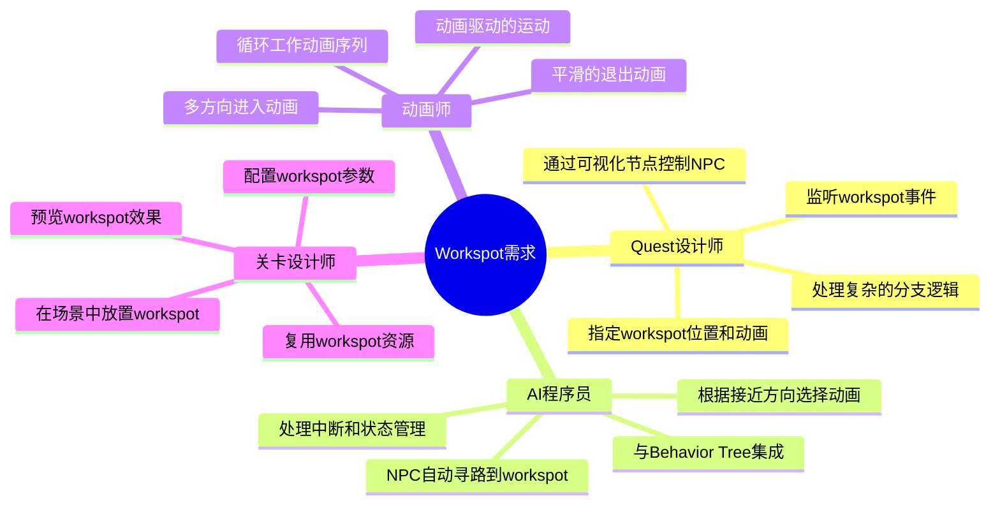

### 1.2 设计挑战

**挑战 1：多系统集成**
- Quest 系统（任务脚本）
- AI 系统（行为决策）
- 动画系统（动画播放）
- 运动系统（角色移动）
- 场景系统（世界管理）

**挑战 2：灵活性和复用性**
- 同一个 workspot 被不同 NPC 使用
- 同一个 NPC 在不同场景使用不同 workspot
- 支持玩家和 NPC 共用 workspot
- 支持多人同步 workspot（如两人对话）

**挑战 3：性能和可维护性**
- 大量 NPC 同时使用 workspot
- 快速加载和卸载
- 易于调试和测试
- 代码模块化和职责清晰

---

## 二、分层架构设计

### 2.1 为什么需要分层？

Workspot 系统采用了**分层架构**（Layered Architecture），每一层都有明确的职责。

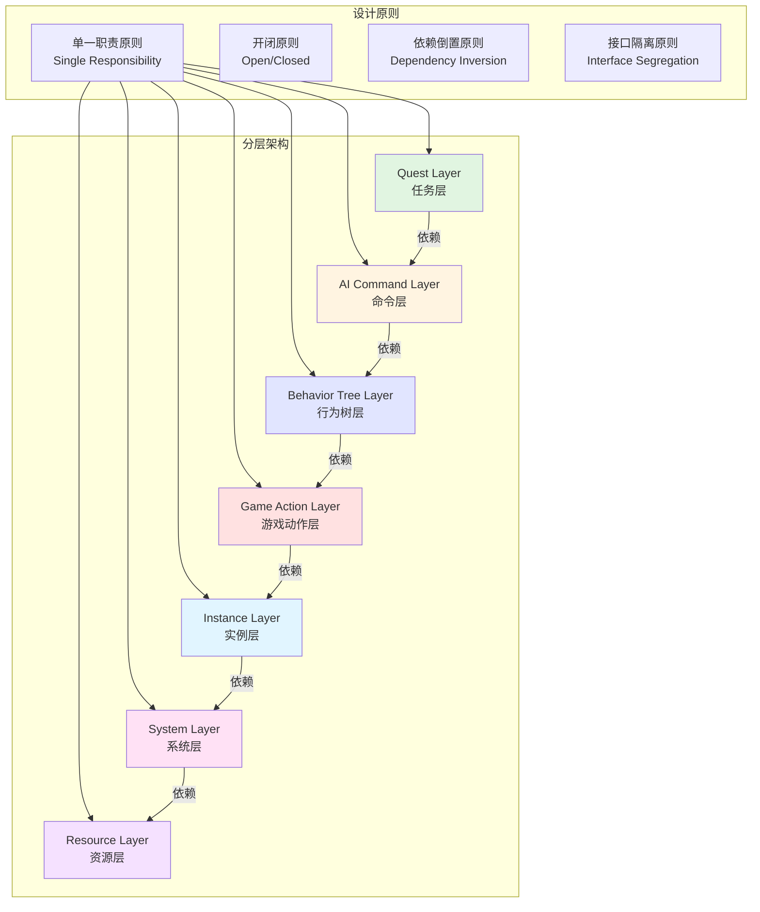

### 2.2 各层职责详解

#### Layer 1: Quest Layer（任务层）

**职责**：
- 提供给任务设计师的可视化接口
- 处理任务逻辑和分支
- 监听 workspot 事件
- 不关心具体实现细节

**设计原因**：
```cpp
// 设计师只需要关心：
// "让这个NPC使用这个workspot"
UseWorkspotNode {
    entityReference = "NPC_Vendor_01"
    workspotNode = "Workspot_Counter_01"
    teleport = false
}

// 不需要关心：
// - 如何寻路
// - 如何选择动画
// - 如何管理状态
```

**关键类**：
- `UseWorkspotNodeDefinition` - Quest 节点定义
- `UseWorkspotParamsV1` - 参数配置
- `WorkspotListener` - 事件监听

---

#### Layer 2: AI Command Layer（命令层）

**职责**：
- 封装 workspot 操作为 AI Command
- 支持命令队列和优先级
- 支持命令取消和重复
- 异步执行

**设计原因 - 命令模式（Command Pattern）**：

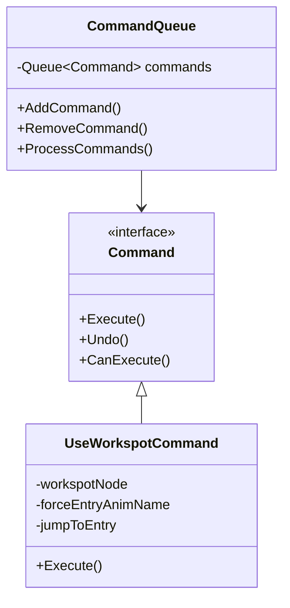

**优势**：
1. **异步执行**：Quest Node 创建命令后立即返回，不阻塞
2. **可取消**：战斗打断时可以取消队列中的命令
3. **可重复**：相同命令可以设置重复执行
4. **可序列化**：保存游戏时可以序列化命令队列

**关键类**：
- `BaseUseWorkspotCommand` - 基础命令类
- `UseWorkspotCommand` - Workspot 命令

---

#### Layer 3: Behavior Tree Layer（行为树层）

**职责**：
- 将 AI Command 转换为具体行为
- 处理 AI 逻辑（条件、循环、优先级）
- 自动选择最佳 EntryAnim
- 与其他 AI 行为协调

**设计原因 - AI 决策系统**：

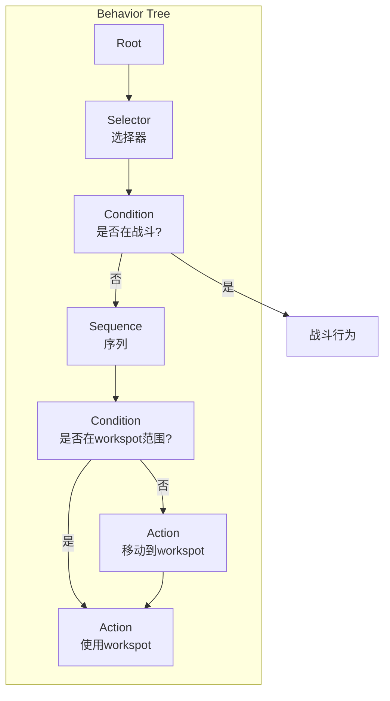

**优势**：
1. **灵活决策**：可以根据条件选择不同的执行路径
2. **可组合**：workspot 行为可以与其他行为组合
3. **可重用**：行为树节点可以在不同 NPC 间共享
4. **可视化**：设计师可以看到 AI 决策过程

**关键类**：
- `ActionUseWorkspotNode` - 基础 workspot 行为节点
- `ActionUseCommunityWorkspotNode` - 社区 workspot（自动选择 Entry）

---

#### Layer 4: Game Action Layer（游戏动作层）

**职责**：
- 管理 workspot 的生命周期（Setup → Start → Update → Stop）
- 与游戏系统集成（LOD、可见性、存档等）
- 提供统一的 Action 接口
- 独立于 AI 系统，可被其他系统调用

**设计原因 - 动作系统（Action System）**：

```cpp
// Cyberpunk 2077 的 Action 系统设计
class CAction {
    // 生命周期管理
    virtual Bool Setup() = 0;      // 初始化
    virtual void OnStart() = 0;    // 开始
    virtual void OnUpdate() = 0;   // 每帧更新
    virtual void OnStop() = 0;     // 结束
    virtual void OnReset() = 0;    // 重置

    // 状态管理
    enum State { Inactive, Ready, Active, Finished };
    State m_state;

    // 优先级和中断
    Int32 m_priority;
    Bool m_canBeInterrupted;
};

// 为什么需要独立的 Action 层？
// 1. 玩家使用 workspot 时不通过 AI 系统
// 2. 场景脚本可以直接控制 NPC 使用 workspot
// 3. 调试工具可以强制 NPC 进入 workspot
```

**优势**：
1. **生命周期管理**：统一的 Setup/Start/Update/Stop 流程
2. **独立性**：不依赖 Behavior Tree，可被任何系统调用
3. **状态管理**：清晰的状态转换（Inactive → Ready → Active → Finished）
4. **可中断性**：支持高优先级动作打断

**关键类**：
- `ActionBaseUseWorkspot` - 基础 workspot 动作
- `CActionUseWorkspot` - 标准 workspot 动作

---

#### Layer 5: Instance Layer（实例层）

**职责**：
- 管理单个 NPC 的 workspot 执行实例
- 处理运动控制器和动画控制器
- 实现回调接口
- 与 WorkspotSystem 交互

**设计原因 - 包装器模式（Wrapper Pattern）**：

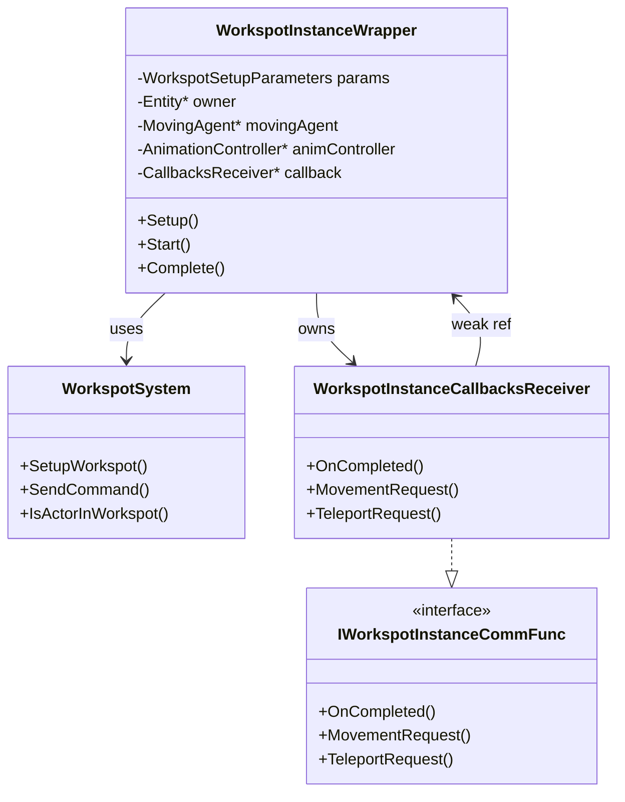

**为什么需要 Wrapper？**

```cpp
// 问题：WorkspotSystem 是全局单例，管理所有 NPC 的 workspot
// 解决：每个 NPC 有自己的 WorkspotInstanceWrapper

// WorkspotSystem 的职责：
// - 管理所有 WorkspotInstance（全局）
// - 处理命令队列
// - 触发回调

// WorkspotInstanceWrapper 的职责：
// - 管理单个 NPC 的 workspot 执行（局部）
// - 控制运动和动画
// - 作为 CAction 和 WorkspotSystem 之间的桥梁

// 优势：
// 1. 解耦：CAction 不需要直接操作 WorkspotSystem
// 2. 封装：隐藏 WorkspotSystem 的复杂性
// 3. 生命周期：Wrapper 的生命周期与 CAction 绑定
```

**关键类**：
- `WorkspotInstanceWrapper` - 实例包装器
- `WorkspotInstanceCallbacksReceiver` - 回调接收器

---

#### Layer 6: System Layer（系统层）

**职责**：
- 全局管理所有 workspot 实例
- 处理命令队列（异步执行）
- 管理事件监听器
- 处理多人 workspot 同步

**设计原因 - 单例模式 + 命令队列**：

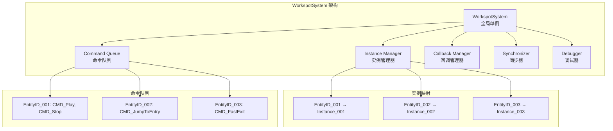

**为什么需要集中管理？**

1. **唯一性保证**：确保每个 NPC 同时只在一个 workspot 中
2. **全局查询**：快速查询任意 NPC 是否在 workspot
3. **事件广播**：统一触发所有监听器
4. **性能优化**：集中更新，批量处理

**命令队列设计**：

```cpp
// 为什么使用命令队列而不是直接执行？

// 问题 1：时序问题
// Quest Node: "让 NPC 使用 workspot"
// 同一帧内不能立即执行，因为：
// - 动画系统还没更新
// - 运动系统还没更新
// - 可能正在执行其他动画

// 解决：命令队列
SendCommand(entityId, CMD_Play);  // 加入队列
// 下一帧 Update 时执行

// 问题 2：并发问题
// 多个系统同时操作同一个 workspot
// 例如：Quest 发送 Play，同时 AI 发送 Stop

// 解决：队列保证顺序执行
SendCommand(entityId, CMD_Play);   // 先执行
SendCommand(entityId, CMD_Stop);   // 后执行

// 问题 3：可取消性
// 命令在队列中时可以取消

CommandQueue& queue = m_commandQueues[entityId];
queue.Remove(CMD_Play);  // 取消还未执行的命令
```

**关键类**：
- `WorkspotSystem` - 全局系统
- `WorkspotInstance` - 内部实例（执行 WorkspotTree）
- `WorkspotCallbackManager` - 回调管理器
- `WorkspotSynchronizer` - 同步器

---

#### Layer 7: Resource Layer（资源层）

**职责**：
- 定义 workspot 数据结构
- 存储动画配置（EntryAnim、Sequence、ExitAnim）
- 提供查询接口（查找 Entry、Exit 等）
- 资源加载和卸载

**设计原因 - 数据驱动设计（Data-Driven Design）**：

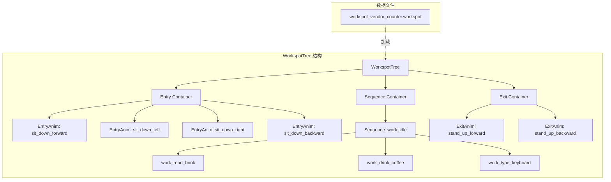

**为什么需要独立的资源层？**

```cpp
// 数据驱动的优势：

// 1. 内容创作者（美术、动画师）可以独立工作
// 不需要程序员介入，直接在编辑器中配置：
WorkspotTree {
    EntryAnims = [
        { name: "sit_down_forward", transform: (0, 0, 0), flags: SlowEnter },
        { name: "sit_down_left", transform: (-1, 0, 0), flags: SlowEnter },
        // ...
    ]
    Sequences = [
        { category: "idle", anims: ["work_read", "work_type"] },
        { category: "busy", anims: ["work_phone_call"] },
    ]
}

// 2. 复用性
// 同一个 WorkspotTree 可以被多个场景使用
vendorCounter01.SetWorkspotTree("workspot_vendor_counter.workspot");
vendorCounter02.SetWorkspotTree("workspot_vendor_counter.workspot");

// 3. 热重载
// 运行时修改 workspot 数据，立即生效（开发时）

// 4. 版本控制
// WorkspotTree 是独立文件，易于版本管理和合并

// 5. 性能
// 多个 workspot 实例共享同一个 WorkspotTree（只加载一次）
```

**关键类**：
- `WorkspotTree` - workspot 数据结构
- `WorkspotParams` - workspot 参数（包含 WorkspotTree 引用）
- `IEntry` - Entry 接口
- `EntryAnim`、`Sequence`、`ExitAnim` - 具体 Entry 类型
- `EntryPoint` - Entry 位置信息

---

## 三、设计模式的应用

### 3.1 命令模式（Command Pattern）

**应用场景**：AI Command Layer

```cpp
// 命令模式的核心
class Command {
    virtual void Execute() = 0;
};

class UseWorkspotCommand : public Command {
    void Execute() override {
        // 执行 workspot 操作
    }
};

// 命令队列
class CommandQueue {
    void AddCommand(Command* cmd) {
        m_queue.push(cmd);
    }

    void ProcessCommands() {
        while (!m_queue.empty()) {
            Command* cmd = m_queue.front();
            cmd->Execute();
            m_queue.pop();
        }
    }
};
```

**优势**：
- ✅ 请求和执行解耦
- ✅ 支持撤销/重做
- ✅ 支持队列和延迟执行
- ✅ 易于扩展新命令

---

### 3.2 观察者模式（Observer Pattern）

**应用场景**：事件监听系统

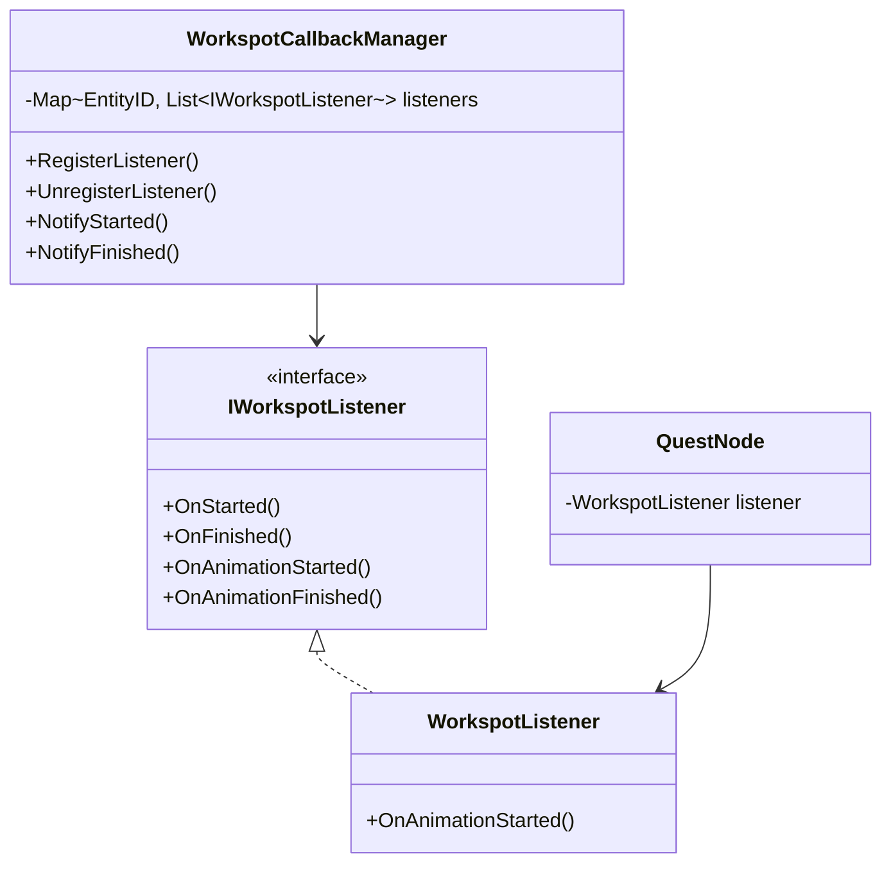

**优势**：
- ✅ 主题和观察者解耦
- ✅ 支持多个观察者
- ✅ 动态添加/移除观察者
- ✅ 广播通知

---

### 3.3 策略模式（Strategy Pattern）

**应用场景**：EntryAnim 选择

```cpp
// 策略接口
class IEntryAnimSelector {
    virtual CName SelectEntryAnim(const Transform& actorPos, const WorkspotTree& tree) = 0;
};

// 策略 1：最近距离选择
class ClosestEntrySelector : public IEntryAnimSelector {
    CName SelectEntryAnim(...) override {
        return tree.GetClosestEntryAnim(actorPos).m_animName;
    }
};

// 策略 2：强制指定
class ForceEntrySelector : public IEntryAnimSelector {
    CName m_forcedAnimName;
    CName SelectEntryAnim(...) override {
        return m_forcedAnimName;
    }
};

// 策略 3：随机选择
class RandomEntrySelector : public IEntryAnimSelector {
    CName SelectEntryAnim(...) override {
        return tree.GetRandomEntryAnim().m_animName;
    }
};
```

**优势**：
- ✅ 算法和使用者解耦
- ✅ 易于切换策略
- ✅ 易于添加新策略
- ✅ 符合开闭原则

---

### 3.4 包装器模式（Wrapper/Adapter Pattern）

**应用场景**：WorkspotInstanceWrapper

```cpp
// WorkspotSystem 的接口很复杂
class WorkspotSystem {
    void SetupWorkspot(...);     // 10+ 参数
    void SendCommand(...);
    void SendCommandImmediate(...);
    void SendOrCacheCommand(...);
    Bool IsActorInWorkspot(...);
    // ... 50+ 方法
};

// Wrapper 简化接口
class WorkspotInstanceWrapper {
    void Setup(const WorkspotInitializationContext& context);
    void Start();
    void Complete();
    // 只暴露必要的方法
private:
    WorkspotSystem* m_system;  // 内部持有引用
};
```

**优势**：
- ✅ 简化复杂接口
- ✅ 隐藏实现细节
- ✅ 适配不同接口
- ✅ 提供更高层的抽象

---

### 3.5 单例模式（Singleton Pattern）

**应用场景**：WorkspotSystem、WorkspotManager

```cpp
class WorkspotSystem {
private:
    static WorkspotSystem* s_instance;

    WorkspotSystem();  // 私有构造
    WorkspotSystem(const WorkspotSystem&) = delete;
    WorkspotSystem& operator=(const WorkspotSystem&) = delete;

public:
    static WorkspotSystem* GetInstance() {
        if (!s_instance) {
            s_instance = new WorkspotSystem();
        }
        return s_instance;
    }
};

// 使用
WorkspotSystem* ws = WorkspotSystem::GetInstance();
ws->SetupWorkspot(...);
```

**优势**：
- ✅ 全局唯一实例
- ✅ 全局访问点
- ✅ 延迟初始化
- ✅ 节省内存

**注意**：Cyberpunk 2077 实际上使用的是 **Game System 管理器**，而不是传统单例：

```cpp
// 更好的设计
class GameObject {
    template<typename T>
    T* GetGameSystem() {
        return m_gameInstance->GetSystem<T>();
    }
};

// 使用
WorkspotSystem* ws = owner->GetGameSystem<WorkspotSystem>();
```

---

## 四、为什么需要这么多层？

### 4.1 职责分离（Separation of Concerns）

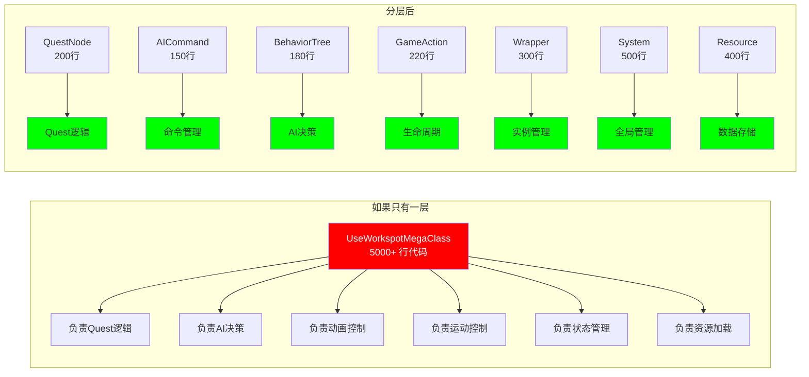

**对比**：

| 维度 | 单一巨类 | 分层架构 |
|------|---------|---------|
| **代码行数** | 5000+ 行 | 每层 150-500 行 |
| **理解难度** | 极高（需要理解所有逻辑） | 低（每层独立理解） |
| **修改风险** | 高（改一处影响全部） | 低（只影响当前层） |
| **测试难度** | 高（需要模拟整个流程） | 低（每层独立测试） |
| **团队协作** | 难（多人改同一文件冲突） | 易（不同层不同人负责） |
| **代码复用** | 低（耦合严重） | 高（层间松耦合） |

---

### 4.2 依赖方向控制（Dependency Inversion）

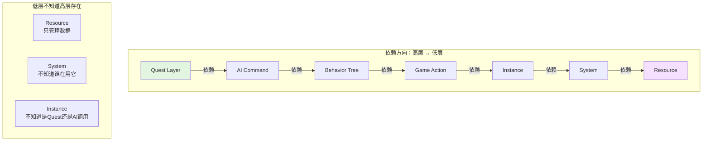

**优势**：

```cpp
// ✅ 可以替换高层而不影响低层
// 例如：不使用 Quest 系统，直接用 AI 调用
BehaviorTree -> GameAction -> Instance -> System

// 例如：不使用 Behavior Tree，直接用 GameAction
GameAction -> Instance -> System

// 例如：玩家使用 workspot（没有 Quest 和 AI）
PlayerInput -> GameAction -> Instance -> System

// ❌ 如果依赖方向反了
// Resource 依赖 Quest → 那玩家就无法使用 workspot
// System 依赖 BehaviorTree → 那场景脚本就无法直接控制 workspot
```

---

### 4.3 可测试性（Testability）

```cpp
// 分层架构使每层可以独立测试

// 测试 Quest Layer
TEST(QuestLayerTest, UseWorkspotNodeCreatesCommand) {
    // Mock AI Command Layer
    MockCommandQueue queue;

    // 执行 Quest Node
    UseWorkspotNode node;
    node.Execute(...);

    // 验证创建了正确的 Command
    EXPECT_TRUE(queue.HasCommand<UseWorkspotCommand>());
}

// 测试 Instance Layer
TEST(InstanceLayerTest, SetupMotionProvider) {
    // Mock System Layer
    MockWorkspotSystem system;

    // Mock Resource Layer
    MockWorkspotTree tree;

    // 创建 Wrapper
    WorkspotInstanceWrapper wrapper;
    wrapper.Setup(...);

    // 验证调用了正确的方法
    EXPECT_TRUE(system.WasCalled("SetupWorkspot"));
}

// 测试 Resource Layer
TEST(ResourceLayerTest, FindClosestEntryAnim) {
    // 创建 WorkspotTree
    WorkspotTree tree;
    tree.AddEntryAnim("sit_forward", Transform(0, 0, 0));
    tree.AddEntryAnim("sit_left", Transform(-1, 0, 0));

    // 测试查找
    Transform actorPos(0.1, 0, 0);
    EntryPoint entry = tree.GetClosestEntryAnim(actorPos);

    // 验证找到了最近的
    EXPECT_EQ(entry.m_animName, "sit_forward");
}
```

---

### 4.4 可扩展性（Extensibility）

```cpp
// 添加新功能：支持载具 workspot

// ✅ 只需要在部分层添加
// Layer 2: 添加新的 Command
class UseVehicleWorkspotCommand : public BaseUseWorkspotCommand {
    AI_COMMAND_PARAM(VehicleData, vehicleData, VehicleDescriptor);
};

// Layer 4: 添加新的 Action
class CActionUseVehicleWorkspot : public ActionBaseUseWorkspot {
    // 处理载具特有逻辑
};

// Layer 5: 扩展 Wrapper
void WorkspotInstanceWrapper::SetupVehicleMode() {
    // 设置载具特有的运动控制器
}

// ✅ 其他层不需要修改！
// Quest Layer - 不需要修改
// System Layer - 不需要修改
// Resource Layer - 不需要修改

// ❌ 如果没有分层，需要修改整个大类
```

---

## 五、关键设计决策

### 5.1 为什么 WorkspotInstanceWrapper 和 WorkspotInstance 分开？

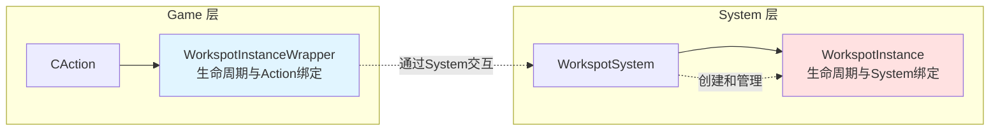

**原因**：

```cpp
// Wrapper 的生命周期
CAction 创建 -> Wrapper 创建
CAction 销毁 -> Wrapper 销毁

// Instance 的生命周期
WorkspotSystem::SetupWorkspot -> Instance 创建
WorkspotSystem::ClearWorkspot -> Instance 销毁

// 为什么分开？
// 1. CAction 可能被中断和重新创建
//    但 WorkspotInstance 应该保持（保存状态）

// 2. 存档/读档时
//    CAction 不需要序列化（会重新创建）
//    WorkspotInstance 需要序列化（保存状态）

// 3. 网络同步时
//    Wrapper 是本地的
//    Instance 的状态需要同步到服务器

// 4. 调试时
//    可以在 WorkspotSystem 中查看所有 Instance
//    而不需要查找对应的 CAction
```

---

### 5.2 为什么需要回调接口（IWorkspotInstanceCommFunc）？

```mermaid
flowchart TB
    subgraph "问题：WorkspotInstance 如何通知 NPC 移动？"
        WI[WorkspotInstance<br/>System层]
        WI --> Q{直接调用？}
        Q -->|❌| A1[MovingAgent->Move<br/>违反分层原则]
        Q -->|❌| A2[Wrapper->SetupMotion<br/>循环依赖]
    end

    subgraph "解决：回调接口"
        WI2[WorkspotInstance]
        CB[IWorkspotInstanceCommFunc<br/>接口]
        WR[WorkspotInstanceWrapper<br/>实现接口]

        WI2 -->|调用接口| CB
        CB <-.实现.- WR
        WR -->|控制| MA[MovingAgent]
    end

    style A1 fill:#ff0000,color:#fff
    style A2 fill:#ff0000,color:#fff
    style CB fill:#00ff00
```

**原因**：

```cpp
// 依赖倒置原则（Dependency Inversion Principle）
// 高层模块不应该依赖低层模块，两者都应该依赖抽象

// ❌ 错误设计：WorkspotInstance 直接依赖 Wrapper
class WorkspotInstance {
    WorkspotInstanceWrapper* m_wrapper;  // 依赖高层

    void PlayEntry() {
        m_wrapper->SetupMotion(...);  // 违反分层原则
    }
};

// ✅ 正确设计：通过接口回调
class IWorkspotInstanceCommFunc {
    virtual void MovementRequest(...) = 0;
};

class WorkspotInstance {
    IWorkspotInstanceCommFunc* m_callback;  // 依赖抽象

    void PlayEntry() {
        m_callback->MovementRequest(...);  // 调用接口
    }
};

class WorkspotInstanceWrapper : public IWorkspotInstanceCommFunc {
    void MovementRequest(...) override {
        // 实现具体逻辑
        SetupMotion(...);
    }
};
```

---

### 5.3 为什么命令是异步执行的？

```cpp
// 问题：为什么不立即执行命令？

// 场景 1：时序依赖
Frame N:
    Quest Node: SendCommand(CMD_Play)  // 立即执行？
    // 但此时：
    // - AnimationController 还没更新
    // - MovementController 还没更新
    // - 物理系统还没更新
    // 结果：可能出现状态不一致

// 解决：延迟到下一帧
Frame N:
    SendCommand(CMD_Play)  // 加入队列
Frame N+1:
    ProcessCommands()  // 此时所有系统已更新
    ExecuteCommand(CMD_Play)

// 场景 2：优先级处理
Frame N:
    Quest: SendCommand(CMD_Play)
    同时
    Combat System: SendCommand(CMD_FastExit)  // 更高优先级

// 如果立即执行：
CMD_Play 已经执行，无法取消
CMD_FastExit 失败

// 如果使用队列：
CommandQueue: [CMD_Play, CMD_FastExit]
处理时检查优先级，先执行 CMD_FastExit

// 场景 3：批量优化
Frame N:
    100个NPC各发送一个命令
    如果立即执行：100次系统调用

// 使用队列：
收集所有命令 -> 批量处理 -> 优化性能
```

---

## 六、架构演化历史（推测）

基于代码注释和设计痕迹，我们可以推测 Workspot 系统的演化过程：

### 6.1 Version 1.0 - 简单直接调用

```cpp
// 最初的设计（推测）
class NPC {
    void UseWorkspot(WorkspotNode* node) {
        // 直接播放动画
        PlayAnimation("sit_down");
        SetPosition(node->GetPosition());
    }
};

// 问题：
// - 无法处理复杂逻辑
// - 动画和移动不同步
// - 无法中断
// - 无法保存状态
```

### 6.2 Version 2.0 - 添加 WorkspotSystem

```cpp
// 引入中央管理系统
class WorkspotSystem {
    void PlayWorkspot(NPC* npc, WorkspotNode* node) {
        // 集中管理
    }
};

// 改进：
// ✅ 集中管理
// ✅ 可以查询状态
// ❌ 仍然缺乏灵活性
```

### 6.3 Version 3.0 - 引入 WorkspotTree

```cpp
// 数据驱动
class WorkspotTree {
    EntryAnim[] entries;
    Sequence[] sequences;
    ExitAnim[] exits;
};

// 改进：
// ✅ 数据和代码分离
// ✅ 美术可以独立配置
// ✅ 支持复杂的动画序列
```

### 6.4 Version 4.0 - 分层架构（当前版本）

```cpp
// 完整的分层架构
Quest → Command → BehaviorTree → Action → Instance → System → Resource

// 改进：
// ✅ 职责清晰
// ✅ 易于扩展
// ✅ 易于测试
// ✅ 团队协作友好
```

**代码中的演化痕迹**：

```cpp
// useWorkspotNode.cpp line 60-67
// 向后兼容的代码
RTTI_BEGIN_TYPE_IN_NAMESPACE( UseWorkspotParams, quest );
    RTTI_PROPERTY( m_workspotNode ).persistent();
    RTTI_PROPERTY( m_forceEntryAnimName ).persistent();
RTTI_END_TYPE();
// 这是旧版本的数据结构，新版本保留是为了读取旧存档

// useWorkspotNode.cpp line 107-108
static const CName OLDER_OUTPUT_SOCKET_NAME = RED_NAME_CONSTEXPR( "Out" );
// 旧版本的输出 socket 名称，新版本改为 "Work Started"

// 注释中的 TODO
// TODO: We should take originId into account here
// 说明这是后续计划添加的功能
```

---

## 七、总结

### 7.1 架构建立的核心原则

1. **单一职责原则**：每一层只做一件事
2. **开闭原则**：对扩展开放，对修改封闭
3. **里氏替换原则**：子类可以替换父类
4. **接口隔离原则**：使用多个专用接口
5. **依赖倒置原则**：依赖抽象而非具体实现

### 7.2 为什么这样设计？

| 需求 | 解决方案 | 优势 |
|------|---------|------|
| **多系统集成** | 分层架构 | 每层独立，易于集成 |
| **灵活性** | 命令模式 + 策略模式 | 可配置，可扩展 |
| **可维护性** | 职责分离 | 代码清晰，易于理解 |
| **性能** | 单例 + 命令队列 | 集中管理，批量处理 |
| **团队协作** | 层间解耦 | 并行开发，减少冲突 |
| **可测试性** | 接口抽象 | 独立测试，易于 Mock |

### 7.3 架构图总览

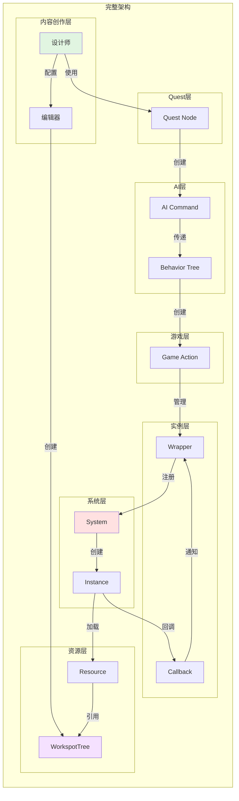

这就是 Workspot 系统架构建立的完整原理！
