# Workspot 核心概念详解

这个文档详细解答关于 Workspot 系统中各个核心组件的作用和机制。

---

## 1. StopWorkspotListener 是什么？

### 定义
**位置**: `useWorkspotNode.cpp` lines 116, 250-613

```cpp
class StopWorkspotListenerWrapper : public EventListenerWrapper
{
    // 继承自 EventListenerWrapper，用于监听 workspot 停止事件
};
```

### 作用
StopWorkspotListener 是一个**事件监听器包装器**，专门用于处理 workspot 退出/停止的场景。

### 工作流程

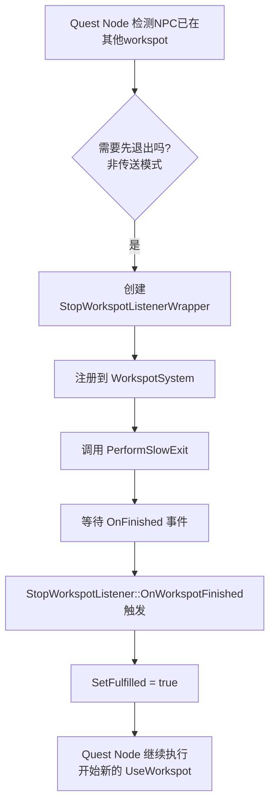

### 监听的事件

StopWorkspotListener 主要监听以下事件：

```cpp
// 位置: useWorkspotNode.cpp lines 468-474
void OnWorkspotFinished( const ent::EntityID& puppetID )
{
    if ( m_entityId == puppetID )
    {
        SetFulfilled( true );  // ← 通知 Quest Node workspot 已退出完成
    }
}
```

**监听的具体事件**：
- **OnFinished**: Workspot 完全结束时触发（退出动画播放完成 + 清理完成）
- **Purpose**: 确保在开始新 workspot 之前，旧 workspot 已完全退出

### 为什么需要等待退出？

**原因**：
1. **避免状态冲突**：NPC 不能同时在两个 workspot 中
2. **确保动画连贯**：如果不等待退出动画播放完成，会造成突兀的动画跳变
3. **资源清理**：确保旧 workspot 的资源（如道具、运动控制器）已释放

**检查代码**（useWorkspotNode.cpp lines 33-45）：
```cpp
if (!m_params->m_teleport && !IsPlayerEntityReference())
{
    auto puppet = GetPuppet(executionContext, m_entityReference);
    if (puppet && executionContext.GetWorkspotSystem()->IsActorInWorkspot(puppet->GetEntityID()))
    {
        // 如果在其他workspot，先退出
        auto eventListener = red::CreateSharedPtr<StopWorkspotListenerWrapper>(...);
        executionContext.RegisterEvent(...);
        return NodeResult::StayInNode;  // ← 等待退出完成
    }
}
```

---

## 2. UseWorkspotCommand 是什么？

### 定义
**位置**: `aiUseWorkspotCommand.h` lines 37-97

```cpp
class BaseUseWorkspotCommand : public Command
{
    // 基类：包含所有通用的 workspot 参数
};

class UseWorkspotCommand : public BaseUseWorkspotCommand
{
    AI_COMMAND_PARAM( WorkspotNode, workspotNode, world::NodeRef );
    // ← 指向世界中的 Workspot 节点
};
```

### 作用
UseWorkspotCommand 是 **AI 命令系统**中的一个命令类，作为 **Quest System → Behavior Tree** 之间的**数据传递载体**。

### 架构图

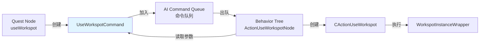

### 为什么需要 Command？

**原因**：
1. **异步执行**：Quest Node 创建命令后立即返回，Behavior Tree 在适当时机执行
2. **队列管理**：多个命令可以排队，按优先级执行
3. **可取消**：命令在执行前可以被取消（例如战斗打断）
4. **统一接口**：所有 AI 行为都通过 Command 系统执行，便于管理

---

## 3. UseWorkspotCommand 的 AI 参数详解

### 完整参数列表

| 参数名 | 类型 | 用途 |
|--------|------|------|
| **WorkspotNode** | `world::NodeRef` | 世界中的 Workspot 节点引用 |
| **MoveToWorkspot** | `Bool` | 是否移动到 workspot（AI逻辑控制） |
| **MovementType** | `move::MovementType` | 移动类型（Walk/Run/Sprint等） |
| **ForceEntryAnimName** | `CName` | 强制指定的 EntryAnim 名称 |
| **IdleOnlyMode** | `Bool` | 是否进入Idle Only模式（只播放Idle，不播放Sequence） |
| **InfiniteSequenceEntryId** | `work::WorkEntryId` | 无限循环的 Sequence ID |
| **JumpToEntry** | `Bool` | 是否跳转到指定Entry（跳过EntryAnim） |
| **EntryId** | `work::WorkEntryId` | 要跳转到的 Entry ID |
| **EntryTag** | `CName` | Entry 标签（用于查找 Entry） |
| **WorkExcludedGestures** | `DynArray<WorkEntryId>` | 排除的手势动画列表 |
| **MaxAnimTimeLimit** | `Float` | 最大动画时间限制（秒） |
| **FailsafeScene** | `scn::SceneInstanceId` | 备用场景ID（失败时使用） |
| **PlayerTierData** | `THandle<SceneTierData>` | 玩家镜头层级数据（Tier3/Tier4） |
| **CameraUseTrajectorySpace** | `Bool` | 镜头是否使用轨迹空间 |
| **ContinueInCombat** | `Bool` | 是否在战斗中继续 workspot |
| **CameraApplyParams** | `Bool` | 是否应用镜头参数 |
| **VehicleProceduralCameraWeight** | `Float` | 载具程序化镜头权重 |
| **CameraParallaxWeight** | `Float` | 镜头视差权重 |
| **CameraParallaxSpace** | `Int32` | 镜头视差空间（Trajectory/Camera/Chest） |
| **AllowOverridingBumpPolicy** | `Bool` | 是否允许覆盖碰撞策略 |
| **BumpPolicy** | `AI::influence::EBumpPolicy` | 碰撞策略（Static/Dynamic等） |
| **MountData** | `game::MountDescriptor` | 挂载数据（用于载具 workspot） |

### 核心参数详解

#### 1. **WorkspotNode** (world::NodeRef)
```cpp
AI_COMMAND_PARAM( WorkspotNode, workspotNode, world::NodeRef );
```
- **作用**: 指向世界中的 Workspot 节点（场景编辑器中放置的 workspot）
- **用途**: 通过这个引用获取 workspot 的位置、旋转、WorkspotTree 资源等

#### 2. **MoveToWorkspot** (Bool)
```cpp
AI_COMMAND_PARAM( MoveToWorkspot, moveToWorkspot, Bool );
```
- **作用**: 控制 AI 是否应该先移动到 workspot
- **两种模式**:
  - `true`: AI 先寻路移动到 workspot 附近，再执行 EntryAnim
  - `false`: 直接执行 workspot（假设已经在正确位置）

#### 3. **ForceEntryAnimName** (CName)
```cpp
AI_COMMAND_PARAM( ForceEntryAnimName, forceEntryAnimName, CName );
```
- **作用**: 强制使用特定的 EntryAnim，忽略自动选择
- **用途**: Quest 设计师希望指定特定的进入动画（例如："从左侧进入"）

#### 4. **JumpToEntry** (Bool) + **EntryId** (WorkEntryId)
```cpp
AI_COMMAND_PARAM_DEFAULT( JumpToEntry, jumpToEntry, Bool, false );
AI_COMMAND_PARAM( EntryId, entryId, work::WorkEntryId );
```
- **作用**: 跳过 EntryAnim，直接进入 Sequence 中的某个特定 Entry
- **用途**:
  - 快速测试某个 Sequence
  - 从存档恢复 workspot 状态
  - 玩家传送到 workspot 后直接开始工作

#### 5. **MaxAnimTimeLimit** (Float)
```cpp
AI_COMMAND_PARAM_DEFAULT( MaxAnimTimeLimit, maxAnimTimeLimit, Float, 0.f );
```
- **作用**: 限制 workspot 中单个动画的最大播放时间
- **用途**: 防止 NPC 在 workspot 中卡住（例如动画太长导致NPC不响应）

#### 6. **ContinueInCombat** (Bool)
```cpp
AI_COMMAND_PARAM_DEFAULT( ContinueInCombat, continueInCombat, Bool, false );
```
- **作用**: 进入战斗时是否继续 workspot
- **默认**: `false`（战斗时退出 workspot）
- **用途**: 某些 workspot 需要在战斗中继续（例如：掩体射击）

---

## 4. WorkspotListener 架构和监测内容

### 接口定义
**位置**: `workspotListenerInterface.h` lines 17-32

```cpp
class IWorkspotListener
{
public:
    virtual void OnStarted( const ent::EntityID& puppetID, const work::OriginId& originId ) = 0;
    virtual void OnFinished( const ent::EntityID& puppetID, const work::OriginId& originId ) = 0;
    virtual void OnAnimationStarted( const ent::EntityID& puppetID, const work::OriginId& originId,
                                     const work::WorkEntryId& entryId, Uint32 flags,
                                     CName animationName, Bool fastForward ) = 0;
    virtual void OnAnimationFinished( const ent::EntityID& puppetID, const work::OriginId& originId,
                                      const work::WorkEntryId& entryId, Uint32 flags,
                                      CName animationName, Bool fastForward ) = 0;
    virtual void OnAnimationMissing( const ent::EntityID& puppetID, const work::OriginId& originId,
                                     const work::WorkEntryId& entryId, Uint32 flags,
                                     CName animationName ) = 0;
};
```

### WorkspotListener 架构图

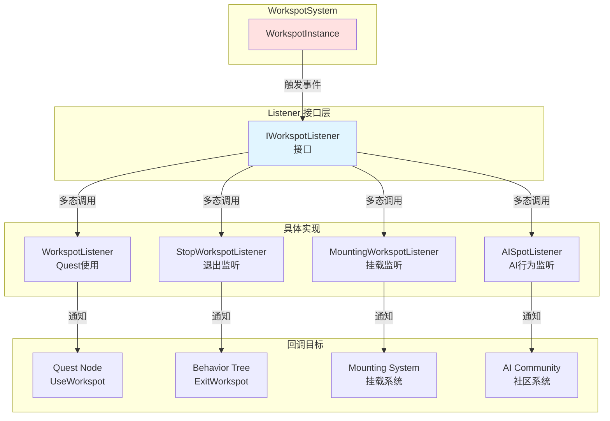

### 监测的事件详解

#### 1. **OnStarted**
```cpp
virtual void OnStarted( const ent::EntityID& puppetID, const work::OriginId& originId ) = 0;
```
- **触发时机**: WorkspotSystem 开始执行 workspot（CMD_Play 命令后）
- **用途**:
  - Quest Node 可以在这时激活"Work Started"输出socket
  - 开始计时器或其他依赖 workspot 开始的逻辑

#### 2. **OnFinished**
```cpp
virtual void OnFinished( const ent::EntityID& puppetID, const work::OriginId& originId ) = 0;
```
- **触发时机**: Workspot 完全结束（ExitAnim 播放完 + 清理完成）
- **用途**:
  - Quest Node 继续执行后续节点
  - 释放资源（如预留的 workspot 槽位）
  - 触发后续事件（如任务完成）

#### 3. **OnAnimationStarted**
```cpp
virtual void OnAnimationStarted( const ent::EntityID& puppetID, const work::OriginId& originId,
                                 const work::WorkEntryId& entryId, Uint32 flags,
                                 CName animationName, Bool fastForward ) = 0;
```
- **触发时机**: WorkspotTree 中的任何动画开始播放
- **参数**:
  - `entryId`: 动画的 Entry ID（在 WorkspotTree 中的唯一标识）
  - `flags`: 动画标志（EnterNode/ExitNode/SlowEnter等）
  - `animationName`: 动画名称（如 "sit_down"）
  - `fastForward`: 是否在快进模式（从存档恢复时）

- **用途**:
  - **检测 EntryAnim 开始**: 用于判断 NPC 已开始进入 workspot
  - **触发特效**: 例如坐下时触发灰尘特效
  - **同步音效**: 与动画同步播放音效

**Quest Node 中的使用**（useWorkspotNode.cpp lines 476-490）:
```cpp
void OnAnimationStarted( const ent::EntityID& puppetID, const work::WorkEntryId& entryId,
                         Uint32 flags, CName animName, Bool fastForward )
{
    if( !IsWorkStarted() )  // 是否首次动画
    {
        if( puppetID == m_entityId )
        {
            // 如果不是 EnterNode，说明已经开始工作
            if( ( flags & work::IEntry::EnterNode ) == 0 )
            {
                NotifyWorkStarted( fastForward );  // ← 激活 "Work Started" socket
            }
        }
    }
}
```

#### 4. **OnAnimationFinished**
```cpp
virtual void OnAnimationFinished( const ent::EntityID& puppetID, const work::OriginId& originId,
                                  const work::WorkEntryId& entryId, Uint32 flags,
                                  CName animationName, Bool fastForward ) = 0;
```
- **触发时机**: WorkspotTree 中的任何动画播放完成
- **用途**:
  - **检测 EntryAnim 结束**: 判断 NPC 已完全进入 workspot
  - **检测工作完成**: Sequence 播放完成，可以开始下一个任务
  - **触发后续逻辑**: 例如坐下后给 NPC 一本书

**Quest Node 中的使用**（useWorkspotNode.cpp lines 492-505）:
```cpp
void OnAnimationFinished( const ent::EntityID& puppetID, const work::WorkEntryId& entryId,
                          Uint32 flags, CName animName, Bool fastForward )
{
    if( !IsWorkStarted() )
    {
        if( puppetID == m_entityId )
        {
            // 如果是 EnterNode 结束，说明 EntryAnim 播放完成
            if( (flags & work::IEntry::EnterNode) != 0 )
            {
                NotifyWorkStarted( fastForward );  // ← 激活 "Work Started" socket
            }
        }
    }
}
```

#### 5. **OnAnimationMissing**
```cpp
virtual void OnAnimationMissing( const ent::EntityID& puppetID, const work::OriginId& originId,
                                 const work::WorkEntryId& entryId, Uint32 flags,
                                 CName animationName ) = 0;
```
- **触发时机**: WorkspotTree 中指定的动画在 AnimSet 中找不到
- **用途**:
  - **调试**: 记录缺失的动画，方便美术人员补充
  - **错误处理**: 显示警告或使用备用动画
  - **QA报告**: 收集资源缺失问题

---

## 5. ActionUseWorkspotNode 中的 "Action" 是什么？

### Behavior Tree 的 Action 概念

在 Cyberpunk 2077 的 AI 系统中，**Action** 是 Behavior Tree（行为树）中的一种节点类型。

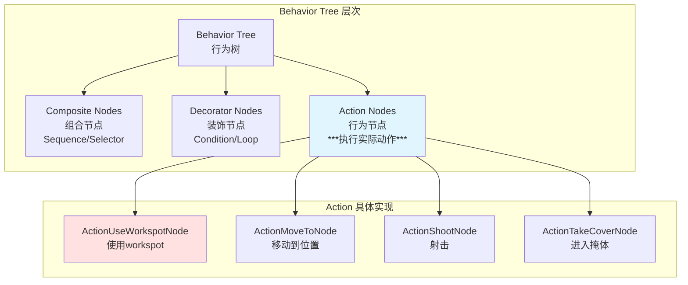

### ActionUseWorkspotNode 定义
**位置**: `aiActionUseWorkspotNode.h` lines 17-45

```cpp
class ActionUseWorkspotNode : public ActionTreeNode
{
public:
    ActionUseWorkspotNode( TreeNode* parentNode, const ActionUseWorkspotNodeDefinition& definition );

private:
    virtual SetupResult SetupAction( ExecutionContext& context ) const override;
    const ActionUseWorkspotNodeDefinition& m_definition;
};
```

### Action 的职责

**ActionUseWorkspotNode** 负责：
1. **从 AI Command 提取参数**
2. **创建 CActionUseWorkspot**（游戏层的 Action）
3. **调用 CActionUseWorkspot::Setup()** 初始化
4. **返回 Setup 结果**（成功/失败）

**代码流程**（aiActionUseWorkspotNode.cpp lines 64-127）:
```cpp
ActionTreeNode::SetupResult ActionUseWorkspotNode::SetupAction(ExecutionContext& context) const
{
    auto* puppet = Cast<game::Puppet>(&context.GetAgent()->GetOwner());
    game::CActionAIProxy& proxy = context[i_action];

    // 1. 获取或创建 CActionUseWorkspot
    game::CActionUseWorkspot::Ptr action = proxy.AcquireAction<game::CActionUseWorkspot>(*puppet);

    // 2. 从 AI Command 获取 setup 参数
    THandle<game::SetupWorkspotActionEvent> setupData = nullptr;
    // ... 从 event data 中提取 ...

    if (setupData)
    {
        // 3. 配置 action 参数
        setupData->m_parameters.m_autoCompletion = playExitAutomatically;
        setupData->m_parameters.m_markUninterruptable = markWorkspotUninterruptable;

        // 4. 创建初始化上下文并 Setup action
        const game::WorkspotInitializationContext initContext(
            setupData->m_parameters,
            *puppet,
            puppet->GetMovingAgent(),
            setupData->m_mountDescriptor
        );

        if (action->Setup(initContext))  // ← 初始化 CActionUseWorkspot
        {
            return true;
        }
    }

    return false;
}
```

### 为什么需要两层 Action？

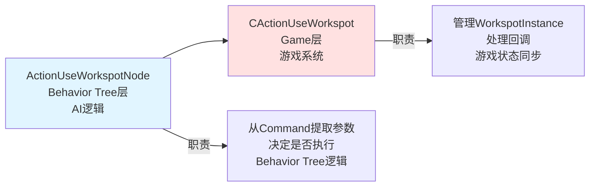

**分层原因**:
- **ActionUseWorkspotNode (AI层)**: 处理 AI 逻辑，可以被 Behavior Tree 条件节点控制
- **CActionUseWorkspot (Game层)**: 处理游戏系统交互，独立于 AI 逻辑，可以被其他系统调用

---

## 6. 如何查找 Workspot EntryAnim？四种方向是什么？

### 查找流程

**位置**: `workspotResource.cpp` lines 954-972

```cpp
work::EntryPoint WorkspotTree::GetClosestEntryAnim( const Transform& posLS, const AnimSearchContext& context ) const
{
    work::EntryPoint res;
    Float currMaxDistance = std::numeric_limits<Float>::max();

    // Lambda 函数：评估每个 EntryAnim 的距离
    std::function< void( EntryAnim* ) > nodeFun = [this, &posLS, &context, &res, &currMaxDistance]( EntryAnim* entryAnim )
    {
        return helper::EvaluateDistance< EntryAnim, true >(
            entryAnim, context, posLS, res, currMaxDistance, this );
    };

    if( m_rootEntry )
    {
        CheckConditionContext cont;
        helper::SetupCheckConditionContext( cont, context );
        // 遍历所有 EntryAnim，找到距离最近的
        helper::ForEachNodeConditional<EntryAnim>( m_rootEntry, cont, nodeFun );
    }

    return res;
}
```

### 查找算法详解

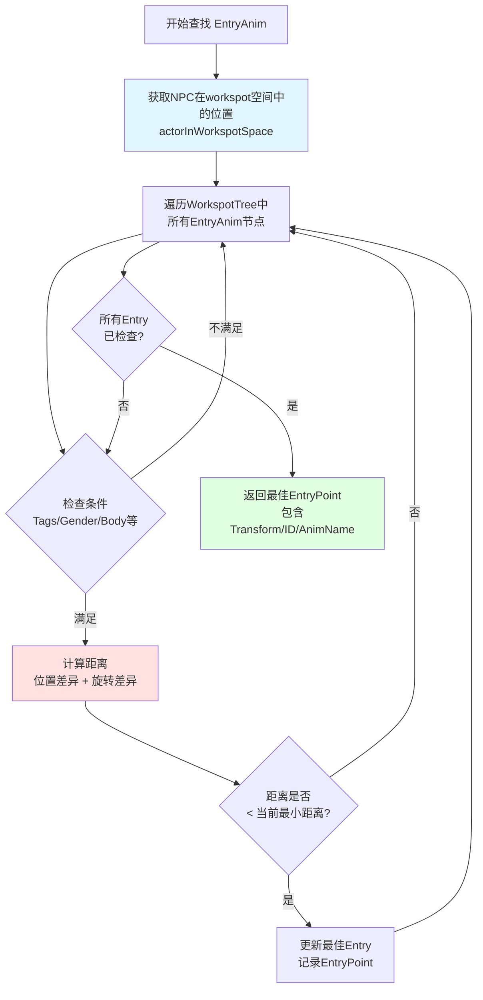

### EntryPoint 结构

**位置**: `workspotResource.h` lines 288-298

```cpp
struct EntryPoint
{
    Transform           m_transform;         // EntryAnim的Transform（位置+旋转）
    WorkEntryId         m_entryId;          // Entry的唯一ID
    CName               m_animName;         // EntryAnim的动画名称（如"sit_down_forward"）
    move::MovementType  m_movementType;     // 移动类型
    move::MovementOrientationType m_movementOrientationType;  // 移动朝向类型
};
```

### 四种方向的 EntryAnim

在 Cyberpunk 2077 中，很多 workspot 设计了**四个方向的 EntryAnim**，对应 NPC 从不同方向接近 workspot 的场景。

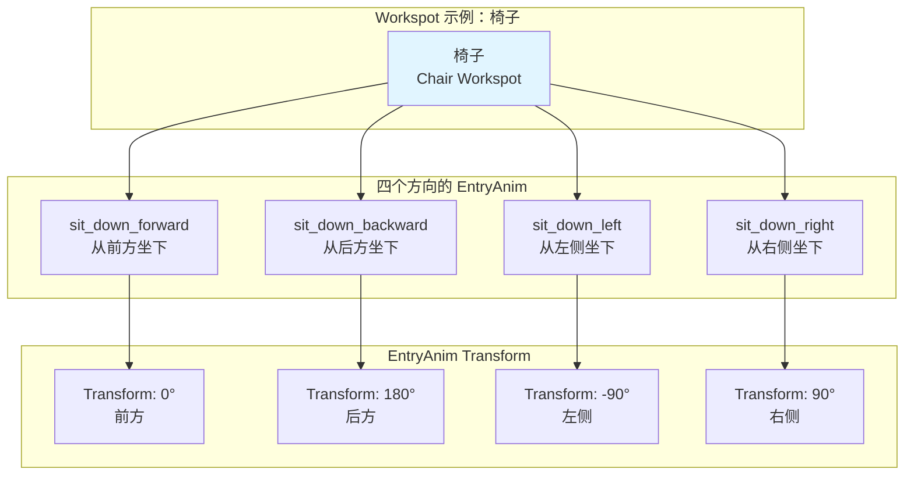

### 方向匹配逻辑

**计算过程**（aiActionUseWorkspotNode.cpp lines 184-202）:

```cpp
// 1. 计算 NPC 在 workspot 空间中的 Transform
Transform actorInWorkspotSpace =
    setupData->m_parameters.m_workspotTransform.TransformInv(puppet->GetWorldTransform());

// 2. 查找最近的 Entry Point
work::EntryPoint point = setupData->m_parameters.m_workspot.GetClosestEntryAnim(
    actorInWorkspotSpace, cont);

// 3. 计算旋转差异和位置差异
Quaternion rotationDiff = point.m_transform.GetOrientation().Conjugated() *
                          actorInWorkspotSpace.GetOrientation();
Vector3 positionDiff = point.m_transform.GetPosition() -
                       actorInWorkspotSpace.GetPosition();

// 4. 检查是否在阈值内
if (rotationDiff.GetAngle() < DEG2RAD(20.f) &&   // 旋转 < 20度
    positionDiff.Z < 0.1f &&                      // Z轴 < 0.1米
    positionDiff.AsVector2().Mag() < 0.03f)       // XY < 0.03米
{
    // 使用这个 EntryAnim
    setupData->m_parameters.m_entryAnimation = point.m_animName;
}
```

### 四种方向的实际应用

**场景示例：NPC 坐到椅子上**

```
         前方 (0°)
     sit_down_forward
             ↓

左侧 (-90°) [椅子] 右侧 (90°)
sit_down_left    sit_down_right

             ↑
     sit_down_backward
        后方 (180°)
```

**选择逻辑**:
1. NPC 从前方接近 → 选择 `sit_down_forward`
2. NPC 从左侧接近 → 选择 `sit_down_left`
3. NPC 从后方接近 → 选择 `sit_down_backward`
4. NPC 从右侧接近 → 选择 `sit_down_right`

**优势**:
- **自然动画**: NPC 不会"穿模"或突然旋转
- **流畅过渡**: 从移动到坐下的过渡非常自然
- **真实感**: 符合现实中人类的行为习惯

---

## 7. CActionUseWorkspot 是什么？

### 定义
**位置**: `actionUseWorkspot.h` lines 30-87

```cpp
class ActionBaseUseWorkspot : public CAction
{
    // 基类：管理 WorkspotInstanceWrapper 的生命周期
};

class CActionUseWorkspot: public ActionBaseUseWorkspot
{
    DEFINE_ACTION_TYPE( CActionUseWorkspot, ActionBaseUseWorkspot,
                        EActionType::ACTION_USE_WORKSPOT, "UseWorkspot" );
};
```

### 作用
CActionUseWorkspot 是 **Game 层的 Action 系统**中的一个 Action 类，负责：
1. **管理 WorkspotInstanceWrapper**（workspot 执行的核心对象）
2. **处理生命周期**（Setup → Start → Update → Stop）
3. **注册回调**（workspot 完成时通知）
4. **与其他系统交互**（如 LOD 系统、可见性系统）

### 生命周期

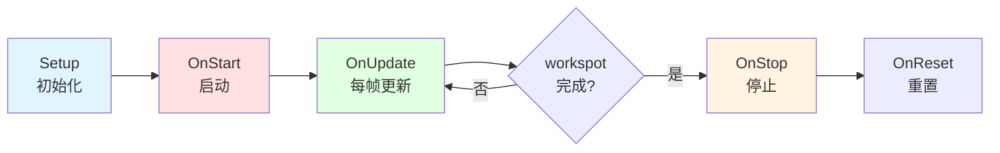

### 核心方法详解

#### 1. **Setup**（actionUseWorkspot.cpp lines 25-58）
```cpp
Bool ActionBaseUseWorkspot::Setup( const WorkspotInitializationContext& context )
{
    const WorkspotSetupParameters& params = context.m_initialParameters;

    m_owner = &context.m_owner;
    m_spotNodeId = context.m_initialParameters.m_nodeId;

    // 1. 获取 WorkspotManager
    AI::IWorkspotManager* workspotManager = m_owner->GetGameSystem<AI::IWorkspotManager>();

    // 2. 创建 WorkspotInstanceWrapper
    m_workspotInstance = workspotManager->StartWorkspot(m_owner->GetEntityID());
    if (!m_workspotInstance)
    {
        return false;
    }

    // 3. 设置 workspot 实例
    m_workspotInstance->Setup(context);  // ← 初始化 workspot 实例

    // 4. 注册完成回调
    m_completionCallbackId = m_workspotInstance->RegisterCompletionCallback([this] {
        SetFinished();  // ← workspot 完成时设置 Action 为完成状态
    });

    SetReady();
    return true;
}
```

#### 2. **OnStart**（actionUseWorkspot.cpp lines 84-103）
```cpp
void ActionBaseUseWorkspot::OnStart()
{
    // 启动 workspot 实例
    m_workspotInstance->Start();  // ← 关键！开始执行 workspot

    // 快进支持（从存档恢复时）
    if (GetInitialTimeProgress() > .0f)
    {
        red::UniquePtr<work::FastForwardData> data = red::CreateUniquePtr<work::FastForwardData>();
        data->m_forceTime = GetInitialTimeProgress();
        m_owner->GetSceneSystem<work::WorkspotSystem>()->SendCommand(
            m_owner->GetEntityID(), work::CMD_FastForward, std::move(data));
    }

    // 设置 LOD（Level of Detail）
    m_owner->GetSceneSystem<world::RuntimeSystemEntity>()->ScheduleEntitySetLOD(
        HandleFromPtr(m_owner), ent::EntityLOD::UsingWorkspotThroughUseWorkspotAction);
}
```

#### 3. **OnUpdate**
```cpp
virtual void OnUpdate( Float deltaTime, const tick::Info& tickInfo ) override;
```
- **作用**: 每帧检查 workspot 状态，处理事件
- **用途**:
  - 更新 NPC 可见性
  - 处理中断逻辑
  - 同步状态

#### 4. **OnStop**
```cpp
virtual void OnStop() override;
```
- **作用**: workspot 结束时清理资源
- **用途**:
  - 解除注册回调
  - 恢复 LOD 设置
  - 通知其他系统

### CActionUseWorkspot vs ActionUseWorkspotNode

| 特性 | CActionUseWorkspot (Game层) | ActionUseWorkspotNode (AI层) |
|------|----------------------------|------------------------------|
| **层级** | Game 系统 | Behavior Tree 系统 |
| **职责** | 管理 WorkspotInstanceWrapper | 创建 CActionUseWorkspot |
| **生命周期** | Setup → Start → Update → Stop | SetupAction → OnActionCompleted |
| **调用者** | Action 系统（可被其他系统调用） | Behavior Tree 执行器 |
| **独立性** | 可独立使用 | 依赖 Behavior Tree 上下文 |

---

## 8. WorkspotInstanceWrapper 是什么？

### 定义
**位置**: `workspot.h` lines 61-150

```cpp
class WorkspotInstanceWrapper : public red::EnableSharedFromThis< WorkspotInstanceWrapper >
{
public:
    WorkspotInstanceWrapper( AI::ObjectId id );
    ~WorkspotInstanceWrapper();

    void Setup( const WorkspotInitializationContext& context );
    void Start();
    void Complete( Bool notifyCompleted = true );
    // ... 其他方法 ...

private:
    const AI::ObjectId m_id;
    WorkspotSetupParameters m_initialParameters;
    ent::Entity* m_owner = nullptr;
    move::Component* m_movingAgent = nullptr;
    ent::AnimationControllerComponent* m_animationController = nullptr;
    red::SharedPtr< WorkspotInstanceCallbacksReceiver > m_callbackInterface;
    WorkspotMovementController m_animMoveController;
    // ... 其他成员 ...
};
```

### 作用
WorkspotInstanceWrapper 是 **workspot 执行的核心对象**，它：
1. **包装 WorkspotSystem 的交互**：作为游戏层和 WorkspotSystem 之间的桥梁
2. **管理回调接口**：处理 WorkspotSystem 的各种回调（MovementRequest、TeleportRequest等）
3. **控制运动系统**：设置 Motion Extraction、NavMesh 贴合等
4. **管理生命周期**：从 Setup 到 Complete 的整个流程

### 核心职责图

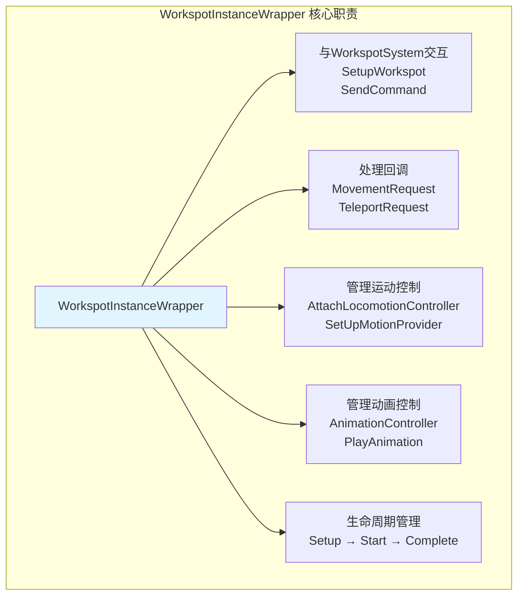

### 关键方法详解

#### 1. **Setup**
```cpp
void Setup( const WorkspotInitializationContext& context );
```
- **作用**: 初始化所有参数和引用
- **职责**:
  - 保存 workspot 参数（WorkspotTree、Transform等）
  - 获取组件引用（AnimationController、MovingAgent）
  - 配置运动和动画控制器

#### 2. **Start**（workspot.cpp lines 240-340）
```cpp
void WorkspotInstanceWrapper::Start()
{
    m_isActive = true;
    work::WorkspotSystem* workspotSystem = m_owner->GetSceneSystem< work::WorkspotSystem >();

    // 检查是否已在 workspot 中
    const Bool alreadyInWorkspot = workspotSystem->IsActorInWorkspot( ownerId, m_initialParameters.m_workspot );

    // 如果使用运动系统
    if ( m_useMotion )
    {
        // 设置运动控制器
        m_movingAgent->AttachLocomotionController( m_animMoveController );

        // 创建 AdjustCommand（如果需要滑动到位置）
        if ( !IsOwnerInWorkspot( m_initialParameters.m_workspot ) )
        {
            if ( m_initialParameters.m_slideTime > 0.f )
            {
                m_adjustCommand = red::CreateUniquePtr< work::AdjustAndPlayCommandData >();
                // 计算位置差值...
            }
        }
    }

    // 注册到 WorkspotSystem
    m_callbackInterface = red::CreateSharedPtr< WorkspotInstanceCallbacksReceiver >( SharedFromThis() );
    workspotSystem->SetupWorkspot( HandleFromPtr( m_owner ), { ... } );

    // 发送播放命令
    if ( m_adjustCommand )
    {
        workspotSystem->SendCommand( ownerId, work::CMD_Adjust_And_Play, std::move( m_adjustCommand ) );
    }
    else
    {
        workspotSystem->SendCommand( ownerId, work::CMD_Play );
    }
}
```

#### 3. **SetUpMotionProvider**（workspot.cpp lines 556-606）
```cpp
void WorkspotInstanceWrapper::SetUpMotionProvider(
    Transform transform,
    Transform* startLocation,
    Float logicDuration,
    CName animName,  // ← EntryAnim 名称
    Float forceTime,
    const Uint32 recordFlags,
    Bool forceSnapToTerrain)
{
    anim::MotionProvider provider;

    // 处理 SlowEnter（EntryAnim）
    if ((recordFlags & work::IEntry::SlowEnter) != 0)
    {
        // 创建带动画的运动提供者
        m_animationController->CreateMotionProviderWithTarget(
            animName,           // ← EntryAnim 名称
            CName::NONE(),
            logicDuration,
            target,
            logicDuration,
            ...,
            true,  // useMotionExtraction = true ← 从动画中提取运动
            true,  // applyMotion = true
            ...,
            provider
        );

        // 开始运动
        m_animMoveController.MoveWithMotionProvider(provider, 0, &startLocPS);
    }
}
```

#### 4. **Complete**
```cpp
void Complete( Bool notifyCompleted = true );
```
- **作用**: 结束 workspot 执行
- **职责**:
  - 触发完成回调
  - 清理资源
  - 解除运动控制器

### WorkspotInstanceWrapper 与其他组件的关系

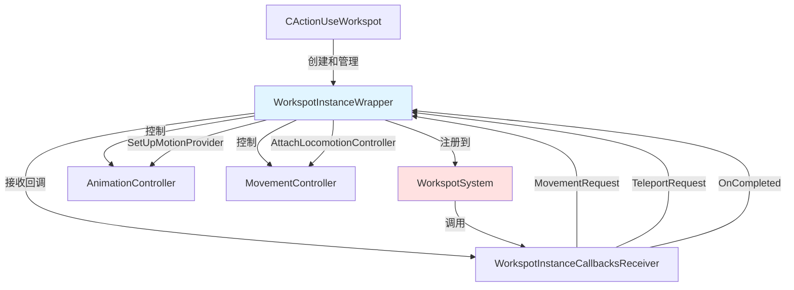

---

## 9. 根运动（Motion Extraction）详解

### 为什么设置使用根运动？

**Motion Extraction（根运动提取）** 是动画驱动运动的核心技术。

### 传统方式 vs Motion Extraction

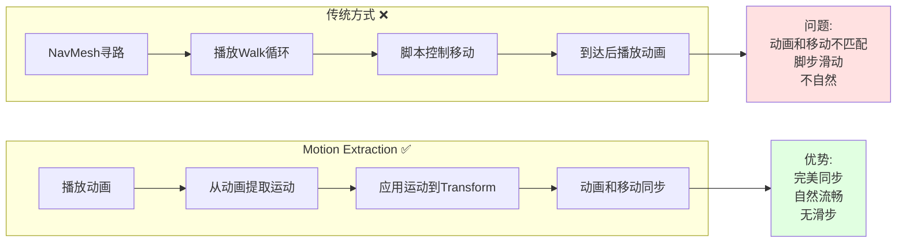

### 设置根运动的代码

**位置**: workspot.cpp lines 525-543

```cpp
m_animationController->CreateMotionProviderWithTarget(
    animName,           // EntryAnim 名称
    CName::NONE(),      // Slot 名称
    logicDuration,      // 逻辑持续时间
    target,             // 目标位置
    logicDuration,
    std::numeric_limits<Float>::max(),
    std::numeric_limits<Float>::max(),
    std::numeric_limits<Float>::max(),
    std::numeric_limits<Float>::max(),
    0.f,
    true,  // useMotionExtraction = true ← **关键！开启根运动提取**
    true,  // applyMotion = true ← **应用提取的运动**
    false,
    provider
);

// 开始运动
m_animMoveController.MoveWithMotionProvider(provider, 0, &startLocPS);
```

### 根运动的工作原理

```mermaid
flowchart TB
    A[动画文件<br/>sit_down.anim] -->|包含| B[Root Bone<br/>根骨骼运动数据]

    B --> C[每帧运动数据<br/>Frame 0: deltaPos=(0,0,0), deltaRot=0<br/>Frame 1: deltaPos=(0.01,0,0), deltaRot=0<br/>Frame 2: deltaPos=(0.02,0,0.01), deltaRot=2°<br/>...]

    C --> D[Motion Extraction<br/>运动提取系统]

    D --> E[提取每帧的<br/>位移 deltaPosition<br/>旋转 deltaRotation]

    E --> F[应用到NPC Transform<br/>newPos = currentPos + deltaPos<br/>newRot = currentRot + deltaRot]

    F --> G[NPC实际移动<br/>动画和移动完全同步]

    style D fill:#e1f5ff
    style E fill:#ffe1e1
    style G fill:#e1ffe1
```

### 如果 EntryAnim 没有根运动会怎样？

#### 场景 1：EntryAnim 没有根运动数据

**问题**:
```
NPC 当前位置: (0, 0, 0)
Entry Point 位置: (2, 0, 0)

如果 EntryAnim 没有根运动：
- 动画播放：NPC 做"坐下"动作
- 实际移动：NPC 仍在 (0, 0, 0)，没有移动到 (2, 0, 0)
- 结果：NPC 在错误的位置播放动画，看起来"坐在空气中"
```

**解决方案**:
1. **SlideTime**: 使用 `m_slideTime` 参数，在播放动画前滑动到正确位置
2. **传送模式**: 使用 `m_teleport = true`，直接传送到 Entry Point
3. **补充根运动**: 美术人员为动画添加根运动数据

#### 场景 2：使用 SlideTime 补偿

**代码**（workspot.cpp lines 265-278）:
```cpp
if ( m_initialParameters.m_slideTime > 0.f )
{
    m_adjustCommand = red::CreateUniquePtr< work::AdjustAndPlayCommandData >();

    // 计算当前位置到 Entry Point 的差值
    const WorldTransform currentTransform = m_owner->GetWorldTransform();
    const WorldTransform entrySlotSpace =
        m_initialParameters.m_workspotTransform.TransformXForm( m_initialParameters.m_entryPositionLS );

    const Transform deltaSlotSpace = currentTransform.TransformInv( entrySlotSpace );

    m_adjustCommand->m_adjustDelta = deltaSlotSpace;
    m_adjustCommand->m_adjustTime = m_initialParameters.m_slideTime;  // 滑动时间
}
```

**效果**:
```
NPC 当前位置: (0, 0, 0)
Entry Point 位置: (2, 0, 0)
SlideTime: 0.3秒

执行流程：
1. 先在 0.3 秒内滑动到 (2, 0, 0)
2. 然后播放 EntryAnim（即使没有根运动也没关系，因为已经在正确位置了）
```

### 运动长度（Motion Duration）

**运动长度 = 动画的逻辑持续时间（logicDuration）**

**计算方式**:
1. **从动画资源获取**: 动画文件中记录的持续时间
2. **可以被缩放**: 通过 `forceTime` 参数强制指定时间

**代码**（workspot.cpp lines 525-530）:
```cpp
m_animationController->CreateMotionProviderWithTarget(
    animName,
    CName::NONE(),
    logicDuration,      // ← 逻辑持续时间（运动长度）
    target,
    logicDuration,      // ← 相同值表示不缩放
    ...
);
```

**示例**:
```
sit_down.anim 动画时长: 2.0 秒
logicDuration: 2.0 秒

如果 forceTime = 1.0:
- 动画会以 2倍速 播放
- 运动也会以 2倍速 应用
- 结果：1秒内完成原本2秒的动作
```

---

## 10. 注册 NPC 到 WorkspotSystem 的过程

### 注册流程图

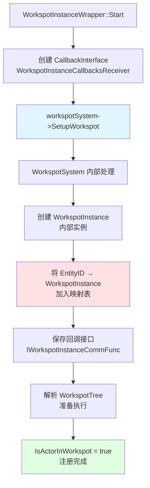

### SetupWorkspot 调用

**位置**: workspot.cpp lines 296-306

```cpp
workspotSystem->SetupWorkspot(
    HandleFromPtr( m_owner ),  // NPC Entity
    {
        m_initialParameters.m_workspot,           // WorkspotTree 资源
        m_initialParameters.m_nodeId,             // Workspot 节点 ID
        m_callbackInterface,                      // 回调接口
        m_initialParameters.m_entryAnimation,     // EntryAnim 名称
        m_initialParameters.m_exitAnimation,      // ExitAnim 名称
        m_initialParameters.m_isWorkspotStatic,
        m_initialParameters.m_globalItemManager,
        m_initialParameters.m_itemOverride,
        m_initialParameters.m_clippingSpace,
        m_initialParameters.m_disableInertiaBlend
    },
    m_initialParameters.m_masterWsOwner ? &syncInfo : nullptr
);
```

### WorkspotSystem 内部注册过程

**WorkspotSystem 维护的映射表**:
```cpp
// EntityID → WorkspotInstance 映射
red::HashMap< ent::EntityID, red::UniquePtr<work::WorkspotInstance> > m_instances;

// 注册时：
m_instances.Insert( entityId, CreateWorkspotInstance( setupContext ) );
```

### 注册后的状态查询

**IsActorInWorkspot 实现**:
```cpp
Bool WorkspotSystem::IsActorInWorkspot( const ent::EntityID& entityId, const WorkspotParams& params ) const
{
    auto it = m_instances.Find( entityId );
    if ( it != m_instances.End() )
    {
        if ( params.IsValid() )
        {
            // 检查是否在指定的 workspot 中
            return it->Second->GetWorkspotParams() == params;
        }
        // 检查是否在任何 workspot 中
        return true;
    }
    return false;
}
```

---

## 11. WorkspotSystem 中有什么？

### WorkspotSystem 核心组件

**位置**: `workspotSystem.h` lines 1-250

```cpp
class WorkspotSystem : public world::IWorkspotSystem
{
public:
    // 主要接口
    void SetupWorkspot( ... );  // 注册 workspot
    void SendCommand( ... );    // 发送命令
    Bool IsActorInWorkspot( ... );  // 查询是否在 workspot
    void ClearExitFlags( ... );
    void ClearPlayStopFlag( ... );
    // ... 更多接口

private:
    // 内部数据
    red::HashMap< ent::EntityID, red::UniquePtr<work::WorkspotInstance> > m_instances;
    red::HashMap< ent::EntityID, CommandQueue > m_commandQueues;
    work::WorkspotCallbackManager m_callbackManager;
    work::WorkspotSynchronizer m_synchronizer;
    // ...
};
```

### WorkspotSystem 架构图

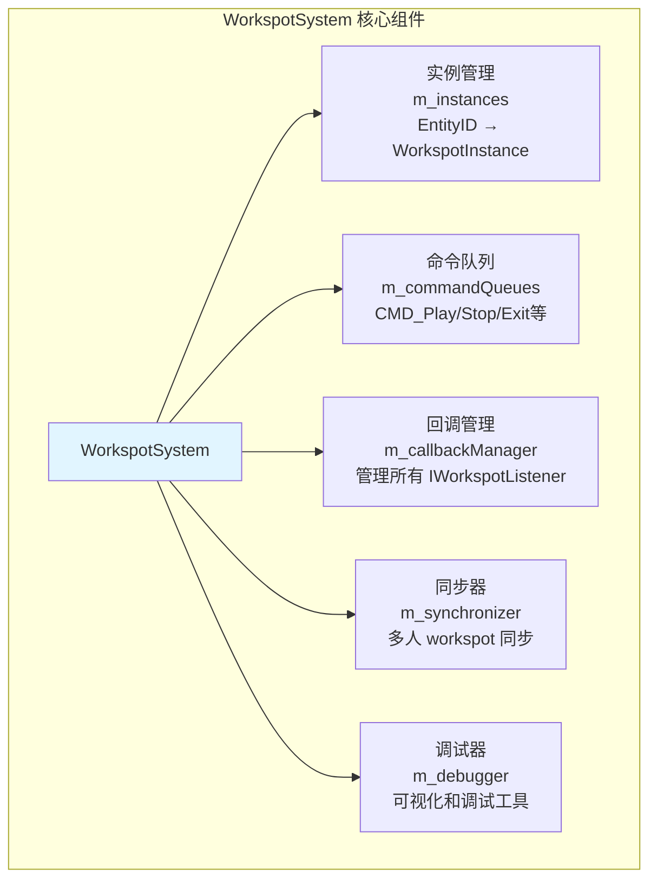

### 核心功能详解

#### 1. **实例管理**
```cpp
red::HashMap< ent::EntityID, red::UniquePtr<work::WorkspotInstance> > m_instances;
```
- **作用**: 维护所有活跃的 workspot 实例
- **键**: NPC 的 EntityID
- **值**: WorkspotInstance（包含 WorkspotTree、当前状态、动画播放器等）

**功能**:
- **注册**: `SetupWorkspot()` 创建新实例
- **查询**: `IsActorInWorkspot()` 检查 NPC 是否在 workspot
- **注销**: workspot 完成时移除实例

#### 2. **命令系统**
```cpp
enum WorkspotCommand
{
    CMD_Stop,              // 停止 workspot
    CMD_Play,              // 开始播放
    CMD_JumpToEntry,       // 跳转到指定 Entry
    CMD_FastExit,          // 快速退出
    CMD_SlowExit,          // 慢速退出（播放 ExitAnim）
    CMD_Adjust_And_Play,   // 调整位置后播放
    CMD_Pause,             // 暂停
    CMD_Unpause,           // 恢复
    CMD_ItemOverride,      // 道具覆盖
    CMD_EventListener,     // 注册/注销事件监听器
    // ... 更多命令
};
```

**命令队列**:
```cpp
red::HashMap< ent::EntityID, CommandQueue > m_commandQueues;
```
- **作用**: 每个 NPC 有独立的命令队列
- **执行**: 每帧处理队列中的命令（顺序执行）

**发送命令**:
```cpp
void WorkspotSystem::SendCommand( const ent::EntityID& entityId, Uint32 cmd,
                                  red::UniquePtr<IWorkspotCommandData> data = nullptr )
{
    // 1. 找到对应的 WorkspotInstance
    auto it = m_instances.Find( entityId );
    if ( it == m_instances.End() )
        return;

    // 2. 将命令加入队列
    CommandQueue& queue = m_commandQueues[entityId];
    queue.Push( { cmd, std::move(data) } );

    // 3. 下一帧执行
}
```

#### 3. **回调管理器**
```cpp
work::WorkspotCallbackManager m_callbackManager;
```

**作用**: 管理所有注册的 `IWorkspotListener`

**功能**:
- **注册**: 通过 `CMD_EventListener` 命令注册监听器
- **触发**: WorkspotInstance 执行时触发回调
- **注销**: workspot 结束时自动注销

**回调触发流程**:
```cpp
// WorkspotInstance 播放 EntryAnim 时
m_callbackManager.OnAnimationStarted( entityId, originId, entryId, flags, animName, fastForward );

// 所有注册的 IWorkspotListener 都会收到通知
```

#### 4. **同步器（Synchronizer）**
```cpp
work::WorkspotSynchronizer m_synchronizer;
```

**作用**: 处理多人 workspot 的同步（例如两个 NPC 同时坐在长椅上）

**功能**:
- **主从同步**: 一个 NPC 作为 Master，其他 NPC 作为 Slave
- **时间同步**: 确保所有 NPC 的动画在相同时间点
- **Transform 同步**: 同步相对位置和旋转

#### 5. **调试器**
```cpp
work::WorkspotDebugger m_debugger;
```

**作用**: 可视化和调试工具

**功能**:
- **绘制 Entry Points**: 显示所有 EntryAnim 的位置
- **绘制 Exit Points**: 显示所有 ExitAnim 的位置
- **显示当前状态**: 显示 NPC 当前播放的动画
- **显示命令队列**: 显示待执行的命令

---

## 总结

### 核心组件关系图

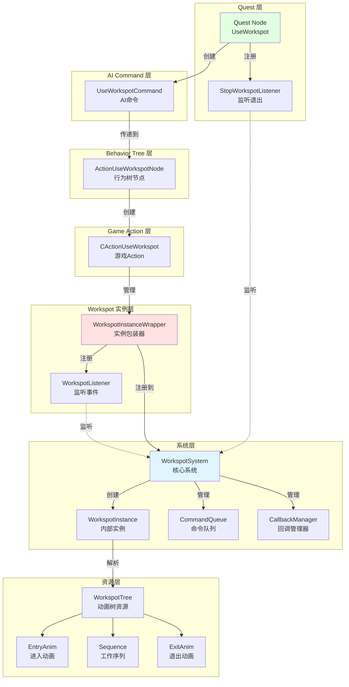

### 关键要点

1. **StopWorkspotListener**: 监听 workspot 退出完成，确保在开始新 workspot 前旧的已完全结束
2. **UseWorkspotCommand**: AI Command 系统的数据载体，传递 Quest 参数到 Behavior Tree
3. **WorkspotListener**: 监听 workspot 生命周期事件（Started/Finished/AnimationStarted等）
4. **ActionUseWorkspotNode**: Behavior Tree 中的节点，负责创建 CActionUseWorkspot
5. **CActionUseWorkspot**: Game 层的 Action，管理 WorkspotInstanceWrapper 的生命周期
6. **WorkspotInstanceWrapper**: 核心执行对象，管理运动、动画、回调
7. **Motion Extraction**: 从动画中提取运动数据，驱动 NPC 移动，实现动画和移动完美同步
8. **WorkspotSystem**: 中央管理系统，维护所有 workspot 实例、命令队列、回调管理等
9. **EntryAnim 四方向**: 为不同接近方向设计不同的进入动画，确保自然流畅
