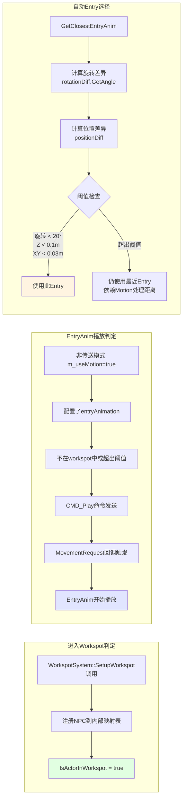
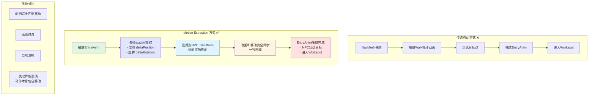

# Workspot 进入流程图

## 1. 完整进入流程 - 从Quest Node到WorkspotSystem

```mermaid
flowchart TB
    Start([Quest Node useWorkspot触发]) --> CheckTeleport{是否传送模式?<br/>m_teleport == true}

    CheckTeleport -->|非传送模式| CheckInWorkspot{NPC是否在其他workspot?<br/>IsActorInWorkspot}
    CheckTeleport -->|传送模式| CreateCommand[创建UseWorkspotCommand]

    CheckInWorkspot -->|是| RegisterStopListener[注册StopWorkspotListener<br/>等待退出完成]
    CheckInWorkspot -->|否| CreateCommand

    RegisterStopListener --> WaitExit[等待退出完成]
    WaitExit --> CreateCommand

    CreateCommand --> SetCommandParams[设置AI Command参数<br/>- workspotNode<br/>- forceEntryAnimName<br/>- jumpToEntry<br/>- moveToWorkspot]

    SetCommandParams --> RegisterListener[注册WorkspotListener<br/>监听EntryAnim事件]

    RegisterListener --> BehaviorTree[AI Command传递到<br/>Behavior Tree]

    BehaviorTree --> SetupAction[ActionUseWorkspotNode<br/>SetupAction]

    SetupAction --> AutoSelectEntry{是否自动选择Entry?<br/>CommunityWorkspot}

    AutoSelectEntry -->|是| CalcDistance[计算NPC在workspot<br/>空间中的位置]
    AutoSelectEntry -->|否| CreateAction[创建CActionUseWorkspot]

    CalcDistance --> FindClosest[查找最近的EntryPoint<br/>GetClosestEntryAnim]

    FindClosest --> CheckThreshold{检查阈值<br/>旋转 < 20°<br/>Z轴 < 0.1m<br/>XY < 0.03m}

    CheckThreshold -->|在阈值内| UseEntry[使用此EntryAnim]
    CheckThreshold -->|超出阈值| UseEntry

    UseEntry --> CreateAction

    CreateAction --> ActionSetup[CActionUseWorkspot::Setup]

    ActionSetup --> CreateInstance[创建WorkspotInstanceWrapper<br/>workspotManager->StartWorkspot]

    CreateInstance --> InstanceSetup[WorkspotInstance::Setup<br/>初始化参数]

    InstanceSetup --> RegisterCallback[注册完成回调]

    RegisterCallback --> ActionStart[CActionUseWorkspot::OnStart]

    ActionStart --> InstanceStart[WorkspotInstance::Start]

    InstanceStart --> CheckUseMotion{是否使用运动?<br/>m_useMotion}

    CheckUseMotion -->|是 非传送| SetupMotion[设置运动控制器<br/>- ForceRawRepresentation<br/>- AttachLocomotionController<br/>- MountToVirtualParent]
    CheckUseMotion -->|否 传送| DirectSetup[直接设置workspot]

    SetupMotion --> CheckSlideTime{是否配置slideTime?}

    CheckSlideTime -->|是| CreateAdjust[创建AdjustCommand<br/>计算位置差值deltaSlotSpace]
    CheckSlideTime -->|否| SetupWorkspot[WorkspotSystem::SetupWorkspot]

    CreateAdjust --> SetupWorkspot
    DirectSetup --> SetupWorkspot

    SetupWorkspot --> RegisterToSystem[注册NPC到WorkspotSystem<br/>IsActorInWorkspot = true]

    RegisterToSystem --> SendPlayCommand{有AdjustCommand?}

    SendPlayCommand -->|是| SendAdjustPlay[SendCommand<br/>CMD_Adjust_And_Play]
    SendPlayCommand -->|否| SendPlay[SendCommand<br/>CMD_Play]

    SendAdjustPlay --> SystemExecute[WorkspotSystem开始执行]
    SendPlay --> SystemExecute

    SystemExecute --> End([进入Workspot完成<br/>开始执行WorkspotTree])

    style Start fill:#e1f5e1
    style End fill:#ffe1e1
    style CheckInWorkspot fill:#fff4e1
    style CheckThreshold fill:#fff4e1
    style CheckUseMotion fill:#fff4e1
    style SetupWorkspot fill:#e1e5ff
    style RegisterToSystem fill:#e1e5ff
    style SystemExecute fill:#ffe1f5
```

## 2. WorkspotTree遍历与EntryAnim播放流程

```mermaid
flowchart TB
    Start([WorkspotSystem::SendCommand<br/>CMD_Play]) --> ParseTree[解析WorkspotTree结构]

    ParseTree --> CheckEntry{是否有EntryAnim节点?}

    CheckEntry -->|有EntryAnim| CheckMode{是否传送模式?}
    CheckEntry -->|无EntryAnim| DirectSequence[直接播放Sequence]

    CheckMode -->|传送模式| TeleportCallback[调用TeleportRequest回调<br/>瞬移到Entry Point]
    CheckMode -->|非传送模式| MotionCallback[调用MovementRequest回调<br/>请求动画驱动运动]

    TeleportCallback --> TeleportNPC[瞬移NPC到目标位置]
    TeleportNPC --> QuickEntry[快速播放或跳过EntryAnim]
    QuickEntry --> EnterSequence[进入Sequence节点]

    MotionCallback --> CreateMotionProvider[创建MotionProvider<br/>从EntryAnim提取运动数据]

    CreateMotionProvider --> CheckSlowEnter{检查Entry标志<br/>SlowEnter?}

    CheckSlowEnter -->|是| SetupAnimation[设置动画参数<br/>- animName 动画名称<br/>- logicDuration 逻辑持续时间<br/>- useMotionExtraction = true<br/>- applyMotion = true]
    CheckSlowEnter -->|否| FastEntry[快速进入]

    SetupAnimation --> CheckDynamic{是否动态workspot?<br/>trajectoryTargetObject}

    CheckDynamic -->|是| DynamicTarget[创建DynamicWorkspotEnter<br/>目标会移动]
    CheckDynamic -->|否| StaticTarget[创建SimpleMotionProviderTarget<br/>静态目标]

    DynamicTarget --> StartMotion[开始运动<br/>MoveWithMotionProvider]
    StaticTarget --> StartMotion

    StartMotion --> PlayAnim[播放EntryAnim动画]

    PlayAnim --> ExtractMotion[每帧从动画提取<br/>位移和旋转数据]

    ExtractMotion --> ApplyMotion[应用运动数据<br/>驱动NPC Transform]

    ApplyMotion --> CheckNavmesh{检查运动标志}

    CheckNavmesh --> ApplyNavmesh[应用NavMesh贴合<br/>- StayOnNavmesh<br/>- SnapZToNavmesh]

    ApplyNavmesh --> UpdateTransform[更新NPC位置和旋转]

    UpdateTransform --> CheckComplete{EntryAnim播放完成?}

    CheckComplete -->|未完成| ExtractMotion
    CheckComplete -->|完成| AnimCompleteCallback[触发OnAnimationStarted<br/>回调到Quest Node]

    FastEntry --> EnterSequence

    AnimCompleteCallback --> EnterSequence
    DirectSequence --> EnterSequence

    EnterSequence --> TraverseSequence[遍历Sequence节点]

    TraverseSequence --> CheckIdleAnim{是否有IdleAnim?}

    CheckIdleAnim -->|是| SetBottomLayer[设置底层Idle姿态<br/>双通道动画系统]
    CheckIdleAnim -->|否| DirectTopLayer[直接播放上层动画]

    SetBottomLayer --> PlayTopAnim[播放上层动画序列<br/>叠加在Idle姿态上]
    DirectTopLayer --> PlayTopAnim

    PlayTopAnim --> CheckLoop{是否循环播放?<br/>Sequence配置}

    CheckLoop -->|是| LoopSequence[循环播放Sequence动画]
    CheckLoop -->|否| PlayOnce[播放一次]

    LoopSequence --> CheckExit{收到退出命令?<br/>CMD_FastExit<br/>CMD_SlowExit}
    PlayOnce --> CheckAutoExit{自动播放Exit?<br/>m_autoCompletion}

    CheckExit -->|继续循环| LoopSequence
    CheckExit -->|退出| ProcessExit[处理退出流程]

    CheckAutoExit -->|是| ProcessExit
    CheckAutoExit -->|否| WaitExit[等待退出命令<br/>IdleOnlyMode]

    WaitExit --> CheckExit

    ProcessExit --> CheckExitType{退出类型?}

    CheckExitType -->|FastExit| QuickExit[快速退出<br/>中断当前动画<br/>解除workspot绑定]
    CheckExitType -->|SlowExit| ExitAnim[播放ExitAnim<br/>使用Motion Extraction]

    ExitAnim --> ExitMotion[从ExitAnim提取运动<br/>驱动NPC移动到退出点]

    ExitMotion --> ExitComplete[ExitAnim完成]

    QuickExit --> Cleanup[清理workspot状态]
    ExitComplete --> Cleanup

    Cleanup --> DetachController[分离运动控制器<br/>DetachLocomotionController]

    DetachController --> UnregisterWorkspot[从WorkspotSystem注销<br/>IsActorInWorkspot = false]

    UnregisterWorkspot --> NotifyComplete[调用OnCompleted回调<br/>通知Action完成]

    NotifyComplete --> End([Workspot执行完成])

    style Start fill:#e1f5e1
    style End fill:#ffe1e1
    style PlayAnim fill:#e1e5ff
    style ExtractMotion fill:#e1f5ff
    style ApplyMotion fill:#e1f5ff
    style EnterSequence fill:#fff4e1
    style PlayTopAnim fill:#e1e5ff
    style ProcessExit fill:#ffe1e1
```

## 3. 关键时刻判定流程

## 4. Motion Extraction 原理

## 5. 决策层启动流程摘要

```mermaid
graph LR
    A[Quest Node<br/>useWorkspot] -->|OnExecute| B[创建AI Command<br/>UseWorkspotCommand]
    B -->|传递到| C[Behavior Tree<br/>ActionUseWorkspotNode]
    C -->|SetupAction| D[CActionUseWorkspot<br/>Setup & Start]
    D -->|创建| E[WorkspotInstanceWrapper<br/>Start]
    E -->|注册和播放| F[WorkspotSystem<br/>SetupWorkspot<br/>SendCommand CMD_Play]
    F -->|开始执行| G[WorkspotTree<br/>EntryAnim播放]

    style A fill:#e1f5e1
    style B fill:#fff4e1
    style C fill:#e1e5ff
    style D fill:#e1f5ff
    style E fill:#ffe1f5
    style F fill:#ffe1e1
    style G fill:#e1ffe1
```

## 核心要点总结

### 什么时候进入Workspot？
- **时刻**: `WorkspotSystem::SetupWorkspot()` 被调用并发送 `CMD_Play` 命令后
- **判断**: `IsActorInWorkspot(entityId, workspotParams)` 返回 `true`

### 如何判断进入Workspot？
- 调用 `WorkspotSystem::IsActorInWorkspot(entityId, workspotParams)`
- 或检查 `WorkspotInstanceWrapper::IsActive()`

### 什么时候播放EntryAnim？
- **条件**: 非传送模式 + 配置了EntryAnimation + `m_useMotion = true`
- **时刻**: `CMD_Play` 命令后，WorkspotSystem遇到EntryAnim节点时
- **触发**: 通过 `MovementRequest()` 回调立即开始播放和移动

### 非传送模式如何移动？
- **不是传统寻路**: 不使用NavMesh先移动再播放动画
- **Motion Extraction**: EntryAnim本身包含运动数据
- **同步机制**: 播放动画的同时从动画提取位移和旋转，实时驱动NPC移动
- **结果**: 运动和动画完全同步，自然流畅

### Entry自动选择阈值
- **旋转阈值**: 20度 (`DEG2RAD(20.f)`)
- **Z轴位置**: 0.1米
- **XY平面位置**: 0.03米
- **用途**: 判断NPC是否足够接近Entry Point，可以直接使用该EntryAnim
