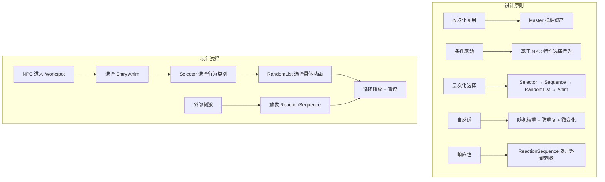

# Claude Conversation Log

Session ID: 382e576f-d0cd-41bf-b03a-c28f928a1615
Date: 2026-01-19 03:21:36

---

## 👤 User

“
1. 打开控制台，输入：
   workspot.EnableShadowDebugger
   
2. 走近酒吧，让 NPC 进入 workspot

3. 选择特定 NPC 查看详细信息：
   - 方式A：用相机对准 NPC，按调试快捷键
   - 方式B：脚本调用 SendDebugCommandEnt(ShadowToogleDebugData, npc)

4. 屏幕左侧会显示：
   - 当前使用的 workspot 资源
   - 动画播放历史
   - 任何警告（动画缺失、体型不匹配等）

5. 完成后关闭：
   workspot.StopAllDebuggers
”

这是之前一次回答中提到的一个例子，关于workspot调试，我成功过一次，但是之后就没能在屏幕左侧显示出相应的动画播放历史。其中说的`方式A：用相机对准 NPC，按调试快捷键` 这是什么意思？什么是“调试快捷键”呢

---

## 🤖 Claude

让我搜索一下代码库中关于 workspot 调试器和调试快捷键的相关信息。

---

## 🤖 Claude

让我查看快捷键配置文件和更多关于 Shadow Debugger 的信息。

---

## 🤖 Claude

让我搜索控制台命令的注册位置。

---

## 🤖 Claude

根据我对代码的分析，这里是关于 workspot 调试快捷键的完整说明：

## 调试快捷键

从输入配置文件 `r6/config/inputUserMappings.xml` 中找到的绑定：

| 按键 | 功能 | 说明 |
|------|------|------|
| **NumPad2** | `SelectPuppetWorkspots` | 选择相机视野内的 NPC 并切换 workspot 调试显示 |
| **NumPad2 长按** | `AlternativeWorkspotModeDebug` | 替代模式（切换视觉状态调试） |
| **Alt + NumPad2** | 自我调试模式 | 按住 Alt 再按 NumPad2，调试玩家自身的 workspot |
| **; (分号) 双击** | 快速退出 | 发送快速退出 workspot 信号 |
| **; (分号) 长按** | 慢速退出 | 发送慢速退出 workspot 信号 |

## 关键工作流程

根据 `debugSystem.cpp:2809-2816` 的逻辑：

```cpp
Bool shadowDebuggerActive = wSys->GetDebugger().IsToolActive( work::WorkspotDebugMode::ShadowToogleDebugData );
if ( shadowDebuggerActive )
{
    data->m_mode = work::WorkspotDebugMode::ShadowToogleDebugData;
}
```

**正确的使用顺序是：**

1. **先开启 Shadow Debugger**
   ```
   workspot.EnableShadowDebugger
   ```
   这会在后台开始追踪所有 NPC 的 workspot 活动

2. **等待 NPC 进入 workspot**

3. **用相机对准 NPC，按 NumPad2**
   - 这会切换该 NPC 的调试信息显示
   - 再次按下会关闭该 NPC 的显示

4. **如果想调试玩家**
   - 按住 Alt，然后按 NumPad2

## 你之前成功但后来失败的可能原因

1. **Shadow Debugger 未激活**：每次重启游戏后需要重新运行 `workspot.EnableShadowDebugger`

2. **NPC 需要在 workspot 中**：NumPad2 只对已经在 workspot 里的实体有效

3. **时序问题**：需要在 NPC 进入 workspot **之后**再按 NumPad2 来切换显示，Shadow Debugger 才能捕获到数据

4. **显示被关闭**：再次按 NumPad2 会关闭显示（toggle 行为）

建议你重新尝试完整流程，确保先运行控制台命令再使用快捷键。

---

## 👤 User

这是一个workspot资产，我想让你结合代码分析一下这个.workspot资产的设计思路，进而希望能够了解2077中对于workspot的设计使用理念。

---

## 👤 User

[Image: source: C:\Users\Windows\Desktop\temp\2077\workspot1.png]
[Image: source: C:\Users\Windows\Desktop\temp\2077\workspot2.png]
[Image: source: C:\Users\Windows\Desktop\temp\2077\workspot3.png]
[Image: source: C:\Users\Windows\Desktop\temp\2077\workspot4.png]

---

## 🤖 Claude

这是一个非常好的分析案例。让我先搜索代码中关于 Workspot 节点类型的定义，然后结合这个资产进行深入分析。

---

## 🤖 Claude

现在让我再查看一些关于 Selector 和条件判断的代码细节。

---

## 🤖 Claude

根据代码和截图，我来为你详细分析这个 `master_generic__stand_ground__stand_around__01.workspot` 资产的设计思路。

---

## Workspot 资产架构分析

### 1. 文件命名规范

```
master_generic__stand_ground__stand_around__01.workspot
│       │          │             │           │
│       │          │             │           └── 变体编号
│       │          │             └── 行为类型：站立闲逛
│       │          └── 姿态类别：地面站立
│       └── 通用性：可被多种 NPC 使用
└── 资产级别：master（主模板）
```

**设计理念**：通过命名规范实现资产的分类和复用管理。

---

### 2. 节点层次结构

从代码 `workspotTreeItems.h` 可以看到，这个 workspot 使用了以下节点类型：

```
Root Sequence
├── ReactionSequence [BumpLeftFront/Back, BumpRightFront/Back]
│   └── Sequence (idle: stand_2h_on_sides_01)
│       └── AnimClip (bump_front_left, bump_back_left...)
│
├── EntryAnim × N (多个入口动画，支持不同角度进入)
│   └── walk_0_to_stand_2h_on_sides_ow_01_turn{角度}_01
│
└── Selector (idle: stand_2h_on_sides_ow_01)  ← 核心行为选择器
    ├── ConditionalSequence (corpo_stand_lh_tablet_ow_01)  ← 条件分支
    │   └── RandomList
    │       └── AnimClip × N
    │
    ├── Sequence (stand_2h_on_hip_ow_01)      ← 双手叉腰
    │   └── RandomList
    │       └── AnimClip × N
    │
    ├── Sequence (stand_arms_crossed_front)   ← 双手交叉
    │   └── RandomList
    │
    ├── Sequence (stand_2h_phone_ow_01)       ← 看手机
    │   └── RandomList
    │
    ├── Sequence (stand_rh_cigarette_ow_01)   ← 抽烟
    │   └── RandomList
    │
    ├── Sequence (stand_rh_bottle_ow_01)      ← 拿瓶子
    │   └── RandomList
    │
    ├── ConditionalSequence (stand_rh_burger) ← 吃汉堡
    │   └── RandomList
    │
    ├── Sequence (stand_lh_fries_ow_01)       ← 吃薯条
    │   └── RandomList
    │
    └── Sequence (stand_rh_cup_ow_01)         ← 拿杯子
        └── RandomList
```

---

### 3. 核心节点类型解析

从 `workspotTreeItems.h:324-442`：

| 节点类型 | 代码类 | 作用 |
|---------|--------|------|
| **Selector** | `Selector : RandomList` | 从多个子 Sequence 中随机/条件选择一个执行 |
| **Sequence** | `Sequence : IContainerEntry` | 顺序执行子节点，可配置是否无限循环 |
| **ConditionalSequence** | `ConditionalSequence : Sequence` | 带条件的序列，满足条件才会被选中 |
| **ReactionSequence** | `ReactionSequence : Sequence` | 响应外部刺激（如碰撞）的序列 |
| **RandomList** | `RandomList : IContainerEntry` | 随机选择并播放子动画，带权重和防重复机制 |
| **AnimClip** | `AnimClip : IEntry` | 叶子节点，实际的动画播放 |
| **MotionAnimClip** | `MotionAnimClip : AnimClip` | 带位移的动画 |
| **EntryAnim** | `EntryAnim : IEntry` | 入口动画，NPC 进入 workspot 时播放 |

---

### 4. 设计理念分析

#### 4.1 **层次化行为选择**

```cpp
// workspotTreeItems.h:430-438
class Selector : public RandomList
{
    // 从多个 Sequence 中选择一个执行
    // 可以是随机选择，也可以基于条件（ConditionalSequence）
};
```

**设计思想**：NPC 在站立时的"大类行为"（看手机/抽烟/吃东西等）通过 Selector 选择，每种大类行为内部通过 RandomList 产生微变化。

#### 4.2 **条件系统**

从 `workspotConditions.h` 可以看到支持的条件类型：

```cpp
// 可用条件类型：
- IsPlayerCondition      // 是否是玩家
- BodytypeCondition      // 体型判断
- ActorTagCondition      // NPC 标签判断
- CoverTypeCondition     // 掩体类型（高/低）
- TimeOfDayCondition     // 时间条件
- ScriptedCondition      // 脚本自定义条件
```

**设计思想**：ConditionalSequence（如 `corpo_stand_lh_tablet_ow_01`）允许根据 NPC 特性选择行为。企业员工使用平板，帮派成员可能抽烟或喝酒。

#### 4.3 **RandomList 防重复机制**

```cpp
// workspotTreeItems.h:406-428
class RandomList : public work::IContainerEntry
{
    Int8  m_minClips = 3;              // 最少播放动画数
    Int8  m_maxClips = 5;              // 最多播放动画数
    Int8  m_dontRepeatLastAnims = 1;   // 不重复最近N个动画
    Float m_pauseBetweenLength = 4.f;  // 动画间暂停时长
    Float m_pauseLengthDeviation = 1.f;// 暂停时长随机偏差
    
    static constexpr Uint32 MAX_REPEAT_HISTORY = 5;
};
```

**设计思想**：确保动画播放的随机性和自然感，避免机械重复。

#### 4.4 **反应系统**

```cpp
// workspotTreeItems.h:345-376
class ReactionSequence : public Sequence
{
    red::DynArray<game::data::RecordID> m_reactionTypes; // 反应类型
    Float m_forcedBlendIn = 0.2f;                        // 强制融合时间
    // 面部动画配置...
};
```

**设计思想**：
- `BumpLeftFront/Back, BumpRightFront/Back` 处理被碰撞时的反应
- `<no_auto_transition>` 标记表示不自动过渡回主行为，由系统显式控制
- 这让 NPC 对外界刺激有自然反应

#### 4.5 **入口动画系统**

```cpp
// workspotTreeItems.h:268-303
class EntryAnim : public work::IEntry
{
    CName m_animName;                // 动画名称
    CName m_idleAnim;                // 进入后的 idle 动画
    move::MovementType m_movementType = move::MovementType::Walk;
    move::MovementOrientationType m_orientationType = move::MovementOrientationType::Forward;
};
```

截图中显示大量入口动画：
- `turn0_01` 到 `turn315_01`（每45度一个）
- `turn180i_01`, `turn180r_01`（180度左转/右转）

**设计思想**：支持 NPC 从任意方向自然地进入 workspot，通过最接近的角度选择合适的入口动画。

---

### 5. 动画命名规范

从截图分析动画命名模式：

```
stand_2h_on_sides_ow_01_shuffle_05
│      │   │      │   │    │     │
│      │   │      │   │    │     └── 变体编号
│      │   │      │   │    └── 具体动作类型
│      │   │      │   └── 版本标识
│      │   │      └── "open world" 标识
│      │   └── 姿态细节：双手在两侧
│      └── 手部位置：2h (双手)
└── 基础姿态：站立
```

**动作类型分类**：
- `shuffle` - 小幅移动/重心转移
- `look_around` - 四处张望
- `scratch_neck` - 挠脖子
- `stretch_muscle` - 伸展肌肉
- `check_phone` - 查看手机
- `wait_lookaround` - 等待时环顾
- `smoke`, `drop_ash` - 抽烟相关
- `drink`, `eat` - 饮食相关

---

### 6. 2077 Workspot 整体设计理念总结



**核心设计理念**：

1. **资产复用性**：`master_generic` 意味着这是一个可被多种 NPC 复用的模板

2. **行为多样性**：通过 Selector + 多种 Sequence 实现丰富的行为变化

3. **条件化定制**：ConditionalSequence 允许不同类型 NPC（企业员工/帮派成员/市民）表现不同行为

4. **微观自然感**：每个行为内部的 RandomList + 多变体动画确保 NPC 不会机械重复

5. **响应式设计**：ReactionSequence 让 NPC 对环境刺激有自然反应

6. **无缝进出**：多角度 Entry/Exit 动画确保 NPC 可以自然地进入和离开

这个 workspot 本质上是一个**行为状态机**，用数据驱动的方式定义了 NPC 站立闲逛时的完整行为树。

---

