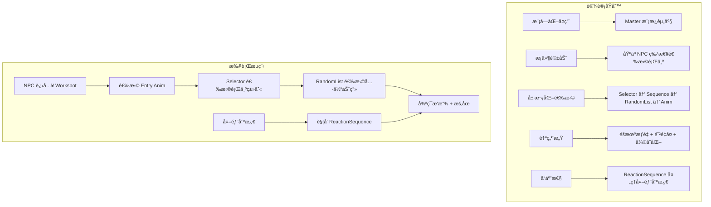

# Claude Conversation Log

Session ID: 382e576f-d0cd-41bf-b03a-c28f928a1615
Date: 2026-01-19 03:21:36

---

## 👤 User

“
1. 打开æ§åˆ¶å°ï¼Œè¾“入：
   workspot.EnableShadowDebugger
   
2. èµ°è¿‘é…’å§ï¼Œè®© NPC 进入 workspot

3. 选择特定 NPC 查看详细信æ¯ï¼š
   - æ–¹å¼A：用相机对准 NPC，按调试快æ·é”®
   - æ–¹å¼B：脚本调用 SendDebugCommandEnt(ShadowToogleDebugData, npc)

4. å±å¹•å·¦ä¾§ä¼šæ˜¾ç¤ºï¼š
   - 当å‰ä½¿ç”¨çš„ workspot 资æº
   - 动画播放å†å²
   - 任何警告（动画缺失ã€ä½“å‹ä¸åŒ¹é…等）

5. 完æˆå关闭：
   workspot.StopAllDebuggers
â€

这是之å‰ä¸€æ¬¡å›ç­”中æ到的一个例å­ï¼Œå…³äºworkspot调试，我æˆåŠŸè¿‡ä¸€æ¬¡ï¼Œä½†æ˜¯ä¹‹å就没能在å±å¹•å·¦ä¾§æ˜¾ç¤ºå‡ºç›¸åº”的动画播放å†å²ã€‚其中说的`æ–¹å¼A：用相机对准 NPC，按调试快æ·é”®` 这是什么æ„æ€ï¼Ÿä»€ä¹ˆæ˜¯â€œè°ƒè¯•å¿«æ·é”®â€å‘¢

---

## 🤖 Claude

让我æœç´¢ä¸€ä¸‹ä»£ç åº“ä¸­å…³äº workspot 调试器和调试快æ·é”®çš„相关信æ¯ã€‚

---

## 🤖 Claude

让我查看快æ·é”®é…ç½®æ–‡ä»¶å’Œæ›´å¤šå…³äº Shadow Debugger çš„ä¿¡æ¯ã€‚

---

## 🤖 Claude

让我æœç´¢æ§åˆ¶å°å‘½ä»¤çš„注册ä½ç½®ã€‚

---

## 🤖 Claude

æ ¹æ®æˆ‘对代ç çš„分æï¼Œè¿™é‡Œæ˜¯å…³äº workspot 调试快æ·é”®çš„完整说æ˜ï¼š

## 调试快æ·é”®

ä»è¾“å…¥é…置文件 `r6/config/inputUserMappings.xml` 中找到的绑定：

| 按键 | 功能 | è¯´æ˜ |
|------|------|------|
| **NumPad2** | `SelectPuppetWorkspots` | 选择相机视é‡å†…çš„ NPC å¹¶åˆ‡æ¢ workspot 调试显示 |
| **NumPad2 长按** | `AlternativeWorkspotModeDebug` | 替代模å¼ï¼ˆåˆ‡æ¢è§†è§‰çŠ¶æ€è°ƒè¯•ï¼‰ |
| **Alt + NumPad2** | è‡ªæˆ‘è°ƒè¯•æ¨¡å¼ | æŒ‰ä½ Alt å†æŒ‰ NumPad2，调试ç©å®¶è‡ªèº«çš„ workspot |
| **; (分å·) åŒå‡»** | 快速退出 | å‘é€å¿«é€Ÿé€€å‡º workspot ä¿¡å· |
| **; (分å·) 长按** | 慢速退出 | å‘é€æ…¢é€Ÿé€€å‡º workspot ä¿¡å· |

## 关键工作æµç¨‹

æ ¹æ® `debugSystem.cpp:2809-2816` 的逻辑：

```cpp
Bool shadowDebuggerActive = wSys->GetDebugger().IsToolActive( work::WorkspotDebugMode::ShadowToogleDebugData );
if ( shadowDebuggerActive )
{
    data->m_mode = work::WorkspotDebugMode::ShadowToogleDebugData;
}
```

**正确的使用顺åºæ˜¯ï¼š**

1. **å…ˆå¼€å¯ Shadow Debugger**
   ```
   workspot.EnableShadowDebugger
   ```
   这会在åå°å¼€å§‹è¿½è¸ªæ‰€æœ‰ NPC çš„ workspot 活动

2. **等待 NPC 进入 workspot**

3. **用相机对准 NPC，按 NumPad2**
   - 这会切æ¢è¯¥ NPC 的调试信æ¯æ˜¾ç¤º
   - å†æ¬¡æŒ‰ä¸‹ä¼šå…³é—­è¯¥ NPC 的显示

4. **如æœæƒ³è°ƒè¯•ç©å®¶**
   - æŒ‰ä½ Alt，然å按 NumPad2

## 你之å‰æˆåŠŸä½†åæ¥å¤±è´¥çš„å¯èƒ½åŸå› 

1. **Shadow Debugger 未激活**：æ¯æ¬¡é‡å¯æ¸¸æˆå需è¦é‡æ–°è¿è¡Œ `workspot.EnableShadowDebugger`

2. **NPC 需è¦åœ¨ workspot 中**：NumPad2 åªå¯¹å·²ç»åœ¨ workspot 里的å®ä½“有效

3. **æ—¶åºé—®é¢˜**：需è¦åœ¨ NPC 进入 workspot **之å**å†æŒ‰ NumPad2 æ¥åˆ‡æ¢æ˜¾ç¤ºï¼ŒShadow Debugger æ‰èƒ½æ•è·åˆ°æ•°æ®

4. **显示被关闭**：å†æ¬¡æŒ‰ NumPad2 会关闭显示（toggle 行为）

建议你é‡æ–°å°è¯•å®Œæ•´æµç¨‹ï¼Œç¡®ä¿å…ˆè¿è¡Œæ§åˆ¶å°å‘½ä»¤å†ä½¿ç”¨å¿«æ·é”®ã€‚

---

## 👤 User

这是一个workspot资产，我想让你结åˆä»£ç åˆ†æ一下这个.workspot资产的设计æ€è·¯ï¼Œè¿›è€Œå¸Œæœ›èƒ½å¤Ÿäº†è§£2077中对äºworkspot的设计使用ç†å¿µã€‚

---

## 👤 User

[Image: source: C:\Users\Windows\Desktop\temp\2077\workspot1.png]
[Image: source: C:\Users\Windows\Desktop\temp\2077\workspot2.png]
[Image: source: C:\Users\Windows\Desktop\temp\2077\workspot3.png]
[Image: source: C:\Users\Windows\Desktop\temp\2077\workspot4.png]

---

## 🤖 Claude

这是一个é常好的分æ案例。让我先æœç´¢ä»£ç ä¸­å…³äº Workspot 节点类å‹çš„定义，然å结åˆè¿™ä¸ªèµ„产进行深入分æ。

---

## 🤖 Claude

ç°åœ¨è®©æˆ‘å†æŸ¥çœ‹ä¸€äº›å…³äº Selector å’Œæ¡ä»¶åˆ¤æ–­çš„代ç ç»†èŠ‚。

---

## 🤖 Claude

æ ¹æ®ä»£ç å’Œæˆªå›¾ï¼Œæˆ‘æ¥ä¸ºä½ è¯¦ç»†åˆ†æ这个 `master_generic__stand_ground__stand_around__01.workspot` 资产的设计æ€è·¯ã€‚

---

## Workspot 资产æ¶æ„分æ

### 1. 文件命å规范

```
master_generic__stand_ground__stand_around__01.workspot
│       │          │             │           │
│       │          │             │           └── å˜ä½“ç¼–å·
│       │          │             └── 行为类å‹ï¼šç«™ç«‹é—²é€›
│       │          └── 姿æ€ç±»åˆ«ï¼šåœ°é¢ç«™ç«‹
│       └── 通用性：å¯è¢«å¤šç§ NPC 使用
└── 资产级别：master（主模æ¿ï¼‰
```

**设计ç†å¿µ**：通过命å规范å®ç°èµ„产的分类和å¤ç”¨ç®¡ç†ã€‚

---

### 2. 节点层次结æ„

ä»ä»£ç  `workspotTreeItems.h` å¯ä»¥çœ‹åˆ°ï¼Œè¿™ä¸ª workspot 使用了以下节点类å‹ï¼š

```
Root Sequence
├── ReactionSequence [BumpLeftFront/Back, BumpRightFront/Back]
│   └── Sequence (idle: stand_2h_on_sides_01)
│       └── AnimClip (bump_front_left, bump_back_left...)
│
├── EntryAnim × N (多个入å£åŠ¨ç”»ï¼Œæ”¯æŒä¸åŒè§’度进入)
│   └── walk_0_to_stand_2h_on_sides_ow_01_turn{角度}_01
│
└── Selector (idle: stand_2h_on_sides_ow_01)  ↠核心行为选择器
    ├── ConditionalSequence (corpo_stand_lh_tablet_ow_01)  ↠æ¡ä»¶åˆ†æ”¯
    │   └── RandomList
    │       └── AnimClip × N
    │
    ├── Sequence (stand_2h_on_hip_ow_01)      ↠åŒæ‰‹å‰è…°
    │   └── RandomList
    │       └── AnimClip × N
    │
    ├── Sequence (stand_arms_crossed_front)   ↠åŒæ‰‹äº¤å‰
    │   └── RandomList
    │
    ├── Sequence (stand_2h_phone_ow_01)       ↠看手机
    │   └── RandomList
    │
    ├── Sequence (stand_rh_cigarette_ow_01)   ↠抽烟
    │   └── RandomList
    │
    ├── Sequence (stand_rh_bottle_ow_01)      ↠拿瓶å­
    │   └── RandomList
    │
    ├── ConditionalSequence (stand_rh_burger) ↠åƒæ±‰å ¡
    │   └── RandomList
    │
    ├── Sequence (stand_lh_fries_ow_01)       ↠åƒè–¯æ¡
    │   └── RandomList
    │
    └── Sequence (stand_rh_cup_ow_01)         ↠拿æ¯å­
        └── RandomList
```

---

### 3. 核心节点类å‹è§£æ

ä» `workspotTreeItems.h:324-442`：

| èŠ‚ç‚¹ç±»å‹ | 代ç ç±» | 作用 |
|---------|--------|------|
| **Selector** | `Selector : RandomList` | ä»å¤šä¸ªå­ Sequence 中éšæœº/æ¡ä»¶é€‰æ‹©ä¸€ä¸ªæ‰§è¡Œ |
| **Sequence** | `Sequence : IContainerEntry` | 顺åºæ‰§è¡Œå­èŠ‚点，å¯é…置是å¦æ— é™å¾ªç¯ |
| **ConditionalSequence** | `ConditionalSequence : Sequence` | 带æ¡ä»¶çš„åºåˆ—，满足æ¡ä»¶æ‰ä¼šè¢«é€‰ä¸­ |
| **ReactionSequence** | `ReactionSequence : Sequence` | å“应外部刺激（如碰æ’）的åºåˆ— |
| **RandomList** | `RandomList : IContainerEntry` | éšæœºé€‰æ‹©å¹¶æ’­æ”¾å­åŠ¨ç”»ï¼Œå¸¦æƒé‡å’Œé˜²é‡å¤æœºåˆ¶ |
| **AnimClip** | `AnimClip : IEntry` | å¶å­èŠ‚点，å®é™…的动画播放 |
| **MotionAnimClip** | `MotionAnimClip : AnimClip` | 带ä½ç§»çš„动画 |
| **EntryAnim** | `EntryAnim : IEntry` | å…¥å£åŠ¨ç”»ï¼ŒNPC 进入 workspot 时播放 |

---

### 4. 设计ç†å¿µåˆ†æ

#### 4.1 **层次化行为选择**

```cpp
// workspotTreeItems.h:430-438
class Selector : public RandomList
{
    // ä»å¤šä¸ª Sequence 中选择一个执行
    // å¯ä»¥æ˜¯éšæœºé€‰æ‹©ï¼Œä¹Ÿå¯ä»¥åŸºäºæ¡ä»¶ï¼ˆConditionalSequence）
};
```

**设计æ€æƒ³**：NPC 在站立时的"大类行为"（看手机/抽烟/åƒä¸œè¥¿ç­‰ï¼‰é€šè¿‡ Selector 选择，æ¯ç§å¤§ç±»è¡Œä¸ºå†…部通过 RandomList 产生微å˜åŒ–。

#### 4.2 **æ¡ä»¶ç³»ç»Ÿ**

ä» `workspotConditions.h` å¯ä»¥çœ‹åˆ°æ”¯æŒçš„æ¡ä»¶ç±»å‹ï¼š

```cpp
// å¯ç”¨æ¡ä»¶ç±»å‹ï¼š
- IsPlayerCondition      // 是å¦æ˜¯ç©å®¶
- BodytypeCondition      // 体å‹åˆ¤æ–­
- ActorTagCondition      // NPC 标签判断
- CoverTypeCondition     // æ©ä½“ç±»å‹ï¼ˆé«˜/ä½ï¼‰
- TimeOfDayCondition     // 时间æ¡ä»¶
- ScriptedCondition      // 脚本自定义æ¡ä»¶
```

**设计æ€æƒ³**：ConditionalSequence（如 `corpo_stand_lh_tablet_ow_01`）å…è®¸æ ¹æ® NPC 特性选择行为。ä¼ä¸šå‘˜å·¥ä½¿ç”¨å¹³æ¿ï¼Œå¸®æ´¾æˆå‘˜å¯èƒ½æŠ½çƒŸæˆ–å–酒。

#### 4.3 **RandomList 防é‡å¤æœºåˆ¶**

```cpp
// workspotTreeItems.h:406-428
class RandomList : public work::IContainerEntry
{
    Int8  m_minClips = 3;              // 最少播放动画数
    Int8  m_maxClips = 5;              // 最多播放动画数
    Int8  m_dontRepeatLastAnims = 1;   // ä¸é‡å¤æœ€è¿‘N个动画
    Float m_pauseBetweenLength = 4.f;  // 动画间暂åœæ—¶é•¿
    Float m_pauseLengthDeviation = 1.f;// æš‚åœæ—¶é•¿éšæœºåå·®
    
    static constexpr Uint32 MAX_REPEAT_HISTORY = 5;
};
```

**设计æ€æƒ³**：确ä¿åŠ¨ç”»æ’­æ”¾çš„éšæœºæ€§å’Œè‡ªç„¶æ„Ÿï¼Œé¿å…机械é‡å¤ã€‚

#### 4.4 **å应系统**

```cpp
// workspotTreeItems.h:345-376
class ReactionSequence : public Sequence
{
    red::DynArray<game::data::RecordID> m_reactionTypes; // å应类å‹
    Float m_forcedBlendIn = 0.2f;                        // 强制èåˆæ—¶é—´
    // é¢éƒ¨åŠ¨ç”»é…ç½®...
};
```

**设计æ€æƒ³**：
- `BumpLeftFront/Back, BumpRightFront/Back` 处ç†è¢«ç¢°æ’时的å应
- `<no_auto_transition>` 标记表示ä¸è‡ªåŠ¨è¿‡æ¸¡å›ä¸»è¡Œä¸ºï¼Œç”±ç³»ç»Ÿæ˜¾å¼æ§åˆ¶
- 这让 NPC 对外界刺激有自然å应

#### 4.5 **å…¥å£åŠ¨ç”»ç³»ç»Ÿ**

```cpp
// workspotTreeItems.h:268-303
class EntryAnim : public work::IEntry
{
    CName m_animName;                // 动画å称
    CName m_idleAnim;                // 进入åçš„ idle 动画
    move::MovementType m_movementType = move::MovementType::Walk;
    move::MovementOrientationType m_orientationType = move::MovementOrientationType::Forward;
};
```

截图中显示大é‡å…¥å£åŠ¨ç”»ï¼š
- `turn0_01` 到 `turn315_01`（æ¯45度一个）
- `turn180i_01`, `turn180r_01`（180度左转/å³è½¬ï¼‰

**设计æ€æƒ³**ï¼šæ”¯æŒ NPC ä»ä»»æ„æ–¹å‘自然地进入 workspot，通过最æ¥è¿‘的角度选择åˆé€‚çš„å…¥å£åŠ¨ç”»ã€‚

---

### 5. 动画命å规范

ä»æˆªå›¾åˆ†æ动画命å模å¼ï¼š

```
stand_2h_on_sides_ow_01_shuffle_05
│      │   │      │   │    │     │
│      │   │      │   │    │     └── å˜ä½“ç¼–å·
│      │   │      │   │    └── 具体动作类å‹
│      │   │      │   └── 版本标识
│      │   │      └── "open world" 标识
│      │   └── 姿æ€ç»†èŠ‚：åŒæ‰‹åœ¨ä¸¤ä¾§
│      └── 手部ä½ç½®ï¼š2h (åŒæ‰‹)
└── 基础姿æ€ï¼šç«™ç«‹
```

**动作类å‹åˆ†ç±»**：
- `shuffle` - å°å¹…移动/é‡å¿ƒè½¬ç§»
- `look_around` - 四处张望
- `scratch_neck` - 挠脖å­
- `stretch_muscle` - 伸展肌肉
- `check_phone` - 查看手机
- `wait_lookaround` - 等待时ç¯é¡¾
- `smoke`, `drop_ash` - 抽烟相关
- `drink`, `eat` - 饮食相关

---

### 6. 2077 Workspot 整体设计ç†å¿µæ€»ç»“



**核心设计ç†å¿µ**：

1. **资产å¤ç”¨æ€§**：`master_generic` æ„味ç€è¿™æ˜¯ä¸€ä¸ªå¯è¢«å¤šç§ NPC å¤ç”¨çš„模æ¿

2. **行为多样性**：通过 Selector + å¤šç§ Sequence å®ç°ä¸°å¯Œçš„行为å˜åŒ–

3. **æ¡ä»¶åŒ–定制**：ConditionalSequence å…许ä¸åŒç±»å‹ NPC（ä¼ä¸šå‘˜å·¥/帮派æˆå‘˜/市民）表ç°ä¸åŒè¡Œä¸º

4. **微观自然感**：æ¯ä¸ªè¡Œä¸ºå†…部的 RandomList + 多å˜ä½“åŠ¨ç”»ç¡®ä¿ NPC ä¸ä¼šæœºæ¢°é‡å¤

5. **å“应å¼è®¾è®¡**：ReactionSequence 让 NPC 对ç¯å¢ƒåˆºæ¿€æœ‰è‡ªç„¶å应

6. **æ— ç¼è¿›å‡º**：多角度 Entry/Exit åŠ¨ç”»ç¡®ä¿ NPC å¯ä»¥è‡ªç„¶åœ°è¿›å…¥å’Œç¦»å¼€

这个 workspot 本质上是一个**行为状æ€æœº**，用数æ®é©±åŠ¨çš„æ–¹å¼å®šä¹‰äº† NPC 站立闲逛时的完整行为树。

---

