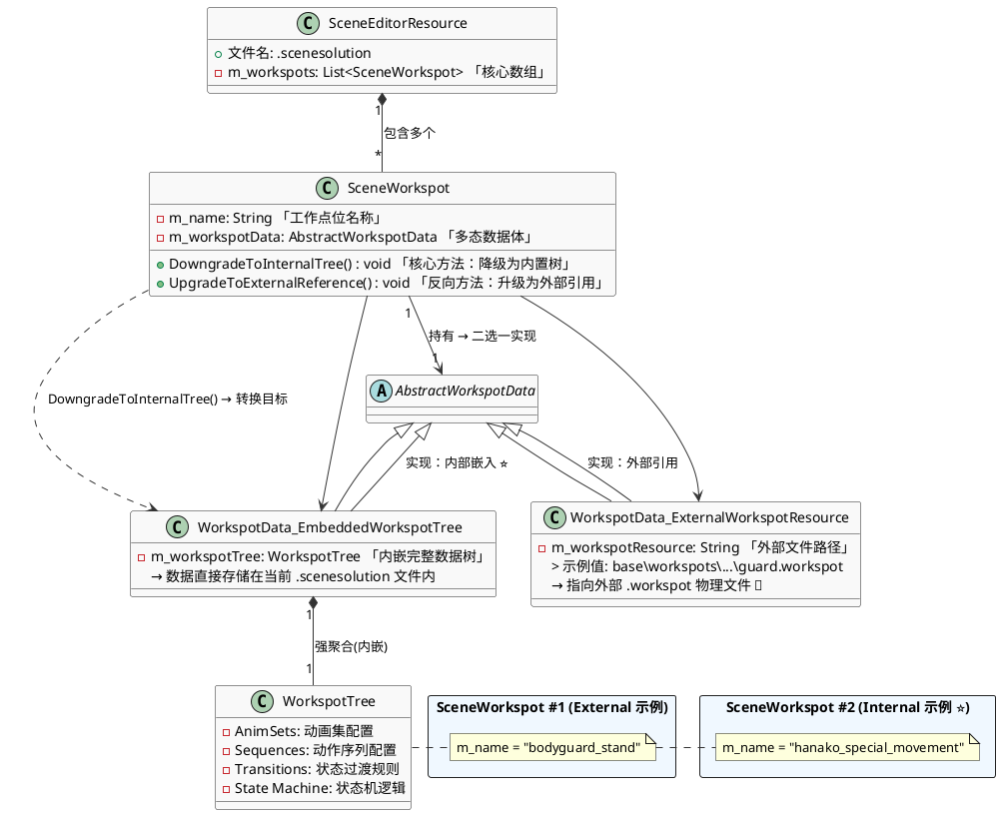
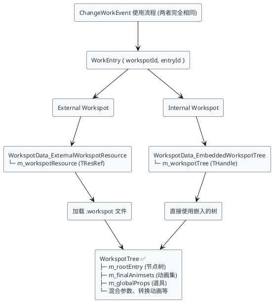
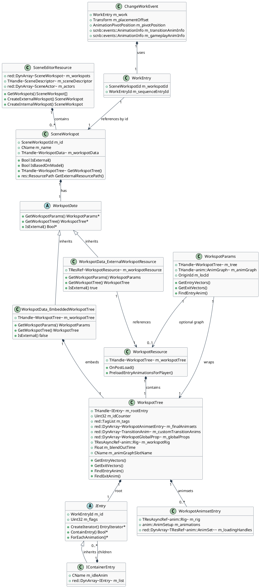
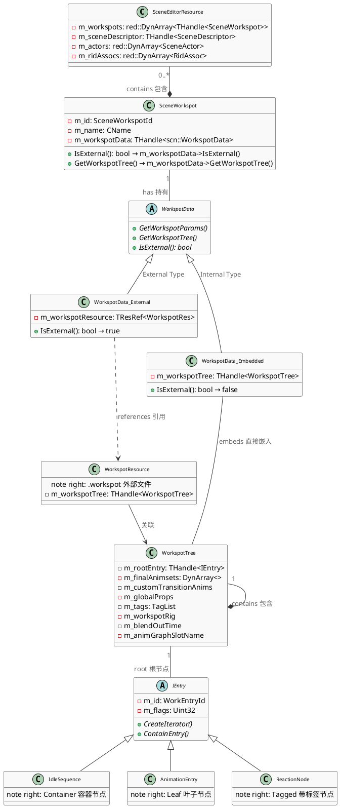

## SceneSolution：：Workspot

  | 特性     | External Workspot      | Internal Workspot        |
  |----------|------------------------|--------------------------|
  | 存储位置 | 独立的 .workspot 文件  | 嵌入在 .scenesolution 中 |
  | 引用方式 | 通过资源路径引用       | 直接包含数据             |
  | 复用性   | ✅ 可在多个场景复用    | ❌ 仅限当前场景          |
  | 编辑方式 | 修改 .workspot 文件    | 在场景编辑器中直接编辑   |
  | 版本控制 | 独立文件，便于管理     | 与场景绑定               |
  | 适用场景 | 通用动作（站立、坐下） | 场景特定动作             |
  | 数据来源 | m_modelWorkspot        | m_workspotData           |

#  SceneEditorResource到Workspot数据结构

上图可知，Internal Workspot 节点会直接嵌入 .scenesolution 文件内，而 External Workspot 节点则需要通过 m_workspotResource 属性引用外部 .workspot 文件。

同时无论内外部都有相应的转化方式，外部转为内部，内部转为外部

# ChangeWorkEvent对Workspot调用机制

  | 特性       | External Workspot                 | Internal Workspot                 |
  |------------|-----------------------------------|-----------------------------------|
  | 使用方式   | ✅ ChangeWorkEvent                | ✅ ChangeWorkEvent                |
  | 引用方式   | WorkEntry { workspotId, entryId } | WorkEntry { workspotId, entryId } |
  | 获取接口   | GetWorkspotTree()                 | GetWorkspotTree()                 |
  | 数据来源   | 加载 .workspot 文件               | 使用嵌入的 m_workspotTree         |
  | 运行时行为 | ✅ 完全相同                       | ✅ 完全相同                       |
  | 编译结果   | ✅ 完全相同                       | ✅ 完全相同                       |
  | 代码差异   | ❌ 无差异                         | ❌ 无差异                         |

$env:GOOGLE_GEMINI_BASE_URL="https://jeniya.cn"
$env:GEMINI_API_KEY="sk-5P0JVMtxkRn1SvjgByj2cdeVj16T8ryVut2H8pG7jI1AX4mM"

# 类关系图

### ChangeWorkEvent的WorkspotLibrary

  | 类型              | 在 Outline 中     | 在 WorkspotLibraries 中           | 判断条件                                                  |
  |-------------------|-------------------|-----------------------------------|-----------------------------------------------------------|
  | Library Workspots | External Workspot | 按文件夹层级显示（如 chairs\sit\) | IsExternal() == true 且路径以 base\workspot_library\ 开头 |
  | Scene External    | External Workspot | _scene_not_in_workspot_library\   | IsExternal() == true 但路径不在 library 中                |
  | Scene Embedded    | Internal Workspot | _scene_embedded\                  | IsExternal() == false                                     |

# 深挖WorkspotTree
IEntry : public ISerializable 是一个纯抽象基类（接口类），也是所有「工作台 / 交互位 (Workspot)」动画节点的顶级父类；
## IEntry 是 WorkspotTree 动画树的「通用节点抽象」，是整个工作台 (Workspot) 动画逻辑体系的「最小执行单元 & 数据载体」

```plantuml
@startuml IEntry 继承层级完整类图
' 全局样式
skinparam class {
    BackgroundColor #f9f9f9
    BorderColor #222222
    ArrowColor #333333
    FontName 微软雅黑
    FontSize 10
}
skinparam groupInheritance 2
' ========== 抽象基类 ==========
abstract class IEntry <<Abstract>> {
    - m_id: WorkEntryId
    - m_flags: Uint32
    + {abstract} CreateIterator(): EntryIterator*
    + {abstract} ContainEntry(id): Bool
    + {abstract} GetFriendlyName(): String
    + {abstract} CreateCopy(): THandle<IEntry>
    + ForEachAnimation(fun)
    + ForEachNode(preFun, postFun)
    --
    **Flags 常量**
    Animation = 0x02
    FastExit = 0x04
    SlowExit = 0x08
    SlowEnter = 0x10
    Pause = 0x20
    Synchronized = 0x40
    TagNode = 0x80
    Reaction = 0x100
    LookAtDrivenTurn = 0x200
    HasItem = 0x2000
    MotionAnim = 0x8000
}
abstract class IContainerEntry <<Abstract>> {
    - m_idleAnim: CName
    - m_list: red::DynArray<THandle<IEntry>>
    + ContainEntry(id): Bool {override}
    + ForEachAnimation(fun) {override}
    + ForEachNode(preFun, postFun) {override}
}
' ========== 叶子节点（Leaf Entries）==========
package "Leaf Entries (叶子节点 - 直接执行动画)" #DDFFDD {
    
    class AnimClip {
        - m_animName: CName
        - m_blendOutTime: Float
        + CreateIterator(): EntryIterator*
        + ForEachAnimation(fun)
        + GetFriendlyName(): String
        --
        flags: Animation
    }
    class MotionAnimClip {
        + GetFriendlyName(): String
        --
        flags: Animation | MotionAnim
        用途: 带根运动的动画（行走/跑步）
    }
    class AnimClipWithItem {
        - m_itemActions: DynArray<IWorkspotItemAction>
        --
        flags: Animation | HasItem
        用途: 拿枪、吸烟等带道具动画
    }
    class SyncAnimClip {
        - m_slotName: CName
        - m_syncOffset: Transform
        --
        flags: Animation | Synchronized
        用途: 多角色同步动画（握手、对话）
    }
    class EntryAnim {
        - m_animName: CName
        - m_idleAnim: CName
        - m_slotName: CName
        - m_blendOutTime: Float
        - m_isSynchronized: Bool
        - m_syncOffset: Transform
        - m_movementType: move::MovementType
        - m_orientationType: move::MovementOrientationType
        --
        flags: SlowEnter | MoveToMotionAnim
        用途: 从外部进入 workspot
    }
    class SyncMasterEntryAnim {
        + AllowSync(asMaster): Bool {override}
        --
        强制 m_isSynchronized = true
        用途: 多人同步进入时的主控角色
    }
    class ExitAnim {
        - m_animName: CName
        - m_slotName: CName
        - m_idleAnim: CName
        - m_isSynchronized: Bool
        - m_stayOnNavmesh: Bool
        - m_snapZToNavmesh: Bool
        - m_disableRandomExit: Bool
        - m_syncOffset: Transform
        - m_movementType: move::MovementType
        --
        flags: SlowExit
        用途: 正常退出 workspot（带动画）
    }
    class FastExit {
        - m_animName: CName
        - m_forcedBlendIn: Float
        - m_movementType: move::MovementType
        --
        flags: FastExit | MotionAnim
        用途: 被打断时的紧急退出
    }
    class LookAtDrivenTurn {
        - m_turnAnimName: CName
        - m_turnAngle: Int32
        - m_blendTime: Float
        --
        flags: LookAtDrivenTurn
        用途: 根据视线方向自动转身
    }
    class PauseClip {
        - m_timeMin: Float
        - m_timeMax: Float
        - m_blendOutTime: Float
        --
        flags: Pause
        用途: 序列中插入随机长度暂停
    }
    class TagNode {
        - m_tag: CName
        --
        flags: TagNode
        用途: 命名跳转点，可通过 tag 查找
    }
}
' ========== 容器节点（Container Entries）==========
package "Container Entries (容器节点 - 包含子节点)" #DDDDFF {
    class Sequence {
        - m_previousLoopInfinitely: Bool
        - m_loopInfinitely: Bool
        - m_category: WorkspotCategory
        --
        用途: 按顺序播放子节点
        例如: idle → look_around → idle → scratch_head
    }
    class ReactionSequence {
        - m_reactionTypes: DynArray<RecordID>
        - m_forcedBlendIn: Float
        - m_facialKeyWeight: Float
        - m_mainEmotionalState: CName
        - m_emotionalExpression: CName
        - m_facialIdleMaleAnimation: CName
        - m_facialIdleKey_MaleAnimation: CName
        - m_facialIdleFemaleAnimation: CName
        - m_facialIdleKey_FemaleAnimation: CName
        --
        flags: Reaction
        用途: 响应外部事件（被攻击、惊吓）
        **不能直接选择，仅通过 Reaction 系统触发**
    }
    class ConditionalSequence {
        - m_multipleConditionOperator: LogicalOperation
        - m_conditionList: DynArray<IWorkspotCondition>
        --
        用途: 满足条件才播放序列
        例如: 只在夜间播放、只对特定实体播放
    }
    class RandomList {
        - m_minClips: Int8
        - m_maxClips: Int8
        - m_dontRepeatLastAnims: Int8
        - m_pauseBetweenLength: Float
        - m_pauseLengthDeviation: Float
        - m_pauseBlendOutTime: Float
        - m_weights: DynArray<Float>
        --
        MAX_REPEAT_HISTORY = 5
        用途: 随机选择子节点播放
        例如: 从 [scratch_head, look_around, yawn] 随机选 3-5 次
    }
    class Selector {
        --
        用途: 单次随机选择（不循环）
        权重选择，只播放一次
    }
}
' ========== 继承关系 ==========
IEntry <|-- IContainerEntry : 继承
IEntry <|-- AnimClip
IEntry <|-- EntryAnim
IEntry <|-- ExitAnim
IEntry <|-- FastExit
IEntry <|-- LookAtDrivenTurn
IEntry <|-- PauseClip
IEntry <|-- TagNode
AnimClip <|-- MotionAnimClip
AnimClip <|-- AnimClipWithItem
AnimClip <|-- SyncAnimClip
EntryAnim <|-- SyncMasterEntryAnim
IContainerEntry <|-- Sequence
IContainerEntry <|-- RandomList
Sequence <|-- ReactionSequence
Sequence <|-- ConditionalSequence
RandomList <|-- Selector
' ========== 组合关系 ==========
IContainerEntry "1" *-- "0..*" IEntry : m_list\n包含子节点
' ========== 说明注释 ==========
note right of IEntry
  **IEntry 是所有 Workspot 节点的基类**
  
  所有节点都有：
  • m_id: 唯一标识符
  • m_flags: 节点类型标志
  
  节点分为两大类：
  1. Leaf Entries (叶子) - 直接执行动画
  2. Container Entries (容器) - 组织子节点
end note
note right of IContainerEntry
  **容器节点的共同特性**
  
  • m_idleAnim: 默认 idle 动画
  • m_list: 子节点列表
  
  可以包含任意类型的 IEntry 子节点
  （包括其他容器节点，形成树结构）
end note
note bottom of AnimClip
  **AnimClip 是最基础的动画节点**
  
  只播放一个动画片段
  可以被扩展为：
  • MotionAnimClip (带位移)
  • AnimClipWithItem (带道具)
  • SyncAnimClip (多角色同步)
end note
note bottom of Sequence
  **Sequence 是最常用的容器节点**
  
  顺序播放子节点，可以循环
  
  扩展版本：
  • ReactionSequence: 响应外部事件
  • ConditionalSequence: 条件判断
end note
@enduml

```

~~~
  IEntry (抽象基类)
  ├── 直接子类（叶子节点）
  │   ├── AnimClip                    ← 基础动画片段
  │   │   ├── MotionAnimClip          ← 带位移动画
  │   │   ├── AnimClipWithItem        ← 带道具动画
  │   │   └── SyncAnimClip            ← 同步动画
  │   ├── EntryAnim                   ← 进入动画
  │   │   └── SyncMasterEntryAnim     ← 同步主入口
  │   ├── ExitAnim                    ← 退出动画
  │   ├── FastExit                    ← 快速退出
  │   ├── LookAtDrivenTurn            ← 视线转向
  │   ├── PauseClip                   ← 暂停节点
  │   └── TagNode                     ← 标签节点
  │
  └── IContainerEntry (抽象容器基类)
      ├── Sequence                    ← 序列（顺序播放）
      │   ├── ReactionSequence        ← 反应序列
      │   └── ConditionalSequence     ← 条件序列
      └── RandomList                  ← 随机列表
          └── Selector                ← 选择器
~~~
  3. 类与用途对照表

  | 你原图中的名称 | 实际类名         | 继承自          | 用途                               |
  |----------------|------------------|-----------------|------------------------------------|
  | IdleSequence   | Sequence         | IContainerEntry | 顺序播放子节点，可以包含 idle 动画 |
  | AnimationEntry | AnimClip         | IEntry          | 播放单个动画片段                   |
  | ReactionNode   | ReactionSequence | Sequence        | 响应外部事件（攻击、惊吓等）       |
  | ReactionNode   | TagNode          | IEntry          | 标记跳转点，可通过 tag 查找        |
