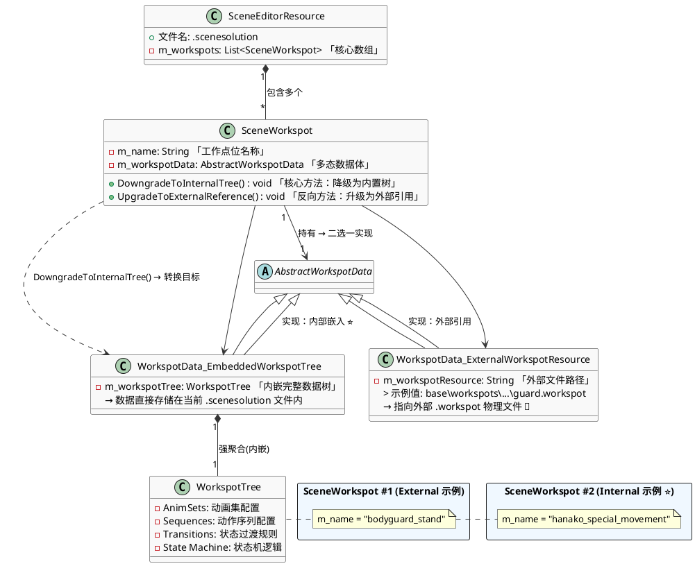

~~~C++
  class AnimGraph : public CResource
  {
      THandle<AnimNode_Root> m_rootNode;              // 根节点
      THandle<AnimVariableContainer> m_variables;     // 动画变量
      red::DynArray<AnimFeatureEntry> m_animFeatures; // 动画特性
  };

~~~
## Workspot Animal Graph Node

  | 节点名称           | 功能描述                                                 |
  |--------------------|----------------------------------------------------------|
  | AnimNode_Root      | 动画图的根节点，所有动画流的最终输出点                   |
  | AnimNode_Base      | 所有动画节点的抽象基类，提供基础的初始化、更新、采样接口 |
  | AnimNode_Container | 容器节点，可包含多个子节点                               |
  | AnimNode_Output    | 输出节点                                                 |

  状态机节点

  | 节点名称              | 功能描述                           |
  |-----------------------|------------------------------------|
  | AnimNode_StateMachine | 动画状态机，管理多个状态和状态转换 |
  | AnimNode_State        | 单个动画状态节点                   |
  | AnimNode_StateFrozen  | 冻结状态节点                       |
  | AnimNode_Stage        | 阶段节点                           |
  | AnimNode_StageEntry   | 阶段入口节点                       |

  动画播放节点

  | 节点名称                             | 功能描述                         |
  |--------------------------------------|----------------------------------|
  | AnimNode_SkAnim                      | 播放骨骼动画的基础节点           |
  | AnimNode_SkAnimSlot                  | 动画槽位，用于运行时动态插入动画 |
  | AnimNode_SkFrameAnim                 | 基于帧的动画播放                 |
  | AnimNode_SkPhaseAnim                 | 基于相位的动画播放               |
  | AnimNode_SkPhaseSlotWithDurationAnim | 带持续时间的相位槽位动画         |
  | AnimNode_SkPhaseWithDurationAnim     | 带持续时间的相位动画             |
  | AnimNode_SkPhaseWithSpeedAnim        | 带速度控制的相位动画             |
  | AnimNode_SkSyncedAnim                | 同步动画播放                     |
  | AnimNode_SkAnimAdjuster              | 动画调整器                       |
  | AnimNode_AnimDatabase                | 动画数据库查询节点               |

  混合节点

  | 节点名称               | 功能描述                             |
  |------------------------|--------------------------------------|
  | AnimNode_Blend2        | 两个动画之间的线性混合               |
  | AnimNode_BlendMultiple | 多个动画的混合                       |
  | AnimNode_BlendAdditive | 叠加混合，在基础动画上叠加额外动画   |
  | AnimNode_BlendOverride | 覆盖混合，用新动画覆盖部分骨骼       |
  | AnimNode_BlendSpace    | 2D混合空间，通过两个参数控制动画混合 |
  | AnimNode_Join          | 连接多个动画输入                     |

  约束节点

  | 节点名称                      | 功能描述                           |
  |-------------------------------|------------------------------------|
  | AnimNode_AimConstraint        | 瞄准约束，使骨骼指向目标           |
  | AnimNode_ParentConstraint     | 父级约束，将骨骼约束到另一个骨骼   |
  | AnimNode_PointConstraint      | 点约束，将骨骼位置约束到目标点     |
  | AnimNode_OrientConstraint     | 方向约束，将骨骼方向约束到目标方向 |
  | AnimNode_DirectConnConstraint | 直接连接约束                       |

  IK（反向运动学）节点

  | 节点名称               | 功能描述                         |
  |------------------------|----------------------------------|
  | AnimNode_Ik2           | 双骨骼 IK 解算器（如手臂、腿部） |
  | AnimNode_Ik2Constraint | IK 约束                          |
  | AnimNode_FloorIk       | 地面 IK，使脚部贴合地面          |
  | AnimNode_AddIKRequest  | 添加 IK 请求                     |
  | AnimNode_ReadIKRequest | 读取 IK 请求                     |

  LookAt（注视）节点

  | 节点名称                                | 功能描述                 |
  |-----------------------------------------|--------------------------|
  | AnimNode_LookAt                         | 视线追踪，使角色看向目标 |
  | AnimNode_LookAtController               | 注视控制器               |
  | AnimNode_LookAtApplyVehicleRestrictions | 应用载具限制的注视       |
  | AnimNode_EyesLookAt                     | 眼睛注视控制             |
  | AnimNode_EyesTracksLookAt               | 眼睛轨迹注视             |

  运动调整节点

  | 节点名称                           | 功能描述                               |
  |------------------------------------|----------------------------------------|
  | AnimNode_LocomotionAdjuster        | 移动动画调整器，匹配动画与实际移动速度 |
  | AnimNode_LocomotionAdjusterOnEvent | 基于事件的移动调整器                   |
  | AnimNode_MotionAdjuster            | 运动调整器                             |
  | AnimNode_FootstepAdjuster          | 脚步调整器，修正脚步位置               |
  | AnimNode_FootstepScaling           | 脚步缩放                               |
  | AnimNode_ExplorationAdjuster       | 探索动画调整器                         |

  骨骼操作节点

  | 节点名称                        | 功能描述                           |
  |---------------------------------|------------------------------------|
  | AnimNode_RotateBone             | 旋转指定骨骼                       |
  | AnimNode_RotateBoneByQuaternion | 用四元数旋转骨骼                   |
  | AnimNode_SetBonePosition        | 设置骨骼位置                       |
  | AnimNode_SetBoneOrientation     | 设置骨骼方向                       |
  | AnimNode_SetBoneTransform       | 设置骨骼完整变换（位置+旋转+缩放） |
  | AnimNode_AdditionalTransform    | 附加变换                           |
  | AnimNode_RotationLimit          | 旋转限制                           |

  轨道与曲线节点

  | 节点名称                                | 功能描述             |
  |-----------------------------------------|----------------------|
  | AnimNode_AdditionalFloatTrack           | 附加浮点数轨道       |
  | AnimNode_FloatTrackModifier             | 浮点轨道修改器       |
  | AnimNode_FloatTrackDirectConnConstraint | 浮点轨道直接连接约束 |
  | AnimNode_CurvePathSlot                  | 曲线路径槽位         |
  | AnimNode_CurveValue                     | 曲线值节点           |
  | AnimNode_SetTrackRange                  | 设置轨道范围         |

  物理模拟节点

  | 节点名称                | 功能描述                       |
  |-------------------------|--------------------------------|
  | AnimNode_Dangle         | 摆动模拟（头发、布料、配饰等） |
  | AnimNode_Drag           | 拖拽效果                       |
  | AnimNode_SimpleBounce   | 简单弹跳模拟                   |
  | AnimNode_SimpleSpline   | 简单样条曲线                   |
  | AnimNode_RagdollControl | 布娃娃物理控制                 |
  | AnimNode_RagdollPose    | 布娃娃姿态                     |

  面部与表情节点

  | 节点名称                 | 功能描述                       |
  |--------------------------|--------------------------------|
  | AnimNode_FacialMixerSlot | 面部动画混合槽位               |
  | AnimNode_Sermo           | 对话系统动画节点，处理口型同步 |

  控制流节点

  | 节点名称                    | 功能描述                     |
  |-----------------------------|------------------------------|
  | AnimNode_Switch             | 开关节点，在多个输入之间切换 |
  | AnimNode_StaticSwitch       | 静态开关（编译时确定）       |
  | AnimNode_ConditionalSegment | 条件分段节点                 |
  | AnimNode_Latch              | 锁存器节点                   |

  槽位与插入节点

  | 节点名称                   | 功能描述                       |
  |----------------------------|--------------------------------|
  | AnimNode_MixerSlot         | 混合槽位，用于分层动画系统     |
  | AnimNode_GraphSlot         | 图表槽位，可插入其他 AnimGraph |
  | AnimNode_ForegroundSegment | 前景分段节点                   |

  数学与工具节点

  | 节点名称                      | 功能描述         |
  |-------------------------------|------------------|
  | AnimNode_FloatMath            | 浮点数学运算     |
  | AnimNode_Numeric              | 数值节点         |
  | AnimNode_CoordinateFromVector | 从向量提取坐标   |
  | AnimNode_Signal               | 信号节点         |
  | AnimNode_AnimSetTagValue      | 设置动画集标签值 |

  空间转换节点

  | 节点名称                 | 功能描述                                   |
  |--------------------------|--------------------------------------------|
  | AnimNode_SpaceConverters | 空间转换（世界空间、本地空间、模型空间等） |

  性能与优化节点

  | 节点名称                             | 功能描述                       |
  |--------------------------------------|--------------------------------|
  | AnimNode_LevelOfDetail               | LOD 节点，根据距离降低动画质量 |
  | AnimNode_PerformanceMode             | 性能模式控制                   |
  | AnimNode_DisableSleepMode            | 禁用休眠模式                   |
  | AnimNode_SetRequiredDistanceCategory | 设置所需距离分类               |

  特殊功能节点

  | 节点名称                    | 功能描述                 |
  |-----------------------------|--------------------------|
  | AnimNode_Interpolation      | 插值节点                 |
  | AnimNode_Inertialization    | 惯性化节点，平滑动画过渡 |
  | AnimNode_FrozenFrame        | 冻结帧                   |
  | AnimNode_FPPCamera          | 第一人称相机动画         |
  | AnimNode_FPPCameraSharedVar | FPP 相机共享变量         |
  | AnimNode_Pose360            | 360度姿态                |
  | AnimNode_PoseCorrection     | 姿态修正                 |
  | AnimNode_PostProcess        | 后处理节点               |
  | AnimNode_SharedMetaPose     | 共享元姿态               |
  | AnimNode_SetDrivenKey       | 设置驱动键               |
  | AnimNode_StackData          | 堆栈数据                 |
## SceneSolution：：Workspot

  | 特性     | External Workspot      | Internal Workspot        |
  |----------|------------------------|--------------------------|
  | 存储位置 | 独立的 .workspot 文件  | 嵌入在 .scenesolution 中 |
  | 引用方式 | 通过资源路径引用       | 直接包含数据             |
  | 复用性   | ✅ 可在多个场景复用    | ❌ 仅限当前场景          |
  | 编辑方式 | 修改 .workspot 文件    | 在场景编辑器中直接编辑   |
  | 版本控制 | 独立文件，便于管理     | 与场景绑定               |
  | 适用场景 | 通用动作（站立、坐下） | 场景特定动作             |
  | 数据来源 | m_modelWorkspot        | m_workspotData           |

