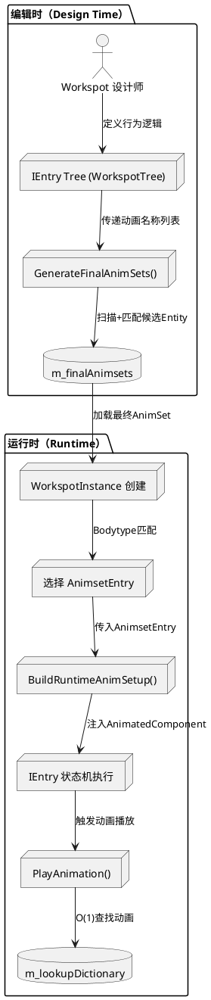

# WorkspotTree 组织结构详解

基于 Cyberpunk 2077 源代码分析

---

## 1. WorkspotTree 的顶层结构

```cpp
class WorkspotTree : public ISerializable
{
    RTTI_DECLARE_TYPE( WorkspotTree );

public:
    // === 核心状态机 ===
    THandle<IEntry> m_rootEntry;  // ← 树的根节点（状态机入口）
    Uint32 m_idCounter;           // IEntry 的 ID 生成器

    // === 动画资源 ===
    red::DynArray<WorkspotAnimsetEntry> m_finalAnimsets;  // 动画集列表
    red::DynArray<TransitionAnim> m_customTransitionAnims;  // 自定义过渡动画

    // === 道具系统 ===
    red::DynArray<WorkspotGlobalProp> m_globalProps;  // 全局道具定义

    // === 骨骼和动画配置 ===
    TResAsyncRef<anim::Rig> m_workspotRig;  // 支持的骨骼（Bodytype）
    CName m_animGraphSlotName;              // AnimGraph 插槽名
    Float m_blendOutTime;                   // 默认混出时间
    Float m_autoTransitionBlendTime;        // 自动过渡混合时间

    // === 行为控制标志 ===
    TagList m_tags;  // Workspot 标签（用于筛选）
    Bool m_dontInjectWorkspotGraph;  // 不注入 workspot 动画图
    Bool m_freezeAtTheLastFrame_UseWithCaution;  // 最后一帧冻结
    Bool m_unmountBodyCarry;
    Bool m_disableAutoTransitionToIdle;

    // === 编辑器数据 ===
#ifdef RED_ENABLE_NON_COOKED_PROPERTIES
    red::DynArray<WorkspotAnimsetEntryUncooked> m_editorAnimsets;
    red::DynArray<WorkspotLegacyDebugData> m_legacyDebugData;
#endif
};
```

**组织原则**：
- **树形结构**：`m_rootEntry` 是状态机的起点，通过 `IEntry` 节点递归构建
- **资源引用**：动画集和过渡动画作为**平铺数据**存储，IEntry 节点通过 **CName** 引用
- **配置分离**：全局配置（骨骼、标签、行为标志）与状态机逻辑分离

---

## 2. IEntry 树的组织方式

### 2.1 节点类型的层次结构

```
IEntry (抽象基类)
├── Leaf Entries (叶子节点 - 执行具体动作)
│   ├── AnimClip           // 基础动画片段
│   ├── MotionAnimClip     // 运动动画片段
│   ├── AnimClipWithItem   // 带道具的动画
│   ├── SyncAnimClip       // 同步动画（多角色）
│   ├── EntryAnim          // 入场动画
│   ├── SyncMasterEntryAnim // 同步入场动画
│   ├── ExitAnim           // 退出动画
│   ├── FastExit           // 快速退出
│   ├── LookAtDrivenTurn   // 视线驱动转身
│   ├── PauseClip          // 暂停节点
│   └── TagNode            // 标签节点（用于事件触发）
│
└── Container Entries (容器节点 - 组织其他节点)
    ├── IContainerEntry (抽象容器基类)
    │   ├── m_idleAnim      // 容器的待机动画
    │   └── m_list          // 子节点列表 (red::DynArray<THandle<IEntry>>)
    │
    ├── Sequence            // 顺序序列
    ├── ReactionSequence    // 反应序列（触发特定反应类型）
    ├── ConditionalSequence // 条件序列（满足条件才执行）
    ├── RandomList          // 随机列表（随机选择子节点）
    └── Selector            // 选择器（权重选择）
```

### 2.2 IEntry 基类的核心成员

```cpp
class IEntry : public ISerializable
{
    work::EntryId m_id;        // 唯一标识符（由 m_idCounter 生成）
    CName m_idleAnim;          // 待机动画名（叶子节点也有）
    Uint32 m_flags;            // 行为标志位（下文详解）
    Float m_blendInTime;       // 混入时间
    Float m_blendOutTime;      // 混出时间

    // 条件系统
    red::DynArray<THandle<work::IWorkspotCondition>> m_loadConditionList;  // 加载条件
    red::DynArray<THandle<work::IWorkspotCondition>> m_animConditionList;  // 动画条件

    // 事件系统
    red::DynArray<THandle<work::IWorkEntryEvent>> m_eventList;  // 事件列表
};
```

**关键成员解析**：

#### m_flags（行为标志位）
```cpp
enum EntryFlags : Uint32
{
    Animation      = RED_FLAG(0),  // 是动画节点
    MotionAnim     = RED_FLAG(1),  // 运动动画（影响Actor位置）
    SlowEnter      = RED_FLAG(2),  // 慢速入场
    SlowExit       = RED_FLAG(3),  // 慢速退出
    FastExit       = RED_FLAG(4),  // 快速退出
    LookAtDrivenTurn = RED_FLAG(5), // 视线驱动转身
    Pause          = RED_FLAG(6),  // 暂停
    TagNode        = RED_FLAG(7),  // 标签节点
    Reaction       = RED_FLAG(8),  // 反应节点
    // ... 更多标志
};
```

**用途**：运行时快速判断节点类型和行为，避免 RTTI 开销。

#### m_idleAnim（待机动画）
- **叶子节点**：动画执行完后的待机姿势
- **容器节点**：子节点执行间隙的过渡动画

---

## 3. 树的构建规则

### 3.1 典型的树结构示例

```
m_rootEntry (Sequence: 餐厅就餐)
│
├─ m_list[0]: EntryAnim (入场)
│   ├─ m_idleAnim: "stand_idle"
│   ├─ m_flags: SlowEnter | MotionAnim
│   └─ 内部关联 TransitionAnim: "walk_to_sit"
│
├─ m_list[1]: Sequence (就餐循环)
│   ├─ m_idleAnim: "sit_idle"
│   ├─ m_loopInfinitely: true
│   └─ m_list:
│       ├─ [0] AnimClip: "sit_eat_fork"
│       ├─ [1] AnimClip: "sit_drink_cup"
│       └─ [2] RandomList (随机动作)
│           ├─ m_weights: [0.5, 0.3, 0.2]
│           └─ m_list:
│               ├─ [0] AnimClip: "sit_look_around"
│               ├─ [1] AnimClip: "sit_check_phone"
│               └─ [2] TagNode: "conversation_trigger"
│
└─ m_list[2]: ExitAnim (退出)
    ├─ m_idleAnim: "stand_idle"
    ├─ m_flags: SlowExit | MotionAnim
    └─ 内部关联 TransitionAnim: "sit_to_stand"
```

### 3.2 构建约束

1. **根节点必须是容器**：`m_rootEntry` 通常是 `Sequence`，组织整个工作流
2. **叶子节点不能有子节点**：`AnimClip`, `EntryAnim` 等不能包含 `m_list`
3. **容器节点必须有 m_list**：即使只有一个子节点，也要放在数组中
4. **IdleAnim 必须存在于 m_finalAnimsets**：否则会触发 `OnAnimationMising` 事件

---

## 4. 动画资源的组织

### 4.1 WorkspotAnimsetEntry 结构

```cpp
struct WorkspotAnimsetEntry
{
    CName m_loadingHandleId;  // Animset 的唯一标识

    struct AnimsetData {
        red::DynArray<work::AnimsetElement> m_cinematics;  // 电影级动画
        red::DynArray<work::AnimsetElement> m_gameplay;    // 游戏玩法动画
    } m_animations;
};

struct AnimsetElement
{
    TResAsyncRef<anim::AnimSet> m_animSet;  // 动画集资源引用
};
```

**组织方式**：
```
m_finalAnimsets
├─ [0] WorkspotAnimsetEntry
│   ├─ m_loadingHandleId: "default"
│   └─ m_animations:
│       ├─ m_cinematics[0].m_animSet: "base\\animations\\npc\\eating.anims"
│       └─ m_gameplay[0].m_animSet: "base\\animations\\npc\\idle.anims"
│
└─ [1] WorkspotAnimsetEntry
    ├─ m_loadingHandleId: "restaurant"
    └─ m_animations:
        └─ m_cinematics[0].m_animSet: "base\\animations\\npc\\restaurant.anims"
```

**动画查找流程**：
1. IEntry 节点指定动画名称（如 `m_animName = "sit_eat_fork"`）
2. 遍历 `m_finalAnimsets` 中的所有 AnimSet
3. 在每个 AnimSet 中查找该动画名称
4. 找到则播放，未找到则触发 `Debugger::OnAnimationMising`

### 4.2 TransitionAnim（过渡动画）

```cpp
struct TransitionAnim
{
    CName m_from;      // 起始动画名
    CName m_to;        // 目标动画名
    CName m_animName;  // 过渡动画名
    Float m_duration;  // 持续时间
};

// 示例
m_customTransitionAnims
├─ [0] { from: "stand_idle", to: "sit_idle", animName: "stand_to_sit", duration: 1.2s }
├─ [1] { from: "sit_idle", to: "stand_idle", animName: "sit_to_stand", duration: 0.8s }
└─ [2] { from: "walk", to: "sit_idle", animName: "walk_to_sit", duration: 1.5s }
```

**使用时机**：
- `EntryAnim` 节点执行时查找匹配的过渡动画
- `ExitAnim` 节点同样查找对应的退出过渡
- 如果没有自定义过渡动画，使用默认混合（`m_autoTransitionBlendTime`）

---

## 5. 树的遍历和执行逻辑

### 5.1 执行流程（伪代码）

```cpp
void ExecuteWorkspotTree(IEntry* currentNode)
{
    // 1. 检查加载条件
    if (!EvaluateConditions(currentNode->m_loadConditionList))
        return;

    // 2. 检查动画条件
    if (!EvaluateConditions(currentNode->m_animConditionList))
        SkipToNextNode();

    // 3. 触发进入事件
    for (auto& event : currentNode->m_eventList)
        event->OnEntry();

    // 4. 根据节点类型执行
    if (currentNode->IsA<AnimClip>())
    {
        AnimClip* clip = Cast<AnimClip>(currentNode);
        PlayAnimation(clip->m_animName);

        // 动画播放完成后
        PlayIdleAnimation(clip->m_idleAnim);
    }
    else if (currentNode->IsA<Sequence>())
    {
        Sequence* seq = Cast<Sequence>(currentNode);

        for (auto& child : seq->m_list)
        {
            ExecuteWorkspotTree(child);  // 递归执行子节点
        }

        if (seq->m_loopInfinitely)
        {
            while (true)
                ExecuteChildren(seq->m_list);
        }
    }
    else if (currentNode->IsA<RandomList>())
    {
        RandomList* random = Cast<RandomList>(currentNode);

        // 根据权重随机选择
        Int32 selectedIndex = WeightedRandom(random->m_weights);
        Int32 count = RandomRange(random->m_minClips, random->m_maxClips);

        for (Int32 i = 0; i < count; ++i)
        {
            ExecuteWorkspotTree(random->m_list[selectedIndex]);
        }
    }

    // 5. 触发退出事件
    for (auto& event : currentNode->m_eventList)
        event->OnExit();
}
```

### 5.2 条件系统的作用

```cpp
class IWorkspotCondition : public ISerializable
{
    virtual Bool Evaluate(WorkspotInstance* instance) = 0;
};

// 具体条件类型示例
class TimeOfDayCondition : public IWorkspotCondition
{
    Float m_startHour;  // 6.0 (早上6点)
    Float m_endHour;    // 22.0 (晚上10点)

    Bool Evaluate(WorkspotInstance* instance) override
    {
        Float currentTime = GetGameTime();
        return currentTime >= m_startHour && currentTime <= m_endHour;
    }
};

class WeatherCondition : public IWorkspotCondition
{
    CName m_requiredWeather;  // "rain"

    Bool Evaluate(WorkspotInstance* instance) override
    {
        return GetCurrentWeather() == m_requiredWeather;
    }
};
```

**应用示例**：
```
AnimClip: "sit_drink_coffee"
├─ m_loadConditionList:
│   └─ [0] TimeOfDayCondition: { startHour: 6.0, endHour: 12.0 }  // 只在早上6-12点加载
│
└─ m_animConditionList:
    └─ [0] WeatherCondition: { weather: "sunny" }  // 只在晴天播放
```

**效果**：
- 如果不满足 `m_loadConditionList`，该节点不会被加载到内存
- 如果不满足 `m_animConditionList`，跳过该节点（触发 `OnAnimationSkipped` 事件）

---

## 6. 特殊节点的组织规则

### 6.1 ReactionSequence（反应序列）

```cpp
class ReactionSequence : public Sequence
{
    red::DynArray<game::data::RecordID> m_reactionTypes;  // 反应类型列表
};

// 示例：NPC 被攻击后的反应
ReactionSequence: "combat_reactions"
├─ m_reactionTypes: ["aggro", "fear", "flee"]
├─ m_list:
│   ├─ [0] AnimClip: "react_hit_front"
│   ├─ [1] ConditionalSequence:
│   │   ├─ m_conditionList: [HealthBelowThreshold(50%)]
│   │   └─ m_list:
│   │       └─ [0] AnimClip: "react_panic"
│   └─ [2] ExitAnim: "combat_ready"
```

**触发机制**：
```cpp
// 游戏逻辑代码
void OnNPCHit(NPC* npc, DamageInfo& damage)
{
    if (npc->HasActiveWorkspot())
    {
        WorkspotTree* tree = npc->GetCurrentWorkspotTree();
        IEntry* reaction = tree->FindReactionSequence("aggro");

        if (reaction)
            npc->InterruptAndPlay(reaction);  // 中断当前动作，播放反应
    }
}
```

### 6.2 SyncAnimClip（同步动画）

```cpp
class SyncAnimClip : public AnimClip
{
    CName m_slotName;       // 同步插槽名（如 "partner"）
    Transform m_syncOffset; // 相对于主角色的偏移
};

// 示例：两人握手
Sequence: "handshake"
├─ m_list:
│   ├─ [0] SyncMasterEntryAnim:  // 主角色
│   │   ├─ m_animName: "handshake_master_enter"
│   │   ├─ m_slotName: "partner"
│   │   └─ 等待从角色准备就绪
│   │
│   ├─ [1] SyncAnimClip:  // 主角色握手动画
│   │   ├─ m_animName: "handshake_master_loop"
│   │   └─ m_slotName: "partner"
│   │
│   └─ [2] ExitAnim:
│       └─ m_animName: "handshake_master_exit"
│
└─ 从角色的 WorkspotTree 会包含对应的 "handshake_slave_*" 动画
```

**同步机制**：
- 主角色等待从角色到达 `m_syncOffset` 位置
- 同步播放动画，确保帧同步
- 任一角色中断，另一角色执行 FastExit

---

## 7. 树的内存组织优化

### 7.1 ID 引用 vs 指针引用

```cpp
// ❌ 不使用直接指针（会导致序列化问题）
THandle<IEntry> m_currentNode;

// ✅ 使用 ID 引用
work::EntryId m_currentNodeId;  // Uint32

// 运行时查找
IEntry* FindEntryById(EntryId id)
{
    return IterateTreeAndFind(m_rootEntry, id);
}
```

**原因**：
- WorkspotTree 需要序列化到 `.workspot` 文件
- 指针在不同进程中无效，ID 则是稳定的标识符

### 7.2 平铺式存储 vs 树形存储

```cpp
// 动画集采用平铺存储
red::DynArray<WorkspotAnimsetEntry> m_finalAnimsets;  // 所有动画集在一个数组中

// IEntry 采用树形存储
THandle<IEntry> m_rootEntry;  // 通过 m_list 递归构建树
```

**优势**：
- **动画查找**：线性遍历 `m_finalAnimsets`，缓存友好
- **状态机逻辑**：树形结构便于递归执行和条件判断

---

## 8. 总结：WorkspotTree 的组织哲学

| 组件 | 组织方式 | 访问方式 | 用途 |
|------|---------|---------|------|
| `m_rootEntry` | 树形递归 | 深度优先遍历 | 状态机逻辑 |
| `m_finalAnimsets` | 平铺数组 | 线性查找 | 动画资源池 |
| `m_customTransitionAnims` | 平铺数组 | 哈希查找（from+to） | 过渡动画 |
| `m_globalProps` | 平铺数组 | ID 查找 | 道具管理 |
| `m_workspotRig` | 单一引用 | 直接访问 | 骨骼约束 |

**核心设计原则**：
1. **逻辑与资源分离**：状态机（IEntry树）与资源（Animsets）解耦
2. **条件驱动**：通过 `IWorkspotCondition` 实现动态行为
3. **事件驱动**：通过 `IWorkEntryEvent` 支持扩展
4. **ID 稳定性**：使用 EntryId 而非指针，确保序列化安全
5. **递归执行**：容器节点递归调用子节点，支持无限嵌套

这种组织方式使得 WorkspotTree 可以描述从简单的"坐下-等待-站起"到复杂的"多人同步互动+条件分支+循环"等各种工作流。

---

## 附录：源代码文件位置

- **WorkspotTree 定义**：`dev/src/common/gameWorkspots/include/workspotResource.h`
- **IEntry 层次结构**：`dev/src/common/gameWorkspots/include/workspotTreeItems.h`
- **SceneWorkspot 定义**：`dev/src/backend/backendScenes/src/scnbWorkspot.h`
- **ChangeWorkEvent**：`dev/src/backend/backendScenes/src/scnbEventsChangeWork.h`
- **Debugger 系统**：`dev/src/common/gameWorkspots/include/workspotDebugger.h`

---

*文档生成时间：2026-01-14*
*基于 Cyberpunk 2077 开发版本源代码分析*
# 为什么WordspotAsset会引用多个.anims

