# 编辑Scene过程中的发现

## Mark WorkSpot点位选择

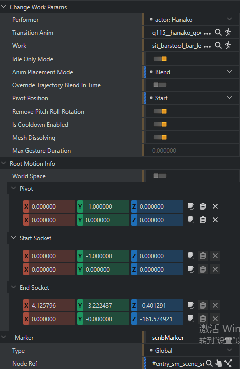
Animation Workspot Marker 标价动画运行点位
放视频Mark

## Section打断和取消目的
Section进行中有相应的支线或者相对不重要的剧情，有些编辑过程需要手动打断，可能出现维护复杂
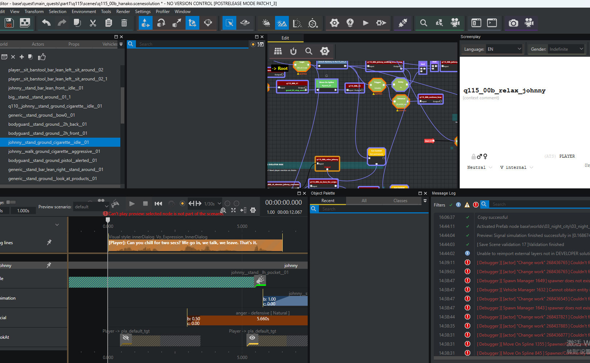

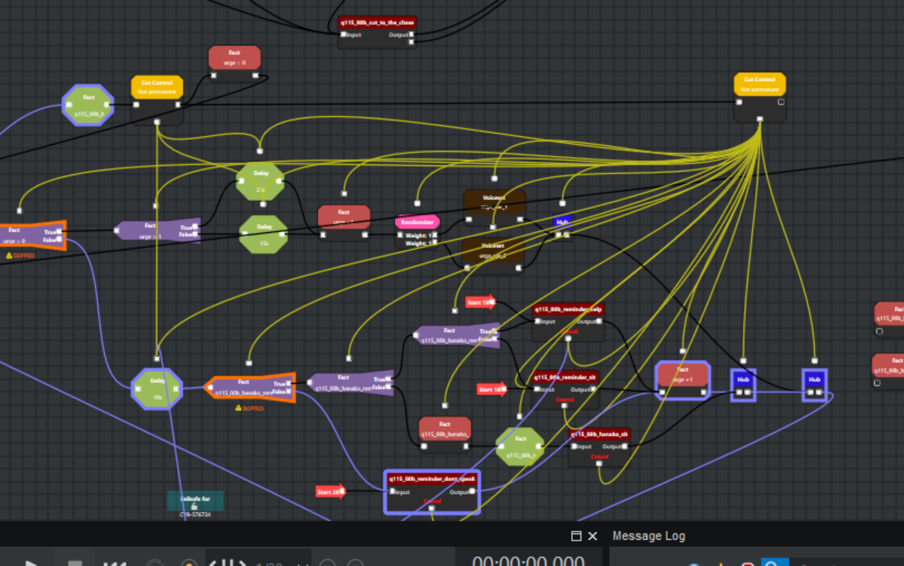
## 有些操作似乎会造成加载间隙存在潜在规则防卡顿
要保障Section和对话直接不出现时间间隙
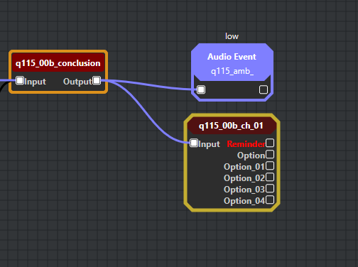
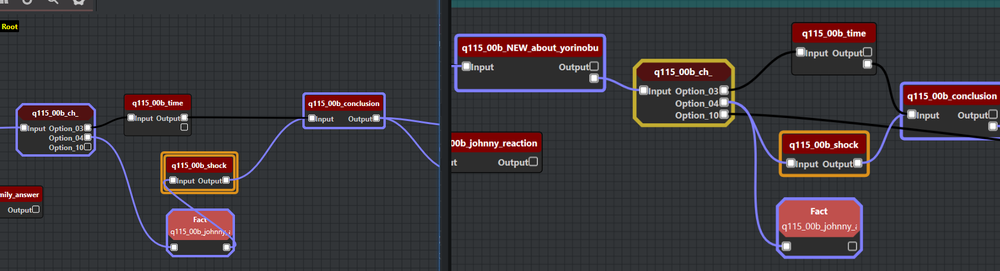
## 同一时间多个Section控制一个角色时候如何实现调度机制的
存在Section竞合情况吗

## Track可能只是一个优先级概念
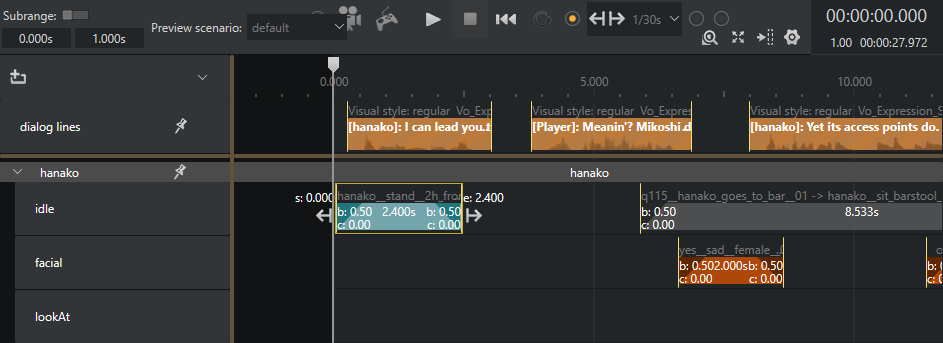

## 动画库组织框架

## Validate 验证工具
验证 SubSection超出TrackTimeline限制
验证 节点引用关系是否正确
验证 Actor和Props是否正确
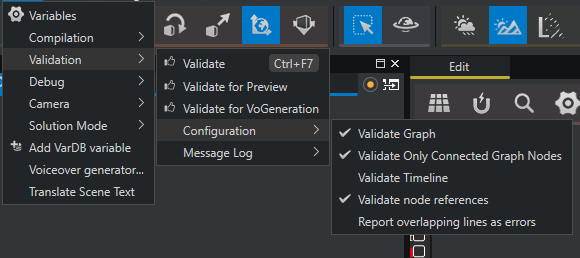

## CoodTime机制
打的循坏Idle需要一个最后保证Idle结束的时间
  Cooldown（冷却时间） 是 Workspot Gesture（工作位手势） 可能播放的最长动画时长。它用于确保 Change Work 或 Stop Work 事件有足够的时间让正在播放的手势动画完成。
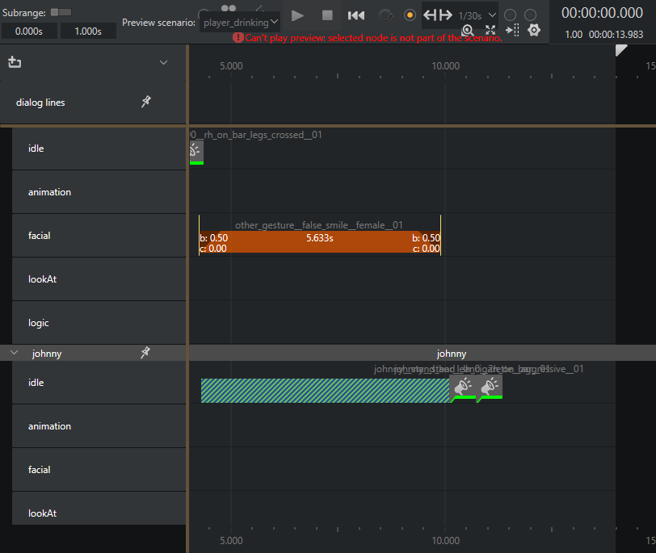
### 机制说明

在前一个 Change Work 事件中：
- 找到 Max Anim Time Limit 属性
- 设置一个较小的值（例如 2秒）
- Cooldown 会使用这个限制

在前一个 Change Work 事件中：
  - 找到 Max Anim Time Limit 属性
  - 设置一个较小的值（例如 2秒）
  - Cooldown 会使用这个限制

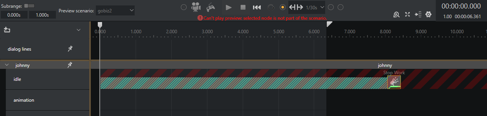
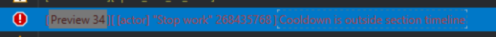
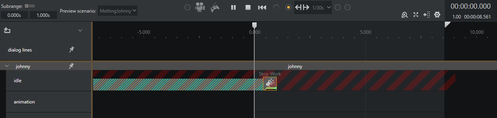

##  FPPAnimaltiopn
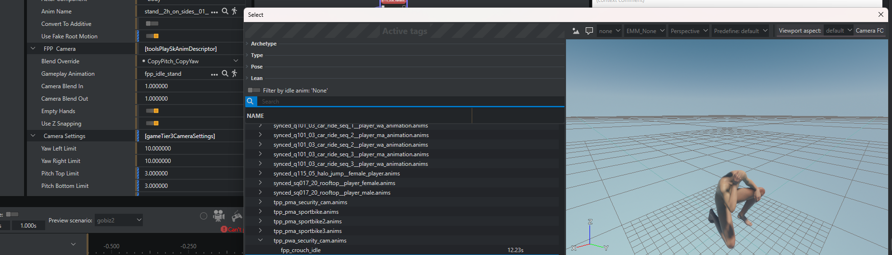
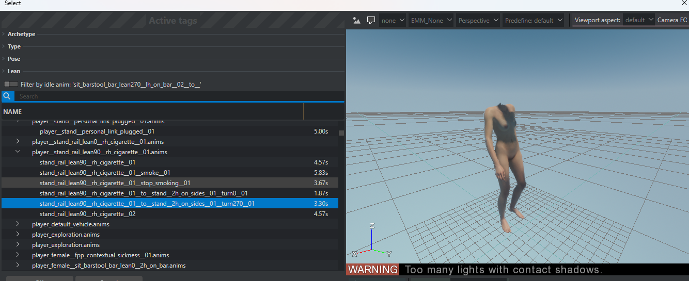

## 
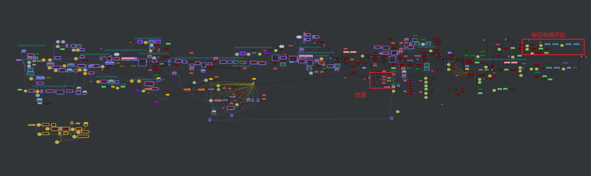
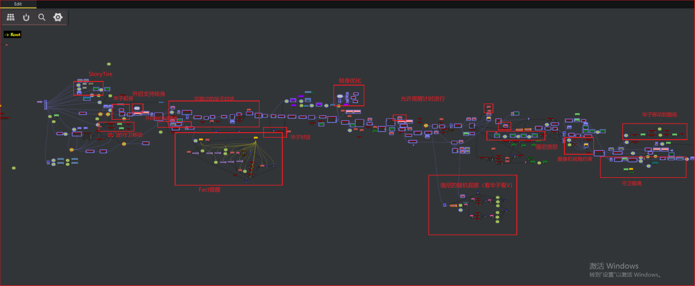

