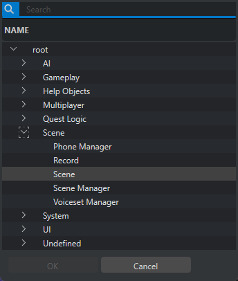
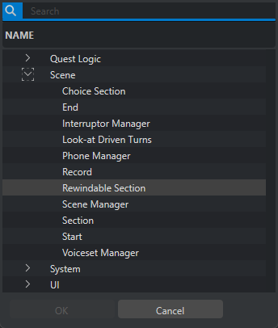

# ScneeNode节点

## Scene在Phase和在Scene的节点存在差异

Phase层级

Scene层级

## Phase SceneNode

## Scene SceneNode

## ScneneNode总览

  Scene System (gameSceneSystem) 中的节点分类

  1. 核心场景节点 (Core Scene Nodes)

  场景图节点:
  - scnSceneGraphNodes - 场景图节点基类
  - scnSceneNodeDefinition - 场景节点定义

  场景实例节点:
  - scnSceneInstance - 场景实例
  - scnSceneManager - 场景管理器

  2. 逻辑控制节点 (Logic Control Nodes)

  逻辑运算节点:
  - scnsAndNode - AND逻辑节点
  - scnsXorNode - XOR逻辑节点
  - scnsHubNode - Hub节点 (类似多路选择)

  流程控制节点:
  - scnsCutControlNode - 剪辑控制节点
  - scnsSectionNode - 章节/段落节点
  - scnsRewindableSectionNode - 可回退段落节点
  - scnsRandomizerNode - 随机节点
  - scnsDeletionMarkerNode - 删除标记节点

  3. 选择和对话节点 (Choice & Dialog Nodes)

  选择节点:
  - scnChoiceNode - 选择节点 (对话选项)
  - scnsCommandChoiceNode - 命令选择节点

  对话相关:
  - scnsDialoglineController - 对话行控制器
  - scnsMultiSpeakerDialoglineExecutionManager - 多人对话执行管理器

  4. 任务集成节点 (Quest Integration Nodes)

  任务节点:
  - scnsQuestNode - 任务节点
  - scnsCommandExecuteQuestNode - 执行任务节点命令
  - scnsElwSceneListener - 场景监听器 (用于任务)

  其他任务相关:
  - scnsRadioAnnouncementNode - 电台公告节点

  5. 世界节点 (World Nodes)

  区域节点:
  - scnAudioAttractTriggerAreaNode - 音频吸引触发区域节点
  - scnInterestingConversationsAreaNode - 有趣对话区域节点
  - scnConversationEventReceiver - 对话事件接收器

  6. 中断和条件节点 (Interrupt & Condition Nodes)

  中断管理:
  - scnsInterruptManagerNode - 中断管理节点
  - scnsInterruptor - 中断器

  中断条件:
  - scnsInterruptConditionDistancePlayerNode - 玩家距离中断条件
  - scnsInterruptConditionDistancePlayerEntity - 玩家实体距离中断
  - scnsInterruptConditionAnyoneDistracted - 任何人分心中断
  - scnsInterruptConditionSpeakerDistracted - 说话者分心中断
  - scnsInterruptConditionPlayerCombat - 玩家战斗中断
  - scnsInterruptConditionFact - 事实条件中断
  - scnsInterruptConditionTrigger - 触发器中断

  返回条件:
  - scnsReturnConditionDistancePlayerNode - 玩家距离返回条件
  - scnsReturnConditionDistancePlayerEntity - 玩家实体距离返回
  - scnsReturnConditionDistracted - 分心返回条件
  - scnsReturnConditionPlayerCombat - 玩家战斗返回
  - scnsReturnConditionFact - 事实返回条件
  - scnsReturnConditionTrigger - 触发器返回

  7. 可执行项节点 (Executable Item Nodes)

  世界对象:
  - scnsExecutableItemWorldNode - 可执行世界项节点
  - scnsExecutableItemEntity - 可执行实体项

  场景特定执行项:
  - scnsExecutableItem_AnimationMotion - 动画运动
  - scnsExecutableItem_ChangeFacialIdle - 改变面部待机
  - scnsExecutableItem_ChangeIdle - 改变待机
  - scnsExecutableItem_IK - IK (反向运动学)
  - scnsExecutableItem_LookAt - 看向
  - scnsExecutableItem_PlayerLookAt - 玩家看向
  - scnsExecutableItem_PoseCorrection - 姿态修正
  - scnsExecutableItem_Rid - RID动画
  - scnsExecutableItem_ToggleMirrorsArea - 切换镜子区域

