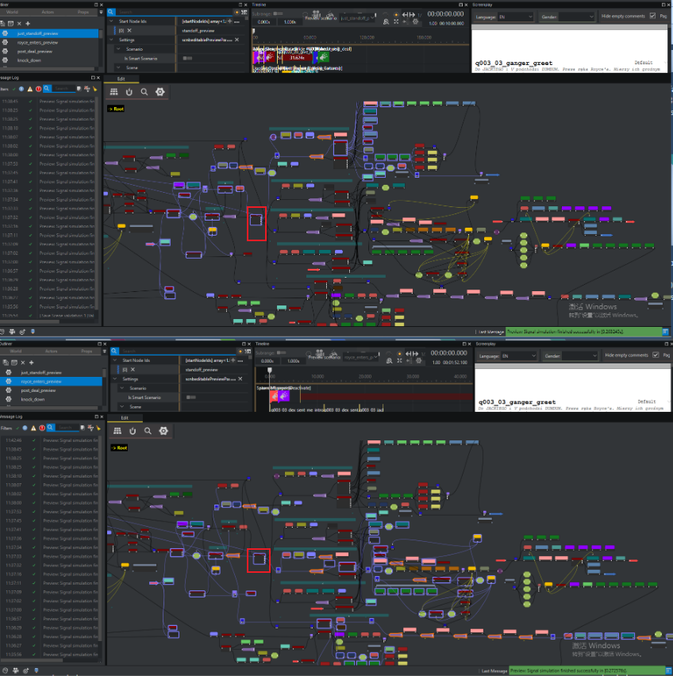
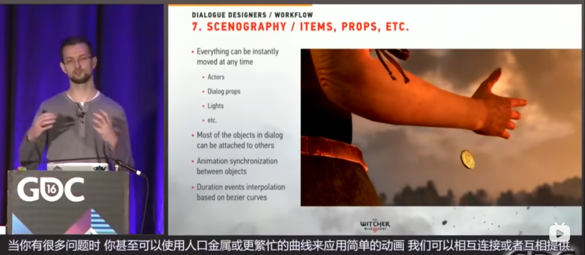
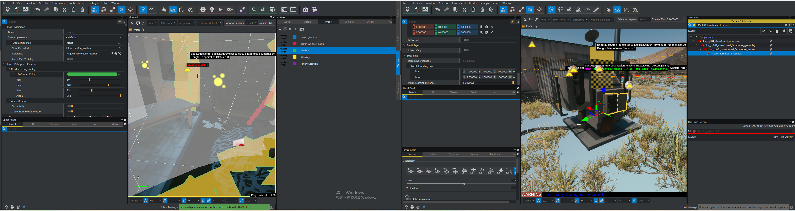

# 2077对话编辑器工具

## 目录
1. [Timeline](#timeline)
2. [SceneNodePreview 场景方案预览功能](#scenenodepreview-场景方案预览功能)
   - [Preview Scenario](#preview-scenario)
3. [快速增长的数据库进行状态的控制](#快速增长的数据库进行状态的控制)
4. [Animation Tree Structure](#animation-tree-structure)
5. [多标签数据匹配](#多标签数据匹配)
   - [骨骼动画数据库](#骨骼动画数据库)
6. [Props|Actor|Vehicle](#Props|Actor|Vehicle工具)
   - [Props](#骨骼动画数据库)
7. [Animal 的加权裁剪混合](#animal-的加权裁剪混合)
8. [所有可添加的AnimationTrack](#所有可添加的animationtrack)
     - [AnimationTrack](#animationtrack)
9. [对话设计师需要可以简单的操控场景的所有物体](#对话设计师需要可以简单的操控场景的所有物体)
10. [本地化语言膨胀时间线](#本地化语言膨胀时间线)
     - [按比例膨胀时间](#按比例膨胀时间)
11. [灯光根据场景基本配置调节](#灯光根据场景基本配置调节)
12. [Light Const Value](#light-const-value)

## Timeline

## SceneNodePreview 场景方案预览功能

  PreviewScenario（预览场景） 是一个用于场景预览和测试的配置系统，允许开发者：

  1. 快速测试场景流程
    - 定义场景的起始节点（Start Nodes）
    - 配置场景图节点（Graph Nodes）的执行路径
    - 模拟场景执行流程，无需启动完整游戏
  2. 管理场景配置（从 scnbEditablePreviewScenario.h:57）
    - 保存多个预览场景配置（可以创建、复制、删除）
    - 每个配置有独立的显示名称（Display Name）
    - 支持快速切换不同的测试场景
  3. 配置场景环境（从 scnbEditablePreviewScenarioSettings.h:22）
    - 场景起始位置（Scene Origin Marker）
    - 初始时间（Initial Time of Day）
    - 初始相机位置和角度
    - 流送距离（Streaming Distance）
    - 上帝模式设置
    - 对话选项显示设置
  4. 实体管理
    - 管理场景中的演员（Actors）
    - 管理道具（Props）
    - 管理载具（Vehicles）
    - 通过 RUID 追踪和配置实体
  5. 场景模拟（从 scnbPreviewScenarioSimulator.h:26）
    - 执行场景模拟，生成执行流（Execution Stream）
    - 验证场景配置的有效性
    - 提供执行反馈（Execution Feedback）
  6. 智能场景功能
    - 支持"Smart Scenario"模式
    - 可以根据场景图的变化自动更新预览配置

### Preview Scenario
1. SceneNodePreview

2. 切换使用节点路径

3. Pause 节点的跳过

4. 更长更多信息的Timeline

5. 播放创建Preview Scenario 过程
6. 分析
 Preview Scenario TimeLine 是根据节点的选择动态创建，根据设计师的随时修正生成整条Timeline结果，Preview Scenario TimeLine 是Scene编辑器的分阶段分支线的直观展示
 目的在于帮助设计师在编辑时，快速了解当前场景的动画结构、事件阶段、动画时间轴、玩家选择产生的结果，对于多支线非线性叙述中具有非常直观的帮助。
7. 创建了可按步骤预览的Timeline直观给设计师观察目前的剧情状态提供清晰的事件脉络

## 快速增长的数据库进行状态的控制

## Animation Tree Structure

## 多标签数据匹配

### 骨骼动画数据库
1. 命名和标签规则:

Generic_Arverage_Female_sit_Chair(bar)
stand__lh_tablet__01__slow_hours__01
dirt__kneel__2h_elbow_on_knees__01__look_right__01 Dirt(帮派|NPC种类)_(姿态)_(姿态)_(姿态)_(姿态)_(姿态)
lie_ground_0__2h_on_head__01__shuffle__04......
2. 设计师使用时的查找规则

## Props|Actor|Vehicle工具

1. 

### Animal 的加权裁剪混合

描述： 设计师可以自定义地修正调整在Timeline中的人物动画，将预制的动画进行微调，适配当前场景的剧情内容。

1. 精准优化角色动作表现，强化对话沉浸
- 修正动作适配场景与交互：对话中角色位置可能因剧情或场景调整，原本预制的动画动作会出现朝向偏差等问题。通过 Timeline 编辑骨骼姿态，能在指定帧调整骨骼角度，比如修改手腕朝向、头部转动角度等，让角色动作精准匹配互动对象位置。像角色原本指向正前方，若对话对象在侧方，调整手臂骨骼就能让指向动作合理，契合对话场景。
- 细化姿态与情绪传递：该功能支持定制特定帧的骨骼姿态并与原有动画融合。比如对话中角色表达愤怒时，可通过调整躯干骨骼紧绷度、手臂骨骼发力姿态，搭配面部骨骼调整的表情，让情绪不只是靠台词传递，还能通过肢体语言具象化；同时也能精准做出坐姿、单膝跪地等特殊姿态，适配不同对话场景设定。

2. 解决动画制作隐患，保障视觉效果
- 游戏中角色服装、道具与身体动作适配容易出现穿模问题。一套动作在复杂情境下期待复用性：在 Timeline 中编辑骨骼姿态可针对性调整。例如角色接取NPC的道具时不同NPC道具应该有不同持握方向和特殊姿态，但是没有必要为了每个接取动画开发一套新的动作资产，这时选择了在Timeline上对骨骼进行微调编辑。
3. 降低制作成本，提升开发迭代效率
- 减少重复制作工作量：该功能支持复用基础动画，通过骨骼姿态编辑做二次调整，无需为每个细微场景单独制作全新动画。比如不同对话场景中角色的基础站姿动画，可通过修改骨骼调整为略带侧身倾听、双手交叉等不同姿态，适配多样对话情境，大幅减少动画资源的制作量。
- 简化调整流程：编辑器支持以叠加、覆盖等多种方式播放动画，搭配骨骼权重调整功能。当编辑后的骨骼姿态出现动作不协调，如肢体轻微扭动异常时，只需微调对应骨骼的权重参数就能修正，无需推翻原有动画重新制作。这种微调方式让开发团队在迭代对话内容时，能快速适配修改需求，缩短制作周期。

### 所有可添加的AnimationTrack
- 在动画中控制骨骼给设计师带来极大的自由度

#### AnimationTrack

| AnimationTrack                                                           | 描述                             |
| :----------------------------------------------------------------------- | :------------------------------- |
| “播放动画”   Create [actor]  "Play Animation"                            | 普通动画轨道                     |
| “播放消除动画”  Create [actor] "Play Rid Animation"                      |                                  |
| “切换Idle” Create [actor] "Change Idle"                                  | 切换Idle状态                     |
| “添加待机”  Create [actor] "Add Idle"                                    | 添加Idle                         |
| “带混合添加待机”  Create [actor] "Add Idle With Blend"                   | 添加Idle的混合动画               |
| “看向”   Create [actor] "Look At"                                        | 看向姿态                         |
| “额外看向”     Create [actor] "Additional Look At'                       |                                  |
| “姿态修正”  Create [actor] "Pose Correction"                             | 姿态修正手势修正                 |
| “（IK）”  Create [actor] "IK"                                            | 骨骼IK混合                       |
| “更改位置”  Create [actor] "Change Placement"                            | 更改实体位置                     |
| “设置动画特征”  Create [actor] "Set Anim Feature"                        |                                  |
| “更改工作” Create [actor] "Change work"                                  | 更改工作点内容                   |
| “停止工作”   Create [actor] "Stop work"                                  | 停止工作点                       |
| “附加道具”   Create [prop] "Attach Prop"                                 | 附加道具                         |
| “镜头片段”     Create [camera] "Clip"                                    |                                  |
| “播放骑乘动画”    Create [camera] "Play Rid Animation"                   |                                  |
| “播放音频”        Create [other] "Play Audio"                            | 声音轨道                         |
| “播放音频（带时长）” Create [other] "Play AudioDuration"                 | 声音可变Section                  |
| “播放视觉特效（VFX）”  Create [other] "Play VFX"                         | 特效                             |
| “播放视觉特效（带时长）” Create [other] "Play VFX Duration"              | Section特效                      |
| “播放视觉特效（超梦同步）”  Create [other] "Play VFX Braindance"         | 超梦特效                         |
| “提示”     Create [other] "Clue"                                         |                                  |
| “播放视频”    Create [other] "Play Video"                                | VideoTrack                       |
| “插槽事件”      Create [other] "Socket Event"                            | 添添加eventTrack（中途触发事件） |
| “玩家游戏内看向”   Create [other] "Player Gameplay LookAt"               |                                  |
| “脑波可见性”      Create [other] "Braindance Visibility"                 |                                  |
| “播放 UI 动画”      Create [other] "Play UI Animation"                   |                                  |
| “播放 UI 动画（脑波同步）” Create [other] "Play UI Animation Braindance" |                                  |

## 对话设计师需要可以简单的操控场景的所有物体

给对话设计师最大的权限

## 本地化语言膨胀时间线

### 按比例膨胀时间

## 灯光根据场景基本配置调节

## Light Const Value