#  2077对话编辑器工具 

## 目录
1. [Timeline](#timeline)
2. [SceneNodePreview 场景方案预览功能](#scenenodepreview-场景方案预览功能)
   - [Preview Scenario](#preview-scenario)
3. [快速增长的数据库进行状态的控制](#快速增长的数据库进行状态的控制)
4. [Animation Tree Structure](#animation-tree-structure)
5. [多标签数据匹配](#多标签数据匹配)
   - [骨骼动画数据库](#骨骼动画数据库)
6. [Props|Actor|Vehicle](#Props|Actor|Vehicle工具)
   - [Props](#骨骼动画数据库)
7. [Animal 的加权裁剪混合](#animal-的加权裁剪混合)
8. [所有可添加的AnimationTrack](#所有可添加的animationtrack)
     - [AnimationTrack](#animationtrack)
9. [对话设计师需要可以简单的操控场景的所有物体](#对话设计师需要可以简单的操控场景的所有物体)
10. [本地化语言膨胀时间线](#本地化语言膨胀时间线)
     - [按比例膨胀时间](#按比例膨胀时间)
11. [灯光根据场景基本配置调节](#灯光根据场景基本配置调节)
12. [Light Const Value](#light-const-value)

## Timeline

## SceneNodePreview 场景方案预览功能
 
### Preview Scenario
1. SceneNodePreview
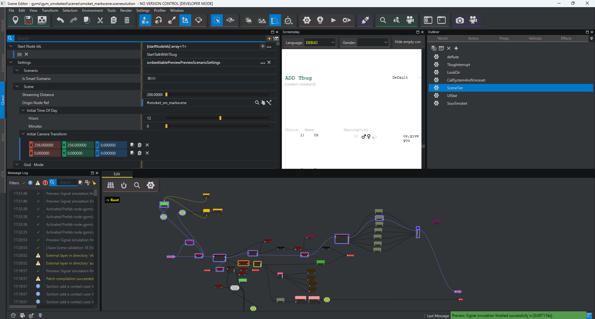
2. 切换使用节点路径
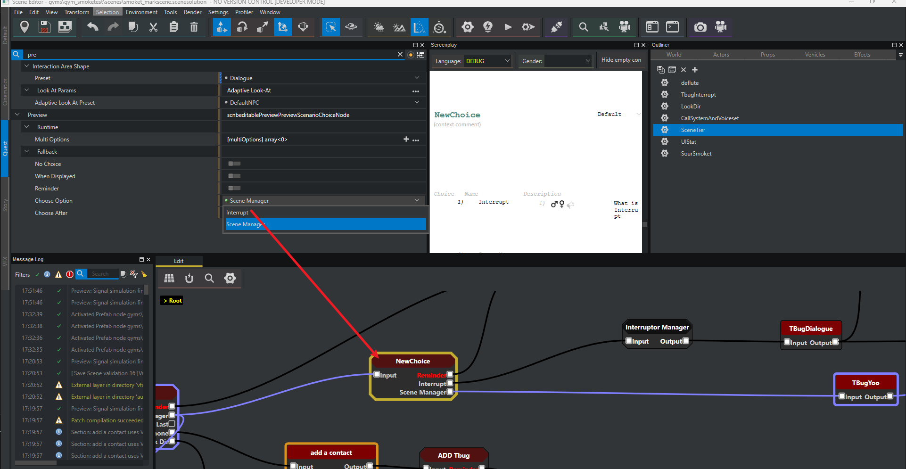
3. Pause 节点的跳过
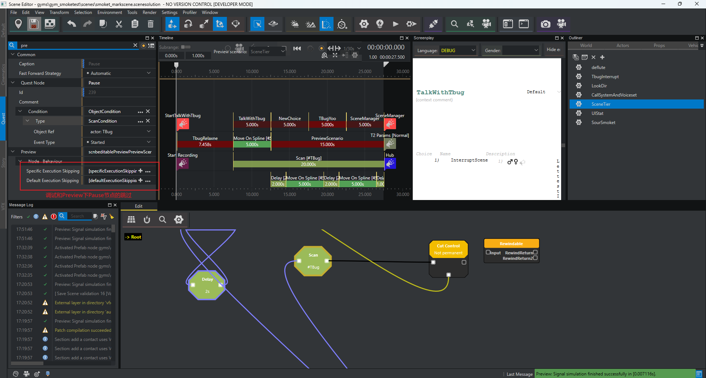
4. 更长更多信息的Timeline
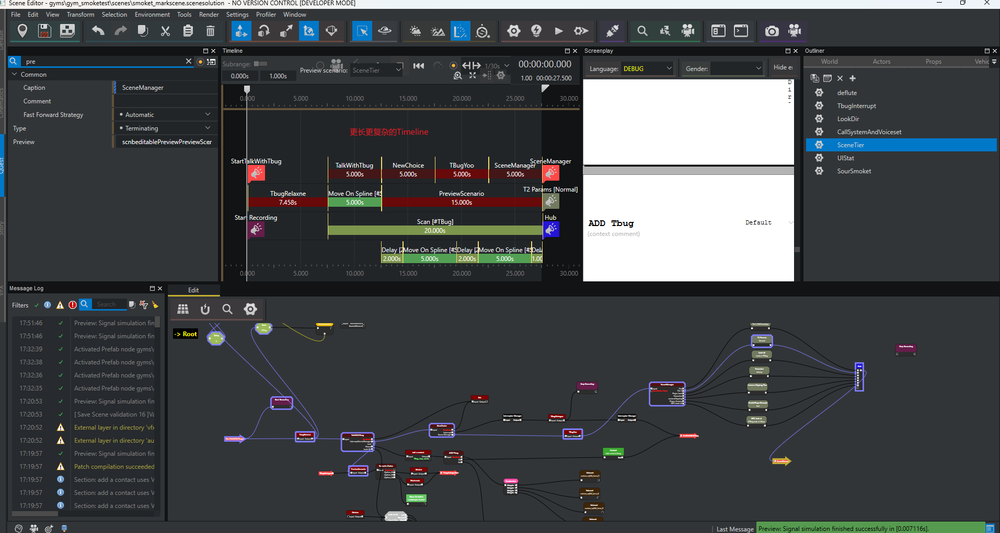
5. 播放创建Preview Scenario 过程
5. 分析
 Preview Scenario TimeLine 是根据节点的选择动态创建，根据设计师的随时修正生成整条Timeline结果，Preview Scenario TimeLine 是Scene编辑器的分阶段分支线的直观展示
 目的在于帮助设计师在编辑时，快速了解当前场景的动画结构、事件阶段、动画时间轴、玩家选择产生的结果，对于多支线非线性叙述中具有非常直观的帮助。
6. 创建了可按步骤预览的Timeline直观给设计师观察目前的剧情状态提供清晰的事件脉络

## 快速增长的数据库进行状态的控制
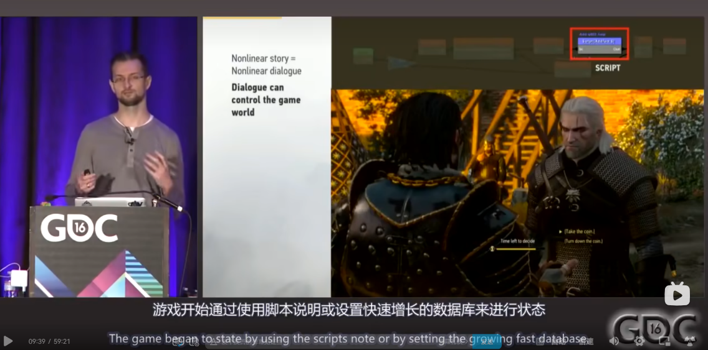
**Fact数据库**

## Animation Tree Structure
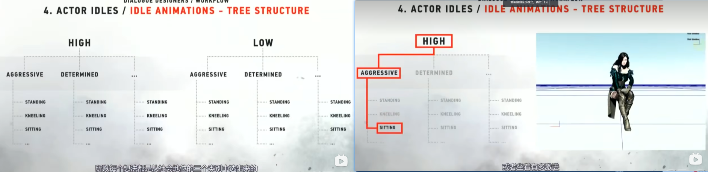
多标签数据匹配
骨骼动画数据匹配库
1. 命名和标签规则:
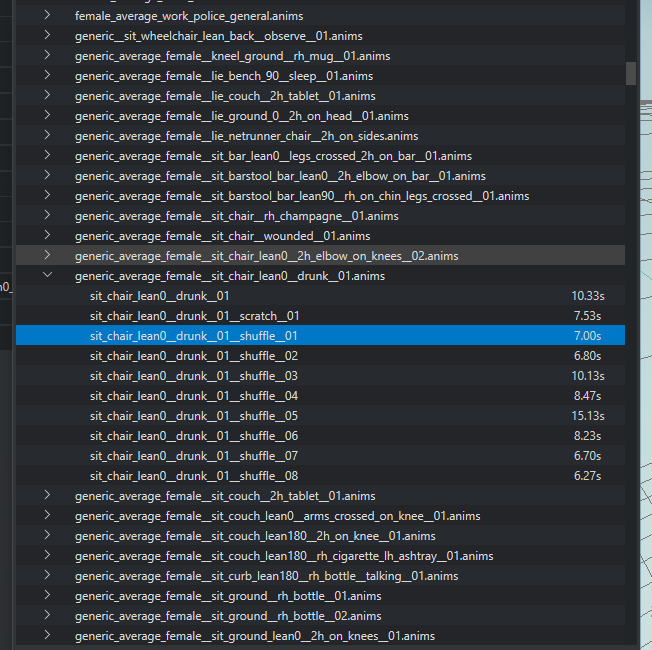
Generic_Arverage_Female_sit_Chair(bar)
stand__lh_tablet__01__slow_hours__01
dirt__kneel__2h_elbow_on_knees__01__look_right__01 Dirt(帮派|NPC种类)_(姿态)_(姿态)_(姿态)_(姿态)_(姿态)
lie_ground_0__2h_on_head__01__shuffle__04......
2. 设计师使用时的查找规则
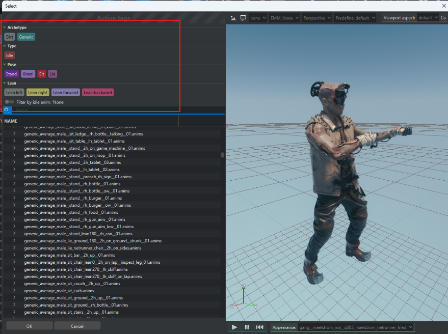

### Animal 的加权裁剪混合
**Timeline上的动画微调工具**
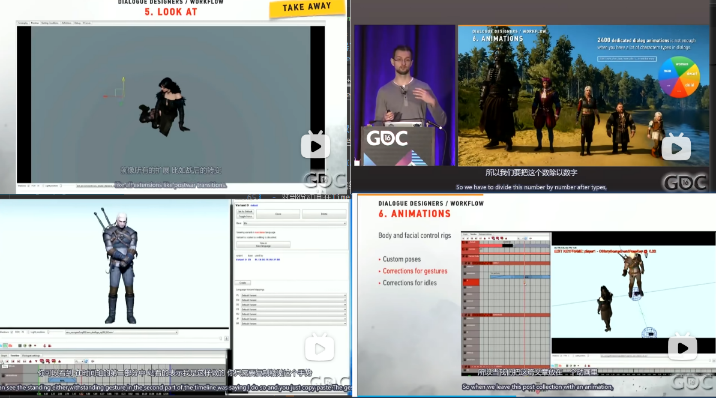

***所有可添加的AnimationTrack***
**动画微调工具**
- 在动画中控制骨骼给设计师带来极大的自由度
- 对部份动画在Timeline上的胃痛工具可以使得动画资产不必每个都做定制化开发

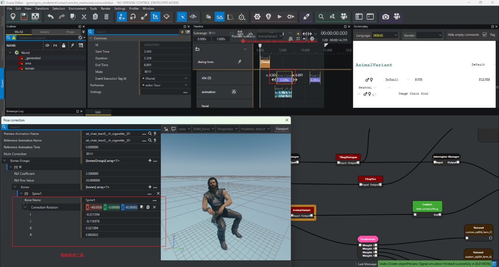

**AnimationTrack**

| AnimationTrack                                                           | 描述                             |
| :----------------------------------------------------------------------- | :------------------------------- |
| “播放动画”   Create [actor]  "Play Animation"                            | 普通动画轨道                     |
| “播放消除动画”  Create [actor] "Play Rid Animation"                      |                                  |
| “切换Idle” Create [actor] "Change Idle"                                  | 切换Idle状态                     |
| “添加待机”  Create [actor] "Add Idle"                                    | 添加Idle                         |
| “带混合添加待机”  Create [actor] "Add Idle With Blend"                   | 添加Idle的混合动画               |
| “看向”   Create [actor] "Look At"                                        | 看向姿态                         |
| “额外看向”     Create [actor] "Additional Look At'                       |                                  |
| “姿态修正”  Create [actor] "Pose Correction"                             | 姿态修正手势修正                 |
| “（IK）”  Create [actor] "IK"                                            | 骨骼IK混合                       |
| “更改位置”  Create [actor] "Change Placement"                            |                                  |
| “设置动画特征”  Create [actor] "Set Anim Feature"                        |                                  |
| “更改工作” Create [actor] "Change work"                                  | 更改工作点内容                   |
| “停止工作”   Create [actor] "Stop work"                                  | 停止工作点                       |
| “附加道具”   Create [prop] "Attach Prop"                                 | 附加道具                         |
| “镜头片段”     Create [camera] "Clip"                                    |                                  |
| “播放骑乘动画”    Create [camera] "Play Rid Animation"                   |                                  |
| “播放音频”        Create [other] "Play Audio"                            | 声音轨道                         |
| “播放音频（带时长）” Create [other] "Play AudioDuration"                 | 声音可变Section                  |
| “播放视觉特效（VFX）”  Create [other] "Play VFX"                         | 特效                             |
| “播放视觉特效（带时长）” Create [other] "Play VFX Duration"              | Section特效                      |
| “播放视觉特效（超梦同步）”  Create [other] "Play VFX Braindance"         | 超梦特效                         |
| “提示”     Create [other] "Clue"                                         |                                  |
| “播放视频”    Create [other] "Play Video"                                |                                  |
| “插槽事件”      Create [other] "Socket Event"                            | 添添加eventTrack（中途触发事件） |
| “玩家游戏内看向”   Create [other] "Player Gameplay LookAt"               |                                  |
| “脑波可见性”      Create [other] "Braindance Visibility"                 |                                  |
| “播放 UI 动画”      Create [other] "Play UI Animation"                   |                                  |
| “播放 UI 动画（脑波同步）” Create [other] "Play UI Animation Braindance" |                                  |

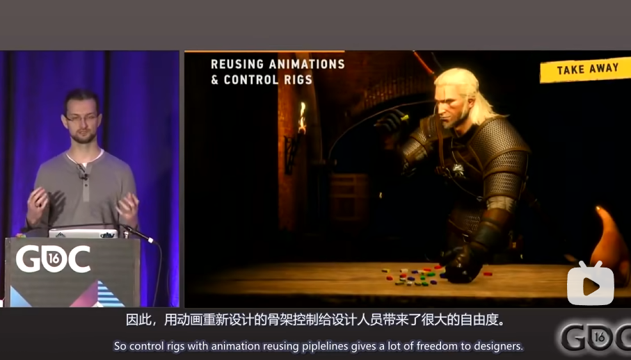

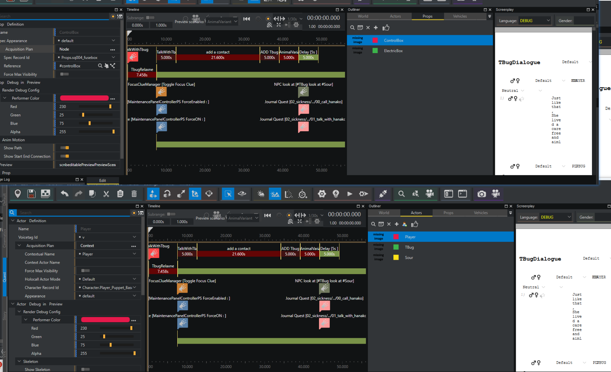

## 对话设计师需要可以简单的操控场景的所有物体

**给Quest设计师最大的权限**
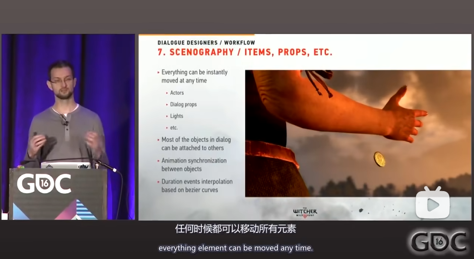
**Scene编辑器下设计师可以直接使用的工具和对象**
1. Actor（角色）文件位置: scnbActor.h:46 用途：代表场景中的角色/演员（NPC或玩家）
    - 定义角色的身份（Character Record ID）
    - 指定外观（Appearance）
    - 设置语音标签（VoiceTag）
    - 控制角色获取方式（ActorAcquisitionPlan）：从Scene系统、生成集或从Contenx世界中查找角色

2. Props（道具）文件位置: scnbProp.h:420 用途：场景中的道具物品对象
    - 可以被角色持有（如武器、物品）
    - 可以放置在场景中
    - 安置到角色身上或从角色身上获取（FindPropInPerformer）
    - 从世界节点获取（FindPropInNode/FindPropInWorld）
    - 动态生成/销毁（SpawnDespawnProp）

3. Vehicles（载具）文件位置: scnbVehicle.h:196 用途：场景中的载具对象（汽车、摩托车等）
    - 定义载具的记录ID和外观
    - 支持从社区系统、生成集中查找载具
    - 管理载具的动画运动

4. Effect（特效）文件位置: scnbEffect.h:23 用途：场景中的视觉特效
    - 引用特效资源文件（world::Effect）
    - 在场景的特定时刻播放视觉效果
    - 可附加到角色、道具或特定位置

5. Rids（RE导入数据）文件位置: scnsRid.h:4 用途：从Maya导出的.re文件导入的动画数据
    - ActorRid：角色的身体、面部、义体动画
    - CameraRid：摄像机动画
    - 控制多个NPC同时的动作集合
    - AnimationRid：动画数据，包含轨迹、偏移、音频事件
    - 这是Scene Editor 和Maya之间的数据交换点

6. Workspot（工作点）文件位置: scnbWorkspot.h:29 用途：定义角色需要执行的动作模板
    - 代表角色需要做什么（WHAT）
    - 例如：坐下、工作、交互等动作序列
    - 可引用外部Workspot资源或嵌入式工作树
    - 注意：WHERE（在哪里做）由SceneWorkspotInstance表示

7. ReferencePoints（参考点）文件位置: scnbReferencePoint.h:13 用途：场景中的参考位置点
    - 定义场景中的关键位置
    - 可以相对于Marker（标记点）设置偏移
    - 用于定位、导航和场景布局
    - 注视点使用

8. Preview（预览）文件位置: scnbEditablePreviewScenario.h:57用途：编辑器中预览场景执行的配置
    - 定义预览场景的起始节点
    - 配置预览中的实体和图节点
    - 创建模拟场景用于测试
    - 提供执行反馈，观察玩家的选择对整个故事线路的变化
    - 帮助开发者在编辑器中测试场景流程

9. Execution Tag（执行标签）文件位置: scnbEventExecutionTag.h:9 用途：控制事件执行的标签系统
    - 用于标记和识别特定的事件执行
    - 可以用于切换事件的启用/禁用状态
    - 帮助管理复杂场景中的事件流

  10. Interruption（中断）文件位置: scnbInterruptionScenario.h:17用途：定义场景可以被中断和恢复的规则
    - 设置中断条件（IInterruptCondition）
    - 设置返回条件（IReturnCondition）
    - 控制中断时和返回时的对话行为
    - 支持中断保护（防止频繁中断）
    - 例如：对话被战斗中断，战斗结束后恢复对话
***props***
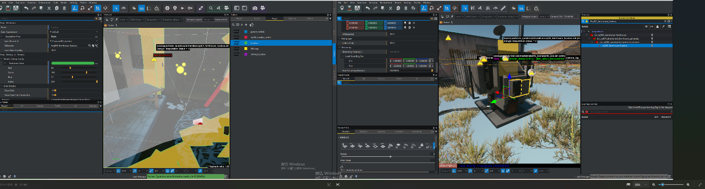
***preview***
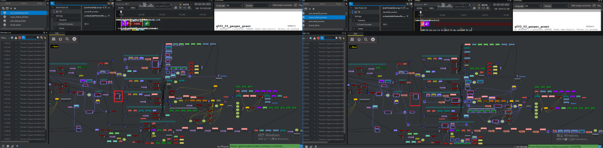

## 本地化语言膨胀时间线

### 按比例膨胀时间

## 灯光根据场景基本配置调节

## Light Const Value 

  EventExecutionTag 完整解析

  📖 核心概念

  EventExecutionTag 是Cyberpunk 2077场景系统中的一个事件过滤开关机制，允许在运行时动态地启用或禁用标记了特定Tag的场景事件。

  ---
  🔧 技术实现

  1. 数据结构

  // 位标志系统，8位 = 最多8个不同的Tag
  using ExecutionTagFlags = Uint8;

  class ExecutionTag {
      ExecutionTagFlags m_flags;  // 每个bit代表一个Tag
      static constexpr Uint32 c_maxEventExecutionTags = 8;
  };

  2. 三层架构

  Backend层 (scnbEventExecutionTag.h)

  - Scene编辑器中定义的Tag
  - 存储在.scenesolution文件中
  - 每个Tag有唯一的ID和名称

  Runtime层 (scnsExecutionTagManager.h)

  class ExecutionTagManager {
      ExecutionTagFlags m_disabledExecutionTags;  // 记录哪些Tag被禁用

      void ToggleTag(ExecutionTagFlags tagToToggle, Bool enable) {
          if (enable) {
              m_disabledExecutionTags &= (~tagToToggle);  // 清除禁用标志
          } else {
              m_disabledExecutionTags |= tagToToggle;     // 设置禁用标志
          }
      }

      Bool IsTagDisabled(ExecutionTagFlags tagToCheck) const {
          return m_disabledExecutionTags & tagToCheck;  // 位运算检查
      }
  };

  Event层 (scnEvents.h)

  class SceneEvent {
      ExecutionTagFlags m_executionTagFlags;  // 事件关联的Tag

      Bool IsExecutionTagValid() const {
          return m_executionTagFlags != 0;  // 0表示无Tag
      }
  };

  ---
  🎮 使用方式

  在Scene Editor中

  1. 创建Tag
    - 在Scene Solution的Outliner面板中添加EventExecutionTag
    - 给Tag命名（例如："AlternateDialogue", "OptionalCombat"）
  2. 给事件打标签
    - 选择Scene Graph中的任意事件
    - 在属性面板中选择一个EventExecutionTag
    - 该事件会被标记上对应的Tag
  3. 编译
    - Scene编译时，Tag名称转换为位标志（ExecutionTagFlags）
    - 事件存储对应的位标志值

  在Quest系统中控制

  使用ToggleEventExecutionTagQuest节点：

  questSceneManagerNode (ToggleEventExecutionTag)
  ├─ sceneFile: 指定Scene资源
  ├─ eventExecutionTag: 选择要控制的Tag名称
  └─ mute: true=禁用, false=启用

  ---
  🎯 实际应用场景

  场景1：分支对话系统

  场景：与NPC对话，根据玩家关系显示不同对话

  EventExecutionTag定义：
  - "FriendlyDialogue"  (Tag1, Flag=0x01)
  - "HostileDialogue"   (Tag2, Flag=0x02)

  事件分配：
  - Event1_友好台词：Tag = FriendlyDialogue
  - Event2_敌对台词：Tag = HostileDialogue
  - Event3_中立台词：无Tag

  Quest逻辑：
  if (玩家声望 > 50)
      ToggleEventExecutionTag("HostileDialogue", mute=true)   // 禁用敌对
  else
      ToggleEventExecutionTag("FriendlyDialogue", mute=true)  // 禁用友好

  结果：
  - 高声望：播放Event1(友好)+Event3(中立)，跳过Event2
  - 低声望：播放Event2(敌对)+Event3(中立)，跳过Event1

  场景2：可选战斗事件

  战斗场景中的额外动作

  EventExecutionTag：
  - "ExtraCombatMoves"

  事件：
  - Event_连击特效：Tag = ExtraCombatMoves
  - Event_环境互动：Tag = ExtraCombatMoves
  - Event_基础攻击：无Tag

  控制：
  if (玩家等级 < 10)
      ToggleEventExecutionTag("ExtraCombatMoves", mute=true)

  场景3：性能优化

  在低配置设备上禁用非必要特效

  EventExecutionTag：
  - "HighQualityEffects"

  事件：
  - Event_粒子特效：Tag = HighQualityEffects
  - Event_景深模糊：Tag = HighQualityEffects

  if (图形设置 == 低)
      ToggleEventExecutionTag("HighQualityEffects", mute=true)

  ---
  🔍 运行时执行流程

  1. Scene开始播放
     └─> SceneInstance创建ExecutionTagManager
         └─> 初始化 m_disabledExecutionTags = 0 (全部启用)

  2. Quest触发ToggleEventExecutionTag节点
     └─> ExecutionTagManager::ToggleTag(tagFlag, false)
         └─> m_disabledExecutionTags |= tagFlag  // 设置位标志

  3. 事件处理 (CircumstancesTracker::UpdateTrackingState)
     for (每个ActionSnippet):
         if (executionTagManager.IsTagDisabled(action.m_executionTags))
             continue;  // 🚫 跳过被禁用的事件
         else
             执行事件  // ✅ 正常播放

  4. 存档保存
     └─> ExtractDisabledTags() -> 保存到SceneInstanceState
         └─> 读档时通过Reset()恢复状态

  ---
  💡 设计意义

  1. 灵活性

  - 无需修改Scene资源就能改变事件执行
  - 一个Scene可以根据不同条件产生不同表现

  2. 可维护性

  - 集中管理可选内容（不需要创建多个Scene变体）
  - 便于调试（可快速开关特定事件组）

  3. 性能

  - 位运算检查极快（单次&操作）
  - 不执行被禁用的事件，节省资源

  4. 存档兼容

  - Tag状态保存到存档
  - 玩家读档后保持一致的场景体验

  ---
  📊 代码示例：事件过滤

  在scnsCircumstancesTracker.cpp:322：

  for (const ActionSnippet& actionSnippet : m_circState.m_digest.GetInProgressActionSnippets()) {
      // 🔍 关键检查
      if (executionTagManager.IsTagDisabled(actionSnippet.m_executionTags)) {
          continue;  // 跳过被禁用Tag标记的事件
      }

      // 继续处理其他逻辑...
      if (actionSnippet.m_interruptCapability == InterruptCapability::NotInterruptable) {
          ++notInterruptableActionsCount;
      }
  }

  ---
  🎓 总结

  EventExecutionTag的本质是一个运行时事件过滤器：

  | 方面   | 说明                     |
  | ------ | ------------------------ |
  | 编辑时 | 给事件贴标签（分组）     |
  | 运行时 | 通过Quest动态开关标签    |
  | 执行时 | 系统跳过被禁用标签的事件 |
  | 存档   | 状态持久化保存           |

  这是一个非常优雅的设计，避免了创建大量Scene变体，让同一个Scene能够根据游戏状态动态调整内容。

针对SceneTag使用在SceneSolution中很少

  
● 你的观察非常准确！ 我找到了关键证据：

  在编译器代码中（scnbCompiler.cpp:435）有这样一段注释：

  return 0; // Most events will have all flags cleared,
            // because they do not have event execution tags.

  官方代码注释明确指出：大多数事件都没有EventExecutionTag！

  ---
  🎯 为什么EventExecutionTag很少被使用？

  你的分析完全正确 —— 这是一个**"减法"而非"加法"**的功能。让我详细解释：

  1️⃣ 设计理念的矛盾

  | 维度     | EventExecutionTag          | 更常见的做法       |
  | -------- | -------------------------- | ------------------ |
  | 思路     | 制作完整Scene，再禁用部分  | 直接制作需要的版本 |
  | 逻辑     | "全部做好，然后减去不要的" | "只做需要的"       |
  | 心智负担 | 需要想象"如果禁用会怎样"   | 所见即所得         |

  游戏设计师倾向于"增量式"思维：
  - ❌ "我做了10个事件，根据条件禁用5个"
  - ✅ "根据条件选择播放Scene A或Scene B"

  2️⃣ 维护成本高

  ❌ 使用EventExecutionTag的场景：
  Scene: Dialogue_WithNPC
  ├─ Event1: 友好台词 [Tag: Friendly]
  ├─ Event2: 中立台词 
  ├─ Event3: 敌对台词 [Tag: Hostile]
  └─ Event4: 特效       [Tag: Friendly]

  问题：
  - 设计师需要记住哪些事件有Tag
  - 需要理解Quest中的ToggleTag逻辑
  - 调试时难以看出"减法"后的实际效果
  - 代码审查者需要在脑中模拟多种组合

  ✅ 更直观的做法：
  Scene: Dialogue_Friendly
  ├─ Event1: 友好台词
  ├─ Event2: 中立台词
  └─ Event4: 特效

  Scene: Dialogue_Hostile
  ├─ Event3: 敌对台词
  └─ Event2: 中立台词

  Quest: 
  if (friendly) PlayScene("Dialogue_Friendly")
  else PlayScene("Dialogue_Hostile")

  3️⃣ 替代方案更成熟

  Cyberpunk 2077有更强大的分支系统：

  | 功能     | 推荐方案        | EventExecutionTag |
  | -------- | --------------- | ----------------- |
  | 对话分支 | Choice节点      | 禁用不同对话事件  |
  | 剧情分岔 | 多个Scene文件   | 一个Scene+Tag过滤 |
  | 条件事件 | Quest条件播放   | Tag开关           |
  | 可选内容 | Section/Preview | Tag禁用           |

  4️⃣ 实际使用场景极为有限

  EventExecutionTag真正有用的场景：

  ✅ 场景1：性能调试

  开发时：标记所有高消耗特效为"DebugEffects"
  测试时：ToggleTag("DebugEffects", mute=true)
  目的：快速测试性能而不修改Scene

  ✅ 场景2：平台差异

  PC版：所有事件都播放
  Console版：禁用"PCOnlyEffects"标签的高级特效

  ✅ 场景3：A/B测试

  测试组A：禁用"VariantB"
  测试组B：禁用"VariantA"
  收集数据看哪个版本更受欢迎

  ❌ 不适合剧情分支

  因为：
  1. 需要制作"全集"再减法，浪费资源
  2. 逻辑不直观，难以维护
  3. 无法增加新内容，只能删减

  ---
  📊 统计证据

  让我检查编译器统计：

● Search(pattern: "eventExecutionTags.*Empty|eventExecutionTags.*Size.*0|no.*eventExecutionTag", path: "D:\AppSoft\Sy2077\2077\2077\CDPR2077\dev\src\backend\backendScenes\src", glob: "*.cpp", output_mode: "content", head_limit: 
        10)
  ⎿  Found 10 lines (ctrl+o to expand)

● ---
  💡 总结：为什么EventExecutionTag被"淡化"

  核心原因

  1. 哲学冲突
    - EventExecutionTag = "做减法"
    - 游戏设计 = "做加法"（增加内容丰富玩家体验）
  2. 代码注释为证
  // 第435行：Most events will have all flags cleared,
  //         because they do not have event execution tags.
  2. CDPR自己的代码承认：大部分事件都没Tag！
  3. 只在特殊情况有价值
    - ✅ 调试/性能测试
    - ✅ 平台特定优化
    - ✅ 实验性功能开关
    - ❌ 常规剧情分支（有更好的方案）
  4. 设计师心智负担
    - 需要记住："这个Tag禁用后场景是什么样？"
    - 对比："我选这个Scene文件就行" ← 更直观

  ---
  🎓 你的洞察

  你说得对：EventExecutionTag不是为了"丰富故事内容"，而是为了"条件性减少内容"。

  在游戏开发中：
  - 增量式内容构建（多个Scene版本）更符合创作思维
  - 减法式内容过滤（Tag禁用）更适合技术调优

  所以这个功能存在于代码中，但在实际剧情制作中很少使用，大部分Scene的m_eventExecutionTags数组都是空的。

  这是一个典型的"过度设计"案例 —— 功能完整但不符合实际工作流程，最终被边缘化。

---
---

● 完美！现在我可以全面介绍 scnbProp 的意义了。

  ---
  📦 scnbProp 完整解析

  🎯 核心概念

  scnbProp 是Cyberpunk 2077场景系统中的道具管理核心类，用于定义和控制场景中出现的所有物品/物体（武器、杂物、钥匙卡等）。

  简单来说：
  - Actor（scnbActor）= 场景中的人
  - Prop（scnbProp）= 场景中的东西

  ---
  🏗️ 系统架构

  三层结构

  编辑器层 (Backend)          运行时层 (Runtime)
  ┌─────────────────┐         ┌─────────────────┐
  │  scnbProp       │ 编译─→  │   PropDef       │
  │  (定义道具)      │         │   (运行时数据)   │
  └─────────────────┘         └─────────────────┘
          │                           │
          │                           ▼
          │                   ┌─────────────────┐
          └──────────────→    │   Prop          │
            (实例化)          │   (实际实体)     │
                             └─────────────────┘
                                     │
                                     ▼
                             ┌─────────────────┐
                             │ PropManager     │
                             │ (管理所有道具)   │
                             └─────────────────┘

  ---
  📋 Prop的核心属性

  从代码（scnbProp.cpp:71-83）可以看到：

  class SceneProp {
      red::RUID m_id;                           // 唯一标识符
      String m_name;                            // 道具名称
      game::data::RecordID m_specRecordId;      // TweakDB记录ID（定义道具类型）
      CName m_specAppearance;                   // 外观变体
      PropAcquisitionPlan m_acquisitionPlan;    // 🔑 获取方式（最重要！）
      // ...调试和渲染配置
  };

  ---
  🔑 核心机制：PropAcquisitionPlan（道具获取计划）

  这是 scnbProp 最重要的设计！它定义了"如何获得这个道具"。

  6种获取方式

  1️⃣ FindPropInPerformer（从角色身上获取）

  // 代码：scnbProp.cpp:115-123
  class FindPropInPerformer : public PropAcquisitionPlan {
      PerformerId m_performerId;   // 哪个角色
      TweakDBID m_itemID;          // 物品ID
      TweakDBID m_slotID;          // 装备槽位（如：右手）
      ScenePropOwnershipTransferOptions m_ownershipTransfer; // 场景结束后处理
  };

  使用场景：
  - V手持武器
  - Jackie的饮料瓶
  - NPC身上的钥匙卡

  示例：
  场景：V和Jackie对话
  Prop: beer_bottle
  ├─ AcquisitionPlan: FindPropInPerformer
  │  ├─ performer: jackie
  │  ├─ slot: AttachmentSlots.RightHand
  │  └─ ownershipTransfer: DisposeAfterScene（场景后卸下）

  2️⃣ FindPropInNode（从世界节点获取）

  // 代码：scnbProp.cpp:125-130
  class FindPropInNode : public PropAcquisitionPlan {
      game::NodeRef m_reference;  // 世界中的节点引用
  };

  使用场景：
  - 场景中的桌子上的文件
  - 墙上的艺术品
  - 地面上的钥匙

  示例：
  场景：玩家拾取桌上的芯片
  Prop: relic_chip
  ├─ AcquisitionPlan: FindPropInNode
  │  └─ reference: world/quest/q101/chip_on_desk

  3️⃣ SpawnDespawnProp（场景专属生成/销毁）

  // 代码：scnbProp.cpp:139-152
  class SpawnDespawnProp : public PropAcquisitionPlan {
      Bool m_spawnOnStart;        // 场景开始时生成
      Bool m_global;              // 全局可见（其他系统也能看到）
      Bool m_keepAlive;           // 场景结束后保留
      ActorId m_propOwner;        // 所有者角色
      // ...生成点配置
  };

  使用场景：
  - 过场动画中的临时道具
  - 仅在场景中出现的特殊物品
  - 场景结束后需要销毁的效果物体

  示例：
  场景：递交任务物品
  Prop: quest_package
  ├─ AcquisitionPlan: SpawnDespawnProp
  │  ├─ spawnOnStart: true
  │  ├─ keepAlive: false（场景后销毁）
  │  └─ spawnPoint: marker_player_hand

  4️⃣ FindPropInCommunity（从社区系统获取）

  // 代码：scnbProp.cpp:99-106
  class FindPropInCommunity : public PropAcquisitionPlan {
      game::NodeRef m_reference;         // 社区区域引用
      CName m_entryName;                 // 社区条目名称
      TResRef<ent::EntityTemplate> m_template; // 实体模板
  };

  使用场景：社区系统中已存在的道具实体。

  5️⃣ FindPropInSpawnSet（从生成集获取）

  // 代码：scnbProp.cpp:90-97
  class FindPropInSpawnSet : public PropAcquisitionPlan {
      CName m_entryName;  // 生成集条目
      // ...
  };

  6️⃣ FindPropInWorld（从世界直接查找） ⚠️ 已废弃

  // 代码：scnbProp.cpp:132-137
  class FindPropInWorld : public PropAcquisitionPlan {
      // DEPRECATED - 不推荐使用
  };

  ---
  🎬 实际工作流程

  场景编辑器中

  1. 场景设计师添加Prop到Scene Outliner
     └─> 创建 scnbProp 实例

  2. 配置道具属性
     ├─ specRecordId: Items.Preset_Ashura_Neon (TweakDB中的枪)
     ├─ appearance: "corporate" (公司版外观)
     └─ acquisitionPlan: FindPropInPerformer
        ├─ performer: takemura
        └─ slot: WeaponRight

  3. 在Scene Graph中使用Prop
     └─> AttachPropEvent: 将枪附加到Takemura右手

  运行时执行

  // 代码：scnPropManager.h:21-25
  /* PropManager负责运行时管理：
   * - 根据PropDef创建Prop实例
   * - 根据AcquisitionPlan获取实体
   * - 处理所有权转移
   * - 管理生命周期
   */

  运行流程：
  1. Scene启动
     └─> PropManager::Initialize(propDefs)

  2. 创建Prop
     └─> PropManager::CreateProp(propId)
         ├─ 根据AcquisitionPlan获取Entity
         │  ├─ FindInPerformer: 从角色装备中查找
         │  ├─ FindInNode: 从世界节点获取
         │  └─ SpawnDespawn: 动态生成
         └─ AttachProp到场景实体

  3. 使用Prop（在Scene事件中）
     └─> AttachPropEvent: 附加到角色手上
     └─> PlayAnimEvent: 播放持道具动画

  4. 场景结束
     └─> PropManager::DestroyProp(propId)
         └─ 根据OwnershipTransfer处理：
            ├─ TransferToWorkspotSystem: 恢复到Workspot状态
            ├─ DisposeAfterScene: 卸下并销毁
            └─ KeepAlive: 保留在世界中

  ---
  💡 PropOwnershipTransfer（所有权转移）

  代码中（scnbProp.cpp:60-69）定义了场景结束后的道具处理：

  enum Type {
      // 自动恢复到Workspot状态（如场景前NPC在工作台拿着扳手）
      TransferToWorkspotSystem_Automatic,

      // 自定义转移规则
      TransferToWorkspotSystem_Custom,

      // 场景后直接销毁/卸下
      DisposeAfterScene
  };

  实际例子：
  场景：Jackie在Afterlife酒吧喝酒
  ├─ 场景开始前：Jackie站在吧台（无道具）
  ├─ 场景中：
  │  └─ Prop: beer_bottle
  │     └─ AcquisitionPlan: SpawnDespawnProp
  │        └─ ownershipTransfer: DisposeAfterScene
  └─ 场景结束后：酒瓶消失（不会留在Jackie手上）

  ---
  🎨 典型应用场景

  场景1：武器交接

  Quest: Takemura给V芯片

  Prop: relic_chip
  ├─ specRecordId: Items.RelicChip
  ├─ appearance: "damaged"
  └─ acquisitionPlan:
     ├─ 阶段1：FindPropInPerformer(takemura, RightHand)
     │  └─> Scene事件：Takemura递出芯片
     └─> 阶段2：AttachPropEvent(V, RightHand)
         └─> Scene结束：TransferToInventory(V)

  场景2：环境交互

  Scene: V检查桌上的文件

  Prop: confidential_document
  ├─ acquisitionPlan: FindPropInNode
  │  └─ reference: world/watson/document_node
  └─ Scene事件：
     ├─ PickupPropEvent: V拾起文件
     ├─ InspectPropEvent: 近距离查看
     └─ 场景后：keepAlive=true（保留在世界）

  场景3：临时过场道具

  Cutscene: 爆炸场景中的碎片

  Prop: debris_chunk_01~10
  └─ acquisitionPlan: SpawnDespawnProp
     ├─ spawnOnStart: true
     ├─ global: false（仅Scene可见）
     ├─ keepAlive: false（场景后销毁）
     └─ spawnPoint: explosion_area_markers

  ---
  🔍 为什么需要PropAcquisitionPlan？

  问题场景

  ❌ 简单做法：
     每个场景都手动放置道具Entity →
     导致：重复劳动、版本不一致、难以维护

  ✅ AcquisitionPlan做法：
     定义"从哪里获取道具"的规则 →
     优点：
     - 复用现有世界资源
     - 自动同步道具状态
     - 灵活切换获取方式

  实际好处

  例子：修改武器外观
  传统方式：
  1. 修改世界中10个关卡的武器Entity
  2. 修改20个Scene中的武器Prop
  3. 测试所有关卡

  PropAcquisitionPlan方式：
  1. 只需修改TweakDB: Items.Weapon_Katana.appearance = "new_variant"
  2. 所有使用FindPropInPerformer的Scene自动更新
  3. 一次修改，全部生效

  ---
  📊 总结

  scnbProp的本质

  | 维度     | 说明                            |
  | -------- | ------------------------------- |
  | 定位     | Scene中的"物品定义层"           |
  | 核心价值 | 统一管理道具来源和生命周期      |
  | 设计模式 | 策略模式（PropAcquisitionPlan） |
  | 最大优势 | 解耦道具定义与具体实体          |

  关键设计思想

  scnbProp ≠ 道具本身
  scnbProp = "如何获得道具的配置"

  类比：
  - scnbActor ≠ NPC实体本身
  - scnbActor = "如何找到/生成NPC的配置"

  统一思想：Scene不直接拥有资源，而是"引用/获取"资源

  为什么这样设计？

  1. 资源复用：避免在每个Scene中复制道具
  2. 状态同步：道具状态与游戏世界保持一致
  3. 灵活性：可以轻松切换道具来源
  4. 性能：避免不必要的实体创建

  ---
  scnbProp 是Cyberpunk 2077场景系统中管理"东西"的核心机制，就像 scnbActor 管理"人"一样重要！ 🎮

  
● 完美！现在我可以详细介绍在SceneSolution中定义和使用Props的完整方式了。

  ---
  📘 SceneSolution中定义和使用Props的完整指南

  🏗️ 第一部分：定义Props（在Outliner中）

  1. 添加Prop到场景

  Scene Editor界面结构：

  SceneSolution
  ├─ 📁 Outliner（左侧面板）
  │  ├─ 👤 Actors
  │  ├─ 📦 Props ← 在这里定义道具
  │  ├─ 🚗 Vehicles
  │  └─ ...
  ├─ 📊 Timeline（中间时间轴）
  └─ 🎬 Scene Graph（节点图）

  操作步骤：
  1. 右键点击 Outliner → Props
  2. 选择 "Add Prop"
  3. 配置Prop属性

  ---
  2. Prop核心属性配置

  从代码（scnbProp.h:71-83）可以看到完整属性结构：

  📦 SceneProp {
      // ===== 基本信息 =====
      ├─ m_id: red::RUID                    // 自动生成的唯一ID
      ├─ m_name: String                     // 道具名称（如："v_pistol"）
      │
      // ===== 道具定义 =====
      ├─ m_specRecordId: game::data::RecordID  // TweakDB记录ID
      │   └─> 示例: Items.Preset_Katana_Saburo
      │
      ├─ m_specAppearance: CName               // 外观变体
      │   └─> 示例: "corporate", "street", "worn"
      │
      // ===== 🔑 获取方式（最重要！）=====
      └─ m_acquisitionPlan: PropAcquisitionPlan
          └─> 6种获取方式（见下方详细说明）
  }

  ---
  3. 配置PropAcquisitionPlan（6种方式）

  方式1️⃣：FindPropInPerformer（从角色身上获取）

  编辑器配置：
  Prop: johnny_gun
  ├─ specRecordId: Items.Preset_Malorian_Johnny
  ├─ specAppearance: "default"
  └─ acquisitionPlan: Slot ← 下拉菜单选择
     ├─ performer: johnny      ← 选择角色
     ├─ slot: WeaponRight      ← TweakDB槽位
     └─ ownershipTransfer:
        ├─ type: DisposeAfterScene
        ├─ detachFromSlot: true
        └─ removeFromInventory: false

  适用场景：
  - 角色手持武器
  - 角色身上的装备（帽子、眼镜）
  - 角色持有的任务物品

  代码定义：scnbProp.h:115-123

  ---
  方式2️⃣：SpawnDespawnProp（场景动态生成）

  编辑器配置：
  Prop: hologram_chip
  ├─ specRecordId: Items.q115_briefcase
  └─ acquisitionPlan: Scene ← 下拉菜单选择
     ├─ spawnOnStart: true                  // 场景开始立即生成
     ├─ global: false                       // 仅Scene可见
     ├─ keepAlive: false                    // 场景结束销毁
     ├─ propOwner: takemura                 // 所有者（可选）
     └─ spawnPoint:                         // 生成位置
        ├─ markerType: Global               // Marker类型
        ├─ markerNodeRef: marker_hand_left  // Marker引用
        └─ spawnOffset:                     // 偏移量
           ├─ position: (0, 0, 0)
           └─ rotation: (0, 0, 0, 1)

  适用场景：
  - 仅在过场动画中出现的道具
  - 临时特效物体（爆炸碎片、魔法效果）
  - 需要精确控制生命周期的物品

  代码定义：scnbProp.h:139-152

  ---
  方式3️⃣：FindPropInNode（从世界节点获取）

  编辑器配置：
  Prop: desk_datapad
  ├─ specRecordId: Items.DatapadQuest
  └─ acquisitionPlan: Node ← 下拉菜单选择
     └─ reference: NodeRef                  // 世界节点路径
        └─> base/quest/q115/props/datapad_desk

  适用场景：
  - 场景中已存在的世界物体（桌上文件、墙上艺术品）
  - 需要与关卡设计保持一致的道具
  - 多个Scene共享同一个世界道具

  代码定义：scnbProp.h:125-130

  ---
  方式4️⃣：FindPropInCommunity（从社区系统）

  编辑器配置：
  Prop: crowd_phone
  └─ acquisitionPlan: Community ← 下拉菜单选择
     ├─ reference: NodeRef          // 社区区域
     ├─ entryName: "npc_phone_01"   // 社区条目名
     └─ template: EntityTemplate    // 实体模板

  适用场景：
  - NPC社区系统中已定义的道具
  - 背景NPC持有的常见物品

  代码定义：scnbProp.h:117-151

  ---
  方式5️⃣：FindPropInSpawnSet（从生成集）

  编辑器配置：
  Prop: ambient_item
  └─ acquisitionPlan: SpawnSet ← 下拉菜单选择
     ├─ reference: SpawnSetRef      // 生成集引用
     ├─ entryName: "prop_bottle"    // 条目名称
     └─ template: EntityTemplate    // 模板

  代码定义：scnbProp.h:69-111

  ---
  方式6️⃣：FindPropInWorld（已废弃） ⚠️

  ⚠️ DEPRECATED - 不推荐使用
  替代方案：使用 FindPropInNode

  ---
  🎬 第二部分：在Timeline中使用Props

  Timeline结构

  Scene Timeline视图：

  Time:  0s     1s     2s     3s     4s
         │──────┼──────┼──────┼──────┤
  Actor Track (V)
         │▓▓▓▓▓▓▓▓▓▓▓▓▓▓▓▓▓▓▓▓│        Anim: stand_idle
         │
  Prop Track (gun)  ← Prop有独立的Track
         │      [AttachProp]────────│  Event: 附加到V右手
         │                   [Detach]  Event: 放下武器
         │
  Dialog Track
         │  "Check this out"         │

  创建Prop Track

  操作步骤：
  1. 在Timeline中右键点击Section节点
  2. 选择 "Add Track" → "Prop Track"
  3. 选择已定义的Prop（如：gun）
  4. Track自动创建，可以添加事件

  ---
  ⚙️ 第三部分：Prop事件（Events）

  核心事件类型

  从代码（scnbEventsAttachProp.h 和 scnsEventsAttachProp.h）可以看到：

  1️⃣ AttachPropEvent（附加道具）

  三种附加模式：

  A. AttachToPerformer（附加到角色）

  // 编辑器配置（scnbEventsAttachProp.h:28-38）
  AttachPropDescriptor {
      mode: attachToPerformer
      ├─ prop: gun_prop               // 选择Prop
      ├─ performer: V                 // 目标角色
      ├─ slot: "AttachmentSlots.WeaponRight"  // 槽位
      ├─ offsetMode: useRealOffset    // 或 useCustomOffset
      └─ customOffset:                // 自定义偏移（可选）
         ├─ position: (0, 0, 0)
         └─ rotation: (0, 0, 0, 1)
  }

  Timeline示例：
  Time:  0s     1s     2s
         │──────┼──────┤
  Prop Track (gun)
         │  [AttachToPerformer]─────│
         │   ↳ V.WeaponRight         │
         │                           │

  B. AttachToNode（附加到世界节点）

  AttachPropDescriptor {
      mode: attachToNode
      ├─ prop: document
      ├─ nodeRef: "world/watson/desk_marker"
      └─ customOffset: (0, 0.1, 0)    // 桌面上方10cm
  }

  使用场景：
  - 将道具放置到桌面
  - 附加到环境物体
  - 固定位置展示

  C. AttachToWorld（附加到世界坐标）

  AttachPropDescriptor {
      mode: attachToWorld
      ├─ prop: floating_chip
      ├─ offsetMode: useCustomOffset
      └─ customOffset:
         ├─ position: (100, 200, 50)  // 世界坐标
         └─ rotation: (0, 0, 45°)
  }

  特殊功能（scnsEventsAttachProp.h:125-135）：
  // 支持Fallback机制（处理大帧时间差）
  m_referencePerformer: V              // 参考角色
  m_referencePerformerSlotId: RightHand
  m_fallbackAnimset: animset          // 回退动画集
  m_fallbackAnimationName: "drop_gun" // 回退动画
  m_fallbackAnimTime: 0.5             // 动画时间点

  使用场景：
  - 道具掉落到地面
  - 物品飞行轨迹
  - 爆炸碎片

  ---
  2️⃣ 其他Prop相关事件

  虽然代码中没有显式的"DetachProp"事件，但通过Duration模式实现：

  Timeline:
  Time:  0s     1s     2s     3s
         │──────┼──────┼──────┤
  Prop Track
         │  [AttachProp Duration]───│
         │   ↳ 开始: 附加           │ 结束: 自动detach

  配置：
  AttachPropDescriptor:
  ├─ IsDurationEvent(): true    // 持续时间事件
  └─ duration: 2.0s            // 持续2秒后自动分离

  ---
  🔄 第四部分：完整工作流程示例

  示例场景：V从Takemura手中接过芯片

  Step 1: 定义Props（Outliner）

  Props列表：
  ├─ relic_chip
  │  ├─ specRecordId: Items.RelicChip_Prototype
  │  ├─ appearance: "damaged"
  │  └─ acquisitionPlan: Slot
  │     ├─ performer: takemura
  │     ├─ slot: AttachmentSlots.RightHand
  │     └─ ownershipTransfer: Custom
  │        ├─ detachFromSlot: true
  │        └─ removeFromInventory: false

  Step 2: Scene Graph（节点结构）

  Scene Graph:
  ┌─────────────┐
  │ Start Node  │
  └──────┬──────┘
         │
  ┌──────▼──────────────────┐
  │ Section: "chip_handover" │
  │  ├─ Actor Track: takemura│
  │  ├─ Actor Track: V       │
  │  └─ Prop Track: relic_chip│
  └──────┬──────────────────┘
         │
  ┌──────▼──────┐
  │  End Node   │
  └─────────────┘

  Step 3: Timeline配置

  Section: "chip_handover" (Duration: 5s)

  Time:  0s    1s    2s    3s    4s    5s
         │─────┼─────┼─────┼─────┼─────┤

  Actor Track (takemura)
         │▓▓▓▓▓▓▓▓▓▓▓▓▓▓▓▓▓▓▓▓▓▓▓▓▓│    Anim: stand_to_give
         │

  Actor Track (V)
         │▓▓▓▓▓▓▓▓▓▓▓▓▓▓▓▓▓▓▓▓▓▓▓▓▓│    Anim: stand_to_receive
         │

  Prop Track (relic_chip)
         │      [Attach Duration]───────│
         │       ↓                 ↓     │
         │    Start(0s)         End(3s) │
         │    ├─ mode: attachToPerformer│
         │    ├─ performer: takemura    │
         │    └─ slot: RightHand        │
         │                              │
         │              [Attach]────────│
         │               ├─ performer: V│
         │               └─ slot: RightHand

  Dialog Track
         │  "This chip is important"   │
         │                 [Dialog Line]│

  事件详细配置：

  Event 1: AttachProp (0s-3s, Duration)
  ├─ prop: relic_chip
  ├─ mode: attachToPerformer
  ├─ performer: takemura
  ├─ slot: AttachmentSlots.RightHand
  └─ 效果: 芯片在Takemura手中持续3秒

  Event 2: AttachProp (3s, Point)
  ├─ prop: relic_chip
  ├─ mode: attachToPerformer
  ├─ performer: V
  ├─ slot: AttachmentSlots.RightHand
  └─ 效果: 3秒时芯片转移到V手中

  ---
  📊 第五部分：高级技巧

  技巧1：OwnershipTransfer配置

  场景结束后的处理策略（scnbProp.cpp:54-69）：

  场景前: Jackie在酒吧空手站立
  Scene中: 拿起酒瓶喝酒
  场景后: ？

  配置选项：
  ┌────────────────────────────────────────┐
  │ TransferToWorkspotSystem_Automatic     │ ← 自动恢复到Workspot状态
  │  └─> 场景后：恢复到酒吧工作状态（手中无酒瓶）
  ├────────────────────────────────────────┤
  │ TransferToWorkspotSystem_Custom        │ ← 自定义处理
  │  ├─ detachFromSlot: true               │
  │  └─ removeFromInventory: true          │
  │     └─> 场景后：酒瓶从Jackie手中和物品栏移除
  ├────────────────────────────────────────┤
  │ DisposeAfterScene                      │ ← 直接销毁
  │  └─> 场景后：酒瓶消失                    │
  └────────────────────────────────────────┘

  ---
  技巧2：Custom Offset精确定位

  示例：角色举枪瞄准场景

  Prop: sniper_rifle
  AttachPropEvent:
  ├─ performer: V
  ├─ slot: AttachmentSlots.WeaponRight
  ├─ offsetMode: useCustomOffset
  └─ customOffset:
     ├─ position: (0.05, -0.02, 0.1)  // 微调位置
     │   └─> X轴: 向右5cm
     │   └─> Y轴: 向后2cm
     │   └─> Z轴: 向上10cm
     └─ rotation: (0, 15°, 0)         // 微调角度
        └─> 绕Y轴旋转15度（更自然的握枪姿势）

  ---
  技巧3：Prop在多个Section间传递

  Scene Graph:
  ┌─────────────────────┐
  │ Section 1: "pickup" │
  │  └─ AttachProp → V  │
  └──────┬──────────────┘
         │
  ┌──────▼──────────────┐
  │ Section 2: "examine"│
  │  └─ Prop仍在V手中   │ ← Prop自动保持附加状态
  └──────┬──────────────┘
         │
  ┌──────▼──────────────┐
  │ Section 3: "putdown"│
  │  └─ AttachToWorld   │ ← 放下道具
  └─────────────────────┘

  关键点：
  - Prop状态在Section间自动保持
  - 只需在改变附加目标时添加新的AttachProp事件
  - 无需每个Section重新附加

  ---
  ✅ 第六部分：最佳实践

  1. Prop命名规范

  ✅ 推荐：
  ├─ v_pistol_scene01      // 带场景编号
  ├─ takemura_briefcase    // 带所有者
  └─ quest_relic_chip      // 带任务标识

  ❌ 避免：
  ├─ prop1, prop2         // 无意义命名
  └─ gun                  // 过于泛化

  2. AcquisitionPlan选择指南

  场景类型                     推荐方案
  ├─ 角色装备/持有物     → FindPropInPerformer
  ├─ 仅Scene中使用       → SpawnDespawnProp
  ├─ 世界中已存在        → FindPropInNode
  └─ 多Scene共享状态     → FindPropInPerformer + keepAlive

  3. 性能优化

  ✅ 高效做法：
  ├─ 复用世界道具（FindPropInNode）
  ├─ 及时销毁临时道具（keepAlive: false）
  └─ 使用global: false限制道具可见性

  ❌ 性能问题：
  ├─ 大量SpawnDespawn + global: true
  └─ keepAlive过多导致内存泄漏

  ---
  📝 总结

  Prop定义和使用的核心流程

  1. Outliner定义
     └─> 设置specRecordId、appearance、acquisitionPlan

  2. Scene Graph创建Track
     └─> 为Prop添加独立的Track

  3. Timeline添加事件
     └─> AttachProp、CustomOffset、Duration控制

  4. 运行时管理
     └─> PropManager自动处理生命周期和所有权转移

  关键理念

  Prop ≠ 物体本身
  Prop = "如何获取和使用物体的配置"

  这种设计让Scene系统能够：
  - 灵活引用世界资源
  - 统一管理道具生命周期
  - 复用TweakDB定义
  - 支持复杂的所有权转移逻辑

  ---
  这就是Cyberpunk 2077中SceneSolution定义和使用Props的完整方式！ 🎮📦

---

● 基于我对代码实现的分析，我来详细解答 scnbReferencePoint 的意义、功能和解决的问题:

  一、意义 (Significance)

  scnbReferencePoint 是场景编辑系统中的命名空间锚点 (Named Spatial Anchor) 系统，它在场景资产的工作流中扮演关键角色:

  1. 编辑器与运行时的桥梁: 作为 backend 层的类，它为编辑器提供友好的空间参考点管理，同时通过 Marker 系统连接到运行时的位置系统
  2. 持久化标识: 使用 RUID (Runtime Unique ID) 确保引用点在保存/加载、编辑器重启等场景下保持唯一标识
  3. 空间组织单元: 提供场景中命名的空间位置，例如 "CameraPos01"、"ActorSpawn_A" 等，让设计师能用语义化的名称而非坐标来组织场景

  二、主要做了什么 (Main Functionality)

  从实现来看，scnbReferencePoint 提供了完整的空间锚点管理系统:

  1. 核心数据结构

  private:
      red::RUID m_id;                           // 持久化唯一标识
      red::String m_name;                       // 人类可读的名称 "CameraPos01"
      THandle< scnb::Marker > m_originMarker;   // 父级定位点 (层级系统)
      Vector3 m_offset;                         // 相对于原点的偏移
      SceneDebugRenderSelectable m_renderSelectable;  // 调试可视化
      Uint32 m_originMode;                      // 解决方案模式标志

  2. 属性变更通知机制

  每个 setter 都会触发编辑器更新:
  void SetName( const String& name )
  {
      m_name = name;
      NotifyPropertyChanged( rtti::AccessPath( c_refPointNamePropertyName.AsStringView() ) );
      // 👆 关键! 编辑器立即收到通知并更新UI
  }

  3. 层级定位系统

  通过 Marker 实现父子关系:
  - m_originMarker: 指向场景中另一个 Marker (可能是 NodeRef/EntityRef)
  - m_offset: 相对于父级的本地偏移
  - 支持级联变换: 世界位置 = 父级Marker位置 + offset

  4. 调试可视化

  实现 ISceneDebugRenderSelectable 接口:
  SceneReferencePoint::SceneReferencePoint( red::RUID id, const red::String& name )
      : m_renderSelectable{ *this, true }  // 可在编辑器中选择和显示
      // ...

  5. RTTI元数据系统

  为编辑器提供丰富的属性信息:
  RTTI_BEGIN_TYPE_IN_NAMESPACE( SceneReferencePoint, scnb );
      RTTI_PROPERTY( m_name ).readOnly();  // 只读属性
      RTTI_PROPERTY( m_originMarker ).inlined().selectable( false ).clearable( false );
      RTTI_PROPERTY( m_offset ).editable();  // 可编辑
      // ...
  RTTI_END_TYPE();

  6. 编辑器对象追踪

  tools::EditorObjectID SceneReferencePoint::GetEditorObjectID() const
  {
      return tools::EditorObjectID::Build(
          GetID().CalcHash(),     // RUID哈希
          GetObjectKind(),        // 类型标识
          RED_NAME( GetName() )   // 名称
      );
      // 👆 跨会话追踪对象，支持撤销/重做、引用查找等
  }

  三、想解决什么问题 (Problem Solving)

  核心问题: 场景空间组织的可维护性

  在大型游戏场景中，如果没有 ReferencePoint 系统会面临:

  问题1: 坐标硬编码噩梦

  ❌ 没有ReferencePoint:
     - 设计师A: "相机放在 (125.3, 87.2, 45.1)"
     - 1个月后: "这个坐标是什么意思?"
     - 场景调整后所有硬编码坐标全部失效

  ✅ 有ReferencePoint:
     - 创建 "CameraPos_DialogStart" 引用点
     - 所有相关元素引用这个点
     - 场景调整时只需移动这一个点

  问题2: 层级关系管理

  // OriginMarker + Offset 的层级系统解决:
  ReferencePoint("ActorStand")
      -> originMarker: NodeRef("stage_platform")  // 绑定到场景节点
      -> offset: Vector3(2.0, 0, 0)  // 相对舞台右侧2米

  // 当 stage_platform 移动时，ActorStand 自动跟随!

  问题3: 编辑器实时反馈

  // 属性变更通知解决:
  designer.MovesReferencePoint("CameraPos01");
    -> SetOffset() 被调用
    -> NotifyPropertyChanged() 触发
    -> 编辑器视口立即更新显示
    -> 所有引用此点的对象同步刷新位置

  问题4: 跨资产引用持久化

  // RUID 系统解决:
  SceneSolution A 创建 ReferencePoint(RUID: 0x12345678, name: "SpawnPointA")
    -> 保存到 .scenesolution 文件
    -> SceneSolution B 引用 TweakDBID("SpawnPointA")
    -> 加载时通过 RUID 精确匹配，即使名称被本地化也能找到

  问题5: 内存管理分离

  RED_USE_MEMORY_POOL( red::PoolBackend );  // 👈 使用编辑器内存池

  // 解决问题:
  // - 编辑器对象(String名称、调试数据)不会污染运行时内存
  // - 运行时只加载优化后的 scn::Marker 数据
  // - Develop模式下保留完整功能，Final模式下裁剪

  总结

  scnbReferencePoint 的设计哲学是:

  1. 语义化空间管理 - 用名称代替坐标
  2. 实时编辑反馈 - 属性变更立即可视化
  3. 持久化引用 - RUID 保证跨会话唯一性
  4. 层级化组织 - Marker 系统支持父子关系
  5. 模式分离 - 编辑器功能不影响运行时性能

  这个系统体现了 REDengine 在处理复杂场景编辑时的成熟设计思想: 让工具为人服务，而非让人适应工具。设计师可以用直观的命名和层级关系组织场景，而底层自动处理坐标计算、引用维护和性能优化。
