# 2077对话编辑器工具
## 目录
1. [Timeline](#1-timeline)
2. [SceneNodePreview 场景方案预览功能](#2-scenenodepreview-场景方案预览功能)
   - [Preview Scenario](#preview-scenario)
3. [快速增长的数据库进行状态的控制](#3-快速增长的数据库进行状态的控制)
4. [Animation Tree Structure](#4-animation-tree-structure)
5. [多标签数据匹配](#5-多标签数据匹配)
   - [骨骼动画数据库](#骨骼动画数据库)
6. [Props|Actor|Vehicle工具](#6-propsactorvehicle工具)
   - [Props](#props)
7. [Animal 的加权裁剪混合](#7-animal-的加权裁剪混合)
8. [所有可添加的AnimationTrack](#8-所有可添加的animationtrack)
9. [对话设计师需要可以简单的操控场景的所有物体](#9-对话设计师需要可以简单的操控场景的所有物体)
10. [本地化语言膨胀时间线](#10-本地化语言膨胀时间线)
    - [按比例膨胀时间](#按比例膨胀时间)
11. [灯光根据场景基本配置调节](#11-灯光根据场景基本配置调节)
12. [Light Const Value](#12-light-const-value)
13. [杂项](#13-杂项)
    - [Cinematic演绎框架：场景干扰控制](#cinematic演绎框架场景干扰控制)
    - [Cinematic框架下玩家对剧情的间接影响](#cinematic框架下玩家对剧情的间接影响)

## Timeline

## SceneNodePreview 场景方案预览功能
 
### Preview Scenario
1. SceneNodePreview

2. 切换使用节点路径

3. Pause 节点的跳过

4. 更长更多信息的Timeline

5. 播放创建Preview Scenario 过程
5. 分析
 Preview Scenario TimeLine 是根据节点的选择动态创建，根据设计师的随时修正生成整条Timeline结果，Preview Scenario TimeLine 是Scene编辑器的分阶段分支线的直观展示
 目的在于帮助设计师在编辑时，快速了解当前场景的动画结构、事件阶段、动画时间轴、玩家选择产生的结果，对于多支线非线性叙述中具有非常直观的帮助。
6. 创建了可按步骤预览的Timeline直观给设计师观察目前的剧情状态提供清晰的事件脉络

## 快速增长的数据库进行状态的控制

**Fact数据库**

## Animation Tree Structure

多标签数据匹配
骨骼动画数据匹配库
1. 命名和标签规则:

~~~
Generic_Arverage_Female_sit_Chair(bar)
stand__lh_tablet__01__slow_hours__01
dirt__kneel__2h_elbow_on_knees__01__look_right__01 Dirt(帮派|NPC种类)_(姿态)_(姿态)_(姿态)_(姿态)_(姿态)
lie_ground_0__2h_on_head__01__shuffle__04......
~~~
2. 设计师使用时的查找规则

帮派|通用|Idle|.....|前倚靠|后倚靠|
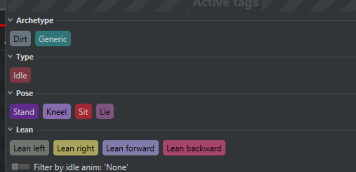

### TimeLine上的Animal 的加权、裁剪、混合、微调

**Timeline上的动画微调工具**

***所有可添加的AnimationTrack***
**动画微调工具**
- 在动画中控制骨骼给设计师带来极大的自由度
- 对部份动画在Timeline上的微调工具可以使得动画资产不必每个都做定制化开发
- 添加骨骼Mask方式实现多个动画混合

**动画骨骼微调**

**动画骨骼指向**
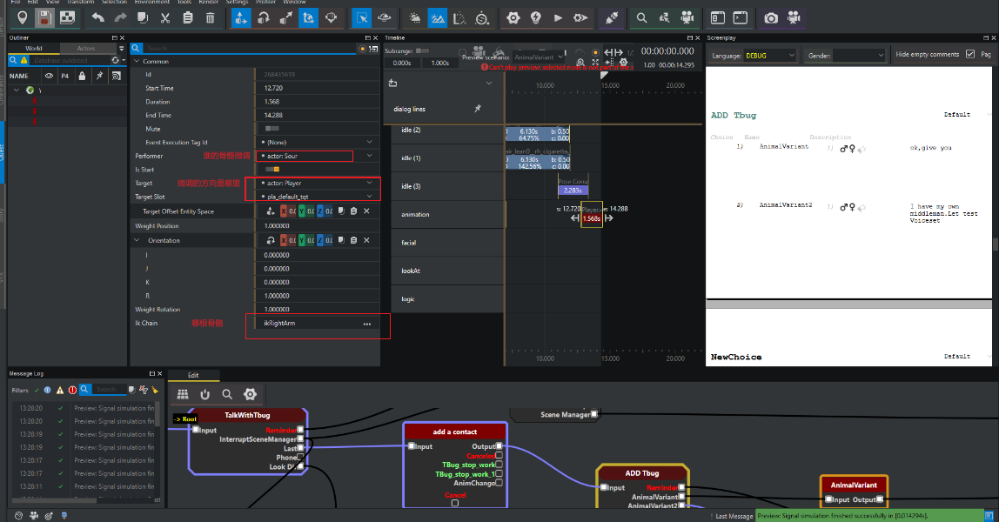
**动画骨骼裁剪**
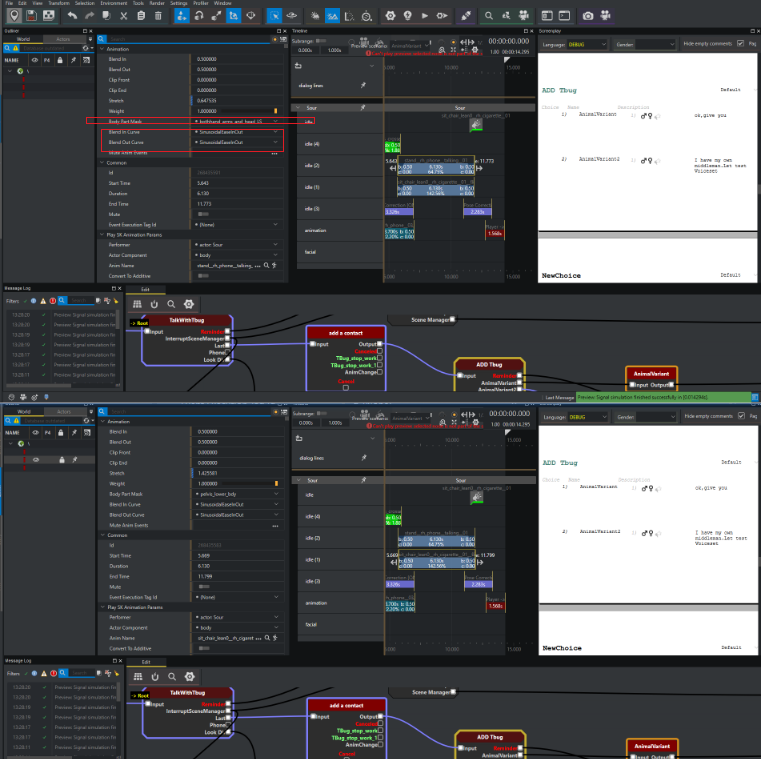

**AnimationTrack**

| AnimationTrack                                                           | 描述                           |
| :----------------------------------------------------------------------- | :----------------------------- |
| “播放动画”   Create [actor]  "Play Animation"                            | 普通动画轨道                   |
| “播放消除动画”  Create [actor] "Play Rid Animation"                      | 播放Rid动画                    |
| “切换Idle” Create [actor] "Change Idle"                                  | 切换Idle状态                   |
| “添加待机”  Create [actor] "Add Idle"                                    | 添加Idle                       |
| “带混合添加待机”  Create [actor] "Add Idle With Blend"                   | 添加Idle的混合动画             |
| “看向”   Create [actor] "Look At"                                        | 看向姿态                       |
| “额外看向”     Create [actor] "Additional Look At'                       |                                |
| “姿态修正”  Create [actor] "Pose Correction"                             | 姿态修正手势修正               |
| “（IK）”  Create [actor] "IK"                                            | 骨骼IK混合                     |
| “更改位置”  Create [actor] "Change Placement"                            |                                |
| “设置动画特征”  Create [actor] "Set Anim Feature"                        |                                |
| “更改工作” Create [actor] "Change work"                                  | 更改工作点内容                 |
| “停止工作”   Create [actor] "Stop work"                                  | 停止工作点                     |
| “附加道具”   Create [prop] "Attach Prop"                                 | 附加道具                       |
| “镜头片段”     Create [camera] "Clip"                                    |                                |
| “播放骑乘动画”    Create [camera] "Play Rid Animation"                   |                                |
| “播放音频”        Create [other] "Play Audio"                            | 声音轨道                       |
| “播放音频（带时长）” Create [other] "Play AudioDuration"                 | 声音可变Section                |
| “播放视觉特效（VFX）”  Create [other] "Play VFX"                         | 特效                           |
| “播放视觉特效（带时长）” Create [other] "Play VFX Duration"              | Section特效                    |
| “播放视觉特效（超梦同步）”  Create [other] "Play VFX Braindance"         | 超梦特效                       |
| “提示”     Create [other] "Clue"                                         | 绑定物体做出提示信息           |
| “播放视频”    Create [other] "Play Video"                                |                                |
| “插槽事件”      Create [other] "Socket Event"                            | 添加eventTrack（中途触发事件） |
| “玩家游戏内看向”   Create [other] "Player Gameplay LookAt"               |                                |
| “脑波可见性”      Create [other] "Braindance Visibility"                 |                                |
| “播放 UI 动画”      Create [other] "Play UI Animation"                   |                                |
| “播放 UI 动画（脑波同步）” Create [other] "Play UI Animation Braindance" |                                |

## 对话设计师需要可以简单的操控场景的所有物体

**给Quest设计师最大的权限**

**Scene编辑器下设计师可以直接使用的工具和对象**
1. Actor（角色）文件位置: scnbActor.h:46 用途：代表场景中的角色/演员（NPC或玩家）
    - 定义角色的身份（Character Record ID）
    - 指定外观（Appearance）
    - 设置语音标签（VoiceTag）
    - 控制角色获取方式（ActorAcquisitionPlan）：从Scene系统、生成集或从Contenx世界中查找角色

2. Props（道具）文件位置: scnbProp.h:420 用途：场景中的道具物品对象
    - 可以被角色持有（如武器、物品）
    - 可以放置在场景中
    - 安置到角色身上或从角色身上获取（FindPropInPerformer）
    - 从世界节点获取（FindPropInNode/FindPropInWorld）
    - 动态生成/销毁（SpawnDespawnProp）

3. Vehicles（载具）文件位置: scnbVehicle.h:196 用途：场景中的载具对象（汽车、摩托车等）
    - 定义载具的记录ID和外观
    - 支持从社区系统、生成集中查找载具
    - 管理载具的动画运动

4. Effect（特效）文件位置: scnbEffect.h:23 用途：场景中的视觉特效
    - 引用特效资源文件（world::Effect）
    - 在场景的特定时刻播放视觉效果
    - 可附加到角色、道具或特定位置

5. Rids（RE导入数据）文件位置: scnsRid.h:4 用途：从Maya导出的.re文件导入的动画数据
    - ActorRid：角色的身体、面部、义体动画
    - CameraRid：摄像机动画
    - 控制多个NPC同时的动作集合
    - AnimationRid：动画数据，包含轨迹、偏移、音频事件
    - 这是Scene Editor 和Maya之间的数据交换点

6. Workspot（工作点）文件位置: scnbWorkspot.h:29 用途：定义角色需要执行的动作模板
    - 代表角色需要做什么（WHAT）
    - 例如：坐下、工作、交互等动作序列
    - 可引用外部Workspot资源或嵌入式工作树
    - 注意：WHERE（在哪里做）由SceneWorkspotInstance表示

7. ReferencePoints（参考点）文件位置: scnbReferencePoint.h:13 用途：场景中的参考位置点
    - 定义场景中的关键位置
    - 可以相对于Marker（标记点）设置偏移
    - 用于定位、导航和场景布局
    - 注视点使用

8. Preview（预览）文件位置: scnbEditablePreviewScenario.h:57用途：编辑器中预览场景执行的配置
    - 定义预览场景的起始节点
    - 配置预览中的实体和图节点
    - 创建模拟场景用于测试
    - 提供执行反馈，观察玩家的选择对整个故事线路的变化
    - 帮助开发者在编辑器中测试场景流程

9. Execution Tag（执行标签）文件位置: scnbEventExecutionTag.h:9 用途：控制事件执行的标签系统
    - 用于标记和识别特定的事件执行
    - 可以用于切换事件的启用/禁用状态
    - 帮助管理复杂场景中的事件流

10. Interruption（中断）文件位置: scnbInterruptionScenario.h:17用途：定义场景可以被中断和恢复的规则
    - 设置中断条件（IInterruptCondition）
    - 设置返回条件（IReturnCondition）
    - 控制中断时和返回时的对话行为
    - 支持中断保护（防止频繁中断）
    - 例如：对话被战斗中断，战斗结束后恢复对话

***props***

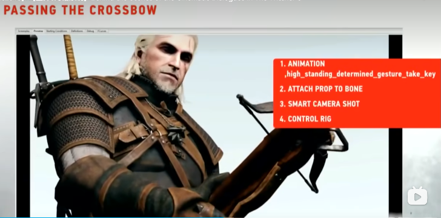
scnbProp ≠ 道具本身
scnbProp = "如何获得道具的配置"

使用场景：
    - 过场动画中的临时道具
    - 仅在场景中出现的特殊物品
    - 场景结束后需要销毁的效果物体
    - 在这段剧情中需要添加特殊交互功能的物体

| 维度     | 说明                            |
| -------- | ------------------------------- |
| 定位     | Scene中的"物品定义层"           |
| 核心价值 | 统一管理道具来源和生命周期      |
| 设计模式 | 策略模式（PropAcquisitionPlan） |
| 最大优势 | 解耦道具定义与具体实体          |

优点：
    - 复用现有世界资源
    - 自动同步道具状态
    - 灵活切换获取方式

 为什么这样设计？
  1. 资源复用：避免在每个Scene中复制道具
  2. 状态同步：道具状态与游戏世界保持一致
  3. 灵活性：可以轻松切换道具来源
  4. 性能：避免不必要的实体创建

***preview***

***interrupt***
"base\\quest\\main_quests\\part1\\q115\\scenes\\q115_02c_holocalls.scenesolution":
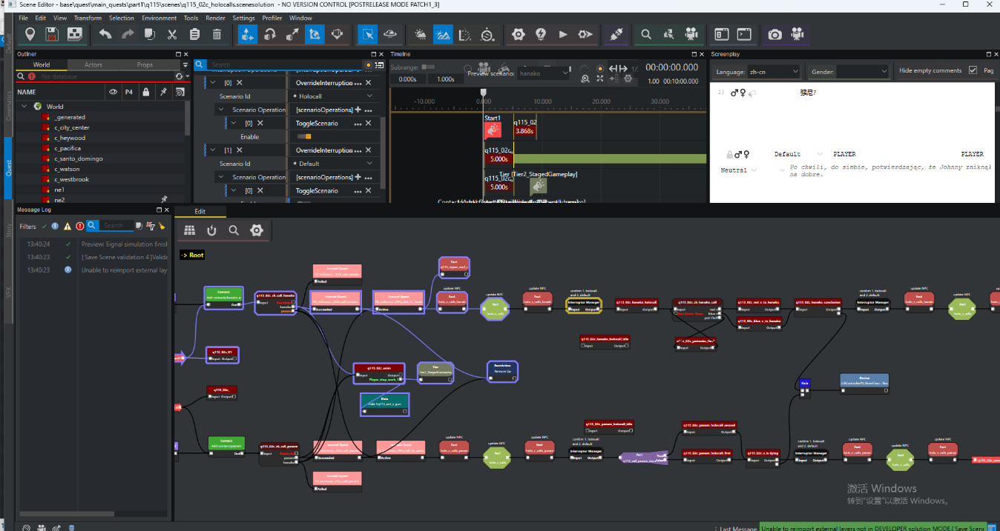
对一些特殊的事件会打断剧情进行；
在特殊的信息传递和关键的剧情演绎过程中运行被环境变化打断；
让玩家处在安全或者特殊的环境中进行演绎；
***workspot***
***reference point***
***Execution Tag***
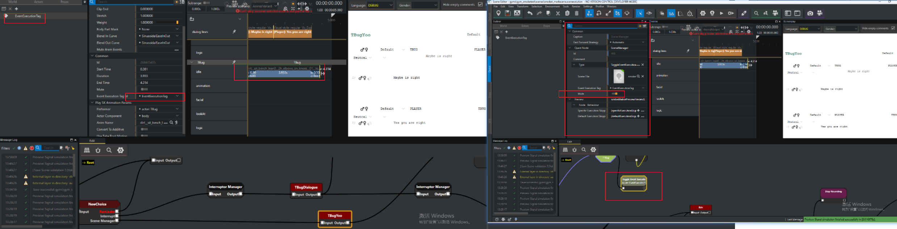
  | 功能     | 推荐方案        | EventExecutionTag |
  | -------- | --------------- | ----------------- |
  | 对话分支 | Choice节点      | 禁用不同对话事件  |
  | 剧情分岔 | 多个Scene文件   | 一个Scene+Tag过滤 |
  | 条件事件 | Quest条件播放   | Tag开关           |
  | 可选内容 | Section/Preview | Tag禁用           |

***EventExecutionTag不是为了"丰富故事内容"，而是为了"条件性减少内容"。***

EventExecutionTag控制SectionTrack是否运行
    1. EventExecutionTag = "做减法"，游戏设计 = "做加法"（增加内容丰富玩家体验）
    2. 代码注释为证// 在编译器代码中（scnbCompiler.cpp:435） 第435行：Most events will have all flags cleared, because they do not have event execution tags.
    2. CDPR自己的代码承认：大部分事件都没Tag！
    3. 只在特殊情况有价值
        - ✅ 调试/性能测试
        - ✅ 平台特定优化
        - ✅ 实验性功能开关
        - ❌ 常规剧情分支（有更好的方案）

## 灯光根据场景基本配置调节
在剧情演绎时讲好一个故事在某个场景中，光亮会根据场景的配置而变化的需要
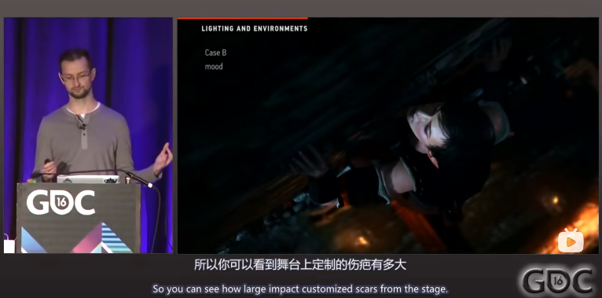
灯光参数根据一个场景的基本系数进行缩放
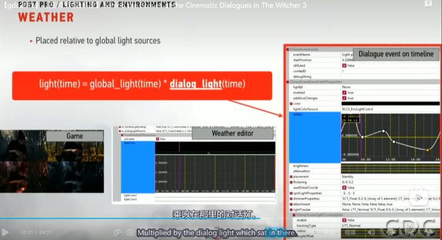

## Light Const Value 

## 本地化语言膨胀时间线
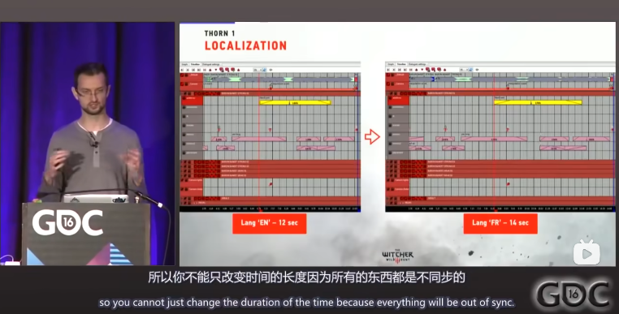

### 按比例膨胀时间

## 杂项

### Cinematic演绎框架，在一定区域内的演绎不应该被其他内容干扰
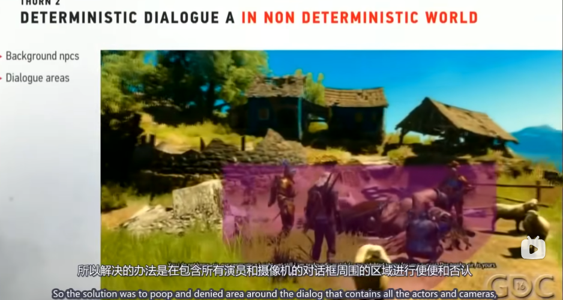
interrupt 概念

### Cinematic框架下玩家的间接影响剧情的变化
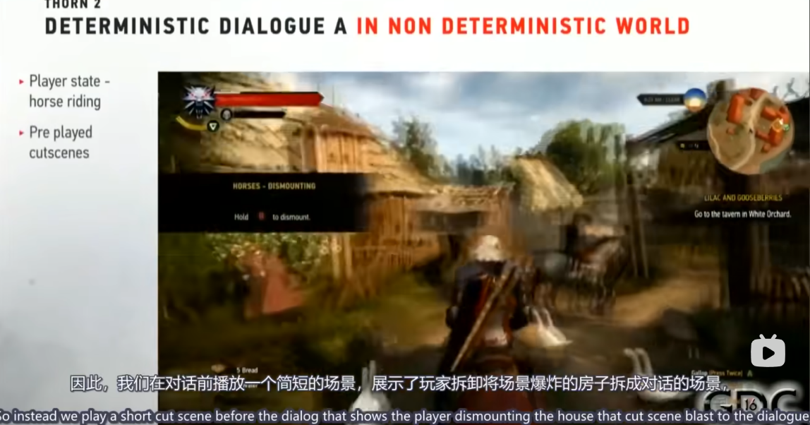

## scene编辑工具
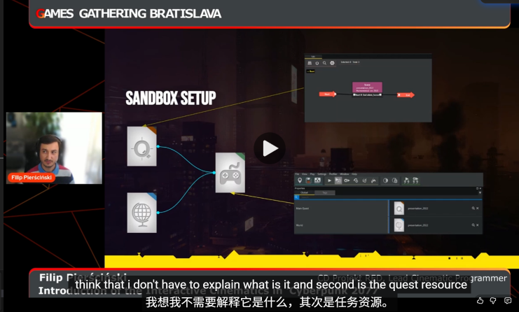

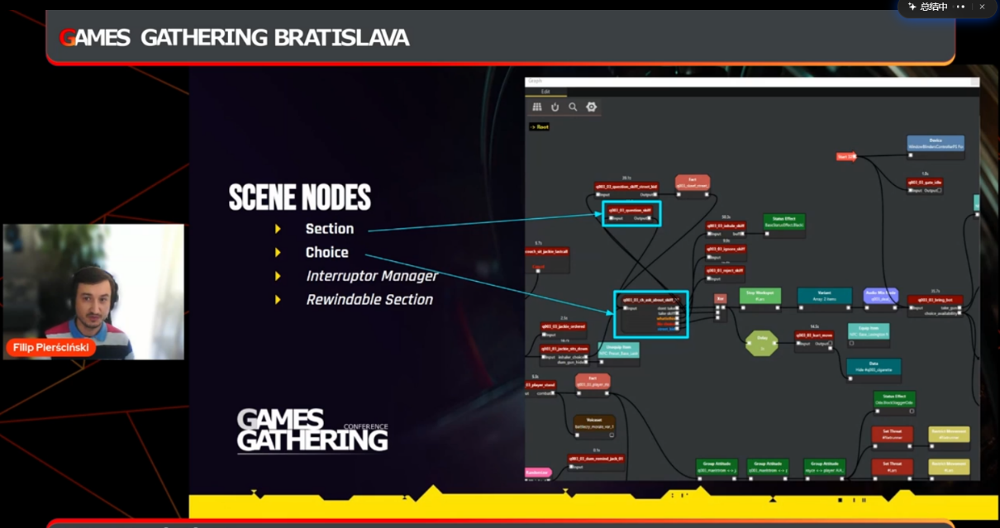

Fact捕获玩家的非直接选择，记录后对后续演绎出现不一样的变化

 基于我对代码实现的分析，我来详细解答 scnbReferencePoint 的意义、功能和解决的问题:

  一、意义 (Significance)

  scnbReferencePoint 是场景编辑系统中的命名空间锚点 (Named Spatial Anchor) 系统，它在场景资产的工作流中扮演关键角色:

  1. 编辑器与运行时的桥梁: 作为 backend 层的类，它为编辑器提供友好的空间参考点管理，同时通过 Marker 系统连接到运行时的位置系统
  2. 持久化标识: 使用 RUID (Runtime Unique ID) 确保引用点在保存/加载、编辑器重启等场景下保持唯一标识
  3. 空间组织单元: 提供场景中命名的空间位置，例如 "CameraPos01"、"ActorSpawn_A" 等，让设计师能用语义化的名称而非坐标来组织场景

  二、主要做了什么 (Main Functionality)

  从实现来看，scnbReferencePoint 提供了完整的空间锚点管理系统:

  1. 核心数据结构

  private:
      red::RUID m_id;                           // 持久化唯一标识
      red::String m_name;                       // 人类可读的名称 "CameraPos01"
      THandle< scnb::Marker > m_originMarker;   // 父级定位点 (层级系统)
      Vector3 m_offset;                         // 相对于原点的偏移
      SceneDebugRenderSelectable m_renderSelectable;  // 调试可视化
      Uint32 m_originMode;                      // 解决方案模式标志

  2. 属性变更通知机制

  每个 setter 都会触发编辑器更新:
  void SetName( const String& name )
  {
      m_name = name;
      NotifyPropertyChanged( rtti::AccessPath( c_refPointNamePropertyName.AsStringView() ) );
      // 👆 关键! 编辑器立即收到通知并更新UI
  }

  3. 层级定位系统

  通过 Marker 实现父子关系:
  - m_originMarker: 指向场景中另一个 Marker (可能是 NodeRef/EntityRef)
  - m_offset: 相对于父级的本地偏移
  - 支持级联变换: 世界位置 = 父级Marker位置 + offset

  4. 调试可视化

  实现 ISceneDebugRenderSelectable 接口:
  SceneReferencePoint::SceneReferencePoint( red::RUID id, const red::String& name )
      : m_renderSelectable{ *this, true }  // 可在编辑器中选择和显示
      // ...

  5. RTTI元数据系统

  为编辑器提供丰富的属性信息:
  RTTI_BEGIN_TYPE_IN_NAMESPACE( SceneReferencePoint, scnb );
      RTTI_PROPERTY( m_name ).readOnly();  // 只读属性
      RTTI_PROPERTY( m_originMarker ).inlined().selectable( false ).clearable( false );
      RTTI_PROPERTY( m_offset ).editable();  // 可编辑
      // ...
  RTTI_END_TYPE();

  6. 编辑器对象追踪

  tools::EditorObjectID SceneReferencePoint::GetEditorObjectID() const
  {
      return tools::EditorObjectID::Build(
          GetID().CalcHash(),     // RUID哈希
          GetObjectKind(),        // 类型标识
          RED_NAME( GetName() )   // 名称
      );
      // 👆 跨会话追踪对象，支持撤销/重做、引用查找等
  }

  三、想解决什么问题 (Problem Solving)

  核心问题: 场景空间组织的可维护性

  在大型游戏场景中，如果没有 ReferencePoint 系统会面临:

  问题1: 坐标硬编码噩梦

  ❌ 没有ReferencePoint:
     - 设计师A: "相机放在 (125.3, 87.2, 45.1)"
     - 1个月后: "这个坐标是什么意思?"
     - 场景调整后所有硬编码坐标全部失效

  ✅ 有ReferencePoint:
     - 创建 "CameraPos_DialogStart" 引用点
     - 所有相关元素引用这个点
     - 场景调整时只需移动这一个点

  问题2: 层级关系管理

  // OriginMarker + Offset 的层级系统解决:
  ReferencePoint("ActorStand")
      -> originMarker: NodeRef("stage_platform")  // 绑定到场景节点
      -> offset: Vector3(2.0, 0, 0)  // 相对舞台右侧2米

  // 当 stage_platform 移动时，ActorStand 自动跟随!

  问题3: 编辑器实时反馈

  // 属性变更通知解决:
  designer.MovesReferencePoint("CameraPos01");
    -> SetOffset() 被调用
    -> NotifyPropertyChanged() 触发
    -> 编辑器视口立即更新显示
    -> 所有引用此点的对象同步刷新位置

  问题4: 跨资产引用持久化

  // RUID 系统解决:
  SceneSolution A 创建 ReferencePoint(RUID: 0x12345678, name: "SpawnPointA")
    -> 保存到 .scenesolution 文件
    -> SceneSolution B 引用 TweakDBID("SpawnPointA")
    -> 加载时通过 RUID 精确匹配，即使名称被本地化也能找到

  问题5: 内存管理分离

  RED_USE_MEMORY_POOL( red::PoolBackend );  // 👈 使用编辑器内存池

  // 解决问题:
  // - 编辑器对象(String名称、调试数据)不会污染运行时内存
  // - 运行时只加载优化后的 scn::Marker 数据
  // - Develop模式下保留完整功能，Final模式下裁剪

  总结

  scnbReferencePoint 的设计哲学是:

  1. 语义化空间管理 - 用名称代替坐标
  2. 实时编辑反馈 - 属性变更立即可视化
  3. 持久化引用 - RUID 保证跨会话唯一性
  4. 层级化组织 - Marker 系统支持父子关系
  5. 模式分离 - 编辑器功能不影响运行时性能

  这个系统体现了 REDengine 在处理复杂场景编辑时的成熟设计思想: 让工具为人服务，而非让人适应工具。设计师可以用直观的命名和层级关系组织场景，而底层自动处理坐标计算、引用维护和性能优化。
