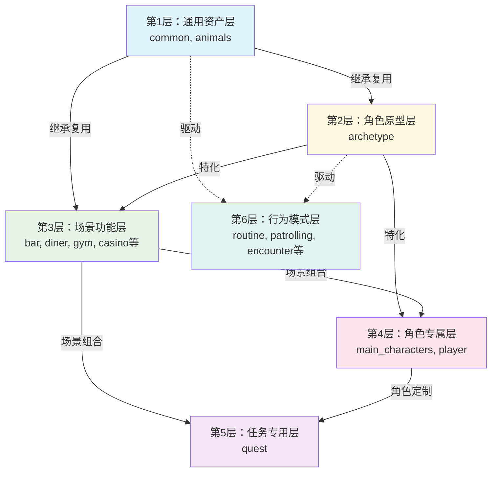

[TOC]


# 赛博朋克2077 Workspot 资产组织分析


## 整体规模
- **根目录**: `r6/depot/base/workspots`
- **目录数量**: 465个
- **Workspot文件**: 2516个
-  **顶层分类**: 30 个
- **分层组织**: 6 层架构


---

## 完整分层目录结构

markmap结构：[[workspot_markmap]]

### 第1层：通用资产层

> 最基础的交互类型，可复用于所有场景

**层级统计**: 2 个顶层目录，28 个子目录，479 个文件

```
animals/  # [2 子目录]
├── cat/  # [3 文件]
│   ├── cat__sit__01.workspot
│   ├── cat__sit_ground__clean_self__01.workspot
│   └── cat__sit_ground_food__eat__01.workspot
└── chicken/  # [1 文件]
    └── chicken__stand_ground__stand_around__01.workspot

common/  # [26 子目录]
├── arcade_machine/  # [1 文件]
│   └── generic__stand_arcade_machine_lean_front__play__01.workspot
├── bar/  # [23 文件]
│   ├── big__stand_bar_lean_front__stand_around__01.workspot
│   ├── generic__sit_bar__sit_around__01.workspot
│   ├── generic__sit_bar_lean_front__legs_crossed__01.workspot
│   └── ... (还有 20 个文件)
├── bar_and_barstool/  # [10 文件]
│   ├── big__sit_barstool_bar_lean_front_asian_takeout__eat__01.workspot
│   ├── big__sit_barstool_bar_lean_left_asian_takeout__eat__01.workspot
│   ├── generic__sit_barstool_bar_lean_front__sit_around__01.workspot
│   └── ... (还有 7 个文件)
├── barstool/  # [1 文件]
│   └── generic__sit_barstool__sit_around__01.workspot
├── bed/  # [11 文件]
│   ├── child__lie_bed__sleep__01.workspot
│   ├── female__sit_bed_lean_front__think__01.workspot
│   ├── generic__lie_bed_lean_left__lie_around__01.workspot
│   └── ... (还有 8 个文件)
├── bench/  # [7 文件]
│   ├── generic__sit_bench_lean_back__braindance__01.workspot
│   ├── generic__sit_bench_lean_back__braindance__02.workspot
│   ├── generic__sit_bench_lean_back__sit_around__01.workspot
│   └── ... (还有 4 个文件)
├── bike/  # [2 文件]
│   ├── big__sit_bike_lean_right__sit_around__01.workspot
│   └── generic__sit_bike__sit_around__01.workspot
├── car/  # [12 文件]
│   ├── big__sit_car__drive__01.workspot
│   ├── big__sit_car_lean_left__wait__01.workspot
│   ├── big__stand_car_hood_lean_back__stand_around__01.workspot
│   └── ... (还有 9 个文件)
├── chair/  # [81 文件]
│   ├── big__sit_chair_can__drink__01.workspot
│   ├── big__sit_chair_lean_back__sit_around__01.workspot
│   ├── big__sit_chair_lean_back__sit_around__02.workspot
│   └── ... (还有 78 个文件)
├── chair_table/  # [17 文件]
│   ├── child__sit_chair_table_lean_front__sit_around__01.workspot
│   ├── fat__sit_chair_table_lean_front_cigar__smoke__01.workspot
│   ├── female__sit_chair_table_lean_front_burger__eat__01.workspot
│   └── ... (还有 14 个文件)
├── couch/  # [12 文件]
│   ├── big__sit_couch_lean_back_gun__relax__01.workspot
│   ├── generic__lie_couch_tablet__read__01.workspot
│   ├── generic__sit_couch__sit_around__01.workspot
│   └── ... (还有 9 个文件)
├── curb/  # [1 文件]
│   └── generic__sit_curb_lean_front_handcuffs__sit_nervous__01.workspot
├── cyberware/  # [1 文件]
│   └── female__sit_maintain_jaw_cyberware__01.workspot
├── door/  # [1 文件]
│   └── generic__stand_door_lean_front__knock__01.workspot
├── grinder/  # [1 文件]
│   └── generic__stand_grinder_lean_front__work__01.workspot
├── ground/  # [217 文件]
│   ├── big__kneel_ground__kneel_around__01.workspot
│   ├── big__kneel_ground__kneel_around__02.workspot
│   ├── big__sit_bike__sit_around__01.workspot
│   └── ... (还有 214 个文件)
├── high_sink/  # [1 文件]
│   └── generic__stand_high_sink___wash_hands__01.workspot
├── ledge/  # [2 文件]
│   ├── generic__sit_ledge__sit_around__01.workspot
│   └── generic__sit_ledge__smoke__01.workspot
├── low_sink/  # [1 文件]
│   └── generic__stand_low_sink___wash_hands__01.workspot
├── low_table/  # [2 文件]
│   ├── generic__sit_low_table_lean_front__relax__01.workspot
│   └── generic__sit_low_table_lean_front_chopstick__eat__01.workspot
├── rail/  # [14 文件]
│   ├── generic__stand_rail_lean_back_cigarette__smoke__01.workspot
│   ├── generic__stand_rail_lean_front__stand_around__01.workspot
│   ├── generic__stand_rail_lean_front_burger__eat__01.workspot
│   └── ... (还有 11 个文件)
├── shelf/  # [3 文件]
│   ├── big__stand_shelf__pickup__02.workspot
│   ├── generic__kneel_shelf_lean_front__search__01.workspot
│   └── generic__stand_shelf_lean_front__search__01.workspot
├── stairs/  # [8 文件]
│   ├── generic__sit_stairs__cry__01.workspot
│   ├── generic__sit_stairs__sit_around__01.workspot
│   ├── generic__sit_stairs__sit_around__02.workspot
│   └── ... (还有 5 个文件)
├── table/  # [23 文件]
│   ├── big__sit_table__sit_around__01.workspot
│   ├── big__stand_table_lean_back__stand_around__01.workspot
│   ├── big__stand_table_lean_back_can__drink__01.workspot
│   └── ... (还有 20 个文件)
├── vending_machine/  # [3 文件]
│   ├── generic__stand_ground_vending_machine__repair__01.workspot
│   ├── generic__stand_vending_machine__use__01.workspot
│   └── generic__stand_vending_machine_lean_front__hit__01.workspot
└── wall/  # [20 文件]
    ├── dirt__stand_wall_lean_back_cigarette__smoke__01.workspot
    ├── dirt__stand_wall_lean_back_riffle__stand_around__01.workspot
    ├── dirt__stand_wall_lean_back_riffle__stand_around__02.workspot
    └── ... (还有 17 个文件)

```

### 第2层：角色原型层

> 按照NPC社会阶层和职业划分的行为模式

**层级统计**: 1 个顶层目录，23 个子目录，78 个文件

```
archetype/  # [8 子目录]
├── corpo/  # [13 文件]
│   ├── corpo__sit_chair__sit_around_devastated__01.workspot
│   ├── corpo__sit_chair_asian_takeout__eat__01.workspot
│   ├── corpo__sit_chair_asian_takeout__eat__02.workspot
│   └── ... (还有 10 个文件)
├── dirt/  # [1 子目录]
│   └── common/  # [5 子目录]
│       ├── bench/  # [2 文件]
│       │   ├── dirt__sit_bench_cellphone__check__01.workspot
│       │   └── dirt__sit_bench_lean_back__sit_around__01.workspot
│       ├── bike/  # [1 文件]
│       │   └── dirt__sit_bike__sit_around__01.workspot
│       ├── chair/  # [5 文件]
│       │   ├── dirt__sit_chair__dance_sexy__01.workspot
│       │   ├── dirt__sit_chair_lean_back_2h_rifle_01.workspot
│       │   ├── dirt__sit_chair_lean_back__smoke__01.workspot
│       │   └── ... (还有 2 个文件)
│       ├── ground/  # [10 文件]
│       │   ├── dirt__kneel_ground_cigarette__slav_squat__01.workspot
│       │   ├── dirt__sit_ground__slav_squat__01.workspot
│       │   ├── dirt__stand_ground__drugged__01.workspot
│       │   └── ... (还有 7 个文件)
│       └── wall/  # [4 文件]
│           ├── dirt__stand_wall_lean_back__stand_around__01.workspot
│           ├── dirt__stand_wall_lean_back_can__drink__01.workspot
│           ├── dirt__stand_wall_lean_back_cigarette__smoke__01.workspot
│           └── ... (还有 1 个文件)
├── dirtboy/  # [10 文件]
│   ├── dirt__stand__rh_cigarette__01.workspot
│   ├── dirt__stand_stairs__stand_around__01.workspot
│   ├── dirt__stand_stairs__stand_around__02.workspot
│   └── ... (还有 7 个文件)
├── dirtgirl/  # [3 子目录, 6 文件]
│   ├── bench/  # [1 文件]
│   │   └── dirtgirl__sit_bench_lean_front_can__drink__01.workspot
│   ├── ground/  # [1 文件]
│   │   └── dirtgirl__stand_ground__sexy_invite_steps__01.workspot
│   ├── wall/  # [2 文件]
│   │   ├── dirtgirl__stand_wall_lean_back__stand_around__01.workspot
│   │   └── dirtgirl__stand_wall_lean_back_cigarette__smoke__01.workspot
│   ├── dirtgirl__stand__stand_around__01.workspot
│   ├── dirtgirl__stand_ground_baseball_bat__stand_around__01.workspot
│   ├── dirtgirl__stand_ground_baseball_bat__stand_around__02.workspot
│   └── ... (还有 3 个文件)
├── droid_male/  # [2 文件]
│   ├── droid_male__stand_ground_tray__stand_around__01.workspot
│   └── guard__droid_disable__01.workspot
├── homeless/  # [1 子目录]
│   └── common/  # [2 子目录]
│       ├── bench/  # [2 文件]
│       │   ├── homeless__lie_bench__sleep__01.workspot
│       │   └── homeless__lie_bench__sleep__02.workspot
│       └── ground/  # [14 文件]
│           ├── homeless__lie_ground_lean_back__broken_braindance__01.workspot
│           ├── homeless__lie_ground_lean_back_braindance__use__01.workspot
│           ├── homeless__lie_ground_lean_left__sleep__01.workspot
│           └── ... (还有 11 个文件)
├── monk/  # [1 子目录]
│   └── common/  # [1 子目录]
│       └── ground/  # [4 文件]
│           ├── monk__sit_ground__meditate__01.workspot
│           ├── monk__sit_ground__meditate__02.workspot
│           ├── monk__sit_ground__meditate__03.workspot
│           └── ... (还有 1 个文件)
└── waitress/  # [1 子目录]
    └── ground/  # [1 文件]
        └── waitress__stand_ground_tray__hold__01.workspot

```

### 第3层：场景功能层

> 特定场景的专用交互，组合通用资产形成场景特色

**层级统计**: 17 个顶层目录，34 个子目录，158 个文件

```
apartment/  # [3 文件]
├── generic__sit_low_table_sake__drink__01.workspot
├── generic__stand_sink_high__wash_hands__01.workspot
└── generic__stand_sink_low__wash_hands__01.workspot

bar/  # [4 子目录, 1 文件]
├── bar/  # [14 文件]
│   ├── big__sit_bar__sit_around__01.workspot
│   ├── big__sit_bar__sit_around__02.workspot
│   ├── generic__stand_bar__stand_around__01.workspot
│   └── ... (还有 11 个文件)
├── bar_and_barstool/  # [11 文件]
│   ├── generic__sit_barstool__look__01.workspot
│   ├── generic__sit_barstool_bar__sit_around__01.workspot
│   ├── generic__sit_barstool_bar_lean_front__drunk__01.workspot
│   └── ... (还有 8 个文件)
├── chair/  # [1 文件]
│   └── generic__sit_chair__drunk__01.workspot
├── ground/  # [6 文件]
│   ├── generic__sit_bench_lean_back_whisky__sit_around__01.workspot
│   ├── generic__stand_burger__eat__01.workspot
│   ├── generic__stand_glass__clean__01.workspot
│   └── ... (还有 3 个文件)
└── test_rack.workspot

car/  # [5 子目录]
├── v_007_interceptor/  # [2 文件]
│   ├── generic__sit_car_hood_lean_front__sit_around__01.workspot
│   └── generic__sit_car_hood_lean_front_knife__sit_around__01.workspot
├── v_standard2_thorton_colby_01/  # [2 文件]
│   ├── car__stand_car_lean_front__work__04.workspot
│   └── panam__stand_car_lean_front__work__04.workspot
├── v_standard2_thorton_galena_01/  # [1 文件]
│   └── generic__sit_car__sit_around__01.workspot
├── v_standard3_chevalier_emperor_01/  # [2 文件]
│   ├── male__sit_car_emperor_lean_back__sit_around__01.workspot
│   └── male__sit_car_emperor_lean_forward__sit_pray__01.workspot
└── v_standard3_thorton_mackinaw_01/  # [6 文件]
    ├── big__sit_thorton_mackinaw_lean_back__sit_around__01.workspot
    ├── car__stand_car_lean_front__work__05.workspot
    ├── panam__sit_car_lean_front_binoculars__idle__01.workspot
    └── ... (还有 3 个文件)

casino/  # [1 文件]
└── generic__stand_game_machine__play__01.workspot

church/  # [2 子目录]
├── chair/  # [1 文件]
│   └── generic__sit_chair_lean_back__pray__01.workspot
└── ground/  # [5 文件]
    ├── generic__stand_ground__pray__01.workspot
    ├── generic__stand_ground__pray__02.workspot
    ├── generic__stand_ground__pray__03.workspot
    └── ... (还有 2 个文件)

concert/  # [5 文件]
├── female__stand_ground__cheer__01.workspot
├── female__stand_rail_lean_right__cheer__01.workspot
├── generic__stand_ground_guard__01.workspot
└── ... (还有 2 个文件)

construction_site/  # [5 文件]
├── generic__kneel_use_driller__01.workspot
├── generic__kneel_wall_angle_polisher__polish__01.workspot
├── generic__kneel_welder__use__01.workspot
└── ... (还有 2 个文件)

diner/  # [3 子目录]
├── bar_and_barstool/  # [2 文件]
│   ├── generic__sit_barstool_bar_lean_front_asian_takeout__eat__01.workspot
│   └── generic__sit_barstool_bar_lean_front_burger__eat_burger__01.workspot
├── chair_table/  # [4 文件]
│   ├── generic__sit_chair_soup__eat__01.workspot
│   ├── generic__sit_chair_table_burger__eat__01.workspot
│   ├── generic__sit_chair_table_glass__drink__01.workspot
│   └── ... (还有 1 个文件)
└── ground/  # [3 文件]
    ├── female__stand_tablet__taking_order__01.workspot
    ├── generic__stand_tablet__take_order__01.workspot
    └── generic__stand_tablet__take_order__02.workspot

garage/  # [2 文件]
├── generic__stand_car_lean_front__work__02.workspot
└── stand_car_lean_front__work__01.workspot

gym/  # [4 子目录]
├── bench/  # [3 文件]
│   ├── big__lie_bench_lean_back_weight__workout__01.workspot
│   ├── big__lie_bench_lean_back_weight__workout__02.workspot
│   └── big__lie_bench_lean_back_weight__workout__e3_crafted.workspot
├── chair/  # [1 文件]
│   └── generic__sit_chair_lean_front_barbell__curl__01.workspot
├── chestpress/  # [5 文件]
│   ├── generic__lie_bench__chest_press__01.workspot
│   ├── synced__big__lie_chestpress__workout__01.workspot
│   ├── synced__big__lie_chestpress__workout__02.workspot
│   └── ... (还有 2 个文件)
└── ground/  # [8 文件]
    ├── big__stand__cheer__01.workspot
    ├── big__stand__cheer__02.workspot
    ├── big__stand__cheer__03.workspot
    └── ... (还有 5 个文件)

market/  # [3 子目录]
├── bar/  # [1 文件]
│   └── generic__stand_wok__cook__01.workspot
├── market_grill/  # [2 文件]
│   ├── generic__stand_market_grill__buy_food__01.workspot
│   └── stand_market_grill_spatula__cook__01.workspot
└── table/  # [1 文件]
    └── generic__stand_table_fryer__cook__01.workspot

netrunner_den/  # [2 子目录]
├── netrunner_chair/  # [5 文件]
│   ├── generic__lie_netrunner_chair__dead__01.workspot
│   ├── generic__lie_netrunner_chair__lie_around__01.workspot
│   ├── generic__lie_netrunner_chair__netrun__01.workspot
│   └── ... (还有 2 个文件)
└── netrunner_chair_console/  # [2 文件]
    ├── generic__stand_netrunner_chair_keyboard__stand_around__01.workspot
    └── generic__stand_netrunner_chair_keyboard__stand_around__02.workspot

nightclub/  # [5 子目录]
├── chair/  # [1 文件]
│   └── generic__sit_chair_lean_back__watch_poledancing__01.workspot
├── couch/  # [2 文件]
│   ├── generic__sit_couch_lean_back__watch_poledancing__01.workspot
│   └── generic_sit_couch_lean_back__look__01.workspot
├── ground/  # [11 文件]
│   ├── generic__stand__listen_to_music__01.workspot
│   ├── generic__stand__listen_to_music__02.workspot
│   ├── generic__stand_ground__dance__02.workspot
│   └── ... (还有 8 个文件)
├── pole/  # [1 文件]
│   └── generic__stand_pole_lean_right__dance__01.workspot
└── tube/  # [1 文件]
    └── female__swim_tube__dance__01.workspot

office/  # [2 子目录]
├── chair/  # [1 文件]
│   └── generic__sit_armchair_lean_back__sit_around__01.workspot
└── chair_table_keyboard/  # [6 文件]
    ├── corpo__sit_chair_table_keyboard__reception_work__01.workspot
    ├── corpo__stand_chair_table_keyboard__reception_work__01.workspot
    ├── generic__sit_chair_table_keyboard__work__01.workspot
    └── ... (还有 3 个文件)

shooting_range/  # [3 文件]
├── generic__stand_ground_pistol__shoot_range__01.workspot
├── generic__stand_ground_sniper__shoot_precise.workspot
└── generic__stand_ground_sniper__shoot_precise_kneeling.workspot

shop/  # [1 子目录]
└── ground/  # [1 文件]
    └── generic__stand_ground__advertise__01.workspot

street/  # [3 子目录]
├── bench/  # [3 文件]
│   ├── generic__lie_bench__sleep__01.workspot
│   ├── synced__female__sit_bench__flirting__01.workspot
│   └── synced__male__sit_bench__flirting__01.workspot
├── curb/  # [3 文件]
│   ├── generic__sit_curb__sit_around__01.workspot
│   ├── generic__sit_curb__sit_around__02.workspot
│   └── generic__sit_curb__sit_around__03.workspot
└── ground/  # [20 文件]
    ├── generic__kneel_mug__begging__01.workspot
    ├── generic__lie_ground__drunk__01.workspot
    ├── generic__sit_ground__slavic_squat__01.workspot
    └── ... (还有 17 个文件)

```

### 第4层：角色专属层

> 主要角色的专属动画，体现角色个性

**层级统计**: 2 个顶层目录，49 个子目录，304 个文件

```
main_characters/  # [18 子目录]
├── alt/  # [1 文件]
│   └── alt__sit_couch__sit_around__01.workspot
├── briggite/  # [5 文件]
│   ├── bridgitte__stand_ground__cyberspace__01.workspot
│   ├── briggite__stand_ground__cyberspace__02.workspot
│   ├── briggite__stand_ground__stand_around__01.workspot
│   └── ... (还有 2 个文件)
├── claire/  # [1 文件]
│   └── claire__stand_bar_lean_front__stand_around__01.workspot
├── dex/  # [3 文件]
│   ├── dex__sit_chair_lean_back_cigar__idle__01.workspot
│   ├── dex__sit_chair_lean_front_cigar__idle__01.workspot
│   └── dex__stand_ground_cigar__smoke__01.workspot
├── evelyn/  # [12 文件]
│   ├── evelyn__sit_barstool_bar_lean_left__sit_around__01.workspot
│   ├── evelyn__sit_chair_lean_back_purse__sit_around__01.workspot
│   ├── evelyn__sit_couch__sit_around__01.workspot
│   └── ... (还有 9 个文件)
├── fingers/  # [2 文件]
│   ├── fingers__sit_chair_lean_back__smoke__01.workspot
│   └── fingers__stand__wash_hands__01.workspot
├── hanako/  # [3 子目录]
│   ├── bar/  # [1 文件]
│   │   └── hanako__sit_barstool_bar_lean_right__talk__01.workspot
│   ├── chair_table/  # [4 文件]
│   │   ├── hanako__sit_chair_table__sit_around__01.workspot
│   │   ├── hanako__sit_chair_table_lean_front__sit_around__01.workspot
│   │   ├── hanako__sit_chair_table_lean_front__sit_around__02.workspot
│   │   └── ... (还有 1 个文件)
│   └── ground/  # [2 文件]
│       ├── hanako__stand_ground__stand_around__01.workspot
│       └── hanako__stand_ground_piano__play__01.workspot
├── jackie/  # [1 子目录, 18 文件]
│   ├── quest_custom/  # [1 子目录]
│   │   └── q005/  # [1 文件]
│   │       └── jackie__q005_01_plan.workspot
│   ├── jackie__lie_ground_lean_back__hold_chip_case__01.workspot
│   ├── jackie__lie_ground_lean_back__next_to_biochip_case__01.workspot
│   ├── jackie__sit_barstool_bar_lean_front__sit_around__01.workspot
│   └── ... (还有 15 个文件)
├── johnny/  # [3 子目录, 43 文件]
│   ├── bar/  # [2 文件]
│   │   ├── johnny__stand_bar_lean_front__idle__01.workspot
│   │   └── johnny__stand_bar_lean_front__idle__02.workspot
│   ├── couch/  # [4 文件]
│   │   ├── johnny__sit_couch_lean_front__head_nod__01.workspot
│   │   ├── johnny__sit_couch_lean_front__idle__01.workspot
│   │   ├── johnny__sit_couch_lean_front__idle__02.workspot
│   │   └── ... (还有 1 个文件)
│   ├── ground/  # [4 文件]
│   │   ├── johnny__kneel_ground_lean_front__talk__01.workspot
│   │   ├── johnny__sit_ground__talk__01.workspot
│   │   ├── johnny__stand_ground_lean_left__idle__01.workspot
│   │   └── ... (还有 1 个文件)
│   ├── johnny__lie_bed__lie_around__01.workspot
│   ├── johnny__lie_bed__lie_around__02.workspot
│   ├── johnny__lie_bed_lean_left__lie_around__01.workspot
│   └── ... (还有 40 个文件)
├── judy/  # [12 文件]
│   ├── judy__arms_crossed_ground__stand_around__04.workspot
│   ├── judy__sit_chair_lean_back__sit_around__01.workspot
│   ├── judy__sit_chair_table_keyboard_lean_back__sit_around__01.workspot
│   └── ... (还有 9 个文件)
├── kerry/  # [4 子目录, 1 文件]
│   ├── bar/  # [6 文件]
│   │   ├── kerry__sit_barstool__hold_guitar__01.workspot
│   │   ├── kerry__sit_barstool__hold_guitar__02.workspot
│   │   ├── kerry__stand_bar_lean_front__breaking__01.workspot
│   │   └── ... (还有 3 个文件)
│   ├── couch/  # [4 文件]
│   │   ├── kerry__sit_couch_lean_back_guitar__hold__01.workspot
│   │   ├── kerry__sit_couch_lean_back_guitar__hold__02.workspot
│   │   ├── kerry__sit_couch_lean_back_guitar__hold__03.workspot
│   │   └── ... (还有 1 个文件)
│   ├── ground/  # [3 文件]
│   │   ├── kerry__sit_beach_lean_back__talk__01.workspot
│   │   ├── kerry__stand_ground_stand_around_01.workspot
│   │   └── sq011__kerry__stand_gun__aim__01.workspot
│   ├── stairs/  # [1 文件]
│   │   └── kerry__stand_stairs_lean_front__wait__01.workspot
│   └── kerry__stand_ground_guitar__stand_around__01.workspot
├── panam/  # [61 文件]
│   ├── paanma__sit_car_phone__talk__01.workspot
│   ├── panam__kneel_ground__search__01.workspot
│   ├── panam__lie_creeper__work__01.workspot
│   └── ... (还有 58 个文件)
├── placide/  # [8 文件]
│   ├── placide__sit_chair_table_keyboard__use__01.workspot
│   ├── placide__stand_bar_lean_left__stand_around__01.workspot
│   ├── placide__stand_bar_lean_left__stand_around__02.workspot
│   └── ... (还有 5 个文件)
├── player_johnny/  # [7 文件]
│   ├── player_johnny__lie_fire_hydrant_lean_front__watch__01.workspot
│   ├── player_johnny__lie_ground__beaten__01.workspot
│   ├── player_johnny__sit_couch_lean_back_cigarette__sit_around__01.workspot
│   └── ... (还有 4 个文件)
├── ripperdoc/  # [2 子目录]
│   ├── chair_table/  # [2 文件]
│   │   ├── ripperdoc__sit_chair_table_lean_front__sit_around__01.workspot
│   │   └── ripperdoc__sit_chair_table_tool__use__01.workspot
│   └── ground/  # [2 文件]
│       ├── ripperdoc__stand_ground_arms_crossed__talk__01.workspot
│       └── ripperdoc__stand_monitor_screen__watch__01.workspot
├── rogue/  # [3 子目录, 8 文件]
│   ├── av/  # [1 文件]
│   │   └── rogue__stand_av__holding_on__01.workspot
│   ├── bar/  # [5 文件]
│   │   ├── rogue__sit_bar_rifle__hold__01.workspot
│   │   ├── rogue__stand_bar_lean_back__talk__01.workspot
│   │   ├── rogue__stand_bar_lean_front__talk__01.workspot
│   │   └── ... (还有 2 个文件)
│   ├── couch/  # [3 文件]
│   │   ├── rogue__sit_couch_lean_back__talk__01.workspot
│   │   ├── rogue__sit_couch_lean_back_cellphone__hold__01.workspot
│   │   └── rogue__sit_couch_lean_back_cellphone__talk__01.workspot
│   ├── rogue__sit_bench_lean_back__sit_around__01.workspot
│   ├── rogue__sit_bench_lean_back__sit_around__02.workspot
│   ├── rogue__sit_bench_lean_front__sit_around__01.workspot
│   └── ... (还有 5 个文件)
├── saul/  # [2 文件]
│   ├── saul__stand_ground__stand_around__01.workspot
│   └── saul__stand_ground__stand_around__02.workspot
└── takemura/  # [2 文件]
    ├── takemura__stand_ground__stand_around__01.workspot
    └── takemura__stand_ground__stand_around__02.workspot

player/  # [14 子目录]
├── av/  # [1 文件]
│   └── player__stand_av__holding_on__01.workspot
├── bar/  # [12 文件]
│   ├── player__sit_barstool_bar_lean_front__sit_around__01.workspot
│   ├── player__sit_barstool_bar_lean_front__sit_around__02.workspot
│   ├── player__sit_barstool_bar_lean_left__sit_around__01.workspot
│   └── ... (还有 9 个文件)
├── barstool/  # [1 文件]
│   └── player__sit_barstool__sit_around__01.workspot
├── bed/  # [5 文件]
│   ├── player__lie_bed_lean_back__idle__01.workspot
│   ├── player__lie_bed_lean_back__sleep__01.workspot
│   ├── player__lie_bed_lean_left__idle__01.workspot
│   └── ... (还有 2 个文件)
├── bike/  # [1 文件]
│   └── player__sit_bike__sit_around__01.workspot
├── car/  # [10 文件]
│   ├── player__sit_car_lean_back_idle_01.workspot
│   ├── player__sit_car_lean_front_detonator__idle__01.workspot
│   ├── player__sit_car_lean_front_personal_link_plugged__idle__01.workspot
│   └── ... (还有 7 个文件)
├── chair/  # [7 文件]
│   ├── player__sit_chair__sit_around__01.workspot
│   ├── player__sit_chair__sit_around__02.workspot
│   ├── player__sit_chair_lean_back__sit_around__01.workspot
│   └── ... (还有 4 个文件)
├── chair_table/  # [5 文件]
│   ├── player__sit_chair_table_lean_back__sit_around__01.workspot
│   ├── player__sit_chair_table_lean_front__newspaper__sit_around__01.workspot
│   ├── player__sit_chair_table_lean_front__sit_around__01.workspot
│   └── ... (还有 2 个文件)
├── couch/  # [6 文件]
│   ├── player__sit_couch__talk__01.workspot
│   ├── player__sit_couch_lean180__guitar__01.workspot
│   ├── player__sit_couch_lean_back__sit_around__01.workspot
│   └── ... (还有 3 个文件)
├── ground/  # [15 文件]
│   ├── player__kneel_ground__kneel_around__01.workspot
│   ├── player__sit_beach_lean_front__talk__01.workspot
│   ├── player__sit_cliff__talk__01.workspot
│   └── ... (还有 12 个文件)
├── ice_tub/  # [3 文件]
│   ├── player__sit_ice_tub__sit_around__01.workspot
│   ├── player__sit_ice_tub__sit_around__02.workspot
│   └── q110__player_sit_ice_tub__01.workspot
├── netrunners_chair/  # [1 文件]
│   └── sit_ripper_chair_lean180__2h_on_sides__01.workspot
├── rail/  # [1 文件]
│   └── player__stand_rail_lean_left___01.workspot
└── table/  # [5 文件]
    ├── player__sit_chair_table_lean_front__sit_around__01.workspot
    ├── player__sit_chair_table_personal_link__plug__01.workspot
    ├── player__sit_table_lean_left__sit_around__01.workspot
    └── ... (还有 2 个文件)

```

### 第5层：任务专用层

> 任务特定的一次性动画，按任务代号组织

**层级统计**: 1 个顶层目录，290 个子目录，1333 个文件

```
quest/  # [4 子目录]
├── main_quests/  # [3 子目录]
│   ├── epilogue/  # [4 子目录]
│   │   ├── q201/  # [4 子目录]
│   │   │   ├── q201_01_cyberspace/  # [1 文件]
│   │   │   │   └── q201__johnny__sit_chair_lean0__rh_on_backrest__02.workspot
│   │   │   ├── q201_02_operation_room/  # [5 文件]
│   │   │   │   ├── doctor__sit_chair__01.workspot
│   │   │   │   ├── player__lie_bed__01.workspot
│   │   │   │   ├── player__sit_medical_bed_lean_front__01.workspot
│   │   │   │   └── ... (还有 2 个文件)
│   │   │   ├── q201_03_cabin_day_1/  # [18 文件]
│   │   │   │   ├── generic__sit_chair__01.workspot
│   │   │   │   ├── generic__sit_chair__rubic_cube_01.workspot
│   │   │   │   ├── generic__sit_chair_table_tablet__use__01.workspot
│   │   │   │   └── ... (还有 15 个文件)
│   │   │   └── q201_03_cabin_day_30/  # [23 文件]
│   │   │       ├── anders__sit_chair_lean_back_tablet__01.workspot
│   │   │       ├── anders__sit_chair_lean_front__01.workspot
│   │   │       ├── anders__sit_chair_lean_front_tablet__01.workspot
│   │   │       └── ... (还有 20 个文件)
│   │   ├── q202/  # [2 子目录]
│   │   │   ├── q202_01_motel/  # [1 文件]
│   │   │   │   └── q202__panam__stand_dam_lean_front__stand_around__01.workspot
│   │   │   └── q202_05_convoy/  # [25 文件]
│   │   │       ├── 202__male__stand_thorton_mackinaw_lean_front__stand_around__01.workspot
│   │   │       ├── player__stand_villefort_cortes__idle__01.workspot
│   │   │       ├── q202__basilisk__idle__01.workspot
│   │   │       └── ... (还有 22 个文件)
│   │   ├── q203/  # [6 子目录]
│   │   │   ├── q203_01_wakeup/  # [6 文件]
│   │   │   │   ├── player__lie_bed_lean_left__01.workspot
│   │   │   │   ├── player__lie_bed_lean_right__01.workspot
│   │   │   │   ├── player__stand_rail_lean_right__stand_around__01.workspot
│   │   │   │   └── ... (还有 3 个文件)
│   │   │   ├── q203_01a_wakeup_sobchak/  # [1 文件]
│   │   │   │   └── river__lie_bed__sleep__01.workspot
│   │   │   ├── q203_01b_wakeup_judy/  # [1 文件]
│   │   │   │   └── judy__lie_bed_lean_left__01.workspot
│   │   │   ├── q203_02d_panam/  # [1 文件]
│   │   │   │   └── panam__stand_shower_lean_front__wash__01.workspot
│   │   │   ├── q203_05_afterlife/  # [1 文件]
│   │   │   │   └── player_sit_bench_leaflet__01.workspot
│   │   │   └── q203_06_cosmos/  # [1 文件]
│   │   │       └── player__sit_netrunner_chair_lean_back__01.workspot
│   │   └── q204/  # [5 子目录, 2 文件]
│   │       ├── q204_01_waking_up/  # [1 文件]
│   │       │   └── player__sit_bed_glasses__look_at_glasses__01.workspot
│   │       ├── q204_02_at_steves/  # [1 文件]
│   │       │   └── steve__stand_wall_lean_left__rh_on_wall__01.workspot
│   │       ├── q204_05_buying_guitar/  # [6 文件]
│   │       │   ├── player__sit_chair_guitar__play_guitar__01.workspot
│   │       │   ├── player__stand_ground_guitar__stand_around__01.workspot
│   │       │   ├── steve__sit_chair_guitar__sit_around__01.workspot
│   │       │   └── ... (还有 3 个文件)
│   │       ├── q204_08_farewell/  # [3 文件]
│   │       │   ├── player__stand_locker_gun__look__01.workspot
│   │       │   ├── player__stand_locker_necklace__look__01.workspot
│   │       │   └── steve__stand_ground_cigarette__smoke__01.workspot
│   │       ├── q204_09_bus_station/  # [1 文件]
│   │       │   └── q204__steve__stand_ground_no_cigarette__stand_around__01.workspot
│   │       ├── q204_ws_player_playing_guitar.workspot
│   │       └── q204_ws_steve_playing_guitar.workspot
│   ├── part1/  # [11 子目录]
│   │   ├── q101/  # [15 子目录]
│   │   │   ├── 01_covered_in_trash/  # [49 文件]
│   │   │   │   ├── player__lie__2h_down__crawling__01.workspot
│   │   │   │   ├── player__lie__2h_down__crawling__02.workspot
│   │   │   │   ├── player__lie__2h_down__crawling__03.workspot
│   │   │   │   └── ... (还有 46 个文件)
│   │   │   ├── 02_vision_and_sobchuk/  # [4 文件]
│   │   │   │   ├── dex__lie_ground__dead__01.workspot
│   │   │   │   ├── player__sit_car__2h_on_lap__01.workspot
│   │   │   │   ├── player__sit_ground_lean_back__weak__01.workspot
│   │   │   │   └── ... (还有 1 个文件)
│   │   │   ├── 03_car_ride/  # [20 文件]
│   │   │   │   ├── generic__kneel_car_lean_front__hold__01.workspot
│   │   │   │   ├── generic__lie_car__hold__01.workspot
│   │   │   │   ├── player__sit_car_lean180__handgun_aiming.workspot
│   │   │   │   └── ... (还有 17 个文件)
│   │   │   ├── 05_after_crash/  # [7 文件]
│   │   │   │   ├── generic__lie_netrunner_chair__burning__01.workspot
│   │   │   │   ├── player__sit_ground__wounded__01.workspot
│   │   │   │   ├── player__sit_ground_handgun__wounded__01.workspot
│   │   │   │   └── ... (还有 4 个文件)
│   │   │   ├── 06_delamain_ride/  # [3 文件]
│   │   │   │   ├── player__lie_car__wounded__01.workspot
│   │   │   │   ├── player__takemura_keeps_v_alive.workspot
│   │   │   │   └── takemura__sit_car__keep_v_alive__01.workspot
│   │   │   ├── 06c_memories_adam_smasher/  # [13 文件]
│   │   │   │   ├── generic__sit_chair_drums__play__01.workspot
│   │   │   │   ├── generic__stand_ground_guitar__play__01.workspot
│   │   │   │   ├── generic__stand_ground_piano__play__01.workspot
│   │   │   │   └── ... (还有 10 个文件)
│   │   │   ├── 06c_memories_backalley/  # [7 文件]
│   │   │   │   ├── kerry__stand_johnny__hold_johnnys_arm__01.workspot
│   │   │   │   ├── player__stand_heli__01.workspot
│   │   │   │   ├── player__stand_kerry__held_by_kerry__01.workspot
│   │   │   │   └── ... (还有 4 个文件)
│   │   │   ├── 06c_memories_concert/  # [11 文件]
│   │   │   │   ├── parasite__stand__hand_out_nervous__01.workspot
│   │   │   │   ├── parasite__stand_phone__talking__01.workspot
│   │   │   │   ├── q101_06c_memories_concert__bass_idle.workspot
│   │   │   │   └── ... (还有 8 个文件)
│   │   │   ├── 06c_memories_evac/  # [2 文件]
│   │   │   │   ├── parastite__stand_wall_lean180.workspot
│   │   │   │   └── player__lie_stretcher.workspot
│   │   │   ├── 06c_memories_p2/  # [19 文件]
│   │   │   │   ├── big__sit_heli__wounded__01.workspot
│   │   │   │   ├── big__sit_heli_wait__01.workspot
│   │   │   │   ├── generic__sit_heli_tablet__use__01.workspot
│   │   │   │   └── ... (还有 16 个文件)
│   │   │   ├── 06c_memories_soulkiller/  # [4 文件]
│   │   │   │   ├── agent__stand_bow15__2h_on_thighs__01.workspot
│   │   │   │   ├── johnny__sit_chair__interrogated__01.workspot
│   │   │   │   ├── saburo__stand__stand_around__01.workspot
│   │   │   │   └── ... (还有 1 个文件)
│   │   │   ├── 07_ripperdoc/  # [12 文件]
│   │   │   │   ├── misty__stand__check_on_v__01.workspot
│   │   │   │   ├── misty__stand_wheelchair__wheel_in__01.workspot
│   │   │   │   ├── player__lie_bed__lie_around__01.workspot
│   │   │   │   └── ... (还有 9 个文件)
│   │   │   ├── 07b_johnny_triggers_misty/  # [5 文件]
│   │   │   │   ├── misty__sit_bed__look_at_v__01.workspot
│   │   │   │   ├── misty__sit_bed__look_at_v__02.workspot
│   │   │   │   ├── misty__stand__stand_around__01.workspot
│   │   │   │   └── ... (还有 2 个文件)
│   │   │   ├── 07c_johnny_triggers/  # [11 文件]
│   │   │   │   ├── q101_07c__johnny_pacing_around_angry.workspot
│   │   │   │   ├── q101_07c__johnny_stand_wall_lean_back_think_01.workspot
│   │   │   │   ├── q101_07c__player_crawling_2h_front.workspot
│   │   │   │   └── ... (还有 8 个文件)
│   │   │   └── 08_takemura_v_room/  # [9 文件]
│   │   │       ├── johnny__sit_chair_table_lean_back__rh_glasses__01.workspot
│   │   │       ├── johnny__sit_chair_table_lean_back__rleg_table_2h_back__01.workspot
│   │   │       ├── johnny__sit_chair_table_lean_back__rleg_table__01.workspot
│   │   │       └── ... (还有 6 个文件)
│   │   ├── q103/  # [6 子目录]
│   │   │   ├── q103_03_rogue/  # [8 文件]
│   │   │   │   ├── generic__sit_chair_lean_back_cigarette__smoke__01.workspot
│   │   │   │   ├── generic__sit_chair_lean_back_cigarette__smoke__02.workspot
│   │   │   │   ├── generic__sit_couch__lean_back__phone__01.workspot
│   │   │   │   └── ... (还有 5 个文件)
│   │   │   ├── q103_06b_nomad_camp/  # [2 文件]
│   │   │   │   ├── q103__panam__stand_shotgun__hold__01.workspot
│   │   │   │   └── q103__panam__stand_shotgun__hold__02.workspot
│   │   │   ├── q103_08_ghost_town_plan/  # [7 文件]
│   │   │   │   ├── player__kneel_rh_on_ground__01.workspot
│   │   │   │   ├── q103__panam__kneel_ground__check_panel__01.workspot
│   │   │   │   ├── q103__panam__stand_ground__look_around__01.workspot
│   │   │   │   └── ... (还有 4 个文件)
│   │   │   ├── q103_14_escape/  # [2 文件]
│   │   │   │   ├── q103__player__sit_car__look_left__01.workspot
│   │   │   │   └── q103__synced__panam__stand_car_driver_door__hold__01.workspot
│   │   │   ├── q103_14_maelstroms/  # [5 文件]
│   │   │   │   ├── boss__stand__stand_around__01.workspot
│   │   │   │   ├── panam__stand_package__hold__01.workspot
│   │   │   │   ├── q103__synced__player__stand_car_door__hold__01.workspot
│   │   │   │   └── ... (还有 2 个文件)
│   │   │   └── q103_15_roadhouse_bar/  # [6 文件]
│   │   │       ├── generic__stand_bar__work__01.workspot
│   │   │       ├── generic__stand_bar__work__02.workspot
│   │   │       ├── q103__panam__lie_on_bed__sleep__01.workspot
│   │   │       └── ... (还有 3 个文件)
│   │   ├── q104/  # [7 子目录]
│   │   │   ├── q104_01a_roadhouse_meeting/  # [1 文件]
│   │   │   │   └── player__stand_table__briefing__01.workspot
│   │   │   ├── q104_01b_calibration/  # [1 文件]
│   │   │   │   └── q104__player__sit_car_personal_link__sit_around__01.workspot
│   │   │   ├── q104_03_av_chasing/  # [1 文件]
│   │   │   │   └── synced__panam__stand_car_roof_turret__repair__01.workspot
│   │   │   ├── q104_05_av_debris/  # [8 文件]
│   │   │   │   ├── panam__stand__worried__01.workspot
│   │   │   │   ├── panam__stand_pistol__aim_at_pilot__01.workspot
│   │   │   │   ├── q104__pilot__lie_ground__death__01.workspot
│   │   │   │   └── ... (还有 5 个文件)
│   │   │   ├── q104_07b_haru_found/  # [8 文件]
│   │   │   │   ├── q104__male__kneel_ground__intimidated__01.workspot
│   │   │   │   ├── q104__male__lie_ground__unconscious__01.workspot
│   │   │   │   ├── q104__male__lie_ground__unconscious__02.workspot
│   │   │   │   └── ... (还有 5 个文件)
│   │   │   ├── q104_07c_nomads_arrive/  # [2 文件]
│   │   │   │   ├── q104__male__sit_yaiba_kusanagi_lean_back__unconscious__01.workspot
│   │   │   │   └── q104__player__stand_yaiba_kusanagi_lean_front__stand_around__01.workspot
│   │   │   └── q104_courier_talks/  # [10 文件]
│   │   │       ├── generic__sit_chair__neural_link__01.workspot
│   │   │       ├── generic__sit_chair__talk_to_player__01.workspot
│   │   │       ├── generic__sit_chair__talk_to_player__02.workspot
│   │   │       └── ... (还有 7 个文件)
│   │   ├── q105/  # [13 子目录]
│   │   │   ├── q105_01/  # [2 文件]
│   │   │   │   ├── generic__stand_rail_lean_right_rifle__hold__01.workspot
│   │   │   │   └── q105_ws_bat_on_shoulder__01.workspot
│   │   │   ├── q105_03_dollhouse_mood/  # [6 文件]
│   │   │   │   ├── q105__synced__doll__stand_ground__choking__01.workspot
│   │   │   │   ├── q105__synced__doll__stand_ground__slapping__01.workspot
│   │   │   │   ├── q105__synced__doll__stand_ground__stepping_on__01.workspot
│   │   │   │   └── ... (还有 3 个文件)
│   │   │   ├── q105_03a_dollhouse_doll_01/  # [13 文件]
│   │   │   │   ├── doll__lie_bed__hold_hands__01.workspot
│   │   │   │   ├── doll__lie_bed__hold_hands__02.workspot
│   │   │   │   ├── doll__lie_bed__relax__01.workspot
│   │   │   │   └── ... (还有 10 个文件)
│   │   │   ├── q105_03a_dollhouse_manager/  # [2 文件]
│   │   │   │   ├── dollhouse_manager__stand_keyboard__work__01.workspot
│   │   │   │   └── q105_03a__player__stand__personal_link__connected__01.workspot
│   │   │   ├── q105_03b_dollhouse_tom/  # [1 文件]
│   │   │   │   └── tom__kneel__scared__01.workspot
│   │   │   ├── q105_03c_dollhouse_woodman/  # [8 文件]
│   │   │   │   ├── woodman__sit_chair_lean_back__check_nails__01.workspot
│   │   │   │   ├── woodman__sit_chair_lean_back__idle__01.workspot
│   │   │   │   ├── woodman__sit_chair_lean_back__idle__02.workspot
│   │   │   │   └── ... (还有 5 个文件)
│   │   │   ├── q105_05_fingers_enter/  # [2 文件]
│   │   │   │   ├── generic__stand_ground__impatient__01.workspot
│   │   │   │   └── player__sitting_with_girls__waiting__01.workspot
│   │   │   ├── q105_06a_fingers_escape/  # [7 文件]
│   │   │   │   ├── female__lie_netrunner_chair__lie_around__01.workspot
│   │   │   │   ├── female__sit_netrunner_chair__sit_around__01.workspot
│   │   │   │   ├── fingers__stand_hand_up__stand_around__01.workspot
│   │   │   │   └── ... (还有 4 个文件)
│   │   │   ├── q105_06b_fingers_interrogation/  # [5 文件]
│   │   │   │   ├── fingers__sit_chair__sit_around__01.workspot
│   │   │   │   ├── judy__stand_lean_front__aggressive__01.workspot
│   │   │   │   ├── synced__fingers__lie__afraid__01.workspot
│   │   │   │   └── ... (还有 2 个文件)
│   │   │   ├── q105_06c_finding_studio/  # [3 文件]
│   │   │   │   ├── judy__sit_car__drive__01.workspot
│   │   │   │   ├── judy__sit_car__sit_around__01.workspot
│   │   │   │   └── judy__sit_car__sit_around__02.workspot
│   │   │   ├── q105_09_braindance_evelyn/  # [2 子目录, 1 文件]
│   │   │   │   ├── female_average/  # [5 文件]
│   │   │   │   │   ├── q105_09__judy__kneel__check_evelyn__01.workspot
│   │   │   │   │   ├── synced__evelyn__lie_ground__01.workspot
│   │   │   │   │   ├── synced__evelyn__lie_ground__02.workspot
│   │   │   │   │   └── ... (还有 2 个文件)
│   │   │   │   ├── player/  # [1 文件]
│   │   │   │   │   └── synced__player__kneel__disconnect_evelyn__01.workspot
│   │   │   │   └── johnny__stand__lean_front_rail__smoke_cigarette__01.workspot
│   │   │   ├── q105_11_judys_evelyn/  # [7 文件]
│   │   │   │   ├── generic__lie_bed_lean_left__sleep__01.workspot
│   │   │   │   ├── player__sit_bed_lean_right__check__01.workspot
│   │   │   │   ├── player__stand_rail_lean_front__hold_evelyn_case__01.workspot
│   │   │   │   └── ... (还有 4 个文件)
│   │   │   └── q105_hologram/  # [1 文件]
│   │   │       └── q105_ws_dollhouse_hologram.workspot
│   │   ├── q108/  # [9 子目录]
│   │   │   ├── q108_03_alt/  # [6 文件]
│   │   │   │   ├── alt__sit_chair_lean_back_cyberdeck__sit_around__01.workspot
│   │   │   │   ├── alt__stand_table_lean_back__stand_around__01.workspot
│   │   │   │   ├── player_johnny__sex_idle__01.workspot
│   │   │   │   └── ... (还有 3 个文件)
│   │   │   ├── q108_04_exit/  # [1 子目录]
│   │   │   │   └── synced/  # [5 文件]
│   │   │   │       ├── q108__player_johnny__stand_table__01.workspot
│   │   │   │       ├── synced__alt__couch__alt_lean_on_johnny__01.workspot
│   │   │   │       ├── synced__alt__couch__intertwined_after_sex__01.workspot
│   │   │   │       └── ... (还有 2 个文件)
│   │   │   ├── q108_05_backalley/  # [5 文件]
│   │   │   │   ├── alt__stand_ground_cigarette__stand_around__01.workspot
│   │   │   │   ├── synced__alt__ground__johnny_cover_alt__01.workspot
│   │   │   │   ├── synced__alt__ground__johnny_hold_alt_hands__01.workspot
│   │   │   │   └── ... (还有 2 个文件)
│   │   │   ├── q108_09_taken/  # [1 子目录, 1 文件]
│   │   │   │   ├── synced/  # [3 文件]
│   │   │   │   │   ├── q108__johnny_lie_ground__02.workspot
│   │   │   │   │   ├── synced__alt__ground__thug_hold_alt__01.workspot
│   │   │   │   │   └── synced__thug__ground__thug_hold_alt__01.workspot
│   │   │   │   └── q108__thug__lie_ground__dead__01.workspot
│   │   │   ├── q108_10_ripper/  # [4 文件]
│   │   │   │   ├── generic__stand_ground_tablet__use__04.workspot
│   │   │   │   ├── q108_10_johnnyv_doc_sit.workspot
│   │   │   │   ├── q108_10_johnnyv_doc_sit_sideways.workspot
│   │   │   │   └── ... (还有 1 个文件)
│   │   │   ├── q108_11_thompson/  # [5 文件]
│   │   │   │   ├── player_johnny__stand_door__stand_around__01.workspot
│   │   │   │   ├── player_johnny__stand_door__stand_around__02.workspot
│   │   │   │   ├── q108_11_johnnyv_onknees.workspot
│   │   │   │   └── ... (还有 2 个文件)
│   │   │   ├── q108_14_rogue/  # [10 文件]
│   │   │   │   ├── dirtboy__lie_ground__wounded__01.workspot
│   │   │   │   ├── dirtboy__sit_ground_lean_left__wounded__01.workspot
│   │   │   │   ├── q108__arasaka__lie_ground__dead__01.workspot
│   │   │   │   └── ... (还有 7 个文件)
│   │   │   ├── q108_18_rescue/  # [2 文件]
│   │   │   │   ├── q108__rogue__stand__rh_shotgun.workspot
│   │   │   │   └── q108__rogue__stand__rh_shotgun_on_shoulder.workspot
│   │   │   └── q108_19_soulkiller/  # [1 子目录, 6 文件]
│   │   │       ├── synced/  # [6 文件]
│   │   │       │   ├── synced__alt__netrunner_chair___johnny_hold_dead_alt__01.workspot
│   │   │       │   ├── synced__player_johnny__ground__johnny_punch_thompson__01.workspot
│   │   │       │   ├── synced__player_johnny__ground__rogue_hold_johnny__01.workspot
│   │   │       │   └── ... (还有 3 个文件)
│   │   │       ├── alt__lie_netrunner_chair__01.workspot
│   │   │       ├── alt__lie_netrunner_chair__dead__01.workspot
│   │   │       ├── player_johnny__stand_netrunner_chair_lean_front__holding_on__01.workspot
│   │   │       └── ... (还有 3 个文件)
│   │   ├── q110/  # [10 子目录]
│   │   │   ├── q110_00_e3_demo_intro/  # [1 文件]
│   │   │   │   └── johnny__stand_wall_lean_back_glasses__stand_around__01.workspot
│   │   │   ├── q110_01/  # [1 文件]
│   │   │   │   └── generic__stand_ground_lean_front__hold__01.workspot
│   │   │   ├── q110_02_placide/  # [1 文件]
│   │   │   │   └── q110_ws_butcher_grandma__01.workspot
│   │   │   ├── q110_08/  # [11 文件]
│   │   │   │   ├── generic__lie_ground__dead__01.workspot
│   │   │   │   ├── player__lie__unconscious__01.workspot
│   │   │   │   ├── player__lie_ground_lean_front__hurt__01.workspot
│   │   │   │   └── ... (还有 8 个文件)
│   │   │   ├── q110_08a_agent/  # [6 文件]
│   │   │   │   ├── q110__08a__agent__lie_ground.workspot
│   │   │   │   ├── q110__08a__agent__stand_relaxed.workspot
│   │   │   │   ├── q110__08a__agent__stand_splinter.workspot
│   │   │   │   └── ... (还有 3 个文件)
│   │   │   ├── q110_08c_bossfight/  # [2 文件]
│   │   │   │   ├── q110_08c_bossfight.workspot
│   │   │   │   └── q110_08c_idle_stand_shuffle.workspot
│   │   │   ├── q110_09a/  # [2 文件]
│   │   │   │   ├── synced__placide___placide_grabs_player__01.workspot
│   │   │   │   └── synced__player___placide_grabs_player__01.workspot
│   │   │   ├── q110_12_voodoo_queen/  # [1 文件]
│   │   │   │   └── generic__stand_ground__open_gate__01.workspot
│   │   │   ├── q110_13_alt_intro/  # [13 文件]
│   │   │   │   ├── q110__dirtgirl__lie_bathtube__01.workspot
│   │   │   │   ├── q110__dirtgirl__sit_bathtube__01.workspot
│   │   │   │   ├── q110__johnny__stand_ground_cigarette__idle__01.workspot
│   │   │   │   └── ... (还有 10 个文件)
│   │   │   └── q110_15_vdb_fight/  # [1 文件]
│   │   │       └── q110__lie_netrunner_chair__daed__01.workspot
│   │   ├── q112/  # [8 子目录]
│   │   │   ├── q112_00b_secret_meeting/  # [1 文件]
│   │   │   │   └── q112__stand_ground__stand_around__01.workspot
│   │   │   ├── q112_00c_wakako/  # [3 文件]
│   │   │   │   ├── q112__female__sit_chair_cellphone__talk__01.workspot
│   │   │   │   ├── q112__generic__sit_chair__sit_around__01.workspot
│   │   │   │   └── q112__generic__stand_chair_table_lean_front__stand_around__01.workspot
│   │   │   ├── q112_01_market/  # [2 文件]
│   │   │   │   ├── generic__stand_market_grill_tong__cook__01.workspot
│   │   │   │   └── q112__generic__sit_barstool_bar_lean_front_food__sit_around__01.workspot
│   │   │   ├── q112_03_reconnaissance/  # [2 文件]
│   │   │   │   ├── takemura__stand_rail_lean_front_spyscope__look__01.workspot
│   │   │   │   └── takemura__stand_rail_lean_front_spyscope__stand_around__01.workspot
│   │   │   ├── q112_04_takemura/  # [3 文件]
│   │   │   │   ├── q112__johnny__lie_ledge__lie_around__01.workspot
│   │   │   │   ├── q112__player__sit_bags__sit_around__01.workspot
│   │   │   │   └── takemura__sit_stairs_lean_front_asian_takeout__eat__01.workspot
│   │   │   ├── q112_08_parade_speech/  # [4 文件]
│   │   │   │   ├── hanako__stand_stage__sing__01.workspot
│   │   │   │   ├── q112__generic__lie_ground__dead__01.workspot
│   │   │   │   ├── q112__generic__sit_ground_lean_front__meditate__01.workspot
│   │   │   │   └── ... (还有 1 个文件)
│   │   │   ├── q112_10_safe_house/  # [6 文件]
│   │   │   │   ├── q112__johnny__stand_ground_lean_front__bow90__01.workspot
│   │   │   │   ├── q112__male__lie_ground__dead__01.workspot
│   │   │   │   ├── q112__player__lie_ground__dead__01.workspot
│   │   │   │   └── ... (还有 3 个文件)
│   │   │   └── q112_11_shotgun/  # [4 文件]
│   │   │       ├── player__sit_chair_lean_back_shotgun__aim__01.workspot
│   │   │       ├── player__sit_chair_lean_back_shotgun__wait__01.workspot
│   │   │       ├── q112__johnny__sit_table__wait__01.workspot
│   │   │       └── ... (还有 1 个文件)
│   │   ├── q113/  # [7 子目录]
│   │   │   ├── q113_03a_haru_kasai_drive/  # [8 文件]
│   │   │   │   ├── generic__stand_chevalier_thrax_lean_front__stand_around__01.workspot
│   │   │   │   ├── q113__helman__sit_chevalier_thrax__paralysed__01.workspot
│   │   │   │   ├── q113__helman__sit_chevalier_thrax__sit_around__01.workspot
│   │   │   │   └── ... (还有 5 个文件)
│   │   │   ├── q113_05_av_flight/  # [7 文件]
│   │   │   │   ├── av_rayfield_excalibur__stand__doors_opened__01.workspot
│   │   │   │   ├── hanako__sit_av_excalibur__sit_around__01.workspot
│   │   │   │   ├── helman__sit_av_excalibur_lean_front__nervous__01.workspot
│   │   │   │   └── ... (还有 4 个文件)
│   │   │   ├── q113_06_saburo_office/  # [3 文件]
│   │   │   │   ├── q113__hanako__stand_saburo_table_lean_right__stand_around__01.workspot
│   │   │   │   ├── synced__player__takemura_raises_player__01.workspot
│   │   │   │   └── synced__takemura__takemura_raises_player__01.workspot
│   │   │   ├── q113_07_mikoshi/  # [5 文件]
│   │   │   │   ├── corpo_office_chair_b__stand__stand_around__01.workspot
│   │   │   │   ├── corpo_office_chair_b__stand__stand_around__02.workspot
│   │   │   │   ├── corpo_office_chair_b__stand__stand_around__03.workspot
│   │   │   │   └── ... (还有 2 个文件)
│   │   │   ├── q113_09_jungle_start/  # [3 文件]
│   │   │   │   ├── q113__hanako__stand_saburo_device__stand_around__01.workspot
│   │   │   │   ├── q113__player__sit_chair_table_lean_front__sit_around__01.workspot
│   │   │   │   └── q113__soldier__stand_combat__01.workspot
│   │   │   ├── q113_13_adam_smasher/  # [1 文件]
│   │   │   │   └── q113__smasher__stand_ground__stand_around__01.workspot
│   │   │   └── q113_14_yorinobu/  # [8 文件]
│   │   │       ├── player__sit_ground_lean_back__looking_at_yorinobu__01.workspot
│   │   │       ├── player__sit_ground_lean_back__looking_at_yorinobu__02.workspot
│   │   │       ├── player__stand_wall_lean_front__collapsed__01.workspot
│   │   │       └── ... (还有 5 个文件)
│   │   ├── q114/  # [9 子目录]
│   │   │   ├── q114_02_saul_sitrep/  # [2 文件]
│   │   │   │   ├── q114__player__sit_car_lean_back__sit_around__01.workspot
│   │   │   │   └── q114__player__stand_table_lean_front__stand_around__01.workspot
│   │   │   ├── q114_03c_dakota_trailer/  # [3 文件]
│   │   │   │   ├── q114__dakota__stand_table_keyboard_lean_front__type__01.workspot
│   │   │   │   ├── q114__dakota__stand_table_keyboard_lean_front__type__02.workspot
│   │   │   │   └── q114__player__sit_bathtub__sit_around__01.workspot
│   │   │   ├── q114_04_initiation/  # [9 文件]
│   │   │   │   ├── q114__female__stand_jacket__hold__01.workspot
│   │   │   │   ├── q114__panam__stand__looking_up__01.workspot
│   │   │   │   ├── q114__player__stand_thorton_mackinaw__wait__01.workspot
│   │   │   │   └── ... (还有 6 个文件)
│   │   │   ├── q114_04b_party/  # [1 子目录, 25 文件]
│   │   │   │   ├── synced/  # [17 文件]
│   │   │   │   │   ├── q114__synced__female__lie_ground__look_at_stars__01.workspot
│   │   │   │   │   ├── q114__synced__female__sit_chair_table_can__talk__01.workspot
│   │   │   │   │   ├── q114__synced__female__sit_curb_lean_front_bottle__talk__01.workspot
│   │   │   │   │   └── ... (还有 14 个文件)
│   │   │   │   ├── q114__female__sit_chair_table_can__drink__01.workspot
│   │   │   │   ├── q114__female__sit_curb_fireplace__01.workspot
│   │   │   │   ├── q114__female__sit_curb_lean_back_bottle__drink__01.workspot
│   │   │   │   └── ... (还有 22 个文件)
│   │   │   ├── q114_05_quiet_place/  # [2 文件]
│   │   │   │   ├── q114__synced__panam__sit_cliff__embrace__01.workspot
│   │   │   │   └── q114__synced__player__sit_cliff__embrace__01.workspot
│   │   │   ├── q114_09a_construction/  # [2 文件]
│   │   │   │   ├── q114__female__kneel_ground_lean_front_keyboard__type__01.workspot
│   │   │   │   └── q114__male__stand_table_keyboard_lean_front__type__01.workspot
│   │   │   ├── q114_11_arasaka_manufacturing_infiltration/  # [3 文件]
│   │   │   │   ├── q114__synced__panam__kneel__talk__01.workspot
│   │   │   │   ├── q114__synced__player__kneel__talk__01.workspot
│   │   │   │   └── q114__synced__saul__kneel__talk__01.workspot
│   │   │   ├── q114_training/  # [2 文件]
│   │   │   │   ├── q114__mitch__sit_basilisk__idle__01.workspot
│   │   │   │   └── q114__mitch__sit_table_can__drink__01.workspot
│   │   │   └── q114_tunnel_driller/  # [7 文件]
│   │   │       ├── q114__panam__sit_ground__driller__01.workspot
│   │   │       ├── q114__panam__stand_help_player__idle__01.workspot
│   │   │       ├── q114__player__lie_on_ground__01.workspot
│   │   │       └── ... (还有 4 个文件)
│   │   ├── q115/  # [6 子目录]
│   │   │   ├── q115_00_johnny/  # [6 文件]
│   │   │   │   ├── q115__johnny__sit_ground__relax__01.workspot
│   │   │   │   ├── q115__johnny__sit_ground_knee__talk__01.workspot
│   │   │   │   ├── q115__johnny__stand_cigarette__hold__01.workspot
│   │   │   │   └── ... (还有 3 个文件)
│   │   │   ├── q115_00b_hanako/  # [3 文件]
│   │   │   │   ├── q115__hanako__sit_barstool_bar__sit_around__01.workspot
│   │   │   │   ├── q115__hanako__stand_hand__holding__01.workspot
│   │   │   │   └── q115__player__sit_barstool_lean_left__sit_around__01.workspot
│   │   │   ├── q115_02_ripperdoc/  # [3 文件]
│   │   │   │   ├── q115__misty__stand_ground_arm__hold__01.workspot
│   │   │   │   ├── synced__monitor___ripper_holds_monitor__01.workspot
│   │   │   │   └── synced__ripperdoc___ripper_holds_monitor__01.workspot
│   │   │   ├── q115_05_halo_jump/  # [3 文件]
│   │   │   │   ├── rogue__stand__lh_on_rail__01.workspot
│   │   │   │   ├── rogue__stand__rh_on_rail__weight_front__01.workspot
│   │   │   │   └── stand__2h_front_seats__01.workspot
│   │   │   ├── q115_07_netrunners/  # [1 文件]
│   │   │   │   └── generic__stand_wall_lean_back__look_back__01.workspot
│   │   │   └── q115_08_garden/  # [3 文件]
│   │   │       ├── q115_08_garden_engineer_stand_2h_welding_01.workspot
│   │   │       ├── q115_08_garden_player_lie_hurt__2h_ground__01.workspot
│   │   │       └── q115_08_garden_player_sit_hurt__2h_on_knees__01.workspot
│   │   └── q116/  # [3 子目录]
│   │       ├── q116_01_adam_smasher/  # [1 文件]
│   │       │   └── player__kneel__2h_on_ground__01.workspot
│   │       ├── q116_05_mikoshi/  # [18 文件]
│   │       │   ├── q116__alt__stand__stand_around__01.workspot
│   │       │   ├── q116__alt__stand__stand_around__02.workspot
│   │       │   ├── q116__alt__stand__stand_around__03.workspot
│   │       │   └── ... (还有 15 个文件)
│   │       └── q116_05_mikoshi_intro/  # [2 文件]
│   │           ├── q116__player__crawl_ground__stand_around__01.workspot
│   │           └── q116__player__stand_panel_lean_front__stand_around__01.workspot
│   └── prologue/  # [5 子目录]
│       ├── q000/  # [14 子目录]
│       │   ├── q000_corpo_03_jenkins/  # [3 文件]
│       │   │   ├── q000_corpo_03_jenkins__corpo_office_chair__idle_after.workspot
│       │   │   ├── q000_corpo_03_jenkins__corpo_office_chair__idle_before.workspot
│       │   │   └── q000_corpo_03_jenkins__corpo_office_chair__idle_during.workspot
│       │   ├── q000_corpo_03a_office_chats/  # [4 文件]
│       │   │   ├── corpo_office_chair_b__stand__stand_around__01.workspot
│       │   │   ├── corpo_office_chair_b__stand__stand_around__02.workspot
│       │   │   ├── q000__player__sit_chair_table_keyboard__rh_drawer__01.workspot
│       │   │   └── ... (还有 1 个文件)
│       │   ├── q000_corpo_03b_fly_to_lizzies/  # [3 文件]
│       │   │   ├── player__sit_av_excalibur_champagne__sit_around__01.workspot
│       │   │   ├── q000_03b_fly_to_lizzies__excalibur_stand_around__01.workspot
│       │   │   └── q000__big__stand_ground_basketball__stand_around__01.workspot
│       │   ├── q000_corpo_04_lizzies_club/  # [10 文件]
│       │   │   ├── corpo__stand_lean_front_hands_on_knees__01.workspot
│       │   │   ├── jackie__sit_chair_lean_right__01.workspot
│       │   │   ├── jackie__sit_chair_vodka_shot_up__01.workspot
│       │   │   └── ... (还有 7 个文件)
│       │   ├── q000_kid_01b_meet_your_fixer/  # [2 文件]
│       │   │   ├── male_average__sit_chair_lean0__2h_on_table__01.workspot
│       │   │   └── player__sit_barstool_bar_lean270__lh_on_bar__03.workspot
│       │   ├── q000_kid_01c_car/  # [8 文件]
│       │   │   ├── q000__big__sit_car_gun__sit_around__01.workspot
│       │   │   ├── q000__male__stand_car_lean_front_gun__talk__01.workspot
│       │   │   ├── q000__marcus_stand_arms_crossed_front__01.workspot
│       │   │   └── ... (还有 5 个文件)
│       │   ├── q000_kid_02_fixer_calls/  # [2 文件]
│       │   │   ├── q000__male__sit_chair_lean_back__sit_around__01.workspot
│       │   │   └── q000__male__sit_chair_lean_front__sit_around__01.workspot
│       │   ├── q000_kid_02a_confront_jackie/  # [13 文件]
│       │   │   ├── q000__corpo__stand_ground_gun__aim__01.workspot
│       │   │   ├── q000__jackie__stand_car_lean_front_gun__aim__01.workspot
│       │   │   ├── q000__jackie__stand_ground__surrender__01.workspot
│       │   │   └── ... (还有 10 个文件)
│       │   ├── q000_kid_03_back_to_bar/  # [6 文件]
│       │   │   ├── q000__jackie__stand__stand_around__01.workspot
│       │   │   ├── q000__jackie_sit_curb__2h_elbow_on_knees__01.workspot
│       │   │   ├── q000__jackie_sit_curb__2h_elbow_on_knees__02.workspot
│       │   │   └── ... (还有 3 个文件)
│       │   ├── q000_nomad_01_garage/  # [10 文件]
│       │   │   ├── generic__stand_thorton_galena_door_lean_front__talk__01.workspot
│       │   │   ├── generic__stand_thorton_galena_lean_front_bumper__look_at_driver__01.workspot
│       │   │   ├── generic__stand_thorton_galena_lean_front_engine__check__01.workspot
│       │   │   └── ... (还有 7 个文件)
│       │   ├── q000_nomad_02_fixer/  # [2 文件]
│       │   │   ├── synced__player__stand_rail_lean_front_radio__talk__01.workspot
│       │   │   └── synced__player__stand_rail_lean_front_radio__talk__02.workspot
│       │   ├── q000_nomad_03_jackie/  # [3 文件]
│       │   │   ├── jackie__sit_couch_lean_back_gun__relax__01.workspot
│       │   │   ├── q000__big__stand_crio_case__hold__01.workspot
│       │   │   └── q000__jackie__sit_couch_lean_back_gun__aim__01.workspot
│       │   ├── q000_nomad_04_border_crossing/  # [8 文件]
│       │   │   ├── big__stand_thorton_galena_lean_front_door__wait_nervous__01.workspot
│       │   │   ├── q000__big__sit_thorton_galena__nervous__01.workspot
│       │   │   ├── q000__big__sit_thorton_galena__sit_around__01.workspot
│       │   │   └── ... (还有 5 个文件)
│       │   └── q000_nomad_07_hideout/  # [6 文件]
│       │       ├── q000__big__stand__look_at_iguana__01.workspot
│       │       ├── q000__big__stand_thorton_galena_lean_front_trunk__look__01.workspot
│       │       ├── q000__big__walk__nervous__01.workspot
│       │       └── ... (还有 3 个文件)
│       ├── q001/  # [13 子目录, 1 文件]
│       │   ├── q001_00_tutorial/  # [4 文件]
│       │   │   ├── q001_00_tutorial__jackie__entry_idle.workspot
│       │   │   ├── q001_00_tutorial__jackie__idle.workspot
│       │   │   ├── q001_00_tutorial__jackie__lh_shard__idle.workspot
│       │   │   └── ... (还有 1 个文件)
│       │   ├── q001_00a_before_mission/  # [1 文件]
│       │   │   └── q001_00a_before_mission__old_lady_idle__01.workspot
│       │   ├── q001_00c/  # [3 文件]
│       │   │   ├── female__lie_bath__dead__01.workspot
│       │   │   ├── male__lie_bath__dead__01.workspot
│       │   │   └── male__lie_bath_dead_end__01.workspot
│       │   ├── q001_00c_rescuing_girl/  # [16 文件]
│       │   │   ├── jackie__stand_ground_cannon__hold__01.workspot
│       │   │   ├── q001_00c_rescuing_girl__body_end_idle.workspot
│       │   │   ├── q001_00c_rescuing_girl__body_start_ilde.workspot
│       │   │   └── ... (还有 13 个文件)
│       │   ├── q001_00cc_boss/  # [7 文件]
│       │   │   ├── jackie__stand_ground_gun__cover__01.workspot
│       │   │   ├── jackie__stand_ground_gun__cover__02.workspot
│       │   │   ├── jackie__stand_ground_gun__cover__03.workspot
│       │   │   └── ... (还有 4 个文件)
│       │   ├── q001_00f_ride_with_jackie/  # [6 文件]
│       │   │   ├── q001__female__stand_ground_lean_front__talk__01.workspot
│       │   │   ├── q001__female__stand_ground_lean_front__talk__02.workspot
│       │   │   ├── q001__jackie__sit_car__sit_around__01.workspot
│       │   │   └── ... (还有 3 个文件)
│       │   ├── q001_01_wakeup/  # [2 文件]
│       │   │   ├── q001_01_wakeup__look_mirror.workspot
│       │   │   └── q001_01_wakeup_wash_hands.workspot
│       │   ├── q001_02a_fistfight_tutorial/  # [1 文件]
│       │   │   └── q001_02a_robot_inactive.workspot
│       │   ├── q001_02d_wilson_stops_us/  # [1 文件]
│       │   │   └── q001__big__stand_wall_lean_right__stand_around__01.workspot
│       │   ├── q001_03a_jackie_dex_intro/  # [5 文件]
│       │   │   ├── q001__bodyguard__sit_car__sit_around__01.workspot
│       │   │   ├── q001__dex__sit_car__sit_around__01.workspot
│       │   │   ├── q001__dex__sit_car__sit_around__02.workspot
│       │   │   └── ... (还有 2 个文件)
│       │   ├── q001_03a_meet_jackie_downstairs/  # [3 文件]
│       │   │   ├── q001_03a_meet_jackie_downstairs__sit_barstool_bar_lean270__lh_on_bar__01.workspot
│       │   │   ├── q001_03a_meet_jackie_downstairs__v_sit_barstool.workspot
│       │   │   └── q001_jackie__sit_barstool_bar_lean_left_asian_takeout__eat__01.workspot
│       │   ├── q001_04_ripperdoc/  # [13 文件]
│       │   │   ├── q001_04_ripperdoc__sit_chair__2h_on_lap__01.workspot
│       │   │   ├── q001_04_ripperdoc__sit_chair__2h_on_lap_rh_screwdriver__01.workspot
│       │   │   ├── q001_04_ripperdoc__sit_chair__2h_on_terminal__01.workspot
│       │   │   └── ... (还有 10 个文件)
│       │   ├── q001_04a_rd_assistant/  # [4 文件]
│       │   │   ├── q001_04a_rd_assistant__misty_stand_bar90.workspot
│       │   │   ├── q001_04a_rd_assistant__misty_tarot_cards.workspot
│       │   │   ├── q001_04a_rd_assistant__player_tarot_cards.workspot
│       │   │   └── ... (还有 1 个文件)
│       │   └── dex__sit_car__sit_around__01.workspot
│       ├── q003/  # [5 子目录]
│       │   ├── q003_01a_militech/  # [26 文件]
│       │   │   ├── q003_01a_militech__kneel_lk_on_ground__hold_v__01.workspot
│       │   │   ├── q003_01a_militech__leave_big1__front_right.workspot
│       │   │   ├── q003_01a_militech__leave_big2__front_left.workspot
│       │   │   └── ... (还有 23 个文件)
│       │   ├── q003_02_maelstrom_corridor/  # [1 文件]
│       │   │   └── q003_02_maelstrom_corridor__stand_rh_rifle_on_balcony_rail__01.workspot
│       │   ├── q003_03_deal/  # [35 文件]
│       │   │   ├── q003_03_deal__dum_aiming_idle__01.workspot
│       │   │   ├── q003_03_deal__dum_laugh_end_idle__01.workspot
│       │   │   ├── q003_03_deal__dum_mini_standoff__01.workspot
│       │   │   └── ... (还有 32 个文件)
│       │   ├── q003_05_transition/  # [1 文件]
│       │   │   └── q003_05_transition__player_sat_radio.workspot
│       │   └── q003_07a_final_corp/  # [3 文件]
│       │       ├── q003_07a_final_corp__stand__arms_crossed_front__01.workspot
│       │       ├── q003_final_corp__bodyguard1_in_car.workspot
│       │       └── q003_final_corp__bodyguard2_in_car.workspot
│       ├── q004/  # [2 子目录]
│       │   ├── q004_02_meeting_evelyn/  # [2 文件]
│       │   │   ├── q004__evelyn__sit_barstool_bar_lean_left__sit_around__01.workspot
│       │   │   └── q004__judy__stand_bar_lean_back_whisky__stand_around__01.workspot
│       │   └── q004_03_this_is_judy/  # [6 文件]
│       │       ├── judy__stand_ground__lh_bd_headset.workspot
│       │       ├── q004__evelyn__stand_wall_lean_back__stand_around__01.workspot
│       │       ├── q004__judy__stand_ground__stand_around__02.workspot
│       │       └── ... (还有 3 个文件)
│       └── q005/  # [13 子目录]
│           ├── q005_00_afterlife_chat/  # [1 文件]
│           │   └── q005_00_afterlife_chat__jackie_stand_nervous.workspot
│           ├── q005_01_plan/  # [5 文件]
│           │   ├── case_on_table__closed.workspot
│           │   ├── case_on_table__open.workspot
│           │   ├── q005_01_plan__tbug_sitting.workspot
│           │   └── ... (还有 2 个文件)
│           ├── q005_01a_slice_of_afterlife/  # [1 文件]
│           │   └── q005_01a_slice_of_afterlife__claire_cleaning_glass.workspot
│           ├── q005_02_cab_ride/  # [1 文件]
│           │   └── q005_02_cab_ride__delamain_ma_idle.workspot
│           ├── q005_04_entrance/  # [3 文件]
│           │   ├── q005_04_entrance__concierge_pda__stand_around.workspot
│           │   ├── q005_04_entrance__guard_at_gate.workspot
│           │   └── q005_04_entrance__jackie_at_gate.workspot
│           ├── q005_05_hotel_fluff/  # [1 文件]
│           │   └── q005_generic__sit_bench_lean_back_whisky__sit_around__01__no_drink.workspot
│           ├── q005_06_undercover/  # [2 文件]
│           │   ├── q005_06_undercover__spiderbot_packed.workspot
│           │   └── q005_06_undercover__spiderbot_standing.workspot
│           ├── q005_07_vip_apartament/  # [4 文件]
│           │   ├── q005_07_vip_apartament__iguana_terrarium_chilling.workspot
│           │   ├── q005_07_vip_apartament__jackie_leaning_against_safe.workspot
│           │   ├── q005_07_vip_apartament__jackie_standing_near_safe.workspot
│           │   └── ... (还有 1 个文件)
│           ├── q005_08_saburo/  # [4 文件]
│           │   ├── q005_08_saburo__jackie__stand__hidden.workspot
│           │   ├── q005_08_saburo__player__stand__hidden.workspot
│           │   ├── q005_08_saburo__player__stand_hand_down__hidden.workspot
│           │   └── ... (还有 1 个文件)
│           ├── q005_09_attack/  # [2 文件]
│           │   ├── q005_09_attack__jackie_on_the_ledge.workspot
│           │   └── q005_09_attack__player_on_the_ledge.workspot
│           ├── q005_10_taking_the_chip/  # [4 文件]
│           │   ├── q005_10_taking_the_chip__jackie_leaning_wall_wounded.workspot
│           │   ├── q005_10_taking_the_chip__jackie_sitting_leaning_wall.workspot
│           │   ├── q005_10_taking_the_chip__player_lying_down.workspot
│           │   └── ... (还有 1 个文件)
│           ├── q005_14_after_escape/  # [12 文件]
│           │   ├── player__sit_car__excited__01.workspot
│           │   ├── player__sit_car__hold_jackie__01.workspot
│           │   ├── player__sit_car__look_fwd__01.workspot
│           │   └── ... (还有 9 个文件)
│           └── q005_15_no_tell_motel/  # [8 文件]
│               ├── q005_15_no_tell_motel__dex_aiming_at_player.workspot
│               ├── q005_15_no_tell_motel__dex_at_tv.workspot
│               ├── q005_15_no_tell_motel__dex_stand_phone_call.workspot
│               └── ... (还有 5 个文件)
├── minor_quests/  # [4 子目录]
│   ├── mq006/  # [7 文件]
│   │   ├── johnny__sit_rollercoaster_train_lean_back__excited__01.workspot
│   │   ├── johnny__sit_rollercoaster_train_lean_back__sit_around__01.workspot
│   │   ├── male__sit_rollercoaster_train_lean_back__excited__01.workspot
│   │   └── ... (还有 4 个文件)
│   ├── mq007/  # [1 文件]
│   │   └── mq007__player__stand__talking_gun__01.workspot
│   ├── mq014/  # [1 文件]
│   │   └── mq014__player__monk_sit__sit_around__01.workspot
│   └── mq016/  # [1 文件]
│       └── mq016__generic__lie_netrunner_chair__braindance__01.workspot
├── side_quests/  # [16 子目录]
│   ├── sq004/  # [5 子目录]
│   │   ├── sq004_02_intro/  # [4 文件]
│   │   │   ├── sq004__generic__sit_chair__unconscious__01.workspot
│   │   │   ├── sq004__panam__stand_ground__stand_around__01.workspot
│   │   │   ├── sq004__player__stand_thorton_colby__stand_around__01.workspot
│   │   │   └── ... (还有 1 个文件)
│   │   ├── sq004_04_drive/  # [1 文件]
│   │   │   └── sq004__panam__sit_villefort_columbus_scope__sit_around__01.workspot
│   │   ├── sq004_07_chase/  # [5 文件]
│   │   │   ├── sq004__male__kneel_villefort_columbus__hurry_on__01.workspot
│   │   │   ├── sq004__male__kneel_villefort_columbus_rifle__shoot__01.workspot
│   │   │   ├── sq004__male__sit_villefort_columbus__sit_around__01.workspot
│   │   │   └── ... (还有 2 个文件)
│   │   ├── sq004_08_farm/  # [12 文件]
│   │   │   ├── sq004__panam__kneel_ground_heater__examine__01.workspot
│   │   │   ├── sq004__panam__lie_couch__sleep__01.workspot
│   │   │   ├── sq004__panam__sit_couch__embarassed__01.workspot
│   │   │   └── ... (还有 9 个文件)
│   │   └── sq004_09_morning_after/  # [1 文件]
│   │       └── sq004__player__stand_bike_lean_front__stand_around__01.workspot
│   ├── sq006/  # [5 子目录]
│   │   ├── sq006_01a_apartment_welcome/  # [6 文件]
│   │   │   ├── sq006__elisabeth__sit_bench_backrest__sit_around__01.workspot
│   │   │   ├── sq006__elisabeth__stand__around__01.workspot
│   │   │   ├── sq006__jefferson__sit_chair__sit_around__01.workspot
│   │   │   └── ... (还有 3 个文件)
│   │   ├── sq006_02a_tour/  # [2 文件]
│   │   │   ├── sq006__elisabeth__stand__around__02.workspot
│   │   │   └── sq006__elisabeth__stand__around__03.workspot
│   │   ├── sq006_02b_investigation/  # [7 文件]
│   │   │   ├── sq006__elisabeth__sit_lean_front_cigarette__sit_around__01.workspot
│   │   │   ├── sq006__johnny__stand__stand_around__01.workspot
│   │   │   ├── sq006__johnny__stand_bar_lean_front__stand_around__01.workspot
│   │   │   └── ... (还有 4 个文件)
│   │   ├── sq006_06a_clandestine/  # [5 文件]
│   │   │   ├── sq006__elisabeth__sit_barstool_bar_lean_front_cigarette__smoke__01.workspot
│   │   │   ├── sq006__elisabeth__sit_barstool_bar_lean_left__sit_around__01.workspot
│   │   │   ├── sq006__elisabeth__sit_barstool_bar_lean_left_cigarette__smoke__01.workspot
│   │   │   └── ... (还有 2 个文件)
│   │   └── sq006_07a_final_choice/  # [4 文件]
│   │       ├── sq006__jefferson__stand__stand_around__01.workspot
│   │       ├── sq006__jefferson__stand_cigarette__stand_around__01.workspot
│   │       ├── sq006__player__sit_chair_lean_back__sit_around__01.workspot
│   │       └── ... (还有 1 个文件)
│   ├── sq011/  # [4 子目录]
│   │   ├── sq011_01_kerry_mansion/  # [3 文件]
│   │   │   ├── generic__stand_lean_front__bow0__01.workspot
│   │   │   ├── sq011__kerry__stand_ground__talk__01.workspot
│   │   │   └── sq011__synced__player__sit_chair__play_guitar__01.workspot
│   │   ├── sq011_07b_thugs/  # [4 文件]
│   │   │   ├── generic__sit_ground__afraid__01.workspot
│   │   │   ├── generic__sit_ground__wounded__01.workspot
│   │   │   ├── sq011__female__stand_ground_gun__stand_around__01.workspot
│   │   │   └── ... (还有 1 个文件)
│   │   ├── sq011_08b_denny_henry/  # [2 文件]
│   │   │   ├── sq011__denny__stand_bat__aggressive__01.workspot
│   │   │   └── sq011__henry__lie_lounger_lean_back__lie_around__01.workspot
│   │   └── sq011_10_concert/  # [12 文件]
│   │       ├── sq011_10_concert__bass.workspot
│   │       ├── sq011_10_concert__denny_at_bar.workspot
│   │       ├── sq011_10_concert__drummer.workspot
│   │       └── ... (还有 9 个文件)
│   ├── sq012/  # [3 子目录]
│   │   ├── sq012_01_peralez_car/  # [1 文件]
│   │   │   └── sq012__elizabeth__sit_car_lean_back__sit_around__01.workspot
│   │   ├── sq012_03a_av_pad/  # [1 文件]
│   │   │   └── sq012__jefferson__stand_cigarette__stand_around__01.workspot
│   │   └── sq012_08a_peralez_apartment/  # [4 文件]
│   │       ├── elizabeth__sit_bench__sit_backrest__01.workspot
│   │       ├── elizabeth__stand_bar_lean_left__wait__01.workspot
│   │       ├── elizabeth__stand_ground__wait__01.workspot
│   │       └── ... (还有 1 个文件)
│   ├── sq017/  # [6 子目录]
│   │   ├── sq017_03_freeway_drive/  # [2 文件]
│   │   │   ├── kerry__sit_thorton_galena_lean_back__drive__01.workspot
│   │   │   └── sq017__player__sit_car_lean_left__sit_around__01.workspot
│   │   ├── sq017_04_highwaymen/  # [4 文件]
│   │   │   ├── kerry__kneel_ground__cover__01.workspot
│   │   │   ├── sq017__kerry__sit_car_lean_left__look_right__01.workspot
│   │   │   ├── synced__kerry__kneel_ground__cover__01.workspot
│   │   │   └── ... (还有 1 个文件)
│   │   ├── sq017_08_club_outside/  # [3 文件]
│   │   │   ├── sq017__male__stand__stand_around__01.workspot
│   │   │   ├── sq017__male__stand_wall_lean_left__stand_around__01.workspot
│   │   │   └── sq017__synced__big__stand_ground_tablet__scan__01.workspot
│   │   ├── sq017_10_uscracks_kerry_reveals/  # [13 文件]
│   │   │   ├── kerry__stand_bar_lean_back_arms_crossed__pose__01.workspot
│   │   │   ├── player__stand__pose__01.workspot
│   │   │   ├── sq017__kerry__stand_ground_gun__aim__01.workspot
│   │   │   └── ... (还有 10 个文件)
│   │   ├── sq017_18_sync_kerry_introduce_you/  # [2 文件]
│   │   │   ├── synced__kerry__stand__idle__01.workspot
│   │   │   └── synced__player__stand__idle__01.workspot
│   │   └── sq017_18_uscracks_premiere_video/  # [7 文件]
│   │       ├── generic__sit_ground__cute__01.workspot
│   │       ├── kerry__stand_stage__stand_around__01.workspot
│   │       ├── uscracks__sit_table__cute__01.workspot
│   │       └── ... (还有 4 个文件)
│   ├── sq018/  # [3 子目录]
│   │   ├── sq018_01_mama_welles/  # [1 文件]
│   │   │   └── sq018__male__stand_pool_table_lean_front__inspect__01.workspot
│   │   ├── sq018_02_storage/  # [1 文件]
│   │   │   └── sq018__female__stand_ground__wait_sad__01.workspot
│   │   └── sq018_03_funeral/  # [18 文件]
│   │       ├── sq018__female__stand_ground__pray__01.workspot
│   │       ├── sq018__female__stand_ground__stand_around__01.workspot
│   │       ├── sq018__female__stand_ground_key__hold_key__01.workspot
│   │       └── ... (还有 15 个文件)
│   ├── sq023/  # [5 子目录]
│   │   ├── draft/  # [2 文件]
│   │   │   ├── joshua_on_cross__01.workspot
│   │   │   └── player_nail_joshua__01.workspot
│   │   ├── sq023_04_glorias_house/  # [4 文件]
│   │   │   ├── sq023__player__sit_chair_table__sit_around__01.workspot
│   │   │   ├── sq023__synced__mother__zuleikha hug mother___01.workspot
│   │   │   ├── sq023__synced__zuleikha__zuleikha hug mother___01.workspot
│   │   │   └── ... (还有 1 个文件)
│   │   ├── sq023_07_restaurant/  # [3 文件]
│   │   │   ├── sq023__car__sit_car_emperor_door_lean_front__sit_around__01.workspot
│   │   │   ├── sq023__player__sit_car_emperor_door_lean_front__sit_around__01.workspot
│   │   │   └── sq023__rachel__stand_car_emperor_lean_front__stand_around__01.workspot
│   │   ├── sq023_10_bd_studio/  # [11 文件]
│   │   │   ├── sq023__actor__stand_cross_lean_front_hammer_and_nail__wait__01.workspot
│   │   │   ├── sq023__actor__stand_cross_lean_front_hammer_and_nail__wait__02.workspot
│   │   │   ├── sq023__joshua__hang_cross__dead__01.workspot
│   │   │   └── ... (还有 8 个文件)
│   │   └── sq023_11_01a_after_chase/  # [5 文件]
│   │       ├── sq023__bill__lie_ground__dead__01.workspot
│   │       ├── sq023__car__sit_car_emperor_door_lean_front_phone__type__01.workspot
│   │       ├── sq023__rachel__sit_car_emperor_door_lean_front_phone__talk__01.workspot
│   │       └── ... (还有 2 个文件)
│   ├── sq024/  # [2 子目录]
│   │   ├── sq024_05_big_race/  # [3 文件]
│   │   │   ├── sq024__claire__stand__argue__01.workspot
│   │   │   ├── sq024__generic__sit_quadra_type66__sit_around__01.workspot
│   │   │   └── sq024__sampson__stand__argue__01.workspot
│   │   └── sq024_05b_trauma_team/  # [5 文件]
│   │       ├── sq024__claire__sit_thorton_mackinaw_lean_left_door__sit_around__01.workspot
│   │       ├── sq024__generic__lie_quadra_type66__dead__01.workspot
│   │       ├── sq024__generic__lie_quadra_type66_lean_front__agony__01.workspot
│   │       └── ... (还有 2 个文件)
│   ├── sq026/  # [5 子目录]
│   │   ├── sq026_01a_suicide/  # [5 文件]
│   │   │   ├── sq026__female__lie_bath__dead__01.workspot
│   │   │   ├── sq026__female__lie_bed__dead__01.workspot
│   │   │   ├── sq026__female__sit_bed_lean_front__sad__01.workspot
│   │   │   └── ... (还有 2 个文件)
│   │   ├── sq026_04_maiko/  # [2 文件]
│   │   │   ├── sq026__female__sit_chair_lean_back__sit__01.workspot
│   │   │   └── sq026__female__sit_chair_lean_back_phone__talk__01.workspot
│   │   ├── sq026_08_plan/  # [4 文件]
│   │   │   ├── sq026__female__sit_barstool_bar_lean_right__sit_around__01.workspot
│   │   │   ├── sq026__male__sit_barstool__sit_around__01.workspot
│   │   │   ├── sq026__male__stand__fight__01.workspot
│   │   │   └── ... (还有 1 个文件)
│   │   ├── sq026_13_Hiromi/  # [11 文件]
│   │   │   ├── generic__sit_bench_lean_back__braindance__01.workspot
│   │   │   ├── generic__sit_bench_lean_back__braindance__02.workspot
│   │   │   ├── generic__sit_bench_lean_back__braindance__03.workspot
│   │   │   └── ... (还有 8 个文件)
│   │   └── sq026_15_end/  # [1 文件]
│   │       └── sq026__player__stand_rail_lean_right__stand_around__01.workspot
│   ├── sq027/  # [6 子目录]
│   │   ├── sq027_03_panams_plan/  # [1 文件]
│   │   │   └── carol__sit_chair_cup__drink__01.workspot
│   │   ├── sq027_04_preparations_panam/  # [1 文件]
│   │   │   └── player__stand_window_lean_left__stand_around__01.workspot
│   │   ├── sq027_04a_camping/  # [6 文件]
│   │   │   ├── carol__sit_ground_lean_back__sit_around__01.workspot
│   │   │   ├── cassidy__sit_chair_lean_front__play_guitar__01.workspot
│   │   │   ├── cassidy__sit_chair_lean_front__play_pause_guitar___01.workspot
│   │   │   └── ... (还有 3 个文件)
│   │   ├── sq027_06_panzer/  # [3 文件]
│   │   │   ├── sq027__player__sit_panzer__drive__01.workspot
│   │   │   ├── sq027__player__sit_panzer__drive__02.workspot
│   │   │   └── sq027__player__sit_panzer__drive__03.workspot
│   │   ├── sq027_08_camp_saved/  # [2 文件]
│   │   │   ├── sq027__panam__stand_bar__stand_around__01.workspot
│   │   │   └── sq027__panam__stand_bar_bottle__hold__01.workspot
│   │   └── sq027_09_new_camp_wakeup/  # [4 文件]
│   │       ├── sq027__panam__sit_chair_lean_back__sit_around__01.workspot
│   │       ├── sq027__panam__sit_chair_lean_front__sit_around__01.workspot
│   │       ├── sq027__player__lie_bed_270__sleep__sq027__01.workspot
│   │       └── ... (还有 1 个文件)
│   ├── sq028/  # [3 子目录]
│   │   ├── sq028_02_welcome_aboard/  # [1 文件]
│   │   │   └── kerry__sit_couch_lean180__2h_guitar__01__play_guitar.workspot
│   │   ├── sq028_04_destructive_tendencies/  # [4 文件]
│   │   │   ├── sq028__johnny__lie_bed_around__01.workspot
│   │   │   ├── sq028__kerry__stand_ground_flag__breaking__01.workspot
│   │   │   ├── sq028__player__sit_couch_lean0__01.workspot
│   │   │   └── ... (还有 1 个文件)
│   │   └── sq028_07_trashy_beach/  # [2 文件]
│   │       ├── sq028__yacht__drift_water__drift_around__01.workspot
│   │       └── sq028__yacht__drift_water__drift_around__02.workspot
│   ├── sq029/  # [3 子目录]
│   │   ├── sq029_02a_arrival/  # [10 文件]
│   │   │   ├── sq029__big__sit_chair__sit_around__01.workspot
│   │   │   ├── sq029__big__sit_chair_can__sit_around__01.workspot
│   │   │   ├── sq029__big__sit_chair_can__sit_around__02.workspot
│   │   │   └── ... (还有 7 个文件)
│   │   ├── sq029_04a_dinner/  # [9 文件]
│   │   │   ├── sq029__child__sit_chair_table_lean_front_spoon__eat__01.workspot
│   │   │   ├── sq029__player__sit_chair_lean_front_spoon__sit_around__01.workspot
│   │   │   ├── sq029__player__sit_ground__sit_around__01.workspot
│   │   │   └── ... (还有 6 个文件)
│   │   └── sq029_05_morning_after/  # [6 文件]
│   │       ├── sq029__player__stand_bar_lean_back__stand_around__01.workspot
│   │       ├── sq029__river__stand__drink_coffee__01.workspot
│   │       ├── sq029__river__stand__listen_to_music__01.workspot
│   │       └── ... (还有 3 个文件)
│   ├── sq030/  # [4 子目录]
│   │   ├── sq030_01_dam_meetup/  # [2 文件]
│   │   │   ├── sq030__judy__sit_car_hood__wait__01.workspot
│   │   │   └── sq030__player__sit_car_hood__wait__01.workspot
│   │   ├── sq030_05_lake_exploration/  # [6 文件]
│   │   │   ├── sq030__judy__swim__descent__01.workspot
│   │   │   ├── sq030__judy__swim__holding_rope__01.workspot
│   │   │   ├── sq030__judy__swim__idle_around__01.workspot
│   │   │   └── ... (还有 3 个文件)
│   │   ├── sq030_09_pier/  # [9 文件]
│   │   │   ├── judy__kneel__wait__01.workspot
│   │   │   ├── judy__sit_chair_lean_front__cry__01.workspot
│   │   │   ├── judy__sit_chair_lean_front__worry__01.workspot
│   │   │   └── ... (还有 6 个文件)
│   │   └── sq030_11_morning/  # [4 文件]
│   │       ├── sq030__judy__sit_pier_lean_back__relax__01.workspot
│   │       ├── sq030__judy__sit_pier_lean_front_cigarette__relax__01.workspot
│   │       ├── sq030__judy__sit_pier_lean_front_coffee__relax__01.workspot
│   │       └── ... (还有 1 个文件)
│   ├── sq031/  # [10 子目录]
│   │   ├── sq031_01a_smack_afterlife/  # [4 文件]
│   │   │   ├── sq031__claire__stand_bar_lean_front__stand_around__01.workspot
│   │   │   ├── sq031__johnny__stand__wait_nervous__01.workspot
│   │   │   ├── sq031__player__sit_barstool_bar_lean_front__sit_around__01.workspot
│   │   │   └── ... (还有 1 个文件)
│   │   ├── sq031_01b_smack_tatto/  # [8 文件]
│   │   │   ├── q031__ryder__stand_keyboard__click__01.workspot
│   │   │   ├── sq031__player__lie_tattoo_chair_lean_back__lie_around__01.workspot
│   │   │   ├── sq031__player__lie_tattoo_chair_lean_back__lie_around__02.workspot
│   │   │   └── ... (还有 5 个文件)
│   │   ├── sq031_01c_smack_striptease/  # [28 文件]
│   │   │   ├── sq031__dealer__sit_couch__sit_around__01.workspot
│   │   │   ├── sq031__dealer__sit_couch__sit_around__02.workspot
│   │   │   ├── sq031__female__lie_archer_hella__unconscious__01.workspot
│   │   │   └── ... (还有 25 个文件)
│   │   ├── sq031_01d_smack_rogue/  # [9 文件]
│   │   │   ├── sq031__johnny__sit_table_lean_back__sit_around__01.workspot
│   │   │   ├── sq031__player__lie_bed_lean_back__lie_around__01.workspot
│   │   │   ├── sq031__player__lie_bed_lean_back__lie_around__02.workspot
│   │   │   └── ... (还有 6 个文件)
│   │   ├── sq031_02b_rogue_afterlife/  # [5 文件]
│   │   │   ├── sq031__claire__stand_ground_glass__clean__01.workspot
│   │   │   ├── sq031__rogue__sit_car_lean_back__sit_around__01.workspot
│   │   │   ├── sq031__rogue__sit_car_lean_back__sit_around__02.workspot
│   │   │   └── ... (还有 2 个文件)
│   │   ├── sq031_03_ebunike/  # [2 文件]
│   │   │   ├── sq031__player__sit_car_lean_back__wait__01.workspot
│   │   │   └── sq031__rogue__stand_car_lean_back__wait__01.workspot
│   │   ├── sq031_04_grayson/  # [12 文件]
│   │   │   ├── sq031__grayson__lie_ground_lean_back_card__sit_around__01.workspot
│   │   │   ├── sq031__grayson__lie_ground_lean_right__dead__01.workspot
│   │   │   ├── sq031__grayson__sit_ground_lean_back__wounded__01.workspot
│   │   │   └── ... (还有 9 个文件)
│   │   ├── sq031_05_grave/  # [3 文件]
│   │   │   ├── sq_031__johnny__stand_ground__stand_around__01.workspot
│   │   │   ├── sq_031__player__sit_chair__sit_around__01.workspot
│   │   │   └── sq_031__player__sit_chair__sit_around__02.workspot
│   │   ├── sq031_07_cinema/  # [1 文件]
│   │   │   └── sq031__rogue__sit_car_hood__sit_around__01.workspot
│   │   └── sq031_08_movie/  # [4 文件]
│   │       ├── sq031__player__sit_car_boot__watch__01.workspot
│   │       ├── sq031__player__sit_car_hood__sit_around__01.workspot
│   │       ├── sq031__player__sit_car_hood__sit_around__02.workspot
│   │       └── ... (还有 1 个文件)
│   ├── sq032/  # [4 子目录]
│   │   ├── sq032_03_third_episode/  # [6 文件]
│   │   │   ├── sq032__johnny__sit_chair_cigarette__sit_around__01.workspot
│   │   │   ├── sq032__johnny__sit_chair_cigarette__sit_around__02.workspot
│   │   │   ├── sq032__johnny__sit_chair_lean_front__sit_around__01.workspot
│   │   │   └── ... (还有 3 个文件)
│   │   ├── sq032_04_fourth_episode/  # [7 文件]
│   │   │   ├── sq032__johnny__sit_chair_lean_back__sit_around__02.workspot
│   │   │   ├── sq032__johnny__sit_chair_lean_front__sit_around__02.workspot
│   │   │   ├── sq032__johnny__sit_chair_lean_front__sit_around__03.workspot
│   │   │   └── ... (还有 4 个文件)
│   │   ├── sq032_05_fifth_episode/  # [13 文件]
│   │   │   ├── sq032__johnny__kneel_ground__kneel_around__01.workspot
│   │   │   ├── sq032__johnny__sit_chair_lean_front_cigarette__talk__01.workspot
│   │   │   ├── sq032__johnny__sit_chair_table_lean_back_cigarette__sit_around__01.workspot
│   │   │   └── ... (还有 10 个文件)
│   │   └── sq032_07_finale/  # [9 文件]
│   │       ├── sq032__johnny__sit_chair_lean_front__sit_around__01.workspot
│   │       ├── sq032__johnny__sit_chair_lean_front__sit_around__02.workspot
│   │       ├── sq032__johnny__stand_rail_lean_back__stand_around__01.workspot
│   │       └── ... (还有 6 个文件)
│   └── sq21/  # [6 子目录]
│       ├── sq021_01_hook/  # [2 文件]
│       │   ├── sq021__big__stand_file_cabinet__look__01.workspot
│       │   └── sq021__player__stand_file_cabinet__stand_around__01.workspot
│       ├── sq021_02_ride/  # [1 文件]
│       │   └── sq021__river__sit_car_lean_front__drive__01.workspot
│       ├── sq021_03_trailer_park/  # [1 文件]
│       │   └── sq021__joss__stand_microwave_lean_front__cook__01.workspot
│       ├── sq021_05_bbq/  # [1 文件]
│       │   └── sq021_kids_lie270_bed.workspot
│       ├── sq021_07_ride_back/  # [2 文件]
│       │   ├── sq021__player__lie_bed__sleep__01.workspot
│       │   └── sq021__player__sit_bed_lean_front_shard__hold__01.workspot
│       └── sq021_11_finale/  # [9 文件]
│           ├── sq021__big__stand_device_lean_front__check_randy__01.workspot
│           ├── sq021__big__stand_device_lean_front__holding_on__01.workspot
│           ├── sq021__male__lie__lie_around__01.workspot
│           └── ... (还有 6 个文件)
└── sts_quests/  # [6 子目录, 3 文件]
    ├── sts_std_arr_05/  # [1 文件]
    │   └── sts_std_arr_05__sit_thorton_galena_lean270__lh_door__01.workspot
    ├── sts_std_rcr_03/  # [1 文件]
    │   └── sts_std_rcr_03__generic__lie_ground_lean_front__dead__02.workspot
    ├── sts_wat_kab_01/  # [2 文件]
    │   ├── sts_wat_kab_01__sit_bathtub_lean_front__inhaler__01.workspot
    │   └── sts_wat_kab_01__sit_bathtub_lean_front__injured__01.workspot
    ├── sts_wat_kab_03/  # [2 文件]
    │   ├── sts_wat_kab_03_rifle.workspot
    │   └── sts_wat_kab_03_shotgun.workspot
    ├── sts_wat_lch_03/  # [2 文件]
    │   ├── sts_wat_lch_03__synced__ganger___hostilities__01.workspot
    │   └── sts_wat_lch_03__synced__victim___hostilities__01.workspot
    ├── sts_wbr__jpn_01/  # [2 文件]
    │   ├── sts_wbr__jpn_01__lie_trunk__close__01.workspot
    │   └── sts_wbr__jpn_01__lie_trunk__open__01.workspot
    ├── sts_wat_kab_02__pressing_operation__01.workspot
    ├── sts_wat_kab_03__mb_gang__rifle_aim__01.workspot
    └── sts_wat_nid_12__threaten_suicide__01.workspot

```

### 第6层：行为模式层

> AI行为系统驱动的资产，服务于开放世界的动态性

**层级统计**: 7 个顶层目录，10 个子目录，164 个文件

```
drone/  # [4 文件]
├── action_spot.workspot
├── drone__fly__fly_around__01.workspot
├── drone_fly_test.workspot
└── ... (还有 1 个文件)

encounter/  # [6 文件]
├── dirtboy__rifle_shooting_into_air__01.workspot
├── generic__demolishing_city_devices__01.workspot
├── generic__demolishing_city_devices__02.workspot
└── ... (还有 3 个文件)

enemies/  # [3 子目录]
├── ganger/
├── royce/  # [4 文件]
│   ├── royce_testing_exosuit_01.workspot
│   ├── royce_testing_exosuit_02.workspot
│   ├── royce_testing_exosuit_03.workspot
│   └── ... (还有 1 个文件)
└── shared/

master/  # [18 文件]
├── master_dirt__sit_chair__sit_around__01.workspot
├── master_dirt__stand_ground__stand_around__01.workspot
├── master_dirt__stand_wall__stand_around__01.workspot
└── ... (还有 15 个文件)

patrolling/  # [4 子目录, 4 文件]
├── boss/  # [4 文件]
│   ├── oda_patrolling_look_around.workspot
│   ├── oda_patrolling_look_around_on_spot.workspot
│   ├── oda_scan.workspot
│   └── ... (还有 1 个文件)
├── cyberpsycho/  # [8 文件]
│   ├── ma_katana_agitated_shuffle.workspot
│   ├── ma_onehanded_agitated_shuffle.workspot
│   ├── mb_unarmed_agitated_shuffle.workspot
│   └── ... (还有 5 个文件)
├── guard/
├── guard_temp_do_not_use/  # [6 文件]
│   ├── temp_royce_look_around_on_spot_prototype.workspot
│   ├── temp_smasher_look_around_on_spot_prototype.workspot
│   ├── temp_smasher_look_around_prototype.workspot
│   └── ... (还有 3 个文件)
├── guard_stand.workspot
├── patrolling_ranged_agitated_look_around.workspot
├── patrolling_ranged_agitated_shuffle.workspot
└── ... (还有 1 个文件)

routine/  # [38 文件]
├── routine__8s__stand_ground__bicep_curl.workspot
├── routine__dirt__slav_squat_ground.workspot
├── routine__dirt__stand_ground.workspot
└── ... (还有 35 个文件)

synced/  # [3 子目录, 20 文件]
├── encounter/  # [15 文件]
│   ├── synced__ganger___execution_shouting__01.workspot
│   ├── synced__ganger___execution_shouting__02.workspot
│   ├── synced__ganger__ganger_kick_and_kill_victim__01.workspot
│   └── ... (还有 12 个文件)
├── lore/  # [35 文件]
│   ├── lore_civilian_execution_02.workspot
│   ├── lore_civilian_street_violence_02.workspot
│   ├── lore_ganger_execution_01.workspot
│   └── ... (还有 32 个文件)
├── police_system/  # [2 文件]
│   ├── synced__av_zetatech_atlus__close__01.workspot
│   └── synced__av_zetatech_atlus__open__01.workspot
├── synced__child__sit_ground_cyberarm__play__01.workspot
├── synced__cyberarm__sit_ground_cyberarm__play__01.workspot
├── synced__female__stand_cellphone__take_selfie__01.workspot
└── ... (还有 17 个文件)

```

---

## 层级关系总览




## 二、命名规范深度解析

### **通用命名模式**
```
[角色类型]__[姿态]_[道具]_[子姿态]__[动作]__[变体编号].workspot
```

### **实际示例分析**

1. **基础交互**
   ```
   generic__sit_chair__sit_around__01.workspot
   └─┬──┘  └┬┘ └─┬─┘  └───┬────┘  └┬┘
     │      │    │        │        └─ 变体编号
     │      │    │        └─ 动作：闲坐
     │      │    └─ 道具：椅子
     │      └─ 姿态：坐
     └─ 角色类型：通用
   ```

2. **角色特定交互**
   ```
   corpo__stand_ground_burger__eat__01.workspot
   └─┬─┘  └─┬─┘ └──┬──┘ └─┬─┘  └─┬─┘
     │      │      │      │      └─ 变体
     │      │      │      └─ 动作：吃
     │      │      └─ 附加道具：汉堡
     │      └─ 主道具：地面
     └─ 角色原型：公司职员
   ```

3. **复杂情境**
   ```
   dirt__sit_chair_lean_back_cellphone__talk__01.workspot
   └─┬┘  └┬┘ └─┬─┘ └───┬───┘ └───┬───┘ └─┬┘
     │    │    │       │         │       └─ 变体
     │    │    │       │         └─ 动作：通话
     │    │    │       └─ 副道具：手机
     │    │    └─ 子姿态：向后靠
     │    └─ 主姿态：坐
     └─ 角色类型：街头混混
   ```

4. **主角任务专用**
   ```
   jackie__sit_limo_lean_back__dead__01.workspot
   └──┬─┘  └┬┘ └─┬┘ └───┬───┘ └─┬┘
      │     │    │      │       └─ 死亡状态（剧情特定）
      │     │    │      └─ 姿态修饰
      │     │    └─ 特殊道具：豪华轿车
      │     └─ 基础姿态
      └─ 角色名：Jackie
   ```

5. **转换动画**
   ```
   walk_0__to__sit_chair__2h_on_lap__01__turn135__01.workspot
   └──┬─┘  to  └─┬──┘  └────┬────┘  └───┬───┘
      │         │       │           └─ 转向角度：135度
      │         │       └─ 目标姿态：双手放腿上
      │         └─ 目标状态：坐在椅子上
      └─ 起始状态：行走（速度0）
   ```

## 三、关键设计原则

### 1. **分层复用原则**
```
层级1: common/chair/generic__sit_chair__sit_around__01.workspot
         ↓ 继承
层级2: bar/chair/    （酒吧场景特化）
         ↓ 继承
层级3: archetype/corpo/corpo__sit_chair__sit_around_devastated__01.workspot
         ↓ 特化
层级4: main_characters/jackie/jackie__sit_chair__sit_around__01.workspot
```

### 2. **语义分隔符系统**
- `__` (双下划线): 分隔主要语义块
- `_` (单下划线): 连接同一语义内的词
- 示例: `dirt__stand_ground_cigarette__smoke__01`
  - `dirt` | `stand_ground_cigarette` | `smoke` | `01`

### 3. **动作状态机设计**
从workspot文件内容可见：
```
入场动画: walk_0__to__sit_chair__turn135__01
核心循环: sit_chair__2h_on_lap__01 (idleAnim)
随机变化: workRandomList {
    sit_chair__2h_on_lap__01__shuffle__01
    sit_chair__2h_on_lap__01__look_around__01
    sit_chair__2h_on_lap__01__sigh__01
}
反应动画: sit_chair__2h_on_lap__01_bump_right
离场动画: sit_chair__2h_on_lap__01__to__walk_0__turn270__01
快速离场: sit_chair__2h_on_lap__01__to__stand__fast_exit__turn0__01
```

### 4. **多角度转换覆盖**
为每个交互提供全方位接入/离开动画：
- `turn0` (0°, 正前方)
- `turn45`, `turn90`, `turn135`, `turn180`, ...
- `turn0l` / `turn0r` (左右微调)

### 5. **情绪与表情系统**
```
emotionalExpression:
  - mainEmotionalState: fear
  - facialIdleMaleAnimation: idle__fear__male
  - facialIdleFemaleAnimation: idle__fear__female
```

### 6. **多体型支持**
每个workspot支持多种角色体型：
```
entitiesPaths:
  - man_base.ent           (标准男性)
  - woman_base.ent         (标准女性)
  - man_big.ent            (壮硕男性)
  - man_fat.ent            (肥胖男性)
  - citizen__children_mc.ent (儿童)
```

对应不同的动画集：
```
- generic_male_average__sit_chair__2h_on_lap__01.anims
- generic_male_big__sit_chair__2h_on_lap__01.anims
- generic_male_fat__sit_chair__2h_on_lap__01.anims
```

## 四、CDPR的资产设计哲学

### 1. **模块化与原子化**
- 每个workspot是一个完整的"交互原子"
- 通过组合原子构建复杂场景
- 避免大而全的资产，倾向小而精

### 2. **分层抽象**
```
抽象层次：
Generic (通用) → Archetype (原型) → Scene (场景) → Character (角色) → Quest (任务)
    ↓              ↓                  ↓               ↓                ↓
  复用度高      中等复用          场景特定        角色特定        一次性使用
```

### 3. **开放世界优先**
- `routine/` 和 `patrolling/` 等行为资产占比高
- 大量变体 (`__01`, `__02`, ...) 避免重复感
- 反应系统 (reaction types: `bump_left`, `bump_right`)

### 4. **数据驱动**
- `.workspot` 是描述文件，不硬编码逻辑
- 支持TweakDB集成 (`UpdateWorkspot` feature)
- 情绪/表情通过数据配置，不写死在代码

### 5. **工业化流程**
- 严格命名规范便于工具自动化
- 目录结构支持批量处理
- 版本控制友好（小文件，明确分类）

### 6. **性能考量**
- `ItemPolicy` 控制道具生成/销毁时机
  - `ItemPolicy_SpawnItemOnIdleChange`
  - `ItemPolicy_DespawnItemOnReaction`
- `blacklistVisualTags` 优化资源加载 (Backpack, Coat, ...)

## 五、特殊设计亮点

### 1. **Slav Squat 文化细节**
```
dirt__sit_ground__slav_squat__01.workspot
dirt__kneel_ground_cigarette__slav_squat__01.workspot
```
细致刻画街头混混的"斯拉夫蹲"文化特征。

### 2. **多种死亡状态**
```
generic__lie_chair_lean_back__dead__01.workspot
jackie__sit_limo_lean_back__dead__01.workspot
```
不同场景的专用死亡姿态，增强叙事真实感。

### 3. **同步动画系统** (`synced/`)
多个NPC协同执行的复杂交互（如格斗、搬运等）。

### 4. **快速退出机制**
```
workFastExit: sit_chair__to__stand__fast_exit__turn0__01
```
战斗或紧急情况下跳过完整动画的快速响应。

## 六、推测的工作流

1. **动画师**：制作基础动画 → `base\animations\...`
2. **技术美术**：创建 workspot 描述 → 关联动画、设置状态机
3. **关卡设计师**：在场景中放置 workspot 点位
4. **AI程序**：通过 `routine` 系统调用 workspot
5. **任务设计师**：为剧情创建专用 workspot (`quest/`)

## 总结

CDPR的workspot资产组织体现了：
- **工程化思维**：严格规范、便于自动化
- **艺术化追求**：大量变体、文化细节
- **系统化设计**：分层抽象、模块复用
- **开放世界适配**：行为驱动、动态性
- **叙事服务**：角色个性、剧情专用

这是一套成熟的AAA级游戏资产管理体系，值得借鉴其：
1. 命名规范的语义完整性
2. 分层复用的架构设计
3. 数据驱动的灵活性
4. 性能优化的前瞻性
