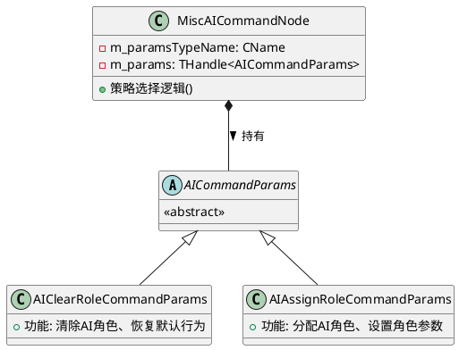
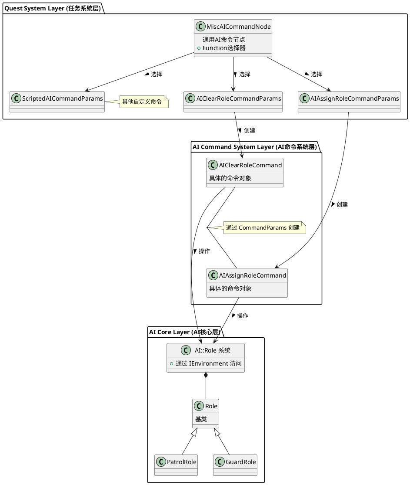
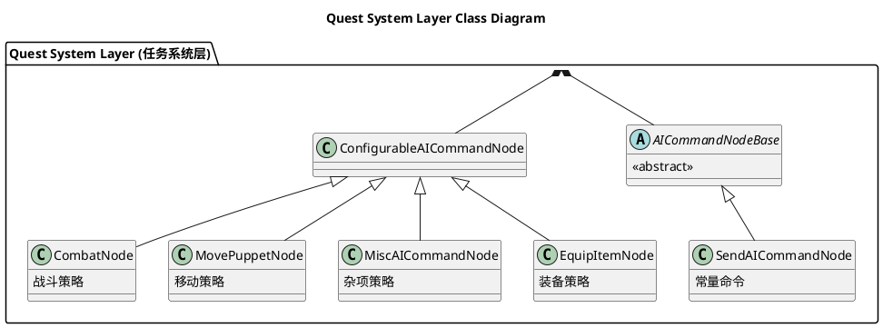
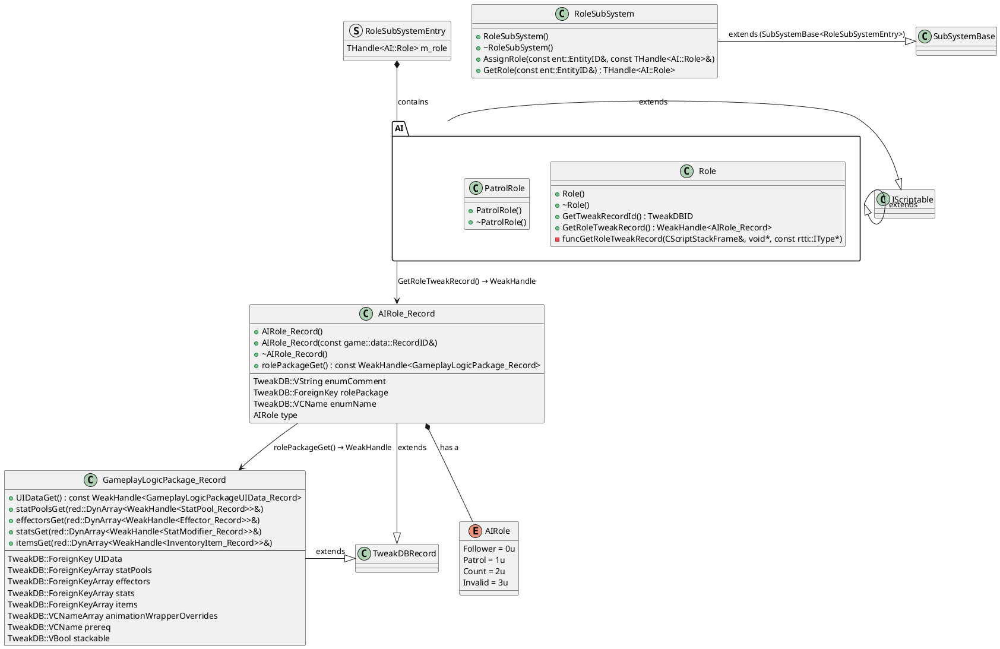
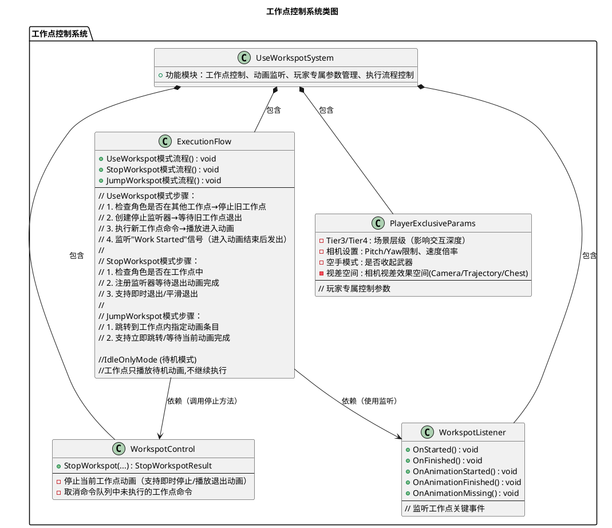
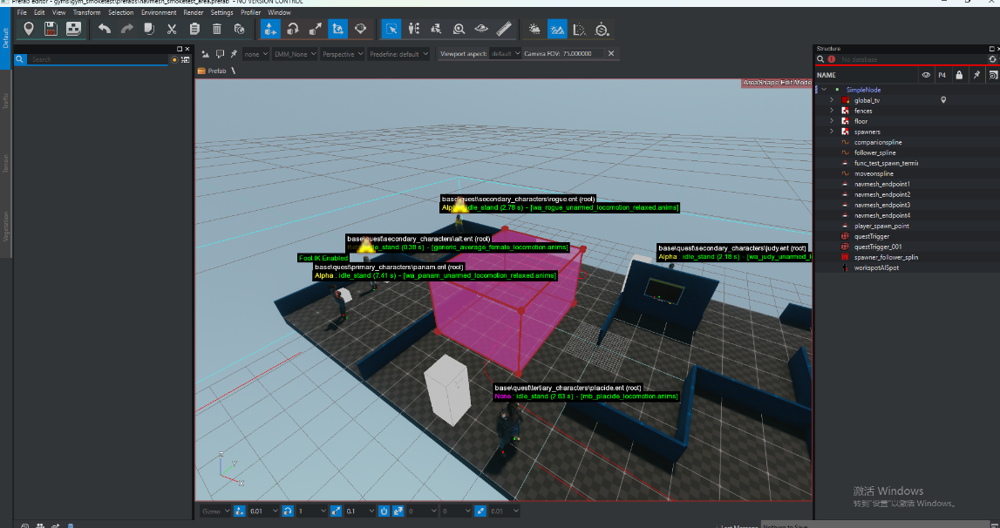
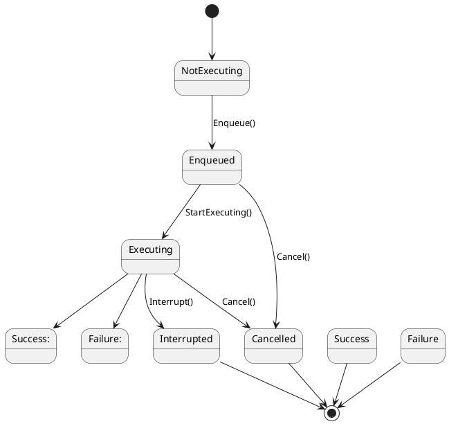

# 2077节点分析

GameSystem、UI

## AI节点： AI Combat|AI Role|AI Use Workspot

### 1.1 AI Combat Node
- FunctionType和Param类分离
  | 方面   | m_function    | m_params      |
  |------|---------------|---------------|
  | 用途   | 编辑器 UI 交互     | 运行时数据存储       |
  | 类型   | CName（轻量级标识符） | THandle（智能指针） |
  | 序列化  | 不序列化（临时）      | 完整序列化         |
  | 更新时机 | 编辑时改变         | 编辑/运行时改变      |
  | 数据源  | 从 Params 同步   | 主数据源          |
 分离的意义
  | 问题    | 分离设计的解决方案                | 合并设计的问题       |
  |-------|--------------------------|---------------|
  | 编辑器交互 | m_function（FunctionType） 提供人类可读的下拉框    | 需要手动维护显示名称映射表 |
  | 类型创建  | RTTI 动态创建，无需 switch-case | 需要大量条件分支      |
  | 数据一致性 | 自动同步机制保证一致               | 手动维护容易出错      |
  | 序列化   | 只序列化 Params，无冗余          | 类型信息重复存储      |
  | 扩展性   | 宏自动生成，只需一行代码             | 多处修改，容易遗漏     |
  | 内存占用  | m_function 只在编辑时存在       | 每个实例都存储类型     |

  FunctionType 和 Params 的对应关系：
  - 通过 RTTI 反射系统自动维护
  - 使用 params->GetClass()->GetName() 获取类型名
  - 使用 GetRttiSystem().FindType() 反向查找类型

  | 功能               | 位置             | 类型      | 用途            |
  |------------------|----------------|---------|---------------|
  | TakenDown        | puppetEvents.h | 事件系统    | 玩家对NPC的终结技/暗杀 |
  | SetCombatPreset  | 脚本/TweakDB     | 配置系统    | 动态切换AI战斗风格    |
  | BackgroundCombat | 推测：Encounter系统 | LOD系统   | 远距离战斗模拟（性能优化） |
  | CombatNode       | combatNode.h   | Quest节点 | 任务脚本化战斗指令     |

会有找不到的CombatNodeType；其相关配置在哪里；为什么不能放到一起
### 1.2 AI WorkSpot
- Workspot（工作点）：游戏中角色执行特定动作的位置（如坐下、操作机器等），通常关联动画和交互逻辑。
- 使用Scene中的WorkspotAISpot点其中指定一个WorkSpot资产引用
  
  
  
  可以根据WorkSpot资产调整AI动作姿势其中只有骨骼状态人物匹配错误依旧可以使用
~~~
~~~

### Immediate Node

  5️⃣ 与 CombatNode 的对比

  | 方面    | CombatNode                          | MiscAICommandNode          |
  |-------|-------------------------------------|----------------------------|
  | 用途    | 战斗相关命令                              | 杂项/立即执行命令                  |
  | 编辑器分类 | AINodeFunctions:Combat              | AINodeFunctions:Immediate  |
  | 默认功能  | ShootAt                             | ClearAIRole                |
  | 命令类型  | 持续性（战斗行为）                           | 瞬时性（状态改变）                  |
  | 参数宏   | RED_QUEST_COMBAT_NODE_FUNCTIONS_DEF | 无宏（扩展性更强）                  |
  | 脚本支持  | 否                                   | 是（ScriptedAICommandParams） |

- MiscAICommandNode 策略模式通过MiscAICommandNode为载体，使用策略模式实现具体功能
~~~C++
  miscAICommandNode.cpp:135：
  const CName c_clearAIRoleParamsTypeName = RED_NAME_CONSTEXPR("AIClearRoleCommandParams");

  MiscAICommandNode::MiscAICommandNode()
      : m_paramsTypeName(c_clearAIRoleParamsTypeName)  // 默认就是 ClearAIRole
  {
      UpdateParamsFromFunction(false);
  }

  questResave.cpp:245, 311：
  static const CName s_assignRoleCommand = RED_NAME_CONSTEXPR("AIAssignRoleCommand");
  static const CName s_assignRoleCommandParams = RED_NAME_CONSTEXPR("AIAssignRoleCommandParams");
~~~
- 类结构层次

AssignRoleCommandParam
来自于TweakDB配置方式
- AI::Role（角色基类）

  位置：common/ai/include/aiRole.h:15-39
~~~C++
  class AI_API Role : public IScriptable
  {
      RTTI_DECLARE_TYPE( Role );

  public:
      Role();
      virtual ~Role();

      // 获取TweakDB记录ID
      virtual TweakDBID GetTweakRecordId() const;

      // 获取角色的TweakDB记录
      WeakHandle<game::data::AIRole_Record> GetRoleTweakRecord() const;

  private:
      void funcGetRoleTweakRecord(CScriptStackFrame& stack, void* result, const rtti::IType* resultType);
  };
~~~
  核心特点：
  - 轻量级基类，实际配置在TweakDB中
  - 通过GetTweakRecordId()连接到TweakDB配置
  - 可被脚本扩展（IScriptable）

- TweakDB配置系统

  3.1 AIRole枚举
位置：common/gameTweakDB/include/records/tweakDBAIRole.h:39-64
  ~~~C++
class GAME_TWEAK_DB_API AIRole_Record : public TweakDBRecord
  {
      RTTI_DECLARE_TYPE( AIRole_Record );
      RECORD( "AIRole", AIRole_Record )

  public:
      AIRole_Record();
      explicit AIRole_Record( const game::data::RecordID& path );
      virtual ~AIRole_Record() override;

  public:
      TweakDB::VString enumComment;          // 角色描述
      TweakDB::ForeignKey rolePackage;       // 关联的逻辑包
      TweakDB::VCName enumName;              // 枚举名称
      AIRole type;                           // 角色类型

  public:
      // 获取关联的GameplayLogicPackage
      const WeakHandle<GameplayLogicPackage_Record> rolePackageGet() const;

  private:
      void funcEnumComment( CScriptStackFrame& stack, void* result, const rtti::IType* resultType );
      void funcRolePackage( CScriptStackFrame& stack, void* result, const rtti::IType* resultType );
      void funcEnumName( CScriptStackFrame& stack, void* result, const rtti::IType* resultType );
      void funcType( CScriptStackFrame& stack, void* result, const rtti::IType* resultType );
  };
 关键属性：
  - rolePackage - 指向GameplayLogicPackage_Record，定义角色的行为逻辑
  - type - 角色枚举类型
  - enumName - 角色名称（如"Follower"、"Patrol"）
  ~~~
  3.2 AIRole_Record（角色行为记录）
位置：common/gameTweakDB/include/records/tweakDBAIRole.h:39-64
~~~C++
  class GAME_TWEAK_DB_API AIRole_Record : public TweakDBRecord
  {
      RTTI_DECLARE_TYPE( AIRole_Record );
      RECORD( "AIRole", AIRole_Record )

  public:
      AIRole_Record();
      explicit AIRole_Record( const game::data::RecordID& path );
      virtual ~AIRole_Record() override;

  public:
      TweakDB::VString enumComment;          // 角色描述
      TweakDB::ForeignKey rolePackage;       // 关联的逻辑包
      TweakDB::VCName enumName;              // 枚举名称
      AIRole type;                           // 角色类型

  public:
      // 获取关联的GameplayLogicPackage
      const WeakHandle<GameplayLogicPackage_Record> rolePackageGet() const;

  private:
      void funcEnumComment( CScriptStackFrame& stack, void* result, const rtti::IType* resultType );
      void funcRolePackage( CScriptStackFrame& stack, void* result, const rtti::IType* resultType );
      void funcEnumName( CScriptStackFrame& stack, void* result, const rtti::IType* resultType );
      void funcType( CScriptStackFrame& stack, void* result, const rtti::IType* resultType );
  };
~~~

  3.3 GameplayLogicPackage_Record（逻辑包）
  位置：common/gameTweakDB/include/records/tweakDBGameplayLogicPackage.h:41-60
~~~C++

  class GAME_TWEAK_DB_API GameplayLogicPackage_Record : public TweakDBRecord
  {
      RTTI_DECLARE_TYPE( GameplayLogicPackage_Record );

  public:
      TweakDB::ForeignKey UIData;                    // UI数据
      TweakDB::ForeignKeyArray statPools;            // 属性池
      TweakDB::ForeignKeyArray effectors;            // 效果器
      TweakDB::ForeignKeyArray stats;                // 属性修改器
      TweakDB::ForeignKeyArray items;                // 物品列表
      TweakDB::VCNameArray animationWrapperOverrides;  // 动画覆盖
      TweakDB::VCName prereq;                        // 前置条件
      TweakDB::VBool stackable;                      // 是否可堆叠

  public:
      const WeakHandle<GameplayLogicPackageUIData_Record> UIDataGet() const;
      void statPoolsGet(red::DynArray<WeakHandle<StatPool_Record>>& outRecordList) const;
      void effectorsGet(red::DynArray<WeakHandle<Effector_Record>>& outRecordList) const;
      void statsGet(red::DynArray<WeakHandle<StatModifier_Record>>& outRecordList) const;
      void itemsGet(red::DynArray<WeakHandle<InventoryItem_Record>>& outRecordList) const;
  };

  逻辑包包含：
  - 属性修改器（stats）- 改变AI属性（准确度、速度等）
  - 效果器（effectors）- 触发特殊效果
  - 物品（items）- 装备特定物品
  - 动画覆盖（animationWrapperOverrides）- 改变动画集
  - 前置条件（prereq）- 角色激活条件

~~~

- 和任务系统分层关系

- 高频核心功能专用优化，低频杂项功能通用复用。

以下类图有待完善

## AI Combat node|AI Worksspot |AI Immedite Node
  | 特性   | UseWorkspotNode | MiscAICommandNode |
  |------|-----------------|-------------------|
  | 专注度  | 单一功能（工作点）       | 多功能容器             |
  | 性能   | 高（专用优化）         | 中等（反射开销）          |
  | 扩展性  | 低（需改C++）        | 高（脚本扩展）           |
  | 类型安全 | 编译时             | 运行时               |
  | 适用场景 | 核心频繁功能          | 杂项/实验功能           |
  | 开发成本 | 高（C++开发）        | 低（脚本开发）           |

  | 节点类型 | 命令示例                        | 架构层次                         |
  |------|-----------------------------|------------------------------|
  | 专用节点 | UseWorkspotNode(AI工作点)    | ConfigurableAICommandNode的平级 |
  | 专用节点 | MovePuppetNode （AI Move To）| ConfigurableAICommandNode的平级 |
  | 通用节点 | MiscAICommandNode（AI Immediate）| ConfigurableAICommandNode的子类 |
  | 命令参数 | → AIClearRoleCommandParams  | MiscAICommandNode的策略         |
  | 命令参数 | → AIAssignRoleCommandParams | MiscAICommandNode的策略         |
  | 命令参数 | → ScriptedAICommandParams   | MiscAICommandNode的策略         |

  

##  AI Use Workspot
- UseWorkspotNode实现了《赛博朋克2077》游戏中任务系统(Quest System)用于控制角色(NPC或玩家)使用工作点(Workspot)进行动画交互

- UseWorkspotNode 是一个任务节点,提供了4种工作点操作模式:

  1. UseWorkspot (使用工作点) - 让角色进入并使用工作点
  2. JumpWorkspot (跳转工作点) - 在工作点内跳转到指定动画条目
  3. StopWorkspot (停止工作点) - 让角色退出工作点
  4. IdleOnlyMode (待机模式) - 工作点只播放待机动画,不继续执行
- 

- 优势
1. 统一的动画交互抽象层
  优势: 将复杂的角色动画交互封装成简单的任务节点
  // 设计师只需要配置这些参数,不用关心底层动画系统
  m_workspotNode      // 指向哪个工作点
  m_teleport          // 走过去还是传送
  m_forceEntryAnimName // 强制使用哪个进入动画

    好处:
    - 任务设计师无需编程就能配置复杂交互
    - 降低了使用门槛,提高了生产效率
    - 动画系统改动不影响上层任务逻辑

2. 灵活的状态控制
  提供4种独立的操作模式,而不是把所有功能塞进一个接口:
    UseWorkspot      // 进入工作点
    JumpWorkspot     // 跳转到指定动画片段
    StopWorkspot     // 退出工作点
    IdleOnlyMode     // 暂停执行,只循环idle动画
  好处:
  - 任务流程可以精确控制动画播放
  - 支持动态打断和恢复(比如对话中途打断,结束后继续)
  - 可以组合出复杂的交互序列
3. 异步事件驱动
  ~~~C++
  red::CreateSharedPtr<StopWorkspotListenerWrapper>(
			executionContext, entId, m_params->m_teleport, m_params->m_finishAnimation, m_params->m_exitEntryId,
			TBaseClass::CreateEventListener( executionContext ), workspotParams.m_locId, workspotParams );
      
  class StopWorkspotListenerWrapper :public EventListenerWrapper
  {
      void OnAnimationFinished(...)  // 动画结束时回调
      void OnWorkspotFinished(...)   // 工作点完成时回调
      bool IsFulfilled()             // 检查是否完成
  }
  ~~~
    好处:
    - 非阻塞: 不会卡住游戏主线程等待动画播放完
    - 可中断: 角色在走向工作点途中可以被其他事件打断
    - 状态追踪: 任务系统知道当前动画播放到哪一步了
    - 节省性能: 不需要每帧轮询,事件发生时才处理
  4.  容错机制
  ~~~C++
  // useWorkspotNode.cpp:655-666
  void WorkspotListener::OnAnimationMissing(...)
  {
      // 动画资源丢失时,模拟动画开始和结束事件
      OnAnimationStarted(...);
      OnAnimationFinished(...);

      wrapper->OnMissingAnimation(puppetID, animationName);
  }
  ~~~
  好处:
    - 任务不会卡死: 即使动画文件丢失,任务仍能继续
    - 开发友好: 制作过程中资源经常变动,不会导致游戏崩溃
    - 便于调试: 记录错误但不阻塞流程

##  Trigger Condition

- Triggle引用
  

## AI 系统分析

### 系统分层
  | 层级名称               | 包含内容                                                                 |
|------------------------|--------------------------------------------------------------------------|
| TweakDB 配置层 (Data-Driven) | - AIAction Records - AICondition Records - AITarget Records       |
| 行为树层 (Behavior Tree Layer) | - Tree Nodes (决策、条件、动作) - Behavior Instance (实例管理) - Execution Context (执行上下文) |
| 命令队列层 (Command Queue Layer) | - Command System (命令系统) - Context Management (上下文管理) - Priority Handling (优先级处理) |
| 动作执行层 (Action Execution Layer) | - Movement Actions (移动) - Drive Actions (驾驶) - Combat Actions (战斗) - Animation Actions (动画) |

### 命令系统 (Command System)

### AI行为过程Workspot作为例子
~~~plantuml
@startuml
title Behavior Tree与Workspot交互流程

participant "Behavior Tree\nUseWorkspot Node" as BTNode
participant "Command Queue" as CmdQueue
participant "Workspot System" as WorkspotSys
participant "Animation System" as AnimSys
participant "Workspot Listener" as WorkspotListener
participant "Event Listener Wrapper" as EventWrapper

BTNode -> CmdQueue: 1. CreateCommand()
CmdQueue -> WorkspotSys: 2. Execute
WorkspotSys -> AnimSys: 3. PlayAnimation
AnimSys -> WorkspotListener: 4. OnAnimationFinished
WorkspotListener -> EventWrapper: 5. NotifyEvent
EventWrapper -> CmdQueue: 6. SetFulfilled()
CmdQueue -> BTNode: 7. Callback
BTNode -> BTNode: [回到行为树]

@enduml
~~~
### AI决策流程
~~~plantuml
@startuml
title AI决策链流程

start
:1. 行为树根节点 (Root Behavior Tree);
-> 2. 决策节点 (Decision Node);

fork
    :评估条件: "CanAttack" (TweakDB);
    :TweakActionSystem.EvaluateCondition();
    :HasWeapon条件;
    :CanSeeTarget条件;
    :IsInRange条件;
fork again
    :评估目标: "PrimaryTarget" (TweakDB);
    :TweakActionSystem.EvaluateTarget();
    :返回: game::Object* (玩家);
end fork

-> 3. 动作节点 (Action Node);
:创建命令: AttackCommand;

-> 4. 命令队列 (Command Queue);
fork
    :Enqueue(AttackCommand);
fork again
    :StartExecuting(AttackCommand, contextMask);
end fork

-> 5. 动作执行 (Action Execution);
fork
    :MoveToPosition (移动到射击位置);
fork again
    :RotateTo (转向目标);
fork again
    :PlayAnimation (播放射击动画);
fork again
    :SpawnProjectile (生成子弹);
end fork

stop
@enduml

~~~

### 行为树系统
~~~plantuml
@startuml
[*] --> Inactive

Inactive --> Activated: OnActivate()

Activated --> Running: OnUpdate()
Activated --> Interrupted: OnInterrupt()

Running --> Completed: STATUS_SUCCESS/STATUS_FAILURE
Running --> Interrupted: OnInterrupt()

Interrupted --> Completed: 

Completed --> Deactivated: OnDeactivate()

Deactivated --> [*]

state Inactive
state Activated
state Running
state Interrupted
state Completeds
state Deactivated
@enduml
~~~

### AI Manager 中的gameplay和Cinematic
AI Manager设置为Cinmatic后其他AICommandNode对AI控制无效
核心原因：场景系统对AI的独占控制

  位置：common/gameAI/include/aiActionInterface.h:108-151
~~~C++
  class SetupControlledByStoryEvent : public AI::AIEvent
  {
      const static CName AI_EVENT_NAME;  // "OnControlledByStory"

      void RequestPushSceneDefaultTier();  // 推入Cinematic模式
      void RequestPopSceneDefaultTier();   // 弹出Cinematic模式

      void RequestSetupAction(ActionSetupRequest setupReq);  // 设置动作
      void RequestStopAction();                               // 停止动作

  private:
      static constexpr StoryTier c_sceneDefaultTier = StoryTier::Cinematic;
      // 场景默认Tier = Cinematic
  };

~~~
  关键发现：
  - 场景系统通过发送SetupControlledByStoryEvent事件接管AI控制
  - 事件名称明确表示："被故事（场景）控制"
  - 场景默认Tier强制为Cinematic

```plantuml
@startuml
digraph G {
    rankdir=TB;
    node [shape=box, style=filled, fillcolor=lightblue];
    
    root [label="根节点 (Brain/Selector)"];
    
    // Story分支
    story_cond [label="[Condition: IsInStoryTier(Cinematic)]", shape=diamond, fillcolor=lightgreen];
    story_branch [label="Story分支"];
    
    setup_cond [label="[Condition: IsStoryActionType(Setup)]", shape=diamond, fillcolor=lightgreen];
    setup_action [label="ExecuteSceneAnimationAction"];
    
    stop_cond [label="[Condition: IsStoryActionType(Stop)]", shape=diamond, fillcolor=lightgreen];
    stop_action [label="StopCurrentAction"];
    
    default_story [label="[Default]", shape=diamond, fillcolor=lightgreen];
    idle_cinematic [label="IdleInCinematicMode"];
    
    // Gameplay分支
    gameplay_cond [label="[Condition: IsInStoryTier(Gameplay)]", shape=diamond, fillcolor=lightgreen];
    gameplay_branch [label="Gameplay分支"];
    
    process_ai [label="ProcessAICommands → 处理AICommand队列"];
    combat_cmds [label="CombatCommands"];
    movement_cmds [label="MovementCommands"];
    workspot_cmds [label="WorkspotCommands"];
    other_cmds [label="..."];
    
    combat_ai [label="Combat AI"];
    patrol_ai [label="Patrol AI"];
    other_ai [label="..."];
    
    // 根节点到分支条件
    root -> story_cond;
    root -> gameplay_cond;
    
    // Story分支结构
    story_cond -> story_branch;
    story_branch -> setup_cond;
    story_branch -> stop_cond;
    story_branch -> default_story;
    
    setup_cond -> setup_action;
    stop_cond -> stop_action;
    default_story -> idle_cinematic;
    
    // Gameplay分支结构
    gameplay_cond -> gameplay_branch;
    gameplay_branch -> process_ai;
    gameplay_branch -> combat_ai;
    gameplay_branch -> patrol_ai;
    gameplay_branch -> other_ai;
    
    // ProcessAICommands子节点
    process_ai -> combat_cmds;
    process_ai -> movement_cmds;
    process_ai -> workspot_cmds;
    process_ai -> other_cmds;
}
@enduml
```

 为什么AICommand被阻塞

  机制1：行为树分支互斥

  当前状态: StoryTier = Cinematic
      ↓
  行为树评估: IsInStoryTier(Cinematic) = TRUE
      ↓
  激活分支: Story分支（场景控制）
      ↓
  结果: 不会评估Gameplay分支
      ↓
  后果: ProcessAICommands节点永远不会被激活
      ↓
  最终: AICommand队列虽然可以Enqueue，但永远不会Execute

  机制2：Scene系统独占动作槽
 位置：common/gameAI/src/aiActionInterface.cpp:155-200
~~~C++
  Bool ActionRequester::SetupAction(THandle<game::Object> gameObject,
                                     const rtti::Variant &params)
  {
      // 对于有AI的NPC，发送请求到AI
      if (auto puppet = Cast<game::Puppet>(gameObject))
      {
          if (AI::CAgent *agent = puppet->GetAI())
          {
              // 创建场景控制事件
              auto event = CreateHandle<game::SetupControlledByStoryEvent>();
              event->SetName(game::SetupControlledByStoryEvent::AI_EVENT_NAME);

              // 封装动作请求
              game::ActionSetupRequest request;
              request.m_params = params;
              request.m_actionInterface = &m_actionInterface;
              event->RequestSetupAction(request);

              // 发送到行为树
              if (agent->SendBehaviorEvent(event))
              {
                  return true;
              }
          }
      }

      // 对于无AI的对象，直接设置动作
      if (m_actionInterface.SetupAction(m_actionProxy, params))
      {
          m_actionProxy.QueueAction();
          return true;
      }

      return false;
  }
~~~

- 关键点：
  1. 互斥分支：IsInStoryTier(Cinematic)和IsInStoryTier(Gameplay)是互斥条件
  2. 分支优先级：Story分支通常优先级更高（在树中位置靠前）
  3. 命令阻塞：Cinematic分支不包含处理AICommand队列的逻辑
- 场景动作流程：
  1. 场景系统通过ActionRequester请求动作
  2. 发送SetupControlledByStoryEvent到AI
  3. 行为树中的Story分支接收事件
  4. 独占NPC的Action系统，执行场景动画
  5. 在动作执行期间，其他动作请求被阻塞
  

  我现在遇到的问题 
  Combat Node中的Use Cover需要一个Cover的引用，但是在Scene中如何对它进行初始化  我不明白 Scene如何快速找到Phase中的相关的引用Object（查询失效）
  WeakDB 中含有 