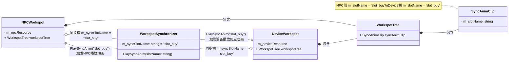

# Quest系统使用Entity中Workspot实现同步动画的完整指南

## 一、概述

在2077中，有多种方式可以使用`.ent`文件中的`WorkspotResourceComponent`来播放Workspot动画。本文档详细介绍这些方法及其实现机制。

---

## 二、方式一：Patrol系统（通过AssignAiRole + PatrolPath）

### 2.1 Quest配置流程

```
┌─────────────────────────────────────────────────────────────────────────────┐
│                         Quest Graph 配置                                     │
├─────────────────────────────────────────────────────────────────────────────┤
│                                                                             │
│  ┌────────────────────┐      ┌────────────────────────────────────┐         │
│  │ AssignAiRole Node  │─────▶│ PatrolPathParameters               │         │
│  │ (QuestNode)        │      │   m_path = "patrol_spline_ref"     │         │
│  │                    │      │   m_enterClosest = true/false      │         │
│  └────────────────────┘      │   m_movementType = Walk            │         │
│                              └────────────────────────────────────┘         │
│                                                                             │
│                                      │                                      │
│                                      ▼                                      │
│  ┌─────────────────────────────────────────────────────────────────────┐    │
│  │                     World 配置                                       │    │
│  ├─────────────────────────────────────────────────────────────────────┤    │
│  │                                                                     │    │
│  │   PatrolSplineNode (巡逻路径Spline)                                  │    │
│  │       │                                                             │    │
│  │       └── patrolPoints[]                                            │    │
│  │             │                                                       │    │
│  │             ├── [0] PatrolSplinePointDefinition                     │    │
│  │             │         m_pointType = Workspot                        │    │
│  │             │         m_node = "vending_machine.ent"  ← Entity引用  │    │
│  │             │                                                       │    │
│  │             └── [1] PatrolSplinePointDefinition                     │    │
│  │                       m_pointType = LookAt                          │    │
│  │                       m_target = "look_target"                      │    │
│  │                                                                     │    │
│  └─────────────────────────────────────────────────────────────────────┘    │
│                                                                             │
│                                      │                                      │
│                                      ▼                                      │
│  ┌─────────────────────────────────────────────────────────────────────┐    │
│  │                     Entity (.ent) 配置                               │    │
│  ├─────────────────────────────────────────────────────────────────────┤    │
│  │                                                                     │    │
│  │   vending_machine.ent                                               │    │
│  │       │                                                             │    │
│  │       └── Components                                                │    │
│  │             │                                                       │    │
│  │             └── WorkspotResourceComponent                           │    │
│  │                   name = "default"  ← ⚠️ 必须是"default"            │    │
│  │                   m_npcResource = npc_use_vending.workspot          │    │
│  │                   m_deviceResource = vending_reaction.workspot      │    │
│  │                   m_syncSlotName = "slot_buy"                       │    │
│  │                                                                     │    │
│  └─────────────────────────────────────────────────────────────────────┘    │
│                                                                             │
└─────────────────────────────────────────────────────────────────────────────┘
```

### 2.2 运行时数据流

```
┌────────────────────────────────────────────────────────────────────────────────┐
│                            运行时数据流                                         │
└────────────────────────────────────────────────────────────────────────────────┘

Quest Node: AssignAiRole
        │
        │ 创建 PatrolCommand
        ▼
AI System: PatrolCommand 执行
        │
        │ 初始化 PatrolSplineProgress
        ▼
PatrolSplineProgress::Initialize()
        │
        │ 遍历 patrolPoints
        │ 调用 GetWorkspotData() → ExtractWorkspotParameters()
        ▼
┌─────────────────────────────────────────────────────────────────────────────┐
│  ExtractWorkspotParameters( EntityNodeInstance )                            │
│                                                                             │
│  1. 查找名为"default"的WorkspotResourceComponent                            │
│  2. 提取:                                                                   │
│       m_mainWorkspotParams   ← m_npcResource (NPC动画)                      │
│       m_syncedWorkspotParams ← m_deviceResource (设备动画)                  │
│       m_dependentEntity      ← Entity本身                                   │
│       m_syncSlotName         ← 同步槽名称                                   │
└─────────────────────────────────────────────────────────────────────────────┘
        │
        ▼
ActionPatrol 运行
        │
        │ NPC到达巡逻点
        ▼
ProcessControlPoint()
        │
        ├─────────────────────────────────────────────────────────┐
        │                                                         │
        ▼                                                         ▼
SetupWorkspotActionEvent                              DependentWorkspotData
(NPC的Workspot参数)                                   (设备的Workspot参数)
        │                                                         │
        │                                                         │
        └───────────────────┬─────────────────────────────────────┘
                            │
                            ▼
                   行为树: ActionUseWorkspot
                            │
                            ├── Setup( SetupWorkspotActionEvent )
                            │
                            └── SetDependentWorkspot( DependentWorkspotData )
                                        │
                                        ▼
                            WorkspotInstanceWrapper
                                        │
                                        ├── NPC开始播放Workspot动画
                                        │
                                        └── PlayDependentWorkspot()
                                                    │
                                                    ▼
                                            设备Entity播放同步动画
```

### 2.3 关键代码

**行为树节点定义：**
```cpp
// aiPatrolActionNode.cpp
PatrolActionNodeDefinition::PatrolActionNodeDefinition()
    : m_workspotData( CreateHandle< ArgumentMapping >( ArgumentType::Serializable,
          RED_NAME_CONSTEXPR( "gameSetupWorkspotActionEvent" ) ) )
    , m_dependentWorkspotData( CreateHandle< ArgumentMapping >( ArgumentType::Serializable,
          RED_NAME_CONSTEXPR( "gameDependentWorkspotData" ) ) )  // ⚠️ 输出同步数据
{
}
```

**同步动画播放：**
```cpp
// workspot.cpp:721-747
void WorkspotInstanceWrapper::PlayDependentWorkspot()
{
    if ( m_dependentWorkspotData && m_dependentWorkspotData->m_workspotParams.IsValid() )
    {
        if ( THandle< ent::Entity > dependentEntity = m_dependentWorkspotData->m_entity.ToHandle() )
        {
            auto* workspotSystem = m_owner->GetSceneSystem< work::WorkspotSystem >();
            const ent::EntityID entityId = dependentEntity->GetEntityID();

            // 停止设备当前的Workspot（如果有）
            if ( workspotSystem->IsActorInWorkspot( entityId ) )
            {
                workspotSystem->SendCommand( entityId, work::CMD_Stop );
            }

            // 设置同步信息，建立Master-Slave关系
            work::SyncedWorkspotInfo syncInfo = { &m_owner->GetEntityID() };

            // ⚠️ 关键：让设备Entity播放m_deviceResource中的Workspot
            workspotSystem->SetupWorkspot(
                dependentEntity,
                { m_dependentWorkspotData->m_workspotParams, ... },
                &syncInfo  // 同步信息
            );
            workspotSystem->SendCommand( entityId, work::CMD_Play );

            // 注册清理回调
            cleanup->m_functor = [workspotSystem, entityId]()
            {
                workspotSystem->SendCommand( entityId, work::CMD_Stop | work::CMD_Clear );
            };
            workspotSystem->SendCommand( entityId, work::CMD_RegisterCleanup, ... );
        }
    }
}
```

---

## 三、方式二：脚本直接调用 PlayInDevice

### 3.1 脚本接口

```swift
// Redscript / WolvenKit 脚本

// 简单版本
WorkspotGameSystem.PlayInDeviceSimple(
    device,              // 设备Entity
    actor,               // NPC Entity
    allowCamera,         // 是否允许相机
    actorDataCompName,   // NPC的WorkspotResourceComponent名称
    deviceDataCompName,  // 设备的WorkspotResourceComponent名称（可选）
    syncSlotName,        // 同步槽名称
    slideTime,           // 滑动时间
    slidingBehaviour     // 滑动行为
);

// 完整版本
WorkspotGameSystem.PlayInDevice(
    device,              // 设备Entity
    actor,               // NPC Entity
    workspotStateFlavour,// Workspot状态风味
    actorDataCompName,   // NPC的WorkspotResourceComponent名称
    deviceDataCompName,  // 设备的WorkspotResourceComponent名称
    syncSlotName,        // 同步槽名称
    slideTime,           // 滑动时间
    slidingBehaviour     // 滑动行为
);
```

### 3.2 C++实现

```cpp
// gameWorkspotsSystem.cpp:1142-1220
Bool WorkspotGameSystem::PlayInDevice(
    THandle<game::Object> device,
    THandle<game::Object> actor,
    const stateMachine::FlavourId& workspotStateFlavour,
    const CName actorDataCompName,      // 默认会查找"default"
    const CName deviceDataCompName,
    const CName syncSlotName,
    const Float slideTime,
    const WorkspotSlidingBehaviour slidingBehaviour )
{
    THandle< game::Puppet > entActor = Cast< game::Puppet >( actor );
    THandle< ent::GameEntity > entDevice = Cast< ent::GameEntity >( device );

    // ⚠️ 从设备Entity的WorkspotResourceComponent提取NPC的Workspot
    WorldTransform actorWsPos;
    work::WorkspotParams actorWs = helper::ExtractWorkspot<work::WorkspotResourceComponent>(
        entDevice, actorDataCompName, actorWsPos );

    if ( !actorWs.IsValid() )
    {
        RED_LOG( "Interactive device does not have workspot resource inside" );
        return false;
    }

    // ⚠️ 提取设备的Workspot（如果指定了）
    WorldTransform deviceWsPos;
    work::WorkspotParams deviceWs;
    if ( deviceDataCompName )
    {
        deviceWs = helper::ExtractWorkspot<work::WorkspotResourceComponent>(
            entDevice, deviceDataCompName, deviceWsPos );
    }

    // ... 设置Workspot并播放
}
```

### 3.3 使用场景

```swift
// 示例：NPC使用自动售货机
public func UseVendingMachine(npc: ref<NPCPuppet>, vendingMachine: ref<GameObject>) {
    let workspotSystem = GameInstance.GetWorkspotSystem(npc.GetGame());

    workspotSystem.PlayInDevice(
        vendingMachine,           // 设备
        npc,                      // NPC
        n"buying",                // 状态风味
        n"default",               // NPC Workspot组件名（在vendingMachine.ent中）
        n"device_reaction",       // 设备Workspot组件名（可选）
        n"slot_buy",              // 同步槽
        0.5,                      // 滑动时间
        WorkspotSlidingBehaviour.DontPlayAtResourcePosition
    );
}
```

---

## 四、方式三：PlayNpcInWorkspot（脚本直接指定Workspot位置）

### 4.1 脚本接口

```swift
// 让NPC在指定的参考Entity位置播放Workspot
WorkspotGameSystem.PlayNpcInWorkspot(
    actor,                      // NPC Entity
    referenceEntity,            // 参考Entity（包含WorkspotResourceComponent）
    syncOffsetSourceComponentName,  // 同步偏移源组件名（可选）
    syncSlotName,               // 同步槽名称
    actorDataCompName           // NPC数据组件名
);
```

### 4.2 C++实现

```cpp
// gameWorkspotsSystem.cpp:380-418
void WorkspotGameSystem::PlayNpcInWorkspot(
    THandle<game::Object> actor,
    THandle<ent::Entity> referenceEntity,
    CName syncOffsetSourceComponentName,
    CName syncSlotName,
    CName actorDataCompName )
{
    // 从参考Entity提取Workspot
    WorldTransform actorWsPos;
    work::WorkspotParams workspot = helper::ExtractWorkspot<work::WorkspotResourceComponent>(
        referenceEntity, actorDataCompName, actorWsPos );

    if( !workspot.IsValid() )
    {
        RED_LOG( "Reference entity does not have workspot resource inside" );
        return;
    }

    // 处理同步偏移
    Transform workspotTransformLS;
    Bool syncWorkspotTransformFound = false;

    if ( syncOffsetSourceComponentName )
    {
        WorldTransform syncOffsetSourceWsPos;
        work::WorkspotParams syncOffsetSourceWs = helper::ExtractWorkspot<work::WorkspotResourceComponent>(
            referenceEntity, syncOffsetSourceComponentName, syncOffsetSourceWsPos );

        if( syncOffsetSourceWs.IsValid() )
        {
            syncWorkspotTransformFound = syncOffsetSourceWs.GetSyncWorkspotTransform(
                syncSlotName, workspotTransformLS );
        }
    }

    // ... 设置并播放Workspot
}
```

---

## 五、方式四：Scene系统（UseSceneWorkspot）

### 5.1 概述

Scene系统中的UseWorkspot可以使用场景内定义的Workspot实例，这些实例可以来自Entity的WorkspotResourceComponent。

### 5.2 Scene配置

```
Scene Resource (.scene)
    │
    └── WorkspotInstances[]
          │
          └── WorkspotInstance
                m_workspotInstanceId = 1
                m_actorId = "npc_vendor"
                m_workspotNode = NodeRef → Entity
                    └── 从Entity的WorkspotResourceComponent获取资源
```

### 5.3 代码流程

```cpp
// scnsUseSceneWorkspotParams.cpp
// Scene系统最终也会调用workspot相关的接口来播放动画
```

---

## 六、方式五：Traffic系统（MoveAlongTrafficPath）

### 6.1 概述

Traffic系统中的NPC在沿交通路径移动时，可以在TrafficSpot点位使用Entity中的Workspot。

### 6.2 数据流

```
TrafficSpline
    │
    └── TrafficSpots[]
          │
          └── TrafficSpotDefinition
                m_node = NodeRef → Entity 或 AISpot
                    │
                    └── ExtractWorkspotParameters()
                            │
                            └── 提取Entity的WorkspotResourceComponent资源
```

### 6.3 关键函数

```cpp
// trafficWorkspotUtils.cpp:171-196
THandle< TrafficWorkspotTransitionData > PrepareWorkspotTransitionData(
    const work::WorkspotParams& spotParams,
    const AI::ActionSpotInstance& spotInstance,
    const WorldTransform& spotWorldTransform,
    const Vector3& returnWorldPos,
    const ent::Entity& entity )
{
    // 计算最佳Exit点
    FindBestWorkspotExitPoint( spotParams, spotWorldTransform, entity, returnWorldPos, ... );

    // 创建Workspot过渡数据
    THandle< SetupWorkspotActionEvent > workspotData = CreateHandle< SetupWorkspotActionEvent >();
    workspotData->m_parameters.m_workspot = spotParams;
    workspotData->m_parameters.m_workspotTransform = spotWorldTransform;
    // ...

    return transitionData;
}
```

---

## 七、所有方式对比

| 方式 | 触发来源 | 支持Entity | 支持同步 | 使用场景 |
|------|---------|-----------|---------|---------|
| **Patrol系统** | Quest AssignAiRole | ✅ | ✅ 自动 | NPC巡逻时在特定点使用设备 |
| **PlayInDevice** | 脚本调用 | ✅ | ✅ 手动指定 | 脚本控制NPC使用设备 |
| **PlayNpcInWorkspot** | 脚本调用 | ✅ | ✅ 可选 | 让NPC在指定位置播放Workspot |
| **Scene UseWorkspot** | Scene系统 | ✅ | ✅ | 过场动画/场景中的Workspot |
| **Traffic系统** | Traffic Path | ✅ | ❌ | NPC在交通路径上使用Workspot |

---

## 八、Entity配置要求总结

### 8.1 必须条件

```cpp
Entity (.ent)
    └── Components
          └── WorkspotResourceComponent
                name = "default"  // ⚠️ 必须命名为"default"才能被Patrol系统自动发现
                                  // 其他系统可以通过参数指定其他名称
```

### 8.2 资源配置

```cpp
WorkspotResourceComponent:
    m_resource       // Player使用（历史遗留命名）
    m_npcResource    // NPC使用（Patrol、PlayInDevice等读取）
    m_deviceResource // 设备同步动画（可选，用于设备本身的反应动画）
    m_syncSlotName   // 同步槽名称（对应WorkspotTree中SyncAnimClip的slotName）
```

### 8.3 同步机制



---

## 九、Quest中实现Patrol使用Entity Workspot的完整步骤

### 步骤1：创建Entity资产

```
my_device.ent
    └── Components
          ├── MeshComponent (设备模型)
          └── WorkspotResourceComponent
                name = "default"
                m_npcResource = npc_use_device.workspot
                m_deviceResource = device_reaction.workspot  // 可选
                m_syncSlotName = "sync_slot"                 // 可选
```

### 步骤2：创建巡逻路径

```
patrol_path_spline (PatrolSplineNode)
    └── patrolPoints[]
          ├── [0] m_pointType = Workspot
          │       m_node = NodeRef("my_device.ent")  // 指向Entity
          │
          └── [1] m_pointType = Workspot
                  m_node = NodeRef("another_spot")
```

### 步骤3：Quest Graph配置

```
[Start] → [AssignAiRole] → [等待/其他逻辑]
              │
              └── PatrolPathParameters
                    m_path = "patrol_path_spline"
                    m_enterClosest = true
                    m_movementType = Walk
```

### 步骤4：行为树配置（自动处理）

AI系统会自动：
1. 解析PatrolSplineProgress
2. 通过ExtractWorkspotParameters从Entity提取Workspot
3. 在ActionPatrol到达点位时创建SetupWorkspotActionEvent和DependentWorkspotData
4. 行为树的ActionUseWorkspot节点消费这些数据
5. 自动调用PlayDependentWorkspot()让设备播放同步动画

---

## 十、调试技巧

### 10.1 检查WorkspotResourceComponent

确保Component名称为`"default"`，否则Patrol系统无法自动发现。

### 10.2 检查同步槽配置

确保`m_syncSlotName`与WorkspotTree中的`SyncAnimClip.m_slotName`匹配。

### 10.3 日志关键字

```cpp
RED_LOG( "Reference entity does not have workspot resource inside" );
RED_LOG( "Interactive device does not have workspot resource inside" );
```

如果看到这些日志，说明WorkspotResourceComponent配置有问题。
