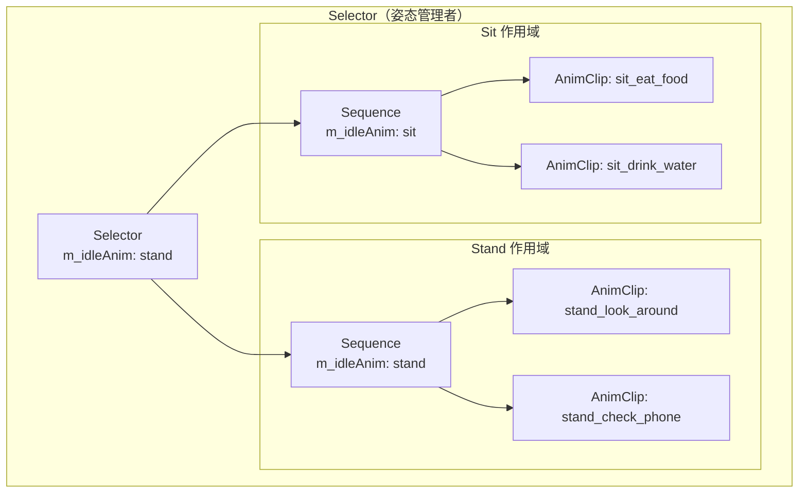
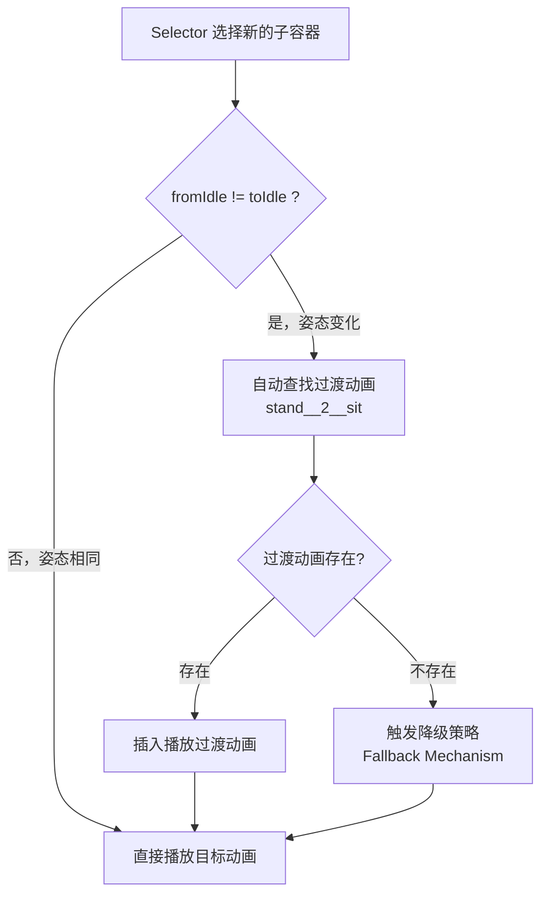
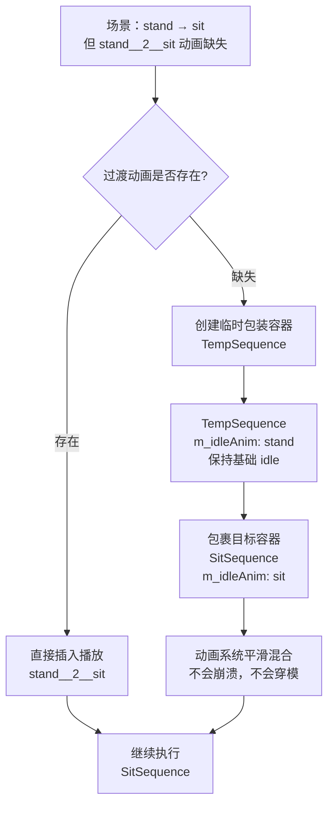
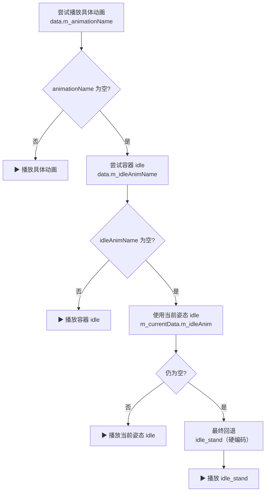
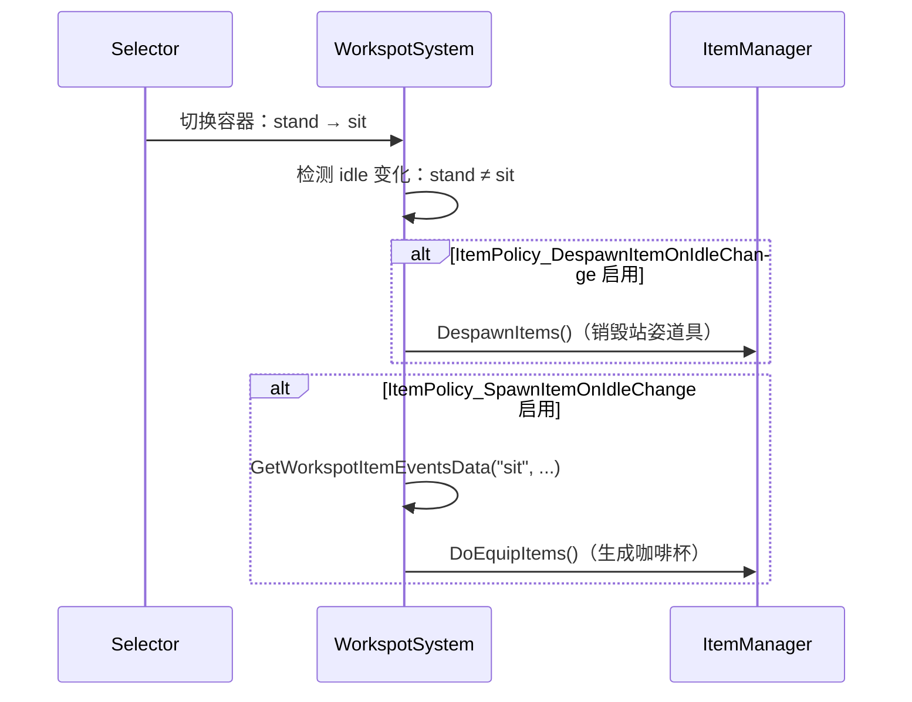
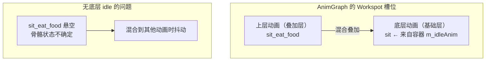
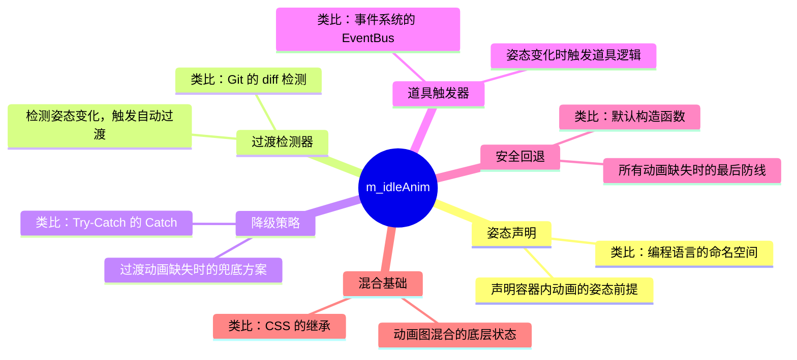
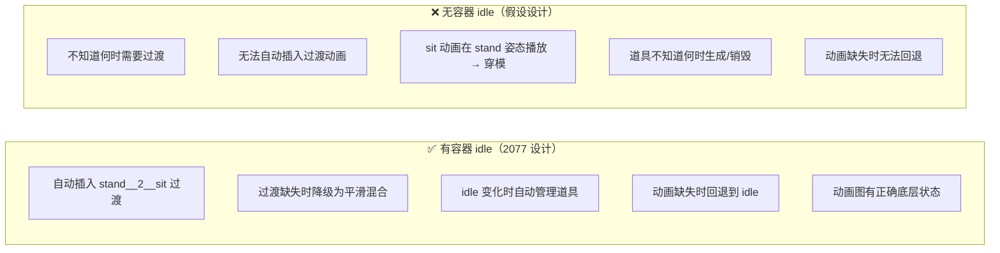
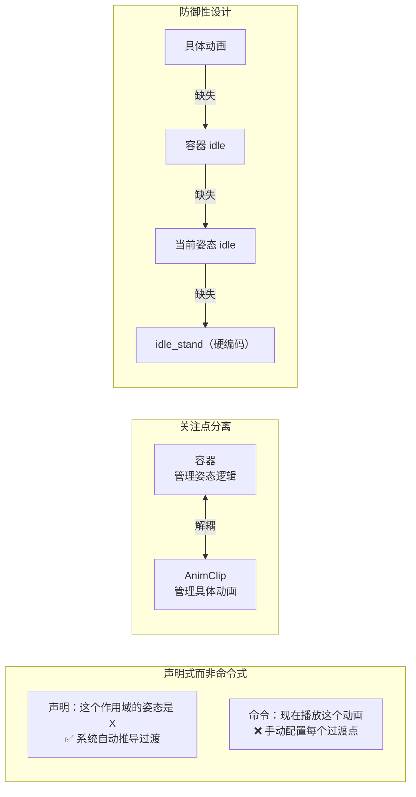

# 容器 m_idleAnim 的设计原理：不是"动画"，而是"姿态上下文声明"

---

## 一、姿态作用域（Posture Scope）

容器的 `m_idleAnim` 定义了一个**姿态作用域**，声明"这个容器内的所有动画都应该在这个姿态下播放"，类似于编程语言中的命名空间。



```cpp
// SelectorIterator 继承父容器的姿态
// workspotTreeItems.cpp:1040-1041
SelectorIterator( const Selector* clip, ... ) {
    m_idleSequence = CreateHandle<Sequence>( ... );
    m_idleSequence->m_idleAnim = clip->m_idleAnim;  // ← 继承父容器的姿态
}
```

---

## 二、自动姿态过渡检测

Selector 切换子容器时，自动对比 `fromIdle` 与 `toIdle`，若不同则查找并插入过渡动画。



```cpp
// workspotTreeItems.cpp:1049-1056
CName fromIdle = context.m_currentIdleAnim;       // 当前姿态
CName toIdle   = nextContainer->m_idleAnim;        // 目标容器的姿态

if ( fromIdle && toIdle && fromIdle != toIdle ) {
    // 姿态变化了！自动查找过渡动画
    DetermineTransitionAnim( context.m_customTransitionAnims,
                             fromIdle, toIdle, transitionAnim );
}
```

---

## 三、降级策略（Fallback Mechanism）

这是 Selector 独有的关键创新——过渡动画缺失时，不崩溃，而是创建临时包装容器保持基础 idle，让动画系统平滑混合。



```cpp
// workspotTreeItems.cpp:1058-1066
Bool changeToBaseIdle = !transitionAnim || !context.m_animExistFunctor( transitionAnim );

if ( changeToBaseIdle ) {
    // 过渡动画缺失：创建临时 Sequence，保持基础 idle
    m_idleSequence->m_list.Clear();
    m_idleSequence->m_list.PushBack( nextEl );  // 包装目标容器
    nextEl = m_idleSequence;                    // 返回包装后的容器
}
```

> **为什么必须有容器的 `m_idleAnim`**：必须知道"基础姿态"是什么（`clip->m_idleAnim`），才能创建保持该姿态的临时容器。

---

## 四、动画播放的安全回退



```cpp
// gameWorkspotsInstance.cpp:1257-1259
Bool useIdleAnim = ( !data.m_animationName && data.m_idleAnimName ) || isIdleOnly;

CName animToUse = useIdleAnim
    ? ( data.m_idleAnimName ? data.m_idleAnimName : m_currentData.m_idleAnim )
    : data.m_animationName;
```

**实际案例**：当 `sit_eat_food` 和 `sit_drink_water` 均缺失时，系统回退到容器的 `m_idleAnim: "sit"`，NPC 保持坐姿 idle，不会崩溃。

---

## 五、道具管理的触发器

`m_idleAnim` 变化时自动触发道具的生成与销毁——道具绑定"姿态"而非"具体动画"。



```cpp
// gameWorkspotsInstance.cpp:1350-1360
if( data.m_idleAnimName && recentIdleAnim != data.m_idleAnimName ) {
    if( recentIdleAnim &&
        m_workResource->IsItemPolicyEnabled( ItemPolicy_DespawnItemOnIdleChange ) ) {
        DespawnItems( context );  // 销毁旧姿态的道具
    }
    if( m_workResource->IsItemPolicyEnabled( ItemPolicy_SpawnItemOnIdleChange ) ) {
        GetWorkspotItemEventsData( data.m_idleAnimName, itemData, .1f );
        DoEquipItems( context.m_workspotSystem, spawnItemActions );  // 生成新道具
    }
}
```

---

## 六、动画混合的基础状态



```cpp
// gameWorkspotsInstance.cpp:1794-1807
if ( m_currentData.m_idleAnim ) {
    m_currentData.m_animName     = m_currentData.m_idleAnim;
    m_currentData.m_animDuration = GetAnimationDuration( m_currentData.m_idleAnim );
}

if ( m_currentData.m_animDuration <= 0.0f ) {
    // 最终回退：idle_stand
    static const CName s_idle_anim_fallback =
        RED_NAME_CONSTEXPR_NOREG("idle_stand");
    m_currentData.m_animName = s_idle_anim_fallback;
}
```

---

## 七、设计哲学总结

### 容器 m_idleAnim 的六重身份



### 有 vs 没有容器 idle 的对比



---

## 八、关键设计洞察

> `m_idleAnim` 不是"要播放的动画"，而是系统级**元数据**。



这个设计体现了 CDPR 在大规模动画管理上的三大原则：**声明式编程**、**自动推导**、**防御性设计**——容器的 `m_idleAnim` 是 Workspot 系统最精妙的设计之一。
