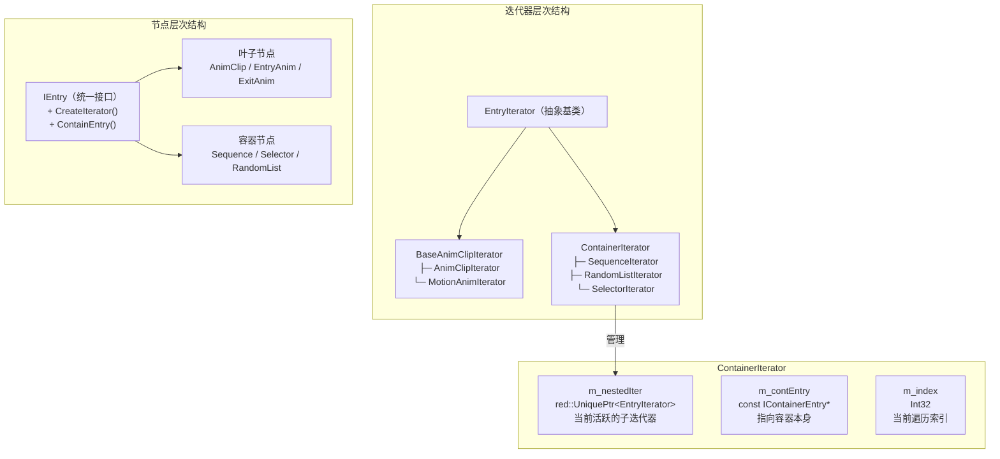
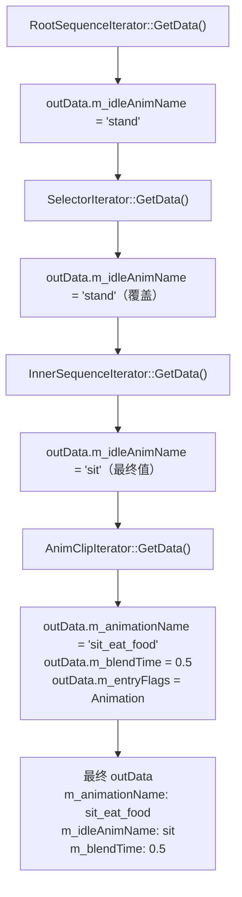
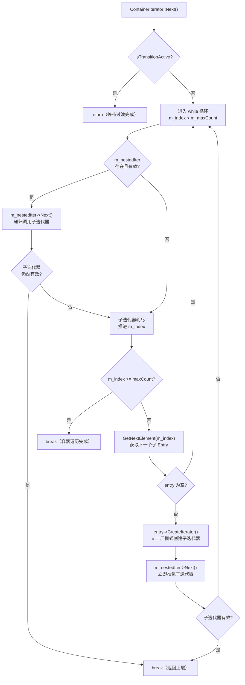
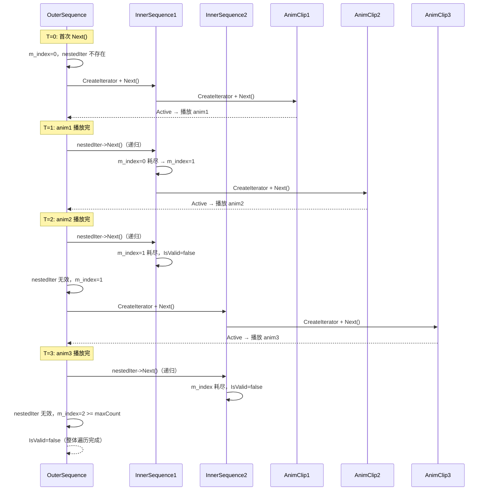
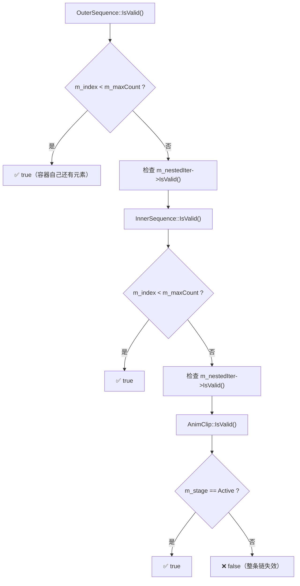
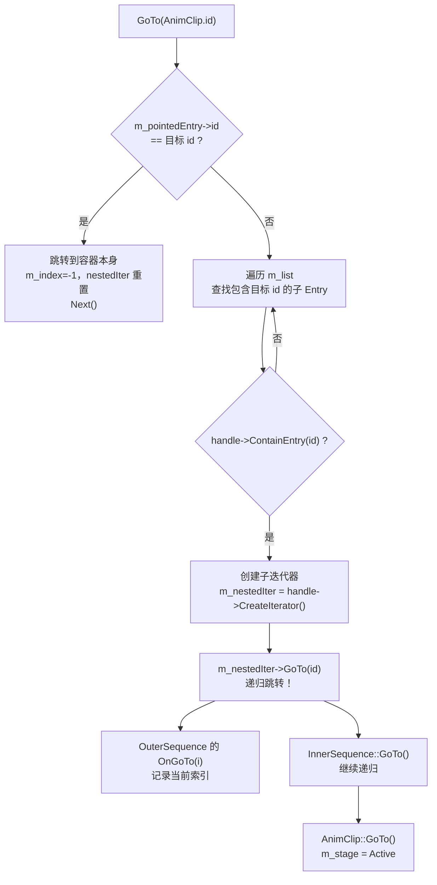
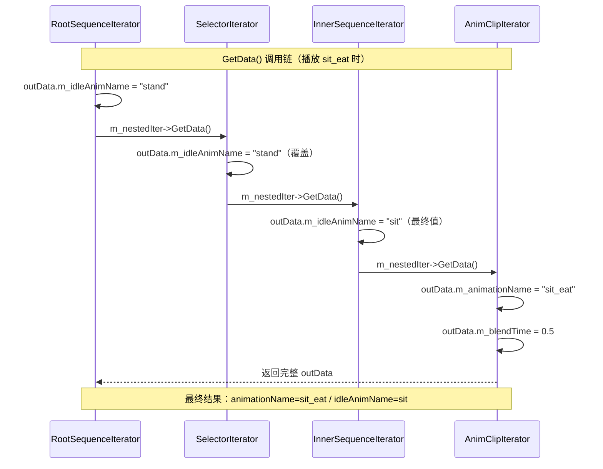
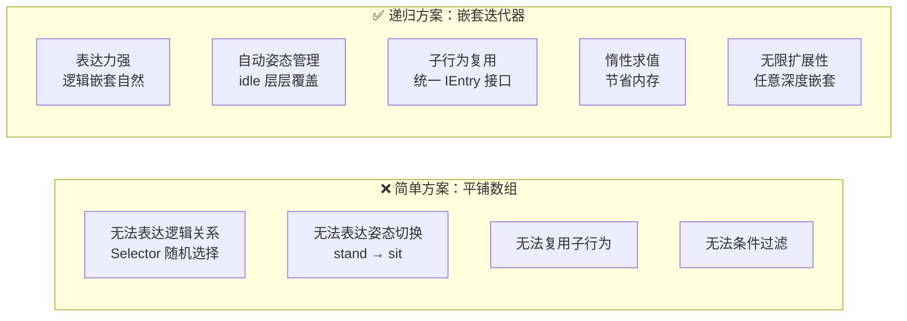
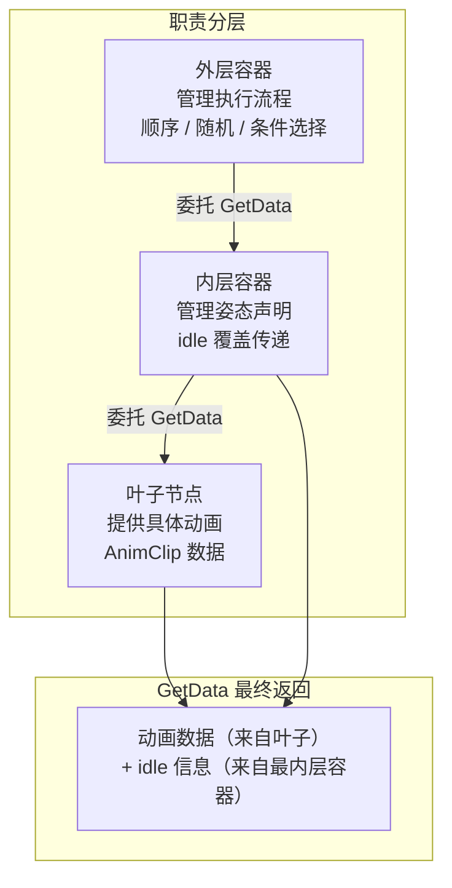

# Workspot 核心机制：嵌套迭代器递归

---

## 一、关键数据结构

`ContainerIterator` 通过 `m_nestedIter` 递归持有子迭代器，形成迭代器调用链——每一层只管理自己的遍历逻辑。



```cpp
// workspotTreeItems.cpp:603
class ContainerIterator : public IdleGuard<IContainerEntry, EntryIterator> {
    red::UniquePtr<EntryIterator> m_nestedIter;  // 当前活跃的子迭代器
    const IContainerEntry* m_contEntry;          // 指向容器本身
    Int32 m_index;                               // 当前遍历索引
};
```

---

## 二、GetData 的层层委托机制

### 委托调用链



```cpp
// workspotTreeItems.cpp:616-631
virtual void GetData( WorkspotEntryData& outData ) override {
    TBaseClass::GetData( outData );  // 1. 父类处理过渡动画

    if ( !IsTransitionActive() ) {
        if ( m_contEntry->m_idleAnim ) {
            outData.m_idleAnimName = m_contEntry->m_idleAnim;  // 2. 填充 idle
        }
        if ( m_nestedIter ) {
            m_nestedIter->GetData( outData );  // 3. ⭐ 委托给子迭代器
        }
    }
}
```

> **层层覆盖原则**：外层容器的 `m_idleAnim` 会被内层覆盖；外层容器负责姿态过渡检测（IdleGuard）；最终返回的是最内层叶子节点的动画数据。

---

## 三、Next 的递归推进机制



### 时间线演示



---

## 四、IsValid 的递归验证



```cpp
// workspotTreeItems.cpp:643-646
virtual Bool IsValid( const CheckConditionContext& context ) const override {
    return ( m_index < m_maxCount ) ||
           ( m_nestedIter && m_nestedIter->IsValid( context ) );
}
```

---

## 五、GoTo 的递归跳转



```cpp
// workspotTreeItems.cpp:658-682
virtual void GoTo( WorkEntryId id, const EntryIterationContext& context ) override {
    if ( m_pointedEntry->m_id == id ) {
        m_index = -1;
        m_nestedIter.Reset();
        Next( context );
        return;
    }
    for ( Uint32 i = 0; i < listSize; ++i ) {
        if ( handle->ContainEntry( id ) ) {          // 递归查找
            m_nestedIter.Reset( handle->CreateIterator( context ) );
            m_nestedIter->GoTo( id, context );       // 递归跳转！
            OnGoTo( i );
            return;
        }
    }
}
```

---

## 六、完整案例：四层嵌套

### 迭代器栈结构

```mermaid
graph TD
    subgraph "T=1: 播放 walk_to_spot"
        R1["RootSequenceIterator\nm_index=0"]
        E1["EntryAnimIterator\nm_stage=Active"]
        R1 -->|m_nestedIter| E1
    end

    subgraph "T=2: Selector 选中分支B，播放 sit_eat"
        R2["RootSequenceIterator\nm_index=1"]
        S2["SelectorIterator\nm_index=1（分支B）"]
        IS2["InnerSequenceIterator\nm_idleAnim=sit\nm_index=0"]
        AC2["AnimClipIterator\nm_stage=Active\nsit_eat"]
        R2 -->|m_nestedIter| S2
        S2 -->|m_nestedIter| IS2
        IS2 -->|m_nestedIter| AC2
    end

    subgraph "T=3: 播放 walk_away"
        R3["RootSequenceIterator\nm_index=2"]
        EX3["ExitAnimIterator\nm_stage=Active"]
        R3 -->|m_nestedIter| EX3
    end
```



### GetData 调用链与最终结果



---

## 七、设计模式总结

### 组合模式 + 迭代器模式

```mermaid
graph LR
    subgraph 组合模式（树形结构）
        IE["IEntry\n+ CreateIterator()\n+ ContainEntry()"]
        LEAF3["叶子节点\nAnimClip\nEntryAnim\nExitAnim"]
        CONT3["容器节点\nSequence\nSelector\nRandomList"]
        IE --> LEAF3
        IE --> CONT3
        CONT3 -->|"持有"| LEAF3
        CONT3 -->|"嵌套"| CONT3
    end

    subgraph 迭代器模式（遍历逻辑）
        EI["EntryIterator\n+ Next()\n+ GetData()\n+ IsValid()\n+ GoTo()"]
        LI["叶子迭代器\nAnimClipIterator\nMotionAnimIterator"]
        CI["容器迭代器\nSequenceIterator\nSelectorIterator\n持有 m_nestedIter"]
        EI --> LI
        EI --> CI
        CI -->|"递归持有"| CI
        CI -->|"递归持有"| LI
    end
```

### 核心优势对比



| 特性 | 实现方式 | 优势 |
|---|---|---|
| 无限嵌套 | 递归迭代器链 | 支持任意深度嵌套 |
| 统一接口 | 所有迭代器实现 Next/GetData/IsValid | 上层代码无需知道嵌套结构 |
| 惰性求值 | 只在 Next 时才创建子迭代器 | 节省内存，支持动态结构 |
| 自动清理 | UniquePtr 自动管理生命周期 | 无内存泄漏 |
| 精确跳转 | GoTo 递归查找 | 支持跳转到任意深度节点 |

---

## 八、关键洞察



> **核心原则**：容器不返回动画，只负责组织逻辑。`GetData` 永远委托到叶子节点，返回"叶子节点的动画 + 最内层容器的 idle"。

通过**递归迭代器 + 层层委托**，Workspot 实现了无限嵌套与统一接口的完美结合，是教科书级别的组合模式应用。
