# 动画序列树形结构

## 左侧面板 - 动画列表

```
├─ Anim: sit_chair_lean0_2h_phone_01_shuffle_01
├─ Anim: sit_chair_lean0_2h_phone_01_wipe_nose_01
├─ Anim: sit_chair_lean0_2h_phone_01_long_01
├─ Sequence idle: sit_chair_lean0_2h_elbow_on_knees_01
│  └─ Random list
│     ├─ Anim: sit_chair_lean0_2h_elbow_on_knees_01_shuffle_03
│     ├─ Anim: sit_chair_lean0_2h_elbow_on_knees_01_shuffle_04
│     ├─ Anim: sit_chair_lean0_2h_elbow_on_knees_01_consider_01
│     ├─ Anim: sit_chair_lean0_2h_elbow_on_knees_01_breathe_01
│     └─ Anim: sit_chair_lean0_2h_elbow_on_knees_01_long_01
├─ Sequence idle: sit_chair_lean180_rh_cigarette_01
│  ├─ Random list
│  │  ├─ Anim: sit_chair_lean180_rh_cigarette_01_puff_01
│  │  ├─ Anim: sit_chair_lean180_rh_cigarette_01_drop_ash_01
│  │  └─ Anim: sit_chair_lean180_rh_cigarette_01_long_01
│  └─ Random list
│     ├─ Anim: sit_chair_lean180_rh_cigarette_01_shuffle_subtle_01
│     └─ Anim: sit_chair_lean180_rh_cigarette_01_shuffle_01
├─ Sequence idle: sit_chair_lean180_read_tablet_01
│  └─ Random list
│     ├─ Anim: sit_chair_lean180_read_tablet_01_shuffle_02
│     ├─ Anim: sit_chair_lean180_read_tablet_01_flick_03
│     ├─ Anim: sit_chair_lean180_read_tablet_01_shuffle_01
│     └─ Anim: sit_chair_lean180_read_tablet_01_flick_01
├─ Sequence idle: sit_chair_lean180_2h_chinesetakeout_01
│  └─ Random list
│     ├─ Anim: sit_chair_lean180_2h_chinesetakeout_01_shuffle_03
│     ├─ Anim: sit_chair_lean180_2h_chinesetakeout_01_shuffle_02
│     ├─ Anim: sit_chair_lean180_2h_chinesetakeout_01_eat_06
│     └─ Anim: sit_chair_lean180_2h_chinesetakeout_01_eat_04
├─ **Conditional sequence idle: sit_chair_lean0_rh_phone_01** [当前选中]
│  └─ Random list
│     ├─ Anim: sit_chair_lean0_rh_phone_01_talk_phone_02
│     ├─ Anim: sit_chair_lean0_rh_phone_01_talk_phone_03
│     ├─ Anim: sit_chair_lean0_rh_phone_01_talk_phone_04
│     └─ Anim: sit_chair_lean0_rh_phone_01_long_01
├─ Exit anim: sit_chair_2h_on_lap_01_to_stand_2h_on_sides_01_turn0_01
├─ Exit anim: sit_chair_2h_on_lap_01_to_walk_0_turn0_01
├─ Exit anim: sit_chair_2h_on_lap_01_to_walk_0_turn270_01
├─ Exit anim: sit_chair_2h_on_lap_01_to_walk_0_turn315_01
├─ Exit anim: sit_chair_2h_on_lap_01_to_walk_0_turn90_01
├─ Exit anim: sit_chair_2h_on_lap_01_to_walk_0_turn45_01
└─ Fast exit: sit_chair_2h_on_lap_01_to_stand_2h_on_sides_01_fast_exit_turn0_01
```

## 右侧面板 - Root Sequence

```
Root sequence
├─ Reaction Sequence: [Fear]
│  ├─ Anim: sit_chair_2h_on_lap_01_to_sit_chair_2h_up_01_turn0_01
│  └─ Sequence idle: sit_chair_2h_up_01
│     └─ Anim: sit_chair_2h_up_01
├─ Entry anim: stand_2h_on_sides_01_to_sit_chair_2h_on_lap_01_turn180r_01
├─ Entry anim: stand_2h_on_sides_01_to_sit_chair_2h_on_lap_01_turn0_01
├─ Entry anim: walk_0_to_sit_chair_2h_on_lap_01_turn135_01
├─ Entry anim: walk_0_to_sit_chair_2h_on_lap_01_turn225_01
├─ Entry anim: walk_0_to_sit_chair_2h_on_lap_01_turn270_01
├─ Entry anim: walk_0_to_sit_chair_2h_on_lap_01_turn90_01
├─ Entry anim: walk_0_to_sit_chair_2h_on_lap_01_turn180r_01
└─ Selector idle: sit_chair_2h_on_lap_01
   ├─ Sequence idle: sit_chair_2h_on_lap_01
   │  └─ Random list
   │     ├─ Anim: sit_chair_2h_on_lap_01_wait_01
   │     ├─ Anim: sit_chair_2h_on_lap_01_look_left_01
   │     ├─ Anim: sit_chair_2h_on_lap_01_rub_eyes_01
   │     ├─ Anim: sit_chair_2h_on_lap_01_look_up_left_01
   │     ├─ Anim: sit_chair_2h_on_lap_01_long_01
   │     └─ Anim: sit_chair_2h_on_lap_01_sleep_long_01
   ├─ Sequence idle: sit_chair_lean0_2h_phone_01
   │  └─ Random list
   │     ├─ Anim: sit_chair_lean0_2h_phone_01_angry_shake_02
   │     ├─ Anim: sit_chair_lean0_2h_phone_01_lean_back_02
   │     ├─ Anim: sit_chair_lean0_2h_phone_01_playing_01
   │     ├─ Anim: sit_chair_lean0_2h_phone_01_playing_02
   │     ├─ Anim: sit_chair_lean0_2h_phone_01_shuffle_01
   │     ├─ Anim: sit_chair_lean0_2h_phone_01_wipe_nose_01
   │     └─ Anim: sit_chair_lean0_2h_phone_01_long_01
   ├─ Sequence idle: sit_chair_lean0_2h_elbow_on_knees_01
   │  └─ Random list
   │     ├─ Anim: sit_chair_lean0_2h_elbow_on_knees_01_shuffle_03
   │     ├─ Anim: sit_chair_lean0_2h_elbow_on_knees_01_shuffle_04
   │     ├─ Anim: sit_chair_lean0_2h_elbow_on_knees_01_consider_01
   │     ├─ Anim: sit_chair_lean0_2h_elbow_on_knees_01_breathe_01
   │     └─ Anim: sit_chair_lean0_2h_elbow_on_knees_01_long_01
   └─ Sequence idle: sit_chair_lean180_rh_cigarette_01
      └─ Random list
         ├─ Anim: sit_chair_lean180_rh_cigarette_01_puff_01
         ├─ **Anim: sit_chair_lean180_rh_cigarette_01_drop_ash_01** [当前选中]
         └─ Anim: sit_chair_lean180_rh_cigarette_01_long_01
```

## 结构说明

### 节点类型

- **Root sequence**: 根序列节点
- **Reaction Sequence**: 反应序列（如恐惧[Fear]反应）
- **Selector idle**: 选择器节点，用于从多个子序列中选择一个
- **Sequence idle**: 序列节点，按顺序执行
- **Conditional sequence idle**: 条件序列节点，基于条件执行
- **Random list**: 随机列表，从子项中随机选择
- **Entry anim**: 进入动画，用于进入该状态
- **Exit anim**: 退出动画，用于离开该状态
- **Fast exit**: 快速退出动画
- **Anim**: 具体的动画资源

### 命名规范

动画命名遵循以下模式：
- `sit_chair`: 坐在椅子上
- `lean0/lean180`: 倾斜角度（0度/180度）
- `2h/rh`: 双手(2 hands)/右手(right hand)
- `on_lap`: 手放在腿上
- `phone/tablet/cigarette`: 道具类型
- `turn0/turn90/turn180/turn270`: 转向角度
- 动作类型：`shuffle`(移动)、`wait`(等待)、`long`(长时间)、`breathe`(呼吸)、`consider`(思考)等

```plantuml
@startuml
skinparam linetype ortho
hide empty description

' ==== 左侧序列 ====
package "Left Panel Sequences" {
  node "Anim: sit_chair_lean0_2h_phone_01_wife_01" as A1
  node "Anim: sit_chair_lean0_2h_phone_01_sniffle_01" as A2
  node "Anim: sit_chair_lean0_2h_phone_01_long_01" as A3

  folder "Sequence: idle: sit_chair_lean0_2h_elbow_on_knees_01" as S1 {
    folder "Random list" as R1 {
      node "Anim: sit_chair_lean0_2h_elbow_on_knees_01_shuffle_03" as R1A1
      node "Anim: sit_chair_lean0_2h_elbow_on_knees_01_shuffle_04" as R1A2
      node "Anim: sit_chair_lean0_2h_elbow_on_knees_01_consider_01" as R1A3
      node "Anim: sit_chair_lean0_2h_elbow_on_knees_01_breathe_01" as R1A4
      node "Anim: sit_chair_lean0_2h_elbow_on_knees_01_long_01" as R1A5
    }
  }

  folder "Sequence: idle: sit_chair_lean180_rh_cigarette_01" as S2 {
    folder "Random list" as R2 {
      node "Anim: sit_chair_lean180_rh_cigarette_01_puff_01" as R2A1
      node "Anim: sit_chair_lean180_rh_cigarette_01_drop_ash_01" as R2A2
      node "Anim: sit_chair_lean180_rh_cigarette_01_long_01" as R2A3
      folder "Random list" as R2B {
        node "Anim: sit_chair_lean180_rh_cigarette_01_shuffle_subtle_01" as R2B1
        node "Anim: sit_chair_lean180_rh_cigarette_01_shuffle_01" as R2B2
      }
    }
  }

  folder "Sequence: idle: sit_chair_lean180_read_tablet_01" as S3 {
    folder "Random list" as R3 {
      node "Anim: sit_chair_lean180_read_tablet_01_shuffle_02" as R3A1
      node "Anim: sit_chair_lean180_read_tablet_01_flick_03" as R3A2
      node "Anim: sit_chair_lean180_read_tablet_01_shuffle_01" as R3A3
      node "Anim: sit_chair_lean180_read_tablet_01_flick_01" as R3A4
    }
  }

  folder "Sequence: idle: sit_chair_lean180_2h_chinesetakeout_01" as S4 {
    folder "Random list" as R4 {
      node "Anim: sit_chair_lean180_2h_chinesetakeout_01_shuffle_03" as R4A1
      node "Anim: sit_chair_lean180_2h_chinesetakeout_01_shuffle_02" as R4A2
      node "Anim: sit_chair_lean180_2h_chinesetakeout_01_eat_06" as R4A3
      node "Anim: sit_chair_lean180_2h_chinesetakeout_01_eat_04" as R4A4
    }
  }

  folder "Conditional sequence: idle: sit_chair_lean0_rh_phone_01" as S5 {
    folder "Random list" as R5 {
      node "Anim: sit_chair_lean0_rh_phone_01_talk_phone_02" as R5A1
      node "Anim: sit_chair_lean0_rh_phone_01_talk_phone_03" as R5A2
      node "Anim: sit_chair_lean0_rh_phone_01_talk_phone_04" as R5A3
      node "Anim: sit_chair_lean0_rh_phone_01_long_01" as R5A4
    }
    node "Exit anim: stand_2h_on_sides_01_to_stand_2h_on_sides_01_turn0_01" as E1
    node "Exit anim: sit_chair_2h_on_lap_01_to_walk_0_turn0_01" as E2
    node "Exit anim: sit_chair_2h_on_lap_01_to_walk_0_turn270_01" as E3
    node "Exit anim: sit_chair_2h_on_lap_01_to_walk_0_turn315_01" as E4
    node "Exit anim: sit_chair_2h_on_lap_01_to_walk_0_turn90_01" as E5
    node "Exit anim: sit_chair_2h_on_lap_01_to_walk_0_turn45_01" as E6
    node "Fast exit: sit_chair_2h_on_lap_01_to_stand_2h_on_sides_01_fast_exit_turn0_01" as FE1
  }
}

' ==== 右侧序列 ====
package "Right Panel Sequences" {
  folder "Root sequence" as Root {
    folder "Reaction Sequence [Fear]" as RS {
      node "Anim: sit_chair_2h_on_lap_01_to_sit_chair_2h_up_01_turn0_01" as RSA1
    }

    folder "Sequence: idle: sit_chair_2h_up_01" as S6 {
      node "Anim: sit_chair_2h_up_01" as S6A1
    }

    node "Entry anim: stand_2h_on_sides_01_to_sit_chair_2h_on_lap_01_turn180r_01" as EN1
    node "Entry anim: stand_2h_on_sides_01_to_sit_chair_2h_on_lap_01_turn0_01" as EN2
    node "Entry anim: walk_0_to_sit_chair_2h_on_lap_01_turn15_01" as EN3
    node "Entry anim: walk_0_to_sit_chair_2h_on_lap_01_turn225_01" as EN4
    node "Entry anim: walk_0_to_sit_chair_2h_on_lap_01_turn270_01" as EN5
    node "Entry anim: walk_0_to_sit_chair_2h_on_lap_01_turn90_01" as EN6
    node "Entry anim: walk_0_to_sit_chair_2h_on_lap_01_turn180_01" as EN7

    folder "Selector: idle: sit_chair_2h_on_lap_01" as SEL {
      folder "Sequence: idle: sit_chair_2h_on_lap_01" as S7 {
        folder "Random list" as R7 {
          node "Anim: sit_chair_2h_on_lap_01_wait_01" as R7A1
          node "Anim: sit_chair_2h_on_lap_01_lock_left_01" as R7A2
          node "Anim: sit_chair_2h_on_lap_01_rub_eyes_01" as R7A3
          node "Anim: sit_chair_2h_on_lap_01_look_up_left_01" as R7A4
          node "Anim: sit_chair_2h_on_lap_01_long_01" as R7A5
          node "Anim: sit_chair_2h_on_lap_01_sleep_long_01" as R7A6
        }
      }
    }

    folder "Sequence: idle: sit_chair_lean0_2h_phone_01" as S8 {
      folder "Random list" as R8 {
        node "Anim: sit_chair_lean0_2h_phone_01_angry_shake_02" as R8A1
        node "Anim: sit_chair_lean0_2h_phone_01_lean_back_02" as R8A2
        node "Anim: sit_chair_lean0_2h_phone_01_playing_01" as R8A3
        node "Anim: sit_chair_lean0_2h_phone_01_playing_02" as R8A4
        node "Anim: sit_chair_lean0_2h_phone_01_shuffle_01" as R8A5
        node "Anim: sit_chair_lean0_2h_phone_01_wipe_nose_01" as R8A6
        node "Anim: sit_chair_lean0_2h_phone_01_long_01" as R8A7
      }
    }

    folder "Sequence: idle: sit_chair_lean0_2h_elbow_on_knees_01" as S9 {
      folder "Random list" as R9 {
        node "Anim: sit_chair_lean0_2h_elbow_on_knees_01_shuffle_03" as R9A1
        node "Anim: sit_chair_lean0_2h_elbow_on_knees_01_shuffle_04" as R9A2
        node "Anim: sit_chair_lean0_2h_elbow_on_knees_01_consider_01" as R9A3
        node "Anim: sit_chair_lean0_2h_elbow_on_knees_01_breathe_01" as R9A4
        node "Anim: sit_chair_lean0_2h_elbow_on_knees_01_long_01" as R9A5
      }
    }

    folder "Sequence: idle: sit_chair_lean180_rh_cigarette_01" as S10 {
      folder "Random list" as R10 {
        node "Anim: sit_chair_lean180_rh_cigarette_01_puff_01" as R10A1
        node "Anim: sit_chair_lean180_rh_cigarette_01_drop_ash_01" as R10A2
        node "Anim: sit_chair_lean180_rh_cigarette_01_long_01" as R10A3
        folder "Random list" as R10B {
          ' 子随机列表内容可扩展
        }
      }
    }
  }
}
@enduml
```


