# 赛博朋克2077 Workspot系统完整技术文档
> 基于源代码的深度架构分析与建模

---

## 📋 文档目录

1. [系统概述](#系统概述)
2. [核心架构](#核心架构)
3. [类继承体系](#类继承体系)
4. [运行时机制](#运行时机制)
5. [数据流分析](#数据流分析)
6. [实战案例](#实战案例)
7. [设计模式](#设计模式)
8. [最佳实践](#最佳实践)

---

## 系统概述

### WHY - 为什么需要Workspot？

#### 传统AI动画系统的问题

```
问题1: 动画与逻辑强耦合
  AI代码 → hardcode动画名称 → 难以修改

问题2: 复杂行为难以编排
  if (idle) play("sit")
  if (drinking) play("drink")
  // 逻辑爆炸，维护困难

问题3: 同步动画实现困难
  两个角色握手 → 需要手动同步时间轴

问题4: 进出点位不自然
  角色突然传送到椅子上 → 破坏沉浸感

问题5: 缺少变化
  NPC一直重复同一动画 → 机械感强
```

#### CDPR的解决方案

**Workspot = 数据驱动的动画行为树**

```
核心思想：
  1. 用树状结构描述AI行为序列
  2. 通过迭代器模式遍历节点
  3. 支持条件判断、随机选择、同步动画
  4. 进出点位有平滑过渡
  5. 统一玩家与NPC的交互系统
```

### WHAT - Workspot是什么？

**定义：** Workspot是一个将AI行为抽象为可编辑树状结构的系统，通过节点组合实现复杂动画序列，支持条件判断、同步控制和反应机制。

**关键特性：**
- ✅ 数据驱动：非程序员可编辑
- ✅ 树状结构：支持嵌套和组合
- ✅ 迭代器遍历：灵活的执行控制
- ✅ 同步机制：多角色协同动画
- ✅ 反应系统：响应游戏事件
- ✅ 进出平滑：EntryAnim/ExitAnim

---

## 核心架构

### 整体系统架构图

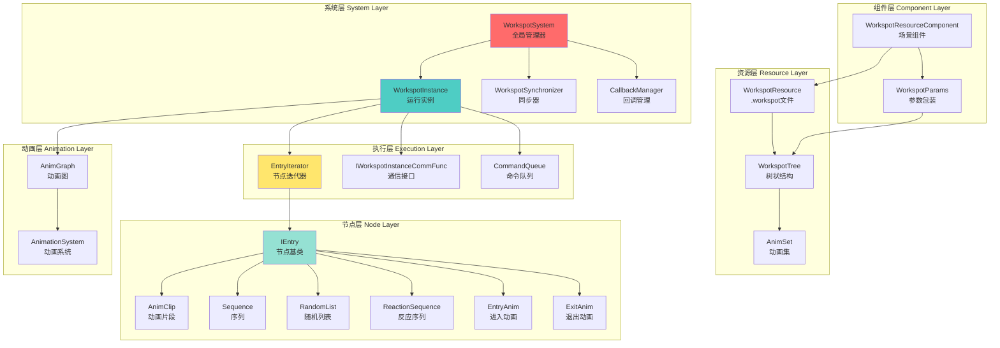

### 三层架构分离

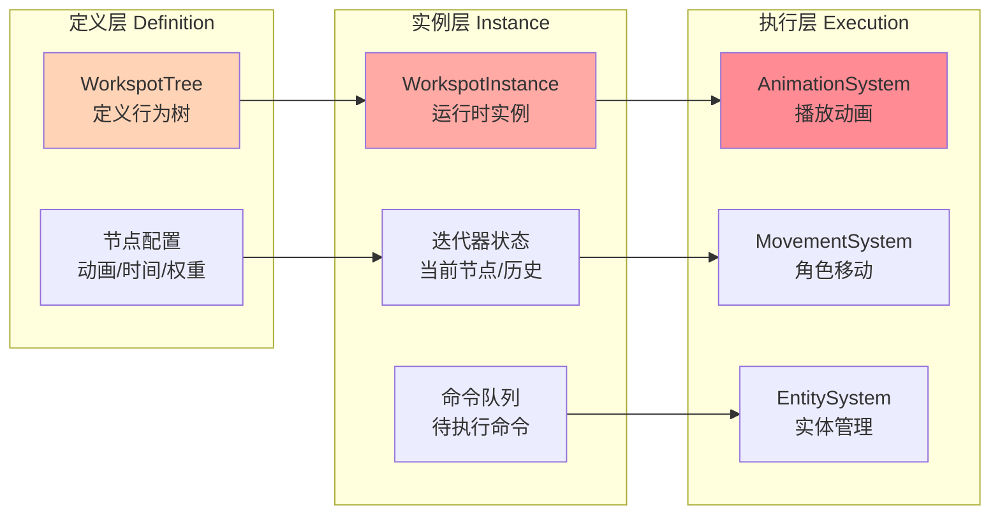

---

## 类继承体系

### 节点类继承关系

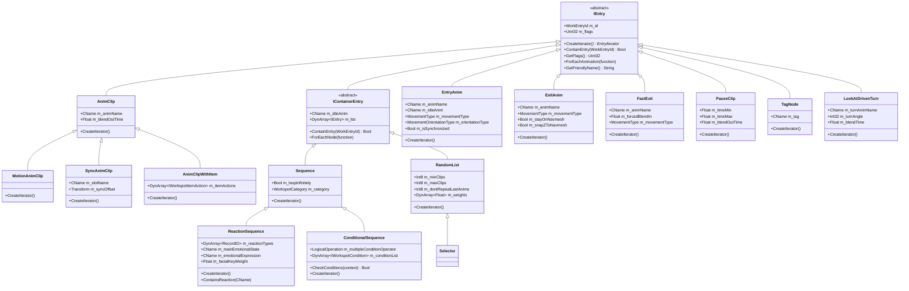

### 迭代器类关系

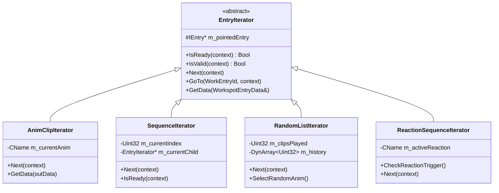

### 系统类关系

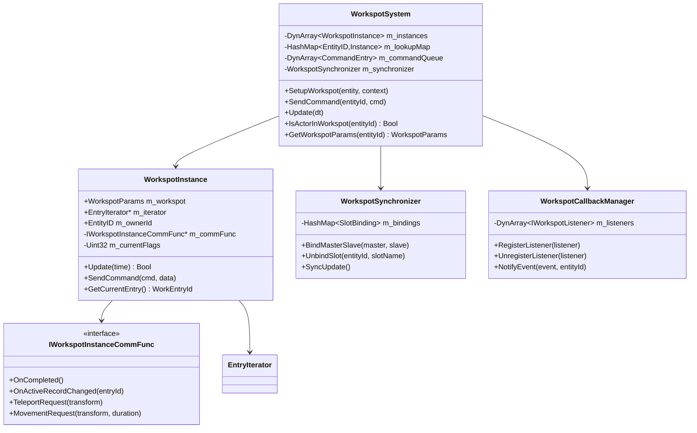

---

## 运行时机制

### Workspot生命周期状态机

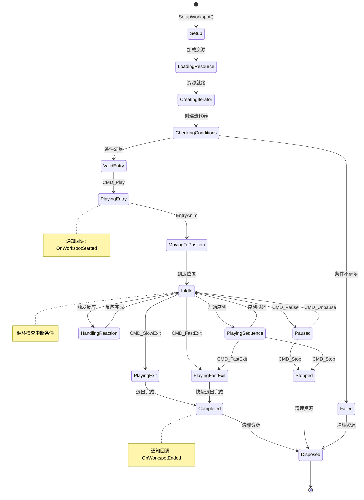

### 迭代器执行流程

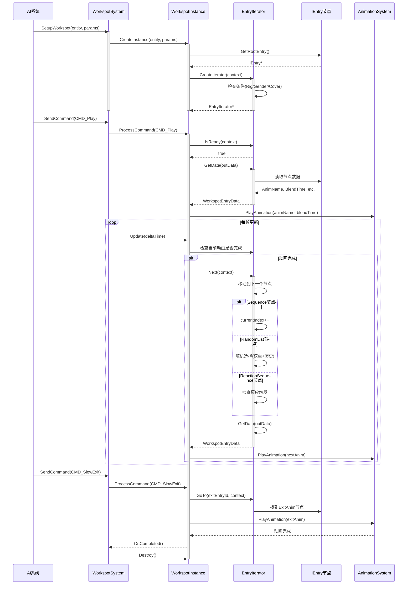

### 命令处理流程

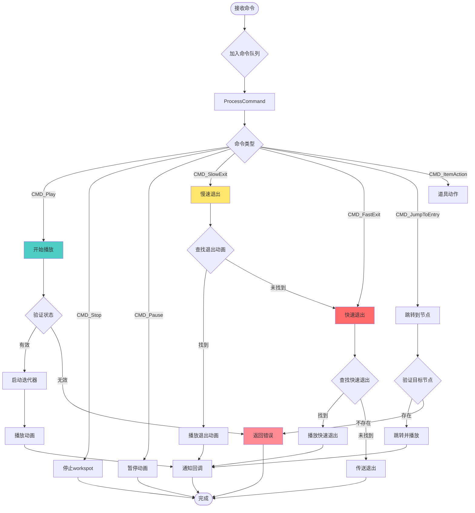

---

## 数据流分析

### 完整数据流图

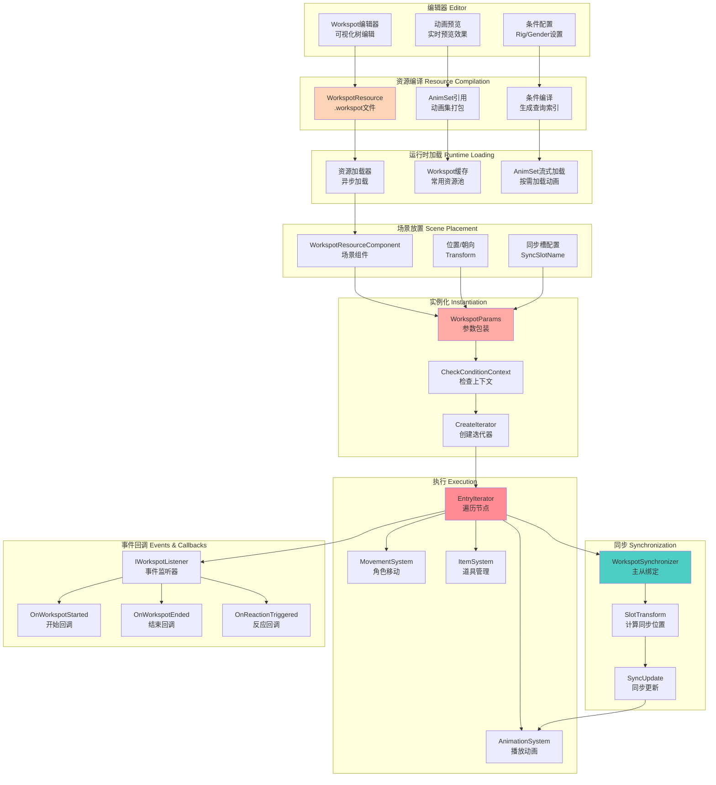

### 同步机制详解

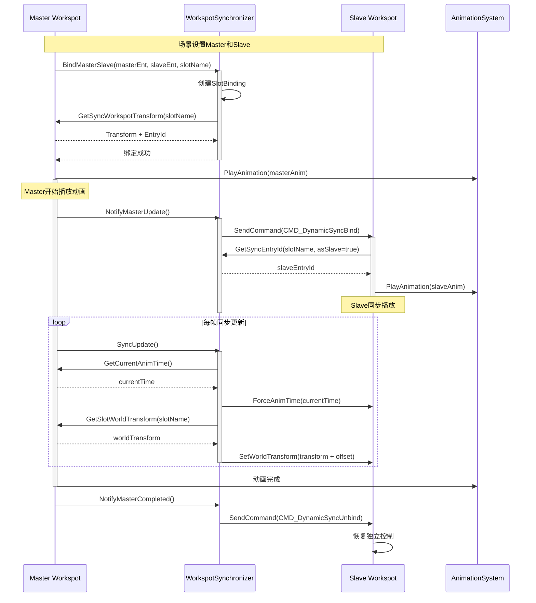

### 反应系统触发流程

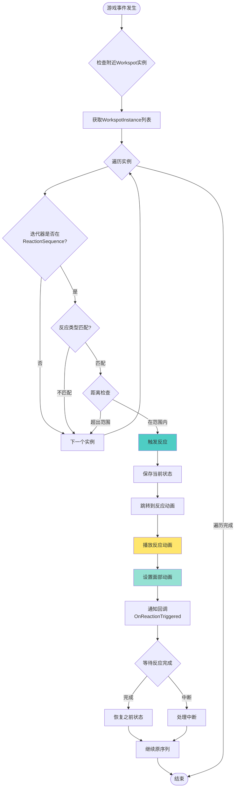

---

## 实战案例

### 案例1：酒吧NPC喝酒行为

#### Workspot树结构

```
WorkspotTree: "bar_drinking_workspot"
├─ WorkspotAnimsetEntry
│   ├─ Rig: base\characters\entities\citizen\citizen_male_average.rig
│   └─ AnimSet: base\animations\citizen\workspots\bar_drinking.anims
│
├─ RootEntry: Sequence (loopInfinitely=true)
│   ├─ IdleAnim: "bar_sit_idle"
│   │
│   ├─ Entry[0]: EntryAnim
│   │   ├─ animName: "walk_to_bar_stool"
│   │   ├─ movementType: Walk
│   │   └─ orientationType: Forward
│   │
│   ├─ Entry[1]: AnimClip
│   │   ├─ animName: "sit_down_bar_stool"
│   │   └─ blendOutTime: 0.3
│   │
│   ├─ Entry[2]: Sequence (主循环)
│   │   ├─ IdleAnim: "bar_sit_idle_drinking"
│   │   │
│   │   ├─ [0]: RandomList (dontRepeatLastAnims=2)
│   │   │   ├─ [0]: AnimClipWithItem (weight=0.3)
│   │   │   │   ├─ animName: "drink_beer_sip"
│   │   │   │   └─ itemActions: [SpawnItem("beer_bottle")]
│   │   │   │
│   │   │   ├─ [1]: AnimClip (weight=0.25)
│   │   │   │   └─ animName: "look_around_bar"
│   │   │   │
│   │   │   ├─ [2]: AnimClip (weight=0.2)
│   │   │   │   └─ animName: "scratch_head"
│   │   │   │
│   │   │   ├─ [3]: PauseClip (weight=0.15)
│   │   │   │   ├─ timeMin: 2.0
│   │   │   │   └─ timeMax: 5.0
│   │   │   │
│   │   │   └─ [4]: AnimClip (weight=0.1)
│   │   │       └─ animName: "tap_fingers_on_bar"
│   │   │
│   │   └─ [1]: ReactionSequence
│   │       ├─ reactionTypes: ["Greeting", "Scared", "Angry"]
│   │       ├─ mainEmotionalState: "neutral"
│   │       ├─ list[0]: AnimClip (reaction: "Greeting")
│   │       │   └─ animName: "wave_hello_sitting"
│   │       ├─ list[1]: AnimClip (reaction: "Scared")
│   │       │   └─ animName: "duck_scared_sitting"
│   │       └─ list[2]: AnimClip (reaction: "Angry")
│   │           └─ animName: "stand_up_angry"
│   │
│   ├─ Entry[3]: ExitAnim
│   │   ├─ animName: "stand_up_from_stool"
│   │   ├─ movementType: Walk
│   │   └─ stayOnNavmesh: true
│   │
│   └─ Entry[4]: FastExit (紧急退出)
│       ├─ animName: "jump_off_stool"
│       ├─ forcedBlendIn: 0.1
│       └─ movementType: Run
│
└─ GlobalProps
    └─ Prop[0]: "beer_bottle"
        ├─ id: "beer"
        ├─ boneName: "hand_r"
        └─ prop: base\items\props\beer_bottle.ent
```

#### 执行流程示例

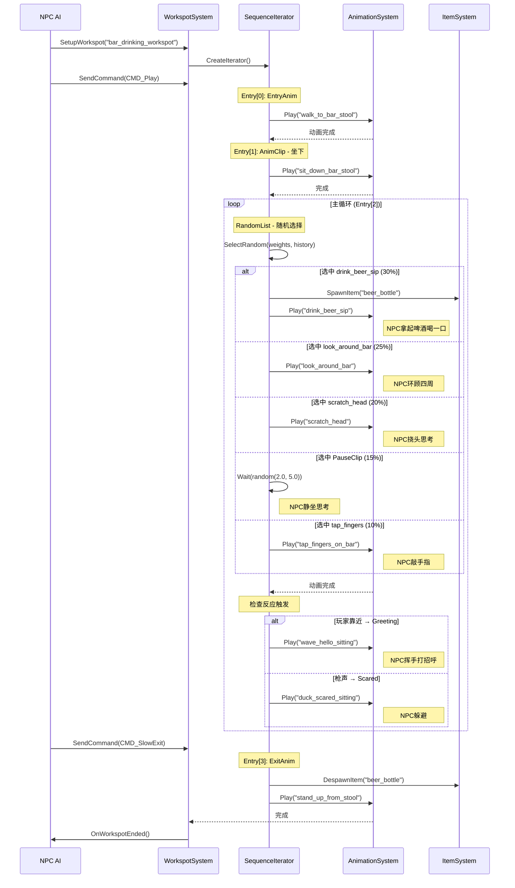

### 案例2：双人同步握手

#### Master Workspot结构

```
WorkspotTree: "handshake_master"
├─ RootEntry: Sequence
│   ├─ Entry[0]: SyncMasterEntryAnim
│   │   ├─ animName: "walk_to_handshake_master"
│   │   ├─ isSynchronized: true
│   │   ├─ slotName: "handshake_slave_slot"
│   │   └─ syncOffset: Transform(0, 0.8, 0) // 前方0.8米
│   │
│   ├─ Entry[1]: SyncAnimClip
│   │   ├─ animName: "handshake_master_anim"
│   │   ├─ slotName: "handshake_slave_slot"
│   │   └─ syncOffset: Transform(0, 0.8, 0)
│   │
│   └─ Entry[2]: ExitAnim
│       └─ animName: "walk_away_master"
```

#### Slave Workspot结构

```
WorkspotTree: "handshake_slave"
├─ RootEntry: Sequence
│   ├─ Entry[0]: EntryAnim
│   │   ├─ animName: "walk_to_handshake_slave"
│   │   ├─ isSynchronized: true
│   │   └─ slotName: "handshake_slave_slot"
│   │
│   ├─ Entry[1]: SyncAnimClip
│   │   ├─ animName: "handshake_slave_anim"
│   │   ├─ slotName: "handshake_slave_slot"
│   │   └─ syncOffset: Transform(0, 0, 0) // 在槽位置
│   │
│   └─ Entry[2]: ExitAnim
│       └─ animName: "walk_away_slave"
```

#### 同步执行流程

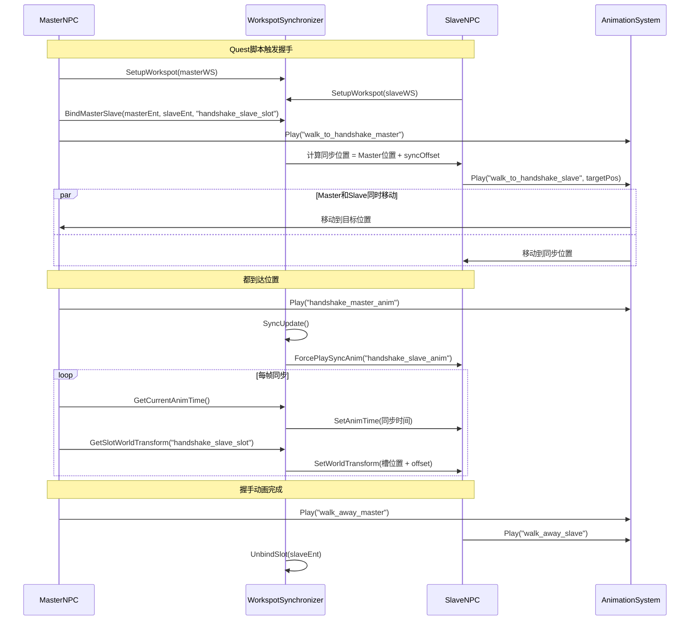

### 案例3：条件序列 - 不同体型的坐姿

```
WorkspotTree: "universal_chair_sit"
├─ RootEntry: ConditionalSequence
│   │
│   ├─ Condition[0]: 男性大体型
│   │   ├─ Sequence
│   │   │   ├─ EntryAnim: "walk_to_chair_large"
│   │   │   ├─ AnimClip: "sit_down_large_male"
│   │   │   ├─ IdleAnim: "sit_idle_large_male"
│   │   │   └─ ExitAnim: "stand_up_large_male"
│   │
│   ├─ Condition[1]: 女性平均体型
│   │   ├─ Sequence
│   │   │   ├─ EntryAnim: "walk_to_chair_average"
│   │   │   ├─ AnimClip: "sit_down_female"
│   │   │   ├─ IdleAnim: "sit_idle_female"
│   │   │   └─ ExitAnim: "stand_up_female"
│   │
│   └─ Default: 通用
│       └─ Sequence
│           ├─ EntryAnim: "walk_to_chair_default"
│           ├─ AnimClip: "sit_down_default"
│           ├─ IdleAnim: "sit_idle_default"
│           └─ ExitAnim: "stand_up_default"
```

#### 条件检查代码

```cpp
// ConditionalSequence::CheckConditions
Bool ConditionalSequence::CheckConditions( const CheckConditionContext& context )
{
    // 示例：检查Rig类型
    res::ResourcePath rigPath = context.GetRigPath();

    for ( auto& condition : m_conditionList )
    {
        if ( condition->GetType() == ConditionType::RigPath )
        {
            RigPathCondition* rigCond = static_cast<RigPathCondition*>( condition.Get() );
            if ( rigCond->m_rigPath == rigPath )
            {
                return true; // 条件匹配
            }
        }
    }

    return false; // 使用默认序列
}
```

---

## 设计模式

### 模式1：迭代器模式 (Iterator Pattern)

**目的：** 提供统一的节点遍历接口，隐藏树结构复杂性

```cpp
class EntryIterator {
    virtual void Next( const EntryIterationContext& context ) = 0;
    virtual void GetData( WorkspotEntryData& outData ) = 0;
};

// 不同节点类型有不同迭代器实现
class SequenceIterator : public EntryIterator {
    void Next( const EntryIterationContext& context ) override {
        m_currentIndex++;
        if ( m_currentIndex < m_sequence->m_list.Size() ) {
            // 顺序遍历子节点
            m_currentChild = m_sequence->m_list[m_currentIndex]->CreateIterator(context);
        }
    }
};

class RandomListIterator : public EntryIterator {
    void Next( const EntryIterationContext& context ) override {
        // 根据权重随机选择
        Uint32 selected = SelectWeightedRandom( m_weights, m_history );
        m_currentChild = m_list[selected]->CreateIterator(context);
        m_history.PushBack(selected); // 记录历史
    }
};
```

**优势：**
- 客户端代码无需知道节点类型
- 新增节点类型只需实现迭代器接口
- 支持复杂遍历逻辑（随机、条件）

### 模式2：组合模式 (Composite Pattern)

**目的：** 统一处理叶子节点和容器节点

```cpp
// 统一接口
class IEntry {
    virtual EntryIterator* CreateIterator() = 0;
    virtual Bool ContainEntry( WorkEntryId id ) = 0;
};

// 叶子节点
class AnimClip : public IEntry {
    Bool ContainEntry( WorkEntryId id ) override {
        return m_id == id;
    }
};

// 容器节点
class IContainerEntry : public IEntry {
    red::DynArray< THandle< IEntry > > m_list;

    Bool ContainEntry( WorkEntryId id ) override {
        if ( m_id == id ) return true;

        for ( auto& child : m_list ) {
            if ( child->ContainEntry(id) ) return true;
        }
        return false;
    }
};
```

**优势：**
- 可以无限嵌套节点
- 统一处理单个动画和复杂序列
- 递归操作简洁

### 模式3：命令模式 (Command Pattern)

**目的：** 将Workspot操作封装为命令对象

```cpp
// 命令枚举
enum WorkspotCommand {
    CMD_Play,
    CMD_Stop,
    CMD_FastExit,
    CMD_SlowExit,
    CMD_JumpToEntry,
};

// 命令数据
struct IWorkspotCommandData {
    virtual ~IWorkspotCommandData() {}
};

struct JumpToCommandData : public IWorkspotCommandData {
    WorkEntryId m_entryId;
    CName m_entryTag;
    Bool m_immediate;
};

// 命令队列
struct CommandEntry {
    WorkspotInstance* m_target;
    Uint32 m_commands;  // 可组合多个命令
    CommandDataArray m_data;
};

// 发送命令
Bool WorkspotSystem::SendCommand(
    const ent::EntityID& ownerId,
    Uint32 cmd,
    red::UniquePtr<IWorkspotCommandData>&& data
) {
    // 加入命令队列，下一帧统一处理
    m_commandQueue.PushBack({ instance, cmd, std::move(data) });
}
```

**优势：**
- 支持命令队列和延迟执行
- 可撤销操作（保存状态）
- 命令可组合（多个命令一起执行）

### 模式4：策略模式 (Strategy Pattern)

**目的：** 不同节点类型使用不同选择策略

```cpp
// 策略接口
class IEntrySelectionStrategy {
    virtual IEntry* SelectNext( const DynArray<IEntry*>& candidates ) = 0;
};

// 顺序策略
class SequentialStrategy : public IEntrySelectionStrategy {
    Uint32 m_index = 0;

    IEntry* SelectNext( const DynArray<IEntry*>& candidates ) override {
        IEntry* result = candidates[m_index];
        m_index = (m_index + 1) % candidates.Size();
        return result;
    }
};

// 随机策略（带权重）
class WeightedRandomStrategy : public IEntrySelectionStrategy {
    DynArray<Float> m_weights;
    DynArray<Uint32> m_history;

    IEntry* SelectNext( const DynArray<IEntry*>& candidates ) override {
        // 根据权重选择，避免重复历史
        Uint32 selected = WeightedRandom( m_weights, m_history );
        return candidates[selected];
    }
};

// 条件策略
class ConditionalStrategy : public IEntrySelectionStrategy {
    IEntry* SelectNext( const DynArray<IEntry*>& candidates ) override {
        for ( auto& candidate : candidates ) {
            if ( candidate->CheckConditions( context ) ) {
                return candidate;
            }
        }
        return nullptr; // 使用默认
    }
};
```

### 模式5：观察者模式 (Observer Pattern)

**目的：** 通知外部系统Workspot事件

```cpp
// 监听器接口
class IWorkspotListener {
    virtual void OnWorkspotStarted( const ent::EntityID& entityId ) = 0;
    virtual void OnWorkspotEnded( const ent::EntityID& entityId ) = 0;
    virtual void OnAnimationChanged( const ent::EntityID& entityId, WorkEntryId entryId ) = 0;
    virtual void OnReactionTriggered( const ent::EntityID& entityId, CName reactionType ) = 0;
};

// 回调管理器
class WorkspotCallbackManager {
    DynArray< red::SharedPtr<IWorkspotListener> > m_listeners;

    void NotifyWorkspotStarted( const ent::EntityID& entityId ) {
        for ( auto& listener : m_listeners ) {
            listener->OnWorkspotStarted( entityId );
        }
    }
};

// Quest系统监听
class QuestWorkspotListener : public IWorkspotListener {
    void OnWorkspotEnded( const ent::EntityID& entityId ) override {
        // NPC完成工作 → 触发Quest目标
        questSystem->CompleteObjective( "wait_for_npc_finish" );
    }
};
```

### 模式6：状态模式 (State Pattern)

**目的：** WorkspotInstance的不同状态

```cpp
enum class WorkspotState {
    Idle,
    MovingToEntry,
    InWorkspot,
    PlayingSequence,
    HandlingReaction,
    Exiting,
    Completed
};

class WorkspotInstance {
    WorkspotState m_state;

    void Update( Float deltaTime ) {
        switch ( m_state ) {
            case WorkspotState::MovingToEntry:
                UpdateMovement( deltaTime );
                if ( ReachedTarget() ) {
                    m_state = WorkspotState::InWorkspot;
                }
                break;

            case WorkspotState::InWorkspot:
                if ( ShouldStartSequence() ) {
                    m_state = WorkspotState::PlayingSequence;
                }
                break;

            case WorkspotState::PlayingSequence:
                UpdateAnimation( deltaTime );
                if ( ReactionTriggered() ) {
                    SaveState();
                    m_state = WorkspotState::HandlingReaction;
                }
                break;

            case WorkspotState::HandlingReaction:
                UpdateReaction( deltaTime );
                if ( ReactionCompleted() ) {
                    RestoreState();
                    m_state = WorkspotState::PlayingSequence;
                }
                break;
        }
    }
};
```

---

## 最佳实践

### 实践1：合理设计节点层次

**❌ 不好的设计：**

```
RootEntry: RandomList (直接随机所有动画)
├─ AnimClip: "idle_1"
├─ AnimClip: "idle_2"
├─ AnimClip: "drink"
├─ AnimClip: "scratch"
└─ AnimClip: "look_around"
```

**问题：**
- 无法控制某些动画必须执行
- 无法实现"喝酒后才挠头"的逻辑
- 缺少idle过渡

**✅ 好的设计：**

```
RootEntry: Sequence (循环)
├─ IdleAnim: "base_idle"
├─ RandomList (动作选择)
│   ├─ Sequence (weight=0.4, 喝酒序列)
│   │   ├─ AnimClip: "drink_start"
│   │   ├─ AnimClip: "drink_loop"
│   │   └─ AnimClip: "drink_end"
│   ├─ AnimClip: "scratch" (weight=0.3)
│   └─ AnimClip: "look_around" (weight=0.3)
└─ PauseClip (timeMin=1, timeMax=3)
```

**优势：**
- 有基础idle动画
- 复杂动作用Sequence组合
- 有自然的暂停间隔

### 实践2：使用条件序列避免资源浪费

**❌ 不好的做法：**

```
为每种体型创建单独的Workspot资源：
- chair_sit_male_average.workspot
- chair_sit_male_large.workspot
- chair_sit_female_average.workspot
- chair_sit_female_large.workspot
```

**✅ 好的做法：**

```
一个Workspot，用ConditionalSequence：

RootEntry: Selector (自动选择第一个匹配的)
├─ ConditionalSequence (条件: IsMale && IsLarge)
│   └─ [男性大体型动画]
├─ ConditionalSequence (条件: IsFemale && IsAverage)
│   └─ [女性平均体型动画]
└─ Sequence (默认)
    └─ [通用动画]
```

### 实践3：善用ReactionSequence

**场景：** NPC在酒吧，需要对多种事件反应

```
MainSequence: Sequence (loopInfinitely=true)
├─ RandomList (日常行为)
│   ├─ drink
│   ├─ scratch
│   └─ look_around
│
└─ ReactionSequence (可中断)
    ├─ reactionTypes: ["Greeting", "Scared", "Combat", "Question"]
    ├─ Reaction[Greeting]:
    │   └─ AnimClip: "wave_hello"
    ├─ Reaction[Scared]:
    │   └─ Sequence:
    │       ├─ AnimClip: "duck_scared"
    │       └─ FastExit
    ├─ Reaction[Combat]:
    │   └─ FastExit (立即逃跑)
    └─ Reaction[Question]:
        └─ AnimClip: "shrug_confused"
```

**触发方式：**

```cpp
// Quest脚本
void OnPlayerAskQuestion( NPCEntity npc ) {
    workspotSystem->SendEventToConnectedSpots(
        npc.GetEntityID(),
        CName("Question")
    );
}
```

### 实践4：EntryAnim和ExitAnim设计

**原则：**
1. **EntryAnim必须到达Workspot的Transform位置**
2. **ExitAnim必须离开Workspot区域**
3. **使用MovementType控制移动速度**

```
EntryAnim:
├─ animName: "walk_to_chair"
├─ movementType: Walk (不要用Run，不自然)
├─ orientationType: Forward (朝向Workspot)
└─ 动画结束位置必须 = Workspot Transform位置

ExitAnim:
├─ animName: "walk_away_from_chair"
├─ movementType: Walk
├─ stayOnNavmesh: true (确保在可行走区域)
└─ snapZToNavmesh: true (贴合地面)
```

### 实践5：物品管理最佳实践

**场景：** NPC喝酒时拿着杯子

**❌ 错误做法：**

```
AnimClipWithItem:
├─ animName: "drink_loop"
└─ itemActions: [
    SpawnItem("glass"),
    SpawnItem("glass"),  // 重复生成！
    SpawnItem("glass")
]
```

**✅ 正确做法：**

```
Sequence:
├─ AnimClipWithItem (只在开始生成一次)
│   ├─ animName: "pick_up_glass"
│   └─ itemActions: [SpawnItem("glass")]
│
├─ RandomList (循环使用已生成的物品)
│   ├─ AnimClip: "drink_sip"
│   ├─ AnimClip: "swirl_glass"
│   └─ AnimClip: "hold_idle"
│
└─ AnimClipWithItem (结束时移除)
    ├─ animName: "put_down_glass"
    └─ itemActions: [DespawnItem("glass")]
```

### 实践6：同步Workspot设计规范

**Master Workspot规范：**

```cpp
// 必须定义同步槽
class MasterWorkspot {
    SyncAnimClip {
        slotName: "unique_slot_name",  // 唯一槽名
        syncOffset: Transform(...),     // Slave相对位置
        animName: "master_anim"
    }
};
```

**Slave Workspot规范：**

```cpp
// 必须有匹配的槽名
class SlaveWorkspot {
    SyncAnimClip {
        slotName: "unique_slot_name",  // 必须与Master一致
        syncOffset: Transform(0,0,0),  // 相对槽的偏移
        animName: "slave_anim"         // 与Master动画时长一致
    }
};
```

**验证清单：**
- [ ] Master和Slave的slotName完全一致
- [ ] 动画时长相同（±0.1秒内）
- [ ] syncOffset正确计算（考虑角色朝向）
- [ ] 测试动画同步是否流畅

### 实践7：性能优化建议

#### 7.1 预加载常用Workspot

```cpp
// 游戏启动时预加载
void PreloadCommonWorkspots() {
    workspotSystem->PreloadWorkspot("base\\workspots\\chair_sit.workspot");
    workspotSystem->PreloadWorkspot("base\\workspots\\bar_drink.workspot");
    // ... 其他高频Workspot
}
```

#### 7.2 使用Workspot资源池

```cpp
// 避免重复创建相同Workspot
class WorkspotPool {
    HashMap< res::ResourcePath, THandle<WorkspotResource> > m_cache;

    THandle<WorkspotResource> GetWorkspot( const res::ResourcePath& path ) {
        if ( m_cache.Contains(path) ) {
            return m_cache[path];
        }
        auto resource = LoadWorkspot(path);
        m_cache.Insert(path, resource);
        return resource;
    }
};
```

#### 7.3 限制同时活跃的Workspot数量

```cpp
// WorkspotSystem配置
constexpr Uint32 MAX_ACTIVE_WORKSPOTS = 100;

void WorkspotSystem::Update( Float dt ) {
    if ( m_instances.Size() > MAX_ACTIVE_WORKSPOTS ) {
        // 移除距离玩家最远的Workspot
        PruneDistantWorkspots();
    }
}
```

### 实践8：调试技巧

#### 8.1 启用Workspot调试器

```cpp
#ifndef RED_CONFIGURATION_FINAL
    // 显示Workspot调试信息
    workspotDebugger.EnableDebugDraw();

    // 显示内容：
    // - Workspot位置（绿色框）
    // - EntryAnim路径（蓝色箭头）
    // - ExitAnim路径（红色箭头）
    // - 同步槽位置（黄色球）
    // - 当前播放的动画名称
#endif
```

#### 8.2 日志记录

```cpp
// 记录Workspot状态变化
void WorkspotInstance::SetState( WorkspotState newState ) {
    RED_LOG( Workspot, "Entity[%llu] state: %s -> %s",
        m_ownerId.GetValue(),
        StateToString(m_state),
        StateToString(newState)
    );
    m_state = newState;
}
```

#### 8.3 验证动画存在

```cpp
// 在编辑器中验证所有动画都存在
void WorkspotTree::EDITOR_ValidateAnimations() {
    m_rootEntry->ForEachAnimation( [this]( CName& animName, Bool isIdle ) {
        if ( !AnimationExists(animName) ) {
            RED_LOG_ERROR( WorkspotEditor, "Missing animation: %s", animName.AsChar() );
        }
    });
}
```

---

## 总结

### Workspot系统核心价值

1. **数据驱动** - 美术/设计师无需编程即可创建复杂AI行为
2. **高度复用** - 同一Workspot可被多个NPC使用
3. **流畅过渡** - Entry/Exit动画消除传送感
4. **自然随机** - RandomList避免机械重复
5. **事件响应** - ReactionSequence让世界"活"起来
6. **同步支持** - 多角色协同动画
7. **条件适配** - 自动匹配不同体型/性别

### 技术亮点

| 技术点 | 实现方式 | 游戏效果 |
|-------|---------|---------|
| 树状结构 | IEntry节点组合 | 复杂行为编排 |
| 迭代器模式 | EntryIterator遍历 | 灵活的执行控制 |
| 同步机制 | WorkspotSynchronizer | 多角色同步动画 |
| 反应系统 | ReactionSequence | 响应游戏事件 |
| 条件判断 | ConditionalSequence | 适配不同情境 |
| 命令队列 | CommandQueue | 异步控制 |

### 设计哲学

**"让NPC在世界中生活，而不只是播放动画"**

Workspot通过以下方式实现这一目标：
- 细节层次：从进入、idle、反应到退出，每个环节精细控制
- 自然随机：通过权重和历史避免机械重复
- 情境感知：条件序列自动适配不同情况
- 事件驱动：反应系统让NPC对世界做出反应
- 玩家一致性：玩家和NPC使用相同系统

---

*本文档基于Cyberpunk 2077源代码分析编写*
*文档版本：1.0*
*生成日期：2026-02-13*
