# Workspot系统架构图集
> 完整的类图、框架图、流程图参考

---

## 📊 图表索引

1. [系统架构图](#系统架构图)
2. [详细类图](#详细类图)
3. [数据流图](#数据流图)
4. [执行流程图](#执行流程图)
5. [状态机图](#状态机图)
6. [交互时序图](#交互时序图)

---

## 系统架构图

### 宏观系统分层架构

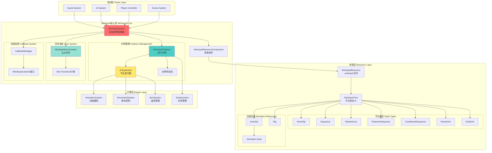

### 模块依赖关系图

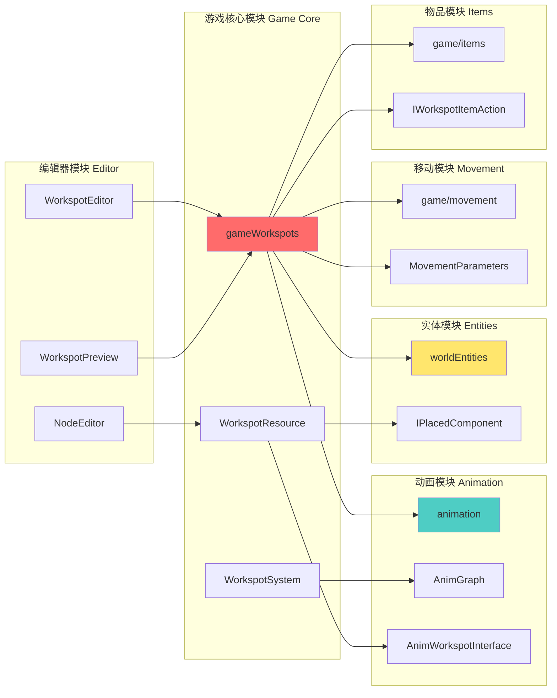

---

## 详细类图

### 完整节点类继承体系

```mermaid
classDiagram
    class ISerializable {
        <<RTTI Base>>
        +OnPreSave()
        +OnPostLoad()
        +OnPropertyPostChange()
    }

    class IEntry {
        <<abstract>>
        +WorkEntryId m_id
        +Uint32 m_flags
        +CreateIterator(context) EntryIterator*
        +ContainEntry(id) Bool
        +GetFlags() Uint32
        +ForEachAnimation(function) void
        +ForEachNode(function) void
        +GetFriendlyName() String
        +CreateCopy() THandle~IEntry~
    }

    class IContainerEntry {
        <<abstract>>
        +CName m_idleAnim
        +DynArray~IEntry~ m_list
        +ContainEntry(id) Bool
        +ForEachAnimation(function) void
        +ForEachNode(function) void
    }

    class AnimClip {
        +CName m_animName
        +Float m_blendOutTime
        +CreateIterator(context)
        +ForEachAnimation(function)
        +GetFriendlyName() String
    }

    class MotionAnimClip {
        +CreateIterator(context)
        +GetFriendlyName() String
    }

    class SyncAnimClip {
        +CName m_slotName
        +Transform m_syncOffset
        +CreateIterator(context)
        +GetFriendlyName() String
    }

    class AnimClipWithItem {
        +DynArray~IWorkspotItemAction~ m_itemActions
        +CreateIterator(context)
        +GetFriendlyName() String
    }

    class Sequence {
        +Bool m_previousLoopInfinitely
        +Bool m_loopInfinitely
        +WorkspotCategory m_category
        +CreateIterator(context)
        +GetFriendlyName() String
        +OnPropertyMissing(name, value) Bool
    }

    class ReactionSequence {
        +DynArray~RecordID~ m_reactionTypes
        +Float m_forcedBlendIn
        +Float m_facialKeyWeight
        +CName m_mainEmotionalState
        +CName m_emotionalExpression
        +CName m_facialIdleMaleAnimation
        +CName m_facialIdleKey_MaleAnimation
        +CName m_facialIdleFemaleAnimation
        +CName m_facialIdleKey_FemaleAnimation
        +CreateIterator(context)
        +OnPropertyPostChange(path, old, new)
        +OnPropertyMissing(name, value) Bool
        +ContainsReaction(name) Bool
        +FillFacialAnim(isFemale, outData)
        +EDITOR_SetFacial(state, expression, weight)
    }

    class ConditionalSequence {
        -LogicalOperation m_multipleConditionOperator
        -DynArray~IWorkspotCondition~ m_conditionList
        +GetFriendlyName() String
        +CreateIterator(context)
        +OnPropertyMissing(name, value) Bool
        +OnPropertyPostChange(path, old, new)
        +GetCustomEditableProperties(props)
        +CheckConditions(context) Bool
    }

    class RandomList {
        +Int8 m_minClips
        +Int8 m_maxClips
        +Int8 m_dontRepeatLastAnims
        +Float m_pauseBetweenLength
        +Float m_pauseLengthDeviation
        +Float m_pauseBlendOutTime
        +DynArray~Float~ m_weights
        +OnPostLoad(context)
        +CreateIterator(context)
        +OnPropertyTypeMismatch(name, prop, value) Bool
        +GetFriendlyName() String
    }

    class Selector {
        +CreateIterator(context)
        +GetFriendlyName() String
    }

    class EntryAnim {
        +CName m_animName
        +CName m_idleAnim
        +CName m_slotName
        +Float m_blendOutTime
        +Bool m_isSynchronized
        +Transform m_syncOffset
        +MovementType m_movementType
        +MovementOrientationType m_orientationType
        +CreateIterator(context)
        +GetFlags() Uint32
        +ForEachAnimation(function)
        +GetFriendlyName() String
        +AllowSync(asMaster) Bool
    }

    class SyncMasterEntryAnim {
        +GetFriendlyName() String
        +AllowSync(asMaster) Bool
    }

    class ExitAnim {
        +CName m_animName
        +CName m_slotName
        +CName m_idleAnim
        +Bool m_isSynchronized
        +Bool m_stayOnNavmesh
        +Bool m_snapZToNavmesh
        +Bool m_disableRandomExit
        +Transform m_syncOffset
        +MovementType m_movementType
        +GetMovementType() MovementType
        +GetMovementOrientationType() MovementOrientationType
        +CreateIterator(context)
        +GetFlags() Uint32
        +ForEachAnimation(function)
        +GetFriendlyName() String
        +GetCustomEditableProperties(props)
        +ReadCustomEditableProperty(ctx, name, path, value) Bool
        +WriteCustomEditableProperty(ctx, name, path, value) Bool
    }

    class FastExit {
        +CName m_animName
        +Float m_forcedBlendIn
        +MovementType m_movementType
        +GetMovementType() MovementType
        +GetMovementOrientationType() MovementOrientationType
        +CreateIterator(context)
        +ForEachAnimation(function)
        +GetFriendlyName() String
    }

    class PauseClip {
        +Float m_timeMin
        +Float m_timeMax
        +Float m_blendOutTime
        +CreateIterator(context)
        +GetFriendlyName() String
    }

    class TagNode {
        +CName m_tag
        +CreateIterator(context)
        +GetFriendlyName() String
    }

    class LookAtDrivenTurn {
        +CName m_turnAnimName
        +Int32 m_turnAngle
        +Float m_blendTime
        +OnPropertyPostChange(path, old, new)
        +CreateIterator(context)
        +ForEachAnimation(function)
        +GetFriendlyName() String
        -ExtractTurnAngleFromAnimationName() Int32
    }

    ISerializable <|-- IEntry
    IEntry <|-- IContainerEntry
    IEntry <|-- AnimClip
    IEntry <|-- EntryAnim
    IEntry <|-- ExitAnim
    IEntry <|-- FastExit
    IEntry <|-- PauseClip
    IEntry <|-- TagNode
    IEntry <|-- LookAtDrivenTurn

    AnimClip <|-- MotionAnimClip
    AnimClip <|-- SyncAnimClip
    AnimClip <|-- AnimClipWithItem

    IContainerEntry <|-- Sequence
    IContainerEntry <|-- RandomList

    Sequence <|-- ReactionSequence
    Sequence <|-- ConditionalSequence

    RandomList <|-- Selector

    EntryAnim <|-- SyncMasterEntryAnim
```

### WorkspotSystem核心类图

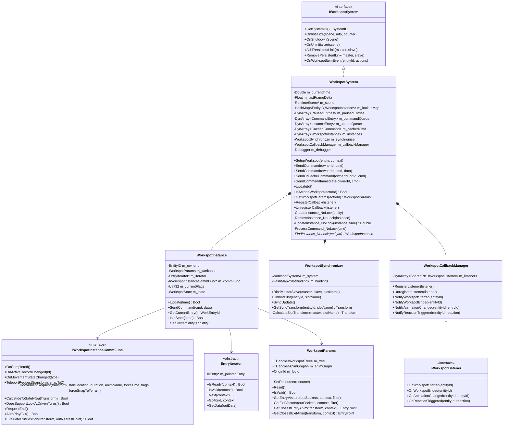

### 资源类图

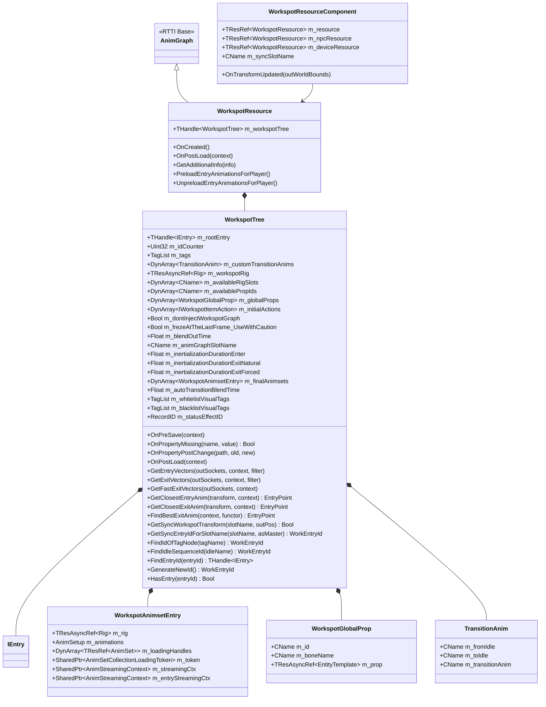

---

## 数据流图

### 从编辑器到运行时完整数据流

```mermaid
flowchart TB
    subgraph "编辑阶段 Authoring Phase"
        START([设计师开始])
        EDIT[Workspot编辑器<br/>可视化树编辑]
        ADD_NODE[添加节点<br/>AnimClip/Sequence/etc]
        CONFIG[配置参数<br/>动画名/权重/条件]
        PREVIEW[实时预览<br/>动画播放测试]
        VALIDATE[验证<br/>检查动画存在性]
    end

    subgraph "编译阶段 Compilation Phase"
        SAVE[保存.workspot文件]
        COMPILE[资源编译器]
        GEN_INDEX[生成查询索引<br/>EntryId映射]
        REF_ANIM[引用AnimSet资源]
        OPTIMIZE[优化节点树<br/>合并/剪枝]
    end

    subgraph "运行时加载 Runtime Loading"
        LOAD[资源加载器]
        CACHE[资源缓存池]
        PARSE[解析节点树]
        BUILD_TREE[构建IEntry树]
        LOAD_ANIM[异步加载AnimSet]
    end

    subgraph "场景放置 Scene Placement"
        PLACE[关卡设计师放置<br/>WorkspotResourceComponent]
        SET_TRANS[设置Transform]
        SET_SYNC[配置同步槽]
        ASSIGN_RES[分配资源引用<br/>player/npc/device]
    end

    subgraph "实例化 Instantiation"
        TRIGGER[触发事件<br/>AI/Quest/Player]
        CREATE_INST[WorkspotSystem::CreateInstance]
        CHECK_COND[检查条件<br/>Rig/Gender/Cover]
        CREATE_ITER[CreateIterator<br/>根据节点类型]
        INIT_STATE[初始化状态机]
    end

    subgraph "执行 Execution"
        PLAY[开始播放]
        ITER_NEXT[Iterator::Next()]
        GET_DATA[GetData<br/>动画名/混合时间]
        PLAY_ANIM[AnimationSystem::PlayAnimation]
        UPDATE[每帧Update]
        CHECK_EVENT[检查事件<br/>完成/中断/反应]
    end

    subgraph "同步 Synchronization"
        BIND[绑定Master/Slave]
        CALC_SLOT[计算Slot变换]
        SYNC_UPDATE[同步更新<br/>时间/位置]
    end

    subgraph "回调 Callbacks"
        NOTIFY[通知监听器]
        QUEST_CB[Quest回调]
        AI_CB[AI回调]
        UI_CB[UI回调]
    end

    START --> EDIT
    EDIT --> ADD_NODE
    ADD_NODE --> CONFIG
    CONFIG --> PREVIEW
    PREVIEW --> VALIDATE
    VALIDATE --> SAVE

    SAVE --> COMPILE
    COMPILE --> GEN_INDEX
    COMPILE --> REF_ANIM
    COMPILE --> OPTIMIZE

    OPTIMIZE --> LOAD
    LOAD --> CACHE
    CACHE --> PARSE
    PARSE --> BUILD_TREE
    BUILD_TREE --> LOAD_ANIM

    BUILD_TREE --> PLACE
    PLACE --> SET_TRANS
    PLACE --> SET_SYNC
    PLACE --> ASSIGN_RES

    ASSIGN_RES --> TRIGGER
    TRIGGER --> CREATE_INST
    CREATE_INST --> CHECK_COND
    CHECK_COND --> CREATE_ITER
    CREATE_ITER --> INIT_STATE

    INIT_STATE --> PLAY
    PLAY --> ITER_NEXT
    ITER_NEXT --> GET_DATA
    GET_DATA --> PLAY_ANIM
    PLAY_ANIM --> UPDATE
    UPDATE --> CHECK_EVENT
    CHECK_EVENT --> ITER_NEXT

    PLAY --> BIND
    BIND --> CALC_SLOT
    CALC_SLOT --> SYNC_UPDATE
    SYNC_UPDATE --> UPDATE

    UPDATE --> NOTIFY
    NOTIFY --> QUEST_CB
    NOTIFY --> AI_CB
    NOTIFY --> UI_CB

    style EDIT fill:#ffd3b6
    style CREATE_INST fill:#ffaaa5
    style PLAY fill:#ff8b94
    style SYNC_UPDATE fill:#4ecdc4
```

### 命令流图

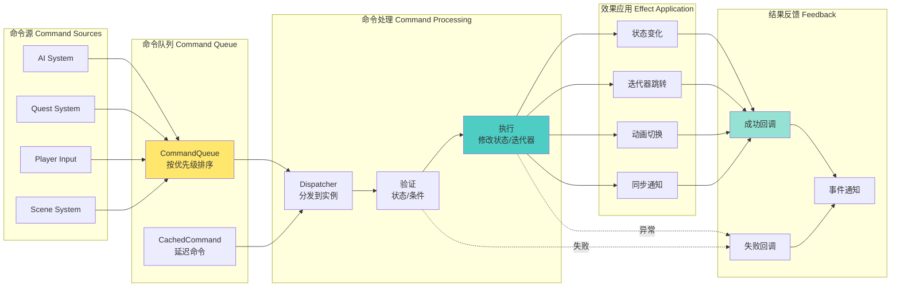

---

## 执行流程图

### 完整Workspot生命周期流程

```mermaid
flowchart TD
    START([开始]) --> REQ_SETUP{收到SetupWorkspot请求}

    REQ_SETUP --> LOAD_RES[加载WorkspotResource]
    LOAD_RES --> PARSE_TREE[解析WorkspotTree]
    PARSE_TREE --> CHECK_RES{资源有效?}

    CHECK_RES -->|无效| FAIL_LOAD[加载失败]
    CHECK_RES -->|有效| CREATE_PARAMS[创建WorkspotParams]

    CREATE_PARAMS --> BUILD_CONTEXT[构建CheckConditionContext<br/>Rig/Gender/Cover]
    BUILD_CONTEXT --> CHECK_ALLOW{检查是否允许使用?}

    CHECK_ALLOW -->|不允许| FAIL_COND[条件不满足]
    CHECK_ALLOW -->|允许| CREATE_INST[创建WorkspotInstance]

    CREATE_INST --> CREATE_ITER[CreateIterator<br/>根据RootEntry类型]
    CREATE_ITER --> INIT_ITER{迭代器初始化}

    INIT_ITER -->|失败| FAIL_ITER[迭代器创建失败]
    INIT_ITER -->|成功| WAIT_CMD[等待CMD_Play]

    WAIT_CMD --> RCV_PLAY{收到CMD_Play?}
    RCV_PLAY -->|否| WAIT_CMD
    RCV_PLAY -->|是| CHECK_ENTRY{有EntryAnim?}

    CHECK_ENTRY -->|有| PLAY_ENTRY[播放EntryAnim<br/>移动到Workspot位置]
    CHECK_ENTRY -->|无| TELEPORT[传送到Workspot位置]

    PLAY_ENTRY --> WAIT_ENTRY{等待动画完成}
    WAIT_ENTRY --> ENTRY_DONE[到达位置]
    TELEPORT --> ENTRY_DONE

    ENTRY_DONE --> GET_FIRST[Iterator::GetData<br/>获取第一个动作]
    GET_FIRST --> PLAY_FIRST[播放动画/执行动作]

    PLAY_FIRST --> MAIN_LOOP{主循环}

    MAIN_LOOP --> UPDATE[每帧Update]
    UPDATE --> CHECK_ANIM{动画完成?}

    CHECK_ANIM -->|否| CHECK_INTERRUPT{中断条件?}
    CHECK_ANIM -->|是| ITER_NEXT[Iterator::Next]

    ITER_NEXT --> GET_NEXT[GetData<br/>下一个动作]
    GET_NEXT --> PLAY_NEXT[播放下一个动画]
    PLAY_NEXT --> MAIN_LOOP

    CHECK_INTERRUPT -->|触发| HANDLE_INT[处理中断]
    CHECK_INTERRUPT -->|否| MAIN_LOOP

    HANDLE_INT --> INT_TYPE{中断类型}
    INT_TYPE -->|CMD_FastExit| FAST_EXIT[查找FastExit节点]
    INT_TYPE -->|CMD_SlowExit| SLOW_EXIT[查找ExitAnim节点]
    INT_TYPE -->|Reaction| PLAY_REACTION[播放反应动画]
    INT_TYPE -->|CMD_Stop| FORCE_STOP[强制停止]

    FAST_EXIT --> FIND_FAST{找到FastExit?}
    FIND_FAST -->|是| PLAY_FAST[播放快速退出]
    FIND_FAST -->|否| TELEPORT_OUT[传送离开]

    SLOW_EXIT --> FIND_SLOW{找到ExitAnim?}
    FIND_SLOW -->|是| PLAY_SLOW[播放慢速退出]
    FIND_SLOW -->|否| FAST_EXIT

    PLAY_REACTION --> WAIT_REACT{反应完成?}
    WAIT_REACT --> RESUME[恢复主循环]
    RESUME --> MAIN_LOOP

    PLAY_FAST --> WAIT_EXIT{等待退出完成}
    PLAY_SLOW --> WAIT_EXIT
    TELEPORT_OUT --> COMPLETE
    FORCE_STOP --> COMPLETE

    WAIT_EXIT --> COMPLETE[完成]

    COMPLETE --> NOTIFY[通知回调<br/>OnWorkspotEnded]
    NOTIFY --> CLEANUP[清理资源]
    CLEANUP --> DESTROY[销毁实例]

    FAIL_LOAD --> ERROR_HANDLE[错误处理]
    FAIL_COND --> ERROR_HANDLE
    FAIL_ITER --> ERROR_HANDLE
    ERROR_HANDLE --> END([结束])

    DESTROY --> END

    style CREATE_INST fill:#4ecdc4
    style MAIN_LOOP fill:#ffe66d
    style COMPLETE fill:#95e1d3
    style ERROR_HANDLE fill:#ff8b94
```

### RandomList选择算法流程

```mermaid
flowchart TD
    START([RandomList::Next调用]) --> GET_WEIGHTS[获取权重数组]
    GET_WEIGHTS --> GET_HISTORY[获取历史记录]

    GET_HISTORY --> CHECK_HISTORY{历史记录数 >= dontRepeatLastAnims?}

    CHECK_HISTORY -->|是| FILTER[过滤候选<br/>排除历史动画]
    CHECK_HISTORY -->|否| ALL_CAND[所有动画都是候选]

    FILTER --> CALC_TOTAL[计算过滤后总权重]
    ALL_CAND --> CALC_TOTAL

    CALC_TOTAL --> GEN_RAND[生成随机数<br/>0 to totalWeight]
    GEN_RAND --> ACCUMULATE[累加权重]

    ACCUMULATE --> CHECK_RANGE{随机数在当前范围?}
    CHECK_RANGE -->|否| NEXT_ITEM[下一个候选]
    NEXT_ITEM --> ACCUMULATE

    CHECK_RANGE -->|是| SELECT[选中当前动画]

    SELECT --> UPDATE_HIST[更新历史记录<br/>pushBack(selected)]
    UPDATE_HIST --> TRIM_HIST{历史数 > MAX_HISTORY?}

    TRIM_HIST -->|是| POP_OLD[移除最老记录]
    TRIM_HIST -->|否| DONE

    POP_OLD --> DONE[完成]
    DONE --> RETURN[返回选中的动画]

    RETURN --> END([结束])

    style SELECT fill:#4ecdc4
    style UPDATE_HIST fill:#ffe66d
```

---

## 状态机图

### WorkspotInstance状态机

```mermaid
stateDiagram-v2
    [*] --> Uninitialized

    Uninitialized --> Initializing: SetupWorkspot()
    Initializing --> LoadingResource: 加载资源
    LoadingResource --> CreatingIterator: 资源就绪
    CreatingIterator --> CheckingConditions: 迭代器创建

    CheckingConditions --> Ready: 条件满足
    CheckingConditions --> Failed: 条件不满足

    Ready --> MovingToEntry: CMD_Play + 有EntryAnim
    Ready --> InPosition: CMD_Play + 无EntryAnim(传送)

    MovingToEntry --> InPosition: 到达位置

    InPosition --> PlayingIdle: 开始播放idle
    PlayingIdle --> PlayingSequence: 进入序列

    PlayingSequence --> PlayingSequence: Iterator::Next
    PlayingSequence --> PlayingReaction: Reaction触发
    PlayingSequence --> PlayingExit: CMD_SlowExit
    PlayingSequence --> PlayingFastExit: CMD_FastExit

    PlayingReaction --> PlayingSequence: 反应完成(返回主线)
    PlayingReaction --> PlayingFastExit: CMD_FastExit(中断反应)

    PlayingSequence --> Paused: CMD_Pause
    Paused --> PlayingSequence: CMD_Unpause
    Paused --> Stopped: CMD_Stop

    PlayingExit --> Completed: 退出动画完成
    PlayingFastExit --> Completed: 快速退出完成

    PlayingSequence --> Stopped: CMD_Stop
    PlayingReaction --> Stopped: CMD_Stop

    Completed --> Disposing: 清理资源
    Stopped --> Disposing: 清理资源
    Failed --> Disposing: 清理资源

    Disposing --> [*]

    note right of CheckingConditions
        检查:
        - Rig类型
        - Gender
        - Cover类型
    end note

    note right of PlayingSequence
        主要状态:
        - 播放动画
        - 处理命令
        - 检查中断
        - 同步更新
    end note

    note right of PlayingReaction
        保存状态
        执行反应
        恢复状态
    end note
```

### 同步状态机

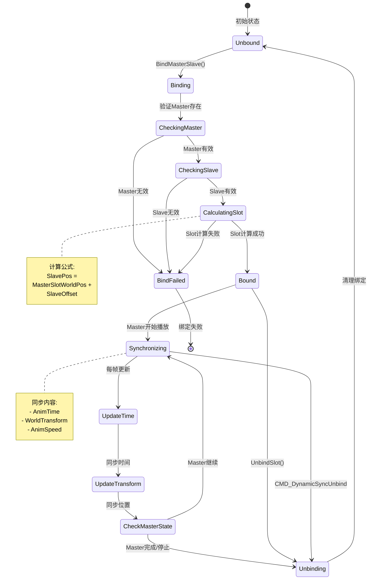

---

## 交互时序图

### AI使用Workspot完整时序

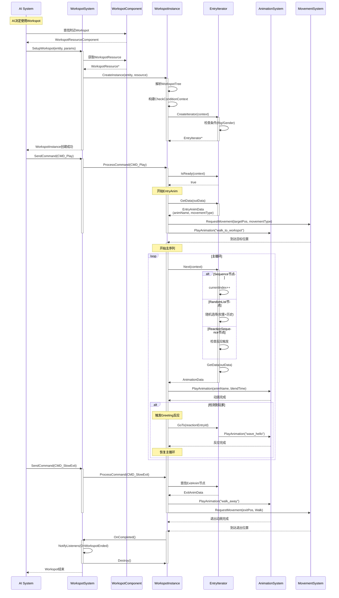

### 同步Workspot时序（握手示例）

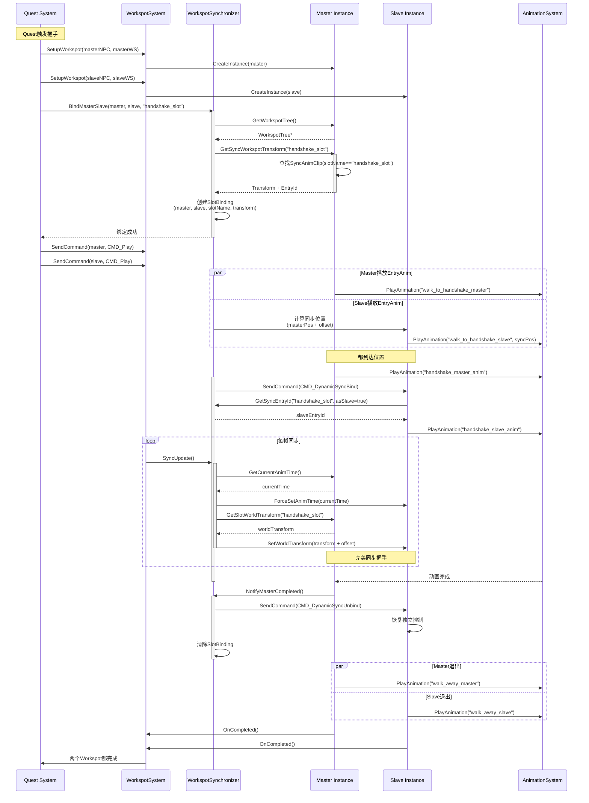

### Scene系统使用Workspot时序

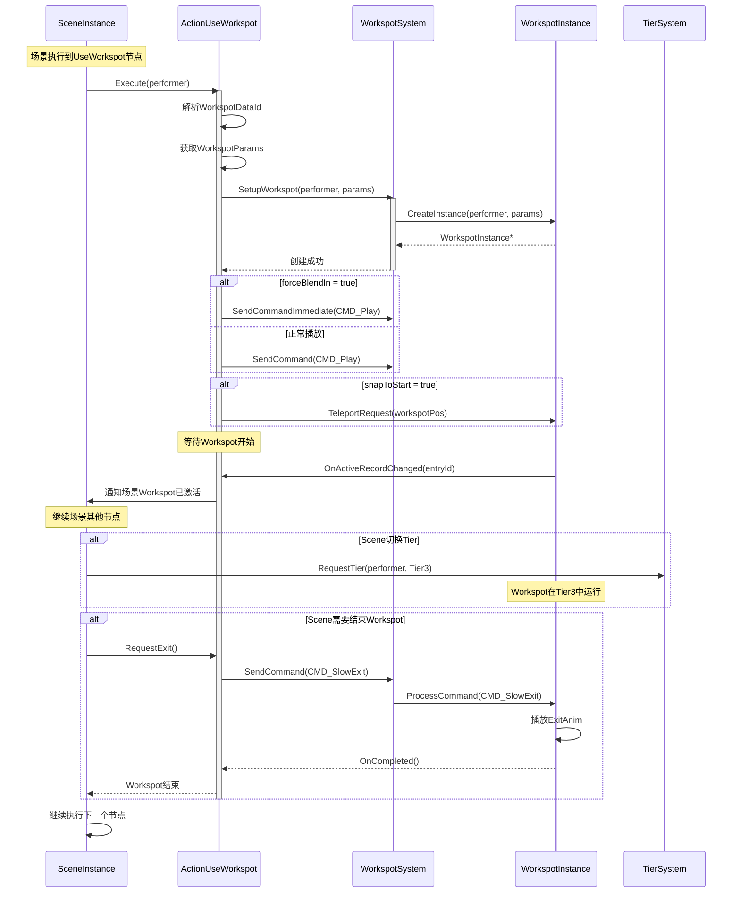

---

## 总结

本文档提供了Workspot系统的完整架构图集，包括：

1. **系统架构图** - 展示整体分层和模块关系
2. **详细类图** - 完整的类继承体系和关联关系
3. **数据流图** - 从编辑器到运行时的数据流转
4. **执行流程图** - 各种操作的详细流程
5. **状态机图** - 实例和同步的状态转换
6. **交互时序图** - 系统间的协作序列

这些图表可以帮助理解：
- Workspot如何设计和实现
- 各组件如何协作
- 数据如何流转
- 运行时如何执行

配合主文档《Workspot系统完整技术文档.md》使用，可以全面掌握Workspot系统的架构和实现细节。

---

*本文档基于Cyberpunk 2077源代码分析编写*
*使用Mermaid图表语法*
*推荐使用支持Mermaid的Markdown查看器*
*文档版本：1.0*
*生成日期：2026-02-13*
