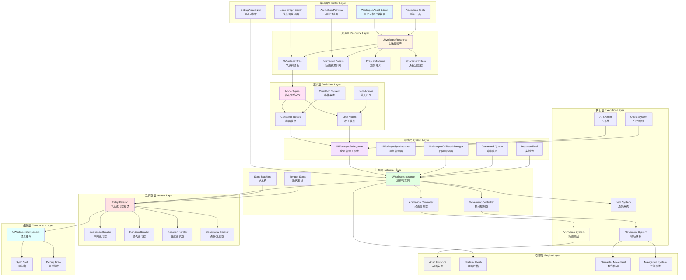
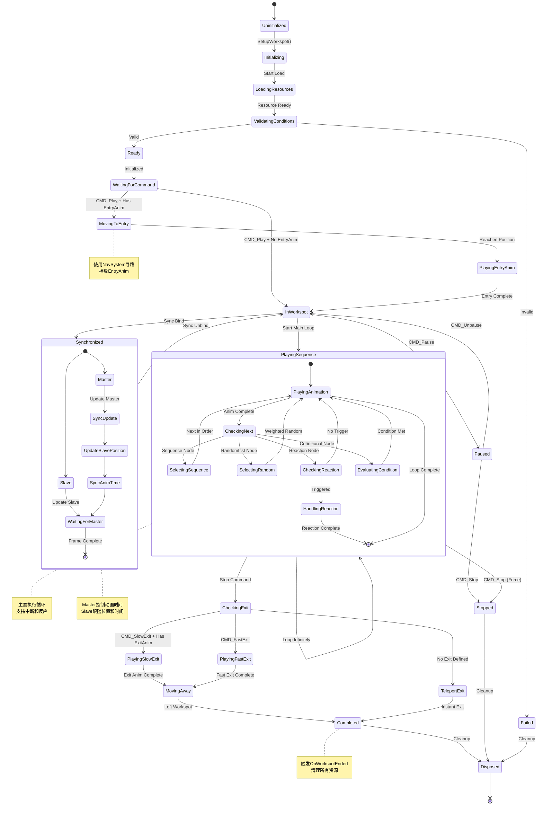
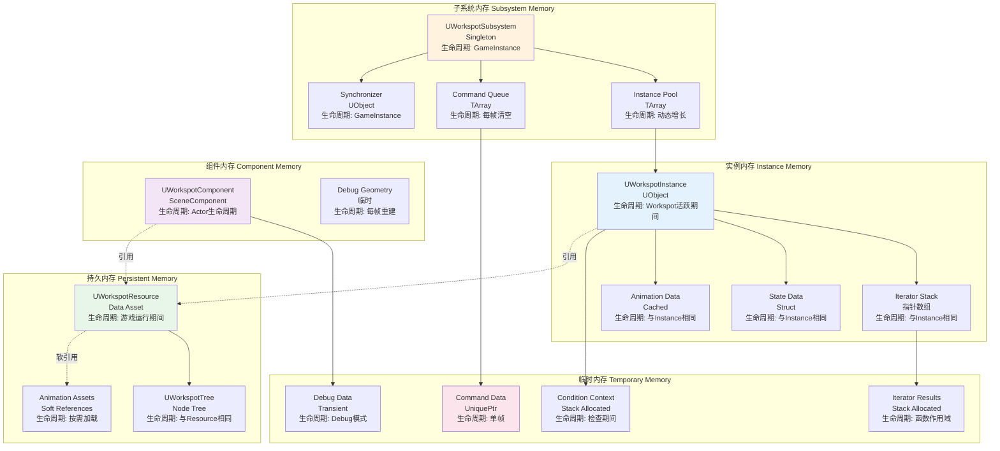
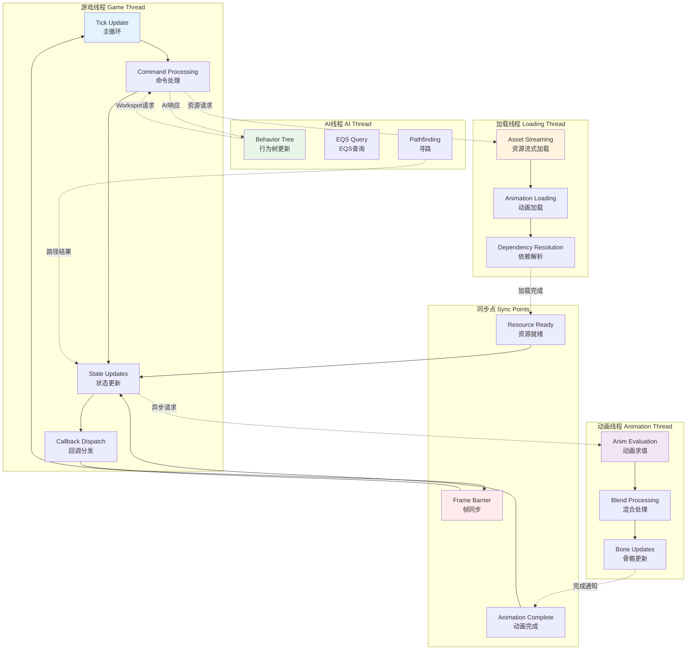

# Workspot系统完整程序框架图集
> UE5 Workspot数据资产系统 - 详细架构与实现指南

**文档版本**: 1.0
**创建日期**: 2026-02-13
**基于**: 赛博朋克2077 Workspot系统分析

---

## 📋 文档目录

1. [完整类继承体系图](#1-完整类继承体系图)
2. [系统架构分层图](#2-系统架构分层图)
3. [运行时执行流程图](#3-运行时执行流程图)
4. [数据流和依赖关系图](#4-数据流和依赖关系图)
5. [模块依赖关系图](#5-模块依赖关系图)
6. [状态机详细图](#6-状态机详细图)
7. [内存布局和对象生命周期图](#7-内存布局和对象生命周期图)
8. [线程和异步处理图](#8-线程和异步处理图)

---

## 1. 完整类继承体系图

### 说明
此图展示了Workspot系统所有核心类的继承关系、组合关系和依赖关系。包含：
- **数据资产层**: UWorkspotResource, UWorkspotTree
- **节点基类层**: UWorkspotEntry及其所有子类
- **迭代器层**: UWorkspotEntryIterator及其实现
- **运行时系统层**: 子系统、实例、同步器等
- **组件层**: UWorkspotComponent
- **条件系统**: 各种条件判断类

### 类图

```mermaid
classDiagram
    %% ========== 数据资产层 ==========
    class UPrimaryDataAsset {
        <<UE Engine>>
    }

    class UWorkspotResource {
        +UWorkspotTree* WorkspotTree
        +TArray~TSoftObjectPtr~AnimSequence~~ AnimSet
        +TArray~FWorkspotPropDefinition~ GlobalProps
        +TArray~FWorkspotCharacterFilter~ SupportedTypes
        +ValidateResource() bool
        +GetAnimationByName(FName) UAnimSequence*
    }

    class UWorkspotTree {
        +UWorkspotEntry* RootEntry
        +FName TreeId
        +TMap~FName,UWorkspotEntry*~ EntryCache
        +FindEntryById(FName) UWorkspotEntry*
        +ValidateAnimations() void
        +BuildEntryCache() void
    }

    %% ========== 节点基类层 ==========
    class UObject {
        <<UE Engine>>
    }

    class UWorkspotEntry {
        <<abstract>>
        #FName EntryId
        #uint32 Flags
        #FLinearColor EditorColor
        +CreateIterator(Context) UWorkspotEntryIterator*
        +ContainsEntry(FName) bool
        +GetFriendlyName() FString
        +ForEachAnimation(Function) void
        +SupportsRig(Skeleton) bool
    }

    class UWorkspotContainerEntry {
        <<abstract>>
        #TArray~UWorkspotEntry*~ Children
        #FName IdleAnimName
        +AddChild(UWorkspotEntry*) void
        +RemoveChild(int32) void
        +GetChildCount() int32
        +ForEachChild(Function) void
    }

    %% ========== 叶子节点类 ==========
    class UWorkspotAnimClip {
        +FName AnimName
        +float BlendInTime
        +float BlendOutTime
        +bool bLoopAnimation
        +float PlayRate
        +FName SlotName
        +CreateIterator() UWorkspotAnimClipIterator*
    }

    class UWorkspotMotionAnimClip {
        +FVector TargetOffset
        +bool bUseRootMotion
        +CreateIterator() UWorkspotMotionIterator*
    }

    class UWorkspotSyncAnimClip {
        +FName SyncSlotName
        +FTransform SyncOffset
        +bool bIsMaster
        +CreateIterator() UWorkspotSyncIterator*
    }

    class UWorkspotAnimClipWithItem {
        +TArray~FWorkspotItemAction~ ItemActions
        +CreateIterator() UWorkspotItemIterator*
    }

    class UWorkspotEntryAnim {
        +FName AnimName
        +FName IdleAnimName
        +EWorkspotMovementType MovementType
        +EWorkspotOrientationType OrientationType
        +bool bIsSynchronized
        +float MovementSpeed
        +CreateIterator() UWorkspotEntryAnimIterator*
    }

    class UWorkspotExitAnim {
        +FName AnimName
        +EWorkspotMovementType MovementType
        +bool bStayOnNavmesh
        +bool bSnapZToNavmesh
        +FVector ExitOffset
        +CreateIterator() UWorkspotExitAnimIterator*
    }

    class UWorkspotFastExit {
        +FName AnimName
        +float ForcedBlendIn
        +EWorkspotMovementType MovementType
        +CreateIterator() UWorkspotFastExitIterator*
    }

    class UWorkspotPauseClip {
        +float TimeMin
        +float TimeMax
        +float BlendOutTime
        +CreateIterator() UWorkspotPauseIterator*
    }

    class UWorkspotTagNode {
        +FName Tag
        +CreateIterator() UWorkspotTagIterator*
    }

    %% ========== 容器节点类 ==========
    class UWorkspotSequence {
        +bool bLoopInfinitely
        +int32 LoopCount
        +EWorkspotCategory Category
        +CreateIterator() UWorkspotSequenceIterator*
    }

    class UWorkspotRandomList {
        +int32 MinClips
        +int32 MaxClips
        +int32 DontRepeatLastAnims
        +TArray~float~ Weights
        +bool bNormalizeWeights
        +CreateIterator() UWorkspotRandomListIterator*
        -NormalizeWeights() void
    }

    class UWorkspotSelector {
        +EWorkspotSelectionMode SelectionMode
        +CreateIterator() UWorkspotSelectorIterator*
    }

    class UWorkspotReactionSequence {
        +TArray~FName~ ReactionTypes
        +FName MainEmotionalState
        +FName EmotionalExpression
        +float FacialKeyWeight
        +float ReactionRadius
        +ContainsReaction(FName) bool
        +CreateIterator() UWorkspotReactionIterator*
    }

    class UWorkspotConditionalSequence {
        +ELogicalOperation MultipleConditionOperator
        +TArray~UWorkspotCondition*~ ConditionList
        +UWorkspotEntry* DefaultEntry
        +CheckConditions(Context) bool
        +CreateIterator() UWorkspotConditionalIterator*
    }

    %% ========== 迭代器层 ==========
    class UWorkspotEntryIterator {
        <<abstract>>
        #UWorkspotEntry* PointedEntry
        #FWorkspotContext Context
        +IsReady(Context) bool
        +IsValid(Context) bool
        +Next(Context) void
        +GoTo(FName, Context) bool
        +GetData(OutData) void
        +Reset() void
    }

    class UWorkspotAnimClipIterator {
        -FName CurrentAnim
        -float ElapsedTime
        +Next(Context) void
        +GetData(OutData) void
    }

    class UWorkspotSequenceIterator {
        -int32 CurrentIndex
        -int32 LoopCounter
        -UWorkspotEntryIterator* CurrentChildIterator
        +Next(Context) void
        +IsReady(Context) bool
    }

    class UWorkspotRandomListIterator {
        -int32 ClipsPlayed
        -TArray~int32~ PlayHistory
        -int32 CurrentSelection
        +Next(Context) void
        -SelectRandomChild() int32
        -CalculateWeightedRandom() int32
    }

    class UWorkspotReactionIterator {
        -FName ActiveReaction
        -bool bInReaction
        -UWorkspotEntryIterator* SavedIterator
        +CheckReactionTrigger() bool
        +Next(Context) void
    }

    class UWorkspotConditionalIterator {
        -UWorkspotEntryIterator* SelectedBranch
        +Next(Context) void
        -EvaluateConditions() int32
    }

    %% ========== 运行时系统层 ==========
    class UGameInstanceSubsystem {
        <<UE Engine>>
    }

    class UWorkspotSubsystem {
        -TArray~UWorkspotInstance*~ ActiveInstances
        -TMap~FGuid,UWorkspotInstance*~ InstanceLookup
        -TArray~FWorkspotCommandEntry~ CommandQueue
        -UWorkspotSynchronizer* Synchronizer
        -UWorkspotCallbackManager* CallbackManager
        +SetupWorkspot(Actor, Resource, Transform) UWorkspotInstance*
        +SendCommand(EntityId, Command, Data) bool
        +Tick(DeltaTime) void
        +IsActorInWorkspot(Actor) bool
        +GetWorkspotInstance(Actor) UWorkspotInstance*
        -ProcessCommandQueue() void
        -UpdateInstances(DeltaTime) void
        -PruneInvalidInstances() void
    }

    class UWorkspotInstance {
        -UWorkspotResource* WorkspotResource
        -UWorkspotEntryIterator* CurrentIterator
        -AActor* OwnerActor
        -EWorkspotState CurrentState
        -FTransform WorkspotTransform
        -float StateTimer
        -TArray~FWorkspotStateSnapshot~ StateStack
        +Update(DeltaTime) bool
        +ProcessCommand(Command, Data) void
        +GetCurrentEntryId() FName
        +IsInState(State) bool
        -TransitionToState(NewState) void
        -PlayCurrentAnimation() void
        -HandleMovement(DeltaTime) void
    }

    class UWorkspotSynchronizer {
        -TMap~FName,FWorkspotSyncBinding~ ActiveBindings
        -TArray~FWorkspotSyncSlot~ RegisteredSlots
        +BindMasterSlave(Master, Slave, SlotName) bool
        +UnbindSlot(EntityId, SlotName) void
        +SyncUpdate(DeltaTime) void
        +GetSyncTransform(Master, SlotName) FTransform
        -UpdateSlaveTransform(Binding) void
        -SynchronizeAnimTime(Binding) void
    }

    class UWorkspotCallbackManager {
        -TArray~TScriptInterface~IWorkspotListener~~ Listeners
        +RegisterListener(Listener) void
        +UnregisterListener(Listener) void
        +NotifyWorkspotStarted(EntityId, Resource) void
        +NotifyWorkspotEnded(EntityId) void
        +NotifyAnimationChanged(EntityId, EntryId) void
        +NotifyReactionTriggered(EntityId, ReactionType) void
    }

    %% ========== 组件层 ==========
    class USceneComponent {
        <<UE Engine>>
    }

    class UWorkspotComponent {
        +UWorkspotResource* WorkspotResource
        +FName SyncSlotName
        +bool bAutoActivate
        +bool bShowDebugInfo
        +FLinearColor DebugColor
        +RequestUse(Actor) bool
        +ReleaseWorkspot(Actor) void
        +GetWorkspotTransform() FTransform
        +OnComponentCreated() void
        #DrawDebugInfo() void
    }

    %% ========== 条件系统 ==========
    class UWorkspotCondition {
        <<abstract>>
        +EWorkspotConditionTest TestMode
        +Evaluate(Context) bool
    }

    class UWorkspotRigCondition {
        +TSoftObjectPtr~USkeleton~ RequiredSkeleton
        +Evaluate(Context) bool
    }

    class UWorkspotGenderCondition {
        +EWorkspotGender RequiredGender
        +Evaluate(Context) bool
    }

    class UWorkspotBodyTypeCondition {
        +EWorkspotBodyType RequiredBodyType
        +Evaluate(Context) bool
    }

    class UWorkspotTagCondition {
        +FGameplayTag RequiredTag
        +Evaluate(Context) bool
    }

    %% ========== 继承关系 ==========
    UPrimaryDataAsset <|-- UWorkspotResource
    UObject <|-- UWorkspotTree
    UObject <|-- UWorkspotEntry
    UObject <|-- UWorkspotEntryIterator
    UObject <|-- UWorkspotCondition
    UGameInstanceSubsystem <|-- UWorkspotSubsystem
    UObject <|-- UWorkspotInstance
    UObject <|-- UWorkspotSynchronizer
    UObject <|-- UWorkspotCallbackManager
    USceneComponent <|-- UWorkspotComponent

    UWorkspotEntry <|-- UWorkspotContainerEntry
    UWorkspotEntry <|-- UWorkspotAnimClip
    UWorkspotEntry <|-- UWorkspotEntryAnim
    UWorkspotEntry <|-- UWorkspotExitAnim
    UWorkspotEntry <|-- UWorkspotFastExit
    UWorkspotEntry <|-- UWorkspotPauseClip
    UWorkspotEntry <|-- UWorkspotTagNode

    UWorkspotAnimClip <|-- UWorkspotMotionAnimClip
    UWorkspotAnimClip <|-- UWorkspotSyncAnimClip
    UWorkspotAnimClip <|-- UWorkspotAnimClipWithItem

    UWorkspotContainerEntry <|-- UWorkspotSequence
    UWorkspotContainerEntry <|-- UWorkspotRandomList
    UWorkspotRandomList <|-- UWorkspotSelector
    UWorkspotSequence <|-- UWorkspotReactionSequence
    UWorkspotSequence <|-- UWorkspotConditionalSequence

    UWorkspotEntryIterator <|-- UWorkspotAnimClipIterator
    UWorkspotEntryIterator <|-- UWorkspotSequenceIterator
    UWorkspotEntryIterator <|-- UWorkspotRandomListIterator
    UWorkspotEntryIterator <|-- UWorkspotReactionIterator
    UWorkspotEntryIterator <|-- UWorkspotConditionalIterator

    UWorkspotCondition <|-- UWorkspotRigCondition
    UWorkspotCondition <|-- UWorkspotGenderCondition
    UWorkspotCondition <|-- UWorkspotBodyTypeCondition
    UWorkspotCondition <|-- UWorkspotTagCondition

    %% ========== 关联关系 ==========
    UWorkspotResource "1" *-- "1" UWorkspotTree : contains
    UWorkspotTree "1" *-- "1" UWorkspotEntry : root
    UWorkspotContainerEntry "1" *-- "*" UWorkspotEntry : children
    UWorkspotEntry "1" ..> "1" UWorkspotEntryIterator : creates
    UWorkspotSubsystem "1" *-- "*" UWorkspotInstance : manages
    UWorkspotSubsystem "1" *-- "1" UWorkspotSynchronizer : uses
    UWorkspotSubsystem "1" *-- "1" UWorkspotCallbackManager : uses
    UWorkspotInstance "1" *-- "1" UWorkspotEntryIterator : current
    UWorkspotInstance "*" --> "1" UWorkspotResource : references
    UWorkspotComponent "*" --> "1" UWorkspotResource : references
    UWorkspotConditionalSequence "1" *-- "*" UWorkspotCondition : conditions
```



### 关键类说明

#### 数据资产类
- **UWorkspotResource**: 主数据资产，包含完整的Workspot定义
- **UWorkspotTree**: 节点树结构，管理节点层次关系

#### 节点类型
- **UWorkspotEntry**: 所有节点的抽象基类
- **UWorkspotContainerEntry**: 容器节点基类，可包含子节点
- **UWorkspotAnimClip**: 基础动画片段节点
- **UWorkspotSequence**: 顺序执行容器
- **UWorkspotRandomList**: 随机选择容器
- **UWorkspotReactionSequence**: 反应系统容器
- **UWorkspotConditionalSequence**: 条件判断容器

#### 迭代器类型
- **UWorkspotEntryIterator**: 迭代器基类
- 各节点类型都有对应的迭代器实现

#### 运行时系统
- **UWorkspotSubsystem**: 全局管理子系统
- **UWorkspotInstance**: 单个Workspot实例
- **UWorkspotSynchronizer**: 同步控制器
- **UWorkspotCallbackManager**: 事件回调管理器

---

## 2. 系统架构分层图

### 说明
此图展示了Workspot系统的完整分层架构，从编辑器层到引擎层的数据流和依赖关系。

### 架构图



### 层次说明

#### 1. 编辑器层 (Editor Layer)
- 提供可视化编辑工具
- 资产验证和预览
- 调试可视化

#### 2. 资源层 (Resource Layer)
- 存储Workspot定义
- 管理动画资源引用
- 角色类型过滤

#### 3. 定义层 (Definition Layer)
- 节点类型定义
- 条件系统
- 道具行为定义

#### 4. 系统层 (System Layer)
- 全局子系统管理
- 实例池管理
- 命令队列处理
- 同步控制

#### 5. 实例层 (Instance Layer)
- 运行时实例管理
- 状态机控制
- 动画和移动控制

#### 6. 迭代器层 (Iterator Layer)
- 节点树遍历
- 各种迭代策略实现

#### 7. 组件层 (Component Layer)
- 场景中的Workspot表示
- 同步槽管理
- 调试绘制

#### 8. 执行层 (Execution Layer)
- 与UE各系统集成
- 动画播放
- 角色移动
- AI和Quest集成

#### 9. 引擎层 (Engine Layer)
- UE核心系统
- 动画系统
- 导航系统

---

## 3. 运行时执行流程图

### 说明
此时序图详细展示了从AI请求使用Workspot到完成退出的完整执行流程，包括所有关键步骤和系统交互。

### 时序图

```mermaid
sequenceDiagram
    autonumber

    participant AI as AI Controller
    participant WS as WorkspotSubsystem
    participant Comp as WorkspotComponent
    participant Inst as WorkspotInstance
    participant Iter as EntryIterator
    participant Node as WorkspotEntry
    participant Anim as Animation System
    participant Move as Movement System
    participant Sync as Synchronizer

    %% ========== 初始化阶段 ==========
    rect rgb(230, 240, 255)
    Note over AI,Sync: 阶段1: 初始化Workspot

    AI->>WS: SetupWorkspot(Actor, Resource, Transform)
    activate WS

    WS->>Comp: GetWorkspotComponent(Actor)
    Comp-->>WS: Component Reference

    WS->>WS: CreateInstance()
    WS->>Inst: Initialize(Resource, Actor, Transform)
    activate Inst

    Inst->>Node: GetRootEntry()
    Node-->>Inst: Root Node

    Inst->>Node: CreateIterator(Context)
    activate Node
    Node->>Iter: new Iterator(this, Context)
    activate Iter

    Iter->>Iter: CheckConditions(Context)
    Note right of Iter: 验证Rig/Gender/Body Type

    Iter-->>Node: Iterator Instance
    deactivate Iter
    Node-->>Inst: Iterator Ready
    deactivate Node

    Inst-->>WS: Instance Created
    deactivate Inst
    WS-->>AI: Instance ID
    deactivate WS
    end

    %% ========== 播放阶段 ==========
    rect rgb(255, 240, 230)
    Note over AI,Sync: 阶段2: 开始播放

    AI->>WS: SendCommand(CMD_Play)
    activate WS

    WS->>WS: AddToCommandQueue(CMD_Play)

    WS->>Inst: ProcessCommand(CMD_Play)
    activate Inst

    Inst->>Inst: TransitionToState(MovingToEntry)

    alt 有EntryAnim
        Inst->>Iter: GoTo(EntryAnimId)
        activate Iter
        Iter->>Iter: FindEntryById()
        Iter-->>Inst: Entry Found
        deactivate Iter

        Inst->>Iter: GetData(OutData)
        activate Iter
        Iter->>Node: ReadNodeData()
        Node-->>Iter: AnimName, Transform, etc.
        Iter-->>Inst: EntryData
        deactivate Iter

        Inst->>Move: MoveToLocation(WorkspotTransform)
        activate Move
        Inst->>Anim: PlayAnimation(EntryAnim)
        activate Anim

        loop Movement Update
            Move->>Move: UpdatePosition(DeltaTime)
            Move-->>Inst: Position Updated
        end

        Anim-->>Inst: Animation Complete
        deactivate Anim
        Move-->>Inst: Reached Target
        deactivate Move
    end

    Inst->>Inst: TransitionToState(InWorkspot)
    deactivate Inst
    deactivate WS
    end

    %% ========== 循环阶段 ==========
    rect rgb(240, 255, 240)
    Note over AI,Sync: 阶段3: 主循环执行

    loop Main Workspot Loop
        WS->>Inst: Update(DeltaTime)
        activate Inst

        Inst->>Inst: StateTimer += DeltaTime

        alt State: PlayingSequence
            Inst->>Anim: IsAnimationComplete()
            Anim-->>Inst: true

            Inst->>Iter: Next(Context)
            activate Iter

            alt Sequence Node
                Iter->>Iter: CurrentIndex++
                Iter->>Node: GetChild(CurrentIndex)
                Node-->>Iter: Next Child
            else RandomList Node
                Iter->>Iter: SelectWeightedRandom()
                Note right of Iter: 基于权重和历史选择
                Iter->>Iter: UpdateHistory(Selected)
            else Reaction Node
                Iter->>Iter: CheckReactionTrigger()
                alt Reaction Triggered
                    Iter->>Iter: SaveCurrentState()
                    Iter->>Iter: JumpToReaction()
                end
            end

            Iter->>Node: CreateChildIterator()
            Iter-->>Inst: Next Node Ready
            deactivate Iter

            Inst->>Iter: GetData(OutData)
            activate Iter
            Iter-->>Inst: Animation Data
            deactivate Iter

            Inst->>Anim: PlayAnimation(NextAnim)
            activate Anim
            Anim-->>Inst: Playing
            deactivate Anim

        else State: Synchronized
            Inst->>Sync: IsSyncMaster()
            activate Sync

            alt Is Master
                Sync->>Sync: UpdateSlavePosition()
                Sync->>Sync: SyncSlaveAnimTime()
            else Is Slave
                Sync->>Sync: GetMasterTransform()
                Sync->>Sync: ApplySyncOffset()
                Inst->>Move: SetWorldTransform(SyncTransform)
            end

            Sync-->>Inst: Sync Updated
            deactivate Sync
        end

        deactivate Inst
    end
    end

    %% ========== 退出阶段 ==========
    rect rgb(255, 245, 240)
    Note over AI,Sync: 阶段4: 退出Workspot

    AI->>WS: SendCommand(CMD_SlowExit)
    activate WS

    WS->>Inst: ProcessCommand(CMD_SlowExit)
    activate Inst

    Inst->>Iter: GoTo(ExitAnimId)
    activate Iter

    alt ExitAnim Found
        Iter->>Node: FindExitAnim()
        Node-->>Iter: Exit Node
        Iter-->>Inst: Exit Entry Ready

        Inst->>Iter: GetData(OutData)
        Iter-->>Inst: Exit Animation Data
    else No ExitAnim
        Inst->>Inst: FastExit()
    end

    deactivate Iter

    Inst->>Anim: PlayAnimation(ExitAnim)
    activate Anim
    Inst->>Move: MoveAwayFromWorkspot()
    activate Move

    Anim-->>Inst: Animation Complete
    deactivate Anim
    Move-->>Inst: Movement Complete
    deactivate Move

    Inst->>Inst: TransitionToState(Completed)

    Inst->>WS: NotifyCompleted()
    deactivate Inst

    WS->>WS: RemoveInstance(Inst)
    WS->>WS: CallbackManager.NotifyEnded()

    WS-->>AI: Workspot Ended
    deactivate WS
    end
```



### 执行阶段说明

#### 阶段1: 初始化 (步骤1-10)
1. AI请求设置Workspot
2. 子系统创建实例
3. 实例初始化并创建迭代器
4. 验证条件（Rig、性别、体型）
5. 返回实例ID给AI

#### 阶段2: 开始播放 (步骤11-24)
6. AI发送播放命令
7. 命令加入队列
8. 实例处理命令
9. 如果有EntryAnim，播放进入动画
10. 角色移动到Workspot位置

#### 阶段3: 主循环 (步骤25-45)
11. 每帧更新实例
12. 检查动画是否完成
13. 迭代器移动到下一节点
14. 根据节点类型执行不同逻辑
15. 播放下一个动画

#### 阶段4: 退出 (步骤46-58)
16. AI发送退出命令
17. 播放退出动画
18. 角色离开Workspot
19. 清理实例
20. 通知回调

---

## 4. 数据流和依赖关系图

### 说明
此图展示了数据在整个Workspot系统中的流动过程，从资产创作到运行时执行的完整数据流。

### 数据流图

```mermaid
graph LR
    subgraph "创作阶段 Authoring"
        A1[资产编辑器<br/>Asset Editor]
        A2[节点图编辑<br/>Node Graph]
        A3[动画配置<br/>Anim Config]
        A4[条件设置<br/>Conditions]
    end

    subgraph "编译阶段 Compilation"
        C1[资源序列化<br/>Serialization]
        C2[条件编译<br/>Condition Compile]
        C3[动画引用解析<br/>Anim References]
        C4[验证检查<br/>Validation]
    end

    subgraph "打包阶段 Packaging"
        P1[WorkspotResource<br/>.uasset]
        P2[动画资源<br/>Anim Assets]
        P3[依赖打包<br/>Dependencies]
    end

    subgraph "加载阶段 Loading"
        L1[异步加载器<br/>Async Loader]
        L2[资源缓存<br/>Resource Cache]
        L3[动画流式加载<br/>Anim Streaming]
    end

    subgraph "初始化阶段 Initialization"
        I1[WorkspotSubsystem<br/>初始化]
        I2[注册组件<br/>Register Components]
        I3[预加载资源<br/>Preload Resources]
    end

    subgraph "运行时阶段 Runtime"
        R1[创建实例<br/>Create Instance]
        R2[迭代器构建<br/>Build Iterator]
        R3[条件检查<br/>Check Conditions]
        R4[执行循环<br/>Execution Loop]
    end

    subgraph "执行细节 Execution Details"
        E1[动画播放<br/>Play Animation]
        E2[角色移动<br/>Move Character]
        E3[道具管理<br/>Manage Props]
        E4[同步控制<br/>Sync Control]
        E5[反应触发<br/>Trigger Reactions]
    end

    subgraph "引擎交互 Engine Interaction"
        EN1[AnimInstance<br/>动画实例]
        EN2[CharacterMovement<br/>移动组件]
        EN3[SkeletalMesh<br/>骨骼网格]
        EN4[NavSystem<br/>导航系统]
    end

    A1 --> A2
    A2 --> A3
    A2 --> A4

    A2 --> C1
    A3 --> C3
    A4 --> C2
    C1 --> C4
    C3 --> C4
    C2 --> C4

    C4 --> P1
    C3 --> P2
    P1 --> P3
    P2 --> P3

    P3 --> L1
    L1 --> L2
    L1 --> L3

    L2 --> I1
    I1 --> I2
    I1 --> I3

    I3 --> R1
    R1 --> R2
    R2 --> R3
    R3 --> R4

    R4 --> E1
    R4 --> E2
    R4 --> E3
    R4 --> E4
    R4 --> E5

    E1 --> EN1
    E2 --> EN2
    E3 --> EN3
    E4 --> EN2
    E2 --> EN4

    style A1 fill:#e3f2fd
    style C1 fill:#fff3e0
    style P1 fill:#f3e5f5
    style L1 fill:#e8f5e9
    style I1 fill:#fce4ec
    style R1 fill:#fff9c4
    style E1 fill:#ffebee
    style EN1 fill:#eceff1
```



### 数据流说明

#### 创作阶段
- 使用资产编辑器创建Workspot
- 配置节点图、动画和条件
- 可视化编辑和预览

#### 编译阶段
- 序列化资产数据
- 编译条件逻辑
- 解析动画引用
- 验证资产完整性

#### 打包阶段
- 生成.uasset文件
- 打包动画资源
- 处理依赖关系

#### 加载阶段
- 异步加载资源
- 资源缓存管理
- 动画流式加载

#### 初始化阶段
- 子系统初始化
- 注册场景组件
- 预加载常用资源

#### 运行时阶段
- 创建Workspot实例
- 构建迭代器
- 执行条件检查
- 主执行循环

#### 执行细节
- 播放动画
- 控制角色移动
- 管理道具
- 同步控制
- 触发反应

#### 引擎交互
- 与UE动画系统交互
- 使用角色移动组件
- 操作骨骼网格
- 使用导航系统

---

## 5. 模块依赖关系图

### 说明
此图展示了Workspot系统各模块之间的依赖关系，以及与UE核心模块的依赖。

### 模块图

```mermaid
graph TB
    subgraph "WorkspotCore Module"
        WC1[Data Assets<br/>UWorkspotResource<br/>UWorkspotTree]
        WC2[Node Definitions<br/>Entry Classes]
        WC3[Iterator System<br/>Iterator Classes]
        WC4[Condition System<br/>Condition Classes]
    end

    subgraph "WorkspotRuntime Module"
        WR1[Subsystem<br/>UWorkspotSubsystem]
        WR2[Instance Manager<br/>UWorkspotInstance]
        WR3[Synchronizer<br/>UWorkspotSynchronizer]
        WR4[Callback System<br/>UWorkspotCallbackManager]
        WR5[Command Queue<br/>Command Processing]
    end

    subgraph "WorkspotComponent Module"
        WCM1[Scene Component<br/>UWorkspotComponent]
        WCM2[Debug Visualizer<br/>Debug Drawing]
        WCM3[Sync Slot<br/>Sync Definitions]
    end

    subgraph "WorkspotEditor Module"
        WE1[Asset Editor<br/>FWorkspotAssetEditor]
        WE2[Graph Editor<br/>Node Graph UI]
        WE3[Details Customization<br/>Property Panels]
        WE4[Validation Tools<br/>Asset Validation]
        WE5[Preview Viewport<br/>Animation Preview]
    end

    subgraph "WorkspotAnimation Module"
        WA1[Animation Controller<br/>Anim Playback]
        WA2[Blend Manager<br/>Blend Control]
        WA3[Sync Manager<br/>Anim Sync]
    end

    subgraph "WorkspotAI Module"
        WAI1[BTTask_UseWorkspot<br/>Behavior Tree Task]
        WAI2[EQS Integration<br/>EQS Generator/Test]
        WAI3[AI Controller Ext<br/>AI Extensions]
    end

    subgraph "UE Core Modules"
        UE1[Engine]
        UE2[CoreUObject]
        UE3[AnimGraphRuntime]
        UE4[AIModule]
        UE5[NavigationSystem]
        UE6[UnrealEd]
    end

    %% Core Dependencies
    WC1 --> UE2
    WC2 --> UE2
    WC3 --> WC2
    WC4 --> UE2

    %% Runtime Dependencies
    WR1 --> WC1
    WR1 --> WC2
    WR2 --> WC3
    WR2 --> WA1
    WR3 --> WCM3
    WR4 --> UE2
    WR5 --> WR2

    WR1 --> UE1
    WR2 --> UE1
    WR3 --> UE1

    %% Component Dependencies
    WCM1 --> WC1
    WCM1 --> WR1
    WCM2 --> WCM1
    WCM3 --> WC1

    WCM1 --> UE1

    %% Animation Dependencies
    WA1 --> WC2
    WA1 --> UE3
    WA2 --> UE3
    WA3 --> WR3
    WA3 --> UE3

    %% AI Dependencies
    WAI1 --> WR1
    WAI1 --> UE4
    WAI2 --> WC1
    WAI2 --> UE4
    WAI3 --> UE4

    %% Editor Dependencies
    WE1 --> WC1
    WE1 --> UE6
    WE2 --> WC2
    WE2 --> UE6
    WE3 --> WC1
    WE3 --> UE6
    WE4 --> WC1
    WE4 --> UE6
    WE5 --> WA1
    WE5 --> UE6

    style WC1 fill:#bbdefb
    style WR1 fill:#c8e6c9
    style WCM1 fill:#fff9c4
    style WE1 fill:#ffccbc
    style WA1 fill:#f8bbd0
    style WAI1 fill:#d1c4e9
    style UE1 fill:#e0e0e0
```



### 模块说明

#### WorkspotCore Module (核心模块)
- 数据资产定义
- 节点类型系统
- 迭代器系统
- 条件系统
- **依赖**: CoreUObject

#### WorkspotRuntime Module (运行时模块)
- 全局子系统
- 实例管理
- 同步系统
- 回调系统
- 命令队列
- **依赖**: WorkspotCore, Engine, WorkspotAnimation

#### WorkspotComponent Module (组件模块)
- 场景组件
- 调试可视化
- 同步槽定义
- **依赖**: WorkspotCore, WorkspotRuntime, Engine

#### WorkspotEditor Module (编辑器模块)
- 资产编辑器
- 节点图编辑器
- 属性面板自定义
- 验证工具
- 预览视口
- **依赖**: WorkspotCore, UnrealEd

#### WorkspotAnimation Module (动画模块)
- 动画播放控制
- 混合管理
- 同步管理
- **依赖**: WorkspotCore, AnimGraphRuntime

#### WorkspotAI Module (AI集成模块)
- 行为树任务
- EQS集成
- AI控制器扩展
- **依赖**: WorkspotRuntime, AIModule

---

## 6. 状态机详细图

### 说明
此状态图展示了WorkspotInstance的完整状态转换逻辑，包括所有可能的状态和转换条件。

### 状态图



### 状态说明

#### 初始化状态
- **Uninitialized**: 未初始化
- **Initializing**: 正在初始化
- **LoadingResources**: 加载资源中
- **ValidatingConditions**: 验证条件中
- **Ready**: 准备就绪
- **Failed**: 初始化失败

#### 执行状态
- **WaitingForCommand**: 等待命令
- **MovingToEntry**: 移动到进入点
- **PlayingEntryAnim**: 播放进入动画
- **InWorkspot**: 在Workspot中
- **PlayingSequence**: 播放序列
- **Paused**: 暂停

#### 退出状态
- **CheckingExit**: 检查退出方式
- **PlayingSlowExit**: 播放退出动画
- **PlayingFastExit**: 快速退出
- **TeleportExit**: 瞬移退出
- **MovingAway**: 离开中

#### 结束状态
- **Completed**: 完成
- **Stopped**: 停止
- **Disposed**: 已清理

#### 特殊状态
- **Synchronized**: 同步状态（Master/Slave）
- **HandlingReaction**: 处理反应

---

## 7. 内存布局和对象生命周期图

### 说明
此图展示了Workspot系统中各类对象的内存分配和生命周期管理。

### 内存布局图



### 内存分类说明

#### 持久内存 (Persistent Memory)
- **UWorkspotResource**: 数据资产，游戏运行期间持久存在
- **UWorkspotTree**: 节点树，与Resource生命周期相同
- **Animation Assets**: 软引用，按需加载和卸载

#### 子系统内存 (Subsystem Memory)
- **UWorkspotSubsystem**: 单例，GameInstance生命周期
- **Instance Pool**: 动态数组，随实例创建/销毁增长缩减
- **Command Queue**: 每帧清空的命令队列
- **Synchronizer**: GameInstance生命周期

#### 实例内存 (Instance Memory)
- **UWorkspotInstance**: Workspot活跃期间存在
- **Iterator Stack**: 迭代器指针数组
- **State Data**: 状态数据结构
- **Animation Data**: 缓存的动画数据

#### 临时内存 (Temporary Memory)
- **Command Data**: 单帧生命周期
- **Iterator Results**: 栈分配，函数作用域
- **Condition Context**: 条件检查期间存在
- **Debug Data**: 仅Debug模式存在

#### 组件内存 (Component Memory)
- **UWorkspotComponent**: Actor生命周期
- **Debug Geometry**: 每帧重建

---

## 8. 线程和异步处理图

### 说明
此图展示了Workspot系统在多线程环境下的执行和同步机制。

### 线程图



### 线程说明

#### 游戏线程 (Game Thread)
- **Tick Update**: 主循环更新
- **Command Processing**: 处理命令队列
- **State Updates**: 更新实例状态
- **Callback Dispatch**: 分发事件回调

#### 动画线程 (Animation Thread)
- **Anim Evaluation**: 动画求值
- **Blend Processing**: 混合处理
- **Bone Updates**: 更新骨骼变换

#### 加载线程 (Loading Thread)
- **Asset Streaming**: 资源流式加载
- **Animation Loading**: 动画资源加载
- **Dependency Resolution**: 解析依赖关系

#### AI线程 (AI Thread)
- **Behavior Tree**: 行为树更新
- **EQS Query**: 环境查询系统
- **Pathfinding**: 导航寻路

#### 同步点 (Sync Points)
- **Frame Barrier**: 帧同步屏障
- **Resource Ready**: 资源就绪通知
- **Animation Complete**: 动画完成通知

---

## 📊 快速参考

### 核心类摘要

| 类名 | 用途 | 生命周期 |
|-----|------|---------|
| UWorkspotResource | 主数据资产 | 游戏运行期间 |
| UWorkspotSubsystem | 全局管理器 | GameInstance |
| UWorkspotInstance | 运行实例 | Workspot活跃期间 |
| UWorkspotEntry | 节点基类 | 与Resource相同 |
| UWorkspotEntryIterator | 迭代器基类 | 与Instance相同 |
| UWorkspotComponent | 场景组件 | Actor生命周期 |

### 关键枚举

```cpp
// Workspot状态
enum class EWorkspotState : uint8
{
    Uninitialized,
    Initializing,
    LoadingResources,
    ValidatingConditions,
    Ready,
    WaitingForCommand,
    MovingToEntry,
    PlayingEntryAnim,
    InWorkspot,
    PlayingSequence,
    Paused,
    CheckingExit,
    PlayingSlowExit,
    PlayingFastExit,
    TeleportExit,
    MovingAway,
    Completed,
    Stopped,
    Failed,
    Disposed
};

// Workspot命令
enum class EWorkspotCommand : uint8
{
    Play,
    Stop,
    Pause,
    Unpause,
    SlowExit,
    FastExit,
    JumpToEntry,
    TriggerReaction
};

// 移动类型
enum class EWorkspotMovementType : uint8
{
    Walk,
    Run,
    Sprint,
    Teleport
};

// 逻辑操作
enum class ELogicalOperation : uint8
{
    AND,
    OR
};
```

### 实现优先级

#### 阶段1: 基础框架
1. UWorkspotResource
2. UWorkspotTree
3. UWorkspotEntry (基类)
4. UWorkspotAnimClip
5. UWorkspotSequence

#### 阶段2: 运行时系统
6. UWorkspotEntryIterator (基类)
7. UWorkspotSubsystem
8. UWorkspotInstance
9. UWorkspotComponent

#### 阶段3: 高级功能
10. UWorkspotRandomList
11. UWorkspotEntryAnim/ExitAnim
12. UWorkspotConditionalSequence
13. 命令系统

#### 阶段4: 专业特性
14. UWorkspotReactionSequence
15. UWorkspotSynchronizer
16. 编辑器工具

---

## 🔗 相关文档

- **Workspot系统完整技术文档.md**: 深度架构分析与设计哲学
- **Workspot系统架构图集.md**: 更多可视化图表
- **Workspot快速参考指南.md**: 代码示例和配置模板

---

**文档结束**

*本文档基于赛博朋克2077 Workspot系统分析编写*
*适用于Unreal Engine 5实现*
*版本: 1.0*
*日期: 2026-02-13*
