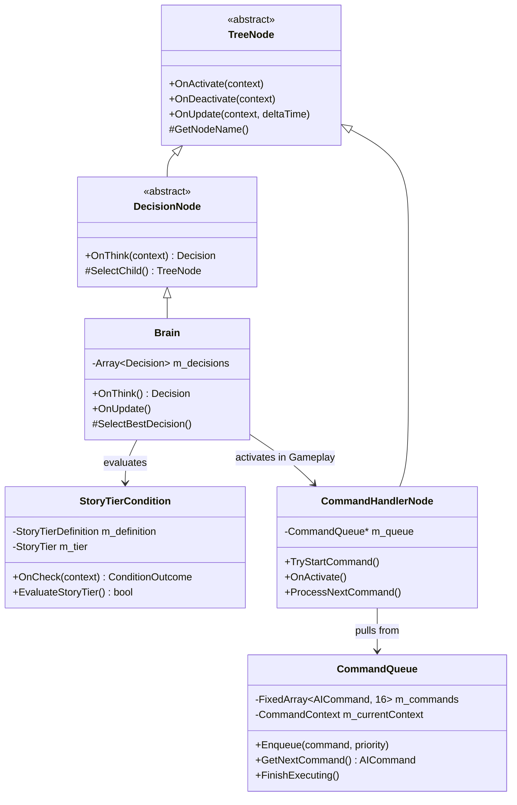
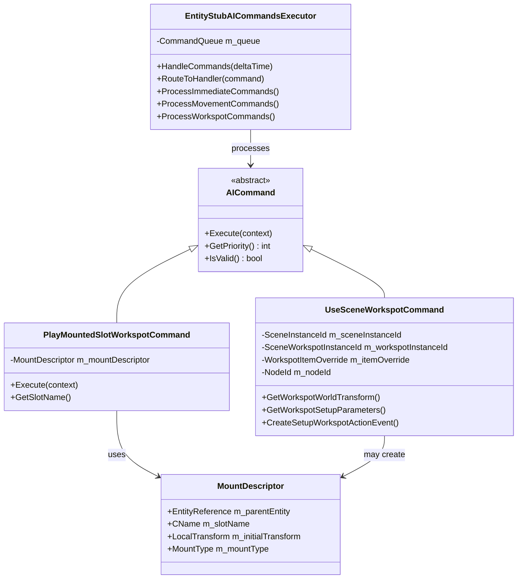
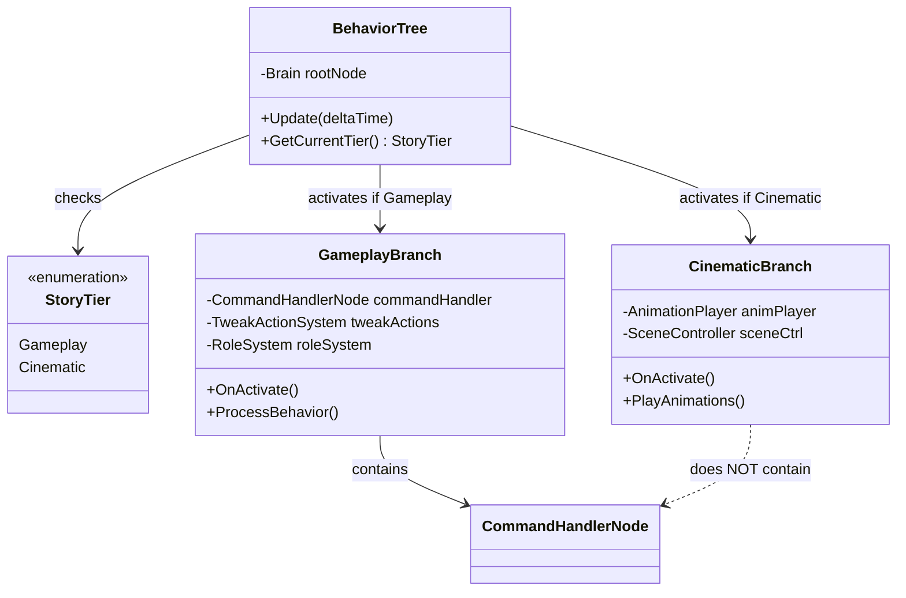
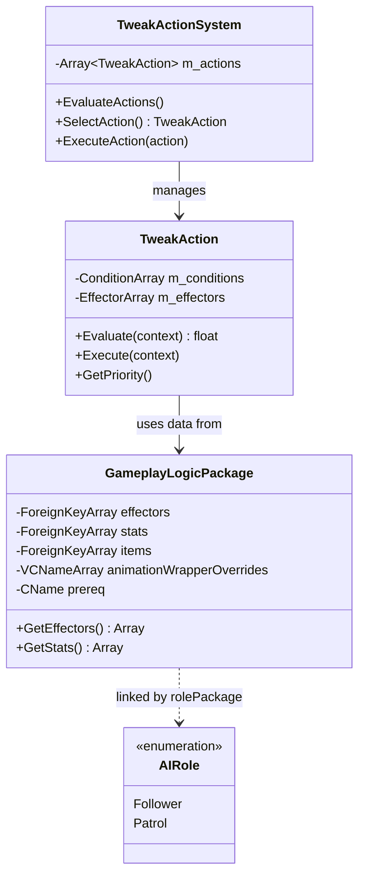
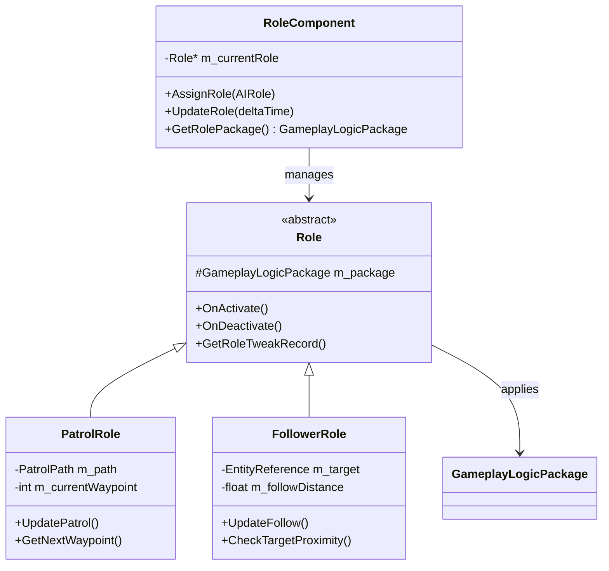
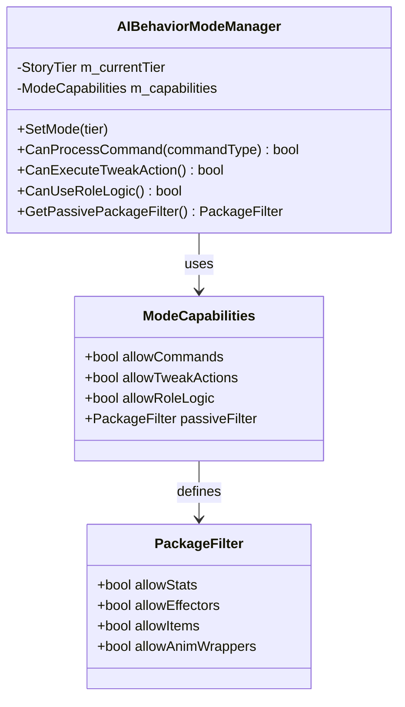
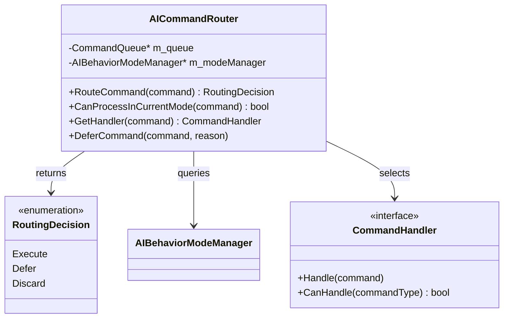
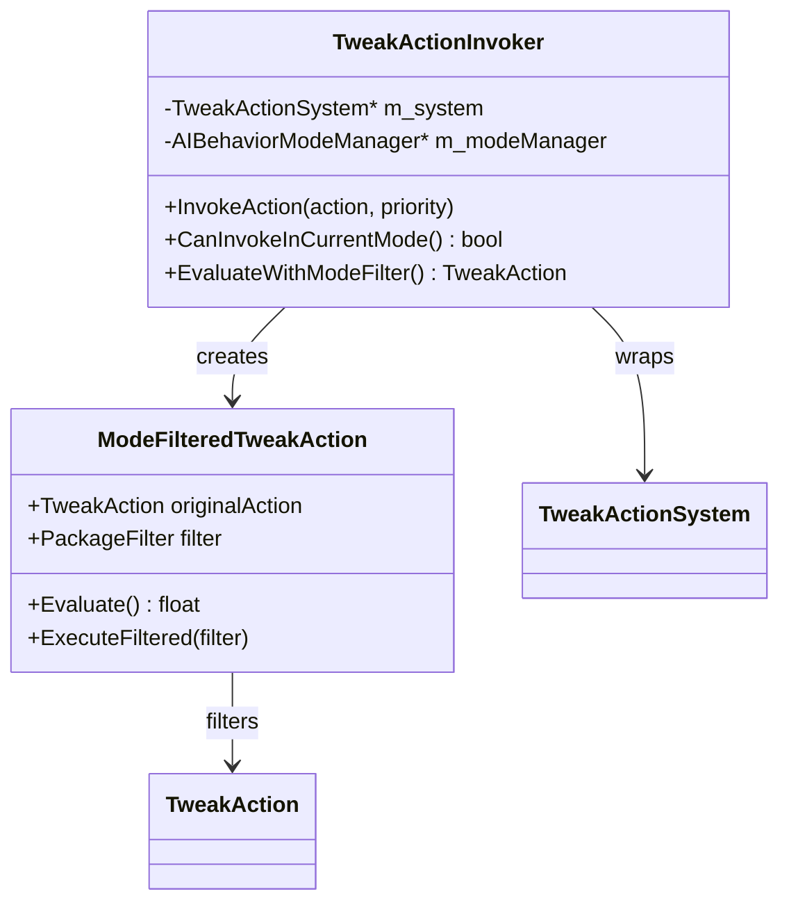
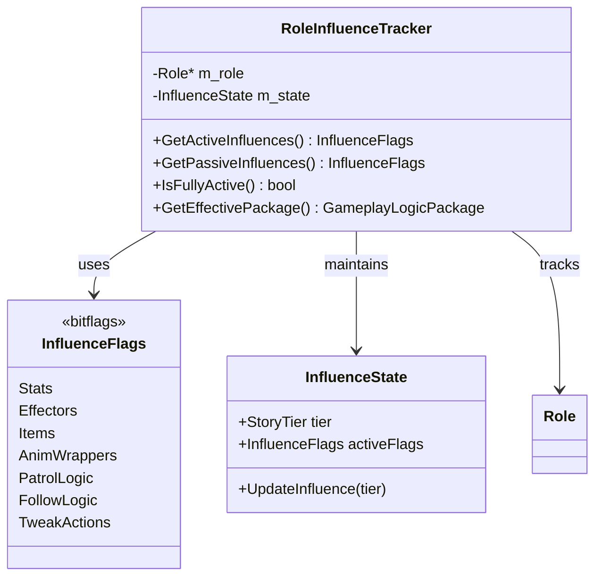
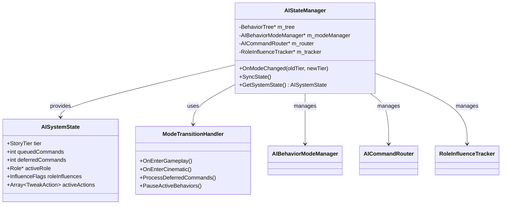

# 赛博朋克2077 AI行为树系统类图分析与补充方案

## 核心类图结构

### 1. 行为树核心层次



**说明**：
- **Brain**: 根决策节点，负责选择并激活子分支（Gameplay/Cinematic）
- **StoryTierCondition**: 检查当前StoryTier模式，决定分支激活
- **CommandHandlerNode**: 只在Gameplay分支中存在，负责处理CommandQueue
- **CommandQueue**: 系统级队列，两种模式都存在但只在Gameplay分支被处理

### 2. 命令系统类图



**说明**：
- **UseSceneWorkspotCommand**: 复杂场景工作点命令，20+参数，支持动态生成工作点树
- **PlayMountedSlotWorkspotCommand**: 简单挂载命令，仅1个MountDescriptor参数
- **EntityStubAICommandsExecutor**: 实际的命令处理器，将命令路由到不同handler

### 3. StoryTier控制流程



**关键差异**：

| 功能 | Gameplay分支 | Cinematic分支 |
|------|-------------|--------------|
| CommandHandlerNode | ✅ 存在 | ❌ 不存在 |
| CommandQueue | ✅ 处理 | ⚠️ 存在但不处理 |
| TweakAction主动逻辑 | ✅ 执行 | ❌ 不执行 |
| GameplayLogicPackage被动属性 | ✅ 应用 | ✅ 应用 |
| AIRole行为逻辑 | ✅ 完整 | ⚠️ 约50%有效 |

### 4. TweakAction系统类图



**说明**：
- **GameplayLogicPackage**: 包含Stats、Effectors、Items、AnimWrappers
- **被动属性** (Stats/Items/AnimWrappers): 两种模式都生效
- **主动逻辑** (TweakAction选择/执行): 仅Gameplay模式生效

### 5. Role系统类图



**Cinematic模式下的Role有效性**：
- ✅ **被动属性生效**：Stats修改、Items装备、动画包覆盖
- ❌ **主动行为失效**：巡逻路径、跟随逻辑、自主决策

---

## 当前设计分析

### 优点
1. **清晰的模式分离**：Gameplay和Cinematic通过StoryTier完全隔离
2. **队列系统健壮**：CommandQueue本身不检查模式，由节点控制处理
3. **灵活的工作点系统**：UseSceneWorkspotCommand支持复杂场景需求
4. **分层的包系统**：GameplayLogicPackage提供数据与逻辑的解耦

### 缺点
1. **模式切换不灵活**：无法在Cinematic中临时执行部分命令
2. **Role系统不透明**：在Cinematic下哪些功能有效不明确
3. **缺少中间层管理**：两种模式的差异由分散的节点控制，无统一管理点
4. **命令路由固定**：EntityStubAICommandsExecutor无法根据模式动态调整行为

---

## 补充方案

### 方案1：引入AIBehaviorModeManager（模式管理器）



**作用**：
- 提供统一的模式能力查询接口
- 明确定义每种模式下可用的功能
- 便于未来扩展新模式（如HalfGameplay混合模式）

**集成点**：
- `EntityStubAICommandsExecutor::HandleCommands` 调用 `CanProcessCommand()`
- `TweakActionSystem::EvaluateActions` 调用 `CanExecuteTweakAction()`
- `RoleComponent::UpdateRole` 调用 `CanUseRoleLogic()`

### 方案2：引入AICommandRouter（命令路由器）



**作用**：
- 根据当前模式智能路由命令
- 支持延迟执行（从Cinematic切回Gameplay时执行）
- 提供更细粒度的命令控制

**使用示例**：
```cpp
// 在Cinematic模式下收到UseWorkspotCommand
RoutingDecision decision = router->RouteCommand(workspotCmd);
if (decision == RoutingDecision::Defer) {
    // 命令被延迟，等待切回Gameplay
    deferredCommands.Push(workspotCmd);
}
```

### 方案3：引入TweakActionInvoker（TweakAction调用器）



**作用**：
- 在Cinematic模式下仍能应用TweakAction的被动效果
- 过滤掉需要主动行为的部分（如移动、攻击）
- 保留Stats/Effectors的应用

**应用场景**：
```cpp
// Cinematic下仍需要应用某些状态效果
if (invoker->CanInvokeInCurrentMode()) {
    auto filteredAction = invoker->EvaluateWithModeFilter();
    filteredAction->ExecuteFiltered(PackageFilter::OnlyPassive);
}
```

### 方案4：引入RoleInfluenceTracker（Role影响追踪器）



**作用**：
- 明确显示Role在当前模式下的有效影响
- 提供调试和可视化信息
- 便于编辑器预览不同模式下的效果

**调试输出示例**：
```
[RoleInfluenceTracker] Role: Patrol, Tier: Cinematic
Active Influences: Stats | Effectors | Items | AnimWrappers (50%)
Inactive Influences: PatrolLogic | TweakActions
```

### 方案5：引入AIStateManager（AI状态管理器）



**作用**：
- 统一管理所有AI子系统
- 处理模式切换时的状态同步
- 提供完整的AI系统状态快照

**模式切换流程**：
```cpp
void AIStateManager::OnModeChanged(StoryTier oldTier, StoryTier newTier) {
    if (newTier == StoryTier::Cinematic) {
        // 暂停主动行为
        m_tracker->UpdateInfluence(newTier);
        m_router->DeferPendingCommands();
    } else if (newTier == StoryTier::Gameplay) {
        // 恢复主动行为
        m_tracker->UpdateInfluence(newTier);
        m_router->ProcessDeferredCommands();
    }
    SyncState();
}
```

---

## 实施优先级

### P0 - 立即实施
1. **AIBehaviorModeManager**：提供基础的模式能力查询
2. **RoleInfluenceTracker**：解决AIRole在Cinematic下的有效性不明确问题

### P1 - 短期实施
3. **AICommandRouter**：改进命令处理的灵活性
4. **TweakActionInvoker**：在Cinematic下保留被动效果

### P2 - 长期优化
5. **AIStateManager**：提供统一的系统管理和调试能力

---

## 集成示例

### 示例1：模式切换时的命令处理

```cpp
// 原有代码（EntityStubAICommandsExecutor::HandleCommands）
void EntityStubAICommandsExecutor::HandleCommands() {
    AICommand* cmd = m_queue.GetNextCommand();
    if (cmd) {
        RouteToHandler(cmd);  // 直接处理
    }
}

// 改进后（使用AICommandRouter）
void EntityStubAICommandsExecutor::HandleCommands() {
    AICommand* cmd = m_queue.GetNextCommand();
    if (cmd) {
        RoutingDecision decision = m_router->RouteCommand(cmd);
        switch (decision) {
            case RoutingDecision::Execute:
                RouteToHandler(cmd);
                break;
            case RoutingDecision::Defer:
                m_deferredQueue.Push(cmd);
                break;
            case RoutingDecision::Discard:
                // 命令在当前模式下无效
                break;
        }
    }
}
```

### 示例2：Role影响的查询

```cpp
// 在UI或调试工具中
void DebugDisplay::ShowAIRoleInfo(Entity* entity) {
    RoleInfluenceTracker* tracker = entity->GetRoleInfluenceTracker();
    InfluenceFlags active = tracker->GetActiveInfluences();

    ImGui::Text("Role: %s", tracker->GetRole()->GetName());
    ImGui::Text("Story Tier: %s", tracker->GetCurrentTier());
    ImGui::Separator();

    ImGui::CheckboxFlags("Stats", &active, InfluenceFlags::Stats);
    ImGui::CheckboxFlags("Patrol Logic", &active, InfluenceFlags::PatrolLogic);
    ImGui::CheckboxFlags("TweakActions", &active, InfluenceFlags::TweakActions);
}
```

### 示例3：模式管理器的能力查询

```cpp
// 在行为树Brain节点中
Decision Brain::OnThink(ExecutionContext& context) {
    AIBehaviorModeManager* modeManager = context.GetModeManager();

    // 根据当前模式的能力选择决策
    if (modeManager->CanProcessCommand(CommandType::Combat)) {
        return m_gameplayDecision;
    } else {
        return m_cinematicDecision;
    }
}
```

---

## 总结

当前系统的核心问题在于：
1. **模式切换的影响范围不透明**：开发者需要深入代码才能知道哪些功能在哪种模式下有效
2. **缺少统一的管理层**：各子系统独立判断模式，缺少协调

补充方案通过引入5个新的管理器类：
- **AIBehaviorModeManager**：提供模式能力的统一查询接口
- **AICommandRouter**：智能路由命令，支持延迟执行
- **TweakActionInvoker**：细粒度控制TweakAction的执行
- **RoleInfluenceTracker**：明确显示Role的有效影响范围
- **AIStateManager**：统一管理所有AI子系统的状态

这些方案能够：
- ✅ 提高系统的可维护性和可调试性
- ✅ 使模式切换的影响更加明确
- ✅ 为未来扩展新模式（如混合模式）提供基础
- ✅ 改善工具和编辑器的支持