# 《赛博朋克2077》AI命令节点策略完整分析

> 全面梳理所有AI命令节点和策略类型
>
> 分析日期：2025-10-22
>
> 源代码路径：E:\SoftApp\Sy2077\2077\2077\CDPR2077\dev\src\common\gameQuest

---

## 目录

- [一、关于提到的三个策略](#一关于提到的三个策略)
- [二、完整的AI命令节点架构图](#二完整的ai命令节点架构图)
- [三、所有AI命令参数类型完整列表](#三所有ai命令参数类型完整列表)
- [四、RestrictMovement详细分析](#四restrictmovement详细分析)
- [五、完整的策略分类总结](#五完整的策略分类总结)
- [六、关于未找到的命令的推测](#六关于未找到的命令的推测)
- [七、总结](#七总结)

---

## 一、关于提到的三个策略

### 1. ✅ RestrictMovement - 已找到

**文件位置：** `common/gameQuest/include/combatNode.h:34, 134-136`

```cpp
// 在 CombatNodeFunctions 枚举中定义
#define RED_QUEST_COMBAT_NODE_FUNCTIONS_DEF( FN_ ) \
    FN_( CombatTarget, "Combat Target" ) \
    FN_( ShootAt, "Shoot At" ) \
    FN_( LookAtTarget, "Look At" ) \
    FN_( ThrowGrenade, "Throw Grenade" ) \
    FN_( UseCover, "Use Cover" ) \
    FN_( SwitchWeapon, "Switch Weapon" ) \
    FN_( PrimaryWeapon, "Primary Weapon" ) \
    FN_( SecondaryWeapon, "Secondary Weapon" ) \
    FN_( RestrictMovementToArea, "Restrict Movement" )  // ← 这里

// 参数类定义
BEGIN_COMBAT_NODE_PARAMS( RestrictMovementToArea )
    world::NodeRef m_area;  // 限制移动的区域引用
END_COMBAT_NODE_PARAMS()
```

**架构层次**：
```
CombatNodeDefinition (战斗节点)
    ↓
CombatNodeParams (战斗参数基类)
    ↓
CombatNodeParams_RestrictMovementToArea (限制移动策略)
```

### 2. ❌ JoinTargetSquad - 未找到

**搜索结果**：在整个 `gameQuest` 目录中未找到此命令。

**可能的情况**：
- 可能是在 RedScript 脚本中定义的 `ScriptedAICommandParams`
- 可能是记忆有误，实际名称是其他
- 可能是游戏的更新版本中移除或重命名了

**替代功能**：找到了相关的 `FollowParams` 跟随命令

### 3. ❌ FlatheadSetSoloMode - 未找到

**搜索结果**：在整个 `gameQuest` 目录中未找到此命令。

**分析**：
- "Flathead" 是游戏中的无人机角色
- 这个命令可能是：
  - 在脚本层实现的自定义命令
  - 在其他AI模块中实现（如 `gameAI` 或专门的无人机系统）
  - 使用了不同的命名方式

---

## 二、完整的AI命令节点架构图

```
┌─────────────────────────────────────────────────────────┐
│              Quest System Layer                         │
│              (任务系统层)                                │
└──────────────────────┬──────────────────────────────────┘
                       │
        ┌──────────────┴──────────────┐
        │                             │
        ▼                             ▼
┌───────────────────┐     ┌────────────────────────────┐
│ AICommandNodeBase │     │ ConfigurableAICommandNode  │
│ (命令节点基类)     │     │ (可配置命令节点)            │
└────────┬──────────┘     └────────┬───────────────────┘
         │                         │
         │                ┌────────┴─────────┬──────────────┬───────────────┐
         │                │                  │              │               │
         ▼                ▼                  ▼              ▼               ▼
┌──────────────────┐ ┌──────────┐ ┌─────────────┐ ┌──────────────┐ ┌──────────────┐
│SendAICommandNode │ │CombatNode│ │MovePuppetNode│ │MiscAICommand │ │EquipItemNode │
│                  │ │          │ │              │ │    Node      │ │              │
└─────────┬────────┘ └────┬─────┘ └──────┬──────┘ └──────┬───────┘ └──────┬───────┘
          │               │               │               │                │
          │               │               │               │                │
          ▼               ▼               ▼               ▼                ▼
    [常量命令]      [战斗策略]      [移动策略]      [杂项策略]      [装备策略]
```

---


## 四、RestrictMovement 详细分析

### 4.1 定义和实现

**头文件定义** (`combatNode.h:134-136`):
```cpp
BEGIN_COMBAT_NODE_PARAMS( RestrictMovementToArea )
    world::NodeRef m_area;  // 世界节点引用（定义移动区域）
END_COMBAT_NODE_PARAMS()
```

**展开后的完整类定义**：
```cpp
class QUEST_API CombatNodeParams_RestrictMovementToArea : public CombatNodeParams
{
    RED_BASE_CLASS( CombatNodeParams );
    RTTI_DECLARE_TYPE( CombatNodeParams_RestrictMovementToArea );

public:
    CombatNodeParams_RestrictMovementToArea();
    virtual ~CombatNodeParams_RestrictMovementToArea();

private:
    virtual String DoGetFriendlyName() const override;
    virtual AI::CommandPtr DoCreateCommand( scn::CommandCreationContext& context ) const override;

    world::NodeRef m_area;  // 限制区域的引用
};
```

### 4.2 使用场景

#### 场景1：守卫NPC限制在特定区域巡逻

```
┌─────────────────────────────────────────┐
│ Quest Graph (任务流程)                   │
│                                         │
│ [生成守卫]                              │
│      ↓                                  │
│ [CombatNode - RestrictMovement]        │
│  - Target: guard_npc                   │
│  - Area: patrol_zone_01                │
│      ↓                                  │
│ [守卫只在指定区域内活动]                │
│  - 追击玩家不会离开区域                 │
│  - 巡逻路径限制在区域内                 │
└─────────────────────────────────────────┘
```

#### 场景2：战斗中限制敌人移动范围

```
┌─────────────────────────────────────────┐
│ Combat Scenario                         │
│                                         │
│ [玩家进入禁区]                          │
│      ↓                                  │
│ [生成敌人]                              │
│      ↓                                  │
│ [CombatNode - RestrictMovement]        │
│  - Target: all_enemies                 │
│  - Area: arena_boundary                │
│      ↓                                  │
│ [敌人在竞技场内战斗]                    │
│  - 不会追击到区域外                     │
│  - 创造更可预测的战斗                   │
└─────────────────────────────────────────┘
```

#### 场景3：多阶段任务中动态调整限制

```
┌─────────────────────────────────────────┐
│ 任务："保卫据点"                         │
│                                         │
│ 阶段1: 敌人攻击外围                     │
│  [RestrictMovement]                    │
│  - Area: outer_defense_zone            │
│      ↓                                  │
│ 阶段2: 敌人突破，进入内部               │
│  [RestrictMovement]                    │
│  - Area: inner_compound                │
│      ↓                                  │
│ 阶段3: 最终战斗，敌人不受限制           │
│  [ClearAIRole] (移除限制)              │
└─────────────────────────────────────────┘
```

### 4.3 工作原理

**伪代码实现**：
```cpp
AI::CommandPtr CombatNodeParams_RestrictMovementToArea::DoCreateCommand(
    scn::CommandCreationContext& context
) const {
    // 1. 创建限制移动命令
    auto cmd = CreateHandle<AI::RestrictMovementCommand>();

    // 2. 解析区域节点
    auto* areaNode = ResolveWorldNodeRef(m_area);

    // 3. 设置限制区域
    cmd->SetRestrictedArea(areaNode);

    // 4. 命令将被添加到AI的CommandQueue
    // 5. AI系统会在路径规划时检查是否超出限制区域

    return cmd;
}
```

**执行流程**：
```
1. CombatNode 执行
        ↓
2. 创建 RestrictMovementCommand
        ↓
3. 命令入队到 CommandQueue
        ↓
4. AI Movement System 接收限制
        ↓
5. 路径规划时强制约束
   ├─ 计算到目标的路径
   ├─ 检查路径是否超出区域
   └─ 如果超出，裁剪到区域边界
        ↓
6. NPC移动被限制在区域内
```

### 4.4 技术细节

**区域定义方式**：
- `world::NodeRef` 引用的可能是：
  - **Trigger Volume** (触发器体积)
  - **Navigation Area** (导航区域)
  - **Custom Bounding Shape** (自定义边界形状)

**路径裁剪算法**：
```cpp
// 伪代码
Path CalculateRestrictedPath(Vector3 start, Vector3 goal, Area restriction) {
    // 1. 计算正常路径
    Path normalPath = CalculatePathNormal(start, goal);

    // 2. 检查路径是否完全在限制区域内
    if (IsPathInsideArea(normalPath, restriction)) {
        return normalPath;  // 路径合法，直接返回
    }

    // 3. 找到路径与区域边界的交点
    Vector3 exitPoint = FindPathAreaIntersection(normalPath, restriction);

    // 4. 重新计算到边界的路径
    Path restrictedPath = CalculatePathNormal(start, exitPoint);

    return restrictedPath;
}
```

---

## 五、完整的策略分类总结

### 5.1 按节点类型分类

```plantuml
@startuml
title AI Command Node Hierarchy

' 节点类定义
class SendAICommandNode {
    发送AI命令
}
class CombatNode {
    战斗节点
}
class MovePuppetNode {
    移动节点
}
class MiscAICommandNode {
    杂项命令
}
class EquipItemNode {
    装备节点
}
class VehicleCommandNode {
    车辆节点
}
class TeleportPuppetNode {
    传送节点
}

' 子类型定义
class ConstAICommandParams {
    包装现有命令
}
class UseWorkspotCommandParams {
    工作点
}

class CombatTarget
class ShootAt
class LookAtTarget
class ThrowGrenade
class UseCover
class SwitchWeapon
class PrimaryWeapon
class SecondaryWeapon
class RestrictMovementToArea {
    ✅
}

class MoveOnSpline {
    沿样条曲线
}
class Simple {
    简单
}
class Anim {
    动画
}
class WithCompanion {
    伴随
}
class MoveTo {
    移动到目标
}
class RotateTo {
    旋转到方向
}
class Patrol {
    巡逻
}
class Follow {
    跟随
}

class ClearAIRole {
    清除角色
}
class AssignAIRole {
    分配角色
}
class ScriptedAICommandParams {
    脚本自定义 - 无限扩展
}

class EquipItemParams
class VehicleCommandParams
class TeleportPuppetParamsV1

' 继承/包含关系
SendAICommandNode *-- ConstAICommandParams
SendAICommandNode *-- UseWorkspotCommandParams : 包含 2种

CombatNode *-- CombatTarget
CombatNode *-- ShootAt
CombatNode *-- LookAtTarget
CombatNode *-- ThrowGrenade
CombatNode *-- UseCover
CombatNode *-- SwitchWeapon
CombatNode *-- PrimaryWeapon
CombatNode *-- SecondaryWeapon
CombatNode *-- RestrictMovementToArea : 包含 9种策略

MovePuppetNode *-- MoveOnSpline
MovePuppetNode *-- MoveTo
MovePuppetNode *-- RotateTo
MovePuppetNode *-- Patrol
MovePuppetNode *-- Follow : 包含 5种策略

MoveOnSpline *-- Simple
MoveOnSpline *-- Anim
MoveOnSpline *-- WithCompanion : 包含

MiscAICommandNode *-- ClearAIRole
MiscAICommandNode *-- AssignAIRole
MiscAICommandNode *-- ScriptedAICommandParams : 包含 (扩展点)

EquipItemNode *-- EquipItemParams : 包含 1种
VehicleCommandNode *-- VehicleCommandParams : 包含 1种
TeleportPuppetNode *-- TeleportPuppetParamsV1 : 包含 1种


@enduml
```



### 5.2 按功能分类

| 功能类别 | 命令数量 | 包含的命令 |
|---------|---------|-----------|
| **移动控制** | 5+ | MoveOnSpline(3种), MoveTo, Patrol, Follow, RotateTo |
| **战斗行为** | 7 | CombatTarget, ShootAt, ThrowGrenade, UseCover, LookAtTarget, SwitchWeapon, RestrictMovement |
| **武器管理** | 3 | SwitchWeapon, PrimaryWeapon, SecondaryWeapon |
| **角色管理** | 2 | AssignAIRole, ClearAIRole |
| **工作点** | 2 | UseWorkspot (命令), UseWorkspotNode (专用节点) |
| **装备** | 1 | EquipItem |
| **车辆** | 1 | VehicleCommand |
| **传送** | 1 | TeleportPuppet |
| **脚本扩展** | ∞ | ScriptedAICommandParams |

### 5.3 按使用频率分类

| 频率 | 节点类型 | 策略示例 |
|------|---------|---------|
| **极高** | 专用节点 | UseWorkspotNode |
| **高** | MovePuppetNode | MoveOnSpline, MoveTo, Follow |
| **中** | CombatNode | CombatTarget, ShootAt, UseCover |
| **低** | MiscAICommandNode | ClearAIRole, AssignAIRole |
| **稀有** | 专用节点 | TeleportPuppet, VehicleCommand |

---

## 六、关于未找到的命令的推测

### 6.1 JoinTargetSquad 的可能实现

虽然没有找到名为 `JoinTargetSquad` 的C++类，但可能通过以下方式实现：

#### 方式1：ScriptedAICommandParams 脚本实现

```swift
// RedScript 实现示例
class JoinTargetSquadCommandParams extends ScriptedAICommandParams {
    let targetSquadID: Uint32;
    let formationPosition: Vector3;

    public func GetCommandName() -> String {
        return "Join Target Squad";
    }

    public func CreateCommand() -> ref<AICommand> {
        let cmd = new JoinSquadCommand();
        cmd.SetSquadID(this.targetSquadID);
        cmd.SetFormationPosition(this.formationPosition);
        return cmd;
    }
}
```

#### 方式2：FollowParams 的功能等价

```cpp
// FollowParams 本质上实现了"加入小队"的功能
class FollowParams : public AICommandParams {
    THandle<UniversalRef> m_companionRef;  // 跟随目标（小队长）
    Float m_companionDistance = 5.0f;      // 小队距离
    Bool m_matchSpeed = true;              // 匹配速度（保持队形）
    // ...
};

// 使用示例
MovePuppetNode
  - Function: Follow
  - Target: squad_member_01
  - CompanionRef: squad_leader
  - CompanionDistance: 3.0
```

#### 方式3：可能在其他模块

```
可能的文件位置：
- common/game/src/squadSystem.cpp
- common/gameAI/src/squadBehavior.cpp
- common/game/include/combatSquad.h
```

### 6.2 FlatheadSetSoloMode 的可能位置

#### 推测1：在专门的无人机系统中

```
可能的实现位置：
- common/game/src/flatheadController.cpp
- common/gameAI/src/droneAI.cpp
- common/game/include/companionDrone.h
```

#### 推测2：作为 ScriptedAICommandParams 实现

```swift
// RedScript 实现
class FlatheadSetSoloModeParams extends ScriptedAICommandParams {
    let soloMode: Bool;
    let allowCombat: Bool;
    let maxRoamDistance: Float;

    public func GetCommandName() -> String {
        return "Flathead: Set Solo Mode";
    }

    public func CreateCommand() -> ref<AICommand> {
        let cmd = new FlatheadControlCommand();
        cmd.SetSoloMode(this.soloMode);
        cmd.SetCombatEnabled(this.allowCombat);
        cmd.SetRoamDistance(this.maxRoamDistance);
        return cmd;
    }
}
```

#### 推测3：可能是任务特定功能

```
// 可能在特定任务文件中定义
E:\SoftApp\Sy2077\2077\2077\CDPR2077\r6\quests\part1\q101\
    flathead_behaviors.ws
    flathead_commands.reds
```

### 6.3 名称变化的可能性

这些命令可能使用了不同的命名：

| 推测的原名 | 可能的实际名称 |
|-----------|--------------|
| JoinTargetSquad | FollowCompanion / JoinFormation |
| FlatheadSetSoloMode | DroneSetAutonomousMode / CompanionDroneControl |

---

## 七、总结

### 7.1 已确认找到的策略

✅ **RestrictMovement** - `CombatNodeParams_RestrictMovementToArea`
- **位置**: `combatNode.h:134-136`
- **节点**: CombatNode
- **功能**: 限制NPC移动到指定区域内
- **应用**: 守卫巡逻、竞技场战斗、区域防御

### 7.2 未找到但可能存在的策略

❓ **JoinTargetSquad** - 可能是：
1. `FollowParams` 的功能等价物
2. ScriptedAICommandParams 脚本实现
3. 在专门的小队管理系统中实现
4. 使用了不同的名称（如 JoinFormation）

❓ **FlatheadSetSoloMode** - 可能是：
1. 无人机专用控制系统中的命令
2. ScriptedAICommandParams 脚本实现
3. 任务特定的脚本功能
4. 游戏版本差异或开发阶段功能

### 7.3 完整架构理解

《赛博朋克2077》的AI命令系统采用了**多层策略模式 + 工厂模式**的设计：

```
┌────────────────────────────────────────┐
│ 层次1: 节点类型 (Node Type)            │
│  - 决定命令的大类和处理方式             │
├────────────────────────────────────────┤
│ 层次2: 参数策略 (Params Strategy)      │
│  - 决定具体的命令行为和参数             │
├────────────────────────────────────────┤
│ 层次3: 命令对象 (Command Object)       │
│  - 实际执行的AI命令实例                 │
├────────────────────────────────────────┤
│ 层次4: 命令队列 (Command Queue)        │
│  - 管理命令的生命周期和执行顺序         │
└────────────────────────────────────────┘
```

### 7.4 系统特点

#### 优势

| 特点 | 说明 | 效果 |
|------|------|------|
| **分层设计** | 节点→参数→命令→队列 | 职责清晰，易于维护 |
| **策略模式** | 20+种内置策略 | 灵活组合，复用性高 |
| **脚本扩展** | ScriptedAICommandParams | 无限扩展可能 |
| **编辑器集成** | 可视化配置 | 策划友好 |
| **性能优化** | 专用节点 vs 通用节点 | 平衡性能与灵活性 |

#### 数量统计

```
节点类型:      7种主要节点
内置策略:      20+种C++实现的策略
脚本策略:      理论上无限
总体灵活性:    极高
```

### 7.5 设计哲学

CDPR在AI命令系统设计中体现的核心理念：

```
┌──────────────────────────────────────────┐
│  核心功能 → 专用节点 → 高性能优化        │
│  (UseWorkspot, MoveTo)                  │
├──────────────────────────────────────────┤
│  常用功能 → 可配置节点 → 策略模式        │
│  (Combat, Movement)                     │
├──────────────────────────────────────────┤
│  杂项功能 → 通用节点 → 脚本扩展          │
│  (MiscAICommand)                        │
├──────────────────────────────────────────┤
│  实验功能 → 脚本实现 → 快速迭代          │
│  (ScriptedAICommandParams)              │
└──────────────────────────────────────────┘
```

### 7.6 最终结论

**RestrictMovement** 是一个完整实现的、用于限制NPC移动区域的战斗策略，属于 CombatNode 的9种策略之一。

**JoinTargetSquad** 和 **FlatheadSetSoloMode** 虽然未在C++层找到，但很可能：
- 通过 `FollowParams` 等现有功能实现相似效果
- 在脚本层使用 `ScriptedAICommandParams` 实现
- 在专门的系统模块中实现（如小队系统、无人机系统）
- 使用了不同的命名方式

这种设计充分体现了现代游戏开发的"核心C++，外层脚本"的架构理念，在保证性能的同时提供了最大的灵活性。

---

## 附录：完整的文件索引

### 核心文件列表

```
common/gameQuest/include/
├── aiCommandNodeBase.h          # AI命令节点基类
├── questConfigurableAICommandNode.h  # 可配置命令节点
├── combatNode.h                 # 战斗节点 (9种策略)
├── movePuppetNode.h             # 移动节点 (5种策略)
├── miscAICommandNode.h          # 杂项节点 (扩展点)
├── sendAICommandNode.h          # 发送命令节点
├── equipItemNode.h              # 装备节点
├── vehicleCommandNode.h         # 车辆节点
├── teleportPuppetNode.h         # 传送节点
└── useWorkspotNode.h            # 工作点节点 (专用)
```

### 策略数量汇总

| 节点 | 策略数 | 文件 |
|------|--------|------|
| SendAICommand | 2 | sendAICommandNode.h |
| Combat | 9 | combatNode.h |
| MovePuppet | 5+ | movePuppetNode.h |
| MiscAICommand | 2+∞ | miscAICommandNode.h |
| EquipItem | 1 | equipItemNode.h |
| Vehicle | 1 | vehicleCommandNode.h |
| Teleport | 1 | teleportPuppetNode.h |
| **总计** | **20+** | **7个主要节点** |

---

**文档信息**
- 作者：基于源代码分析生成
- 版本：1.0
- 最后更新：2025-10-22
- 相关文档：《赛博朋克2077_AI行为系统深度分析.md》, 《MiscAICommandNode详细分析.md》
