以下是带时间戳的视频内容总结，严格对应字幕时间轴，无内容遗漏：

### 一、开场与团队背景（00:00:11 - 00:02:42）
1. **演讲者介绍**（00:00:34 - 00:00:44）  
   - 凯亚顿·卡普钦斯基（Kayatton Capuchinski）：电影设计师，“喜欢完美的红色”；  
   - 斯基亚·马尔塞尼尔（Skia Marsenior）：城市放映公司电影设计师兼协调员。
2. **合作经历**（00:00:47 - 00:00:59）  
   共同参与《巫师3：狂猎》扩展包《石心》《血与酒》及《赛博朋克2077》制作。
3. **致谢与提示**（00:01:14 - 00:02:42）  
   - 致谢跨部门团队（电影设计师、编剧、任务设计师、制作人、程序员等）；  
   - 剧透提示：含《赛博朋克2077》及扩展包剧透，部分内容可能令人不安（如暴力、宗教隐喻场景）。
    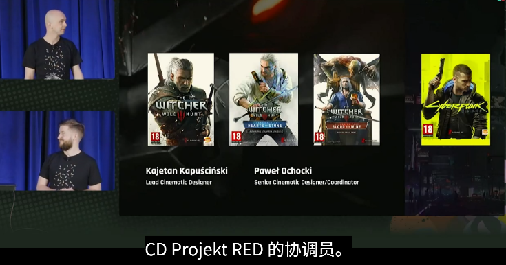
### 二、核心概念：电影化设计的定义与职责（00:05:56 - 00:06:31）
1. **定义**（00:05:56 - 00:06:11）：负责游戏互动内容的创意设计，涵盖外观、时机节奏、内容交付，目标是沉浸式情感体验。
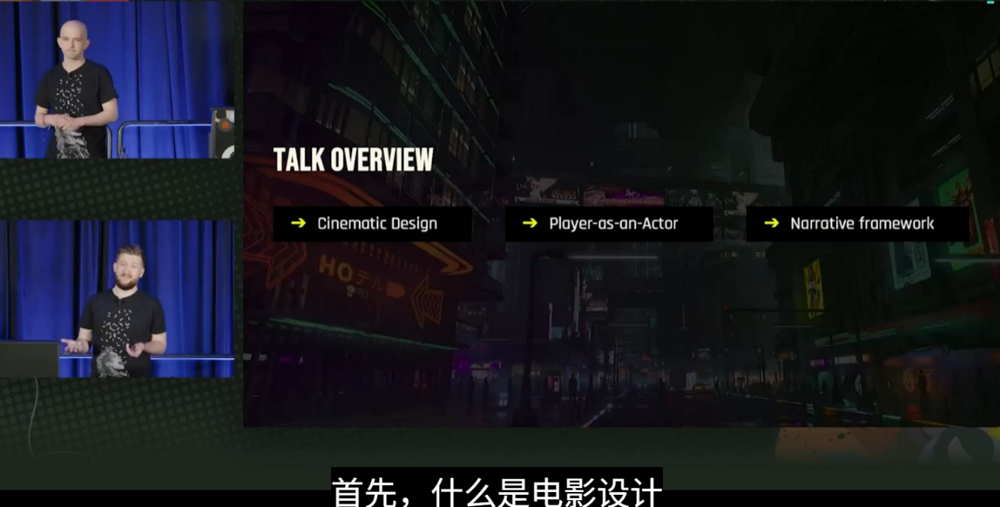
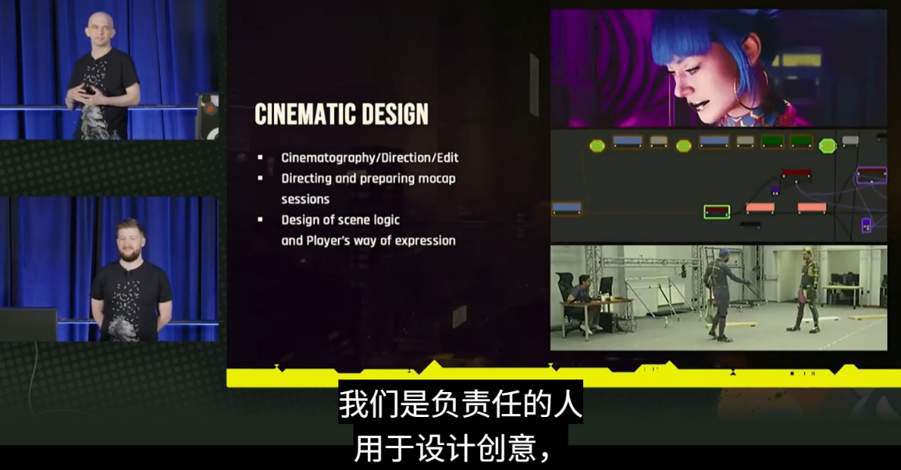
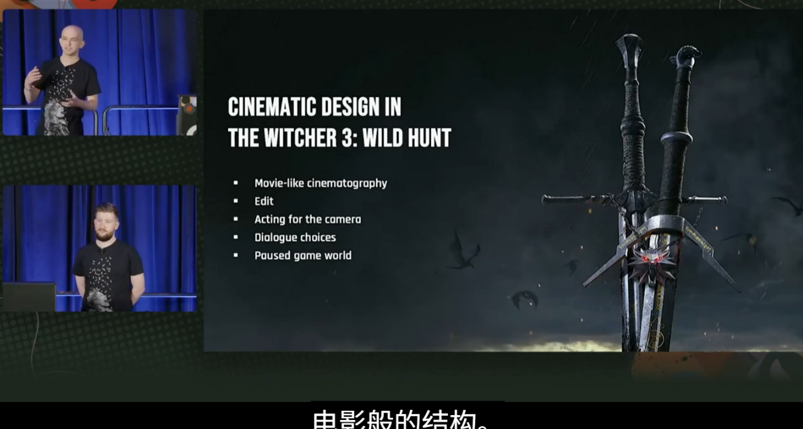
2. **工作方式**（00:06:11 - 00:06:31）  
   - 工具：基于笔记的可视化脚本语言；  
   - 协作：与演员在Mockup Stage录制表演；  
   - 核心目标：让玩家从“观看者”变为“参与者”。

### 三、跨游戏叙事设计对比（00:06:54 - 00:08:31）
| 维度         | 《巫师》系列（00:06:54 - 00:07:43）                                                 | 《赛博朋克2077》（00:07:45 - 00:08:31）                                         |
| ------------ | ----------------------------------------------------------------------------------- | ------------------------------------------------------------------------------- |
| 场景世界状态 | 场景聚焦时游戏世界暂停，场景外无关键事件（00:07:28 - 00:07:35）                     | 场景实时进行，背景世界持续运转（如对话时背景有其他活动）（00:08:18 - 00:08:25） |
| 玩家角色定位 | 类似“导演”，偶尔选择选项观察剧情（00:07:12 - 00:07:18）                             | 类似“演员”，深度参与，通过动作影响剧情（00:08:05 - 00:08:12）                   |
| 互动性设计   | 基础选择分支（如“是否把宝宝扔进烤箱”），依赖游戏变量丰富内容（00:07:18 - 00:07:25） | 多维度动作动词，支持玩法动作融入叙事（00:08:25 - 00:08:31）                     |
| 叙事导向性   | 强导向，路径相对固定（00:07:35 - 00:07:43）                                         | 平衡自由与导向，保留自主决策空间（00:08:12 - 00:08:18）                         |

### 四、核心设计理念：故事与玩法的平衡（00:08:51 - 00:10:28）
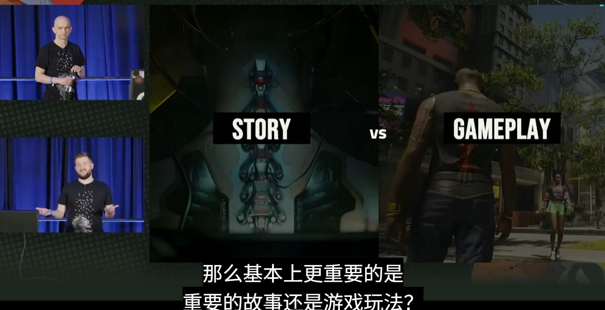
1. **争议观点回应**（00:08:51 - 00:10:13）  
   反驳“玩法为王”或“故事为王”，认为二者同等重要，需减少叙事与玩法摩擦。
2. **玩家角色定位升级**（00:10:13 - 00:10:28）  
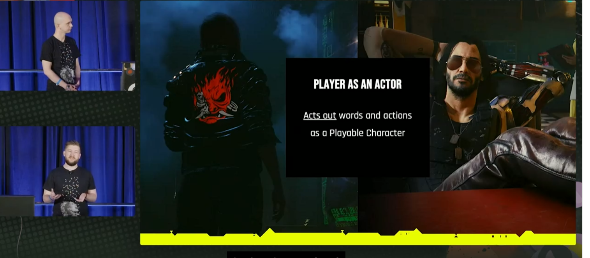
**Player As An Actor**
   从“导演”变为“演员”，在“舞台”上主动表演，通过动作表达角色性格。
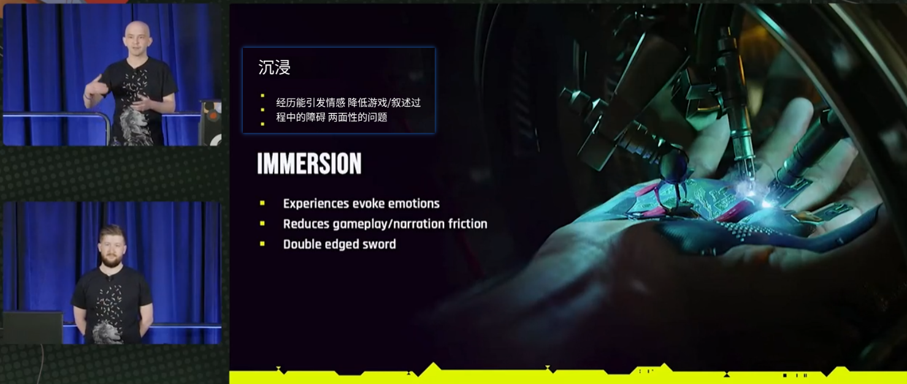❓

经历引发情感降低游戏内容和叙事之间的不流畅的体验感；对限制的合理解释；处于实时的场景下

### 五、增强沉浸感的关键设计（00:13:11 - 00:22:45）
#### 1. 层面叙事（Diatic Narration）（00:13:11 - 00:13:47）
- 让玩家理解规则与限制合理性，明确角色处境与行为后果（00:13:28 - 00:13:47）。
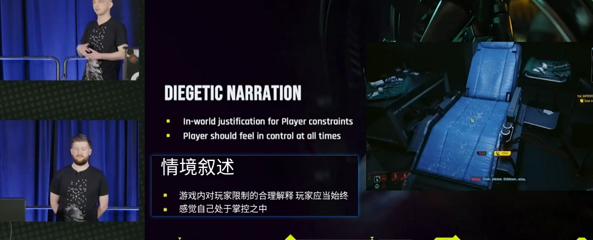
#### 2. 实时场景设计（00:14:01 - 00:14:47）
- 场景与背景世界联动，玩家可通过叙事/玩法动作影响场景（00:14:32 - 00:14:47）。
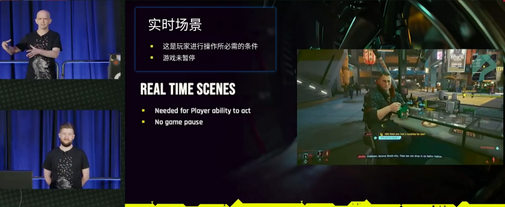
#### 3. 丰富的“动作动词”设计（00:15:11 - 00:22:45）
| 动作类型                | 时间戳与具体案例                                                                 |
|-------------------------|-----------------------------------------------------------------------------|
| 对话选择                | 00:15:11 - 00:16:03：蓝色（背景探索）、黄色（剧情推进）选项；新增“沉默”（不阻止克莱尔则其杀萨姆森） |
| 移动互动                | 00:16:29 - 00:17:33：靠近角色被推开、进入/离开特定区域触发剧情（如“别靠近，否则自杀”场景）       |
| 视角互动                | 00:17:40 - 00:18:09：检测玩家视线焦点，推动场景（如店主要求看向摄像头完成扫描）               |
| 自定义叙事动作          | 00:18:11 - 00:19:03：“揍人”“亲吻”等专属动作，界面明确后果（如被背叛后可选择揍背叛者）           |
| 玩法动作融入叙事        | 00:19:37 - 00:20:08：射击、驾驶等玩法动作影响剧情（如选择杀死/放过BOSS亚当斯马舍）             |

**对话选择**
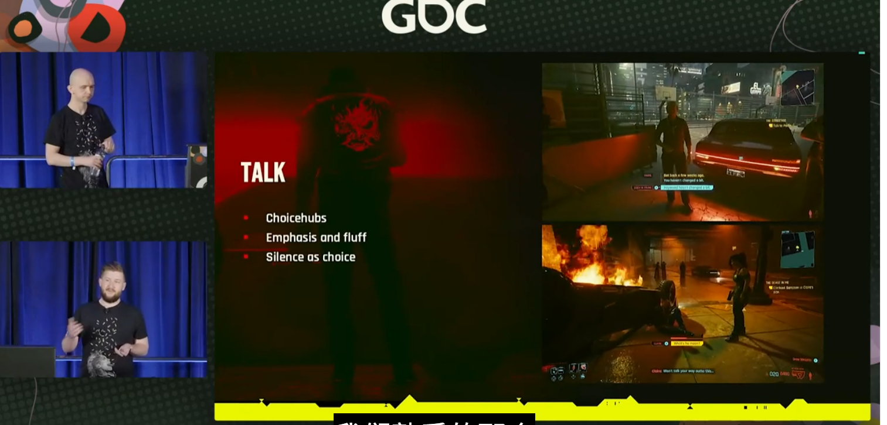
选择的收束效果，选择的分级，沉默也是选择的一种
**移动选择**

进入空间会被NPC手动阻挡；进入距离程度触发剧情
**玩家的注视**
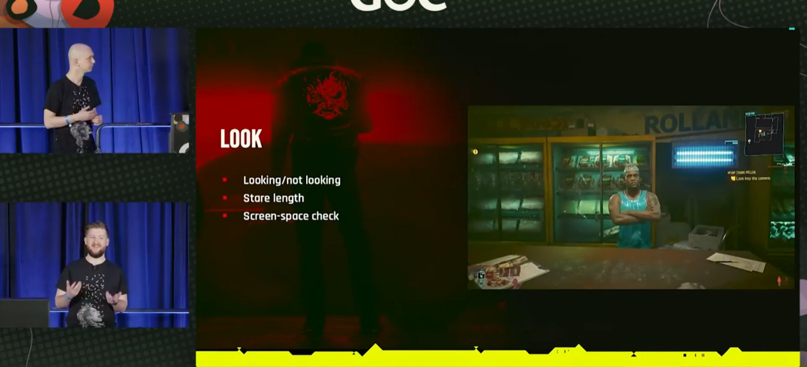
当玩家看到即触发
**行动触发**
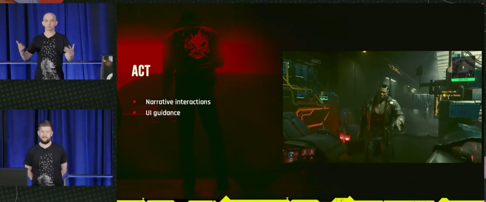
玩家选择的行为触发剧情，UI提示❓
**做了什么**
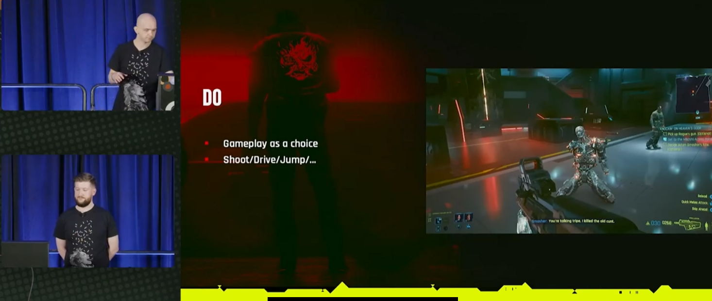
玩家做了可以产生剧情
**Action is Reacting**
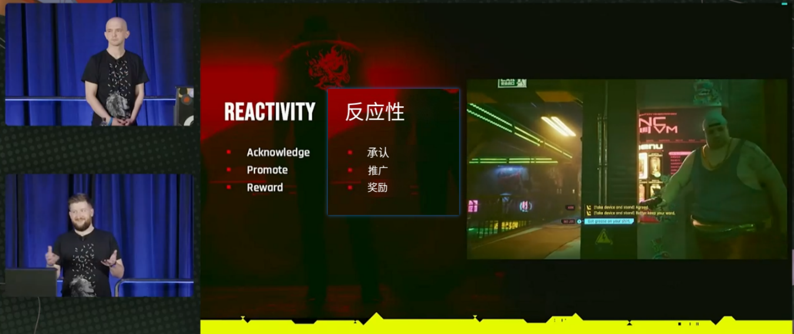

### 六、第一人称视角（FPP）的设计细节（00:23:05 - 00:31:13）
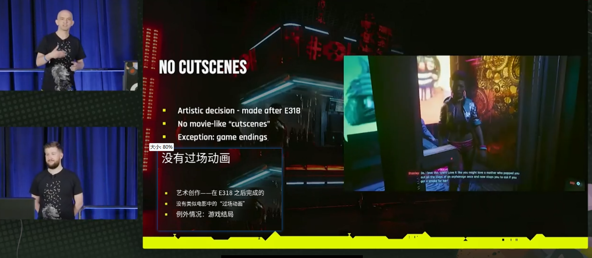除了结局外全部取消了过场动画

1. **选择理由**（00:23:05 - 00:24:09）：契合私密个人故事，仅结局用TPP展示完整角色。
2. **关键设计**（00:24:11 - 00:27:04）  
   - 身体呈现：低头可见躯干，场景定制姿势、手势（00:24:11 - 00:25:13）；  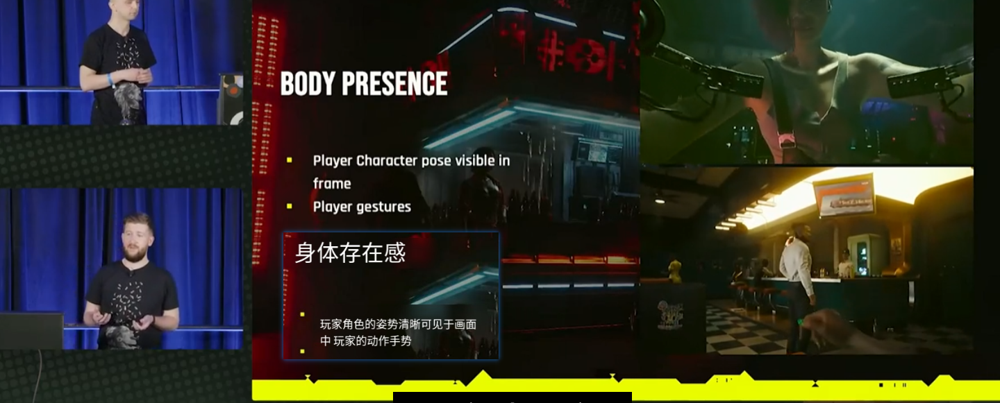
   - 相机与呼吸：模拟头部转动，呼吸动画传递角色状态（00:25:40 - 00:26:14）；  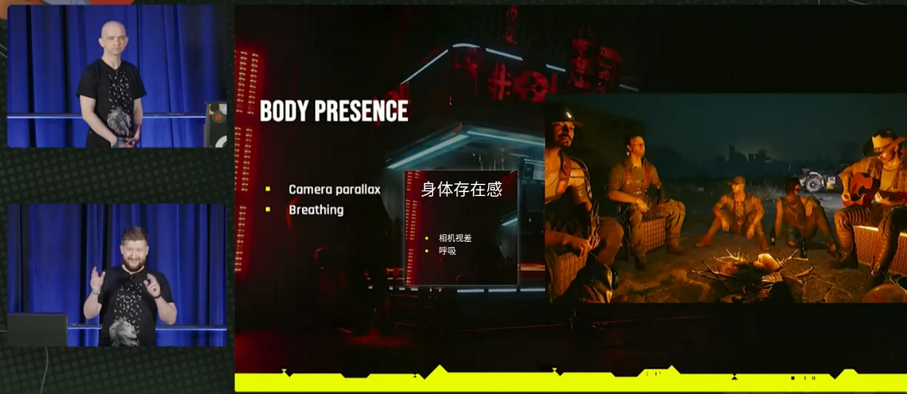
   - 镜像功能：通过镜像建立与自定义角色的连接（00:26:46 - 00:27:04）。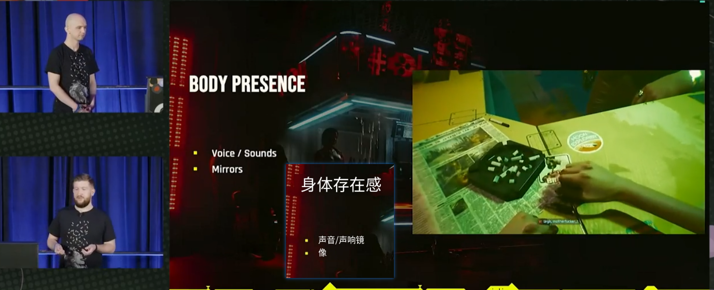
   - 特殊动作的锁定 ，通过部分特殊动作锁定编辑实现叙事镜头的表达  

3. **框架塑造**（00:27:17 - 00:31:13）  
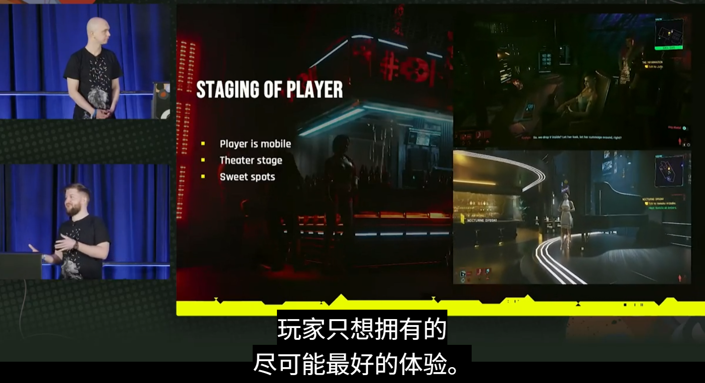
**Staging of player**
   构建场景关卡时给出一个最佳视角路径，最佳的视觉体验路径本身就是很好的玩家引导方案
   玩家掌控构图，通过光影、关卡设计引导进入“最佳视角点”（Sweet Spots）（00:29:10 - 00:29:53）；
   动画需360度无死角美观（00:30:48 - 00:31:13）。
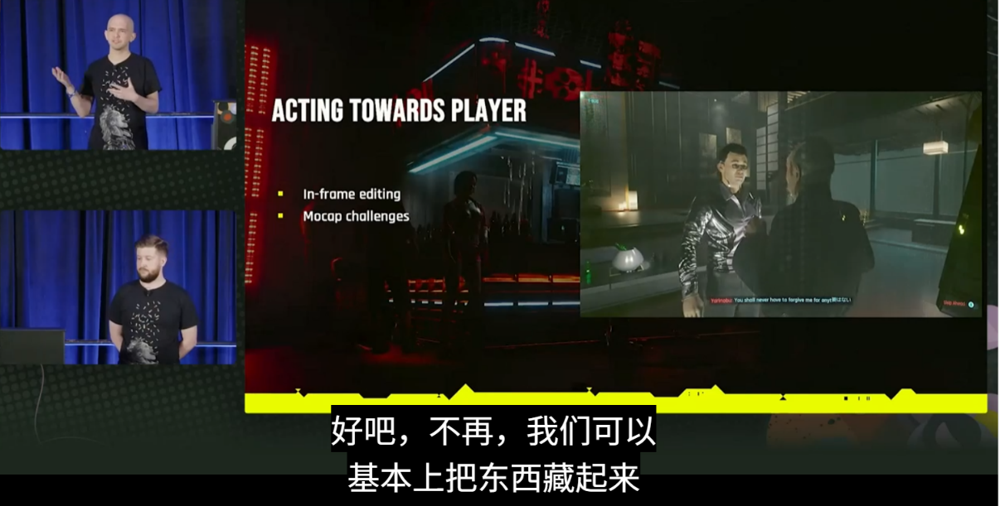 当玩家确定在一个固定的位置时，要更具或者位置调整剧情的表演确保最佳
### 七、“参与层级”（Tiers of Engagement）框架（00:33:09 - 00:40:18）
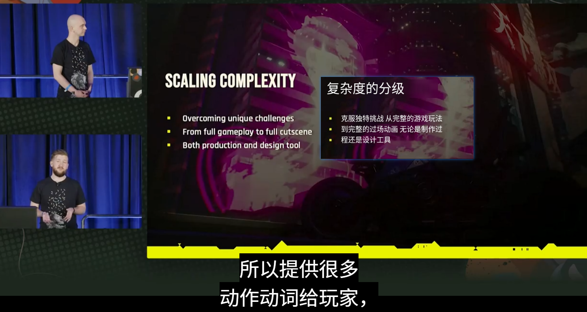
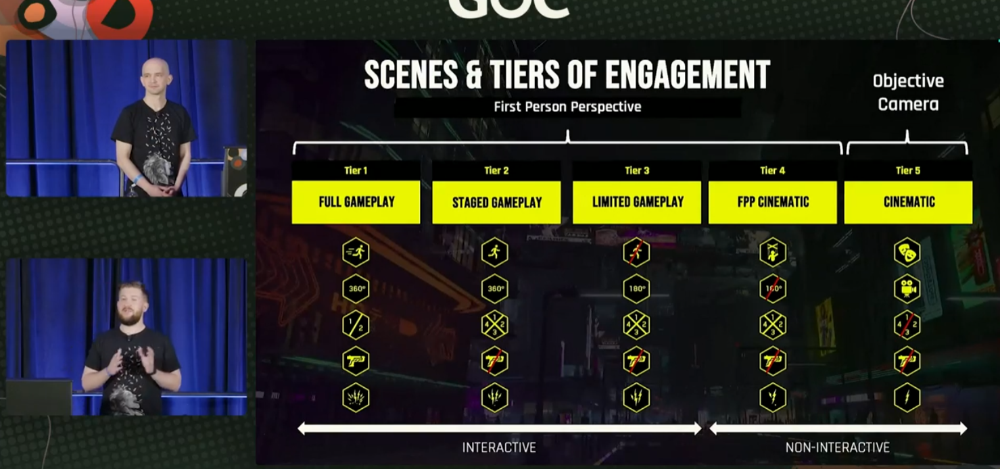

| 层级                | 时间戳与核心特点                                                                 | 应用场景举例                          |
|---------------------|-----------------------------------------------------------------------------|---------------------------------------|
| 1级：完整游戏体验   | 00:34:21 - 00:34:53：完全掌控相机、移动及能力，简单故事选择                          | 路边NPC对话                            |
| 2级：关卡玩法       | 00:35:54 - 00:36:48：首次限制（放慢移动、关闭部分能力），搭配世界观背景（如沙尘暴）    | 沙尘暴中聚焦剧情对话                    |
| 3级：强引导场景     | 00:37:43 - 00:38:09：明确玩家位置，控制感知角度，选择复杂（避免“观看模拟器”）          | 与约书亚讨论“钉十字架”场景              |
| 4级：FPP过场动画    | 00:38:39 - 00:39:33：可控角色移动，相机跟随，时长简短（几秒到十几秒）                  | 角色受伤短动画、关键道具获取            |
| 5级：TPP过场动画    | 00:39:53 - 00:40:18：相机脱离玩家，无互动，仅用于结局展示完整角色                    | 游戏各结局收尾                          |

#### 信息与噪音

**两者都很重要**
#### 层级标识

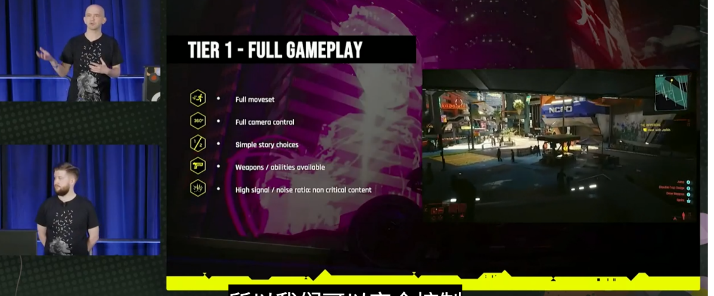
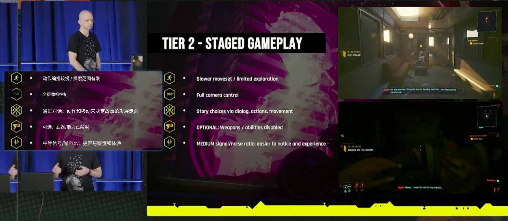
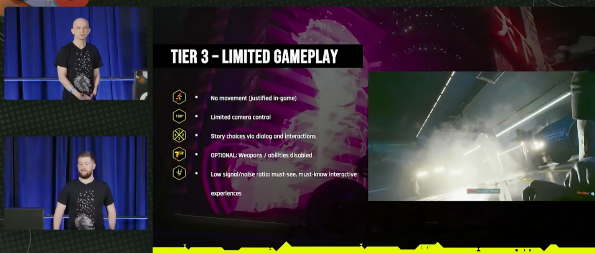
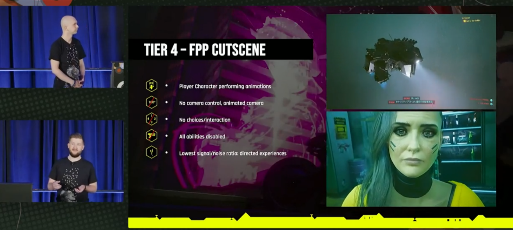

Tire 1  
Tire 2  
Tire 3  
Tire 4  
**Tire 5**
    **Player Character Become on Actor**
    **Directed Objective Camera**
    **No Choices Interaction**
    **All Abilities disabled**
    **Just Signal fully Directed experience**

玩家在寒冷的地方行动困难，喝了酒摄像头摇摇晃晃，中了毒添加行动阻尼
**2077和巫师3相比多了游戏层级概念**
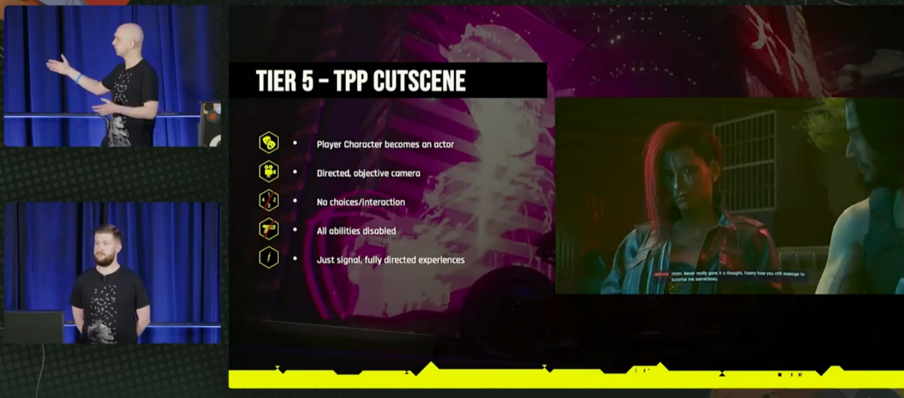

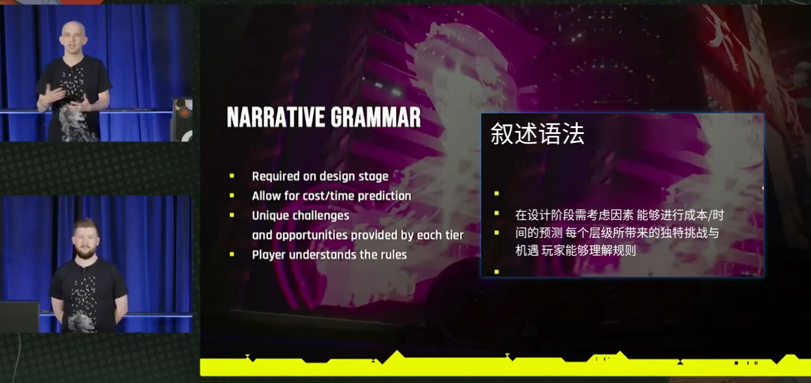
### 八、设计总结与关键收获（00:46:17 - 00:48:36）
1. **核心结论**（00:46:17 - 00:47:33）  
   - FPP不自动等于沉浸感，需细节设计（00:46:23 - 00:46:35）；  
   - 沉浸感是双刃剑，需兼顾核心体验与瑕疵打磨（00:46:47 - 00:46:59）；  
   - 有机结构让叙事与玩法衔接“隐形”（00:47:12 - 00:47:33）。
2. **实践经验**（00:47:33 - 00:48:36）  
   - 动作动词需明确后果（00:47:38 - 00:47:50）；  
   - 实时场景平衡“世界运转”与“叙事聚焦”（00:47:50 - 00:48:05）；  
   - 跨部门协作关键（00:48:05 - 00:48:36）。

### 九、结尾、招聘与问答（00:48:58 - 01:02:01）
1. **成果展示**（00:48:58 - 00:50:33）：播放玩家作为“演员”参与场景的示例（如摇滚明星舞台表演）。
2. **招聘信息**（00:50:43 - 00:50:54）：为《巫师》《赛博朋克》系列招聘电影设计师。
3. **问答环节**（00:51:15 - 01:02:01）  
   - 玩家角色平衡（V的个性与玩家自由）（00:51:15 - 00:52:16）；  
   - 对话中途离开处理（NPC保留等待动画、返回触发专属台词）（00:52:18 - 00:55:14）；  
   - 动作动词一致性（00:55:16 - 00:57:07）；  
   - FPP视觉语言迭代（00:57:15 - 00:58:54）；  
   - 参与层级切换与节点系统调整（00:59:02 - 01:02:01）。