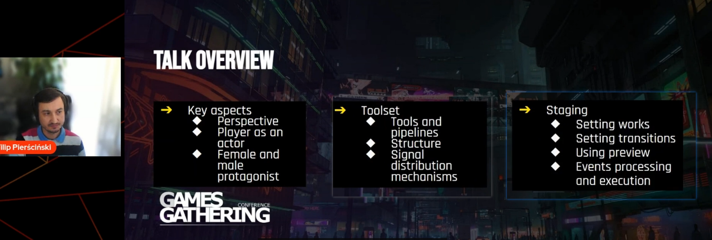

好的，根据您的要求，我将对视频内容进行更深入、更详细的讲述线梳理，并输出为 Markdown 文档。

---

# 深入解析《赛博朋克 2077》中的互动电影场景

**演讲者：** Filip Pierściński (CD Projekt RED 首席电影程序员)
**主题：** Introduction of the Interactive Cinematics in 'Cyberpunk 2077'
**关键词：** FPP 电影场景、Syeditor 工具、图表系统、动作分段。

---

## 一、开场与项目背景 (00:00:00 – 00:05:55)

### 1.1 欢迎与自我介绍 (00:00:00 – 00:02:45)

* **演讲者身份：** CD Projekt RED 首席电影程序员 **Filip Pierściński**。
* **演讲内容：** 将介绍在《赛博朋克 2077》中使用的**工具**、**管道**（Pipeline）和**实现方法**。
* **项目致谢：** 演讲中讨论的技术和工具由**国家研究开发中心**的“电影领域”项目支持。该项目旨在通过创新的管道和定制工具包，在高端开放世界游戏中提供独特的电影体验。
* **个人履历：** 曾参与《两个世界 II》、《巫师 3：狂猎》、《巫师 3：石之心》、《巫师 3：血与酒》和《赛博朋克 2077》。
* **团队致谢：** 特别感谢所有参与《赛博朋克 2077》场景制作的团队成员（电影设计师、故事编剧、任务设计师、程序员、QA 等）。

### 1.2 游戏背景与情绪渲染 (00:02:48 – 00:05:55)

* **游戏设定：** 设定在**夜之城**（Night City）的开放世界动作冒险故事，一个痴迷于权力、魅力、身体改造的城市。
* **叙事基调：** 夜之城的生活艰难，没有好的选择，每个决定都有后果。
* **场景作用：** 电影场景反映了游戏中的极端情绪、危险关系和曲折情节。
* **预告片：** 播放一段预告片以更好地捕捉电影领域的精髓。

---

## 二、互动场景的三个关键挑战

### 2.1 第一人称视角 (FPP) 的沉浸式故事 (00:06:57 – 00:09:07)

* **选择原因：** FPP 是实现沉浸式故事最自然的选择。
* **动画制作难度：** 摄像机必须被制作动画。**微小的错误**（如动画数据或计算中的错误）都可能导致摄像机在帧之间突然移动。
* **后果：** 任何不自然的跳动或晃动都会**严重破坏沉浸感**。

### 2.2 玩家作为演员 (Player as an Actor) (00:09:08 – 00:09:46)

* **玩家参与度：** 玩家角色（V）积极参与场景，并且在大部分时间内都在屏幕上。
* **制作成本：** 由于玩家始终在场，无法使用常见的“烟雾和镜子”技术来隐藏角色或环境，因此**无法有效降低制作成本**。

### 2.3 双主角版本 (Female or Male Protagonist) (00:09:46 – 00:10:31)

* **版本数量：** **90%** 的场景需要为**女性 V** 和**男性 V** 制作**两个版本**。
* **复杂性：** 不仅对话台词，许多对话响应和某些特定场景（如浪漫场景）也需要以不同方式构建，以适应不同的主角模型。

---

## 三、场景工具集：Syeditor

### 3.1 Syeditor 界面与核心组件 (00:10:31 – 00:11:24)

* **地位：** Syeditor 是互动电影场景制作管道的**核心**工具。
* **四大组件：**
    1.  **预览视口 (Preview Viewport)**
    2.  **时间轴面板 (Timeline Panel)**：包含动画、VFX、对话事件等。
    3.  **图表 (Graph)**：用于控制场景逻辑流程。
    4.  **剧本 (Script)**：位于右侧，是对话视角的剖面图。

### 3.2 图表系统 (The Graph) 的深入解析 (00:11:26 – 00:15:30)

* **执行方向：** 图表是**定向的**（Directed），信号从一个节点的输出流向另一个节点的输入。
* **连接灵活性：** 节点可以有多个输入和输出，**套接字 (Socket) 没有类型**，这使得连接非常灵活。
* **核心功能：** 允许在场景中创建**循环**（Loops），这对于重复使用对话台词和任务路径至关重要。
* **节点类型：**
    1.  **潜在节点 (Potential Nodes)：** 在执行之间保持信号或令牌（例如，`Section` 节点）。
    2.  **即时节点 (Instant Nodes)：** 立即执行所有操作（例如，`Start` 节点）。
* **特定节点示例：**
    * `Section`：用于控制场景行为（动画、对话等）。
    * `Reendable Section`：`Section` 的扩展版本，允许场景向后播放。
    * `Choice`：用于实现对话分支，例如玩家选择对话选项。
* **实现考量：** 图表节点在**代码**中实现，而不是蓝图中，这是为了**保证运行时的性能**。

### 3.3 数据处理与运行时优化 (00:15:50 – 00:30:04)

* **时间线内部结构：** 时间线在内部是一个**事件列表**（List of Events），每个事件包含 ID、开始时间、持续时间、类型和参数。
* **文件格式：** 场景文件保存为 **.scn 文件**（JSON 格式），便于设计师编辑和版本控制。专门的 **Cn log .json** 文件用于导出文本源以进行本地化。
* **运行时执行：** 场景逻辑是**通过解释图表数据**在运行时执行的。
* **信号令牌机制：**
    * **令牌 (Tokens)：** 包括 **Active Token** 和 **Inactive Token**。
    * **不活动令牌的作用：** 它用于在帧之间保持信号，并控制**时间预算**。它的核心作用是将节点（尤其是一些耗时的节点）的执行分散到不同的帧中，避免单帧计算压力过大，确保场景的平滑运行。
* **内存优化：** 实现了**状态内存**和**图表数据内存**的分离，从而减少了场景的内存开销。运行时场景数据池被减少到 **2-4 MB**，有效避免了内存碎片化问题。

---

## 四、场景分段（Staging）方法

### 4.1 分段职责与动作 (Work) (00:30:04 – 00:35:38)

* **分段制作：** 由电影设计师在任务设计师提供的基本结构基础上完成。
* **`Work` 事件：** 用于为角色添加或切换动作状态。`Work` 中包含角色的动画（例如闲置动画、附加动画）。
* **成本削减：** 角色状态之间的过渡是**动态混合**的，而非为每种组合预录制过渡动画。这大大**削减了制作成本**。设计师可以手动选择最合适的过渡来保持平滑。

### 4.2 事件与动作 (Actions) 的分离 (00:36:06 – 00:41:02)

* **时间窗口：** 时间线事件的处理是基于**时间窗口**的（左侧包含，右侧不包含），这些窗口由 `Section` 的时间预算转换而来。
* **动作 (Actions) 的创建：** 时间窗口根据与事件的重叠情况生成**动作部分 (Action Pieces)**。
* **关键区别：** **动作 (Actions)** 是在**运行时**创建的，这与静态的事件相反。
* **好处：** 动作与事件的分离提供了**灵活性、良好的排序能力**，并且有助于处理复杂场景实例内的**依赖关系**。
* **总结：** 场景的事件执行过程是通过使用 **Actions** 来分解和管理的。

---

## 五、总结与展望 (00:41:02 – 00:47:33)

* **最终演示：** 演示了加载最终版本的场景预览，包括复杂的环境、口型同步和后期处理效果。
* **结束语：** Filip 感谢观众的参与，并希望这些技术细节对未来的游戏制作有所帮助。
* **招聘信息：** CD Projekt RED 正在招聘，鼓励有兴趣参与互动场景技术工作的人联系他们。
* **问答：** 简短讨论了 FPP 对于沉浸式体验的重要性。